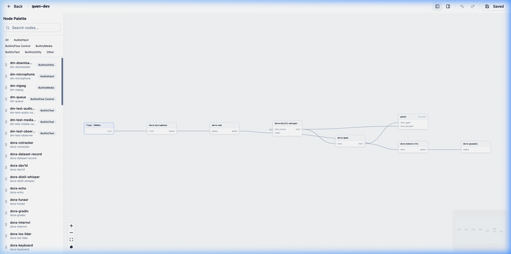

# dm — Dora Manager

A powerful Rust-based CLI, HTTP API, and Visual Panel for managing [dora-rs](https://github.com/dora-rs/dora) environments. `dm` goes beyond simple version management by providing a dataflow transpiler, reactive UI widgets, and full runtime orchestration.

## 🎨 Interactive Graph Editor

The centerpiece of Dora Manager is its high-performance, SvelteFlow-based Visual Editor. You can build, visualize, and edit Dora dataflows directly in your browser.

<p align="center">
  
</p>

- **Right-Click Context Menus**: Seamless node duplication, edge deletion, and quick inspections straight from the canvas workspace.
- **Floating Inspector**: A draggable, resizable window exposing rich configuration schemas dynamically parsed from each Node's capabilities.
- **Real-time Synchronization**: Every edge drawn, duplicate created, and property edited on the visual field binds symmetrically to the underlying YAML model.

### UI Previews

<table align="center">
  <tr>
    <td align="center"><b>Split-View Dataflow Canvas</b></td>
    <td align="center"><b>Deep-Schema Config Inspector</b></td>
  </tr>
  <tr>
    <td align="center"></td>
    <td align="center"></td>
  </tr>
</table>

<br/>

## 🚀 Key Features

- **Visual Dataflow Orchestration**: A stunning Svelte/Tailwind web panel with real-time grid layouts, lazy tab loading, and responsive tracking.
- **Smart Reactive Widgets**: Expand `dora-rs` nodes with an immersive arsenal of custom widgets, including sliders, multi-select checkboxes, switches, path selectors (`PathPicker`), and rich media viewers (video via `plyr`, audio, and interactive `JSON` trees).
- **Built-in Node Ecosystem**: Ships with specialized, data-agnostic nodes:
  - `dm-downloader`: HTTP file fetching with SHA/MD5 hashing, automatic zip extraction, and interactive panel bindings.
  - `dm-queue`: High-performance buffer queue with metadata passthrough and idle flush mechanisms.
  - `dm-mjpeg` & `dm-microphone`: Media ingestion fully wired with dynamic control switches.
- **System Health Diagnostics**: Built-in real-time probes (`doctor`) and CPU/Memory usage badges for tracking active run metrics.
- **Dataflow Transpiler**: Translates extended YAML (containing `node:` references and `config:` blocks) into standard dora-rs executable YAML through a multi-pass pipeline: node path resolution, four-layer config merging (inline > flow > node > schema default) into environment variables, Panel node injection, and port schema compatibility validation.

## 🏗️ Architecture

```text
dm-core   (lib)   → Core logic: Transpiler, Node management, Run scheduling
dm-cli    (bin)   → CLI & Terminal UI (colored output, progress bars)
dm-server (bin)   → Axum HTTP API (REST on port 3210)
web       (Svelte)→ Reactive visual panel with WebSocket real-time interaction
```

## 🧠 Design Philosophy

`dm` treats [dora-rs](https://github.com/dora-rs/dora) as its underlying **multi-language dataflow runtime** — a high-performance process orchestrator built on Apache Arrow that enables zero-copy, shared-memory communication between nodes written in Rust, Python, C++, and more. On top of this runtime, `dm` provides a management layer that organizes work around three core entities:

### 1. Nodes
Nodes are independent, language-agnostic executable units (Rust, Python, C++). Each Node's interface and behavior is defined by its **`dm.json`** contract:
* **`executable`**: Entry point path for the node binary/script
* **`ports`**: Input/output port definitions, optionally with `schema` for transpile-time type compatibility checking
* **`config_schema`**: Configuration parameters with types, defaults, and environment variable mappings (`env` field)
* **`widgets`**: Frontend widget declarations for the Web Panel
* **`dependencies`**: Runtime dependency declarations (e.g., Python virtual environment paths)

### 2. Dataflows
A Dataflow is a `.yml` topology file describing how node instances are wired together. Users reference installed nodes via `node:` (instead of raw `path:`), and the transpiler handles the rest:
1. Resolves `node: dora-qwen` to the node's absolute executable path
2. Merges `config:` values from four layers (inline > flow > node > schema default) into environment variables
3. Validates port schema compatibility across connections
4. Injects Panel node runtime parameters

> **Note**: Dataflows currently enforce input port in-degree limits only (each input port accepts at most one source). No cycle detection or DAG enforcement is performed.

### 3. Runs
Once started, a Dataflow blueprint becomes a **Run** — a tracked lifecycle entity.
* Runs record per-node CPU/Memory utilization and stdout/stderr logs.
* The Web Panel communicates with running nodes via WebSocket, supporting real-time parameter adjustment through Smart Widgets.

---

## ⚡ Quick Start

### 1. Build the Suite

Since the SvelteKit frontend is statically embedded directly into the Rust backend server, you must compile the web assets before compiling the Rust crates.

```bash
# Build the SvelteKit Visual Panel
cd web
npm install
npm run build
cd ..

# Build the Rust suite (dm-cli & dm-server)
cargo build --release
```

### 2. Enter the Visual Editor

To spin up the orchestrated API and Visual Panel, simply start the server:

```bash
./target/release/dm-server
```

**Next, open your browser and navigate to: [http://127.0.0.1:3210](http://127.0.0.1:3210) to access the Interactive Graph Editor!**

> 💡 **Tip for Developers**: You can use `./dev.sh` to spin up both the Rust backend and the SvelteKit development server (with Hot Module Replacement) simultaneously.

### 3. Manage Environments (CLI)

You can still use the powerful CLI tool to orchestrate environments silently:

```bash
# Environment lifecycle
./target/release/dm install
./target/release/dm doctor
./target/release/dm use 0.4.1

# Dataflow execution
./target/release/dm up
./target/release/dm start dataflow.yml
./target/release/dm down
```

## 📸 Try it out: OpenCV Camera Pipeline

Try out a real-world computer vision dataflow using your webcam in under 30 seconds. This will also boot up a reactive visual panel to monitor the data stream in real-time!

1. **Create `quickstart.yml`**
```yaml
nodes:
  - id: camera
    path: opencv-video-capture
    inputs:
      tick: dora/timer/millis/30
    outputs:
      - image

  - id: plot
    path: opencv-plot
    inputs:
      image: camera/image
```

2. **Run it**
```bash
# Automatically downloads nodes into isolated python venvs, transpiles the graph, and streams your webcam!
# Open the provided web link to view the reactive Panel.
cargo run -- run quickstart.yml
```

## 🔌 HTTP API

The Axum REST server binds on `3210` by default.
```bash
curl http://127.0.0.1:3210/api/doctor
curl http://127.0.0.1:3210/api/versions
curl http://127.0.0.1:3210/api/status
curl -X POST http://127.0.0.1:3210/api/install -H 'Content-Type: application/json' -d '{"version":"0.4.1"}'
curl -X POST http://127.0.0.1:3210/api/up
curl -X POST http://127.0.0.1:3210/api/down
```

## ⚙️ Configuration

- **Home directory**: `~/.dm` (override with `--home` flag or `DM_HOME` env var)
- **Config file**: `~/.dm/config.toml`
- **Versions**: `~/.dm/versions/<version>/dora`

## ⚠️ Known Limitations

`dm` is under active development. The following are known limitations:

- **Graph Editor is early-stage**: The visual editor covers basic operations but lacks advanced features such as auto-layout for complex topologies, undo/redo history, and multi-select batch operations.
- **Limited test coverage**: The project currently has low unit and integration test coverage, with no CI/CD pipeline in place.
- **Network-dependent installation**: `dm install` and node downloads rely on GitHub Releases. Offline mode is not yet supported.
- **Single-machine only**: The current architecture is designed for single-machine deployment. Distributed multi-node cluster scheduling is not supported.
- **No topology validation**: The transpiler does not perform cycle detection or topological sorting. Only port in-degree limits and schema compatibility are checked.
- **Incomplete documentation**: The full `dm.json` specification, node development guide, and API reference documentation are still in progress.
- **Windows compatibility untested**: Development and testing have been primarily on macOS and Linux. Windows compatibility has not been fully verified.

## 📦 Install Strategy

1. **Binary download** from GitHub Releases (fastest).
2. **Build from source** via `cargo build` if no binary is available for your platform.
3. Node distribution (`dm-node-install`) uses a `cargo-binstall`-inspired strategy for smooth plugin deployments.

## 🤖 Development Note

This project has a high [VibeCoding](https://en.wikipedia.org/wiki/Vibe_coding) content. The majority of the codebase was built with significant assistance from AI coding agents, primarily **Antigravity** (Google DeepMind) and **Codex** (OpenAI). Human effort was focused on architecture decisions, product design, and quality review.

## 📄 License

Apache-2.0

