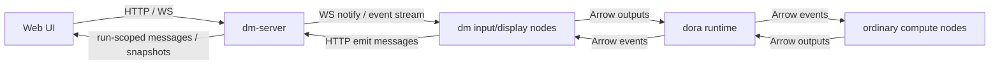

# Panel Ontology Memo

> Status: Steering memo  
> Purpose: clarify what `panel` / interaction really is in Dora Manager before continuing SDK, `dm.json`, or runtime-proxy design work.

## 1. Why This Memo Exists

The project is at risk of circling around the same problem in different forms:

- an explicit `dm-panel` node was too heavy and polluted the graph
- moving interaction logic into `dm-server` cleaned the graph but pushed protocol and lifecycle code into many nodes
- adding more runtime proxy behavior risks recreating an invisible `dm-panel`

This is not primarily an implementation problem. It is a modeling problem.

Before deciding whether to build a DM SDK, a thin helper, a `dm.json` capability protocol, or a runtime adapter, we need to answer a more basic question:

**What is panel / interaction in dm, ontologically?**

## 2. The Historical Loop

The project has already explored three forms of the same idea.

### 2.1 Explicit `dm-panel`

Original direction:

- `dm-panel` was a real node
- it had inputs and outputs
- all external interaction passed through it

Benefit:

- the architecture was honest
- the graph showed where browser interaction entered and exited the system

Cost:

- `dm-panel` became a god node
- many dataflows visually collapsed into “everything connects to panel”
- the canvas became less useful as a representation of actual business logic

### 2.2 Server-Client Nodes

Later direction:

- remove the explicit god node from the graph
- move panel behavior into `dm-server`
- create “server client nodes” such as `dm-text-input`, `dm-button`, `dm-slider`, `dm-display`

Benefit:

- the graph became much cleaner
- interaction widgets looked like ordinary domain nodes

Cost:

- panel logic was no longer centralized
- nodes started reimplementing DM-specific concerns:
  - env parsing
  - websocket connection management
  - message emit
  - stop-aware shutdown
  - widget registration

### 2.3 Implicit Runtime Proxy

Current tempting direction:

- keep the graph clean
- keep nodes simple
- let runtime or `dm-server` proxy interaction for them

Benefit:

- best ergonomics on paper
- less repeated glue code in nodes

Cost:

- this is functionally an invisible `dm-panel`
- the system still has a special interaction authority, but now it is harder to see
- architecture truth becomes implicit

## 3. Current External Truth

Whatever abstractions we prefer, the current system already has two distinct planes.

### 3.1 Dora Data Plane

This is the normal `dora` world:

- node processes
- Arrow payloads
- `node.send_output(...)`
- `for event in node`
- `ports`
- YAML topology

This is the true computation/dataflow plane.

### 3.2 DM Interaction Plane

This is the DM-specific world:

- run-scoped message persistence
- widget registration
- browser input events
- display snapshots and history
- websocket notify / HTTP fetch pattern
- stop-aware UI and run lifecycle semantics

This already exists today, even though it is only partially formalized.

Examples already present in the repo:

- `dm.json.interaction.emit`
- `config_schema.x-widget`
- `/api/runs/:id/messages`
- `/api/runs/:id/messages/ws`
- run-scoped message snapshots and history

So the real architecture is already **two-plane**, even if we do not yet name it that way.

## 4. Current Communication Flow

The current interaction flow is roughly this:

This means:

- ordinary compute still uses the `dora` data plane
- interaction nodes already participate in both planes
- `dm-server` is already acting like an interaction hub

That is why the architecture feels circular: the “panel authority” never disappeared. It only changed representation.

## 5. The Core Question

The real design question is not:

- “Should we add an SDK?”
- “Should listen/emit go through ports?”

The real question is:

**Is panel / interaction a node, a runtime capability, or a special binding between the two?**

Only a few honest answers exist.

## 6. Three Ontology Candidates

### 6.1 Panel Is A Real Node

Meaning:

- interaction is just another participant in the graph
- browser/UI is represented through an explicit node

Pros:

- honest
- visible
- easy to explain

Cons:

- graph pollution
- god-node topology
- poor UX in editor/canvas

### 6.2 Panel Is A Runtime Capability

Meaning:

- interaction is built into the dm runtime layer
- nodes declare they use DM capabilities, but no explicit graph node appears

Pros:

- clean graph
- better ergonomics
- less per-node boilerplate

Cons:

- risks hidden magic
- can recreate an invisible god node
- harder to keep architectural truth visible

### 6.3 Panel Is A Special Binding

Meaning:

- interaction is not an ordinary node
- but it is also not “nothing”
- it is a system-level capability that binds UI-facing semantics onto selected nodes/ports

Pros:

- keeps the graph cleaner than a literal panel node
- is more honest than pretending interaction does not exist
- matches the current system better than either extreme

Cons:

- requires explicit modeling
- editor and runtime need to represent something that is not a normal edge/node

## 7. Recommended Judgment

Current recommendation:

**Treat panel / interaction as a special binding layer, not as an ordinary node and not as invisible magic.**

In other words:

- the `dora` graph remains the data plane
- DM interaction remains a distinct capability plane
- the capability plane should be explicitly declared in `dm.json`
- the editor/runtime may later need a visible representation for these bindings, but not necessarily a normal “panel node”

This is the least dishonest model we have found so far.

## 8. What This Means For `ports`

Ports should stay responsible for:

- real node-to-node dataflow
- Arrow schema contracts
- computation semantics

Ports should not silently absorb all DM-specific interaction semantics.

That said, DM capability bindings may still refer to ports.

Example idea:

- a normal output port remains an output port
- `dm.json` may additionally declare that this port is bound to a DM display or interaction role

So the likely direction is:

- **ports remain the data contract**
- **`dm.json` declares the DM interpretation / binding**

This avoids both bad extremes:

- not everything becomes an ad hoc side channel
- not everything is forced into ordinary port semantics

## 9. What This Means For SDKs Or Helpers

This memo does **not** recommend building a full parallel DM runtime SDK.

Why:

- that would create a double-SDK story on top of `dora`
- it would likely need to be repeated across Python, Rust, C, and C++
- it would treat the symptom before the model is stable

If helpers exist, they should be treated as:

- transport conveniences
- reference implementations
- thin adapters over a declared DM capability contract

Not as a second runtime.

## 10. Candidate Design Rule

A useful design rule going forward:

> `dora` owns execution and dataflow.  
> `dm` owns product-level capability binding.  
> `dm.json` declares where those two touch.

Under this rule:

- ordinary business data goes through `ports`
- DM-specific interaction/display/control capabilities are declared in `dm.json`
- runtime/server can bridge those capabilities without pretending they are ordinary compute edges

## 11. Minimal Next Experiment

Do not design the whole system yet.

Run one narrow experiment:

1. pick `dm-text-input` and `dm-display`
2. define one explicit `dm.json` capability-binding schema for them
3. keep their normal `ports` untouched
4. let runtime validate declared DM roles/channels against actual interaction usage
5. observe whether this makes the architecture clearer without reintroducing a visible god node

Success criteria:

- node authors do not need a second full SDK mental model
- ports still describe actual dataflow truth
- DM interaction no longer depends on undocumented per-node glue code
- the system names the hidden interaction plane instead of pretending it is not there

## 12. Open Questions

This memo intentionally leaves several questions open:

- should capability bindings attach to ports, or to higher-level named channels?
- should the editor render capability bindings visually, and if so how?
- should there be a visible but collapsed “panel overlay” rather than a literal panel node?
- how much of the interaction transport should be standardized across languages before helpers are written?

These should be answered only after the ontology choice above is accepted.
