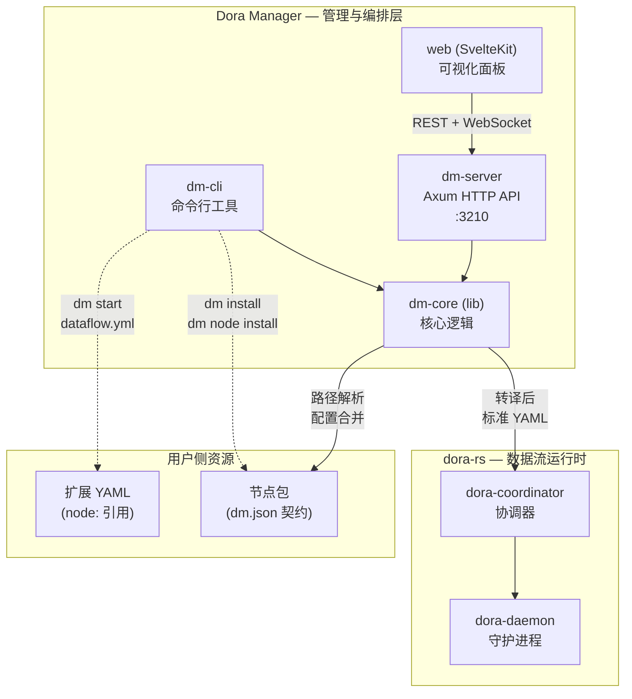
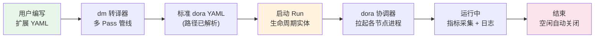

Dora Manager（简称 `dm`）是一个基于 Rust 构建的 **数据流编排与管理平台**，它为 [dora-rs](https://github.com/dora-rs/dora) —— 一个基于 Apache Arrow 的高性能多语言数据流运行时 —— 提供了三层管理能力：**命令行工具（CLI）、HTTP API 服务和可视化 Web 面板**。如果你已经熟悉 docker / docker-compose 的关系，可以把 dora-rs 类比为容器运行时，而 Dora Manager 则是站在它之上的编排与管理层，负责节点包的安装调度、数据流拓扑的转译执行、以及运行时状态的可观测与交互。

Sources: [README.md](https://github.com/l1veIn/dora-manager/blob/master/README.md), [README_zh.md](https://github.com/l1veIn/dora-manager/blob/master/README_zh.md)

## dora-rs 与 Dora Manager：上下两层的关系

理解 Dora Manager 的第一步，是弄清它与底层 dora-rs 之间的分工。**dora-rs** 是一个面向机器人与 AI 领域的进程编排引擎，节点之间通过共享内存以 Apache Arrow 格式进行零拷贝数据交换，天然支持 Rust、Python、C++ 等多种语言。但它本身只关心"如何把一组进程跑起来并让它们互相通信"——对于"节点从哪里来""YAML 怎么写更方便""运行时状态如何可视化"等问题，它并不提供答案。

**Dora Manager 正是在这些问题上构建的增值层**。它将 dora-rs 视为一个黑盒运行时，在其之上封装了三件事：节点生命周期管理（安装、导入、隔离）、数据流转译（将用户友好的扩展 YAML 翻译为 dora-rs 原生格式）、以及运行时可观测性（Web 面板、指标采集、日志追踪、实时交互）。这意味着你可以用 `dm` 一键完成从安装节点到启动数据流再到在浏览器中调试交互的完整闭环，而不需要手动配置 Python 虚拟环境、手写绝对路径、或用终端日志猜测节点状态。

Sources: [README.md](https://github.com/l1veIn/dora-manager/blob/master/README.md), [docs/architecture-principles.md](https://github.com/l1veIn/dora-manager/blob/master/docs/architecture-principles.md#L1-L10)

下面的架构图展示了 Dora Manager 各组件之间的协作关系以及它们与 dora-rs 运行时的边界：



Sources: [README.md](https://github.com/l1veIn/dora-manager/blob/master/README.md), [crates/dm-server/src/main.rs](https://github.com/l1veIn/dora-manager/blob/master/crates/dm-server/src/main.rs#L78-L95)

## 三层架构：dm-core / dm-cli / dm-server

Dora Manager 的后端代码组织为三个 Rust crate，它们遵循**核心逻辑与入口分离**的分层原则：

| Crate | 类型 | 职责 | 关键能力 |
|-------|------|------|----------|
| **dm-core** | 库（lib） | 所有业务逻辑的承载层 | 转译器、节点管理、运行调度、事件存储、环境管理 |
| **dm-cli** | 二进制（bin） | 终端用户界面 | 彩色输出、进度条、命令分发，依赖 dm-core |
| **dm-server** | 二进制（bin） | HTTP API 服务 | Axum 路由、WebSocket 交互、Swagger 文档、前端静态资源嵌入 |

`dm-core` 是整个系统的"大脑"——不依赖任何特定的节点类型，不包含任何硬编码的节点 ID，纯粹负责数据流生命周期管理、YAML 转译、路径解析和配置合并。`dm-cli` 和 `dm-server` 两个入口共享同一套核心逻辑，分别服务于终端场景和 Web 场景。前端 SvelteKit 应用通过 `rust_embed` 在编译时被静态嵌入到 `dm-server` 的二进制文件中，发布时只需一个二进制文件即可同时提供 API 服务和 Web 界面。

Sources: [Cargo.toml](https://github.com/l1veIn/dora-manager/blob/master/Cargo.toml), [crates/dm-core/src/lib.rs](https://github.com/l1veIn/dora-manager/blob/master/crates/dm-core/src/lib.rs#L1-L21), [docs/architecture-principles.md](https://github.com/l1veIn/dora-manager/blob/master/docs/architecture-principles.md#L48-L65)

## 三个核心概念：节点、数据流、运行实例

Dora Manager 围绕三个核心概念组织所有功能，初学者需要首先理解它们之间的关系。

### 节点（Node）— dm.json 契约驱动的可执行单元

**节点**是系统中最基本的构建块，每个节点都是一个独立运行的可执行单元（可以是 Python 脚本、Rust 二进制或 C++ 程序）。每个节点的接口、配置和元信息由一个名为 **`dm.json`** 的契约文件定义。以下是 `dm-slider` 节点的 `dm.json` 关键字段示例：

```json
{
  "id": "dm-slider",
  "executable": ".venv/bin/dm-slider",
  "ports": [
    { "id": "value", "direction": "output", "schema": { "type": { "name": "float64" } } }
  ],
  "config_schema": {
    "label":   { "default": "Value", "env": "LABEL" },
    "min_val": { "default": 0, "env": "MIN_VAL" },
    "max_val": { "default": 100, "env": "MAX_VAL" }
  }
}
```

这个契约声明了节点的可执行入口（`executable`）、数据端口（`ports`，可带 Arrow 类型 Schema）和可配置参数（`config_schema`，每个参数通过 `env` 字段映射为环境变量）。系统内置了丰富的节点生态，从媒体采集（`dm-screen-capture`、`dm-microphone`）、数据工具（`dm-queue`、`dm-log`、`dm-save`）到 AI 推理（`dora-qwen`、`dora-distil-whisper`、`dora-kokoro-tts`），覆盖了构建语音交互或计算机视觉流程的常见需求。

Sources: [README.md](https://github.com/l1veIn/dora-manager/blob/master/README.md), [nodes/dm-slider/dm.json](https://github.com/l1veIn/dora-manager/blob/master/nodes/dm-slider/dm.json#L1-L83), [nodes/dora-qwen/dm.json](https://github.com/l1veIn/dora-manager/blob/master/nodes/dora-qwen/dm.json#L1-L39)

### 数据流（Dataflow）— YAML 拓扑与转译

**数据流**是一个 `.yml` 文件，描述了节点实例之间的连接拓扑。Dora Manager 定义了一套**扩展 YAML 语法**，用户通过 `node:` 字段引用已安装的节点（而非 dora-rs 原生的 `path:` 绝对路径），转译器会在启动时完成以下工作：

1. **路径解析**：将 `node: dora-qwen` 解析为该节点实际可执行文件的绝对路径
2. **配置四层合并**：按照 `inline > flow > node > schema default` 的优先级合并配置值，注入为环境变量
3. **端口 Schema 校验**：检查连线两端端口的数据类型兼容性
4. **运行时参数注入**：为交互节点注入 WebSocket 地址等运行时信息

以下是一个系统测试数据流的片段，展示了 `node:` 引用方式和节点间的连接：

```yaml
nodes:
  - id: text_sender
    node: pyarrow-sender
    outputs:
      - data

  - id: text_echo
    node: dora-echo
    inputs:
      data: text_sender/data
    outputs:
      - data
```

Sources: [README.md](https://github.com/l1veIn/dora-manager/blob/master/README.md), [tests/dataflows/system-test-happy.yml](https://github.com/l1veIn/dora-manager/blob/master/tests/dataflows/system-test-happy.yml#L1-L49)

### 运行实例（Run）— 生命周期追踪实体

当数据流被启动后，它就变成了一个 **Run**（运行实例）——一个被系统追踪的完整生命周期实体。每个 Run 记录了所属数据流的转译后 YAML、各节点的 CPU / 内存使用指标、标准输出与错误日志。Web 面板通过 WebSocket 与运行中的节点实时通信，支持通过交互组件动态调整参数。系统还提供了自动空闲检测机制——当所有 Run 结束后，后台会自动关闭 dora 协调器以释放资源。

Sources: [README.md](https://github.com/l1veIn/dora-manager/blob/master/README.md), [crates/dm-server/src/main.rs](https://github.com/l1veIn/dora-manager/blob/master/crates/dm-server/src/main.rs#L234-L241)

下面的流程图展示了从编写 YAML 到数据流运行完成的全生命周期：



## 项目目录结构一览

项目采用 Rust workspace + SvelteKit 前端的混合结构。以下是精简后的关键目录说明：

| 目录 | 内容 | 说明 |
|------|------|------|
| `crates/dm-core/` | 核心库 | 转译器、节点管理、运行调度、事件存储 |
| `crates/dm-cli/` | CLI 入口 | 命令行工具，彩色输出与进度条 |
| `crates/dm-server/` | API 服务 | Axum 路由、WebSocket、Swagger UI |
| `web/` | SvelteKit 前端 | 可视化面板、图编辑器、响应式组件 |
| `nodes/` | 内置节点包 | 每个子目录为一个节点，含 `dm.json` 契约 |
| `tests/dataflows/` | 测试数据流 | 系统集成测试用的 YAML 文件 |
| `docs/` | 设计文档 | 架构原则、各子系统设计、开发日志 |

Sources: [Cargo.toml](https://github.com/l1veIn/dora-manager/blob/master/Cargo.toml), [crates/dm-core/src/lib.rs](https://github.com/l1veIn/dora-manager/blob/master/crates/dm-core/src/lib.rs#L1-L11)

## 设计哲学：节点业务纯度与节点无关的核心引擎

Dora Manager 的架构决策遵循一套明确的设计原则，其中最重要的两条是：

**节点业务纯度**：每个节点只做一件事——要么是计算（如 AI 推理），要么是存储（如数据持久化），要么是交互（如 UI 控件）。如果一个节点开始做两件事，就应该被拆分为两个节点。这使得节点的组合方式更加灵活，测试和复用也更加简单。

**核心引擎节点无关**：`dm-core` 不包含任何特定节点的知识——不硬编码节点 ID，不包含节点特化的枚举变体，不存储节点专属元数据。如果某个节点需要框架层面的特殊支持，这种支持属于应用层（dm-server / dm-cli），而非核心库。这保证了核心引擎的稳定性和可扩展性。

Sources: [docs/architecture-principles.md](https://github.com/l1veIn/dora-manager/blob/master/docs/architecture-principles.md#L9-L65)

## 当前局限与改进方向

Dora Manager 仍处于活跃开发阶段，以下几个方面的成熟度需要注意：

- **图编辑器尚在早期**：可视化编辑器已覆盖基本操作（连线、属性编辑、节点复制），但缺少自动布局、撤销/重做和多选批量操作
- **测试覆盖率较低**：项目整体缺少完善的单元测试和集成测试体系
- **仅支持单机部署**：当前架构不支持分布式多机集群调度
- **无拓扑校验**：转译器不执行环检测或拓扑排序，仅做端口入度限制和 Schema 兼容性校验
- **网络依赖**：`dm install` 和节点下载依赖 GitHub Releases，暂不支持离线安装
- **Windows 兼容性未验证**：主要开发测试环境为 macOS 和 Linux

Sources: [README.md](https://github.com/l1veIn/dora-manager/blob/master/README.md)

## 下一步阅读建议

掌握了项目全貌之后，建议按以下路径深入：

1. **动手实践**：前往 [快速开始：构建、启动与运行第一个数据流](02-quickstart) 从零构建并运行一个实际的数据流
2. **搭建开发环境**：通过 [开发环境搭建与热更新工作流](03-dev-environment) 配置前后端联编的开发模式
3. **理解核心概念**：依次阅读 [节点（Node）：dm.json 契约与可执行单元](04-node-concept) → [数据流（Dataflow）：YAML 拓扑与节点连接](05-dataflow-concept) → [运行实例（Run）：生命周期、状态与指标追踪](06-run-lifecycle)
4. **深入架构**：对后端感兴趣的开发者可进入 [整体架构：dm-core / dm-cli / dm-server 分层设计](07-architecture-overview) 了解各 crate 的内部模块设计