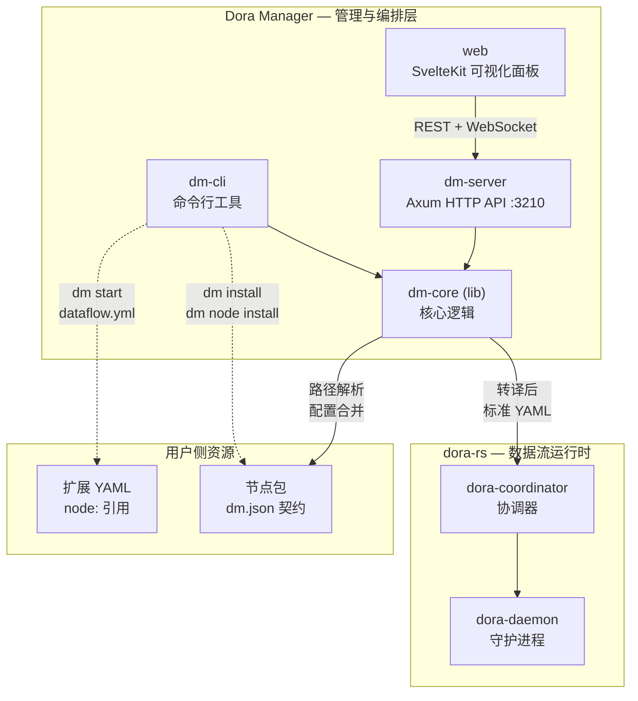
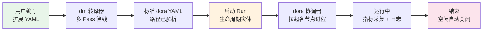

Dora Manager（简称 `dm`）是一个基于 Rust 构建的**数据流编排与管理平台**，它为 [dora-rs](https://github.com/dora-rs/dora) —— 一个基于 Apache Arrow 的高性能多语言数据流运行时 —— 提供了三层管理能力：**命令行工具（CLI）、HTTP API 服务和 Web 可视化面板**。如果你正在寻找一种方式，把 AI 模型、媒体采集、语音处理等异构能力像乐高积木一样拼装成可运行的应用，Dora Manager 就是为此而生的工具。它不是 dora-rs 的替代品，而是在 dora-rs 之上构建的增值管理层——将 dora-rs 从一个强大的底层引擎，变为一个开发者可以直接用来构建、运行和观察应用的完整平台。

Sources: [README.md](https://github.com/l1veIn/dora-manager/blob/main/README.md), [README_zh.md](https://github.com/l1veIn/dora-manager/blob/main/README_zh.md), [PROJECT_CONSTITUTION.md](https://github.com/l1veIn/dora-manager/blob/main/PROJECT_CONSTITUTION.md)

## dora-rs 与 Dora Manager：运行时与管理层的关系

理解 Dora Manager 的第一步，是弄清它与底层 dora-rs 之间的分工。**dora-rs** 是一个面向机器人与 AI 领域的进程编排引擎：节点之间通过共享内存以 Apache Arrow 格式进行零拷贝数据交换，天然支持 Rust、Python、C++ 等多种语言。但它本身不提供节点包管理、可视化配置、运行时监控或交互控件——这些正是 **Dora Manager** 要解决的问题。

下面的架构图展示了 Dora Manager 各组件之间的协作关系以及它们与 dora-rs 运行时之间的边界：



从图中可以看出，用户通过 Dora Manager 的 CLI 或 Web 面板操作时，指令会经过 `dm-core` 的处理——包括转译扩展 YAML、解析节点路径、合并配置——然后将标准的 dora-rs YAML 交给 dora-rs 的 coordinator 执行。用户始终在更高层的抽象上工作，而不需要直接接触 dora-rs 的实现细节。

Sources: [README.md](https://github.com/l1veIn/dora-manager/blob/main/README.md), [crates/dm-server/src/main.rs](https://github.com/l1veIn/dora-manager/blob/main/crates/dm-server/src/main.rs#L79-L95), [docs/blog/building-dora-manager-with-ai.md](https://github.com/l1veIn/dora-manager/blob/main/docs/blog/building-dora-manager-with-ai.md#L12-L19)

## 三层后端架构：dm-core / dm-cli / dm-server

Dora Manager 的后端代码组织为三个 Rust crate，遵循**核心逻辑与入口分离**的分层原则。这种设计确保了业务逻辑只存在于一个地方（`dm-core`），而 CLI 和 HTTP 服务两个入口共享同一套经过验证的核心逻辑。

| Crate | 类型 | 职责 | 关键能力 |
|-------|------|------|----------|
| **dm-core** | 库（lib） | 所有业务逻辑的承载层 | 转译器、节点管理、运行调度、事件存储、环境管理 |
| **dm-cli** | 二进制（bin） | 终端用户界面 | 彩色输出、进度条、命令分发，依赖 dm-core |
| **dm-server** | 二进制（bin） | HTTP API 服务 | Axum 路由、WebSocket 实时交互、Swagger 文档、前端静态资源嵌入 |

`dm-core` 是整个系统的"大脑"——它不依赖任何特定的节点类型，不包含任何硬编码的节点 ID，纯粹负责数据流生命周期管理、YAML 转译、路径解析和配置合并。`dm-cli` 和 `dm-server` 两个入口共享同一套核心逻辑，分别服务于终端场景和浏览器场景。

Sources: [Cargo.toml](https://github.com/l1veIn/dora-manager/blob/main/Cargo.toml), [crates/dm-core/Cargo.toml](https://github.com/l1veIn/dora-manager/blob/main/crates/dm-core/Cargo.toml#L1-L8), [crates/dm-cli/Cargo.toml](https://github.com/l1veIn/dora-manager/blob/main/crates/dm-cli/Cargo.toml#L1-L14), [crates/dm-server/Cargo.toml](https://github.com/l1veIn/dora-manager/blob/main/crates/dm-server/Cargo.toml#L1-L14), [docs/architecture-principles.md](https://github.com/l1veIn/dora-manager/blob/main/docs/architecture-principles.md#L47-L65)

## 三个核心概念：节点、数据流、运行实例

Dora Manager 围绕三个核心概念组织所有功能。初学者需要首先理解它们之间的层级关系：**节点**是最小构建块，**数据流**定义了节点之间的连接拓扑，**运行实例**则是一个被系统追踪的数据流执行过程。



### 节点（Node）—— dm.json 契约驱动的可执行单元

**节点**是系统中最基本的构建块。每个节点都是一个独立运行的可执行单元（可以是 Python 脚本、Rust 二进制或 C++ 程序）。每个节点的接口、配置和元信息由一个名为 **`dm.json`** 的契约文件定义。以下是 `dm-slider` 节点的 `dm.json` 中关键字段的含义：

| 字段 | 含义 | 示例 |
|------|------|------|
| `executable` | 节点的可执行入口路径 | `.venv/bin/dm-slider` |
| `ports` | 输入/输出端口定义，可附带 Arrow 类型 Schema | `value` 端口输出 `float64` |
| `config_schema` | 可配置参数，通过 `env` 字段映射为环境变量 | `label`、`min_val`、`max_val` |
| `capabilities` | 声明节点的能力类型（如 `widget_input`） | 前端控件注册与输入绑定 |
| `runtime` | 运行时语言与版本要求 | `python >= 3.10` |

系统内置了丰富的节点生态，从媒体采集（`dm-screen-capture`、`dm-microphone`）到 AI 推理（`dora-qwen`、`dora-yolo`）到逻辑控制（`dm-and`、`dm-gate`），共计 **28 个内置节点**，覆盖了交互、媒体、存储、逻辑和 AI 等多个分类。

Sources: [nodes/dm-slider/dm.json](https://github.com/l1veIn/dora-manager/blob/main/nodes/dm-slider/dm.json#L1-L119), [registry.json](https://github.com/l1veIn/dora-manager/blob/main/registry.json), [docs/blog/building-dora-manager-with-ai.md](https://github.com/l1veIn/dora-manager/blob/main/docs/blog/building-dora-manager-with-ai.md#L39-L70)

### 数据流（Dataflow）—— YAML 拓扑与自动转译

**数据流**是一个 `.yml` 文件，描述了节点实例之间的连接拓扑。Dora Manager 定义了一套**扩展 YAML 语法**，用户通过 `node:` 字段引用已安装的节点（而非 dora-rs 原生的 `path:` 绝对路径）。以下是一个最简单的开箱即用 demo：

```yaml
# demos/demo-hello-timer.yml
nodes:
  - id: echo
    node: dora-echo
    inputs:
      value: dora/timer/millis/1000
    outputs:
      - value

  - id: display
    node: dm-display
    inputs:
      data: echo/value
    config:
      label: "Timer Tick"
      render: text
```

转译器在启动时会完成四项关键工作：**路径解析**（将 `node: dora-echo` 解析为可执行文件的绝对路径）、**配置四层合并**（按 `inline > flow > node > schema default` 优先级合并后注入为环境变量）、**端口 Schema 校验**（检查连线两端端口的数据类型兼容性）、**运行时参数注入**（为交互节点注入 WebSocket 地址等信息）。

Sources: [demos/demo-hello-timer.yml](demos/demo-hello-timer.yml#L1-L39), [README.md](https://github.com/l1veIn/dora-manager/blob/main/README.md), [docs/blog/building-dora-manager-with-ai.md](https://github.com/l1veIn/dora-manager/blob/main/docs/blog/building-dora-manager-with-ai.md#L72-L83)

### 运行实例（Run）—— 生命周期追踪实体

当数据流被启动后，它就变成了一个 **Run**（运行实例）——一个被系统追踪的完整生命周期实体。每个 Run 记录了所属数据流的转译后 YAML、各节点的 CPU / 内存使用指标、标准输出与错误日志。Web 面板通过 WebSocket 与运行中的节点实时交互，支持通过响应式控件（Widgets）动态调整运行参数。

Sources: [crates/dm-core/src/runs/mod.rs](https://github.com/l1veIn/dora-manager/blob/main/crates/dm-core/src/runs/mod.rs), [crates/dm-server/src/main.rs](https://github.com/l1veIn/dora-manager/blob/main/crates/dm-server/src/main.rs#L223-L224)

## 前端架构：SvelteKit 可视化面板

Dora Manager 的前端是一个基于 **SvelteKit + SvelteFlow + Tailwind CSS** 构建的单页应用，通过 `rust-embed` 在发布时静态嵌入到 `dm-server` 二进制中，实现真正的**单文件部署**——一个二进制即可同时提供 API 和 Web UI。

前端的核心页面与功能包括：

| 页面 / 功能 | 说明 |
|------------|------|
| **可视化图编辑器** | 基于 SvelteFlow 构建的交互式数据流编辑器，支持拖拽连线、右键菜单、浮动 Inspector 面板，所有编辑实时同步到底层 YAML |
| **运行工作台** | 网格布局的面板系统，支持实时日志查看、CPU/内存指标展示、响应式控件交互 |
| **节点管理** | 节点列表、安装/卸载、状态查看 |
| **数据流管理** | 数据流列表、配置、版本历史 |
| **运行历史** | 运行实例列表、指标图表、日志回放 |

Sources: [web/package.json](https://github.com/l1veIn/dora-manager/blob/main/web/package.json#L1-L68), [crates/dm-server/src/main.rs](https://github.com/l1veIn/dora-manager/blob/main/crates/dm-server/src/main.rs#L20-L22), [crates/dm-server/src/main.rs](https://github.com/l1veIn/dora-manager/blob/main/crates/dm-server/src/main.rs#L234-L235)

## 项目目录结构一览

项目采用 Rust workspace + SvelteKit 前端的混合结构。以下是关键目录及其职责：

| 目录 | 内容 | 说明 |
|------|------|------|
| `crates/dm-core/src/` | 核心库 | 转译器（`dataflow/transpile`）、节点管理（`node/`）、运行调度（`runs/`）、事件存储（`events/`） |
| `crates/dm-cli/` | CLI 入口 | 命令行工具，彩色输出与进度条，`dm` 二进制 |
| `crates/dm-server/` | API 服务 | Axum 路由（40+ 端点）、WebSocket、Swagger UI，`dm-server` 二进制 |
| `web/` | SvelteKit 前端 | 可视化面板、图编辑器、响应式控件、i18n |
| `nodes/` | 内置节点包 | 每个子目录为一个节点，含 `dm.json` 契约和可执行代码 |
| `demos/` | 示例数据流 | 4 个开箱即用的 demo，从最简计时器到 YOLO 目标检测 |
| `tests/dataflows/` | 测试数据流 | 系统集成测试用的 YAML 文件 |
| `docs/` | 设计文档 | 架构原则、各子系统设计、开发日志 |
| `scripts/` | 工具脚本 | 一键安装脚本（`install.sh`）、数据迁移工具 |

节点的发现顺序为：首先查找用户安装的 `~/.dm/nodes`，然后查找仓库内置的 `nodes/` 目录，最后查找 `DM_NODE_DIRS` 环境变量指定的额外目录。用户安装的节点会覆盖同名内置节点。

Sources: [nodes/README.md](https://github.com/l1veIn/dora-manager/blob/main/nodes/README.md#L1-L12), [Cargo.toml](https://github.com/l1veIn/dora-manager/blob/main/Cargo.toml)

## 设计哲学：节点业务纯度与核心引擎节点无关

Dora Manager 的架构决策遵循一套明确的设计原则，其中最重要的两条直接影响着你编写节点和理解系统行为的方式：

**节点业务纯度**：每个节点只做一件事——要么是计算（如 AI 推理），要么是存储（如数据持久化），要么是交互（如 UI 控件），要么是数据源（如定时器）。如果一个节点开始做两件事，就应该被拆分为两个节点。这使得节点的组合方式更加灵活，测试和复用也更加容易。

| 节点家族 | 职责 | 示例 |
|----------|------|------|
| **Compute（计算）** | 数据转换，除 Arrow 输出外无副作用 | `dora-qwen`、`dora-yolo` |
| **Storage（存储）** | 数据持久化（序列化 + 写入文件） | `dm-log`、`dm-save` |
| **Interaction（交互）** | 人机界面桥接 | `dm-display`、`dm-slider`、`dm-button` |
| **Source（数据源）** | 数据生成 / 事件发射 | `dora/timer`、`dm-screen-capture` |

**核心引擎节点无关**：`dm-core` 不包含任何特定节点的知识——不硬编码节点 ID，不包含节点特化的枚举变体，不存储节点专属元数据。如果某个节点需要框架层面的特殊支持，这种支持属于应用层（`dm-server` / `dm-cli`），而非核心层。这确保了核心引擎的稳定性和可预测性。

Sources: [docs/architecture-principles.md](https://github.com/l1veIn/dora-manager/blob/main/docs/architecture-principles.md#L9-L65), [PROJECT_CONSTITUTION.md](https://github.com/l1veIn/dora-manager/blob/main/PROJECT_CONSTITUTION.md)

## 产品愿景与长期方向

Dora Manager 的长期方向不仅是管理 dora-rs，更是验证一种**可复用的应用构建模型**：反复出现的显示层、配置层、交互层、输出和反馈层，都可以被提升为可复用的节点能力。如果这个方向成立，未来的很多工具和应用将不需要为每个项目重新构建 UI、控制面板和反馈循环——它们可以在一个由节点和数据流驱动的共享运行时上组合这些能力。

Sources: [PROJECT_CONSTITUTION.md](https://github.com/l1veIn/dora-manager/blob/main/PROJECT_CONSTITUTION.md)

## 当前局限与改进方向

Dora Manager 目前处于 v0.1.0 的活跃开发阶段，以下几个方面的成熟度需要注意：

| 局限 | 说明 |
|------|------|
| 图编辑器尚在早期 | 已覆盖连线、属性编辑、节点复制等基本操作，但缺少自动布局、撤销/重做和多选批量操作 |
| 测试覆盖率较低 | 项目整体缺少完善的单元测试和集成测试体系 |
| 仅支持单机部署 | 当前架构不支持分布式多机集群调度 |
| 无拓扑校验 | 转译器不执行环检测或拓扑排序，仅做端口入度限制和 Schema 兼容性校验 |
| 网络依赖 | `dm install` 和节点下载依赖 GitHub Releases，暂不支持离线安装 |
| Windows 兼容性未验证 | 主要开发测试环境为 macOS 和 Linux |

Sources: [README_zh.md](https://github.com/l1veIn/dora-manager/blob/main/README_zh.md), [CHANGELOG.md](https://github.com/l1veIn/dora-manager/blob/main/CHANGELOG.md)

## 下一步阅读建议

掌握了项目全貌之后，建议按以下路径逐步深入：

**动手实践优先**：前往 [快速开始：安装、启动与运行第一个数据流](2-kuai-su-kai-shi-an-zhuang-qi-dong-yu-yun-xing-di-ge-shu-ju-liu) 从零安装并运行一个实际的数据流，获得第一手的运行体验。然后通过 [开发环境搭建：从源码构建与热更新工作流](3-kai-fa-huan-jing-da-jian-cong-yuan-ma-gou-jian-yu-re-geng-xin-gong-zuo-liu) 配置前后端联编的开发模式。

**理解核心概念**：依次阅读 [节点（Node）：dm.json 契约与可执行单元](4-jie-dian-node-dm-json-qi-yue-yu-ke-zhi-xing-dan-yuan) → [数据流（Dataflow）：YAML 拓扑定义与节点连接](5-shu-ju-liu-dataflow-yaml-tuo-bu-ding-yi-yu-jie-dian-lian-jie) → [运行实例（Run）：生命周期状态机与指标追踪](6-yun-xing-shi-li-run-sheng-ming-zhou-qi-zhuang-tai-ji-yu-zhi-biao-zhui-zong) 三个概念页面。

**深入架构**：对后端感兴趣的开发者可进入 [整体分层架构：dm-core / dm-cli / dm-server 职责划分](10-zheng-ti-fen-ceng-jia-gou-dm-core-dm-cli-dm-server-zhi-ze-hua-fen) 了解各 crate 的内部模块设计；对前端感兴趣的开发者可前往 [SvelteKit 项目结构：路由设计、API 通信层与状态管理](17-sveltekit-xiang-mu-jie-gou-lu-you-she-ji-api-tong-xin-ceng-yu-zhuang-tai-guan-li) 了解前端的组织方式。