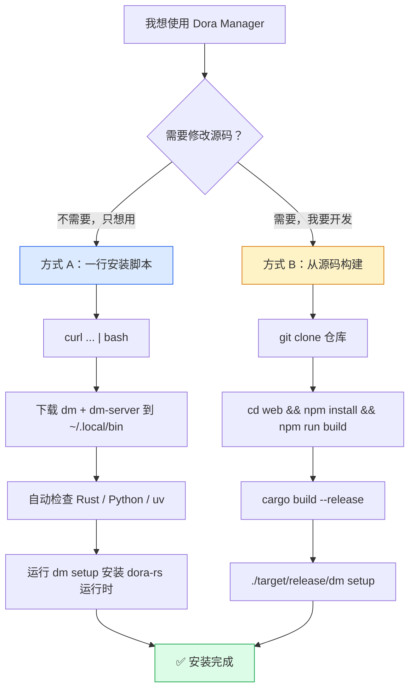
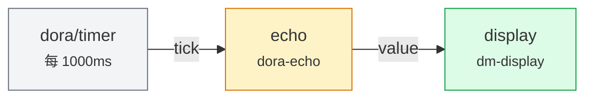
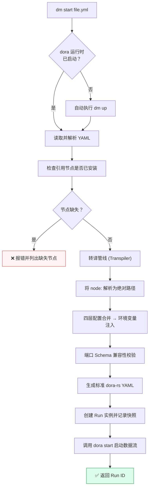

本页是一份 **面向新用户的端到端入门指南**：从安装 Dora Manager 到在浏览器中看到第一个数据流实时输出，最快只需 **三行命令**。无论你选择预编译二进制还是源码构建，都能在 5 分钟内跑通完整流程。我们会在过程中穿插关键概念解释，帮助你建立对系统运作方式的直觉，而不必一开始就深入架构细节。

Sources: [README.md](https://github.com/l1veIn/dora-manager/blob/main/README.md), [README_zh.md](https://github.com/l1veIn/dora-manager/blob/main/README_zh.md)

---

## 第一步：选择安装方式

Dora Manager 提供两种安装路径。选择最适合你当前场景的一种即可——两者的最终效果完全一致。



### 方式 A：一行命令安装（推荐新用户）

```bash
curl -fsSL https://raw.githubusercontent.com/l1veIn/dora-manager/master/scripts/install.sh | bash
```

安装脚本会自动完成以下全部工作：**检测操作系统与 CPU 架构**（支持 macOS 和 Linux 的 x86_64 / aarch64）→ **从 GitHub Releases 下载最新版 `dm` 和 `dm-server` 二进制文件**到 `~/.local/bin` → **检查 Rust、Python、uv 环境**（缺失时给出安装建议，不会阻塞流程）→ **执行 `dm setup` 安装 dora-rs 运行时**。整个过程中任何一步失败都会给出明确的错误信息和修复建议。

Sources: [scripts/install.sh](https://github.com/l1veIn/dora-manager/blob/main/scripts/install.sh#L1-L43)

安装脚本支持以下可选参数，按需使用：

| 参数 | 作用 | 示例 |
|------|------|------|
| `--skip-setup` | 跳过 `dm setup`（不安装 dora-rs 运行时） | `bash -s -- --skip-setup` |
| `--skip-deps` | 跳过 Rust / Python / uv 依赖检查 | `bash -s -- --skip-deps` |
| `--version VER` | 安装指定版本而非最新版 | `bash -s -- --version v0.1.0` |
| `--bin-dir PATH` | 自定义二进制安装目录（默认 `~/.local/bin`） | `bash -s -- --bin-dir /usr/local/bin` |

Sources: [scripts/install.sh](https://github.com/l1veIn/dora-manager/blob/main/scripts/install.sh#L30-L42)

> **首次安装后**：如果 `~/.local/bin` 不在你的 `PATH` 中，脚本会提示你将 `export PATH="$PATH:$HOME/.local/bin"` 添加到 shell 配置文件（`~/.bashrc`、`~/.zshrc` 等），然后 `source` 生效。

Sources: [scripts/install.sh](https://github.com/l1veIn/dora-manager/blob/main/scripts/install.sh#L215-L228)

### 方式 B：从源码构建（开发者）

如果你计划参与开发或需要定制构建，请先确认环境满足以下要求：

| 依赖 | 最低版本 | 用途 |
|------|---------|------|
| **Rust** | stable | 编译三个 Rust crate（`dm-core`、`dm-cli`、`dm-server`） |
| **Node.js** | 20+ | 编译 SvelteKit 前端面板 |
| **npm** | 随 Node.js | 前端依赖管理 |
| **Python** | 3.10+ | 部分节点的虚拟环境构建 |
| **uv**（推荐） | 任意 | 加速 Python 虚拟环境创建 |

项目通过 `rust-toolchain.toml` 固定使用 Rust stable 通道，并自动启用 `clippy` 和 `rustfmt` 组件。

Sources: [rust-toolchain.toml](https://github.com/l1veIn/dora-manager/blob/main/rust-toolchain.toml), [Cargo.toml](https://github.com/l1veIn/dora-manager/blob/main/Cargo.toml)

**关键：构建顺序不可颠倒**。Dora Manager 采用前后端静态嵌入策略——SvelteKit 前端通过 `adapter-static` 编译为纯静态资源，再由 `rust_embed` 宏在 Rust 编译期整体嵌入 `dm-server` 二进制。你必须 **先编译前端、再编译后端**：

```bash
# 1. 克隆仓库
git clone https://github.com/l1veIn/dora-manager.git
cd dora-manager

# 2. 编译前端（输出到 web/build/）
cd web
npm install
npm run build
cd ..

# 3. 编译后端（会自动嵌入 web/build/ 中的前端资源）
cargo build --release

# 4. 初始化 dora-rs 运行时
./target/release/dm setup
```

编译成功后，`target/release/` 目录下会出现两个二进制文件：`dm`（命令行工具）和 `dm-server`（内嵌 Web 面板的 HTTP 服务）。

Sources: [README.md](https://github.com/l1veIn/dora-manager/blob/main/README.md), [Cargo.toml](https://github.com/l1veIn/dora-manager/blob/main/Cargo.toml)

---

## 第二步：启动服务

安装完成后，你需要启动 **dm-server**——一个基于 Axum 框架的 HTTP 服务，它内嵌了完整的 Web 可视化管理面板。根据你的安装方式，启动命令略有不同：

| 安装方式 | 启动命令 | 说明 |
|---------|---------|------|
| 方式 A（预编译） | `dm-server` | 二进制已安装在 `~/.local/bin` |
| 方式 B（源码构建） | `./target/release/dm-server` | 二进制在仓库 `target/release/` |
| 开发模式（源码） | `./dev.sh` | 同时启动后端 + 前端 HMR 热更新 |

启动成功后，终端将输出：

```
🚀 dm-server listening on http://127.0.0.1:3210
```

此时在浏览器中访问 **[http://127.0.0.1:3210](http://127.0.0.1:3210)** 即可进入可视化管理面板。如果你使用的是源码开发模式（`./dev.sh`），前端开发服务器会同时运行并提供 HMR 热更新，修改前端代码后浏览器自动刷新。

Sources: [crates/dm-server/src/main.rs](https://github.com/l1veIn/dora-manager/blob/main/crates/dm-server/src/main.rs#L227-L243), [dev.sh](https://github.com/l1veIn/dora-manager/blob/main/dev.sh)

> **关于 `./dev.sh`**：该脚本会依次执行——检查 Rust 和 Node.js 是否已安装 → 安装前端依赖（首次）→ 启动 `cargo run -p dm-server`（后端，端口 3210）→ 启动 `npm run dev`（前端 HMR 开发服务器）。按 `Ctrl+C` 可同时优雅停止两个进程。

Sources: [dev.sh](https://github.com/l1veIn/dora-manager/blob/main/dev.sh)

---

## 第三步：运行第一个数据流

服务启动后，你已经 80% 的准备工作完成了。现在让我们用一个 **零依赖内置 demo** 来验证一切正常。

### 运行 Hello Timer Demo

```bash
# 预编译安装
dm start demos/demo-hello-timer.yml

# 或源码构建
./target/release/dm start demos/demo-hello-timer.yml
```

这个数据流是 Dora Manager 最简开箱即用示例，它只使用内置节点，**无需安装任何额外依赖**。数据流拓扑非常简洁：



**发生了什么？** Timer 虚拟节点每秒发送一个心跳事件 → `dora-echo` 节点接收并原样转发 → `dm-display` 节点将文本推送到 Web UI 的面板区域。如果你在浏览器中打开对应运行实例的页面，右侧面板将每秒刷新一条消息。

Sources: [demos/demo-hello-timer.yml](demos/demo-hello-timer.yml#L1-L39)

CLI 输出类似：

```
🚀 Starting dataflow...
✅ Run created: a1b2c3d4-e5f6-7890-abcd-ef1234567890
  → Running in background. Stop with: dm runs stop a1b2c3d4-e5f6-7890-abcd-ef1234567890
  → View in browser: http://127.0.0.1:3210
```

> **注意**：`dm start` 会自动检测 dora 运行时是否已启动；若未运行则自动执行 `dm up`，因此你无需手动启动运行时。

Sources: [crates/dm-cli/src/main.rs](https://github.com/l1veIn/dora-manager/blob/main/crates/dm-cli/src/main.rs#L353-L384)

### `dm start` 背后发生了什么

当你执行 `dm start` 时，系统会经历一条完整的处理管线。你不必记住每个步骤，但了解其存在有助于后续排查问题：



**转译器**（Transpiler）是 `dm` 的核心差异点——它将用户友好的扩展 YAML（使用 `node:` 引用节点而非硬编码路径）翻译为 dora-rs 原生可执行的标准格式，过程包括路径解析、配置合并和环境变量注入。

Sources: [crates/dm-cli/src/main.rs](https://github.com/l1veIn/dora-manager/blob/main/crates/dm-cli/src/main.rs#L353-L384)

---

## 第四步：在 Web 面板中交互

启动数据流后，打开 [http://127.0.0.1:3210](http://127.0.0.1:3210)，你会看到当前运行实例的页面。对于 Hello Timer demo：

1. 页面上会显示运行实例的 **状态**（Running）、**Run ID** 和启动时间
2. `display` 节点对应的区域会 **每秒刷新** 显示收到的消息
3. 你可以实时观察数据在节点间的流转过程

这就是 Dora Manager 的核心体验——**数据流不再是命令行里的黑盒**，而是可视化、可交互、可实时调试的运行时实体。

---

## 更多内置 Demo

项目内置了多个零依赖 demo，可以直接运行体验不同的功能维度：

| Demo | 命令 | 展示内容 |
|------|------|---------|
| **Hello Timer** | `dm start demos/demo-hello-timer.yml` | 最简计时器，验证引擎与 UI 连通 |
| **Interactive Widgets** | `dm start demos/demo-interactive-widgets.yml` | 滑块、按钮、文本输入、开关四种交互控件 |
| **Logic Gate** | `dm start demos/demo-logic-gate.yml` | AND 门控 + 条件流控，理解逻辑节点组合 |

Sources: [demos/demo-hello-timer.yml](demos/demo-hello-timer.yml#L1-L39), [demos/demo-interactive-widgets.yml](demos/demo-interactive-widgets.yml#L1-L129), [demos/demo-logic-gate.yml](demos/demo-logic-gate.yml#L1-L120)

此外，`demos/` 目录下还有一个需要额外安装节点的进阶 demo：

```bash
# 机器人目标检测（需要安装 opencv-video-capture 和 dora-yolo）
dm node install opencv-video-capture
dm node install dora-yolo
dm start demos/robotics-object-detection.yml
```

这个 demo 展示了完整的「摄像头采集 → YOLOv8 推理 → 标注图像展示」流程，还包含一个实时调节检测置信度阈值的滑块控件。

Sources: [demos/robotics-object-detection.yml](demos/robotics-object-detection.yml#L1-L76), [README.md](https://github.com/l1veIn/dora-manager/blob/main/README.md)

---

## 常用命令速查

安装并启动服务后，以下是你最常使用的命令：

| 操作 | CLI 命令 | HTTP API |
|------|---------|----------|
| 环境诊断 | `dm doctor` | `GET /api/doctor` |
| 查看已安装 dora 版本 | `dm versions` | `GET /api/versions` |
| 启动 dora 运行时 | `dm up` | `POST /api/up` |
| 启动数据流 | `dm start <file.yml>` | `POST /api/dataflow/start` |
| 查看所有运行 | `dm runs` | `GET /api/runs` |
| 查看运行日志 | `dm runs logs <run_id>` | `GET /api/runs/{id}/logs/{node_id}` |
| 停止运行 | `dm runs stop <run_id>` | `POST /api/runs/{id}/stop` |
| 停止运行时 | `dm down` | `POST /api/down` |
| 列出已安装节点 | `dm node list` | `GET /api/nodes` |
| 安装节点 | `dm node install <node-id>` | `POST /api/nodes/install` |

Sources: [crates/dm-cli/src/main.rs](https://github.com/l1veIn/dora-manager/blob/main/crates/dm-cli/src/main.rs#L51-L152), [crates/dm-server/src/main.rs](https://github.com/l1veIn/dora-manager/blob/main/crates/dm-server/src/main.rs#L108-L192)

HTTP API 默认监听 **3210 端口**，服务还内嵌了 Swagger UI，可通过 [http://127.0.0.1:3210/swagger-ui](http://127.0.0.1:3210/swagger-ui) 浏览完整的 API 文档并在线调试。

Sources: [crates/dm-server/src/main.rs](https://github.com/l1veIn/dora-manager/blob/main/crates/dm-server/src/main.rs#L224-L225)

---

## 配置与存储：DM_HOME 目录

`dm` 的所有持久化状态存放在 **DM_HOME** 目录中，默认路径为 `~/.dm`，可通过 `--home` 参数或 `DM_HOME` 环境变量覆盖。了解这个目录结构有助于你在需要时手动排查问题：

```
~/.dm/
├── config.toml          # 全局配置（激活版本、媒体后端等）
├── active               → 当前激活版本的符号链接
├── versions/
│   └── 0.4.1/
│       └── dora         # dora-rs CLI 二进制
├── nodes/               # 已安装的节点包
│   └── <node-id>/
│       ├── dm.json      # 节点契约文件
│       ├── .venv/       # Python 虚拟环境（Python 节点）
│       └── ...
├── dataflows/           # 已导入的数据流项目
└── runs/                # 运行历史记录
    └── <run-id>/
        ├── run.json     # 运行实例元数据
        ├── snapshot.yml # 原始 YAML 快照
        └── transpiled.yml # 转译后的标准 YAML
```

节点发现顺序为：`~/.dm/nodes` → 仓库内置 `nodes/` 目录 → `DM_NODE_DIRS` 环境变量指定的额外路径。

Sources: [crates/dm-core/src/config.rs](https://github.com/l1veIn/dora-manager/blob/main/crates/dm-core/src/config.rs#L135-L167)

---

## 常见问题排查

| 症状 | 可能原因 | 解决方案 |
|------|---------|---------|
| `cargo build` 报 `rust_embed` 错误 | 前端未编译 | 先执行 `cd web && npm install && npm run build` |
| `dm start` 报 "missing nodes" | 节点未安装 | 执行 `dm node install <node-id>` 安装缺失节点 |
| `dm doctor` 显示 `all_ok: false` | dora 运行时未安装 | 执行 `dm install` 或 `dm setup` |
| 浏览器访问 3210 无响应 | dm-server 未启动 | 执行 `dm-server` 或 `./target/release/dm-server` |
| 节点启动后立即退出 | Python 虚拟环境缺失 | 执行 `dm node install <node-id>` 重建 `.venv` |
| `dm up` 超时 | 端口冲突或权限问题 | `pkill dora` 清除残留进程后重试 |
| `dm-server` 命令找不到 | PATH 未配置 | 确认 `~/.local/bin` 在 PATH 中 |

Sources: [crates/dm-cli/src/main.rs](https://github.com/l1veIn/dora-manager/blob/main/crates/dm-cli/src/main.rs#L260-L302), [simulate_clean_install.sh](https://github.com/l1veIn/dora-manager/blob/main/simulate_clean_install.sh)

---

## 下一步

恭喜你完成了从安装到运行第一个数据流的完整流程！以下是根据你的兴趣方向推荐的进阶阅读路径：

- **深入理解节点是什么** → [节点（Node）：dm.json 契约与可执行单元](4-jie-dian-node-dm-json-qi-yue-yu-ke-zhi-xing-dan-yuan)
- **掌握 YAML 拓扑的完整语法** → [数据流（Dataflow）：YAML 拓扑定义与节点连接](5-shu-ju-liu-dataflow-yaml-tuo-bu-ding-yi-yu-jie-dian-lian-jie)
- **了解 Run 的生命周期追踪** → [运行实例（Run）：生命周期状态机与指标追踪](6-yun-xing-shi-li-run-sheng-ming-zhou-qi-zhuang-tai-ji-yu-zhi-biao-zhui-zong)
- **配置开发热更新环境** → [开发环境搭建：从源码构建与热更新工作流](3-kai-fa-huan-jing-da-jian-cong-yuan-ma-gou-jian-yu-re-geng-xin-gong-zuo-liu)