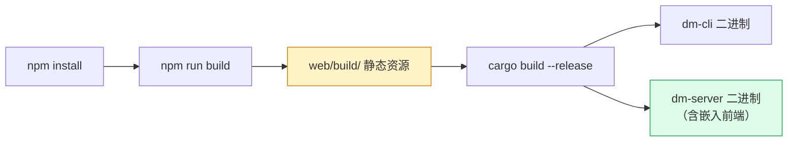
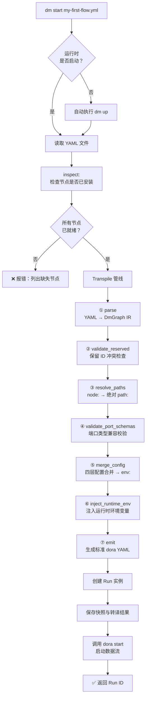

本页是 Dora Manager 的 **实操入门指南**，将从零开始带你完成：编译项目 → 启动服务 → 编写 YAML 数据流 → 在浏览器中观察节点间的实时数据流动。读完本页后，你将掌握 `dm` 的核心工作流，并为后续深入学习架构细节奠定基础。

---

## 前置条件

在开始之前，请确保你的开发环境满足以下要求。`dm` 的编译和运行依赖两套工具链（Rust 后端 + Node.js 前端），同时节点生态需要 Python 环境。

| 依赖 | 最低版本 | 用途 | 安装方式 |
|------|---------|------|---------|
| **Rust** | stable | 编译 `dm-core`、`dm-cli`、`dm-server` | `curl --proto '=https' --tlsv1.2 -sSf https://sh.rustup.rs \| sh` |
| **Node.js** | 20+ | 编译 SvelteKit 前端面板 | [nodejs.org](https://nodejs.org) 或 `brew install node@20` |
| **npm** | 随 Node.js 安装 | 前端依赖管理 | 自动包含 |
| **Python** | 3.10+ | 节点虚拟环境与 `pip install -e .` 构建 | `brew install python@3.11` 或系统包管理器 |
| **uv**（推荐） | 任意 | 加速 Python 虚拟环境创建 | `pip install uv` |

项目通过 `rust-toolchain.toml` 固定 Rust 工具链为 stable 通道并启用 `clippy` 和 `rustfmt` 组件。CI 流水线已在 macOS（aarch64）和 Linux（x86_64）平台上验证通过，Windows 暂未官方支持。

Sources: [rust-toolchain.toml](https://github.com/l1veIn/dora-manager/blob/master/rust-toolchain.toml), [.github/workflows/ci.yml](https://github.com/l1veIn/dora-manager/blob/master/.github/workflows/ci.yml#L13-L28), [crates/dm-core/src/env.rs](https://github.com/l1veIn/dora-manager/blob/master/crates/dm-core/src/env.rs#L1-L76)

## 整体构建流程总览

Dora Manager 采用 **前后端静态嵌入** 的分发策略——SvelteKit 前端通过 `adapter-static` 编译为纯静态资源，再由 `rust_embed` 在编译期嵌入 Rust 二进制。这意味着你必须 **先编译前端、再编译后端**，顺序不可颠倒。



构建产出的两个二进制各有分工：`dm` 是命令行工具，负责环境管理、节点安装和数据流启动；`dm-server` 是 Axum HTTP 服务，内嵌 Web 面板并提供 RESTful API，默认监听 `3210` 端口。

Sources: [web/svelte.config.js](https://github.com/l1veIn/dora-manager/blob/master/web/svelte.config.js#L1-L15), [crates/dm-server/src/main.rs](https://github.com/l1veIn/dora-manager/blob/master/crates/dm-server/src/main.rs#L20-L22), [Cargo.toml](https://github.com/l1veIn/dora-manager/blob/master/Cargo.toml)

## 第一步：编译项目

### 1.1 编译前端面板

```bash
cd web
npm install        # 安装 SvelteKit 及所有依赖
npm run build      # 输出静态资源到 web/build/
cd ..
```

`npm run build` 执行的是 `vite build`，配合 `@sveltejs/adapter-static` 将 SvelteKit 应用编译为纯 HTML/JS/CSS 文件，输出到 `web/build/` 目录。这些文件随后将被 `rust_embed` 宏在 Rust 编译期整体嵌入到 `dm-server` 二进制中。

Sources: [web/package.json](https://github.com/l1veIn/dora-manager/blob/master/web/package.json#L7-L9), [web/svelte.config.js](https://github.com/l1veIn/dora-manager/blob/master/web/svelte.config.js#L1-L15)

### 1.2 编译 Rust 后端

```bash
cargo build --release
```

该命令编译工作区中的三个 crate：`dm-core`（核心库）、`dm-cli`（CLI 二进制 `dm`）和 `dm-server`（HTTP 服务二进制）。Release 模式启用了 LTO、单 codegen-unit 和 strip，生成体积更小、性能更优的二进制。编译产物位于 `target/release/` 目录下。

Sources: [Cargo.toml](https://github.com/l1veIn/dora-manager/blob/master/Cargo.toml), [crates/dm-server/src/main.rs](https://github.com/l1veIn/dora-manager/blob/master/crates/dm-server/src/main.rs#L78-L243)

### 1.3 一键开发模式（可选）

如果你希望前后端同时运行并支持热更新，可以使用项目自带的开发脚本：

```bash
./dev.sh
```

`dev.sh` 会自动执行以下操作：检查 Rust 和 Node.js 是否已安装 → 编译前端 → 启动 `dm-server`（Rust 后端，端口 3210）→ 启动 SvelteKit 开发服务器（HMR 热更新）。按 `Ctrl+C` 可同时停止两个进程。

Sources: [dev.sh](https://github.com/l1veIn/dora-manager/blob/master/dev.sh)

## 第二步：初始化环境

编译完成后，首次使用前需要完成环境初始化——安装 dora-rs 运行时并验证依赖完整性。

### 2.1 一键安装（推荐）

```bash
./target/release/dm setup
```

`dm setup` 是一站式引导命令，会依次完成：检查 Python → 安装 uv（如缺失） → 下载并安装最新版 dora-rs CLI。安装完成后，dora 二进制存放在 `~/.dm/versions/<版本号>/dora`，当前激活版本记录在 `~/.dm/config.toml` 中。

Sources: [crates/dm-cli/src/main.rs](https://github.com/l1veIn/dora-manager/blob/master/crates/dm-cli/src/main.rs#L260-L302), [crates/dm-core/src/api/setup.rs](https://github.com/l1veIn/dora-manager/blob/master/crates/dm-core/src/api/setup.rs#L1-L55)

### 2.2 分步安装

如果你更偏好手动控制每一步：

```bash
# 下载并安装最新版 dora-rs（含进度条）
./target/release/dm install

# 诊断环境健康状态
./target/release/dm doctor

# 切换到特定版本（可选）
./target/release/dm use 0.4.1
```

`dm doctor` 会逐项检查 Python、uv、Rust 的可用性，并列出已安装的 dora 版本及其激活状态。如果所有检查通过，输出末尾会显示 `all_ok: true`。

Sources: [crates/dm-cli/src/main.rs](https://github.com/l1veIn/dora-manager/blob/master/crates/dm-cli/src/main.rs#L182-L205), [crates/dm-core/src/api/doctor.rs](https://github.com/l1veIn/dora-manager/blob/master/crates/dm-core/src/api/doctor.rs#L1-L62)

## 第三步：启动服务与运行时

### 3.1 启动 HTTP 服务

```bash
./target/release/dm-server
```

启动后终端输出 `🚀 dm-server listening on http://127.0.0.1:3210`，此时在浏览器中访问 [http://127.0.0.1:3210](http://127.0.0.1:3210) 即可进入可视化管理面板。服务内嵌了 Swagger UI，可通过 [http://127.0.0.1:3210/swagger-ui](http://127.0.0.1:3210/swagger-ui) 查看完整的 API 文档。

Sources: [crates/dm-server/src/main.rs](https://github.com/l1veIn/dora-manager/blob/master/crates/dm-server/src/main.rs#L227-L243)

### 3.2 启动 dora 运行时

数据流执行依赖 dora-rs 的 coordinator + daemon 进程：

```bash
./target/release/dm up
```

也可以通过 HTTP API 触发：

```bash
curl -X POST http://127.0.0.1:3210/api/up
```

> **注意**：使用 `dm start` 启动数据流时，系统会自动检测运行时状态；若未运行则自动执行 `up`，因此这一步可以省略。

Sources: [crates/dm-core/src/api/runtime.rs](https://github.com/l1veIn/dora-manager/blob/master/crates/dm-core/src/api/runtime.rs#L132-L194), [crates/dm-server/src/main.rs](https://github.com/l1veIn/dora-manager/blob/master/crates/dm-server/src/main.rs#L108-L109)

## 第四步：运行第一个数据流

现在一切就绪，让我们创建并运行一个最简单的交互式数据流——用户输入文本，经过回显后显示在面板上。

### 4.1 创建数据流 YAML

在项目根目录创建 `my-first-flow.yml` 文件：

```yaml
nodes:
  - id: prompt
    node: dm-text-input
    outputs:
      - value
    config:
      label: "输入提示词"
      placeholder: "在这里输入文字..."
      multiline: true

  - id: echo
    node: dora-echo
    inputs:
      value: prompt/value
    outputs:
      - value

  - id: display
    node: dm-display
    inputs:
      data: echo/value
    config:
      label: "回显输出"
      render: text
```

这个数据流定义了三个节点实例的拓扑连接。理解这个 YAML 的关键在于区分 **节点引用**（`node:` 字段）和 **节点实例 ID**（`id:` 字段）：`node: dm-text-input` 引用已安装的节点类型，`id: prompt` 是本数据流中该实例的唯一标识。连线通过 `inputs` 中 `实例ID/端口名` 的格式声明——`value: prompt/value` 表示 `echo` 实例的 `value` 输入端口连接到 `prompt` 实例的 `value` 输出端口。


Sources: [tests/dataflows/interaction-demo.yml](https://github.com/l1veIn/dora-manager/blob/master/tests/dataflows/interaction-demo.yml#L1-L25)

### 4.2 理解 `dm start` 的执行管线

当你执行 `dm start my-first-flow.yml` 时，系统会经历以下完整管线：



**转译器（Transpiler）** 是 `dm` 的核心组件，它将用户友好的扩展 YAML 翻译为 dora-rs 原生可执行的标准格式。其中最关键的两步是：**路径解析**（将 `node: dm-text-input` 解析为节点目录下 `.venv/bin/dm-text-input` 的绝对路径）和 **配置合并**（将 inline config、flow config、node config、schema default 四层合并后注入为环境变量）。

Sources: [crates/dm-cli/src/main.rs](https://github.com/l1veIn/dora-manager/blob/master/crates/dm-cli/src/main.rs#L353-L384), [crates/dm-core/src/dataflow/transpile/mod.rs](https://github.com/l1veIn/dora-manager/blob/master/crates/dm-core/src/dataflow/transpile/mod.rs#L1-L82), [crates/dm-core/src/runs/service_start.rs](https://github.com/l1veIn/dora-manager/blob/master/crates/dm-core/src/runs/service_start.rs#L72-L146)

### 4.3 启动数据流

使用 CLI 启动：

```bash
./target/release/dm start my-first-flow.yml
```

或通过 HTTP API 启动：

```bash
curl -X POST http://127.0.0.1:3210/api/dataflow/start \
  -H 'Content-Type: application/json' \
  -d '{"name": "my-first-flow"}'
```

启动成功后，CLI 输出类似：

```
🚀 Starting dataflow...
✅ Run created: a1b2c3d4-e5f6-7890-abcd-ef1234567890
  Dora UUID: 12345678-abcd-ef00-1234-567890abcdef
  Dora runtime started dataflow successfully.
```

此时访问浏览器面板，你可以看到数据流处于 **Running** 状态，`prompt` 节点渲染出一个文本输入框。输入任意文字并提交后，数据将流经 `echo` 节点回显，最终在 `display` 节点的面板区域显示出来。

Sources: [crates/dm-core/src/runs/service_start.rs](https://github.com/l1veIn/dora-manager/blob/master/crates/dm-core/src/runs/service_start.rs#L176-L181)

### 4.4 管理运行中的数据流

| 操作 | CLI 命令 | HTTP API |
|------|---------|----------|
| 查看所有运行 | `dm runs` | `GET /api/runs` |
| 查看运行日志 | `dm runs logs <run_id>` | `GET /api/runs/{id}/logs/{node_id}` |
| 停止运行 | `dm runs stop <run_id>` | `POST /api/runs/{id}/stop` |
| 停止运行时 | `dm down` | `POST /api/down` |
| 强制重启 | `dm start file.yml --force` | — |

Sources: [crates/dm-cli/src/main.rs](https://github.com/l1veIn/dora-manager/blob/master/crates/dm-cli/src/main.rs#L109-L137), [crates/dm-server/src/main.rs](https://github.com/l1veIn/dora-manager/blob/master/crates/dm-server/src/main.rs#L170-L192)

## 配置体系速览

`dm` 的所有持久化状态存放在 **DM_HOME** 目录中，默认路径为 `~/.dm`，可通过 `--home` 参数或 `DM_HOME` 环境变量覆盖。

```
~/.dm/
├── config.toml          # 全局配置（激活版本、媒体后端等）
├── active               → 当前激活版本的符号链接
├── versions/
│   └── 0.4.1/
│       └── dora         # dora-rs CLI 二进制
├── nodes/               # 已安装的节点包
│   └── &lt;node-id&gt;/
│       ├── dm.json      # 节点契约文件
│       ├── .venv/       # Python 虚拟环境（Python 节点）
│       └── ...          # 节点源码与资源
├── dataflows/           # 已导入的数据流项目
└── runs/                # 运行历史
    └── <run-id>/
        ├── run.json     # 运行实例元数据
        ├── snapshot.yml # 原始 YAML 快照
        └── transpiled.yml # 转译后的标准 YAML
```

节点发现顺序为：`~/.dm/nodes` → 仓库内置 `nodes/` 目录 → `DM_NODE_DIRS` 环境变量指定的额外路径。`~/.dm/nodes` 中的同名节点会覆盖内置节点。

Sources: [crates/dm-core/src/config.rs](https://github.com/l1veIn/dora-manager/blob/master/crates/dm-core/src/config.rs#L105-L167), [nodes/README.md](https://github.com/l1veIn/dora-manager/blob/master/nodes/README.md#L1-L12)

## 常见问题排查

| 症状 | 可能原因 | 解决方案 |
|------|---------|---------|
| `cargo build` 报 `rust_embed` 错误 | 前端未编译 | 先执行 `cd web && npm run build` |
| `dm start` 报 "missing nodes" | 节点未安装 | 执行 `dm node install &lt;node-id&gt;` |
| `dm doctor` 显示 `all_ok: false` | dora 未安装 | 执行 `dm install` 或 `dm setup` |
| 浏览器访问 3210 无响应 | dm-server 未启动 | 执行 `./target/release/dm-server` |
| 节点启动后立即退出 | Python 虚拟环境缺失 | 执行 `dm node install &lt;node-id&gt;` 重建 `.venv` |
| `dm up` 超时 | 端口冲突或权限问题 | 检查是否有残留 dora 进程，`pkill dora` 后重试 |

## 下一步

恭喜你完成了第一个数据流的构建与运行！以下是根据你的兴趣方向推荐的进阶阅读路径：

- 深入理解节点契约与端口系统 → [节点（Node）：dm.json 契约与可执行单元](04-node-concept)
- 掌握 YAML 拓扑的完整语法 → [数据流（Dataflow）：YAML 拓扑与节点连接](05-dataflow-concept)
- 了解 Run 的生命周期与状态追踪 → [运行实例（Run）：生命周期、状态与指标追踪](06-run-lifecycle)
- 配置开发热更新环境 → [开发环境搭建与热更新工作流](03-dev-environment)