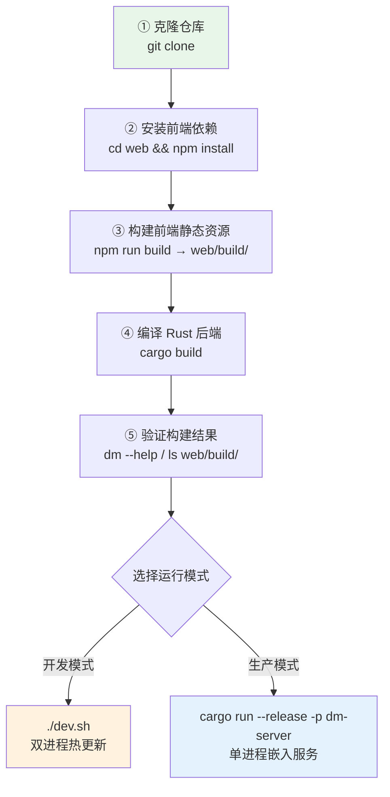
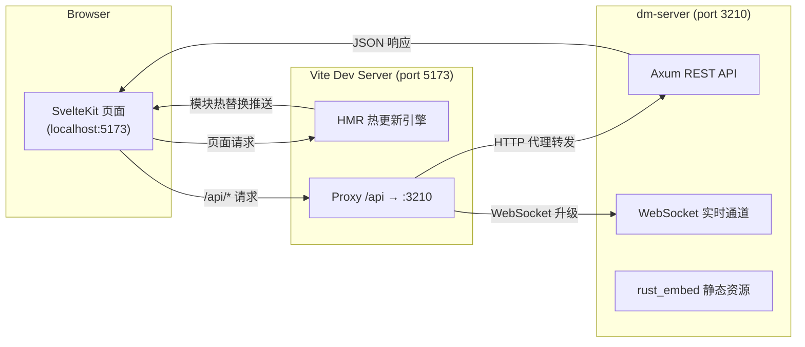

本文档将引导你从零开始搭建 Dora Manager 的完整开发环境，并掌握日常开发中最核心的**热更新工作流**。你将了解项目的前后端双进程架构、`dev.sh` 一键启动脚本的工作原理、Vite 代理如何桥接前后端，以及生产构建与开发模式之间的关键差异。无论你是想快速跑通项目看效果，还是打算深入参与代码贡献，这篇文章都是你动手之前的第一站。

Sources: [README.md](https://github.com/l1veIn/dora-manager/blob/main/README.md), [dev.sh](https://github.com/l1veIn/dora-manager/blob/main/dev.sh)

## 前置条件

在开始之前，确保你的系统已安装以下工具。版本要求参考 CI 流水线中的配置：

| 工具 | 最低版本 | 用途 | 验证命令 |
|------|----------|------|----------|
| **Rust (stable)** | 1.70+ | 编译后端三个 crate | `cargo --version` |
| **Node.js** | 20+ | 前端构建与开发服务器 | `node --version` |
| **npm** | 随 Node.js 安装 | 前端包管理器 | `npm --version` |
| **Git** | 任意 | 源码管理 | `git --version` |

项目通过 `rust-toolchain.toml` 固定 Rust 工具链为 **stable** 通道，并声明安装 `clippy`（代码检查）和 `rustfmt`（格式化）两个组件。当你在项目根目录下执行任何 `cargo` 命令时，Cargo 会自动读取此配置文件，确保工具链和组件的正确性，无需手动 `rustup component add`。

Sources: [rust-toolchain.toml](https://github.com/l1veIn/dora-manager/blob/main/rust-toolchain.toml), [.github/workflows/ci.yml](https://github.com/l1veIn/dora-manager/blob/main/.github/workflows/ci.yml#L33-L37)

### 安装 Rust 工具链

如果你尚未安装 Rust，请通过官方安装器完成：

```bash
curl --proto '=https' --tlsv1.2 -sSf https://sh.rustup.rs | sh
```

安装完成后，重新打开终端并运行 `cargo --version` 验证。项目根目录的 `rust-toolchain.toml` 会确保 `cargo` 自动切换到正确的工具链并安装所需的 `clippy` 和 `rustfmt` 组件。

Sources: [rust-toolchain.toml](https://github.com/l1veIn/dora-manager/blob/main/rust-toolchain.toml)

### 安装 Node.js

推荐使用 **Node.js 20 LTS**。你可以从 [nodejs.org](https://nodejs.org) 下载，或使用 `nvm` 管理：

```bash
nvm install 20
nvm use 20
```

项目前端目录 `web/` 下的 `.npmrc` 设置了 `engine-strict=true`，这意味着如果 Node.js 版本不满足 `package.json` 中声明的 `engines` 字段要求，`npm install` 将直接报错终止——这是一个版本兼容性的硬性守卫。

Sources: [web/.npmrc](https://github.com/l1veIn/dora-manager/blob/main/web/.npmrc#L1-L2)

## 项目结构总览

Dora Manager 采用 **Rust 后端 + SvelteKit 前端** 的双语言架构。后端由一个 Cargo workspace 组织三个 crate，前端则是标准的 SvelteKit 项目。理解这个分层结构是搭建开发环境和定位代码的基础。

```text
dora-manager/
├── crates/
│   ├── dm-core/        ← 核心逻辑库（转译器、节点管理、运行调度）
│   ├── dm-cli/         ← CLI 工具二进制（`dm` 命令）
│   └── dm-server/      ← HTTP API 服务（Axum，端口 3210）
├── web/                ← SvelteKit 前端
│   ├── src/            ← Svelte 组件、路由、API 通信层
│   ├── build/          ← Vite 静态构建输出（被 rust_embed 嵌入）
│   └── package.json    ← 前端依赖与脚本
├── nodes/              ← 内置节点集合（Python / Rust 混合）
├── dev.sh              ← 一键开发启动脚本
├── Cargo.toml          ← Workspace 根配置
└── rust-toolchain.toml ← Rust 工具链锁定
```

后端的三个 crate 承担不同职责：**`dm-core`** 是纯库 crate，封装了数据流转译器、节点安装/管理、运行调度等所有核心业务逻辑；**`dm-cli`** 依赖 `dm-core`，提供终端命令行界面（二进制名 `dm`），包括彩色输出和进度条；**`dm-server`** 同样依赖 `dm-core`，在 Axum 框架之上暴露 REST API 和 WebSocket 实时通道（二进制名 `dm-server`），并使用 `rust_embed` 将前端静态文件在编译时嵌入到 Rust 二进制中。

Sources: [Cargo.toml](https://github.com/l1veIn/dora-manager/blob/main/Cargo.toml), [crates/dm-core/Cargo.toml](https://github.com/l1veIn/dora-manager/blob/main/crates/dm-core/Cargo.toml#L1-L8), [crates/dm-cli/Cargo.toml](https://github.com/l1veIn/dora-manager/blob/main/crates/dm-cli/Cargo.toml#L1-L12), [crates/dm-server/Cargo.toml](https://github.com/l1veIn/dora-manager/blob/main/crates/dm-server/Cargo.toml#L1-L14)

## 从源码构建：分步指南

以下流程将带你从空白状态走到完整的可运行环境。每一步都标注了作用和注意事项。



### 第一步：克隆仓库

```bash
git clone https://github.com/l1veIn/dora-manager.git
cd dora-manager
```

克隆完成后，你当前位于项目根目录 `dora-manager/`，后续所有命令均基于此目录执行。

Sources: [README.md](https://github.com/l1veIn/dora-manager/blob/main/README.md)

### 第二步：安装前端依赖

```bash
cd web
npm install
cd ..
```

首次安装会在 `web/node_modules/` 下拉取所有前端依赖，包括 **Svelte 5**、**Vite 7**、**Tailwind CSS 4**、**SvelteFlow** 等 40+ 个直接依赖。后续热更新和前端构建都依赖这些依赖项的正确安装。如果你看到 `Unsupported engine` 错误，请回到「前置条件」检查 Node.js 版本。

Sources: [web/package.json](https://github.com/l1veIn/dora-manager/blob/main/web/package.json#L16-L68)

### 第三步：构建前端静态资源

```bash
cd web && npm run build && cd ..
```

这一步执行 `vite build`，将 SvelteKit 应用编译为纯静态文件并输出到 `web/build/` 目录。**这一步不能跳过**，因为后端 crate `dm-server` 使用 `rust_embed` 在编译时将 `web/build/` 下的所有静态文件嵌入到 Rust 二进制中。关键代码如下：

```rust
#[derive(Embed)]
#[folder = "../../web/build"]
struct WebAssets;
```

如果 `web/build/` 目录为空或不存在，`cargo build` **仍然可以编译通过**——`rust_embed` 编译期不会报错，但运行时 Web UI 将呈现空白页面。这是一个容易被忽略的陷阱，务必确保前端构建先于后端编译执行。

Sources: [crates/dm-server/src/main.rs](https://github.com/l1veIn/dora-manager/blob/main/crates/dm-server/src/main.rs#L20-L22)

### 第四步：编译 Rust 后端

```bash
cargo build
```

这会编译整个 workspace 中的三个 crate：`dm-core`（核心库）、`dm-cli`（CLI 二进制 `dm`）和 `dm-server`（HTTP 服务二进制 `dm-server`）。首次编译可能需要几分钟来下载和编译 Rust 依赖项（如 `tokio`、`axum`、`rusqlite` 等）。编译产物位于 `target/debug/` 目录下。

Sources: [Cargo.toml](https://github.com/l1veIn/dora-manager/blob/main/Cargo.toml)

### 第五步：验证构建结果

```bash
# 验证 Rust 二进制
./target/debug/dm --help
./target/debug/dm-server --help

# 验证前端构建产物
ls web/build/
```

如果你能看到 `dm` 和 `dm-server` 的帮助信息输出，以及 `web/build/` 下存在 `index.html` 等文件，说明环境搭建成功。你也可以运行项目提供的清洁安装验证脚本来执行全流程自动化测试：

```bash
./simulate_clean_install.sh
```

该脚本会备份现有环境、构建前后端、启动服务并验证 HTTP 200 响应，是完整的端到端验证。

Sources: [simulate_clean_install.sh](https://github.com/l1veIn/dora-manager/blob/main/simulate_clean_install.sh), [README.md](https://github.com/l1veIn/dora-manager/blob/main/README.md)

## 热更新开发工作流

Dora Manager 的开发模式采用**双进程并行**架构：Rust 后端（`dm-server`）提供 API 服务，Vite 前端开发服务器提供 HMR（Hot Module Replacement）热模块替换。两者通过 Vite 的代理机制协同工作，让你在修改前端代码时获得近乎即时的浏览器更新体验。

Sources: [dev.sh](https://github.com/l1veIn/dora-manager/blob/main/dev.sh), [web/vite.config.ts](https://github.com/l1veIn/dora-manager/blob/main/web/vite.config.ts#L1-L17)

### 架构图：开发模式下的双进程协作

在深入操作之前，先理解开发模式下各组件之间的关系。以下流程图展示了浏览器请求如何经过 Vite 代理到达后端，以及 HMR 如何在文件修改时自动推送更新：



在开发模式下，浏览器访问 `localhost:5173`（Vite 端口），Vite 负责服务前端页面。当页面需要调用后端 API 时，请求以 `/api` 为前缀发出，Vite 代理拦截这些请求并转发到 `localhost:3210`（dm-server 端口）。`ws: true` 配置确保 WebSocket 连接（用于实时消息推送和运行状态监控）同样通过代理正常工作。前端 API 通信层使用相对路径 `/api` 作为基础路径，无需硬编码后端地址：

```typescript
export const API_BASE = '/api';
```

Sources: [web/vite.config.ts](https://github.com/l1veIn/dora-manager/blob/main/web/vite.config.ts#L8-L16), [web/src/lib/api.ts](https://github.com/l1veIn/dora-manager/blob/main/web/src/lib/api.ts#L1)

### 一键启动：dev.sh

项目提供了 `dev.sh` 脚本，封装了完整的开发启动流程。你只需要一条命令：

```bash
chmod +x dev.sh   # 首次运行需要赋予执行权限
./dev.sh
```

该脚本依次执行四个阶段，每个阶段都有彩色状态输出：

**预检阶段**：检查 `cargo`、`node`、`npm` 是否可用，缺失则立即退出并给出安装提示。这是你的第一道防线——如果你忘了安装某个工具，脚本会在启动前就告诉你。

**前端准备**：如果 `web/node_modules/` 不存在则自动执行 `npm install`。注意脚本中的 `npm run build` 行被注释掉了（`# npm run build`），这意味着它不会在每次启动时重新构建前端静态资源。你需要确保 `web/build/` 已通过手动构建存在，否则后端将嵌入空资源。

**后端启动**：通过 `cargo run -p dm-server` 在后台启动 Rust 后端，监听 `127.0.0.1:3210`。`cargo run` 等价于先编译再运行，如果你修改了 Rust 代码，它会自动增量编译。

**前端开发服务器启动**：在 `web/` 目录下执行 `npm run dev`（即 `vite dev`）启动 Vite 开发服务器，默认监听 `localhost:5173`。

**优雅关闭**：脚本注册了 `trap cleanup EXIT INT TERM` 信号处理器。当你按下 `Ctrl+C` 时，脚本会同时终止 `dm-server` 和 `npm run dev` 两个后台子进程，避免僵尸进程残留。

Sources: [dev.sh](https://github.com/l1veIn/dora-manager/blob/main/dev.sh)

### 前端热更新（HMR）机制

当你修改 `web/src/` 下的任何 Svelte 组件、TypeScript 文件或 CSS 样式后，Vite 会自动完成以下四步：

1. **检测文件变更**：Vite 的文件系统监视器检测到磁盘上的文件修改
2. **增量编译**：仅重新编译受影响的模块，而非整个应用
3. **推送 HMR 更新**：通过内置 WebSocket 将变更推送到浏览器
4. **局部替换**：浏览器中的 Svelte 组件被原地替换，**保持应用状态不变**

这意味着你修改一个按钮的颜色或调整一个组件的布局后，页面会在几百毫秒内自动更新，无需手动刷新浏览器，也无需重新编译 Rust 后端。这种即时反馈循环是前端开发效率的核心保障。

Sources: [web/package.json](https://github.com/l1veIn/dora-manager/blob/main/web/package.json#L7-L8)

### 后端修改的开发循环

修改 Rust 后端代码后，热更新不会自动生效——Rust 是编译型语言，需要重新编译。推荐的开发循环是：

1. **修改代码**：编辑 `crates/` 下的 Rust 源文件
2. **重启后端**：`Ctrl+C` 终止 `dev.sh`，然后重新运行 `./dev.sh`

如果只是修改 API handler 逻辑（不涉及前端），你可以单独重启后端来加速循环：

```bash
# 终端 1：仅启动后端
cargo run -p dm-server

# 终端 2：前端开发服务器（保持运行）
cd web && npm run dev
```

Vite 开发服务器可以在后端重启期间持续运行，不受影响。后端重启完成后，前端的下一次 API 请求将自动恢复。增量编译通常比首次编译快得多（几十秒内），因为 Cargo 只重新编译受影响的 crate。

Sources: [dev.sh](https://github.com/l1veIn/dora-manager/blob/main/dev.sh), [Cargo.toml](https://github.com/l1veIn/dora-manager/blob/main/Cargo.toml)

## 开发模式 vs 生产模式

理解两种模式的差异对于调试和部署至关重要。以下表格对比了各维度的区别：

| 维度 | 开发模式 (`./dev.sh`) | 生产模式 (`dm-server`) |
|------|----------------------|------------------------|
| **前端服务** | Vite Dev Server（端口 5173） | `rust_embed` 静态嵌入，由 dm-server 直接提供 |
| **API 服务** | `cargo run`（debug 构建，端口 3210） | 预编译 release 二进制（端口 3210） |
| **前端更新** | HMR 热更新，毫秒级响应 | 需重新 `npm run build` + `cargo build` |
| **浏览器访问** | `http://localhost:5173` | `http://127.0.0.1:3210` |
| **API 代理** | Vite proxy（`/api` → `:3210`） | 直连，无代理层 |
| **调试信息** | Rust debug 断言启用，前端 source map 可用 | 二进制经过 `strip`、LTO 优化 |
| **构建产物** | `target/debug/dm-server`（约 50MB+） | `target/release/dm-server`（约 10MB，已 strip） |

生产模式下，SvelteKit 使用 `adapter-static` 将前端编译为纯静态文件（HTML/CSS/JS），然后 `rust_embed` 在 Rust 编译时将这些文件嵌入到二进制中。运行时，`dm-server` 通过 `serve_web` handler 直接从内存中提供这些文件。所有未匹配到静态资源的路径都会回退到 `index.html`，以支持 SPA 的客户端路由。

生产模式的 Release profile 配置了 LTO（链接时优化）、单 codegen-unit 和 `strip = true`，生成体积更小、性能更优的二进制。这也是 CI 流水线和一键安装脚本所使用的模式。

Sources: [web/svelte.config.js](https://github.com/l1veIn/dora-manager/blob/main/web/svelte.config.js#L1-L15), [crates/dm-server/src/handlers/web.rs](https://github.com/l1veIn/dora-manager/blob/main/crates/dm-server/src/handlers/web.rs#L1-L28), [crates/dm-server/src/main.rs](https://github.com/l1veIn/dora-manager/blob/main/crates/dm-server/src/main.rs#L234-L235), [Cargo.toml](https://github.com/l1veIn/dora-manager/blob/main/Cargo.toml)

## 常用开发命令速查

以下是日常开发中最常用的命令，按场景分类整理：

| 场景 | 命令 | 说明 |
|------|------|------|
| 一键启动开发环境 | `./dev.sh` | 同时启动后端 + Vite 前端 |
| 仅启动后端 | `cargo run -p dm-server` | 后端 API 服务，端口 3210 |
| 仅启动前端 | `cd web && npm run dev` | Vite 开发服务器，需后端已运行 |
| 编译前端 | `cd web && npm run build` | 输出到 `web/build/` |
| 编译全部（release） | `cargo build --release` | 优化后的二进制 |
| Rust 格式检查 | `cargo fmt --check` | CI 会执行此项 |
| Rust 静态分析 | `cargo clippy --workspace --all-targets` | CI 会执行此项 |
| 前端类型检查 | `cd web && npm run check` | Svelte 类型校验 |
| 前端 lint | `cd web && npm run lint` | 等同于 `npm run check` |
| 运行 Rust 测试 | `cargo test --workspace` | 单元测试和集成测试 |
| 清洁安装验证 | `./simulate_clean_install.sh` | 模拟全新环境安装全流程 |
| 安装发布版 | `curl -fsSL https://raw.githubusercontent.com/l1veIn/dora-manager/master/scripts/install.sh \| bash` | 下载预编译二进制 |

Sources: [web/package.json](https://github.com/l1veIn/dora-manager/blob/main/web/package.json#L6-L15), [.github/workflows/ci.yml](https://github.com/l1veIn/dora-manager/blob/main/.github/workflows/ci.yml#L61-L73), [scripts/install.sh](https://github.com/l1veIn/dora-manager/blob/main/scripts/install.sh#L1-L11)

## 常见问题排查

### 问题：`cargo build` 编译通过但 Web UI 显示空白

**现象**：编译 `dm-server` 成功，启动后访问 `http://127.0.0.1:3210` 显示空白页面。

**根因**：`rust_embed` 在编译时读取 `web/build/` 目录。如果该目录不存在或为空，编译**不会失败**，但嵌入的资源为空，`serve_web` handler 无法匹配到任何静态文件，最终回退到 `index.html` 也找不到。

**解决方案**：确保在编译 Rust 之前先完成前端构建：

```bash
cd web && npm install && npm run build && cd ..
cargo build
```

Sources: [crates/dm-server/src/main.rs](https://github.com/l1veIn/dora-manager/blob/main/crates/dm-server/src/main.rs#L20-L22), [crates/dm-server/src/handlers/web.rs](https://github.com/l1veIn/dora-manager/blob/main/crates/dm-server/src/handlers/web.rs#L6-L27)

### 问题：前端 `npm run dev` 页面白屏或 API 请求 404

**现象**：Vite 开发服务器正常运行，但页面无数据，浏览器控制台报 `/api/*` 请求 404。

**根因**：Vite 仅代理 `/api` 前缀的请求到 `localhost:3210`，如果 `dm-server` 没有启动，代理目标不可达。

**解决方案**：确认 `dm-server` 已在端口 3210 上运行。推荐使用两个终端分别管理：

```bash
# 终端 1：启动后端
cargo run -p dm-server

# 终端 2：启动前端
cd web && npm run dev
```

或者直接使用 `./dev.sh` 一键启动两个进程。

Sources: [web/vite.config.ts](https://github.com/l1veIn/dora-manager/blob/main/web/vite.config.ts#L8-L16), [dev.sh](https://github.com/l1veIn/dora-manager/blob/main/dev.sh)

### 问题：Node.js 版本不兼容

**现象**：`npm install` 报错 `Unsupported engine`。

**根因**：`web/.npmrc` 中设置了 `engine-strict=true`，当 Node.js 版本不满足 `package.json` 中的 `engines` 字段时安装会被拒绝。

**解决方案**：

```bash
node --version   # 确认版本，应为 v20.x.x
nvm use 20       # 如果使用 nvm
```

Sources: [web/.npmrc](https://github.com/l1veIn/dora-manager/blob/main/web/.npmrc#L1-L2), [.github/workflows/ci.yml](https://github.com/l1veIn/dora-manager/blob/main/.github/workflows/ci.yml#L33-L34)

### 问题：修改 Rust 代码后前端请求超时

**现象**：修改后端代码后重启 `dm-server`，前端出现请求超时或连接拒绝。

**根因**：后端重启期间 API 服务不可用。Vite 代理会返回连接错误，这是正常现象。

**解决方案**：等待后端启动完成（终端显示 `🚀 dm-server listening on http://127.0.0.1:3210`）后刷新页面即可恢复。如果频繁遇到此问题，建议使用两个独立终端分别管理前后端进程，这样重启后端不会影响前端的运行。

Sources: [crates/dm-server/src/main.rs](https://github.com/l1veIn/dora-manager/blob/main/crates/dm-server/src/main.rs#L237-L243)

### 问题：首次 `cargo build` 编译时间过长

**现象**：首次编译 Rust 后端耗时 5-10 分钟甚至更久。

**根因**：Cargo 需要下载并编译所有依赖项（`tokio`、`axum`、`rusqlite`、`reqwest` 等），这是 Rust 项目的正常现象。

**解决方案**：这是首次编译的一次性成本。后续增量编译只会重新编译受修改影响的 crate，速度会快得多。你也可以使用 `cargo check` 代替 `cargo build` 来仅做类型检查而不生成二进制，速度更快。

Sources: [Cargo.toml](https://github.com/l1veIn/dora-manager/blob/main/Cargo.toml)

## 下一步

环境搭建完成并熟悉热更新工作流后，建议按以下顺序继续深入：

1. **[节点（Node）：dm.json 契约与可执行单元](4-jie-dian-node-dm-json-qi-yue-yu-ke-zhi-xing-dan-yuan)** — 理解项目的核心抽象，所有功能围绕节点展开
2. **[数据流（Dataflow）：YAML 拓扑定义与节点连接](5-shu-ju-liu-dataflow-yaml-tuo-bu-ding-yi-yu-jie-dian-lian-jie)** — 了解如何编排节点之间的数据流转
3. **[运行实例（Run）：生命周期状态机与指标追踪](6-yun-xing-shi-li-run-sheng-ming-zhou-qi-zhuang-tai-ji-yu-zhi-biao-zhui-zong)** — 掌握数据流从启动到终止的完整生命周期