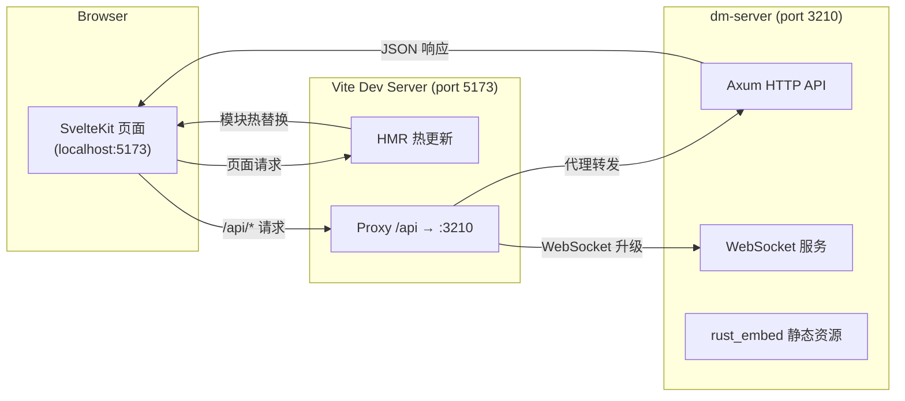

本文档将引导你从零开始搭建 Dora Manager 的完整开发环境，并掌握日常开发中最核心的**热更新工作流**。你将了解项目的前后端双进程架构、`dev.sh` 一键启动脚本的工作原理、Vite 代理如何桥接前后端，以及生产构建与开发模式的关键差异。

Sources: [README_zh.md](https://github.com/l1veIn/dora-manager/blob/master/README_zh.md), [dev.sh](https://github.com/l1veIn/dora-manager/blob/master/dev.sh)

## 前置条件

在开始之前，确保你的系统已安装以下工具。版本要求参考 CI 流水线中的配置：

| 工具 | 最低版本 | 用途 | 验证命令 |
|------|----------|------|----------|
| **Rust (stable)** | 1.70+ | 编译后端三个 crate | `cargo --version` |
| **Node.js** | 20+ | 前端构建与开发服务器 | `node --version` |
| **npm** | 随 Node.js 安装 | 包管理器 | `npm --version` |
| **Git** | 任意 | 源码管理 | `git --version` |

项目通过 `rust-toolchain.toml` 固定 Rust 工具链为 **stable** 通道，并要求安装 `clippy`（代码检查）和 `rustfmt`（格式化）两个组件。`cargo` 会自动读取此配置，无需手动 `rustup component add`。

Sources: [rust-toolchain.toml](https://github.com/l1veIn/dora-manager/blob/master/rust-toolchain.toml), [.github/workflows/ci.yml](https://github.com/l1veIn/dora-manager/blob/master/.github/workflows/ci.yml#L33-L37)

### 安装 Rust 工具链

如果你尚未安装 Rust，请通过官方安装器完成：

```bash
curl --proto '=https' --tlsv1.2 -sSf https://sh.rustup.rs | sh
```

安装完成后，在项目根目录下运行 `cargo --version` 验证。项目根目录的 `rust-toolchain.toml` 会确保 `cargo` 自动切换到正确的工具链并安装所需组件。

Sources: [rust-toolchain.toml](https://github.com/l1veIn/dora-manager/blob/master/rust-toolchain.toml)

### 安装 Node.js

推荐使用 Node.js 20 LTS。你可以从 [nodejs.org](https://nodejs.org) 下载，或使用 `nvm`：

```bash
nvm install 20
nvm use 20
```

项目前端目录 `web/` 下的 `.npmrc` 设置了 `engine-strict=true`，意味着如果 Node.js 版本不满足 `package.json` 中的 engines 字段要求，`npm install` 将直接报错终止。

Sources: [web/.npmrc](https://github.com/l1veIn/dora-manager/blob/master/web/.npmrc#L1-L2)

## 项目结构总览

Dora Manager 采用**Rust 后端 + SvelteKit 前端**的双语言架构。后端由一个 Cargo workspace 组织三个 crate，前端则是标准的 SvelteKit 项目。理解这个结构是搭建开发环境的基础。

```text
dora-manager/
├── crates/
│   ├── dm-core/        ← 核心逻辑库（转译器、节点管理、运行调度）
│   ├── dm-cli/         ← CLI 工具二进制（`dm` 命令）
│   └── dm-server/      ← HTTP API 服务（Axum，端口 3210）
├── web/                ← SvelteKit 前端
│   ├── src/            ← Svelte 组件、路由、API 通信层
│   ├── build/          ← Vite 静态构建输出（被 rust_embed 嵌入）
│   └── package.json    ← 前端依赖与脚本
├── nodes/              ← 内置节点集合（Python / Rust）
├── dev.sh              ← 一键开发启动脚本
├── Cargo.toml          ← Workspace 根配置
└── rust-toolchain.toml ← Rust 工具链锁定
```

Sources: [Cargo.toml](https://github.com/l1veIn/dora-manager/blob/master/Cargo.toml), [README_zh.md](https://github.com/l1veIn/dora-manager/blob/master/README_zh.md)

## 开发环境搭建步骤

### 第一步：克隆仓库

```bash
git clone https://github.com/l1veIn/dora-manager.git
cd dora-manager
```

Sources: [README_zh.md](https://github.com/l1veIn/dora-manager/blob/master/README_zh.md)

### 第二步：安装前端依赖

```bash
cd web
npm install
cd ..
```

首次安装会在 `web/node_modules/` 下拉取所有前端依赖，包括 Svelte 5、Vite 7、Tailwind CSS 4、SvelteFlow 等。后续热更新依赖这些依赖项的正确安装。

Sources: [web/package.json](https://github.com/l1veIn/dora-manager/blob/master/web/package.json#L16-L65)

### 第三步：构建前端静态资源

```bash
cd web && npm run build && cd ..
```

这一步执行 `vite build`，将 SvelteKit 应用编译为纯静态文件输出到 `web/build/` 目录。**这一步不能跳过**，因为后端 crate `dm-server` 使用 `rust_embed` 在编译时将 `web/build/` 下的静态文件嵌入到 Rust 二进制中：

```rust
#[derive(Embed)]
#[folder = "../../web/build"]
struct WebAssets;
```

如果 `web/build/` 目录为空或不存在，`cargo build` 仍然可以编译通过，但运行时将无法提供 Web UI。

Sources: [crates/dm-server/src/main.rs](https://github.com/l1veIn/dora-manager/blob/master/crates/dm-server/src/main.rs#L20-L22), [crates/dm-server/src/handlers/web.rs](https://github.com/l1veIn/dora-manager/blob/master/crates/dm-server/src/handlers/web.rs#L1-L27)

### 第四步：编译 Rust 后端

```bash
cargo build
```

这会编译整个 workspace 中的三个 crate：`dm-core`（核心库）、`dm-cli`（CLI 二进制 `dm`）和 `dm-server`（HTTP 服务二进制 `dm-server`）。首次编译可能需要几分钟下载和编译依赖项。编译产物位于 `target/debug/` 目录下。

Sources: [Cargo.toml](https://github.com/l1veIn/dora-manager/blob/master/Cargo.toml)

### 第五步：验证构建结果

```bash
# 验证 Rust 二进制
./target/debug/dm --help
./target/debug/dm-server --help

# 验证前端构建产物
ls web/build/
```

如果你能看到 `dm` 和 `dm-server` 的帮助信息，以及 `web/build/` 下存在 `index.html` 等文件，说明环境搭建成功。

Sources: [README_zh.md](https://github.com/l1veIn/dora-manager/blob/master/README_zh.md)

## 热更新开发工作流

Dora Manager 的开发模式采用**双进程并行**架构：Rust 后端（`dm-server`）提供 API 服务，Vite 前端开发服务器提供 HMR（Hot Module Replacement）。两者通过 Vite 的代理机制协同工作。



Sources: [dev.sh](https://github.com/l1veIn/dora-manager/blob/master/dev.sh), [web/vite.config.ts](https://github.com/l1veIn/dora-manager/blob/master/web/vite.config.ts#L1-L17)

### 一键启动：dev.sh

项目提供了 `dev.sh` 脚本，封装了完整的开发启动流程。你只需要一条命令：

```bash
chmod +x dev.sh   # 首次运行需要赋予执行权限
./dev.sh
```

该脚本依次执行以下操作：

**预检阶段**：检查 `cargo`、`node`、`npm` 是否可用，缺失则立即退出并给出安装提示。

**前端构建**：如果 `web/node_modules/` 不存在则自动执行 `npm install`，然后执行 `npm run build` 生成 `web/build/` 静态资源。这一步确保后端编译时 `rust_embed` 能找到前端产物。

**后端启动**：通过 `cargo run -p dm-server` 在后台启动 Rust 后端，监听 `127.0.0.1:3210`。

**前端开发服务器启动**：在 `web/` 目录下执行 `npm run dev`（即 `vite dev`）启动 Vite 开发服务器，默认监听 `localhost:5173`。

**优雅关闭**：脚本注册了 `trap cleanup EXIT INT TERM` 信号处理器，当你按下 `Ctrl+C` 时会同时终止两个子进程。

Sources: [dev.sh](https://github.com/l1veIn/dora-manager/blob/master/dev.sh)

### Vite 代理：前后端通信的桥梁

在开发模式下，前端运行在 Vite 开发服务器（`localhost:5173`），后端运行在 `dm-server`（`localhost:3210`）。由于浏览器同源策略限制，前端不能直接请求不同端口的后端 API。Vite 的代理配置解决了这个问题：

```typescript
// web/vite.config.ts
export default defineConfig({
    plugins: [tailwindcss(), sveltekit()],
    server: {
        proxy: {
            '/api': {
                target: 'http://127.0.0.1:3210',
                changeOrigin: true,
                ws: true    // 支持 WebSocket 代理
            }
        }
    }
});
```

所有从前端发出的 `/api/*` 请求会被 Vite 代理自动转发到 `dm-server`。`ws: true` 配置确保 WebSocket 连接（用于实时消息推送和运行状态监控）也能通过代理正常工作。前端 API 通信层使用相对路径 `/api` 作为基础路径，无需硬编码后端地址：

```typescript
// web/src/lib/api.ts
export const API_BASE = '/api';
```

Sources: [web/vite.config.ts](https://github.com/l1veIn/dora-manager/blob/master/web/vite.config.ts#L1-L17), [web/src/lib/api.ts](https://github.com/l1veIn/dora-manager/blob/master/web/src/lib/api.ts#L1-L7)

### 前端热更新（HMR）机制

当你修改 `web/src/` 下的任何 Svelte 组件、TypeScript 文件或 CSS 样式后，Vite 会：

1. **检测文件变更**：Vite 的文件监视器检测到磁盘上的文件修改
2. **增量编译**：仅重新编译受影响的模块，而非整个应用
3. **推送 HMR 更新**：通过 WebSocket 将变更推送到浏览器
4. **局部替换**：浏览器中的 Svelte 组件被原地替换，**保持应用状态**

这意味着你修改一个按钮的颜色或调整一个组件的布局后，页面会在几百毫秒内自动更新，无需手动刷新，也无需重新编译 Rust 后端。

Sources: [web/package.json](https://github.com/l1veIn/dora-manager/blob/master/web/package.json#L7-L8)

### 后端修改的开发循环

修改 Rust 后端代码后，热更新不会自动生效——Rust 是编译型语言，需要重新编译。你的工作流是：

1. **修改代码**：编辑 `crates/` 下的 Rust 源文件
2. **重启后端**：`Ctrl+C` 终止 `dev.sh`，然后重新运行 `./dev.sh`

如果只是修改 API handler 逻辑（不涉及前端），你可以单独重启后端来加速循环：

```bash
# 仅启动后端（在项目根目录下）
cargo run -p dm-server
```

Vite 开发服务器可以在另一个终端中持续运行，不受后端重启影响。

Sources: [dev.sh](https://github.com/l1veIn/dora-manager/blob/master/dev.sh), [Cargo.toml](https://github.com/l1veIn/dora-manager/blob/master/Cargo.toml)

## 开发模式 vs 生产模式

理解两种模式的差异对于调试和部署至关重要。

| 维度 | 开发模式 (`dev.sh`) | 生产模式 (`dm-server`) |
|------|---------------------|------------------------|
| **前端服务** | Vite Dev Server（端口 5173） | `rust_embed` 静态嵌入，由 dm-server 直接提供 |
| **API 服务** | `cargo run`（debug 构建，端口 3210） | 预编译 release 二进制（端口 3210） |
| **前端更新** | HMR 热更新，毫秒级响应 | 需重新 `npm run build` + `cargo build` |
| **浏览器访问** | `http://localhost:5173` | `http://127.0.0.1:3210` |
| **API 代理** | Vite proxy（`/api` → `:3210`） | 直连，无代理层 |
| **调试信息** | Rust debug 断言启用，前端 source map 可用 | 二进制经过 `strip`、LTO 优化 |
| **构建产物** | `target/debug/dm-server`（约 50MB+） | `target/release/dm-server`（约 10MB，已 strip） |

生产模式下，SvelteKit 使用 `adapter-static` 将前端编译为纯静态文件（HTML/CSS/JS），然后 `rust_embed` 在 Rust 编译时将这些文件嵌入到二进制中。运行时，`dm-server` 通过 `serve_web` handler 直接从内存中提供这些文件，所有未知路径回退到 `index.html` 以支持 SPA 路由。

Sources: [web/svelte.config.js](https://github.com/l1veIn/dora-manager/blob/master/web/svelte.config.js#L1-L15), [crates/dm-server/src/main.rs](https://github.com/l1veIn/dora-manager/blob/master/crates/dm-server/src/main.rs#L224-L225), [crates/dm-server/src/handlers/web.rs](https://github.com/l1veIn/dora-manager/blob/master/crates/dm-server/src/handlers/web.rs#L6-L27), [Cargo.toml](https://github.com/l1veIn/dora-manager/blob/master/Cargo.toml)

## 常用开发命令速查

| 场景 | 命令 | 说明 |
|------|------|------|
| 一键启动开发环境 | `./dev.sh` | 同时启动后端 + Vite 前端 |
| 仅启动后端 | `cargo run -p dm-server` | 后端 API 服务，端口 3210 |
| 仅启动前端 | `cd web && npm run dev` | Vite 开发服务器，需后端已运行 |
| 编译前端 | `cd web && npm run build` | 输出到 `web/build/` |
| 编译全部（release） | `cargo build --release` | 优化后的二进制 |
| Rust 格式检查 | `cargo fmt --check` | CI 会执行此项 |
| Rust 静态分析 | `cargo clippy --workspace --all-targets` | CI 会执行此项 |
| 前端类型检查 | `cd web && npm run check` | Svelte 类型校验 |
| 前端 lint | `cd web && npm run lint` | Svelte check |
| 运行 Rust 测试 | `cargo test --workspace` | 单元测试和集成测试 |
| 清洁安装验证 | `./simulate_clean_install.sh` | 模拟全新环境安装全流程 |

Sources: [web/package.json](https://github.com/l1veIn/dora-manager/blob/master/web/package.json#L6-L15), [.github/workflows/ci.yml](https://github.com/l1veIn/dora-manager/blob/master/.github/workflows/ci.yml#L61-L73)

## 常见问题排查

### 问题：`cargo build` 报错找不到前端资源

**现象**：编译 `dm-server` 时 `rust_embed` 无法读取 `web/build/` 下的文件，或运行时打开 Web UI 显示空白。

**解决方案**：确保在编译 Rust 之前先完成前端构建：

```bash
cd web && npm install && npm run build && cd ..
cargo build
```

`rust_embed` 在编译时（而非运行时）读取 `web/build/` 目录。如果该目录不存在，嵌入的资源将为空，但编译不会失败——这是一个容易忽略的陷阱。

Sources: [crates/dm-server/src/main.rs](https://github.com/l1veIn/dora-manager/blob/master/crates/dm-server/src/main.rs#L20-L22)

### 问题：前端 `npm run dev` 页面白屏或 API 请求 404

**现象**：Vite 开发服务器正常运行，但页面无数据或控制台报 `/api/*` 请求 404。

**解决方案**：确认 `dm-server` 已在端口 3210 上运行。Vite 仅代理 `/api` 前缀的请求，后端不启动则代理目标不可达：

```bash
# 终端 1：启动后端
cargo run -p dm-server

# 终端 2：启动前端
cd web && npm run dev
```

或者直接使用 `./dev.sh` 一键启动。

Sources: [web/vite.config.ts](https://github.com/l1veIn/dora-manager/blob/master/web/vite.config.ts#L8-L14), [dev.sh](https://github.com/l1veIn/dora-manager/blob/master/dev.sh)

### 问题：Node.js 版本不兼容

**现象**：`npm install` 报错 `Unsupported engine`。

**解决方案**：项目使用 Node.js 20，确认你的版本：

```bash
node --version   # 应显示 v20.x.x
```

如果版本过低，升级 Node.js 或使用 `nvm use 20` 切换版本。`web/.npmrc` 中的 `engine-strict=true` 会在版本不匹配时阻止安装。

Sources: [web/.npmrc](https://github.com/l1veIn/dora-manager/blob/master/web/.npmrc#L1-L2), [.github/workflows/ci.yml](https://github.com/l1veIn/dora-manager/blob/master/.github/workflows/ci.yml#L33-L34)

### 问题：修改 Rust 代码后前端请求超时

**现象**：修改后端代码后重启 `dm-server`，前端出现请求超时。

**解决方案**：这是正常现象。后端重启期间（尤其是 debug 构建，编译较慢），API 服务不可用。Vite 代理会返回连接错误。等待后端启动完成（终端显示 `🚀 dm-server listening on http://127.0.0.1:3210`）后刷新页面即可恢复。

Sources: [crates/dm-server/src/main.rs](https://github.com/l1veIn/dora-manager/blob/master/crates/dm-server/src/main.rs#L227-L228)

## 下一步

环境搭建完成并熟悉热更新工作流后，建议按以下顺序深入：

1. **[节点（Node）：dm.json 契约与可执行单元](04-node-concept)** — 理解项目的核心抽象，所有功能围绕节点展开
2. **[数据流（Dataflow）：YAML 拓扑与节点连接](05-dataflow-concept)** — 了解如何编排节点之间的数据流转
3. **[快速开始：构建、启动与运行第一个数据流](02-quickstart)** — 用实际操作验证开发环境