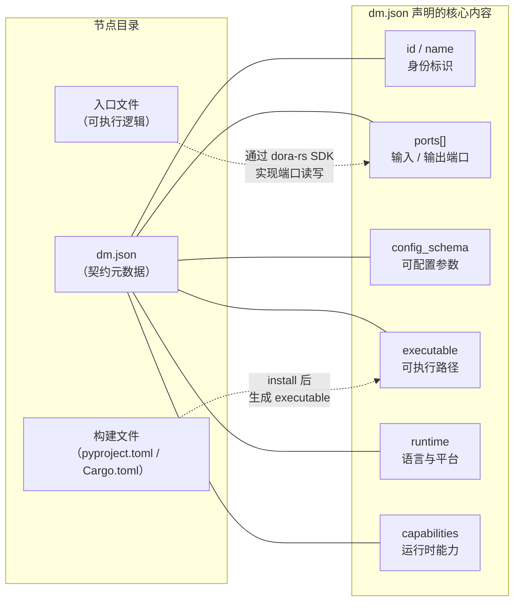
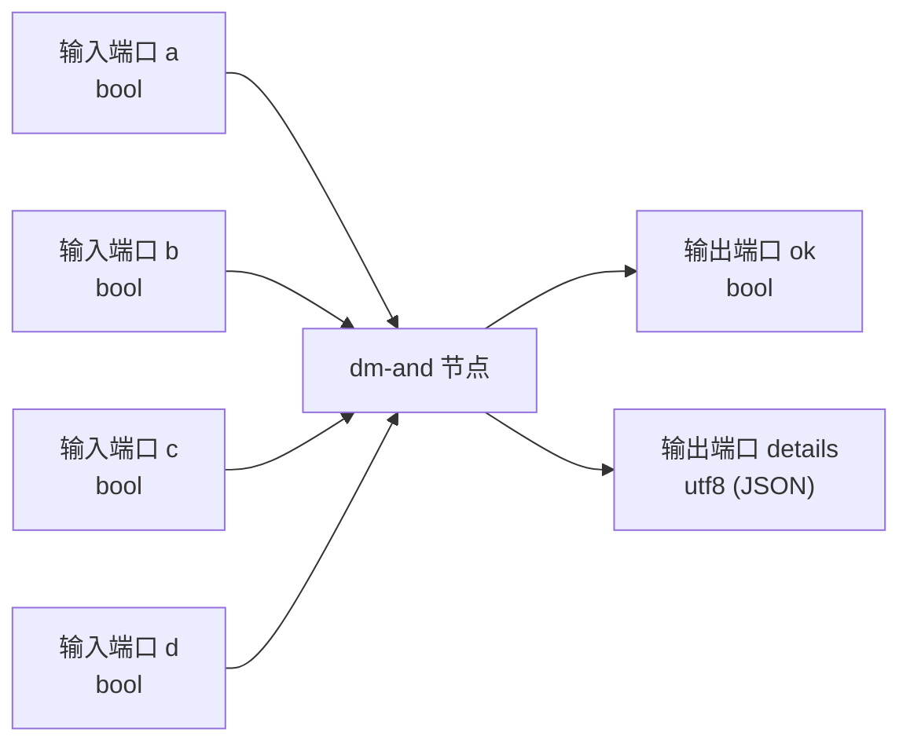
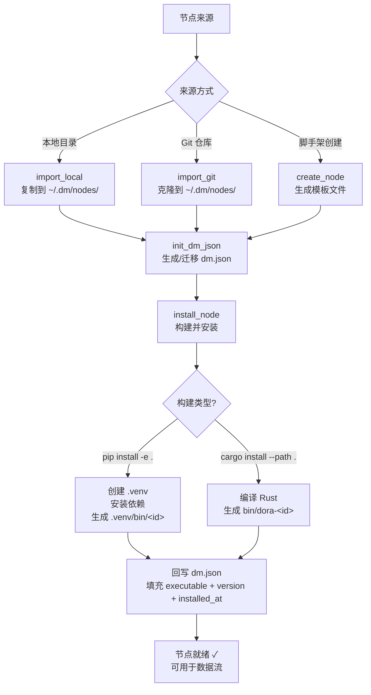

在 Dora Manager 的架构中，**节点（Node）是最基本的可执行单元**——它是数据流拓扑中的一个处理单元，接收输入、执行逻辑、发送输出。每个节点的所有元数据、端口声明和配置规范都被一份名为 **`dm.json`** 的 JSON 文件完整描述，这份文件就是节点与系统之间的**契约**。无论节点是用 Python、Rust 还是其他语言编写的，只要它拥有一份合法的 `dm.json`，就能被 Dora Manager 发现、安装、校验和调度运行。

Sources: [model.rs](https://github.com/l1veIn/dora-manager/blob/main/crates/dm-core/src/node/model.rs#L222-L288), [mod.rs](https://github.com/l1veIn/dora-manager/blob/main/crates/dm-core/src/node/mod.rs#L1-L6)

## 一个直觉性类比：带说明书的机器

你可以把节点想象成工厂里的一台**有明确接口的机器**：它有几个输入管道（input ports）和几个输出管道（output ports），内部有一套处理逻辑。原材料从输入管道进入，经过加工后从输出管道流出。`dm.json` 就是这台机器的**说明书**——它不包含机器内部的运转原理（那是代码的事），但它精确描述了机器的型号、接口规格、可调节参数以及运行环境要求。

下面的概念图展示了 `dm.json` 如何将节点的各个侧面组织在一起：



Sources: [dm.json](https://github.com/l1veIn/dora-manager/blob/main/nodes/dm-and/dm.json#L1-L102), [main.py](https://github.com/l1veIn/dora-manager/blob/main/nodes/dm-and/dm_and/main.py#L1-L94)

## 节点在文件系统中的位置

Dora Manager 的节点分布在不同位置，遵循一套**优先级查找机制**。系统在加载节点时会按以下顺序扫描目录：

| 优先级 | 目录路径 | 说明 |
|:---:|---|---|
| 1（最高） | `~/.dm/nodes/<node-id>/` | 用户安装的节点，同名时覆盖内置节点 |
| 2 | 仓库根目录 `nodes/` | 随项目分发的内置（builtin）节点 |
| 3 | `DM_NODE_DIRS` 环境变量指定的路径 | 开发者自定义的额外节点搜索路径 |

每个节点占据一个以节点 ID 命名的独立目录，目录中**必须包含 `dm.json` 文件**才能被系统识别。如果某个目录缺少有效的 `dm.json`，系统会为其生成一个最小化的 **fallback 节点**——只有 ID，没有端口声明、没有可执行路径。扫描时，同一 ID 只会被识别一次（先找到的优先），节点最终按 ID 字母序排列返回。

Sources: [paths.rs](https://github.com/l1veIn/dora-manager/blob/main/crates/dm-core/src/node/paths.rs#L11-L23), [local.rs](https://github.com/l1veIn/dora-manager/blob/main/crates/dm-core/src/node/local.rs#L88-L136)

## 典型节点目录结构

节点可以用 **Python** 或 **Rust** 实现，两者的目录结构略有不同。以下以内置的 `dm-and`（Python）和 `dm-mjpeg`（Rust）为例展示完整结构。

**Python 节点**（以 `dm-and` 为例）：

```
nodes/dm-and/
├── dm.json            ← 节点契约（核心）
├── pyproject.toml     ← Python 包定义（依赖、入口点）
├── README.md          ← 使用说明
└── dm_and/            ← Python 模块（目录名 = 节点 ID 中的 - 替换为 _）
    └── main.py        ← 节点入口逻辑
```

**Rust 节点**（以 `dm-mjpeg` 为例）：

```
nodes/dm-mjpeg/
├── dm.json            ← 节点契约（核心）
├── Cargo.toml         ← Rust 包定义（依赖、构建配置）
├── README.md          ← 使用说明
├── src/
│   ├── main.rs        ← 节点入口逻辑
│   └── lib.rs         ← 共享库代码
└── bin/               ← 编译后的二进制文件（install 后生成）
    └── dora-dm-mjpeg
```

两者的共同点是：**`dm.json` 始终是节点目录的入口**。`pyproject.toml` 或 `Cargo.toml` 负责定义依赖和构建方式，而 `dm.json` 在此基础上增加了端口声明、配置规范和分类标签等 Dora Manager 专属的元信息。

Sources: [dm.json](https://github.com/l1veIn/dora-manager/blob/main/nodes/dm-and/dm.json#L1-L102), [pyproject.toml](https://github.com/l1veIn/dora-manager/blob/main/nodes/dm-and/pyproject.toml#L1-L17), [dm.json](https://github.com/l1veIn/dora-manager/blob/main/nodes/dm-mjpeg/dm.json#L1-L101), [Cargo.toml](https://github.com/l1veIn/dora-manager/blob/main/nodes/dm-mjpeg/Cargo.toml#L1-L24)

## dm.json 字段全解析

`dm.json` 是节点的**单一事实来源**——从序列化/反序列化到 HTTP API 返回值，都直接映射自这份文件。以下表格按功能分组列出了所有字段：

### 身份与来源

| 字段 | 类型 | 必填 | 说明 |
|---|---|:---:|---|
| `id` | string | ✅ | 唯一标识符，必须与目录名一致（如 `"dm-and"`） |
| `name` | string | — | 人类可读的显示名称（默认与 `id` 相同） |
| `version` | string | ✅ | 语义化版本号（如 `"0.1.0"`） |
| `installed_at` | string | ✅ | 安装时间戳（Unix 秒字符串） |
| `description` | string | — | 节点功能的简短描述 |
| `source` | object | ✅ | 构建来源，包含 `build`（构建命令如 `"pip install -e ."`）和可选的 `github` URL |
| `executable` | string | ✅ | 安装后可执行文件的相对路径（安装前为空字符串） |
| `maintainers` | array | — | 维护者列表，每项含 `name`，可选 `email` / `url` |
| `license` | string | — | SPDX 许可证标识符（如 `"MIT"`、`"Apache-2.0"`） |

### 展示与分类

| 字段 | 类型 | 必填 | 说明 |
|---|---|:---:|---|
| `display.category` | string | — | 分类路径（如 `"Builtin/Logic"`、`"AI/Vision"`） |
| `display.tags` | string[] | — | 标签数组，用于搜索和过滤 |

### 运行时与能力

| 字段 | 类型 | 必填 | 说明 |
|---|---|:---:|---|
| `runtime.language` | string | — | 实现语言（`"python"` / `"rust"` / `"node"`） |
| `runtime.python` | string | — | Python 版本要求（如 `">=3.10"`） |
| `runtime.platforms` | string[] | — | 支持的平台列表（空 = 全平台） |
| `capabilities` | array | — | 运行时能力声明（详见下文） |
| `dynamic_ports` | bool | — | 是否允许 YAML 中声明未在 `ports` 预定义的端口 |

### 接口与配置

| 字段 | 类型 | 必填 | 说明 |
|---|---|:---:|---|
| `ports` | array | — | 端口声明数组，定义输入/输出接口 |
| `config_schema` | object | — | 配置参数规范，每个键映射到环境变量 |
| `files` | object | — | 文件索引：`readme`、`entry`、`config`、`tests`、`examples` |
| `path` | string | — | 运行时自动填充的绝对路径（**不存储在 dm.json 中**） |

以 `dora-yolo`（一个 AI 视觉推理节点）的 `dm.json` 为例，你可以看到这些字段是如何搭配使用的：它声明了 `"AI/Vision"` 分类、`"python"` 运行时、一个 `image` 输入端口和一个 `bbox` 输出端口，以及 `model` / `confidence` 等配置项。

Sources: [model.rs](https://github.com/l1veIn/dora-manager/blob/main/crates/dm-core/src/node/model.rs#L222-L288), [dm.json](https://github.com/l1veIn/dora-manager/blob/main/nodes/dora-yolo/dm.json#L1-L83)

## 端口（ports）：节点的通信接口

端口是节点与外部世界通信的**唯一通道**。每个端口声明包含以下属性：

```json
{
  "id": "frame",
  "name": "frame",
  "direction": "input",
  "description": "Image frame (raw bytes or encoded)",
  "required": true,
  "multiple": false,
  "schema": { "type": { "name": "int", "bitWidth": 8, "isSigned": false } }
}
```

| 属性 | 类型 | 说明 |
|---|---|---|
| `id` | string | 端口唯一标识，数据流连接时使用此 ID |
| `name` | string | 显示名称（可与 `id` 不同） |
| `direction` | string | `"input"` 或 `"output"`，决定数据流方向 |
| `description` | string | 端口用途的文字说明 |
| `required` | bool | 该端口是否**必须**被连接（默认 `true`） |
| `multiple` | bool | 是否接受多条连接（扇入/扇出） |
| `schema` | object | 数据类型约束，基于 Arrow 类型系统 |

以 `dm-and` 节点为例，它声明了 **4 个布尔输入端口**（`a`、`b`、`c`、`d`）和 **2 个输出端口**（`ok` 返回布尔 AND 结果，`details` 返回 JSON 格式的详细信息）：



端口 `schema` 的类型系统基于 **Apache Arrow** 格式，支持 `bool`、`utf8`、`int`、`float64`、`binary` 等多种类型。转译器在校验阶段会检查连线两端端口的数据类型兼容性——如果源节点的输出端口类型与目标节点的输入端口类型不匹配，系统会发出 `IncompatiblePortSchema` 诊断警告。关于类型系统的完整说明，请参阅 [Port Schema 与端口类型校验](8-port-schema-yu-duan-kou-lei-xing-xiao-yan)。

Sources: [model.rs](https://github.com/l1veIn/dora-manager/blob/main/crates/dm-core/src/node/model.rs#L156-L181), [dm.json](https://github.com/l1veIn/dora-manager/blob/main/nodes/dm-and/dm.json#L27-L82), [schema/model.rs](https://github.com/l1veIn/dora-manager/blob/main/crates/dm-core/src/node/schema/model.rs#L62-L107)

## 配置（config_schema）：参数化你的节点

`config_schema` 定义了节点的**可配置参数**。每个配置项都映射到一个**环境变量**，运行时通过环境变量传递给节点代码。这是一种优雅的解耦设计——`dm.json` 声明"有什么参数"，节点代码通过"读环境变量"来获取值。

以下示例来自 `dm-mjpeg` 节点的配置声明：

```json
"config_schema": {
  "port": {
    "default": 4567,
    "env": "PORT"
  },
  "input_format": {
    "default": "jpeg",
    "env": "INPUT_FORMAT",
    "x-widget": {
      "type": "select",
      "options": ["jpeg", "rgb8", "rgba8", "yuv420p"]
    }
  },
  "max_fps": {
    "default": 30,
    "env": "MAX_FPS"
  }
}
```

| 属性 | 说明 |
|---|---|
| `default` | 参数的默认值（当所有层级的配置都未提供时使用） |
| `env` | 映射到的环境变量名（**必填**——没有 `env` 的配置项会被忽略） |
| `description` | 参数用途说明（可选） |
| `x-widget` | UI 渲染提示，如 `"type": "select"` 搭配 `options` 数组（可选） |

**配置值的四层优先级**（高优先级覆盖低优先级）：

1. **YAML 内联配置**（`config:` 块中直接声明的值）——最高优先级
2. **节点持久化配置**（`config.json` 文件中的值）
3. **dm.json schema 默认值**（`config_schema` 中的 `default` 字段）
4. 环境变量名由 `config_schema.<key>.env` 字段指定

转译器在合并配置后，会将最终值写入输出 YAML 的 `env:` 块中，供 dora-rs 运行时注入到节点进程的环境变量里。

Sources: [dm.json](https://github.com/l1veIn/dora-manager/blob/main/nodes/dm-mjpeg/dm.json#L54-L100), [passes.rs](https://github.com/l1veIn/dora-manager/blob/main/crates/dm-core/src/dataflow/transpile/passes.rs#L355-L421)

## capabilities：节点的运行时能力

`capabilities` 字段声明了节点在运行时具备的特殊能力。它支持两种形式：

**简单标签形式**——仅声明能力名称：

```json
"capabilities": ["configurable", "media"]
```

**结构化详情形式**——携带角色绑定的详细信息：

```json
"capabilities": [
  "configurable",
  {
    "name": "widget_input",
    "bindings": [
      {
        "role": "widget",
        "channel": "register",
        "media": ["widgets"],
        "lifecycle": ["run_scoped", "stop_aware"],
        "description": "Registers a button widget with the DM interaction plane."
      },
      {
        "role": "widget",
        "port": "click",
        "channel": "input",
        "media": ["pulse"],
        "lifecycle": ["run_scoped", "stop_aware"]
      }
    ]
  }
]
```

常见的简单能力标签包括：

| 标签 | 含义 |
|---|---|
| `configurable` | 节点接受配置参数（拥有 `config_schema`） |
| `media` | 节点处理媒体数据（音视频流） |

结构化能力（如 `widget_input`、`display`）用于声明节点与交互系统的绑定关系。转译器会识别这些能力，并在数据流中自动注入一个隐藏的 **Bridge 节点**，将 Web 前端的控件事件路由到节点的输入端口。这部分机制的详细说明请参阅 [交互系统架构：dm-input / dm-message / Bridge 节点注入原理](22-jiao-hu-xi-tong-jia-gou-dm-input-dm-message-bridge-jie-dian-zhu-ru-yuan-li)。

Sources: [model.rs](https://github.com/l1veIn/dora-manager/blob/main/crates/dm-core/src/node/model.rs#L71-L116), [dm.json](https://github.com/l1veIn/dora-manager/blob/main/nodes/dm-button/dm.json#L25-L57)

## 节点注册表（registry.json）

除了 `~/.dm/nodes/` 和仓库内置的 `nodes/` 目录外，Dora Manager 还维护一份编译时嵌入的**节点注册表** `registry.json`。注册表提供了集中式的节点发现机制，记录了所有已知节点的来源信息：

```json
{
  "dm-and": {
    "source": { "type": "local", "path": "nodes/dm-and" },
    "category": "Builtin/Logic",
    "tags": ["logic", "bool", "and"]
  },
  "dm-mjpeg": {
    "source": { "type": "local", "path": "nodes/dm-mjpeg" },
    "category": "Builtin/Media",
    "tags": ["builtin", "rust", "video"]
  }
}
```

注册表支持两种来源类型：`local`（本地路径，相对于仓库根目录）和 `git`（远程 Git 仓库 URL）。当转译器遇到一个未安装的节点 ID 时，会查阅注册表来确定节点的来源，从而支持自动安装流程。

Sources: [hub.rs](https://github.com/l1veIn/dora-manager/blob/main/crates/dm-core/src/node/hub.rs#L1-L73), [registry.json](https://github.com/l1veIn/dora-manager/blob/main/registry.json)

## 节点生命周期：从创建到运行

节点的完整生命周期分为三个阶段：**导入/创建** → **安装构建** → **运行时执行**。以下流程图展示了这一过程：



### 阶段一：导入与创建

**dm.json 的生成遵循优先级推理链**：系统会依次检查已有的 `dm.json`（迁移模式）、`pyproject.toml`（Python 项目元数据）、`Cargo.toml`（Rust 项目元数据），从中提取节点名称、版本号、描述、作者等信息。如果两者都存在，`pyproject.toml` 优先于 `Cargo.toml`。通过脚手架 `create_node` 创建的节点会自动生成 `pyproject.toml`、`main.py` 模板和 `README.md`。

Sources: [init.rs](https://github.com/l1veIn/dora-manager/blob/main/crates/dm-core/src/node/init.rs#L21-L114), [local.rs](https://github.com/l1veIn/dora-manager/blob/main/crates/dm-core/src/node/local.rs#L13-L86)

### 阶段二：安装构建

`dm.json` 中的 `source.build` 字段决定了安装策略：

| build 命令 | 行为 | 生成的 executable 路径 |
|---|---|---|
| `pip install -e .` | 在节点目录下创建 `.venv`，以 editable 模式安装 | `.venv/bin/<node-id>` |
| `pip install <package>` | 创建 `.venv`，从 PyPI 安装指定包 | `.venv/bin/<node-id>` |
| `cargo install --path .` | 本地编译 Rust 项目 | `bin/dora-<node-id>` |

安装过程会优先使用 `uv`（如果系统中有）来替代 `pip`，以获得更快的安装速度。安装完成后，系统会回写 `dm.json`，填充 `executable`（可执行文件相对路径）、`version`（实际版本号）和 `installed_at`（安装时间戳）。**未安装的节点（`executable` 为空字符串）无法被数据流使用**——转译器会发出 `MissingExecutable` 诊断错误。

Sources: [install.rs](https://github.com/l1veIn/dora-manager/blob/main/crates/dm-core/src/node/install.rs#L11-L75)

### 阶段三：运行时——从 dm.json 到 dora YAML

当用户启动一个数据流时，转译器（transpiler）会执行一条多阶段管线，将 DM 风格的 YAML 转换为标准 dora-rs 可执行的 YAML。在这个管线中，`dm.json` 在多个阶段扮演关键角色：

| Pass | 名称 | 与 dm.json 的关系 |
|:---:|---|---|
| 1 | **parse** | 识别 YAML 中的 `node:` 字段，将节点分类为 Managed（受管理）节点 |
| 2 | **resolve_paths** | 读取 `dm.json`，将 `node: dm-and` 解析为绝对路径（如 `/path/to/.venv/bin/dm-and`） |
| 3 | **validate_port_schemas** | 读取连线两端节点的 `dm.json` ports 声明，校验 Arrow 类型兼容性 |
| 4 | **merge_config** | 读取 `config_schema`，按四层优先级合并配置值，注入到 `env:` |
| 5 | **inject_runtime_env** | 注入 `DM_RUN_ID`、`DM_NODE_ID`、`DM_RUN_OUT_DIR` 等通用环境变量 |
| 6 | **inject_dm_bridge** | 识别结构化 capabilities，为交互节点注入隐藏的 Bridge 节点 |
| 7 | **emit** | 输出标准 dora YAML，所有 `node:` 已替换为 `path:` |

转译完成后，标准 YAML 被传递给 dora-rs 协调器（dora-coordinator），由它负责拉起各节点进程。

Sources: [mod.rs](https://github.com/l1veIn/dora-manager/blob/main/crates/dm-core/src/dataflow/transpile/mod.rs#L1-L84), [passes.rs](https://github.com/l1veIn/dora-manager/blob/main/crates/dm-core/src/dataflow/transpile/passes.rs#L1-L100)

## 在数据流中引用节点

在 DM 风格的 YAML 数据流中，节点通过 `node:` 字段引用（而非 dora-rs 原生的 `path:` 绝对路径）。以下是一个交互式数据流示例：

```yaml
nodes:
  - id: prompt              # 数据流内的实例 ID（可自定义）
    node: dm-text-input     # 引用 dm.json 中的节点 ID
    outputs:
      - value
    config:                 # 内联配置，覆盖 config_schema 默认值
      label: "Prompt"
      placeholder: "Type something..."

  - id: echo
    node: dora-echo
    inputs:
      value: prompt/value   # 连接到 prompt 实例的 value 输出端口
    outputs:
      - value

  - id: message
    node: dm-message
    inputs:
      message: echo/value
```

转译后，`node: dm-text-input` 被替换为 `path: /absolute/path/to/.venv/bin/dm-text-input`，同时所有 `config` 项被转换为 `env:` 环境变量。这个转译过程的详细说明请参阅 [数据流转译器（Transpiler）：多 Pass 管线与四层配置合并](11-shu-ju-liu-zhuan-yi-qi-transpiler-duo-pass-guan-xian-yu-si-ceng-pei-zhi-he-bing)。

Sources: [passes.rs](https://github.com/l1veIn/dora-manager/blob/main/crates/dm-core/src/dataflow/transpile/passes.rs#L15-L101)

## 节点的两大类别：内置节点与社区节点

通过观察 `nodes/` 目录和 `dm.json` 的 `display.category` 字段，可以将内置节点归纳为以下类别：

| 类别 | 示例节点 | 功能概述 |
|---|---|---|
| **Logic** | `dm-and`, `dm-gate` | 布尔逻辑运算与条件门控 |
| **Interaction** | `dm-button`, `dm-slider`, `dm-text-input`, `dm-message`, `dm-input-switch` | UI 交互控件：按钮、滑块、文本输入、显示面板、开关 |
| **Media** | `dm-mjpeg`, `dm-screen-capture` | 视频流预览、屏幕采集 |
| **Flow Control** | `dm-queue` | FIFO 缓冲与流量控制 |
| **AI 推理** | `dora-qwen`, `dora-distil-whisper`, `dora-kokoro-tts`, `dora-vad` | LLM、语音识别、TTS、语音活动检测 |
| **视觉** | `dora-yolo`, `opencv-plot`, `opencv-video-capture` | 目标检测、图像可视化、摄像头采集 |
| **工具** | `dm-log`, `dm-save`, `dm-downloader`, `dm-check-ffmpeg` | 日志、存储、下载、环境检测 |

每个类别的节点都遵循相同的 `dm.json` 契约规范，但具有不同的端口配置和能力声明。关于每个节点的详细功能，请参阅 [内置节点总览：从媒体采集到 AI 推理](7-nei-zhi-jie-dian-zong-lan-cong-mei-ti-cai-ji-dao-ai-tui-li)。

Sources: [registry.json](https://github.com/l1veIn/dora-manager/blob/main/registry.json), [dm.json](https://github.com/l1veIn/dora-manager/blob/main/nodes/dm-and/dm.json#L18-L19), [dm.json](https://github.com/l1veIn/dora-manager/blob/main/nodes/dm-button/dm.json#L18-L23)

## 节点实现的核心模式

无论使用 Python 还是 Rust，节点的实现都遵循 dora-rs SDK 提供的**事件循环模式**：创建 Node 实例 → 遍历事件流 → 处理 INPUT 事件 → 调用 `send_output` 发送结果。

### Python 节点模式（以 dm-and 为例）

```python
from dora import Node
import pyarrow as pa

node = Node()
for event in node:
    if event["type"] == "INPUT":
        input_id = event["id"]        # 对应 dm.json 中的端口 id
        value = event["value"]         # PyArrow 格式的数据
        # ... 业务逻辑 ...
        node.send_output("ok", pa.array([result]))  # 输出到 "ok" 端口
```

### Rust 节点模式（以 dm-mjpeg 为例）

```rust
use dora_node_api::{DoraNode, Event};

let (_node, mut events) = DoraNode::init_from_env()?;
while let Some(event) = events.recv() {
    match event {
        Event::Input { id, data, .. } if id.as_str() == "frame" => {
            // 处理 "frame" 端口的输入数据
            let bytes = arrow_to_bytes(&data)?;
            // ... 业务逻辑 ...
        }
        Event::Stop(_) => break,
        _ => {}
    }
}
```

**关键实现要点**：

- **环境变量驱动配置**：节点通过 `os.getenv("EXPECTED_INPUTS")` 等方式读取配置，这些环境变量由转译器从 `config_schema` 四层合并后注入
- **DM 运行时变量**：系统自动注入 `DM_RUN_ID`（运行 ID）、`DM_NODE_ID`（YAML 中的实例 ID）、`DM_RUN_OUT_DIR`（运行输出目录）等环境变量
- **PyArrow / Arrow 数据传输**：输入输出的数据通过 Arrow 数组格式在节点间传递，支持零拷贝共享内存

Sources: [main.py](https://github.com/l1veIn/dora-manager/blob/main/nodes/dm-and/dm_and/main.py#L1-L94), [main.rs](https://github.com/l1veIn/dora-manager/blob/main/nodes/dm-mjpeg/src/main.rs#L1-L63), [passes.rs](https://github.com/l1veIn/dora-manager/blob/main/crates/dm-core/src/dataflow/transpile/passes.rs#L428-L451)

## 下一步阅读

理解了节点的基本概念后，建议继续探索以下主题：

- **[数据流（Dataflow）：YAML 拓扑定义与节点连接](5-shu-ju-liu-dataflow-yaml-tuo-bu-ding-yi-yu-jie-dian-lian-jie)**——了解多个节点如何在 YAML 中组成完整的数据处理拓扑
- **[运行实例（Run）：生命周期状态机与指标追踪](6-yun-xing-shi-li-run-sheng-ming-zhou-qi-zhuang-tai-ji-yu-zhi-biao-zhui-zong)**——理解节点被启动后如何成为受管理的运行实例
- **[内置节点总览：从媒体采集到 AI 推理](7-nei-zhi-jie-dian-zong-lan-cong-mei-ti-cai-ji-dao-ai-tui-li)**——深入了解每个内置节点的具体功能与使用方式
- **[Port Schema 与端口类型校验](8-port-schema-yu-duan-kou-lei-xing-xiao-yan)**——理解端口类型系统如何保证节点间数据安全传递
- **[自定义节点开发指南：dm.json 完整字段参考](9-zi-ding-yi-jie-dian-kai-fa-zhi-nan-dm-json-wan-zheng-zi-duan-can-kao)**——当你需要创建自己的节点时的完整参考手册