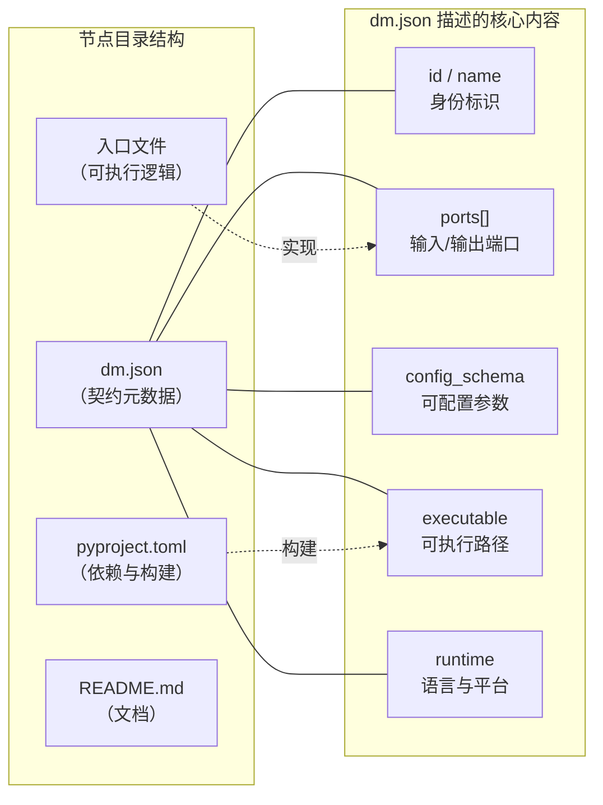
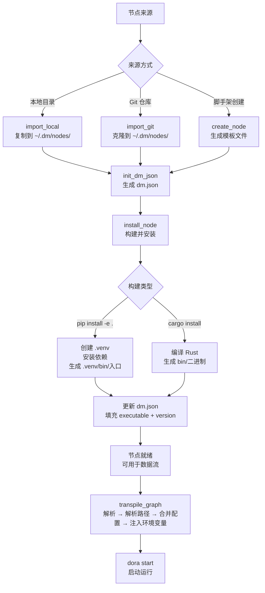

在 Dora Manager 的架构中，**节点（Node）是最基本的可执行单元**——它是数据流拓扑中的一个处理单元，接收输入、执行逻辑、发送输出。每个节点的所有元数据、端口声明和配置规范都被一份名为 `dm.json` 的 JSON 文件完整描述，这份文件构成了节点与运行时系统之间的**契约**。理解节点的概念是掌握 Dora Manager 的基础，因为数据流的构建本质上就是选择节点、声明连接、配置参数的过程。

Sources: [model.rs](https://github.com/l1veIn/dora-manager/blob/master/crates/dm-core/src/node/model.rs#L105-L168), [mod.rs](https://github.com/l1veIn/dora-manager/blob/master/crates/dm-core/src/node/mod.rs#L1-L6)

## 节点是什么：一个直觉性类比

你可以把节点想象成一台**有明确接口的机器**：它有几个输入管道（input ports）和几个输出管道（output ports），内部有一套处理逻辑。原材料从输入管道进入，经过加工后从输出管道流出。`dm.json` 就是这台机器的**说明书**——告诉系统这台机器叫什么、需要什么原料、产出什么、如何启动、有哪些可调参数。

在下图中，一个典型节点的结构被可视化呈现。`dm.json` 描述了节点的身份、端口和配置；`dm-and` 节点的实现代码（`main.py`）通过 dora-rs SDK 读取输入事件、处理逻辑、发送输出。



Sources: [dm.json](https://github.com/l1veIn/dora-manager/blob/master/nodes/dm-and/dm.json#L1-L103), [main.py](https://github.com/l1veIn/dora-manager/blob/master/nodes/dm-and/dm_and/main.py#L1-L94)

## 节点在文件系统中的位置

Dora Manager 的节点分布在不同位置，遵循一套**优先级查找机制**。系统会按照以下顺序扫描节点目录：

| 优先级 | 目录路径 | 说明 |
|:---:|---|---|
| 1（最高） | `~/.dm/nodes/&lt;node-id&gt;/` | 用户安装的节点，覆盖同 ID 内置节点 |
| 2 | 仓库 `nodes/` 目录 | 随项目分发的内置（builtin）节点 |
| 3 | `DM_NODE_DIRS` 环境变量 | 额外的自定义节点搜索路径 |

每个节点占据一个以节点 ID 命名的独立目录，目录中必须包含 `dm.json` 文件才能被系统识别。如果某个目录缺少有效的 `dm.json`，系统会为其生成一个最小化的 **fallback 节点**——只有 ID，没有端口、没有可执行路径。

Sources: [paths.rs](https://github.com/l1veIn/dora-manager/blob/master/crates/dm-core/src/node/paths.rs#L1-L53), [local.rs](https://github.com/l1veIn/dora-manager/blob/master/crates/dm-core/src/node/local.rs#L88-L136), [README.md](https://github.com/l1veIn/dora-manager/blob/master/nodes/README.md#L1-L12)

## 典型节点目录结构

节点可以基于 **Python** 或 **Rust** 实现，两者的目录结构略有不同。以下以内置的 `dm-and`（Python）和 `dm-mjpeg`（Rust）为例展示：

**Python 节点**（以 `dm-and` 为例）：

```
nodes/dm-and/
├── dm.json           ← 节点契约（核心）
├── pyproject.toml    ← Python 包定义（依赖、入口点）
├── README.md         ← 使用说明
└── dm_and/           ← Python 模块
    └── main.py       ← 节点入口逻辑
```

**Rust 节点**（以 `dm-mjpeg` 为例）：

```
nodes/dm-mjpeg/
├── dm.json           ← 节点契约（核心）
├── Cargo.toml        ← Rust 包定义（依赖、构建）
├── README.md         ← 使用说明
├── src/
│   └── main.rs       ← 节点入口逻辑
└── bin/              ← 编译后的二进制文件（安装后生成）
    └── dora-dm-mjpeg
```

Sources: [dm.json](https://github.com/l1veIn/dora-manager/blob/master/nodes/dm-and/dm.json#L1-L103), [pyproject.toml](https://github.com/l1veIn/dora-manager/blob/master/nodes/dm-and/pyproject.toml#L1-L17), [Cargo.toml](https://github.com/l1veIn/dora-manager/blob/master/nodes/dm-mjpeg/Cargo.toml#L1-L24)

## dm.json 字段全解析

`dm.json` 是节点的**单一事实来源**——从序列化/反序列化到 HTTP API 返回值，都直接映射自这份文件。以下表格列出了所有字段及其作用：

| 字段 | 类型 | 必填 | 说明 |
|---|---|:---:|---|
| `id` | string | ✅ | 唯一标识符，必须与目录名一致（如 `"dm-and"`） |
| `name` | string | ✅ | 人类可读的显示名称 |
| `version` | string | ✅ | 语义化版本号（如 `"0.1.0"`） |
| `installed_at` | string | ✅ | 安装时间戳（Unix 秒） |
| `description` | string | — | 节点功能的简短描述 |
| `source` | object | ✅ | 构建来源信息，包含 `build`（构建命令）和可选的 `github` URL |
| `executable` | string | ✅ | 可执行文件的相对路径（安装后填充） |
| `display` | object | — | 展示元数据：`category`（分类路径）和 `tags`（标签数组） |
| `capabilities` | string[] | — | 运行时能力声明（如 `"configurable"`, `"media"`, `"streaming"`） |
| `runtime` | object | — | 运行时信息：`language`、`python`（版本要求）、`platforms` |
| `ports` | array | — | 端口声明数组，定义输入/输出接口 |
| `config_schema` | object | — | 配置参数规范，每个键映射到环境变量 |
| `files` | object | — | 文件索引：`readme`、`entry`、`config`、`tests`、`examples` |
| `maintainers` | array | — | 维护者列表，每项含 `name`、可选 `email`/`url` |
| `license` | string | — | SPDX 许可证标识符 |
| `dynamic_ports` | bool | — | 是否允许 YAML 中声明未在 `ports` 中预定义的端口 |
| `path` | string | — | 运行时填充的绝对路径（不存储在 dm.json 中） |

Sources: [model.rs](https://github.com/l1veIn/dora-manager/blob/master/crates/dm-core/src/node/model.rs#L111-L168)

### 端口（ports）字段详解

端口是节点与外部世界通信的**唯一通道**。每个端口声明包含以下属性：

```json
{
  "id": "frame",
  "name": "frame",
  "direction": "input",
  "description": "Image frame (raw bytes or encoded)",
  "required": true,
  "multiple": false,
  "schema": { "type": { "name": "int", "bitWidth": 8, "isSigned": false } }
}
```

| 属性 | 说明 |
|---|---|
| `id` | 端口唯一标识，数据流连接时使用此 ID |
| `name` | 显示名称 |
| `direction` | `"input"` 或 `"output"`，决定数据流方向 |
| `description` | 端口用途的文字说明 |
| `required` | 该端口是否必须被连接 |
| `multiple` | 是否接受多条连接（扇入/扇出） |
| `schema` | 数据类型约束，基于 Arrow 类型系统（详见 [Port Schema 规范](20-port-schema)） |

以 `dm-and` 节点为例，它声明了 4 个布尔输入端口（`a`、`b`、`c`、`d`）和 2 个输出端口（`ok` 返回布尔结果，`details` 返回 JSON 详细信息）：

Sources: [model.rs](https://github.com/l1veIn/dora-manager/blob/master/crates/dm-core/src/node/model.rs#L52-L69), [dm.json](https://github.com/l1veIn/dora-manager/blob/master/nodes/dm-and/dm.json#L27-L82), [dm.json](https://github.com/l1veIn/dora-manager/blob/master/nodes/dm-mjpeg/dm.json#L33-L46)

### 配置（config_schema）字段详解

`config_schema` 定义了节点的**可配置参数**。每个配置项都映射到一个环境变量，运行时通过环境变量传递给节点代码。这是一种优雅的解耦设计——dm.json 声明"有什么参数"，节点代码通过"读环境变量"来获取值。

```json
"config_schema": {
  "expected_inputs": {
    "default": "a,b",
    "env": "EXPECTED_INPUTS"
  },
  "require_all_seen": {
    "default": "true",
    "env": "REQUIRE_ALL_SEEN"
  }
}
```

| 属性 | 说明 |
|---|---|
| `default` | 参数的默认值 |
| `env` | 映射到的环境变量名 |
| `description` | 参数用途说明（可选） |
| `x-widget` | UI 渲染提示，如 `"type": "select"` 搭配 `options` 数组（可选） |

Sources: [dm.json](https://github.com/l1veIn/dora-manager/blob/master/nodes/dm-and/dm.json#L90-L99), [dm.json](https://github.com/l1veIn/dora-manager/blob/master/nodes/dm-queue/dm.json#L96-L152), [passes.rs](https://github.com/l1veIn/dora-manager/blob/master/crates/dm-core/src/dataflow/transpile/passes.rs#L349-L416)

## 节点生命周期：从创建到运行

节点的完整生命周期可以分为三个阶段：**导入/创建**、**安装构建**、**运行时执行**。以下流程图展示了这一过程：



Sources: [import.rs](https://github.com/l1veIn/dora-manager/blob/master/crates/dm-core/src/node/import.rs#L20-L84), [init.rs](https://github.com/l1veIn/dora-manager/blob/master/crates/dm-core/src/node/init.rs#L17-L112), [install.rs](https://github.com/l1veIn/dora-manager/blob/master/crates/dm-core/src/node/install.rs#L11-L75), [mod.rs](https://github.com/l1veIn/dora-manager/blob/master/crates/dm-core/src/dataflow/transpile/mod.rs#L31-L81)

### 阶段一：导入与创建

**dm.json 的生成遵循优先级推理链**：系统会依次检查已有的 `dm.json`（迁移）、`pyproject.toml`（Python 项目元数据）、`Cargo.toml`（Rust 项目元数据），从中提取节点名称、版本号、描述、作者等信息。如果两者都存在，`pyproject.toml` 优先。这意味着你只需编写标准的 `pyproject.toml` 或 `Cargo.toml`，运行 `dm node init` 即可自动生成对应的 `dm.json`。

Sources: [init.rs](https://github.com/l1veIn/dora-manager/blob/master/crates/dm-core/src/node/init.rs#L40-L112)

### 阶段二：安装构建

`dm.json` 中的 `source.build` 字段决定了安装策略：

| build 命令 | 行为 | 生成的 executable 路径 |
|---|---|---|
| `pip install -e .` | 在节点目录下创建 `.venv`，以 editable 模式安装 | `.venv/bin/&lt;node-id&gt;` |
| `pip install <package>` | 创建 `.venv`，从 PyPI 安装指定包 | `.venv/bin/&lt;node-id&gt;` |
| `cargo install --path .` | 本地编译 Rust 项目 | `bin/dora-&lt;node-id&gt;` |

安装完成后，系统会回写 `dm.json`，填充 `executable`（可执行文件相对路径）、`version`（实际版本号）和 `installed_at`（安装时间戳）。**未安装的节点无法被数据流使用**——转译器（transpiler）会报 `MissingExecutable` 诊断错误。

Sources: [install.rs](https://github.com/l1veIn/dora-manager/blob/master/crates/dm-core/src/node/install.rs#L11-L75), [error.rs](https://github.com/l1veIn/dora-manager/blob/master/crates/dm-core/src/dataflow/transpile/error.rs#L16-L31)

### 阶段三：运行时——从 dm.json 到 dora YAML

当用户启动一个数据流时，转译器（transpiler）会执行一条多阶段管线，将 DM 风格的 YAML 转换为标准 dora-rs 可执行的 YAML：

| Pass | 名称 | 与 dm.json 的关系 |
|:---:|---|---|
| 1 | **parse** | 识别 YAML 中的 `node:` 字段，分类为 Managed 节点 |
| 2 | **resolve_paths** | 读取 `dm.json`，将 `node: dm-and` 解析为绝对路径 `/path/to/dm-and/.venv/bin/dm-and` |
| 3 | **validate_port_schemas** | 读取两端节点的 `dm.json` ports 声明，校验类型兼容性 |
| 4 | **merge_config** | 读取 `config_schema`，按四层优先级合并配置值注入到 `env:` |
| 5 | **inject_runtime_env** | 注入 `DM_RUN_ID`、`DM_NODE_ID`、`DM_SERVER_URL` 等通用环境变量 |
| 6 | **emit** | 输出标准 dora YAML，`node:` 已替换为 `path:` |

**配置合并的四层优先级**（高优先级覆盖低优先级）：

1. **YAML 内联配置**（`config:` 块中直接声明的值）——最高优先级
2. **节点持久化配置**（`config.json` 文件中的值）
3. **dm.json schema 默认值**（`config_schema` 中的 `default` 字段）
4. 环境变量名由 `config_schema.&lt;key&gt;.env` 字段指定

Sources: [passes.rs](https://github.com/l1veIn/dora-manager/blob/master/crates/dm-core/src/dataflow/transpile/passes.rs#L1-L510), [mod.rs](https://github.com/l1veIn/dora-manager/blob/master/crates/dm-core/src/dataflow/transpile/mod.rs#L1-L82)

## 在数据流中引用节点

在 DM 风格的 YAML 数据流中，节点通过 `node:` 字段引用，而非直接指定 `path:`。以下是一个完整的交互式数据流示例：

```yaml
nodes:
  - id: prompt          # 数据流内的实例 ID
    node: dm-text-input # 引用 dm.json 中的节点 ID
    outputs:
      - value
    config:             # 内联配置，覆盖 config_schema 默认值
      label: "Prompt"
      placeholder: "Type something..."
      multiline: true

  - id: echo
    node: dora-echo     # 外部节点（也通过 dm.json 管理）
    inputs:
      value: prompt/value  # 连接到 prompt 节点的 value 输出
    outputs:
      - value

  - id: display
    node: dm-display
    inputs:
      data: echo/value
    config:
      label: "Echo Output"
      render: text
```

转译后，`node: dm-text-input` 被替换为 `path: /absolute/path/to/.venv/bin/dm-text-input`，同时所有 `config` 项被转换为 `env:` 环境变量。

Sources: [interaction-demo.yml](https://github.com/l1veIn/dora-manager/blob/master/tests/dataflows/interaction-demo.yml#L1-L25), [passes.rs](https://github.com/l1veIn/dora-manager/blob/master/crates/dm-core/src/dataflow/transpile/passes.rs#L15-L95)

## 节点的两大类别：内置节点与社区节点

通过观察 `nodes/` 目录和 `dm.json` 的 `display.category` 字段，可以将内置节点归纳为以下类别：

| 类别 | 示例节点 | 功能概述 |
|---|---|---|
| **Logic** | `dm-and`, `dm-gate` | 布尔逻辑运算与条件门控 |
| **Interaction** | `dm-button`, `dm-slider`, `dm-text-input`, `dm-display`, `dm-input-switch` | UI 交互控件：按钮、滑块、文本输入、显示面板、开关 |
| **Media** | `dm-mjpeg`, `dm-recorder`, `dm-stream-publish` | 视频流预览、录制、流媒体发布 |
| **Flow Control** | `dm-queue` | FIFO 缓冲与流量控制 |
| **AI 推理** | `dora-qwen`, `dora-distil-whisper`, `dora-kokoro-tts`, `dora-vad` | LLM、语音识别、TTS、语音活动检测 |
| **工具** | `dm-log`, `dm-save`, `dm-downloader`, `dm-check-ffmpeg` | 日志、存储、下载、环境检测 |

Sources: [dm.json](https://github.com/l1veIn/dora-manager/blob/master/nodes/dm-and/dm.json#L17-L20), [dm.json](https://github.com/l1veIn/dora-manager/blob/master/nodes/dm-button/dm.json#L17-L23), [dm.json](https://github.com/l1veIn/dora-manager/blob/master/nodes/dm-mjpeg/dm.json#L18-L24), [dm.json](https://github.com/l1veIn/dora-manager/blob/master/nodes/dm-queue/dm.json#L17-L24)

## 节点实现的核心模式

无论使用 Python 还是 Rust，节点的实现都遵循 dora-rs SDK 提供的**事件循环模式**：创建 Node 实例 → 遍历事件流 → 处理 INPUT 事件 → 调用 `send_output` 发送结果。

以 `dm-and` 为例（Python）：

```python
from dora import Node
import pyarrow as pa

node = Node()
for event in node:
    if event["type"] == "INPUT":
        input_id = event["id"]
        value = event["value"]
        # 处理逻辑...
        node.send_output("ok", pa.array([result]))
```

关键实现要点：
- **环境变量驱动配置**：节点通过 `os.getenv("EXPECTED_INPUTS")` 等方式读取配置，这些环境变量由转译器从 `config_schema` 注入
- **DM 运行时变量**：系统自动注入 `DM_RUN_ID`（运行 ID）、`DM_NODE_ID`（实例 ID）、`DM_SERVER_URL`（服务地址）等环境变量
- **PyArrow 数据传输**：输入输出的数据通过 PyArrow 数组格式在节点间传递

Sources: [main.py](https://github.com/l1veIn/dora-manager/blob/master/nodes/dm-and/dm_and/main.py#L1-L94), [passes.rs](https://github.com/l1veIn/dora-manager/blob/master/crates/dm-core/src/dataflow/transpile/passes.rs#L422-L449)

## 下一步阅读

理解了节点的基本概念后，建议继续探索以下主题：

- **[数据流（Dataflow）：YAML 拓扑与节点连接](05-dataflow-concept)**——了解多个节点如何在 YAML 中组成完整的数据处理拓扑
- **[内置节点一览：从媒体采集到 AI 推理](19-builtin-nodes)**——深入了解每个内置节点的具体功能与使用方式
- **[Port Schema 规范：基于 Arrow 类型系统的端口校验](20-port-schema)**——理解端口类型系统如何保证节点间数据安全传递
- **[数据流转译器：多 Pass 管线与四层配置合并](08-transpiler)**——深入转译管线的实现细节
- **[开发自定义节点：dm.json 完整字段参考](22-custom-node-guide)**——当你需要创建自己的节点时的完整参考手册