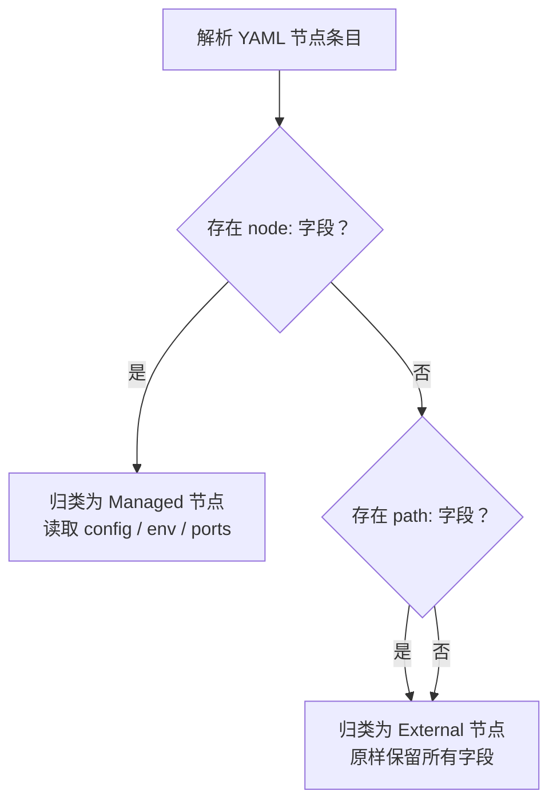
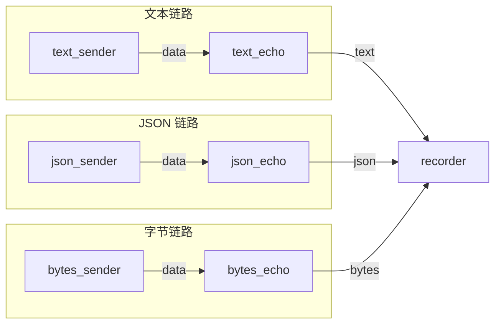
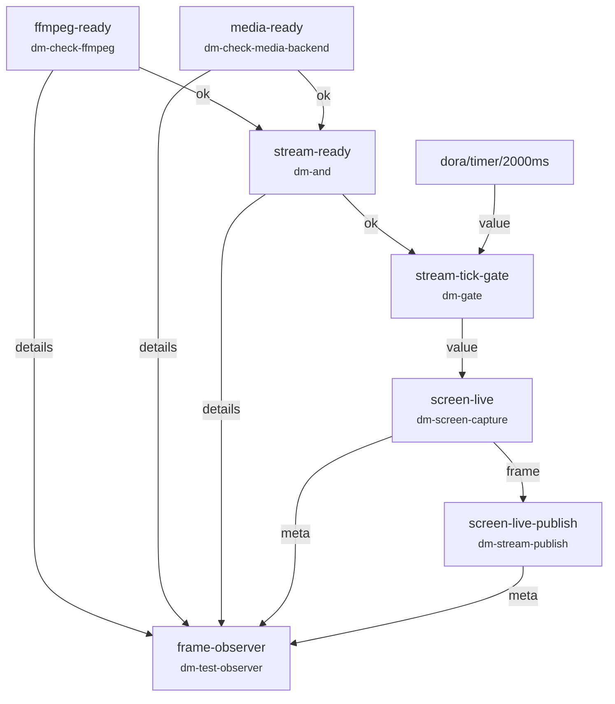
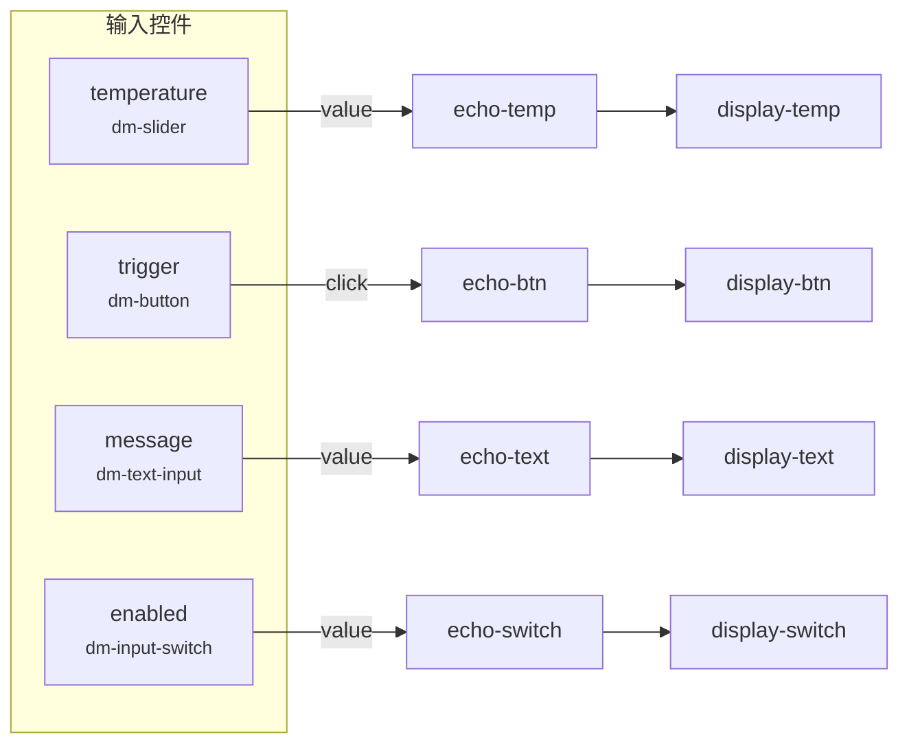
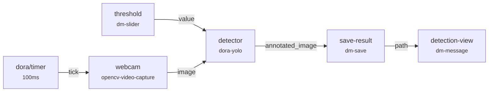

数据流是 Dora Manager 中最核心的抽象——一个 YAML 文件定义了一张**有向数据图**：节点是图上的计算单元，边是节点之间的数据传输通道。本文将从 YAML 文件的基本结构出发，逐步带你理解节点声明、连接语法、配置传递，以及系统如何将这份声明式描述转化为可运行的管线。

Sources: [demo-hello-timer.yml](demos/demo-hello-timer.yml#L1-L39), [model.rs](https://github.com/l1veIn/dora-manager/blob/main/crates/dm-core/src/dataflow/model.rs#L1-L172)

## 数据流是什么：一张有向数据图

数据流本质上是一张 **有向无环图（DAG）**，以 YAML 格式声明。每个数据流文件描述了哪些节点参与计算、节点之间如何通过端口连接、以及每个节点运行时需要的配置参数。当数据流启动后（即创建一个"运行实例"），数据会沿着声明的连接边从上游节点流向下游节点，驱动整个管线运转。

下面的 Mermaid 图展示了一个最小数据流的拓扑结构——`demo-hello-timer.yml` 中两个节点的连接关系。`dora-echo` 从内置定时器接收心跳信号，再将数据转发给 `dm-message` 在 Web UI 中展示：


Sources: [demo-hello-timer.yml](demos/demo-hello-timer.yml#L22-L39)

## YAML 文件结构

一个数据流 YAML 文件的顶层结构非常简洁——核心是一个 `nodes` 列表，每个条目描述一个参与计算的节点。此外，YAML 还可以包含 dora-rs 运行时的其他顶层字段（如 `communication`、`deploy` 等），这些字段会被系统原样保留。基本骨架如下：

```yaml
nodes:
  - id: <yaml_id>              # 必填：数据流范围内的唯一标识
    node: <node_id>             # 托管节点（推荐）
    # 或者
    path: /path/to/binary       # 外部节点（直接指定可执行文件路径）

    inputs:                     # 可选：定义输入连接
      <port_name>: <source>

    outputs:                    # 可选：声明输出端口
      - <port_name>

    config:                     # 可选：内联配置参数
      <key>: <value>

    env:                        # 可选：环境变量
      <KEY>: <VALUE>

    args: "--flag value"        # 可选：命令行参数
```

每个节点条目由以下几个关键字段组成，下表汇总了它们的含义与使用场景：

| 字段 | 类型 | 必填 | 说明 |
|------|------|------|------|
| `id` | 字符串 | ✅ | 数据流范围内的唯一实例标识符（yaml_id），用于连接引用 |
| `node` | 字符串 | 二选一 | 托管节点的节点 ID，对应 `~/.dm/nodes/<node_id>/dm.json` |
| `path` | 字符串 | 二选一 | 外部节点的可执行文件绝对路径 |
| `inputs` | 映射 | ❌ | 输入端口到数据源的映射，格式为 `port_name: source_node/source_port` |
| `outputs` | 列表 | ❌ | 声明该节点向外暴露的输出端口名称列表 |
| `config` | 映射 | ❌ | 内联配置参数，会与 `dm.json` 中的 `config_schema` 合并 |
| `env` | 映射 | ❌ | 直接注入的环境变量，会与 config 合并后的结果叠加 |
| `args` | 字符串 | ❌ | 传递给节点可执行文件的命令行参数 |

Sources: [passes.rs](https://github.com/l1veIn/dora-manager/blob/main/crates/dm-core/src/dataflow/transpile/passes.rs#L15-L101), [model.rs](https://github.com/l1veIn/dora-manager/blob/main/crates/dm-core/src/dataflow/transpile/model.rs#L8-L38)

## 节点的两种类型：托管与外部

数据流中的节点分为两种类型，这是理解 YAML 拓扑的关键区分。

**托管节点（Managed Node）** 使用 `node:` 字段声明。这类节点在 `~/.dm/nodes/<node_id>/` 中拥有完整的 `dm.json` 元数据文件，Dora Manager 负责它们的安装、路径解析、配置合并和端口校验。绝大多数内置节点和社区节点都属于托管节点。转译器会将 `node: dm-message` 自动解析为对应可执行文件的绝对路径，并将 `config` 中的参数合并为环境变量注入。

**外部节点（External Node）** 使用 `path:` 字段声明。这类节点直接指向一个可执行文件的绝对路径，不经过 Dora Manager 的管理流程——没有配置合并、没有端口校验，原样传递给 dora-rs 运行时。适合集成第三方独立程序或临时调试使用。

转译器在解析阶段会根据 `node:` 和 `path:` 的存在与否来分类每个节点。分类逻辑定义在 `passes::parse()` 中——存在 `node:` 字段的归为 `DmNode::Managed`，其余归为 `DmNode::External`：



Sources: [passes.rs](https://github.com/l1veIn/dora-manager/blob/main/crates/dm-core/src/dataflow/transpile/passes.rs#L15-L101), [model.rs](https://github.com/l1veIn/dora-manager/blob/main/crates/dm-core/src/dataflow/transpile/model.rs#L16-L38)

## 连接语法：source_node/source_port

节点之间的数据连接是数据流 YAML 最核心的语法。连接定义在下游节点的 `inputs` 字段中，格式为：

```yaml
inputs:
  <本节点输入端口名>: <上游节点id>/<上游输出端口名>
```

以 `demo-hello-timer.yml` 为例，`echo` 节点从内置定时器 `dora/timer/millis/1000` 接收数据，而 `display` 节点从 `echo` 的 `value` 输出端口接收数据：

```yaml
- id: echo
  node: dora-echo
  inputs:
    value: dora/timer/millis/1000     # 内置定时器作为数据源
  outputs:
    - value

- id: message
  node: dm-message
  inputs:
    message: echo/value                  # ← 连接到 echo 节点的 value 输出端口
```

这条连接意味着：`echo` 节点的 `value` 输出端口上产生的每一条消息，都会被自动路由到 `display` 节点的 `data` 输入端口。

### 多输入映射

一个节点可以通过不同的输入端口名接收来自多个上游的数据流。`system-test-happy.yml` 中的 `recorder` 节点同时接收三条并行链路的数据，展示了这种扇入（fan-in）模式：



对应的 YAML 声明中，`recorder` 的三个输入端口分别映射到不同的上游：

```yaml
- id: recorder
  node: dora-parquet-recorder
  inputs:
    text: text_echo/data       # 输入端口 "text" ← text_echo 的 data
    json: json_echo/data       # 输入端口 "json" ← json_echo 的 data
    bytes: bytes_echo/data     # 输入端口 "bytes" ← bytes_echo 的 data
```

Sources: [system-test-happy.yml](https://github.com/l1veIn/dora-manager/blob/main/tests/dataflows/system-test-happy.yml#L1-L83), [demo-hello-timer.yml](demos/demo-hello-timer.yml#L22-L39)

## Dora 内置数据源

除了连接到其他节点，`inputs` 的值还可以引用 **dora-rs 运行时提供的内置数据源**。这些数据源以 `dora/` 前缀标识，最常见的是定时器：

| 内置数据源 | 说明 |
|-----------|------|
| `dora/timer/millis/<N>` | 每 N 毫秒发送一个心跳信号 |
| `dora/timer/secs/<N>` | 每 N 秒发送一个心跳信号 |

内置数据源常用于驱动需要定期触发的节点。例如 `demo-hello-timer.yml` 中，`echo` 节点每 1 秒被定时器触发一次：

```yaml
- id: echo
  node: dora-echo
  inputs:
    value: dora/timer/millis/1000    # ← dora 内置定时器，每 1 秒触发一次
```

转译器在端口校验时会自动跳过以 `dora` 为前缀的内置源——当解析 `source_str` 时，如果 `split_once('/')` 得到的第一部分不是合法的节点 `yaml_id`（如 `dora/timer/...` 中 `dora` 后面还有更多 `/`），则不对其做类型兼容性检查。

Sources: [demo-hello-timer.yml](demos/demo-hello-timer.yml#L22-L29), [passes.rs](https://github.com/l1veIn/dora-manager/blob/main/crates/dm-core/src/dataflow/transpile/passes.rs#L168-L176)

## 配置传递：config 与 env

节点运行时可以通过两种方式接收配置：**结构化的 `config` 字段**和**原始的 `env` 字段**。

`config` 字段是一种声明式配置方式，你只需在 YAML 中填写 `dm.json` 的 `config_schema` 所定义的字段名和值。转译器会自动完成优先级合并——**内联 config > 节点级配置文件（config.json）> schema 默认值**——然后将合并结果转换为环境变量注入给节点进程。以下示例中，`label` 和 `render` 两个 config 字段会被转译器查找对应的 `env` 映射名并写入环境变量：

```yaml
- id: message
  node: dm-message
  config:
    label: "Echo Output"    # config_schema 中定义了 label 字段
    render: text            # config_schema 中定义了 render 字段
```

`env` 字段则直接设置环境变量，适合传递不包含在 `config_schema` 中的运行时参数，或覆盖 config 合并后的结果。例如 `system-test-happy.yml` 中 sender 节点直接通过 `env` 传递数据：

```yaml
- id: text_sender
  node: pyarrow-sender
  outputs:
    - data
  env:
    DATA: "'system-test-text'"    # 直接设置环境变量
```

Sources: [passes.rs](https://github.com/l1veIn/dora-manager/blob/main/crates/dm-core/src/dataflow/transpile/passes.rs#L349-L422), [system-test-happy.yml](https://github.com/l1veIn/dora-manager/blob/main/tests/dataflows/system-test-happy.yml#L1-L24)

## 数据流的存储结构

每个数据流在 `DM_HOME`（默认 `~/.dm`）下拥有独立的项目目录，存储在 `dataflows/<name>/` 中。存储路径由 `paths` 模块统一管理：

| 文件 | 常量名 | 用途 |
|------|--------|------|
| `dataflow.yml` | `DATAFLOW_FILE` | 数据流 YAML 拓扑定义（核心文件） |
| `flow.json` | `FLOW_META_FILE` | 元数据（名称、描述、标签、创建/更新时间） |
| `view.json` | `FLOW_VIEW_FILE` | 可视化编辑器中的画布布局状态 |
| `config.json` | `FLOW_CONFIG_FILE` | 节点级配置默认值（独立于 YAML 内联 config） |
| `.history/` | `FLOW_HISTORY_DIR` | 版本历史快照目录，每次保存变更时自动归档 |

目录结构示例：

```
~/.dm/dataflows/
├── interaction-demo/
│   ├── dataflow.yml        ← YAML 拓扑定义
│   ├── flow.json           ← 元数据
│   ├── view.json           ← 编辑器画布状态
│   └── .history/
│       ├── 20250406T120000Z.yml
│       └── 20250406T130000Z.yml
├── system-test-happy/
│   ├── dataflow.yml
│   └── flow.json
└── qwen-dev/
    ├── dataflow.yml
    └── flow.json
```

保存数据流时，`repo::write_yaml` 会比较新旧 YAML 内容——如果内容发生变化，系统会将旧版本以时间戳命名归档到 `.history/` 目录中，支持版本回溯。

Sources: [paths.rs](https://github.com/l1veIn/dora-manager/blob/main/crates/dm-core/src/dataflow/paths.rs#L1-L36), [repo.rs](https://github.com/l1veIn/dora-manager/blob/main/crates/dm-core/src/dataflow/repo.rs#L59-L79)

## 可执行性检查：Ready / MissingNodes / InvalidYaml

在启动一个数据流之前，Dora Manager 会对 YAML 文件进行**可执行性检查**，判断数据流是否处于可运行状态。检查逻辑定义在 `inspect` 模块中，它会扫描所有声明了 `node:` 的托管节点，逐一验证其 `dm.json` 是否存在于 `~/.dm/nodes/` 中。

检查结果分为三种状态：

| 状态 | `can_run` | 说明 |
|------|-----------|------|
| `Ready` | ✅ | 所有托管节点均已安装，YAML 格式有效 |
| `MissingNodes` | ❌ | 部分托管节点未安装，`missing_nodes` 列表列出缺失项 |
| `InvalidYaml` | ❌ | YAML 格式无效，无法解析 |

此外，检查还会识别哪些节点具有 `media` 能力标记（如 `dm-screen-capture`、`dm-stream-publish`），并设置 `requires_media_backend` 标志，提醒运行时需要额外的媒体后端服务。`inspect_graph` 函数遍历 YAML 的 `nodes` 列表，对每个包含 `node:` 字段的条目执行 `resolve_node_dir` 检查是否存在，同时通过 `node_requires_media_backend` 判断是否需要媒体后端。

Sources: [inspect.rs](https://github.com/l1veIn/dora-manager/blob/main/crates/dm-core/src/dataflow/inspect.rs#L1-L161), [model.rs](https://github.com/l1veIn/dora-manager/blob/main/crates/dm-core/src/dataflow/model.rs#L40-L77)

## 从 YAML 到运行时：转译管线概览

YAML 文件中写的 `node: dm-message` 不能直接被 dora-rs 运行时消费——运行时需要的是 `path: /absolute/path/to/binary`。这个从"DM 风格 YAML"到"标准 dora-rs YAML"的转换过程称为**转译（Transpile）**，由一条多 Pass 管线完成。管线定义在 `transpile::transpile_graph_for_run` 中：

```mermaid
flowchart LR
    A["1. Parse<br/><small>YAML → DmGraph IR</small>"] --> B["2. Validate Reserved<br/><small>检查保留 ID 冲突</small>"]
    B --> C["3. Resolve Paths<br/><small>node: → path: 绝对路径</small>"]
    C --> D["4. Validate Port Schemas<br/><small>校验端口类型兼容性</small>"]
    D --> E["5. Merge Config<br/><small>四层配置合并 → env</small>"]
    E --> F["6. Inject Runtime Env<br/><small>DM_RUN_ID 等运行时变量</small>"]
    F --> G["7. Inject Bridge<br/><small>Capability 绑定节点</small>"]
    G --> H["8. Emit<br/><small>DmGraph → 标准 YAML</small>"]
```



每个 Pass 的职责简述如下：

| Pass | 函数 | 职责 |
|------|------|------|
| 1. Parse | `parse()` | 将原始 YAML 文本解析为类型化的 `DmGraph` 中间表示，将节点分类为托管或外部类型 |
| 2. Validate Reserved | `validate_reserved()` | 检查节点 ID 是否与系统保留名冲突（当前为空实现，保留扩展点） |
| 3. Resolve Paths | `resolve_paths()` | 通过 `~/.dm/nodes/<id>/dm.json` 中的 `executable` 字段，将托管节点的 `node:` 解析为绝对可执行路径 |
| 4. Validate Port Schemas | `validate_port_schemas()` | 沿着 `inputs` 中声明的连接，检查上游输出端口与下游输入端口之间的 Arrow 类型兼容性 |
| 5. Merge Config | `merge_config()` | 执行优先级配置合并（内联 config > 节点配置文件 > schema 默认值），结果写入 `env` |
| 6. Inject Runtime Env | `inject_runtime_env()` | 注入 `DM_RUN_ID`、`DM_NODE_ID`、`DM_RUN_OUT_DIR` 等运行时环境变量 |
| 7. Inject Bridge | `inject_dm_bridge()` | 为具有 capability 绑定的节点注入隐藏的 bridge 节点，实现交互系统桥接 |
| 8. Emit | `emit()` | 将 `DmGraph` IR 序列化为标准 dora-rs 可消费的 YAML 格式 |

转译过程中的诊断信息（如节点未安装、端口类型不兼容）不会中断管线，而是收集为 `TranspileDiagnostic` 列表统一输出到 stderr，方便用户一次性查看和修复所有问题。

Sources: [mod.rs](https://github.com/l1veIn/dora-manager/blob/main/crates/dm-core/src/dataflow/transpile/mod.rs#L1-L85), [passes.rs](https://github.com/l1veIn/dora-manager/blob/main/crates/dm-core/src/dataflow/transpile/passes.rs#L1-L654), [error.rs](https://github.com/l1veIn/dora-manager/blob/main/crates/dm-core/src/dataflow/transpile/error.rs#L1-L62)

## 实战案例解析

### 最简拓扑：Timer → Echo → Display

`demo-hello-timer.yml` 是最简开箱即用的示例。它只包含两个节点，使用内置定时器驱动数据流：

```yaml
nodes:
  - id: echo
    node: dora-echo
    inputs:
      value: dora/timer/millis/1000
    outputs:
      - value

  - id: message
    node: dm-message
    inputs:
      message: echo/value
    config:
      label: "Timer Tick"
      render: text
```

这个数据流展示了三个核心要素：**内置数据源**（`dora/timer/millis/1000`）作为输入驱动、**节点间连接**（`echo/value → display/data`）、以及 **config 配置**（`label` 和 `render`）。

Sources: [demo-hello-timer.yml](demos/demo-hello-timer.yml#L1-L39)

### 条件门控：就绪检查链路

`system-test-stream.yml` 展示了一个包含**条件门控**的复杂拓扑，它先检查 ffmpeg 和媒体后端是否就绪，就绪后才启动屏幕采集和推流：



这个数据流中包含几种值得关注的**拓扑模式**：

- **dm-and 汇聚**：`stream-ready` 节点等待 `ffmpeg-ready/ok` 和 `media-ready/ok` 两个布尔输入都为 true 后才输出 true，实现了"全部就绪"的语义
- **dm-gate 门控**：`stream-tick-gate` 在 `enabled` 端口收到 true 后才放行 `value` 端口的定时器信号，实现了条件触发
- **dora 内置源混合**：定时器 `dora/timer/millis/2000` 作为普通输入端口参与连接，与节点输出无异
- **扇出观察**：`frame-observer` 同时接收来自 5 个不同上游的输入，汇总系统状态用于调试

Sources: [system-test-stream.yml](https://github.com/l1veIn/dora-manager/blob/main/tests/dataflows/system-test-stream.yml#L1-L77)

### 交互控件：输入与展示的闭环

`demo-interactive-widgets.yml` 展示了四种交互控件（滑块、按钮、文本输入、开关）如何通过数据流形成"输入 → 转发 → 展示"的完整闭环。每种控件作为独立节点运行，输出经 `dora-echo` 转发后由 `dm-message` 回显：



Sources: [demo-interactive-widgets.yml](demos/demo-interactive-widgets.yml#L1-L129)

### 机器人管线：实时目标检测

`robotics-object-detection.yml` 展示了一个经典的机器人感知管线——摄像头采集 → YOLO 推理 → 标注展示，同时还有一个滑块控件用于实时调节检测置信度：



这个案例展示了**多源输入汇聚**——`detector` 节点同时从 `webcam` 接收图像数据和从 `threshold` 接收置信度阈值，两个输入端口独立更新，节点在收到任一输入时即可触发处理。

Sources: [robotics-object-detection.yml](demos/robotics-object-detection.yml#L1-L76)

## 编写数据流的最佳实践

基于代码库中的实际模式和转译管线的设计，以下是编写数据流 YAML 时的关键建议：

**命名规范**。`id` 字段在数据流范围内必须唯一，推荐使用 `kebab-case` 命名（如 `screen-live-publish`），并体现节点的功能语义而非简单复用节点 ID。这能让连接关系更具可读性——`screen-live/frame` 比 `node5/out1` 清晰得多。

**优先使用托管节点**。使用 `node:` 而非 `path:` 声明节点，这样可以享受路径自动解析、配置合并和端口校验等托管能力。`path:` 仅在集成不受 Dora Manager 管理的第三方程序时使用。

**善用 config 而非直接写 env**。将参数放在 `config:` 中可以让系统在 `dm.json` 的 `config_schema` 框架下进行类型校验和默认值填充，比直接在 `env:` 中硬编码环境变量更安全、更易维护。转译器的 `merge_config` pass 会自动按优先级合并 `inline > node_config > schema_default`。

**保持拓扑简洁**。一个数据流中的节点数量建议控制在合理范围内。demo 目录中的示例均在 2～10 个节点之间，涵盖了从最简定时器到完整 AI 语音助手管线的各种复杂度。

**利用注释记录拓扑**。YAML 原生支持 `#` 注释，推荐在节点列表前添加数据流的 ASCII 拓扑图（如 demo 文件中的 `# 数据流:` 段落），方便其他开发者快速理解整体结构。

Sources: [demo-logic-gate.yml](demos/demo-logic-gate.yml#L1-L120), [passes.rs](https://github.com/l1veIn/dora-manager/blob/main/crates/dm-core/src/dataflow/transpile/passes.rs#L349-L422)

---

了解数据流的 YAML 拓扑后，下一步你可以继续探索：

- [运行实例（Run）：生命周期状态机与指标追踪](6-yun-xing-shi-li-run-sheng-ming-zhou-qi-zhuang-tai-ji-yu-zhi-biao-zhui-zong)——了解数据流启动后的运行时管理
- [数据流转译器（Transpiler）：多 Pass 管线与四层配置合并](8-shu-ju-liu-zhuan-yi-qi-transpiler-duo-pass-guan-xian-yu-si-ceng-pei-zhi-he-bing)——转译管线的完整技术细节
- [内置节点总览：从媒体采集到 AI 推理](7-nei-zhi-jie-dian-zong-lan-cong-mei-ti-cai-ji-dao-ai-tui-li)——了解可用的节点类型