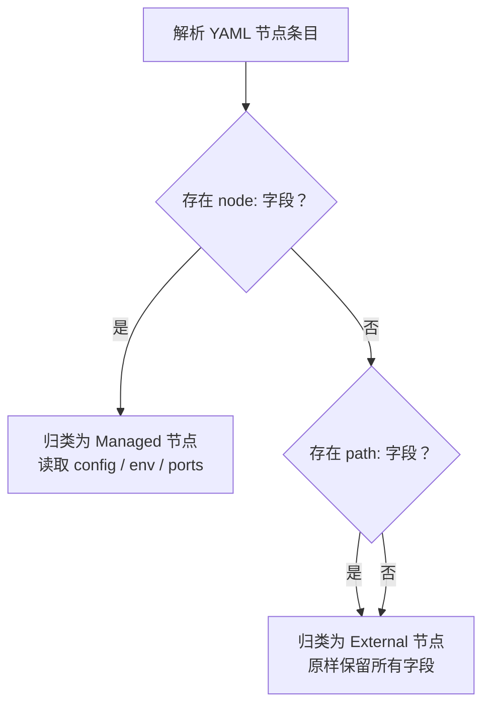
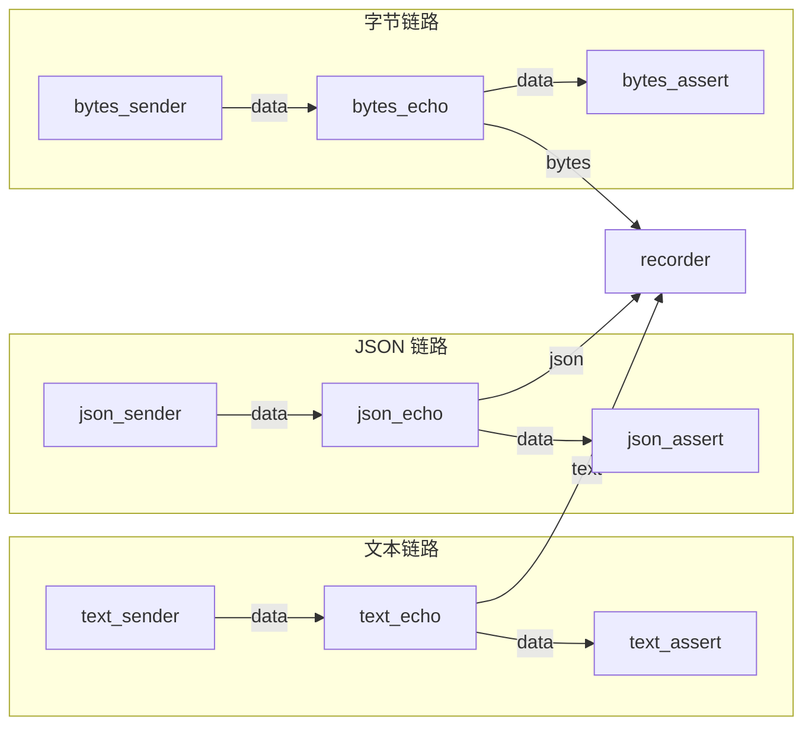
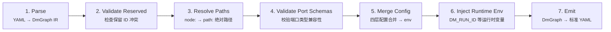
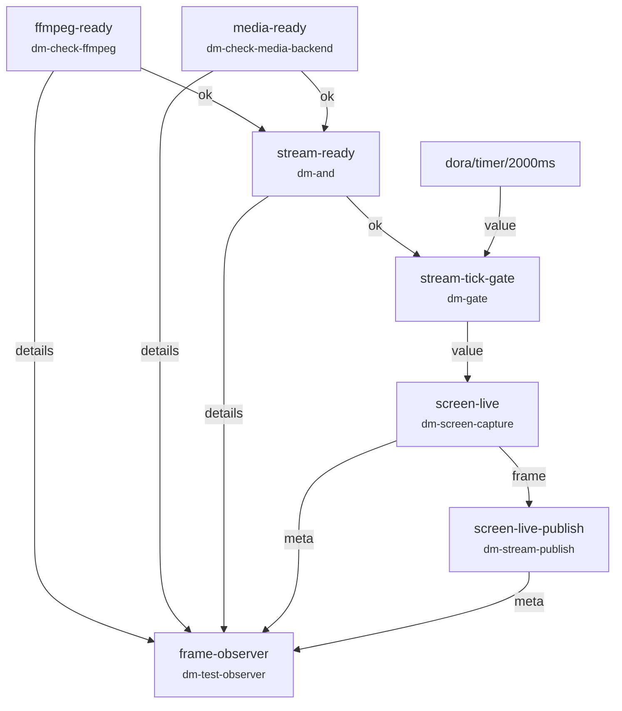

数据流是 Dora Manager 中最核心的抽象——一个 YAML 文件定义了一张**有向数据图**：节点是图上的计算单元，边是节点之间的数据传输通道。本文将带你从零理解 YAML 拓扑的语法规则、节点间的连接方式，以及数据流在系统中是如何被存储和管理的。如果你还没阅读过[节点（Node）：dm.json 契约与可执行单元](04-node-concept)，建议先了解节点的概念再继续。

Sources: [interaction-demo.yml](https://github.com/l1veIn/dora-manager/blob/master/tests/dataflows/interaction-demo.yml#L1-L25), [model.rs](https://github.com/l1veIn/dora-manager/blob/master/crates/dm-core/src/dataflow/model.rs#L1-L168)

## 数据流是什么：一张有向数据图

数据流本质是一张 **有向无环图（DAG）**，以 YAML 格式声明。每个数据流文件描述了哪些节点参与计算、节点之间如何通过端口连接、以及每个节点运行时需要的配置参数。当数据流启动后（即创建一个"运行实例"），数据会沿着图中定义的连接路径，从上游节点的输出端口流向下游节点的输入端口。

下面的 Mermaid 图展示了一个最小数据流的拓扑结构——`interaction-demo.yml` 中三个节点的连接关系。`dm-text-input` 产生的用户输入通过 `value` 端口传递给 `dora-echo`，再经由 `value` 端口传递给 `dm-display` 进行展示：


Sources: [interaction-demo.yml](https://github.com/l1veIn/dora-manager/blob/master/tests/dataflows/interaction-demo.yml#L1-L25)

## YAML 文件结构

一个数据流 YAML 文件的顶层结构非常简洁——只有一个 `nodes` 列表，以及可能存在的其他 dora-rs 顶层字段（如 `communication`、`deploy` 等）。核心骨架如下：

```yaml
nodes:
  - id: <yaml_id>
    node: <node_id>         # 托管节点（推荐）
    # 或者
    path: /path/to/binary   # 外部节点（直接指定可执行文件路径）

    inputs:                  # 可选：定义输入连接
      <port_name>: <source>

    outputs:                 # 可选：声明输出端口
      - <port_name>

    config:                  # 可选：内联配置参数
      &lt;key&gt;: &lt;value&gt;

    env:                     # 可选：环境变量
      <KEY>: <VALUE>

    args: "--flag value"     # 可选：命令行参数
```

每个节点条目由以下几个关键字段组成，下表汇总了它们的含义与使用场景：

| 字段 | 类型 | 必填 | 说明 |
|------|------|------|------|
| `id` | 字符串 | ✅ | 数据流范围内的唯一实例标识符（yaml_id），用于连接引用 |
| `node` | 字符串 | 二选一 | 托管节点的节点 ID，对应 `~/.dm/nodes/<node_id>/dm.json` |
| `path` | 字符串 | 二选一 | 外部节点的可执行文件绝对路径 |
| `inputs` | 映射 | ❌ | 输入端口到数据源的映射，格式为 `port_name: source_node/source_port` |
| `outputs` | 列表 | ❌ | 声明该节点向外暴露的输出端口名称列表 |
| `config` | 映射 | ❌ | 内联配置参数，会与 `dm.json` 中的 `config_schema` 合并 |
| `env` | 映射 | ❌ | 直接注入的环境变量，会与 config 合并后的结果叠加 |
| `args` | 字符串 | ❌ | 传递给节点可执行文件的命令行参数 |

Sources: [passes.rs#L15-L95](https://github.com/l1veIn/dora-manager/blob/master/crates/dm-core/src/dataflow/transpile/passes.rs#L15-L95), [model.rs#L8-L38](https://github.com/l1veIn/dora-manager/blob/master/crates/dm-core/src/dataflow/transpile/model.rs#L8-L38)

## 节点的两种类型：托管与外部

数据流中的节点分为两种类型，这是理解 YAML 拓扑的关键区分。

**托管节点（Managed Node）** 使用 `node:` 字段声明。这类节点在 `~/.dm/nodes/<node_id>/` 中拥有完整的 `dm.json` 元数据文件，Dora Manager 负责它们的安装、路径解析、配置合并和端口校验。绝大多数内置节点和社区节点都属于托管节点。在 YAML 中只需写节点 ID，系统会在转译阶段自动解析为绝对可执行路径。

**外部节点（External Node）** 使用 `path:` 字段声明。这类节点直接指向一个可执行文件的绝对路径，不经过 Dora Manager 的管理流程——没有配置合并、没有端口校验，原样传递给 dora-rs 运行时。适合集成第三方独立程序或临时调试。

转译器在解析阶段会根据 `node:` 和 `path:` 的存在与否来分类每个节点，分类逻辑定义在 `passes::parse()` 中：



Sources: [passes.rs#L15-L95](https://github.com/l1veIn/dora-manager/blob/master/crates/dm-core/src/dataflow/transpile/passes.rs#L15-L95), [model.rs#L16-L38](https://github.com/l1veIn/dora-manager/blob/master/crates/dm-core/src/dataflow/transpile/model.rs#L16-L38)

## 连接语法：source_node/source_port

节点之间的数据连接是数据流 YAML 最核心的语法。连接定义在下游节点的 `inputs` 字段中，格式为：

```yaml
inputs:
  <本节点输入端口名>: <上游节点id>/<上游输出端口名>
```

以 `system-test-happy.yml` 中的数据链为例，`text_echo` 节点从 `text_sender` 的 `data` 端口接收数据：

```yaml
- id: text_echo
  node: dora-echo
  inputs:
    data: text_sender/data    # ← 连接到 text_sender 的 data 输出端口
  outputs:
    - data
```

这条连接意味着：`text_sender` 节点的 `data` 输出端口上产生的每一条消息，都会被自动路由到 `text_echo` 节点的 `data` 输入端口。下图展示了这个数据流的完整拓扑——三条并行链路，每条从 sender 到 echo 再到 assert：



注意 `recorder` 节点展示了**多输入映射**的写法——一个节点可以通过不同的输入端口名接收来自多个上游的数据流：

```yaml
- id: recorder
  node: dora-parquet-recorder
  inputs:
    text: text_echo/data       # 输入端口 "text" ← text_sender 的 data
    json: json_echo/data       # 输入端口 "json" ← json_sender 的 data
    bytes: bytes_echo/data     # 输入端口 "bytes" ← bytes_sender 的 data
```

Sources: [system-test-happy.yml](https://github.com/l1veIn/dora-manager/blob/master/tests/dataflows/system-test-happy.yml#L1-L83), [passes.rs#L120-L258](https://github.com/l1veIn/dora-manager/blob/master/crates/dm-core/src/dataflow/transpile/passes.rs#L120-L258)

## Dora 内置数据源

除了连接到其他节点，`inputs` 的值还可以引用 **dora-rs 运行时提供的内置数据源**。这些数据源以 `dora/` 前缀标识，最常见的是定时器：

| 内置数据源 | 说明 |
|-----------|------|
| `dora/timer/millis/<N>` | 每 N 毫秒发送一个心跳信号 |
| `dora/timer/secs/<N>` | 每 N 秒发送一个心跳信号 |

内置数据源常用于驱动需要定期触发的节点。例如 `system-test-downloader.yml` 中，下载器每隔 2 秒被定时器触发一次：

```yaml
- id: dl-test
  node: dm-downloader
  inputs:
    tick: dora/timer/millis/2000    # ← dora 内置定时器，每 2 秒触发一次
```

转译器在校验端口 schema 时会自动跳过以 `dora` 为前缀的内置源，不对其做类型兼容性检查。

Sources: [system-test-downloader.yml](https://github.com/l1veIn/dora-manager/blob/master/tests/dataflows/system-test-downloader.yml#L1-L15), [passes.rs#L162-L170](https://github.com/l1veIn/dora-manager/blob/master/crates/dm-core/src/dataflow/transpile/passes.rs#L162-L170)

## 配置传递：config 与 env

节点运行时可以通过两种方式接收配置：**结构化的 `config` 字段**和**原始的 `env` 字段**。

`config` 字段是一种声明式配置方式，你只需在 YAML 中填写 `dm.json` 的 `config_schema` 所定义的字段名和值。转译器会自动完成四层优先级的合并——**内联 config > 节点级配置文件 > schema 默认值**——然后将合并结果转换为环境变量注入。例如：

```yaml
- id: display
  node: dm-display
  config:
    label: "Echo Output"    # config_schema 中定义了 label 字段，env 为 "LABEL"
    render: text            # config_schema 中定义了 render 字段，env 为 "RENDER"
```

`env` 字段则直接设置环境变量，适合传递不包含在 `config_schema` 中的运行时参数，或覆盖 config 合并后的结果。例如 `qwen-dev.yml` 中 Whisper 节点直接通过 `env` 传递 `TARGET_LANGUAGE`：

```yaml
- id: dora-distil-whisper
  node: dora-distil-whisper
  inputs:
    text_noise: dora-qwen/text
    input: dora-vad/audio
  outputs:
    - text
  env:
    TARGET_LANGUAGE: english    # 直接设置环境变量
```

Sources: [qwen-dev.yml#L164-L172](https://github.com/l1veIn/dora-manager/blob/master/tests/dataflows/qwen-dev.yml#L164-L172), [passes.rs#L349-L416](https://github.com/l1veIn/dora-manager/blob/master/crates/dm-core/src/dataflow/transpile/passes.rs#L349-L416)

## 数据流的存储结构

每个数据流在 `DM_HOME`（默认 `~/.dm`）下拥有独立的项目目录，存储在 `dataflows/&lt;name&gt;/` 中。一个完整的项目目录包含以下文件：

| 文件 | 用途 |
|------|------|
| `dataflow.yml` | 数据流 YAML 拓扑定义（核心文件） |
| `flow.json` | 元数据（名称、描述、标签、创建/更新时间） |
| `view.json` | 可视化编辑器中的画布布局状态 |
| `config.json` | 节点级配置默认值（独立于 YAML 内联 config） |
| `.history/` | 版本历史快照目录，每次保存变更时自动归档 |

目录结构示例：

```
~/.dm/dataflows/
├── interaction-demo/
│   ├── dataflow.yml        ← YAML 拓扑定义
│   ├── flow.json           ← 元数据
│   ├── view.json           ← 编辑器画布状态
│   └── .history/
│       ├── 20250406T120000Z.yml
│       └── 20250406T130000Z.yml
├── system-test-happy/
│   ├── dataflow.yml
│   └── flow.json
└── qwen-dev/
    ├── dataflow.yml
    └── flow.json
```

保存数据流时，如果 YAML 内容发生了变化，系统会自动将旧版本以时间戳命名归档到 `.history/` 目录中，支持版本回溯。

Sources: [paths.rs](https://github.com/l1veIn/dora-manager/blob/master/crates/dm-core/src/dataflow/paths.rs#L1-L36), [repo.rs#L59-L79](https://github.com/l1veIn/dora-manager/blob/master/crates/dm-core/src/dataflow/repo.rs#L59-L79), [repo.rs#L314-L325](https://github.com/l1veIn/dora-manager/blob/master/crates/dm-core/src/dataflow/repo.rs#L314-L325)

## 可执行性检查：Ready / MissingNodes / InvalidYaml

在启动一个数据流之前，Dora Manager 会对 YAML 文件进行**可执行性检查**，判断数据流是否处于可运行状态。检查逻辑定义在 `inspect` 模块中，它会扫描所有声明了 `node:` 的托管节点，逐一验证其 `dm.json` 是否存在于 `~/.dm/nodes/` 中。

检查结果分为三种状态：

| 状态 | can_run | 说明 |
|------|---------|------|
| `Ready` | ✅ | 所有托管节点均已安装，YAML 格式有效 |
| `MissingNodes` | ❌ | 部分托管节点未安装，`missing_nodes` 列出缺失项 |
| `InvalidYaml` | ❌ | YAML 格式无效，无法解析 |

此外，检查还会识别哪些节点具有 `media` 能力标记（如 `dm-screen-capture`、`dm-stream-publish`），并设置 `requires_media_backend` 标志，提醒运行时需要额外的媒体后端服务。

Sources: [inspect.rs](https://github.com/l1veIn/dora-manager/blob/master/crates/dm-core/src/dataflow/inspect.rs#L1-L131), [model.rs#L40-L75](https://github.com/l1veIn/dora-manager/blob/master/crates/dm-core/src/dataflow/model.rs#L40-L75)

## 从 YAML 到运行时：转译管线概览

YAML 文件中写的 `node: dm-display` 不能直接被 dora-rs 运行时消费——运行时需要的是 `path: /absolute/path/to/binary`。这个从"DM 风格 YAML"到"标准 dora-rs YAML"的转换过程称为**转译（Transpile）**，由一条多 Pass 管线完成。



每个 Pass 的职责简述如下：

1. **Parse**：将原始 YAML 文本解析为类型化的 `DmGraph` 中间表示，将节点分类为托管或外部类型 [passes.rs#L15-L95](https://github.com/l1veIn/dora-manager/blob/master/crates/dm-core/src/dataflow/transpile/passes.rs#L15-L95)
2. **Validate Reserved**：检查节点 ID 是否与系统保留名冲突（当前为空实现） [passes.rs#L103-L108](https://github.com/l1veIn/dora-manager/blob/master/crates/dm-core/src/dataflow/transpile/passes.rs#L103-L108)
3. **Resolve Paths**：通过 `~/.dm/nodes/&lt;id&gt;/dm.json` 中的 `executable` 字段，将托管节点的 `node:` 解析为绝对可执行路径 [passes.rs#L272-L341](https://github.com/l1veIn/dora-manager/blob/master/crates/dm-core/src/dataflow/transpile/passes.rs#L272-L341)
4. **Validate Port Schemas**：沿着 `inputs` 中声明的连接，检查上游输出端口与下游输入端口之间的 Arrow 类型兼容性 [passes.rs#L120-L258](https://github.com/l1veIn/dora-manager/blob/master/crates/dm-core/src/dataflow/transpile/passes.rs#L120-L258)
5. **Merge Config**：执行四层优先级的配置合并（内联 config > 节点配置文件 > schema 默认值），结果写入 `env` [passes.rs#L349-L416](https://github.com/l1veIn/dora-manager/blob/master/crates/dm-core/src/dataflow/transpile/passes.rs#L349-L416)
6. **Inject Runtime Env**：注入 `DM_RUN_ID`、`DM_NODE_ID`、`DM_RUN_OUT_DIR`、`DM_SERVER_URL` 等运行时环境变量 [passes.rs#L422-L449](https://github.com/l1veIn/dora-manager/blob/master/crates/dm-core/src/dataflow/transpile/passes.rs#L422-L449)
7. **Emit**：将 `DmGraph` IR 序列化为标准 dora-rs 可消费的 YAML 格式 [passes.rs#L457-L509](https://github.com/l1veIn/dora-manager/blob/master/crates/dm-core/src/dataflow/transpile/passes.rs#L457-L509)

转译过程中的诊断信息（如节点未安装、端口类型不兼容）不会中断管线，而是收集为 `TranspileDiagnostic` 列表统一输出，方便用户一次性查看和修复所有问题。

Sources: [mod.rs](https://github.com/l1veIn/dora-manager/blob/master/crates/dm-core/src/dataflow/transpile/mod.rs#L1-L82), [error.rs](https://github.com/l1veIn/dora-manager/blob/master/crates/dm-core/src/dataflow/transpile/error.rs#L1-L62)

## 实战案例：流媒体就绪检查链路

`system-test-stream.yml` 展示了一个包含**条件门控**的数据流拓扑，它先检查 ffmpeg 和媒体后端是否就绪，就绪后才启动屏幕采集和推流：



这个数据流中几个值得关注的拓扑模式：

- **dm-and 汇聚**：`stream-ready` 节点等待 `ffmpeg-ready/ok` 和 `media-ready/ok` 两个布尔输入都为 true 后才输出 true，实现了"全部就绪"的语义
- **dm-gate 门控**：`stream-tick-gate` 在 `enabled` 端口收到 true 后才放行 `value` 端口的定时器信号，实现了条件触发
- **dora 内置源混合**：定时器 `dora/timer/millis/2000` 作为普通输入端口参与连接，与节点输出无异
- **扇出观察**：`frame-observer` 同时接收来自 5 个不同上游的输入，汇总系统状态

Sources: [system-test-stream.yml](https://github.com/l1veIn/dora-manager/blob/master/tests/dataflows/system-test-stream.yml#L1-L77)

## 编写数据流的最佳实践

基于代码库中的实际模式和转译管线的设计，以下是编写数据流 YAML 时的关键建议：

**命名规范**。`id` 字段在数据流范围内必须唯一，推荐使用 `kebab-case` 命名（如 `screen-live-publish`），并体现节点的功能语义而非简单复用节点 ID。这能让连接关系更具可读性——`screen-live/frame` 比 `node5/out1` 清晰得多。

**优先使用托管节点**。使用 `node:` 而非 `path:` 声明节点，这样可以享受路径自动解析、配置合并和端口校验等托管能力。`path:` 仅在集成不受 Dora Manager 管理的第三方程序时使用。

**善用 config 而非直接写 env**。将参数放在 `config:` 中可以让系统在 `dm.json` 的 `config_schema` 框架下进行类型校验和默认值填充，比直接在 `env:` 中硬编码环境变量更安全、更易维护。

**保持拓扑简洁**。一个数据流中的节点数量建议控制在合理范围内。`qwen-dev.yml` 包含约 20 个节点，涵盖了音频采集→语音活动检测→ASR→LLM→TTS 的完整 AI 语音助手管线，是复杂度的上限参考。

Sources: [qwen-dev.yml](https://github.com/l1veIn/dora-manager/blob/master/tests/dataflows/qwen-dev.yml#L1-L257), [interaction-demo.yml](https://github.com/l1veIn/dora-manager/blob/master/tests/dataflows/interaction-demo.yml#L1-L25)

---

了解数据流的 YAML 拓扑后，下一步你可以继续探索：

- [运行实例（Run）：生命周期、状态与指标追踪](06-run-lifecycle)——了解数据流启动后的运行时管理
- [整体架构：dm-core / dm-cli / dm-server 分层设计](07-architecture-overview)——深入理解后端的分层设计
- [数据流转译器：多 Pass 管线与四层配置合并](08-transpiler)——转译管线的完整技术细节