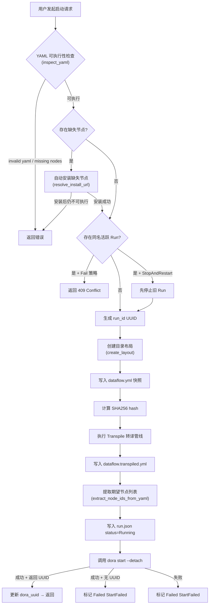
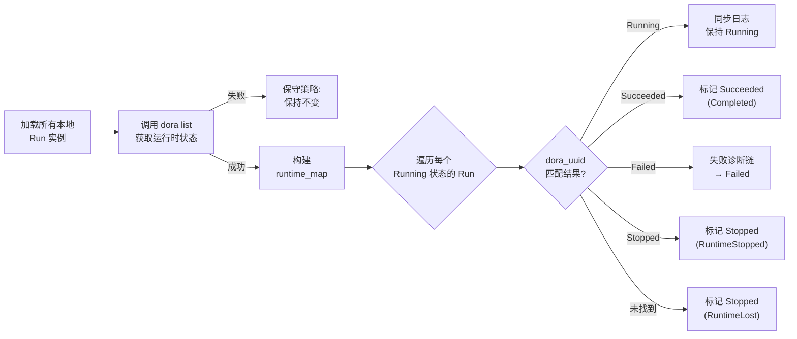

**运行实例（Run）** 是 Dora Manager 中连接「静态数据流定义」与「动态执行过程」的核心抽象。当你将一份数据流 YAML 文件交给系统执行时，它就从一份纯文本配置变成了一个拥有独立身份、完整生命周期和丰富可观测性的运行实例。本文将系统性地拆解 Run 的数据模型、状态机转换、启动/停止编排、指标采集机制以及前后端集成方式，帮助你理解整个 Run 子系统从创建到终结的全链路设计。

Sources: [dm-run-instance-design.md](https://github.com/l1veIn/dora-manager/blob/main/docs/dm-run-instance-design.md#L1-L103), [model.rs](https://github.com/l1veIn/dora-manager/blob/main/crates/dm-core/src/runs/model.rs#L119-L184)

## 三层抽象：Dataflow → Run → Panel Session

Dora Manager 采用经典的三层模型来组织数据流的可执行生命周期。**Dataflow**（定义层）是 `~/.dm/dataflows/` 下的 YAML 文件，描述节点拓扑与连接关系；**Run Instance**（运行层）是每次执行产生的独立记录，存放在 `~/.dm/runs/<run_uuid>/`；**Panel Session**（数据层）则是运行期间各节点产生的交互数据。这种分层将「定义了什么」与「怎么执行的」与「产生了什么」三者清晰解耦。

Run 实例的文件系统布局如下——注意其中同时保存了原始 YAML 快照与转译后的可执行 YAML，确保每次运行都具备完整的可审计性和可回溯性：

```
~/.dm/
├── dataflows/
│   └── qwen-dev.yml               ← Dataflow 定义层（源文件）
├── runs/
│   └── <run_uuid>/
│       ├── run.json                ← Run 元数据（状态、时间戳、失败诊断）
│       ├── dataflow.yml            ← 启动时的原始 YAML 快照（不可变）
│       ├── dataflow.transpiled.yml ← 经 Transpiler 管线转译后的可执行 YAML
│       ├── view.json               ← 图编辑器视图布局快照
│       └── out/                    ← Dora 运行时原始输出
│           └── <dora_uuid>/
│               ├── log_node-a.txt
│               └── log_node-b.txt
└── config.toml
```

Sources: [repo.rs](https://github.com/l1veIn/dora-manager/blob/main/crates/dm-core/src/runs/repo.rs#L9-L46), [dm-run-instance-design.md](https://github.com/l1veIn/dora-manager/blob/main/docs/dm-run-instance-design.md#L16-L37)

## RunInstance 数据模型

`RunInstance` 是 Run 系统的核心数据结构，以 JSON 形式持久化在 `run.json` 中。它承载了五大维度的信息：**身份标识**（run_id、dora_uuid、dataflow_hash）、**状态追踪**（status、termination_reason、outcome）、**失败诊断**（failure_node、failure_message）、**转译元数据**（transpile、nodes_expected）和**日志同步**（log_sync、nodes_observed）。

该结构使用 `#[serde(default)]` 注解确保向前兼容——当 `schema_version` 升级新增字段时，旧版 `run.json` 反序列化不会报错，缺失字段自动填充默认值。持久化采用原子写入模式（先写 `.tmp` 文件再 `rename`），避免进程中断导致数据损坏。

Sources: [model.rs](https://github.com/l1veIn/dora-manager/blob/main/crates/dm-core/src/runs/model.rs#L127-L184), [repo.rs](https://github.com/l1veIn/dora-manager/blob/main/crates/dm-core/src/runs/repo.rs#L56-L64)

### 状态枚举：RunStatus

Run 的状态由 `RunStatus` 枚举驱动，共四种终态与一种活跃态：

| 状态 | 含义 | 可达路径 |
|------|------|---------|
| **Running** | 数据流正在 Dora 运行时中执行 | 启动成功后进入（默认值） |
| **Succeeded** | 所有节点正常完成 | `dora list` 报告 Succeeded |
| **Stopped** | 被外部停止或运行时主动终止 | 用户手动停止 / RuntimeStopped / RuntimeLost |
| **Failed** | 启动失败或节点崩溃 | StartFailed / NodeFailed |

Sources: [model.rs](https://github.com/l1veIn/dora-manager/blob/main/crates/dm-core/src/runs/model.rs#L5-L28)

### 终止原因：TerminationReason

每种终态都关联一个 `TerminationReason`，提供了比状态本身更丰富的诊断上下文。注意同一个终态（如 Stopped）可以对应多种不同的原因，这对于故障排查至关重要：

| 终止原因 | 对应终态 | 触发场景 |
|----------|---------|---------|
| `Completed` | Succeeded | 数据流所有节点正常退出 |
| `StoppedByUser` | Stopped | 用户通过 Web UI 或 CLI 发起停止 |
| `StartFailed` | Failed | `dora start` 返回非零退出码或未返回 UUID |
| `NodeFailed` | Failed | 某个节点运行时崩溃，Dora 报告 Failed |
| `RuntimeLost` | Stopped | `dora list` 不再报告此 dataflow（守护进程重启等） |
| `RuntimeStopped` | Stopped | Dora 运行时主动停止了此 dataflow |

Sources: [model.rs](https://github.com/l1veIn/dora-manager/blob/main/crates/dm-core/src/runs/model.rs#L51-L74)

### 来源追踪：RunSource

每次 Run 启动时记录触发来源，便于审计和统计：

| 来源 | 说明 |
|------|------|
| `Cli` | 通过 `dm start` 命令行触发 |
| `Server` | 通过 dm-server 的 HTTP API 触发 |
| `Web` | 通过前端 Web UI 触发 |
| `Unknown` | 兼容旧数据或未指定来源 |

Sources: [model.rs](https://github.com/l1veIn/dora-manager/blob/main/crates/dm-core/src/runs/model.rs#L30-L49)

### 冲突策略：StartConflictStrategy

当同一个 dataflow 已有活跃 Run 时，系统提供两种策略：

| 策略 | 行为 | 对应参数 |
|------|------|---------|
| `Fail` | 直接拒绝重复启动，返回 409 | 默认行为 |
| `StopAndRestart` | 先优雅停止旧实例再启动新的 | 前端 `force=true` / CLI `--force` |

Sources: [model.rs](https://github.com/l1veIn/dora-manager/blob/main/crates/dm-core/src/runs/model.rs#L192-L196)

## 生命周期状态机

Run 的生命周期可以用以下状态机精确描述。每个状态转换都有明确的触发条件和副作用（日志同步、失败推断）：

```mermaid
stateDiagram-v2
    [*] --> Running : dm start / API POST /runs/start

    Running --> Succeeded : dora list 报告 Succeeded
    Running --> Stopped : 用户手动停止\n(TerminationReason::StoppedByUser)
    Running --> Failed : dora list 报告 Failed\n→ infer_failure_details
    Running --> Stopped : dora list 不再报告\n(TerminationReason::RuntimeLost)
    Running --> Stopped : dora list 报告 Stopped\n(TerminationReason::RuntimeStopped)
    Running --> Failed : dora start 返回错误\n(TerminationReason::StartFailed)

    Succeeded --> [*]
    Stopped --> [*]
    Failed --> [*]

    note right of Running
        refresh_run_statuses 周期性轮询
        dora list 同步实际状态
        dora list 失败时保守保持 Running
    end note

    note right of Failed
        失败诊断链：
        1. parse_failure_details (dora 输出)
        2. infer_failure_details (节点日志)
        3. 提取 AssertionError / panic / Traceback
    end note
```

**关键设计决策**：当 `dora list` 调用失败时（例如守护进程短暂不可达），系统选择**保守策略**——保持 Running 状态不变，而非贸然标记为 Stopped。这避免了因瞬时网络抖动导致的误判，体现在 `refresh_run_statuses_with_backend` 函数中：`Err(_) => return Ok(())` 直接跳过刷新。

Sources: [service_runtime.rs](https://github.com/l1veIn/dora-manager/blob/main/crates/dm-core/src/runs/service_runtime.rs#L132-L262), [state.rs](https://github.com/l1veIn/dora-manager/blob/main/crates/dm-core/src/runs/state.rs#L59-L82)

## 启动流程详解

一次完整的 Run 启动经历以下阶段。注意其中包含**缺失节点自动安装**这一重要的用户体验优化——系统会尝试从 YAML 中声明的 `source.git` 或全局 registry 解析安装源：



启动流程中的**冲突策略**是用户体验设计的关键点：`Fail` 模式直接拒绝重复启动，返回 409 状态码；`StopAndRestart` 模式先通过 `find_active_run_by_name_with_backend` 找到活跃实例，优雅停止后再启动新的。

Sources: [service_start.rs](https://github.com/l1veIn/dora-manager/blob/main/crates/dm-core/src/runs/service_start.rs#L99-L283), [handlers/runs.rs](https://github.com/l1veIn/dora-manager/blob/main/crates/dm-server/src/handlers/runs.rs#L314-L380)

## 停止流程与容错机制

停止流程体现了**「尽力而为 + 状态一致性优先」**的设计哲学。核心逻辑在 `stop_run_with_backend` 中实现，遵循以下决策路径：

1. 先通过 `mark_stop_requested` 在 `run.json` 中记录停止请求时间戳——这确保即使后台停止操作耗时，前端也能立即看到「stopping」状态
2. 调用 `dora stop <dora_uuid>`（15 秒超时，由 `STOP_TIMEOUT_SECS` 常量控制）
3. **成功路径**：同步日志输出 → 标记 `Stopped / StoppedByUser` → 清除 stop_request
4. **失败路径**：再次调用 `dora list` 检查——如果 dataflow 已不在列表中，仍然标记为 `Stopped`（**容忍性停止**）；如果确实仍在运行，才标记为 `Failed`
5. **超时路径**：如果 `dora stop` 超时但运行时仍在报告 Running，保持 `Running` 状态不变，仅更新 `stop_request.last_error`——下一次 `refresh_run_statuses` 会继续尝试同步

服务端的 `stop_run` handler 采用 **fire-and-forget** 模式：先立即返回 `{"status": "stopping"}` 响应，再通过 `tokio::spawn` 在后台执行实际停止操作，避免 HTTP 长时间阻塞。

Sources: [service_runtime.rs](https://github.com/l1veIn/dora-manager/blob/main/crates/dm-core/src/runs/service_runtime.rs#L16-L121), [handlers/runs.rs](https://github.com/l1veIn/dora-manager/blob/main/crates/dm-server/src/handlers/runs.rs#L383-L412), [runtime.rs](https://github.com/l1veIn/dora-manager/blob/main/crates/dm-core/src/runs/runtime.rs#L13-L16)

## 状态刷新与运行时同步

`refresh_run_statuses` 是 Run 系统的**心跳机制**。每次列表查询（无论是 `/api/runs` 还是 `/api/runs/active`）都会触发一次完整的状态刷新，确保本地记录始终与 Dora 运行时保持一致：



日志同步 (`sync_run_outputs`) 扫描 Dora 运行时输出的 `log_<node>.txt` 文件，更新 `nodes_observed` 和 `node_count_observed`，实现从「期望节点」到「实际观测节点」的闭环校验。这个设计使得 `get_run` 查询可以在节点日志产生之前就展示期望的节点列表，避免 UI 出现空白期。

Sources: [service_runtime.rs](https://github.com/l1veIn/dora-manager/blob/main/crates/dm-core/src/runs/service_runtime.rs#L123-L298), [service_query.rs](https://github.com/l1veIn/dora-manager/blob/main/crates/dm-core/src/runs/service_query.rs#L50-L76)

## 失败诊断系统

当 Run 进入 Failed 状态时，系统启动一条**多层级的失败诊断链**来提取有意义的错误信息。诊断链遵循从精确到模糊的优先级：

| 层级 | 函数 | 策略 | 匹配模式 |
|------|------|------|---------|
| 1 | `parse_failure_details` | Dora 输出解析 | `"Node <name> failed: <message>"` |
| 2 | `infer_failure_details` | 节点日志扫描 | 按优先级搜索已知错误模式 |
| 3 | Python Traceback 兜底 | 日志末尾行提取 | `"Traceback (most recent call last):"` |

日志扫描的优先级搜索模式包括（从高到低）：
1. `AssertionError:` — 断言失败
2. `thread 'main' panicked at` — Rust panic
3. `panic:` — 通用 panic
4. `ERROR` — 日志错误级别

最终所有错误信息通过 `compact_error_text` 压缩为单行（上限 240 字符，超出部分截断并追加 `...`），写入 `failure_node`、`failure_message` 和 `outcome.summary`。前端通过 `RunFailureBanner` 组件直接展示诊断结果。

Sources: [state.rs](https://github.com/l1veIn/dora-manager/blob/main/crates/dm-core/src/runs/state.rs#L18-L152)

## 指标采集体系

Run 系统实现了**两层指标采集**——数据流级别（聚合）和节点级别（细粒度）：

**数据流级别** 通过 `dora list --format json` 获取，每行一个 JSON 对象，格式形如：
```json
{"uuid":"019cd2f0-...","name":"bunny","status":"Running","nodes":8,"cpu":23.16,"memory":1.83}
```
其中 `memory` 以 GB 为单位返回，系统内部自动转换为 MB（`memory_mb = memory * 1024.0`）。

**节点级别** 通过 `dora node list --format json --dataflow <uuid>` 获取，格式形如：
```json
{"node":"dora-qwen","status":"Running","pid":"67842","cpu":"23.7%","memory":"1143 MB"}
```
注意节点级别的 `cpu` 和 `memory` 是字符串格式（如 `"23.7%"`、`"1143 MB"`），由前端负责解析展示。

两种指标通过不同的采集函数实现：`collect_dataflow_metrics` 批量获取所有活跃数据流的聚合指标，`collect_node_metrics` 针对特定 dataflow 获取逐节点指标。

Sources: [service_metrics.rs](https://github.com/l1veIn/dora-manager/blob/main/crates/dm-core/src/runs/service_metrics.rs#L1-L197)

## WebSocket 实时通道

每个活跃 Run 支持一个 WebSocket 连接 (`/api/runs/{id}/ws`)，提供五种实时消息类型：

| 消息类型 | 方向 | 触发条件 | 数据内容 |
|----------|------|---------|---------|
| `metrics` | Server → Client | 每秒定时推送 | 各节点 CPU、内存、PID、状态 |
| `logs` | Server → Client | 日志文件变更（`notify` crate 监听） | `{nodeId, lines}` — 新增的日志行 |
| `io` | Server → Client | 日志行包含 `[DM-IO]` 标记 | `{nodeId, lines}` — 过滤后的 IO 事件 |
| `status` | Server → Client | 每秒定时检查 | `{status}` — Run 当前状态字符串 |
| `ping` | Server → Client | 每 10 秒 | 空心跳保活 |

WebSocket 内部使用 `notify` crate 对日志目录进行文件系统监听，核心事件循环通过 `tokio::select!` 多路复用四个事件源：日志文件变更通知、指标采集定时器（1 秒）、心跳定时器（10 秒）和客户端消息。当日志文件发生 `Modify` 或 `Create` 事件时，变更事件通过 `mpsc` channel 传递到 WebSocket 循环中，实现**增量式日志流推送**——每次只发送自上次读取后新增的内容，由 `log_offsets: HashMap<PathBuf, u64>` 追踪每个文件已发送的字节位置。

Sources: [run_ws.rs](https://github.com/l1veIn/dora-manager/blob/main/crates/dm-server/src/handlers/run_ws.rs#L1-L237)

## HTTP API 路由一览

以下是 Run 相关的完整 HTTP API 端点，所有路径以 `/api` 为前缀：

| 方法 | 路径 | 说明 |
|------|------|------|
| GET | `/runs?limit=&offset=&status=&search=` | 分页列表，支持状态过滤和关键词搜索 |
| GET | `/runs/active?metrics=` | 获取所有活跃 Run（可附带实时指标） |
| GET | `/runs/{id}?include_metrics=` | 单个 Run 详情（含节点列表、可选指标） |
| GET | `/runs/{id}/metrics` | 运行时指标（数据流级 + 节点级） |
| GET | `/runs/{id}/dataflow` | 原始 YAML 快照（纯文本） |
| GET | `/runs/{id}/transpiled` | 转译后的 YAML（纯文本） |
| GET | `/runs/{id}/view` | 编辑器视图布局 JSON |
| GET | `/runs/{id}/logs/{node_id}` | 完整节点日志 |
| GET | `/runs/{id}/logs/{node_id}/stream` | SSE 日志流（支持 tail_lines 参数） |
| GET | `/runs/{id}/logs/{node_id}/tail?offset=` | 增量日志尾读（断点续传） |
| POST | `/runs/start` | 启动新 Run（body: yaml, name, force, view_json） |
| POST | `/runs/{id}/stop` | 停止指定 Run（异步 fire-and-forget） |
| POST | `/runs/delete` | 批量删除（body: run_ids，返回 207 Multi-Status） |
| WS | `/runs/{id}/ws` | 实时 WebSocket 通道 |

Sources: [handlers/runs.rs](https://github.com/l1veIn/dora-manager/blob/main/crates/dm-server/src/handlers/runs.rs#L58-L461), [main.rs](https://github.com/l1veIn/dora-manager/blob/main/crates/dm-server/src/main.rs#L180-L223)

## 前端集成

**列表页** (`/runs`) 通过 `GET /api/runs` 实现分页浏览、状态过滤、关键词搜索和批量删除。`RunStatusBadge` 组件根据状态渲染不同颜色的徽标——Running 蓝色、Succeeded 绿色、Stopped 灰色、Failed 红色，额外还有「stopping」琥珀色过渡态（当 `stopRequestedAt` 已设置但状态仍为 Running 时）。`RecentRunCard` 组件用于仪表盘场景的快速预览。

**工作台页** (`/runs/[id]`) 是 Run 运行期间的交互中心，包含以下核心区域：
- **RunHeader**：名称、状态徽标、Stop 按钮、YAML/Transpiled/Graph 查看入口
- **RunSummaryCard**：Run ID、Dora UUID、起止时间、运行时长、退出码、节点数
- **RunFailureBanner**：失败时展示 `failureNode` 和 `failureMessage` 诊断信息
- **RunNodeList**：节点列表，点击可在 Terminal 面板中查看日志
- **Workspace**：可定制的网格布局系统，支持 Message、Input、Chart、Video、Terminal 五种 Widget

Sources: [RunStatusBadge.svelte](https://github.com/l1veIn/dora-manager/blob/main/web/src/lib/components/runs/RunStatusBadge.svelte#L1-L43), [RunFailureBanner.svelte](https://github.com/l1veIn/dora-manager/blob/main/web/src/routes/runs/[id]/RunFailureBanner.svelte#L1-L38)

## 管理操作

**批量删除** 通过 `POST /api/runs/delete` 实现，接收 `run_ids` 数组，逐一调用 `delete_run`（删除目录 + 清理关联的 EventStore 事件记录）。返回结果区分 `deleted` 和 `failed` 列表，部分成功时返回 `207 Multi-Status` 状态码。

**自动清理** (`clean_runs`) 保留最近 N 条记录，删除更早的历史 Run，适用于磁盘空间管理场景。该函数先通过 `list_runs` 获取全量列表（按时间倒序排列），然后对超出保留数量的尾部记录逐一删除。

Sources: [service_admin.rs](https://github.com/l1veIn/dora-manager/blob/main/crates/dm-core/src/runs/service_admin.rs#L1-L28), [handlers/runs.rs](https://github.com/l1veIn/dora-manager/blob/main/crates/dm-server/src/handlers/runs.rs#L414-L461)

## 后端代码组织

Run 相关代码在 `crates/dm-core/src/runs/` 下按职责清晰分层，每个文件聚焦单一关注点：

| 文件 | 职责 | 关键导出 |
|------|------|---------|
| `model.rs` | 所有数据结构定义 | `RunInstance`, `RunStatus`, `RunMetrics`, `NodeMetrics` 等 |
| `repo.rs` | 文件系统持久化 | `save_run`, `load_run`, `create_layout`, 日志读取 |
| `runtime.rs` | `RuntimeBackend` trait + `DoraCliBackend` 实现 | `start_detached`, `stop`, `list` |
| `state.rs` | 状态转换逻辑 | `apply_terminal_state`, 失败诊断链, `build_outcome` |
| `graph.rs` | YAML 解析工具 | `extract_node_ids_from_yaml`, `build_transpile_metadata` |
| `service_start.rs` | 启动流程编排 | 冲突处理、快照、转译、缺失节点自动安装 |
| `service_runtime.rs` | 停止流程、状态刷新 | `stop_run`, `refresh_run_statuses`, `sync_run_outputs` |
| `service_metrics.rs` | 指标采集 | `get_run_metrics`, `collect_all_active_metrics` |
| `service_query.rs` | 查询服务 | `list_runs_filtered`, `get_run`, 日志断点续传 |
| `service_admin.rs` | 管理操作 | `delete_run`, `clean_runs` |
| `service_tests.rs` | 集成测试 | 使用 `TestBackend` 隔离测试所有核心流程 |

`RuntimeBackend` trait 的抽象使得整个 Run 系统可以通过 `TestBackend` 进行完全隔离的单元测试——`TestBackend` 使用 `Arc<Mutex<Vec<String>>>` 记录 stop 调用历史，允许测试验证停止操作的精确行为，无需真实 Dora 运行时环境。

Sources: [mod.rs](https://github.com/l1veIn/dora-manager/blob/main/crates/dm-core/src/runs/mod.rs#L1-L28), [service.rs](https://github.com/l1veIn/dora-manager/blob/main/crates/dm-core/src/runs/service.rs#L1-L47), [service_tests.rs](https://github.com/l1veIn/dora-manager/blob/main/crates/dm-core/src/runs/service_tests.rs#L1-L647)

---

**下一步阅读**：理解了 Run 的生命周期后，推荐继续探索以下主题——

- [运行时服务：启动编排、状态刷新与 CPU/内存指标采集](13-yun-xing-shi-fu-wu-qi-dong-bian-pai-zhuang-tai-shua-xin-yu-cpu-nei-cun-zhi-biao-cai-ji) — 深入后端服务层如何编排 `dora` CLI 调用
- [运行工作台：网格布局、面板系统与实时日志查看](19-yun-xing-gong-zuo-tai-wang-ge-bu-ju-mian-ban-xi-tong-yu-shi-shi-ri-zhi-cha-kan) — 前端如何消费 Run 的 WebSocket 实时数据
- [事件系统：可观测性模型与 XES 兼容事件存储](14-shi-jian-xi-tong-ke-guan-ce-xing-mo-xing-yu-xes-jian-rong-shi-jian-cun-chu) — Run 生命周期事件如何被记录和查询