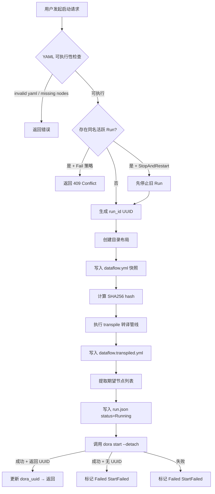

**运行实例（Run）** 是 Dora Manager 中连接「静态定义」与「动态执行」的核心抽象。当你将一份数据流 YAML 文件交给系统执行时，它就从一份纯文本配置变成了一次拥有独立身份、生命周期和可观测性的运行实例。本文将系统性地拆解 Run 的数据模型、状态机、持久化策略、指标采集机制以及前后端协作方式，帮助你理解一个 Run 从诞生到消亡的完整旅程。

Sources: [dm-run-instance-design.md](https://github.com/l1veIn/dora-manager/blob/master/docs/dm-run-instance-design.md#L1-L103), [model.rs](https://github.com/l1veIn/dora-manager/blob/master/crates/dm-core/src/runs/model.rs#L1-L145)

## 三层抽象：Dataflow → Run → Panel Session

Dora Manager 采用经典的三层模型来组织数据流的可执行生命周期。**Dataflow**（定义层）是 `~/.dm/dataflows/` 下的 YAML 文件，描述节点拓扑与连接关系；**Run Instance**（运行层）是每次执行产生的独立记录，存放在 `~/.dm/runs/<run_uuid>/`；**Panel Session**（数据层）则是运行期间的交互数据，嵌套在 Run 目录下的 `panel/` 子目录中。这种分层使得同一定义可以被反复执行、每次执行都保留完整的配置快照和日志，而交互数据又自然地归属到对应的运行上下文中。

```
~/.dm/
├── dataflows/
│   └── qwen-dev.yml          ← Dataflow 定义层
├── runs/
│   └── <run_uuid>/
│       ├── run.json           ← Run 元数据（状态、时间戳、指标快照）
│       ├── dataflow.yml       ← 启动时的 YAML 副本（不可变快照）
│       ├── dataflow.transpiled.yml  ← 转译后的可执行 YAML
│       ├── view.json          ← 编辑器视图布局快照
│       ├── logs/              ← 各节点日志
│       │   ├── node-a.log
│       │   └── node-b.log
│       └── out/               ← Dora 运行时原始输出（log_<node>.txt）
│           └── <dora_uuid>/
└── config.toml
```

Sources: [dm-run-instance-design.md](https://github.com/l1veIn/dora-manager/blob/master/docs/dm-run-instance-design.md#L16-L37), [repo.rs](https://github.com/l1veIn/dora-manager/blob/master/crates/dm-core/src/runs/repo.rs#L9-L48)

## RunInstance 数据模型

`RunInstance` 是 Run 系统的核心数据结构，以 JSON 形式持久化在 `run.json` 中。它承载了身份标识、状态追踪、失败诊断、转译元数据和日志同步五大维度的信息。

Sources: [model.rs](https://github.com/l1veIn/dora-manager/blob/master/crates/dm-core/src/runs/model.rs#L119-L174)

### 状态枚举：RunStatus

Run 的状态由 `RunStatus` 枚举驱动，共四种终态与一种活跃态：

| 状态 | 含义 | 可达路径 |
|------|------|---------|
| **Running** | 数据流正在 Dora 运行时中执行 | 启动成功后进入 |
| **Succeeded** | 所有节点正常完成 | Dora 运行时报告 Succeeded |
| **Stopped** | 被外部停止或运行时主动终止 | 用户手动停止 / RuntimeStopped / RuntimeLost |
| **Failed** | 启动失败或节点崩溃 | StartFailed / NodeFailed |

Sources: [model.rs](https://github.com/l1veIn/dora-manager/blob/master/crates/dm-core/src/runs/model.rs#L5-L28)

### 终止原因：TerminationReason

每种终态都关联一个 `TerminationReason`，提供了比状态本身更丰富的诊断上下文：

| 终止原因 | 对应终态 | 触发场景 |
|----------|---------|---------|
| `Completed` | Succeeded | 数据流所有节点正常退出 |
| `StoppedByUser` | Stopped | 用户通过 Web UI 或 CLI 发起停止 |
| `StartFailed` | Failed | `dora start` 返回非零退出码或未返回 UUID |
| `NodeFailed` | Failed | 某个节点运行时崩溃，Dora 报告 Failed |
| `RuntimeLost` | Stopped | `dora list` 不再报告此 dataflow（守护进程重启等） |
| `RuntimeStopped` | Stopped | Dora 运行时主动停止了此 dataflow |

Sources: [model.rs](https://github.com/l1veIn/dora-manager/blob/master/crates/dm-core/src/runs/model.rs#L51-L74)

### 来源追踪：RunSource

每次 Run 启动时记录触发来源，便于审计和统计：

| 来源 | 说明 |
|------|------|
| `Cli` | 通过 `dm start` 命令行触发 |
| `Server` | 通过 dm-server 的 HTTP API 触发 |
| `Web` | 通过前端 Web UI 触发 |
| `Unknown` | 兼容旧数据或未指定来源 |

Sources: [model.rs](https://github.com/l1veIn/dora-manager/blob/master/crates/dm-core/src/runs/model.rs#L30-L49)

## 生命周期状态机

Run 的生命周期可以用以下状态机来精确描述。每个状态转换都有明确的触发条件和副作用（如日志同步、失败推断）：

```mermaid
stateDiagram-v2
    [*] --> Running : dm start / API POST /runs/start

    Running --> Succeeded : dora list 报告 Succeeded\n→ sync_run_outputs\n→ TerminationReason::Completed
    Running --> Stopped : 用户手动停止\n→ TerminationReason::StoppedByUser
    Running --> Failed : dora list 报告 Failed\n→ infer_failure_details\n→ TerminationReason::NodeFailed
    Running --> Stopped : dora list 不再报告\n→ TerminationReason::RuntimeLost
    Running --> Stopped : dora list 报告 Stopped\n→ TerminationReason::RuntimeStopped
    Running --> Failed : dora start 返回错误\n→ TerminationReason::StartFailed

    Succeeded --> [*]
    Stopped --> [*]
    Failed --> [*]

    note right of Running
        refresh_run_statuses 周期性轮询
        dora list 同步实际状态
    end note

    note right of Failed
        失败诊断链：
        1. parse_failure_details (dora 输出)
        2. infer_failure_details (节点日志)
        3. 提取 AssertionError / panic / Traceback
    end note
```

**关键设计决策**：当 `dora list` 调用失败时（例如守护进程短暂不可达），系统选择**保守策略**——保持 Running 状态不变，而非贸然标记为 Stopped。这避免了因瞬时网络抖动导致的误判。

Sources: [service_runtime.rs](https://github.com/l1veIn/dora-manager/blob/master/crates/dm-core/src/runs/service_runtime.rs#L99-L214), [state.rs](https://github.com/l1veIn/dora-manager/blob/master/crates/dm-core/src/runs/state.rs#L59-L80)

## 启动流程详解

一次完整的 Run 启动经历以下阶段：



启动流程中的**冲突策略** (`StartConflictStrategy`) 是一项重要的用户体验设计：`Fail` 模式直接拒绝重复启动，返回 409 状态码；`StopAndRestart` 模式则先优雅停止旧实例再启动新的，对应前端 `force=true` 参数和 CLI 的 `--force` 标志。

Sources: [service_start.rs](https://github.com/l1veIn/dora-manager/blob/master/crates/dm-core/src/runs/service_start.rs#L72-L220), [handlers/runs.rs](https://github.com/l1veIn/dora-manager/blob/master/crates/dm-server/src/handlers/runs.rs#L189-L256)

## 停止流程与容错机制

停止流程体现了「尽力而为 + 状态一致性优先」的设计哲学：

1. 从 `run.json` 读取 `dora_uuid`
2. 调用 `dora stop <dora_uuid>`（15 秒超时）
3. **成功路径**：同步日志输出 → 标记 `Stopped / StoppedByUser`
4. **失败路径**：再次调用 `dora list` 检查——如果 dataflow 已不在列表中，仍然标记为 `Stopped`（容忍性停止）；如果仍在运行，才标记为 `Failed`

服务端的 `stop_run` handler 采用 **fire-and-forget** 模式：先立即返回 `{"status": "stopping"}` 响应，再通过 `tokio::spawn` 在后台执行实际停止操作，避免 HTTP 长时间阻塞。

Sources: [service_runtime.rs](https://github.com/l1veIn/dora-manager/blob/master/crates/dm-core/src/runs/service_runtime.rs#L16-L97), [handlers/runs.rs](https://github.com/l1veIn/dora-manager/blob/master/crates/dm-server/src/handlers/runs.rs#L258-L284)

## 状态刷新与运行时同步

`refresh_run_statuses` 是 Run 系统的**心跳机制**。每次查询（无论是列表还是详情）都会触发一次状态刷新：

1. 加载所有本地 Run 实例
2. 调用 `dora list` 获取运行时中实际存在的 dataflow 列表
3. 对于每个本地标记为 Running 的 Run，用 `dora_uuid` 匹配运行时状态
4. 根据匹配结果（Running / Succeeded / Failed / Stopped / 未找到）执行对应的状态转换和日志同步

日志同步 (`sync_run_outputs`) 将 Dora 运行时输出的 `log_<node>.txt` 文件复制到 Run 目录的 `logs/<node>.log`，同时更新 `nodes_observed` 和 `node_count_observed`，实现从「期望节点」到「实际观测节点」的闭环校验。

Sources: [service_runtime.rs](https://github.com/l1veIn/dora-manager/blob/master/crates/dm-core/src/runs/service_runtime.rs#L99-L263)

## 失败诊断系统

当 Run 进入 Failed 状态时，系统启动一条**多层级的失败诊断链**来提取有意义的错误信息：

1. **Dora 输出解析** (`parse_failure_details`)：从 `dora start` / `dora list` 的输出中提取形如 `"Node &lt;name&gt; failed: <message>"` 的模式
2. **节点日志扫描** (`infer_failure_details`)：遍历所有已观测节点的日志文件，按优先级搜索 `AssertionError:`、`thread 'main' panicked at`、`panic:`、`ERROR` 等关键模式
3. **Python Traceback 兜底**：如果上述模式均未命中，取日志最后一行非空内容
4. **文本压缩** (`compact_error_text`)：将多行错误信息压缩为单行，上限 240 字符

诊断结果写入 `failure_node`、`failure_message` 和 `outcome.summary`，前端通过 `RunFailureBanner` 组件直接展示。

Sources: [state.rs](https://github.com/l1veIn/dora-manager/blob/master/crates/dm-core/src/runs/state.rs#L18-L150)

## 指标采集体系

Run 系统实现了**两层指标采集**——数据流级别和节点级别：

**数据流级别** 通过 `dora list --format json` 获取，每行一个 JSON 对象，包含 `uuid`、`cpu`（百分比）、`memory`（GB，系统内部转换为 MB）。

**节点级别** 通过 `dora node list --format json --dataflow <uuid>` 获取，包含每个节点的 `node`（ID）、`status`、`pid`、`cpu`（字符串如 `"23.7%"`）和 `memory`（字符串如 `"1143 MB"`）。

这些指标通过两个通道传递给前端：
- **HTTP 轮询**：`GET /api/runs/{id}?include_metrics=true` 和 `GET /api/runs/{id}/metrics`
- **WebSocket 推送**：连接 `ws://.../api/runs/{id}/ws` 后，每秒自动推送 `Metrics` 消息

Sources: [service_metrics.rs](https://github.com/l1veIn/dora-manager/blob/master/crates/dm-core/src/runs/service_metrics.rs#L1-L197), [run_ws.rs](https://github.com/l1veIn/dora-manager/blob/master/crates/dm-server/src/handlers/run_ws.rs#L207-L228)

## WebSocket 实时通道

每个活跃 Run 支持一个 WebSocket 连接 (`/api/runs/{id}/ws`)，提供四种实时消息类型：

| 消息类型 | 方向 | 触发条件 | 数据内容 |
|----------|------|---------|---------|
| `metrics` | Server → Client | 每秒定时推送 | 各节点 CPU、内存、PID、状态 |
| `logs` | Server → Client | 日志文件变更（`notify` crate 监听） | 新增的日志行 |
| `io` | Server → Client | 日志中出现 `[DM-IO]` 标记 | 过滤后的 IO 事件行 |
| `status` | Server → Client | 每秒定时检查 | Run 当前状态字符串 |
| `ping` | Server → Client | 每 10 秒 | 空心跳 |

WebSocket 内部使用 `notify` crate 对日志目录进行文件系统监听，当 Dora 运行时写入新的日志行时，变更事件通过 `mpsc` channel 传递到 WebSocket 循环中，实现**增量式日志流推送**。同时每秒执行一次指标采集和状态检查，确保前端始终展示最新的运行状态。

Sources: [run_ws.rs](https://github.com/l1veIn/dora-manager/blob/master/crates/dm-server/src/handlers/run_ws.rs#L1-L237)

## HTTP API 路由一览

以下是 Run 相关的完整 HTTP API 端点，所有路径以 `/api` 为前缀：

| 方法 | 路径 | 说明 |
|------|------|------|
| GET | `/runs?limit=&offset=&status=&search=` | 分页列表，支持状态过滤和搜索 |
| GET | `/runs/active?metrics=` | 获取所有活跃 Run（可附带指标） |
| GET | `/runs/{id}?include_metrics=` | 单个 Run 详情（含节点列表） |
| GET | `/runs/{id}/metrics` | 运行时指标（CPU / 内存 / 节点级） |
| GET | `/runs/{id}/dataflow` | 原始 YAML 快照 |
| GET | `/runs/{id}/transpiled` | 转译后的 YAML |
| GET | `/runs/{id}/view` | 编辑器视图布局 JSON |
| GET | `/runs/{id}/logs/{node_id}` | 完整节点日志 |
| GET | `/runs/{id}/logs/{node_id}/tail?offset=` | 增量日志尾读（支持断点续传） |
| POST | `/runs/start` | 启动新 Run（body: yaml, name, force, view_json） |
| POST | `/runs/{id}/stop` | 停止指定 Run（异步执行） |
| POST | `/runs/delete` | 批量删除（body: run_ids） |
| WS | `/runs/{id}/ws` | 实时 WebSocket 通道 |

Sources: [handlers/runs.rs](https://github.com/l1veIn/dora-manager/blob/master/crates/dm-server/src/handlers/runs.rs#L1-L333), [main.rs](https://github.com/l1veIn/dora-manager/blob/master/crates/dm-server/src/main.rs#L173-L200)

## 前端集成：列表页与工作台

**列表页** (`/runs`) 提供分页浏览、状态过滤、关键词搜索和批量删除功能。每行展示 Run 的名称、状态徽标、启动时间、节点数量，活跃 Run 额外显示 CPU 和内存指标。`RecentRunCard` 组件用于仪表盘等场景的快速预览，左侧彩色边框直观区分状态。

**工作台页** (`/runs/[id]`) 是 Run 运行期间的交互中心。它包含以下核心区域：
- **RunHeader**：名称、状态徽标、Stop 按钮、YAML/Transpiled/Graph 查看入口
- **RunSummaryCard**：Run ID、Dora UUID、起止时间、运行时长、退出码、节点数、转译详情
- **RunNodeList**：节点列表，点击可在 Terminal 面板中查看日志
- **Workspace**：可定制的网格布局系统，支持 Message、Input、Chart、Video、Terminal 五种 Widget

工作台页采用 3 秒轮询保持 Run 详情和指标刷新，同时通过 WebSocket 接收实时日志和状态变更通知。布局配置持久化到 `localStorage`，以 dataflow 名称隔离。

Sources: [RecentRunCard.svelte](https://github.com/l1veIn/dora-manager/blob/master/web/src/lib/components/runs/RecentRunCard.svelte#L1-L130), [RunStatusBadge.svelte](https://github.com/l1veIn/dora-manager/blob/master/web/src/lib/components/runs/RunStatusBadge.svelte#L1-L34), [+page.svelte](https://github.com/l1veIn/dora-manager/blob/master/web/src/routes/runs/%5Bid%5D/+page.svelte#L1-L393), [RunHeader.svelte](https://github.com/l1veIn/dora-manager/blob/master/web/src/routes/runs/%5Bid%5D/RunHeader.svelte#L1-L200), [RunSummaryCard.svelte](https://github.com/l1veIn/dora-manager/blob/master/web/src/routes/runs/%5Bid%5D/RunSummaryCard.svelte#L1-L199)

## 管理操作：删除与清理

**单个/批量删除** 通过 `POST /api/runs/delete` 实现，接收 `run_ids` 数组，逐一删除目录并同步清理关联的 EventStore 事件记录。返回结果区分 `deleted` 和 `failed` 列表，使用 207 Multi-Status 状态码表示部分成功。

**自动清理** (`clean_runs`) 保留最近 N 条记录，删除更早的历史 Run，适用于磁盘空间管理场景。

Sources: [service_admin.rs](https://github.com/l1veIn/dora-manager/blob/master/crates/dm-core/src/runs/service_admin.rs#L1-L28), [handlers/runs.rs](https://github.com/l1veIn/dora-manager/blob/master/crates/dm-server/src/handlers/runs.rs#L286-L333)

## 后端代码组织

Run 相关代码在 `crates/dm-core/src/runs/` 下按职责清晰分层：

| 文件 | 职责 |
|------|------|
| `model.rs` | 所有数据结构定义（RunInstance, RunStatus, RunMetrics 等） |
| `repo.rs` | 文件系统持久化（读写 run.json、目录布局管理、日志读取） |
| `runtime.rs` | RuntimeBackend trait + DoraCliBackend 实现（dora start/stop/list） |
| `state.rs` | 状态转换逻辑（apply_terminal_state、失败诊断、outcome 构建） |
| `graph.rs` | YAML 解析工具（节点 ID 提取、转译元数据构建） |
| `service_start.rs` | 启动流程编排（校验、冲突处理、快照、转译、dora 调用） |
| `service_runtime.rs` | 停止流程、状态刷新、日志同步 |
| `service_metrics.rs` | 指标采集（dora list/node list 解析） |
| `service_query.rs` | 查询服务（分页、过滤、详情聚合） |
| `service_admin.rs` | 管理操作（删除、清理） |

`RuntimeBackend` trait 的抽象使得整个 Run 系统可以通过 `TestBackend` 进行完全隔离的单元测试，无需真实 Dora 运行时环境。

Sources: [mod.rs](https://github.com/l1veIn/dora-manager/blob/master/crates/dm-core/src/runs/mod.rs#L1-L26), [service.rs](https://github.com/l1veIn/dora-manager/blob/master/crates/dm-core/src/runs/service.rs#L1-L45), [service_tests.rs](https://github.com/l1veIn/dora-manager/blob/master/crates/dm-core/src/runs/service_tests.rs#L1-L53)

---

**下一步阅读**：理解了 Run 的生命周期后，你可以继续探索以下主题——[运行时服务：启动编排、状态刷新与指标采集](10-runtime-service) 深入后端服务层的实现细节，[运行工作台：网格布局、面板系统与实时交互](16-runtime-workspace) 展示前端如何将这些数据转化为交互式工作界面，[事件系统：可观测性模型与 XES 兼容存储](11-event-system) 则揭示了 Run 执行过程中的事件追踪机制。