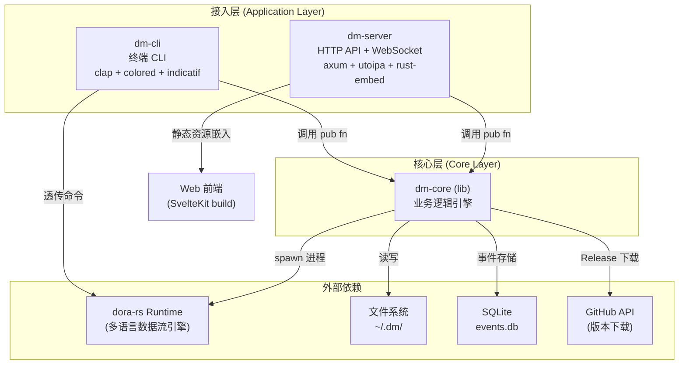
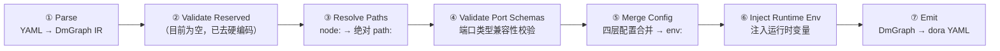
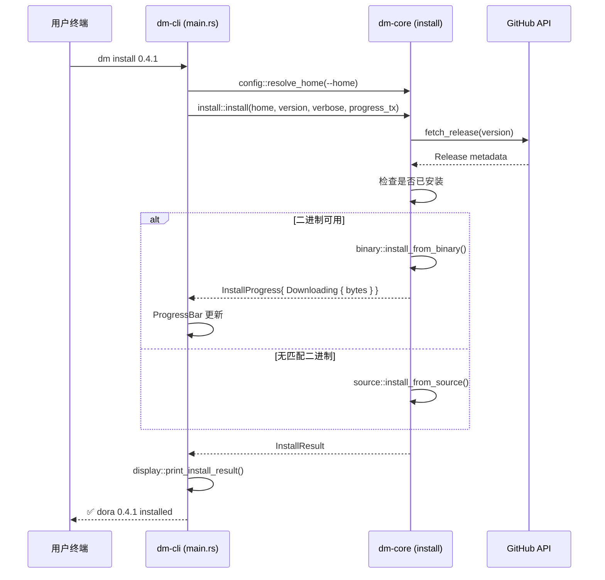

Dora Manager 采用经典的**三层分离架构**，将业务逻辑、CLI 交互和 HTTP 服务解耦到三个独立的 Rust crate 中。`dm-core` 作为纯粹的逻辑内核，承载所有与 dora-rs 运行时交互的核心能力；`dm-cli` 和 `dm-server` 分别作为终端和 Web 两种接入层，以薄适配器的形式调用 dm-core 暴露的公共 API。这种分层使得同一套核心逻辑既能服务于命令行脚本，也能驱动浏览器端的可视化面板——无需任何代码重复。

Sources: [Cargo.toml](https://github.com/l1veIn/dora-manager/blob/master/Cargo.toml), [crates/dm-core/Cargo.toml](https://github.com/l1veIn/dora-manager/blob/master/crates/dm-core/Cargo.toml#L1-L7), [crates/dm-cli/Cargo.toml](https://github.com/l1veIn/dora-manager/blob/master/crates/dm-cli/Cargo.toml#L1-L7), [crates/dm-server/Cargo.toml](https://github.com/l1veIn/dora-manager/blob/master/crates/dm-server/Cargo.toml#L1-L7)

## 整体分层总览

下面的 Mermaid 图展示了三个 crate 之间的依赖关系与职责边界。阅读此图的前提：**箭头方向表示「依赖」**，即 dm-cli 和 dm-server 都依赖 dm-core，而 dm-core 不依赖任何上层 crate。



Sources: [Cargo.toml](https://github.com/l1veIn/dora-manager/blob/master/Cargo.toml), [crates/dm-cli/Cargo.toml](https://github.com/l1veIn/dora-manager/blob/master/crates/dm-cli/Cargo.toml#L13), [crates/dm-server/Cargo.toml](https://github.com/l1veIn/dora-manager/blob/master/crates/dm-server/Cargo.toml#L13)

## dm-core：核心逻辑层

dm-core 是整个系统的**无头引擎**——它不关心请求来自终端还是浏览器，只负责处理"安装 dora 版本""启动数据流""采集运行指标"等纯业务操作。它以 `lib` crate 的形式存在，通过 `pub fn` 暴露功能，内部按领域模块组织。

### 模块地图

dm-core 内部包含 **9 个核心领域模块**，每个模块遵循一致的内部结构：`model`（数据结构）、`repo`（文件系统读写）、`service`（业务编排），形成自包含的垂直切片。

```text
dm-core/src/
├── api/              ← 顶层公共 API（setup, doctor, up/down, versions）
├── config.rs         ← DM_HOME 配置体系（config.toml 解析、路径约定）
├── dataflow/         ← 数据流管理（CRUD + 导入 + 转译器）
│   └── transpile/    ← 多 Pass 转译管线（详见独立章节）
├── dora.rs           ← dora CLI 进程封装（run_dora, exec_dora）
├── env.rs            ← 环境检测（Python, uv, Rust 可用性）
├── events/           ← 可观测性事件存储（SQLite + XES 导出）
├── install/          ← dora 版本安装（GitHub Release 下载 + 源码编译）
├── node/             ← 节点管理（安装、导入、dm.json 契约）
│   └── schema/       ← Port Schema 校验（Arrow 类型系统）
├── runs/             ← 运行实例生命周期（启动、状态刷新、指标采集）
│   ├── service_admin.rs     ← 清理、删除
│   ├── service_query.rs     ← 查询、列表
│   ├── service_runtime.rs   ← 状态同步、停止
│   └── service_start.rs     ← 启动编排
└── types.rs          ← 跨模块共享的数据结构（StatusReport, DoctorReport...）
```

Sources: [crates/dm-core/src/lib.rs](https://github.com/l1veIn/dora-manager/blob/master/crates/dm-core/src/lib.rs#L1-L22), [crates/dm-core/src/runs/mod.rs](https://github.com/l1veIn/dora-manager/blob/master/crates/dm-core/src/runs/mod.rs#L1-L26), [crates/dm-core/src/dataflow/mod.rs](https://github.com/l1veIn/dora-manager/blob/master/crates/dm-core/src/dataflow/mod.rs#L1-L23)

### 核心架构原则：Node-Agnostic

dm-core 遵循一条关键设计约束——**它不知道任何特定节点的存在**。这个原则确保核心引擎的可扩展性：新增节点不需要修改 dm-core 的任何代码。转译器通过读取 `dm.json` 元数据来解析节点路径和校验端口 schema，而非硬编码节点 ID。

Sources: [docs/architecture-principles.md](https://github.com/l1veIn/dora-manager/blob/master/docs/architecture-principles.md#L48-L65), [crates/dm-core/src/dataflow/transpile/passes.rs](https://github.com/l1veIn/dora-manager/blob/master/crates/dm-core/src/dataflow/transpile/passes.rs#L101-L108)

### 数据流转译器（Transpiler）：多 Pass 管线

转译器是 dm-core 中最核心的子系统，负责将用户编写的 DM-flavour YAML 翻译为 dora-rs 原生可执行的标准 YAML。整个管线由 **6 个顺序 Pass** 组成，每个 Pass 专注单一职责：



| Pass | 职责 | 依赖 |
|------|------|------|
| Parse | 将原始 YAML 解析为类型化的 `DmGraph` IR，区分 Managed（`node:` 引用）和 External（`path:` 直接指定）节点 | 无 |
| Validate Reserved | 保留位置，原用于检查保留节点 ID 冲突；现遵循 node-agnostic 原则已清空 | 无 |
| Resolve Paths | 将 `node: dora-qwen` 解析为 `~/.dm/nodes/dora-qwen/` 下的可执行文件绝对路径 | dm.json 元数据 |
| Validate Port Schemas | 校验连线两端端口 schema 的类型兼容性（基于 Arrow 类型系统） | dm.json ports 声明 |
| Merge Config | 将 inline config → flow config → node config → schema default 四层合并后注入为 `env:` 字段 | dm.json config_schema |
| Inject Runtime Env | 注入运行时环境变量（如 run_id） | TranspileContext |
| Emit | 将处理后的 `DmGraph` 序列化为 dora-rs 标准 YAML | 无 |

Sources: [crates/dm-core/src/dataflow/transpile/mod.rs](https://github.com/l1veIn/dora-manager/blob/master/crates/dm-core/src/dataflow/transpile/mod.rs#L1-L82), [crates/dm-core/src/dataflow/transpile/passes.rs](https://github.com/l1veIn/dora-manager/blob/master/crates/dm-core/src/dataflow/transpile/passes.rs#L1-L95)

### 配置体系：DM_HOME

所有持久化状态以 `~/.dm/` 为根目录进行组织。路径解析遵循优先级链：`--home` 命令行参数 > `DM_HOME` 环境变量 > `~/.dm` 默认路径。核心配置文件为 `config.toml`，通过 `serde` 实现类型安全的读写。

```text
~/.dm/
├── config.toml           ← 全局配置（active_version, media 设置）
├── events.db             ← SQLite 事件存储（WAL 模式）
├── versions/             ← 已安装的 dora 二进制文件
│   └── 0.4.1/dora
├── nodes/                ← 已安装节点
│   └── dora-qwen/
│       ├── dm.json       ← 节点元数据契约
│       └── ...
├── dataflows/            ← 导入的数据流项目
└── runs/                 ← 运行实例历史
    └── <uuid>/
        ├── run.json      ← 运行状态快照
        ├── snapshot.yml  ← 原始 YAML 快照
        ├── transpiled.yml← 转译后的 dora YAML
        └── logs/         ← 节点日志
```

Sources: [crates/dm-core/src/config.rs](https://github.com/l1veIn/dora-manager/blob/master/crates/dm-core/src/config.rs#L105-L166), [crates/dm-core/src/runs/repo.rs](https://github.com/l1veIn/dora-manager/blob/master/crates/dm-core/src/runs/mod.rs#L13-L17)

### 事件系统：SQLite + XES

dm-core 内置了一个**线程安全的 SQLite 事件存储**，采用 `Mutex<Connection>` + WAL 模式保证并发安全。所有关键操作（版本安装、数据流转译、运行启停）都会自动发射结构化事件，支持按 source、case_id、activity、时间范围等维度过滤查询，并可导出为 XES 格式用于流程挖掘分析。

Sources: [crates/dm-core/src/events/mod.rs](https://github.com/l1veIn/dora-manager/blob/master/crates/dm-core/src/events/mod.rs#L1-L16), [crates/dm-core/src/events/store.rs](https://github.com/l1veIn/dora-manager/blob/master/crates/dm-core/src/events/store.rs#L10-L44)

## dm-cli：终端接入层

dm-cli 是一个极薄的命令行适配器。它的全部职责可以概括为三点：**解析参数**（通过 `clap`）、**调用 dm-core**（通过 `dm_core::xxx`）、**格式化输出**（通过 `colored` + `indicatif`）。它不包含任何业务逻辑——甚至进度条的回调数据也来自 dm-core 的 `mpsc` channel。

### 命令结构

```text
dm
├── setup          ← 一键安装（Python + uv + dora）
├── doctor         ← 环境健康诊断
├── install        ← 安装指定 dora 版本
├── uninstall      ← 卸载版本
├── use            ← 切换活跃版本
├── versions       ← 列出已安装和可用版本
├── up             ← 启动 dora coordinator + daemon
├── down           ← 停止运行时
├── status         ← 运行时状态总览
├── node           ← 节点管理子命令
│   ├── install
│   ├── import
│   ├── list
│   └── uninstall
├── dataflow       ← 数据流管理子命令
│   └── import
├── start          ← 启动数据流（自动确保 runtime up）
├── runs           ← 运行历史管理
│   ├── stop
│   ├── delete
│   ├── logs
│   └── clean
└── --              ← 透传到原生 dora CLI
```

Sources: [crates/dm-cli/src/main.rs](https://github.com/l1veIn/dora-manager/blob/master/crates/dm-cli/src/main.rs#L11-L106), [crates/dm-cli/src/cmd/mod.rs](https://github.com/l1veIn/dora-manager/blob/master/crates/dm-cli/src/cmd/mod.rs#L1-L4)

### 典型调用流

以 `dm install` 为例，完整的调用链路如下：



Sources: [crates/dm-cli/src/main.rs](https://github.com/l1veIn/dora-manager/blob/master/crates/dm-cli/src/main.rs#L304-L351), [crates/dm-core/src/install/mod.rs](https://github.com/l1veIn/dora-manager/blob/master/crates/dm-core/src/install/mod.rs#L18-L90)

## dm-server：HTTP 接入层

dm-server 基于 **Axum** 构建，在 dm-core 之上添加了 HTTP 路由、WebSocket 实时推送、Swagger 文档生成和前端静态资源嵌入四项能力。它监听 `127.0.0.1:3210`，为 Web 可视化面板提供完整的 RESTful API。

### 服务状态模型

dm-server 的全局状态通过 `AppState` 结构体管理，以 `Arc` 包装实现零成本共享：

```text
AppState (Clone)
├── home: Arc<PathBuf>           ← DM_HOME 路径
├── events: Arc<EventStore>      ← SQLite 事件存储
├── messages: broadcast::Sender  ← 消息通知广播通道
└── media: Arc<MediaRuntime>     ← 媒体后端运行时
```

Sources: [crates/dm-server/src/state.rs](https://github.com/l1veIn/dora-manager/blob/master/crates/dm-server/src/state.rs#L1-L25)

### API 路由结构

HTTP API 按功能域组织为 9 组路由，总计约 50+ 个端点：

| 路由前缀 | 功能域 | dm-core 委托目标 |
|----------|--------|------------------|
| `/api/doctor`, `/api/versions`, `/api/status` | 环境管理 | `api::doctor`, `api::versions`, `api::status` |
| `/api/install`, `/api/uninstall`, `/api/use`, `/api/up`, `/api/down` | 运行时管理 | `api::install`, `api::up/down` |
| `/api/nodes` | 节点管理 | `node::list_nodes`, `node::install_node`, `node::import_*` |
| `/api/dataflows` | 数据流管理 | `dataflow::list`, `dataflow::get`, `dataflow::save` |
| `/api/dataflow/start`, `/api/dataflow/stop` | 数据流执行 | `runs::start_run_from_yaml`, `runs::stop_run` |
| `/api/runs` | 运行历史 | `runs::list_runs`, `runs::get_run`, `runs::delete_run` |
| `/api/runs/{id}/messages`, `/api/runs/{id}/streams` | 交互消息 | `services::message`（dm-server 私有） |
| `/api/runs/{id}/ws` | WebSocket 实时推送 | 文件系统监听 + `notify` crate |
| `/api/events` | 可观测性 | `events::EventStore` |

Sources: [crates/dm-server/src/main.rs](https://github.com/l1veIn/dora-manager/blob/master/crates/dm-server/src/main.rs#L96-L225), [crates/dm-server/src/handlers/mod.rs](https://github.com/l1veIn/dora-manager/blob/master/crates/dm-server/src/handlers/mod.rs#L1-L43)

### Handler 委托模式

dm-server 的每个 handler 遵循统一的**薄委托模式**——从 HTTP 请求中提取参数，调用 dm-core 对应函数，将结果序列化为 JSON 返回。handler 层不包含业务逻辑判断，仅处理 HTTP 语义（状态码、错误格式化）。

以 `GET /api/doctor` 为例，handler 实现仅 4 行有效代码：

```rust
pub async fn doctor(State(state): State<AppState>) -> impl IntoResponse {
    match dm_core::doctor(&state.home).await {
        Ok(report) => Json(report).into_response(),
        Err(e) => err(e).into_response(),
    }
}
```

Sources: [crates/dm-server/src/handlers/system.rs](https://github.com/l1veIn/dora-manager/blob/master/crates/dm-server/src/handlers/system.rs#L13-L19)

### WebSocket 实时推送

dm-server 通过 `run_ws` handler 为运行中的实例提供实时数据推送。该 WebSocket 连接使用 `notify` crate 监听日志目录的文件变更事件，并配合定时器每秒推送指标数据。推送的消息类型包括：`Ping`（心跳）、`Metrics`（节点指标）、`Logs`（节点日志）、`Io`（`[DM-IO]` 标记的交互消息）、`Status`（运行状态变更）。

Sources: [crates/dm-server/src/handlers/run_ws.rs](https://github.com/l1veIn/dora-manager/blob/master/crates/dm-server/src/handlers/run_ws.rs#L16-L149)

### 前端静态嵌入

dm-server 通过 `rust_embed` 将编译后的 SvelteKit 产物（`web/build/` 目录）在编译期嵌入到 Rust 二进制中。运行时通过 `fallback` 路由将未匹配的 API 请求导向前端静态资源服务，实现**单二进制部署**——无需额外的 nginx 或 CDN。

Sources: [crates/dm-server/src/main.rs](https://github.com/l1veIn/dora-manager/blob/master/crates/dm-server/src/main.rs#L20-L22), [crates/dm-server/src/main.rs](https://github.com/l1veIn/dora-manager/blob/master/crates/dm-server/src/main.rs#L225)

### 服务端独有模块

dm-server 拥有两个 dm-core 中不存在的**服务端专属模块**：

- **`services::media`**：管理 MediaMTX 媒体后端的完整生命周期（下载、启动、状态探针），支持 RTSP/HLS/WebRTC 流媒体协议。此模块封装了进程管理和配置文件生成逻辑，仅在 dm-server 中需要，因此放置在服务端而非核心层。
- **`services::message`**：基于 SQLite 的运行实例交互消息持久化，处理节点与 Web 前端之间的双向消息传递。

Sources: [crates/dm-server/src/services/media.rs](https://github.com/l1veIn/dora-manager/blob/master/crates/dm-server/src/services/media.rs#L1-L106), [crates/dm-server/src/services/mod.rs](https://github.com/l1veIn/dora-manager/blob/master/crates/dm-server/src/services/mod.rs#L1-L57)

### 后台任务

dm-server 在主服务之外还启动了一个后台空闲监控协程，每 30 秒检查是否有活跃运行实例。当所有运行结束后，它会自动执行 `dm_core::auto_down_if_idle` 释放 dora 运行时资源。

Sources: [crates/dm-server/src/main.rs](https://github.com/l1veIn/dora-manager/blob/master/crates/dm-server/src/main.rs#L234-L241)

## 三层对比速查

| 维度 | dm-core | dm-cli | dm-server |
|------|---------|--------|-----------|
| **crate 类型** | `lib` | `bin` (`dm`) | `bin` (`dm-server`) |
| **核心职责** | 所有业务逻辑 | CLI 参数解析 + 终端渲染 | HTTP 路由 + WebSocket + 静态资源 |
| **依赖方向** | 被依赖（零上层依赖） | → dm-core | → dm-core |
| **独有依赖** | rusqlite, sha2, zip | clap, colored, indicatif, dora-core | axum, utoipa, rust-embed, notify |
| **状态管理** | 无状态函数 + 文件系统 | 无状态（每次命令独立进程） | `AppState`（Arc 共享） |
| **输出方式** | 返回 `Result<T>` | `println!` + 彩色 + 进度条 | `Json` + HTTP 状态码 |
| **测试策略** | 单元测试（tempdir 隔离） | 集成测试（`assert_cmd`） | Handler 级别测试 |

Sources: [crates/dm-core/Cargo.toml](https://github.com/l1veIn/dora-manager/blob/master/crates/dm-core/Cargo.toml#L1-L30), [crates/dm-cli/Cargo.toml](https://github.com/l1veIn/dora-manager/blob/master/crates/dm-cli/Cargo.toml#L1-L30), [crates/dm-server/Cargo.toml](https://github.com/l1veIn/dora-manager/blob/master/crates/dm-server/Cargo.toml#L1-L35)

## 设计决策与权衡

### 为什么选择三层分离而非二层？

将 CLI 和 Server 拆分为独立 crate 而非在同一个二进制中用子命令区分，基于以下考量：

1. **依赖隔离**：dm-cli 需要 `dora-core` 进行 YAML 解析（用于 `start` 命令），dm-server 需要 `axum` + `utoipa` 等 HTTP 生态；合并会引入不必要的编译依赖。
2. **部署灵活性**：CI/CD 环境可能只需要 `dm` CLI，Web 面板场景需要 `dm-server`，二者独立分发避免携带无用依赖。
3. **编译速度**：dm-core 变更时只需重新编译 dm-core + 依赖它的 crate；如果 CLI 和 Server 在同一个 crate 中，任何变更都需要全量重编译。

Sources: [Cargo.toml](https://github.com/l1veIn/dora-manager/blob/master/Cargo.toml), [docs/architecture-principles.md](https://github.com/l1veIn/dora-manager/blob/master/docs/architecture-principles.md#L48-L65)

### 为什么 dm-core 使用函数式 API 而非 trait-based 架构？

dm-core 暴露的是一组 `pub async fn` 和 `pub fn`，而非面向对象的 trait 接口。这一选择使得：
- **调用方零样板代码**：CLI 和 Server 可以直接 `dm_core::up(&home, verbose)` 调用，无需实现 trait 或构造复杂上下文对象。
- **测试友好**：内部模块通过 `RuntimeBackend` trait 实现了可测试性（`service_start.rs` 中可见），但这一抽象仅限于内部使用，不暴露给调用方。
- **渐进式复杂度**：仅在确实需要多态的边界（如运行时后端）引入 trait，避免过度设计。

Sources: [crates/dm-core/src/lib.rs](https://github.com/l1veIn/dora-manager/blob/master/crates/dm-core/src/lib.rs#L18-L22), [crates/dm-core/src/runs/service.rs](https://github.com/l1veIn/dora-manager/blob/master/crates/dm-core/src/runs/service.rs#L34-L44)

## 延伸阅读

- 要深入了解数据流转译器的多 Pass 管线和四层配置合并机制，请阅读 [数据流转译器：多 Pass 管线与四层配置合并](08-transpiler)。
- 要了解节点的安装、导入和路径解析细节，请阅读 [节点管理：安装、导入、路径解析与沙箱隔离](09-node-management)。
- 要了解运行实例的启动编排和指标采集流程，请阅读 [运行时服务：启动编排、状态刷新与指标采集](10-runtime-service)。
- 要了解完整的 HTTP API 端点清单和 Swagger 文档，请阅读 [HTTP API 路由全览与 Swagger 文档](12-http-api)。
- 要了解 DM_HOME 目录结构和 config.toml 配置体系，请阅读 [配置体系：DM_HOME 目录结构与 config.toml](13-config-system)。