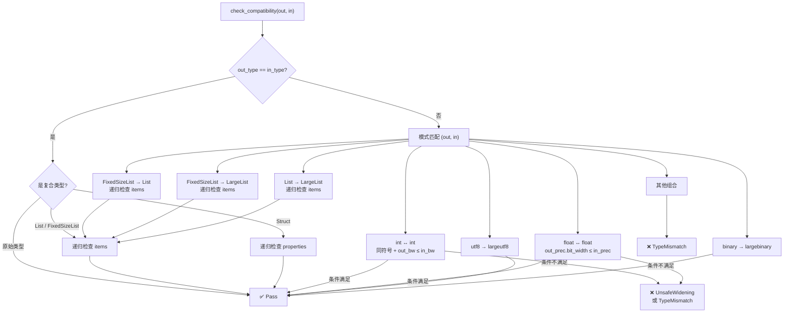
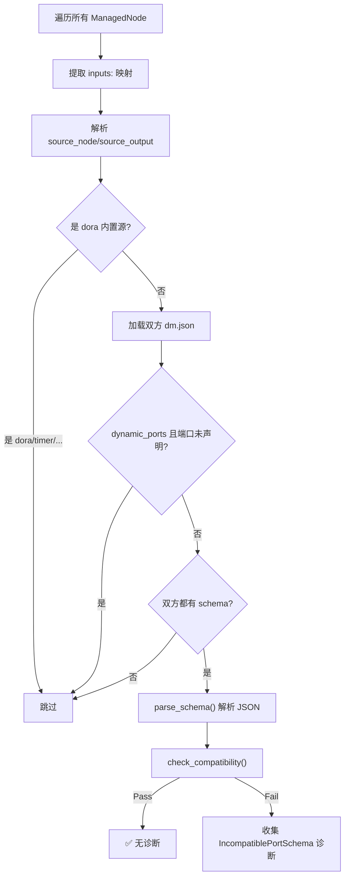

在 dora-rs 的数据流模型中，节点之间通过 **Apache Arrow Array** 传输数据。然而，传统的 `dm.json` 端口声明仅包含 `id`、`direction` 和自由文本 `description`——当用户在 YAML 中编写 `nodeA/output → nodeB/input` 连接时，系统**无法在启动前验证数据类型是否兼容**，直到运行时错误暴露。**Port Schema** 正是为解决这一问题而引入的机器可读数据契约：它在转译阶段（transpile-time）静态检查每个连接的输出→输入类型兼容性，将类型错误从"运行时崩溃"前移到"启动前诊断"。

Sources: [dm-port-schema.md](https://github.com/l1veIn/dora-manager/blob/main/docs/design/dm-port-schema.md#L1-L8), [mod.rs](https://github.com/l1veIn/dora-manager/blob/main/crates/dm-core/src/node/schema/mod.rs#L1-L16)

## 设计原则

Port Schema 的设计遵循四项核心原则，这些原则在实现中得到了严格贯彻：

1. **Arrow 原生类型**（Arrow-native types）—— `type` 字段直接使用 Arrow Integration Testing 规范定义的 JSON Type 对象，没有额外的抽象层或映射表。这是整个类型系统的根基。
2. **JSON Schema 工程体验**—— 借用了 JSON Schema 的 `$id`、`$ref`、`title`、`description`、`properties`、`required`、`items` 等关键字来组织结构和文档，但**不**声称自己是合法的 JSON Schema 文档。
3. **最小关键字集**—— 只包含对 Arrow 数据有实际意义的关键字，不支持 `if/then/else`、`patternProperties`、`prefixItems` 等复杂的 JSON Schema 特性。
4. **渐进式校验**（Gradual validation）—— 只有当输出端口和输入端口**都**声明了 `schema` 时才触发校验；单方或双方缺少 `schema` 的连接被静默跳过。声明了 `dynamic_ports: true` 的节点允许在 YAML 中定义未在 `ports` 中预声明的端口，这些端口同样被跳过。

Sources: [dm-port-schema.md](https://github.com/l1veIn/dora-manager/blob/main/docs/design/dm-port-schema.md#L9-L14)

## 数据模型前提

所有在 dora-rs 节点间传输的数据本质上都是一个 **Apache Arrow Array**。即使是标量值，也必须被包装在数组中（Python 中的 `pa.array(["hello"])`，Rust 中的单元素 `StringArray`）。**Port Schema 描述的是这个 Arrow Array 的元素类型，而非数组本身。** 当 schema 声明 `"type": { "name": "utf8" }` 时，含义是"此端口传输一个 `Utf8Array`，其中每个元素是 UTF-8 字符串"。数组级别的包装是隐式的、全局的——schema 作者永远不需要描述它。

Sources: [dm-port-schema.md](https://github.com/l1veIn/dora-manager/blob/main/docs/design/dm-port-schema.md#L16-L20)

## 核心数据模型

Port Schema 系统的 Rust 实现由三个紧密协作的模块构成：`model.rs` 定义类型结构，`parse.rs` 负责 JSON 解析与 `$ref` 解析，`compat.rs` 实现类型兼容性检查。以下 Mermaid 图展示了它们的协作关系：

```mermaid
graph TB
    subgraph "dm.json 端口声明"
        DJ["NodePort.schema<br/>(serde_json::Value)"]
    end

    subgraph "schema 模块"
        P["parse_schema()<br/>JSON → PortSchema"]
        M["PortSchema<br/>arrow_type / items / properties"]
        AT["ArrowType 枚举<br/>18 种 Arrow 类型"]
        C["check_compatibility()<br/>输出 ↔ 输入子类型检查"]
        E["SchemaError<br/>7 种不兼容原因"]
    end

    subgraph "transpile 管线"
        VP["validate_port_schemas()<br/>Pass 1.6"]
    end

    DJ --> "|JSON 解析 + $ref 解析|" P
    P --> M
    M --> AT
    M --> C
    C --> E
    VP --> P
    VP --> C
```

Sources: [mod.rs](https://github.com/l1veIn/dora-manager/blob/main/crates/dm-core/src/node/schema/mod.rs#L1-L17), [model.rs](https://github.com/l1veIn/dora-manager/blob/main/crates/dm-core/src/node/schema/model.rs#L1-L10)

### ArrowType 枚举

`ArrowType` 是整个系统的类型核心。它以 Rust 枚举的形式精确映射了 Arrow Integration Testing JSON 格式中定义的所有数据类型，涵盖 18 种变体，分为六个族系：

| 族系 | 变体 | JSON `name` 值 | 携带参数 |
|---|---|---|---|
| 空值/布尔 | `Null`, `Bool` | `"null"`, `"bool"` | — |
| 整数 | `Int` | `"int"` | `bitWidth: u16`, `isSigned: bool` |
| 浮点 | `FloatingPoint` | `"floatingpoint"` | `precision: FloatPrecision` |
| 字符串/二进制 | `Utf8`, `LargeUtf8`, `Binary`, `LargeBinary` | 对应 `name` | — |
| 定长二进制 | `FixedSizeBinary` | `"fixedsizebinary"` | `byteWidth: usize` |
| 时间日期 | `Date`, `Time`, `Timestamp`, `Duration` | 对应 `name` | `unit`，可选 `timezone` |
| 嵌套类型 | `List`, `LargeList`, `FixedSizeList`, `Struct`, `Map` | 对应 `name` | `listSize`，`keysSorted` 等 |

`FloatPrecision` 枚举定义了 `HALF`（16-bit）、`SINGLE`（32-bit）、`DOUBLE`（64-bit）三种精度等级，每种精度都暴露了 `bit_width()` 方法用于兼容性检查中的位宽比较。`TimeUnit` 枚举覆盖 `SECOND`、`MILLISECOND`、`MICROSECOND`、`NANOSECOND` 四种时间粒度，被 `Timestamp`、`Time`、`Duration` 三种时间类型共用。

Sources: [model.rs](https://github.com/l1veIn/dora-manager/blob/main/crates/dm-core/src/node/schema/model.rs#L62-L152)

### PortSchema 结构体

`PortSchema` 是顶层 schema 对象，表示单个端口的数据契约。`arrow_type` 字段始终存在（规范要求），结构化字段 `items`、`properties`、`required` 仅在对应的 Arrow 嵌套类型下有意义：

```rust
pub struct PortSchema {
    pub id: Option<String>,           // "$id": 唯一标识符
    pub title: Option<String>,        // "title": 人类可读名称
    pub description: Option<String>,  // "description": 详细描述
    pub arrow_type: ArrowType,        // "type": Arrow 类型（必需）
    pub nullable: bool,               // "nullable": 默认 false
    pub items: Option<Box<PortSchema>>,            // "items": 列表元素 schema
    pub properties: Option<BTreeMap<String, PortSchema>>, // "properties": struct 字段
    pub required: Option<Vec<String>>,            // "required": 必需字段名
    pub metadata: Option<serde_json::Value>,      // "metadata": 自由注解
}
```

注意 `items` 使用 `Box<PortSchema>` 实现递归结构，`properties` 使用 `BTreeMap` 保证字段名的稳定排序。这种递归设计使得 `list<struct<list<utf8>>>` 这样的深层嵌套类型可以被精确描述。

Sources: [model.rs](https://github.com/l1veIn/dora-manager/blob/main/crates/dm-core/src/node/schema/model.rs#L158-L184)

### NodePort 中的 schema 字段

在 `dm.json` 的端口声明模型中，`NodePort` 结构体通过 `schema: Option<serde_json::Value>` 字段持有原始 JSON 值。这意味着 schema 在节点元数据层面保持未解析状态，仅在转译管线的校验阶段才被解析为强类型的 `PortSchema`。这种延迟解析策略确保了节点加载的轻量性，同时兼容渐进式校验原则——没有 schema 的端口零开销。

Sources: [model.rs](https://github.com/l1veIn/dora-manager/blob/main/crates/dm-core/src/node/model.rs#L164-L181)

## 关键字体系

Port Schema 规范定义了三层关键字，每层都有明确的适用范围和语义。

### 通用关键字

通用关键字可用于**所有** schema 对象，无论 Arrow 类型如何：

| 关键字 | 类型 | 说明 |
|---|---|---|
| `$id` | `string` | Schema 唯一标识符，支持跨文件引用。约定格式：`"dm-schema://<name>"` |
| `$ref` | `string` | 引用另一个 schema，支持相对路径（`"schema/audio.json"`）或 schema ID（`"dm-schema://audio-pcm"`） |
| `title` | `string` | 短人类可读名称 |
| `description` | `string` | 详细人类可读描述 |
| `type` | `ArrowType` | **必需。** Arrow JSON Type 对象 |
| `nullable` | `boolean` | 值是否可为 null，默认 `false` |
| `metadata` | `object` | 应用级自由键值注解 |

### 结构化关键字

仅在 Arrow 类型隐含嵌套结构时可用：

| 关键字 | 适用 Arrow 类型 | 类型 | 说明 |
|---|---|---|---|
| `items` | `list`, `largelist`, `fixedsizelist` | `Schema` | 列表元素的 schema |
| `properties` | `struct` | `{ [name]: Schema }` | struct 的命名子字段 |
| `required` | `struct` | `string[]` | 必需的 properties 键名列表 |

### 约束关键字（仅作文档用途）

这些关键字**不影响**转译时的类型兼容性检查，仅为节点开发者提供机器可读的文档提示：

| 关键字 | 适用 Arrow 类型 | 类型 | 说明 |
|---|---|---|---|
| `minimum` | `int`, `floatingpoint`, `decimal` | `number` | 最小值提示 |
| `maximum` | `int`, `floatingpoint`, `decimal` | `number` | 最大值提示 |
| `enum` | `utf8`, `largeutf8`, `int` | `array` | 允许值枚举 |
| `default` | any | any | 默认值提示 |

Sources: [dm-port-schema.md](https://github.com/l1veIn/dora-manager/blob/main/docs/design/dm-port-schema.md#L24-L59)

## 类型系统详解

`type` 字段使用 Arrow Integration Testing 规范定义的 JSON Type 对象。以下是每种类型的 JSON 声明形式与对应的 Rust 枚举变体之间的精确映射。

### 原始类型

```jsonc
// Null — 通常用于触发信号、心跳
{ "name": "null" }
// → ArrowType::Null

// Boolean — 逻辑门、开关状态
{ "name": "bool" }
// → ArrowType::Bool

// 有符号整数（8/16/32/64-bit）
{ "name": "int", "bitWidth": 32, "isSigned": true }
// → ArrowType::Int { bit_width: 32, is_signed: true }

// 无符号整数（8/16/32/64-bit）
{ "name": "int", "bitWidth": 8, "isSigned": false }
// → ArrowType::Int { bit_width: 8, is_signed: false }

// 浮点数（HALF=16bit, SINGLE=32bit, DOUBLE=64bit）
{ "name": "floatingpoint", "precision": "SINGLE" }
// → ArrowType::FloatingPoint { precision: FloatPrecision::Single }
```

### 二进制与字符串类型

```jsonc
{ "name": "utf8" }           // UTF-8 字符串（32-bit 偏移）
{ "name": "largeutf8" }      // UTF-8 字符串（64-bit 偏移）
{ "name": "binary" }         // 变长二进制（32-bit 偏移）
{ "name": "largebinary" }    // 变长二进制（64-bit 偏移）
{ "name": "fixedsizebinary", "byteWidth": 16 }  // 定长二进制
```

### 时间类型

```jsonc
{ "name": "date", "unit": "DAY" }
{ "name": "timestamp", "unit": "MICROSECOND", "timezone": "UTC" }
{ "name": "time", "unit": "NANOSECOND", "bitWidth": 64 }
{ "name": "duration", "unit": "MILLISECOND" }
```

### 嵌套类型

```jsonc
// 变长列表 — 使用 items 定义元素 schema
{ "name": "list" }

// 定长列表 — 使用 items 定义元素 schema，listSize 指定元素数量
{ "name": "fixedsizelist", "listSize": 1600 }

// 结构体 — 使用 properties 和 required 定义字段
{ "name": "struct" }

// 映射
{ "name": "map", "keysSorted": false }
```

Sources: [dm-port-schema.md](https://github.com/l1veIn/dora-manager/blob/main/docs/design/dm-port-schema.md#L63-L128), [parse.rs](https://github.com/l1veIn/dora-manager/blob/main/crates/dm-core/src/node/schema/parse.rs#L103-L229)

## JSON 解析与 $ref 解析

`parse_schema()` 函数是 schema 从 JSON 到强类型 `PortSchema` 的桥梁。它的核心逻辑分为两个阶段：

**阶段一：`$ref` 解析。** 如果顶层 JSON 对象包含 `$ref` 字段，解析器将其视为相对路径（相对于 `base_dir`，通常是节点目录），读取引用的 JSON 文件后重新进入解析流程。当前实现仅支持相对文件路径；`dm-schema://` URI 方案的解析留待 Phase 2 实现。

**阶段二：递归结构解析。** `parse_schema_inner()` 处理实际的结构解析：提取必需的 `type` 字段并通过 `parse_arrow_type()` 转换为 `ArrowType` 枚举；递归解析 `items`（嵌套调用自身）；将 `properties` 对象展开为 `BTreeMap<String, PortSchema>`；将 `required` 数组收集为 `Vec<String>`。如果顶层 JSON 缺少 `type` 字段，解析立即失败并返回错误。

Sources: [parse.rs](https://github.com/l1veIn/dora-manager/blob/main/crates/dm-core/src/node/schema/parse.rs#L1-L97), [parse.rs](https://github.com/l1veIn/dora-manager/blob/main/crates/dm-core/src/node/schema/parse.rs#L246-L255)

## 类型兼容性检查

类型兼容性检查是 Port Schema 系统的核心价值。`check_compatibility(output, input)` 函数实现了一个基于**子类型语义**的单向检查：**输出端口的数据是否能安全地被输入端口消费，而不丢失数据或产生类型错误。** 检查逻辑是一个分层的模式匹配过程。

### 检查决策流程



### 安全宽化规则

兼容性检查的核心是 **安全宽化**（safe widening）概念——允许从窄类型到宽类型的隐式转换，但禁止反向窄化和跨域转换：

| 输出类型 | 输入类型 | 结果 | 规则 |
|---|---|---|---|
| `int(32, signed)` | `int(64, signed)` | ✅ Pass | 同符号，位宽增大 |
| `int(64, signed)` | `int(32, signed)` | ❌ UnsafeWidening | 位宽缩小，可能截断 |
| `int(32, signed)` | `int(32, unsigned)` | ❌ TypeMismatch | 符号不同 |
| `floatingpoint(SINGLE)` | `floatingpoint(DOUBLE)` | ✅ Pass | 精度提升 |
| `floatingpoint(DOUBLE)` | `floatingpoint(SINGLE)` | ❌ UnsafeWidening | 精度降低 |
| `utf8` | `largeutf8` | ✅ Pass | 偏移位宽增大 |
| `binary` | `largebinary` | ✅ Pass | 偏移位宽增大 |
| `fixedsizelist(N)` | `list` | ✅ Pass | 定长是变长的子类型 |
| `fixedsizelist(N)` | `largelist` | ✅ Pass | 双重宽化 |
| `list` | `largelist` | ✅ Pass | 偏移位宽增大 |
| `utf8` | `int(32, signed)` | ❌ TypeMismatch | 跨域不兼容 |
| `fixedsizelist(100)` | `fixedsizelist(200)` | ❌ TypeMismatch | 定长大小不同 |

Sources: [compat.rs](https://github.com/l1veIn/dora-manager/blob/main/crates/dm-core/src/node/schema/compat.rs#L98-L195)

### 列表元素兼容性

对于列表类型的兼容性检查，逻辑遵循一个三元分支：

- **双方都有 `items`**：递归调用 `check_compatibility` 检查元素 schema 的兼容性
- **输入方没有 `items`**：输入接受任意元素类型，直接通过 ✅
- **输出方没有 `items` 但输入方有**：无法验证，报 `MissingNestedSchema` 错误 ❌

这体现了"输入方越宽松越好通过"的设计哲学。

Sources: [compat.rs](https://github.com/l1veIn/dora-manager/blob/main/crates/dm-core/src/node/schema/compat.rs#L197-L212)

### Struct 字段兼容性

Struct 兼容性检查采用**子集语义**（subset semantics）：输出 struct 必须提供输入 struct 所需的全部字段。具体检查分两轮：

**第一轮：检查 `required` 字段。** 对于输入 schema 的 `required` 列表中的每个字段名，验证该字段是否存在于输出的 `properties` 中，并递归检查字段 schema 的兼容性。如果输出缺少任何必需字段，返回 `MissingStructField` 错误。

**第二轮：检查共同存在的非必需字段。** 对于输入 `properties` 中所有非 `required` 的字段，如果输出也定义了同名字段，则递归检查兼容性。输出中缺少的非必需字段不会导致错误——这意味着输出可以是一个"超集"struct，提供比输入所需更多的字段。

Sources: [compat.rs](https://github.com/l1veIn/dora-manager/blob/main/crates/dm-core/src/node/schema/compat.rs#L214-L267)

### 错误类型体系

`SchemaError` 枚举精确定位了七种不兼容原因，每种都携带了足够的上下文信息用于生成诊断消息：

| 错误变体 | 语义 | 典型场景 |
|---|---|---|
| `TypeMismatch` | 顶层类型族不匹配 | utf8 vs int |
| `UnsafeWidening` | 位宽/精度无法安全宽化 | int64 → int32 |
| `ListSizeMismatch` | 定长列表大小不同 | FixedSizeList(100) vs (200) |
| `IncompatibleItems` | 列表元素类型不兼容（包装内部错误） | list\<utf8\> vs list\<int\> |
| `MissingStructField` | 输出 struct 缺少输入要求的字段 | struct{a} vs struct{a,b} |
| `IncompatibleStructField` | struct 字段类型不兼容（包装内部错误） | struct.a 类型不同 |
| `MissingNestedSchema` | 输出缺少输入要求的嵌套 schema | 输出无 items 但输入有 |

`IncompatibleItems` 和 `IncompatibleStructField` 都使用 `Box<SchemaError>` 包装内部错误，形成了一条可追溯到根因的**错误链**。

Sources: [compat.rs](https://github.com/l1veIn/dora-manager/blob/main/crates/dm-core/src/node/schema/compat.rs#L8-L85)

## 转译管线集成

Port Schema 校验作为 **Pass 1.6** 集成在数据流转译管线中。转译管线的完整执行顺序如下：

```
Pass 1:   Parse — YAML → DmGraph IR
Pass 1.5: Validate Reserved — 保留节点 ID 冲突检查（当前为空实现）
Pass 2:   Resolve Paths — node: → 绝对 path:
Pass 1.6: Validate Port Schemas — 端口 schema 兼容性检查 ← 这里
Pass 3:   Merge Config — 四层配置合并 → env:
Pass 4:   Inject Runtime Env — 注入运行时环境变量
Pass 5:   Inject DM Bridge — Bridge 节点注入
Pass 6:   Emit — DmGraph → dora YAML
```

注意 `validate_port_schemas` 在 `resolve_paths` **之后**执行——这是因为 schema 解析需要知道节点的磁盘路径（用于 `$ref` 引用的 `base_dir`），而路径信息在 `resolve_paths` 阶段才确定。

Sources: [mod.rs](https://github.com/l1veIn/dora-manager/blob/main/crates/dm-core/src/dataflow/transpile/mod.rs#L1-L81), [passes.rs](https://github.com/l1veIn/dora-manager/blob/main/crates/dm-core/src/dataflow/transpile/passes.rs#L115-L263)

### validate_port_schemas 执行流程

该 Pass 的执行逻辑精确地实现了"渐进式校验"原则，以下流程图展示了完整决策路径：



具体步骤：

1. **构建查找表**：将所有 `ManagedNode` 的 `yaml_id → node_id` 映射收集到 HashMap 中
2. **遍历每个 Managed 节点的 `inputs:` 映射**：从 `extra_fields` 中提取 YAML 原始的 `inputs:` 字段
3. **解析连接源**：将 `input_port: source_node/source_output` 格式拆分为源节点 ID 和源输出端口 ID
4. **跳过 dora 内置源**：`dora/timer/...` 等内置源直接跳过
5. **加载双方 dm.json 元数据**：通过 `resolve_dm_json_path()` 定位并反序列化
6. **动态端口豁免**：如果节点声明了 `dynamic_ports: true` 且端口未在 `ports` 中声明，静默跳过
7. **双方 schema 存在性检查**：只有**双方都声明了 schema** 时才进入校验
8. **解析 schema**：调用 `parse_schema()` 解析 JSON，处理 `$ref` 引用
9. **兼容性检查**：调用 `check_compatibility()` 并将错误收集为 `IncompatiblePortSchema` 诊断

所有诊断以**收集而非短路**的方式处理——用户可以一次性看到所有连接问题，而非逐个修复。

Sources: [passes.rs](https://github.com/l1veIn/dora-manager/blob/main/crates/dm-core/src/dataflow/transpile/passes.rs#L125-L263)

### 诊断类型

转译管线定义了两种与 Port Schema 相关的诊断类型，它们都携带 `yaml_id` 和 `node_id` 用于精确定位：

| 诊断类型 | 触发条件 | 输出格式 |
|---|---|---|
| `InvalidPortSchema` | schema JSON 解析失败（语法错误、缺少 `type` 字段等） | `node "yaml_id" (id: node_id): port 'xxx' has an invalid schema: ...` |
| `IncompatiblePortSchema` | 类型兼容性检查失败 | `node "yaml_id" (id: node_id): incompatible connection source/output → input: ...` |

Sources: [error.rs](https://github.com/l1veIn/dora-manager/blob/main/crates/dm-core/src/dataflow/transpile/error.rs#L15-L61)

## dm.json 中的 Schema 声明

端口通过 `schema` 键声明其数据契约——支持内联或 `$ref` 引用两种形式。以下展示项目中**实际使用的** schema 声明模式。

### 内联声明（最常见）

大多数节点使用简洁的内联声明。以下表格汇总了项目中各节点已声明的 schema 模式：

| 节点 | 端口 ID | 方向 | Arrow 类型 | 描述 |
|---|---|---|---|---|
| dm-microphone | `audio` | output | `floatingpoint(SINGLE)` | Float32 PCM 音频流 |
| dm-microphone | `devices` | output | `utf8` | JSON 编码的设备列表 |
| dm-microphone | `device_id` | input | `utf8` | 选择麦克风的设备 ID |
| dm-microphone | `tick` | input | `null` | 心跳定时器 |
| dm-screen-capture | `frame` | output | `int(8, unsigned)` | 编码图像帧字节 |
| dm-screen-capture | `meta` | output | `utf8` | JSON 帧元数据 |
| dm-screen-capture | `trigger` | input | `null` | 单次捕获触发 |
| dm-mjpeg | `frame` | input | `int(8, unsigned)` | 原始图像字节 |
| dm-and | `a`, `b`, `c`, `d` | input | `bool` | 布尔输入 |
| dm-and | `ok` | output | `bool` | 组合结果 |
| dm-and | `details` | output | `utf8` | JSON 评估详情 |
| dm-gate | `enabled` | input | `bool` | 布尔使能信号 |
| dm-gate | `value` | input/output | `null` | 透传值 |
| dm-message | `path`, `data` | input | `utf8` | 路径 / 轻量显示内容 |

Sources: [dm-microphone dm.json](https://github.com/l1veIn/dora-manager/blob/main/nodes/dm-microphone/dm.json#L34-L75), [dm-screen-capture dm.json](https://github.com/l1veIn/dora-manager/blob/main/nodes/dm-screen-capture/dm.json#L33-L77), [dm-and dm.json](https://github.com/l1veIn/dora-manager/blob/main/nodes/dm-and/dm.json), [dm-gate dm.json](https://github.com/l1veIn/dora-manager/blob/main/nodes/dm-gate/dm.json), [dm-message dm.json](https://github.com/l1veIn/dora-manager/blob/main/nodes/dm-message/dm.json), [dm-mjpeg dm.json](https://github.com/l1veIn/dora-manager/blob/main/nodes/dm-mjpeg/dm.json)

### $ref 引用（外部文件）

当 schema 需要跨节点复用时，可以将其存储在节点目录下的 `schema/` 子目录中并通过 `$ref` 引用。规范约定的目录结构如下：

```
nodes/
  dm-microphone/
    dm.json
    schema/
      audio-pcm.json        ← 共享 schema 文件
      device-list.json
    dm_microphone/
      main.py
```

在 `dm.json` 中的引用方式：

```jsonc
{
  "ports": [
    {
      "id": "audio",
      "direction": "output",
      "schema": { "$ref": "schema/audio-pcm.json" }
    }
  ]
}
```

下游节点也可以通过 `$id` 引用已注册的 schema：

```jsonc
{
  "ports": [
    {
      "id": "audio_in",
      "direction": "input",
      "schema": { "$ref": "dm-schema://audio-pcm" }
    }
  ]
}
```

> **当前状态**：`dm-schema://` URI 解析尚未实现（Phase 2 计划），当前仅支持相对文件路径的 `$ref`。

Sources: [parse.rs](https://github.com/l1veIn/dora-manager/blob/main/crates/dm-core/src/node/schema/parse.rs#L246-L255), [dm-port-schema.md](https://github.com/l1veIn/dora-manager/blob/main/docs/design/dm-port-schema.md#L132-L179)

## 实际数据流中的类型校验场景

以 [demo-logic-gate.yml](demos/demo-logic-gate.yml) 为例，当转译器处理以下连接时：

```yaml
# switch-a/value → and-gate/a
# 输出类型: boolean（dm-input-switch）→ 输入类型: bool（dm-and）
```

转译器加载 `dm-input-switch` 的 `dm.json` 和 `dm-and` 的 `dm.json`，分别解析双方端口的 `schema`，然后调用 `check_compatibility()`。由于 `dm-input-switch` 当前声明了 `"type": { "name": "boolean" }`（非标准 Arrow 类型名），解析器将产生 `InvalidPortSchema` 诊断，提示 `unknown Arrow type name: 'boolean'`——这正是 Port Schema 的价值所在：在运行前捕获声明错误。

Sources: [demo-logic-gate.yml](demos/demo-logic-gate.yml#L32-L63), [passes.rs](https://github.com/l1veIn/dora-manager/blob/main/crates/dm-core/src/dataflow/transpile/passes.rs#L125-L263)

## 常见陷阱

在实际节点开发中，以下是容易犯的 schema 声明错误：

| 错误模式 | 错误示例 | 正确写法 | 诊断结果 |
|---|---|---|---|
| 使用非标准类型名 | `"name": "boolean"` | `"name": "bool"` | `InvalidPortSchema: unknown Arrow type name` |
| 使用非标准浮点简写 | `"name": "float64"` | `{"name": "floatingpoint", "precision": "DOUBLE"}` | `InvalidPortSchema: unknown Arrow type name` |
| 空的 schema 对象 | `"schema": {}` | `"schema": {"type": {"name": "utf8"}}` | `InvalidPortSchema: missing required 'type' field` |
| 缺少 int 参数 | `{"name": "int"}` | `{"name": "int", "bitWidth": 32, "isSigned": true}` | `InvalidPortSchema: int type requires 'bitWidth'` |

> **开发建议**：编写 `dm.json` 时，始终对照 [parse.rs](https://github.com/l1veIn/dora-manager/blob/main/crates/dm-core/src/node/schema/parse.rs#L103-L229) 中 `parse_arrow_type()` 的 match 分支来验证 `type` 字段的 `name` 值和必需参数。

Sources: [parse.rs](https://github.com/l1veIn/dora-manager/blob/main/crates/dm-core/src/node/schema/parse.rs#L103-L229), [dm-input-switch dm.json](https://github.com/l1veIn/dora-manager/blob/main/nodes/dm-input-switch/dm.json), [dora-yolo dm.json](https://github.com/l1veIn/dora-manager/blob/main/nodes/dora-yolo/dm.json)

## 完整 Schema 示例

以下示例展示了从简单到复杂的 schema 声明模式，均源自规范设计文档。

### PCM 音频流（定长列表 + 浮点元素）

```json
{
  "$id": "dm-schema://audio-pcm",
  "title": "PCM Audio Chunk",
  "description": "Float32 PCM audio samples, single channel",
  "type": { "name": "fixedsizelist", "listSize": 1600 },
  "nullable": false,
  "items": {
    "type": { "name": "floatingpoint", "precision": "SINGLE" },
    "minimum": -1.0,
    "maximum": 1.0
  }
}
```

### 目标检测结果（列表嵌套 struct）

```json
{
  "$id": "dm-schema://detections",
  "title": "Object Detection Results",
  "type": { "name": "list" },
  "items": {
    "type": { "name": "struct" },
    "required": ["bbox", "label", "confidence"],
    "properties": {
      "bbox": {
        "description": "Bounding box [x1, y1, x2, y2]",
        "type": { "name": "fixedsizelist", "listSize": 4 },
        "items": { "type": { "name": "floatingpoint", "precision": "SINGLE" } }
      },
      "label": { "type": { "name": "utf8" } },
      "confidence": {
        "type": { "name": "floatingpoint", "precision": "SINGLE" },
        "minimum": 0, "maximum": 1
      }
    }
  }
}
```

### RGB 图像帧（变长列表 + 无符号整数元素）

```json
{
  "$id": "dm-schema://image-rgb",
  "title": "RGB Image",
  "description": "HxWx3 interleaved RGB image as flat uint8 array",
  "type": { "name": "list" },
  "nullable": false,
  "items": {
    "type": { "name": "int", "bitWidth": 8, "isSigned": false },
    "minimum": 0,
    "maximum": 255
  }
}
```

### 控制信号（带 enum 约束）

```json
{
  "$id": "dm-schema://control-signal",
  "title": "Control Signal",
  "type": { "name": "utf8" },
  "enum": ["flush", "reset", "stop"]
}
```

Sources: [dm-port-schema.md](https://github.com/l1veIn/dora-manager/blob/main/docs/design/dm-port-schema.md#L185-L268)

## 测试覆盖

[tests.rs](https://github.com/l1veIn/dora-manager/blob/main/crates/dm-core/src/node/schema/tests.rs) 为 schema 系统提供了 22 个测试用例，覆盖解析和兼容性检查两大方面。解析测试验证了所有主要 Arrow 类型（`null`、`bool`、`int32`、`uint8`、`float32`、`utf8`、`binary`、`fixedsizelist`、`struct`、`timestamp`）的正确反序列化，包括带 `$id`/`title`/`nullable`/`metadata` 的完整 schema。兼容性测试覆盖了安全宽化的正向和反向场景：

| 测试场景 | 预期结果 |
|---|---|
| 精确匹配（utf8 == utf8） | ✅ Pass |
| int 安全宽化（int32 → int64） | ✅ Pass |
| int 窄化（int64 → int32） | ❌ Fail |
| int 符号不匹配（signed vs unsigned） | ❌ Fail |
| float 安全宽化（SINGLE → DOUBLE） | ✅ Pass |
| float 窄化（DOUBLE → SINGLE） | ❌ Fail |
| utf8 → largeutf8 | ✅ Pass |
| 跨域不匹配（utf8 vs int32） | ❌ Fail |
| FixedSizeList → List（元素兼容） | ✅ Pass |
| FixedSizeList 大小不匹配 | ❌ Fail |
| List 元素不兼容 | ❌ Fail |
| Struct 超集（输出有额外字段） | ✅ Pass |
| Struct 缺少必需字段 | ❌ Fail |
| Struct 字段类型不匹配 | ❌ Fail |
| null 精确匹配 | ✅ Pass |
| 输入无 items 接受任意列表 | ✅ Pass |

Sources: [tests.rs](https://github.com/l1veIn/dora-manager/blob/main/crates/dm-core/src/node/schema/tests.rs#L1-L333)

## 路线图：Schema 作为一等公民

当前 Phase 1 实现中，schema 文件存储在每个节点的 `schema/` 子目录内。当共享 schema 数量增长后，规范计划引入类似节点发现机制的分层 schema 发现链：

```
Phase 1 (当前):   schema/ 存在于各节点目录内
Phase 2 (计划):   ~/.dm/schemas/           (用户级，最高优先级)
                   repository schemas/       (工作区级)
                   DM_SCHEMA_DIRS 环境变量   (额外目录)
```

跨节点 `$ref` 通过 `$id`（如 `"dm-schema://audio-pcm"`）将在此发现链中解析，使得 schema 真正成为可复用的一等资源。

Sources: [dm-port-schema.md](https://github.com/l1veIn/dora-manager/blob/main/docs/design/dm-port-schema.md#L325-L337)

---

**相关阅读**：
- 端口 schema 在转译管线中的位置：[数据流转译器：多 Pass 管线与四层配置合并](08-transpiler)
- dm.json 中端口声明的完整字段参考：[自定义节点开发指南：dm.json 完整字段参考](22-custom-node-guide)
- 使用了 schema 声明的内置节点一览：[内置节点总览：从媒体采集到 AI 推理](19-builtin-nodes)