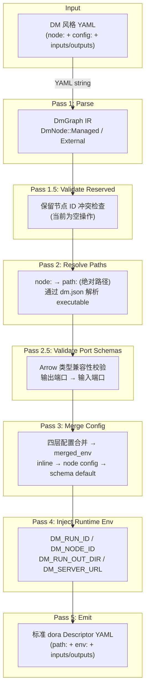
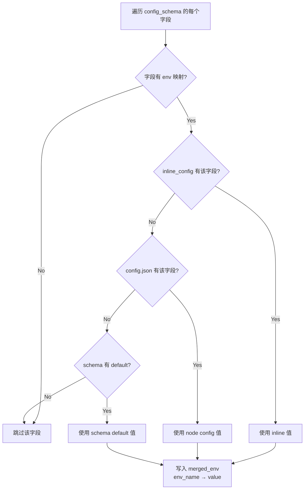
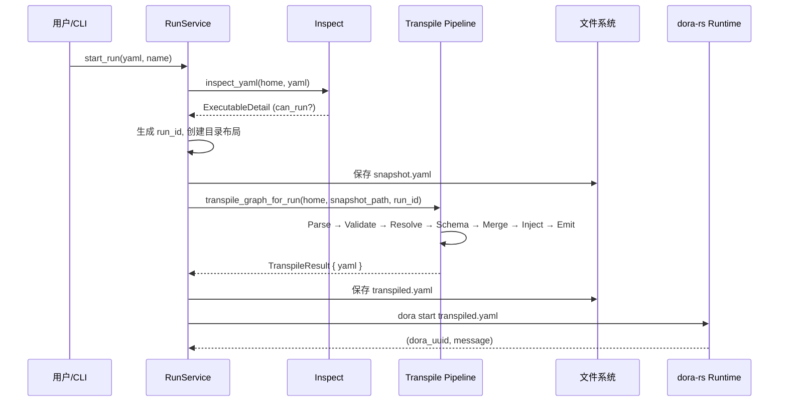

数据流（Dataflow）是 Dora Manager 的核心执行单元，但它并非直接被 dora-rs 运行时消费。用户编写的 DM 风格 YAML 包含声明式的 `node:` 引用、内联 `config:` 块和端口拓扑，这些语义必须被**转译**（transpile）为 dora-rs 能理解的标准 `Descriptor` YAML —— 即绝对 `path:`、合并后的 `env:` 环境变量和运行时注入的上下文信息。这一转换由 `dm-core` 中的 transpile 模块完成，它采用了一个**多 Pass 管线**架构，将原始文本逐步变换为类型化的中间表示（IR），再在各 Pass 中填充路径、校验端口类型、合并配置、注入运行时环境，最终序列化为标准 YAML 输出。本文将深入解析这一管线的六个阶段、四层配置合并策略以及诊断收集模型。

Sources: [mod.rs](https://github.com/l1veIn/dora-manager/blob/master/crates/dm-core/src/dataflow/transpile/mod.rs#L1-L82)

## 管线全景：从 DM YAML 到 dora Descriptor

转译器的入口函数 `transpile_graph_for_run` 接收 DM_HOME 路径和 YAML 文件路径，按照固定顺序执行六个 Pass。整个过程不使用短路（short-circuit）错误处理，而是通过诊断收集机制（diagnostics）让用户一次性看到所有问题。下图展示了管线的完整数据流：



管线的核心设计原则是**渐进式丰富**（progressive enrichment）：每个 Pass 只负责一个关注点，向 IR 中填充特定字段。`DmGraph` 作为所有 Pass 共享的可变状态，其字段由各 Pass 逐步填充 —— `resolved_path` 由 `resolve_paths` 填充，`merged_env` 由 `merge_config` 和 `inject_runtime_env` 填充。

Sources: [mod.rs](https://github.com/l1veIn/dora-manager/blob/master/crates/dm-core/src/dataflow/transpile/mod.rs#L44-L81)

## 类型化中间表示：DmGraph IR

转译器不直接操作原始 `serde_yaml::Value` 树，而是将每个节点解析为三种强类型变体之一，仅在最终 emit 阶段才转换回 YAML。这一设计将**语义解析**与**序列化**解耦，使每个 Pass 可以在类型安全的结构上操作。

```rust
// DmGraph — 所有 Pass 共享的核心 IR
pub(crate) struct DmGraph {
    pub nodes: Vec<DmNode>,
    pub extra_fields: serde_yaml::Mapping, // 透传顶层未知字段
}

pub(crate) enum DmNode {
    Managed(ManagedNode),      // 有 node: 字段的受管节点
    External { _yaml_id, raw }, // 外部节点（path: 指定），原样透传
}

pub(crate) struct ManagedNode {
    pub yaml_id: String,            // YAML 中的 id 字段
    pub node_id: String,            // node: 字段的值（节点标识符）
    pub inline_config: Value,       // YAML 中 config: 块的内联配置
    pub resolved_path: Option<String>, // Pass 2 填充的绝对可执行路径
    pub merged_env: Mapping,        // Pass 3/4 填充的环境变量
    pub extra_fields: Mapping,      // inputs/outputs 等其他字段透传
}
```

**Managed** 与 **External** 的区分是整个转译器的核心分类逻辑。在 Parse 阶段，只有同时具备 `node:` 字段的节点才会被归类为 `Managed`，进入后续的路径解析、配置合并等处理流程；而仅有 `path:` 或既无 `node:` 也无 `path:` 的节点则被归为 `External`，在 emit 阶段原样输出。`extra_fields` 字段采用了**白名单排除**策略 —— 移除 `id`、`node`、`path`、`config`、`env` 这些由 IR 显式管理的字段后，所有其他字段（如 `inputs`、`outputs`、`args`）都被透传到最终输出。

Sources: [model.rs](https://github.com/l1veIn/dora-manager/blob/master/crates/dm-core/src/dataflow/transpile/model.rs#L1-L39), [passes.rs](https://github.com/l1veIn/dora-manager/blob/master/crates/dm-core/src/dataflow/transpile/passes.rs#L15-L95)

## Pass 1: Parse — YAML 文本到类型化 IR

Parse 阶段将原始 YAML 字符串解析为 `DmGraph` IR。对于每个节点条目，它首先提取 `id`、`node` 和 `path` 字段，然后根据是否存在 `node:` 字段决定节点的分类。Managed 节点会额外提取 `config:` 块（作为 `inline_config`）和已有的 `env:` 映射（作为 `merged_env` 的初始值），而 External 节点则保留原始 YAML Mapping 不做任何变换。顶层 `nodes` 以外的所有字段（如 `communication`、`deploy`、`debug` 等 dora 标准字段）被保存到 `extra_fields` 中，确保未知的或未来新增的 dora 字段永远不会被丢弃。

Sources: [passes.rs](https://github.com/l1veIn/dora-manager/blob/master/crates/dm-core/src/dataflow/transpile/passes.rs#L8-L95)

## Pass 2: Resolve Paths — node: 到绝对 path: 的解析

这是转译器的第一个**有副作用**的 Pass。对于每个 Managed 节点，它通过 `node::resolve_node_dir` 在所有配置的节点目录中查找节点目录（`~/.dm/nodes/` → 内置 `nodes/` → `DM_NODE_DIRS` 环境变量中的额外路径），然后读取 `dm.json` 获取 `executable` 字段，拼接为绝对路径存入 `resolved_path`。

| 查找顺序 | 路径 | 说明 |
|----------|------|------|
| 1 | `~/.dm/nodes/<node_id>/` | 用户安装的节点 |
| 2 | `<repo_root>/nodes/<node_id>/` | 内置节点（开发时） |
| 3 | `DM_NODE_DIRS` 环境变量 | 自定义额外节点路径 |

解析失败时，不会中断管线，而是记录诊断信息（`NodeNotInstalled`、`MetadataUnreadable`、`MissingExecutable`）。在最终 emit 阶段，未解析的节点会保留原始的 `node:` 字段，让 dora-rs 在启动时给出清晰的错误提示，而非在转译阶段就静默失败。值得注意的一个实现细节是：`resolve_paths` 会将 `dm.json` 的路径以 `__dm_meta_path` 为 key 临时存入 `extra_fields`，供后续的 `merge_config` Pass 读取，在配置合并完成后该临时标记会被清除。

Sources: [passes.rs](https://github.com/l1veIn/dora-manager/blob/master/crates/dm-core/src/dataflow/transpile/passes.rs#L267-L341), [paths.rs](https://github.com/l1veIn/dora-manager/blob/master/crates/dm-core/src/node/paths.rs#L11-L23)

## Pass 2.5: Validate Port Schemas — Arrow 类型兼容性校验

此 Pass 对 Managed 节点之间的端口连接执行**编译期类型检查**。它遍历每个 Managed 节点的 `inputs:` 映射，解析 `source_node/source_output` 格式的连接声明，然后从 `dm.json` 的 `ports` 数组中查找源节点的输出端口和目标节点的输入端口，使用基于 Arrow 类型系统的 Schema 校验器检查兼容性。

校验遵循**双向声明**原则：只有当源端口和目标端口都声明了 Schema 时才触发校验。如果任一端未声明 Schema，则静默跳过；如果节点声明了 `dynamic_ports: true`，则未在 `ports` 数组中找到的端口也会被跳过。Schema 支持通过 `$ref` 引用外部 JSON Schema 文件，解析时会以节点目录为基准路径进行相对路径解析。不兼容的连接会以 `IncompatiblePortSchema` 诊断的形式记录。

Sources: [passes.rs](https://github.com/l1veIn/dora-manager/blob/master/crates/dm-core/src/dataflow/transpile/passes.rs#L110-L266)

## Pass 3: Merge Config — 四层配置合并

这是转译器中最复杂的 Pass，它实现了**四层配置优先级**策略，将分散在不同位置的配置值合并为统一的环境变量映射。理解这一机制对于正确使用 DM 的配置体系至关重要。

### 四层优先级模型

配置值按照以下优先级从高到低合并（高优先级覆盖低优先级）：

| 优先级 | 层级 | 来源 | 存储位置 | 典型场景 |
|--------|------|------|----------|----------|
| 1（最高） | **Inline 配置** | 数据流 YAML 的 `config:` 块 | 数据流 YAML 文件 | 某次特定运行需要覆盖参数 |
| 2 | **Node 配置** | 节点目录下的 `config.json` | `~/.dm/nodes/&lt;id&gt;/config.json` | 用户为节点设置的全局默认值 |
| 3（最低） | **Schema 默认值** | `dm.json` 的 `config_schema.*.default` | `~/.dm/nodes/&lt;id&gt;/dm.json` | 节点开发者提供的开箱即用默认值 |

> **注意**：转译器注释中提到的"四层"包含了设计预留的"flow 层"（数据流级别的配置文件），但在当前实现中，配置解析的实际查找链为 `inline_config → config_defaults → schema default` 三层。`inspect_config` 服务函数在 API 层也展示了相同的 `inline → node → default` 三层结构。

### 合并算法详解

合并过程遍历 `dm.json` 中 `config_schema` 的每个字段，执行以下步骤：



对于每个字段，首先检查 `config_schema[field].env` 是否存在，这是字段到环境变量名的映射。只有声明了 `env` 的字段才会被纳入合并。值的选择按优先级链 `inline_config.get(key) → config_defaults.get(key) → field_schema.get("default")` 进行 `or_else` 级联。非字符串类型的值会被 `.to_string()` 自动转换。最终的键值对写入 `ManagedNode.merged_env`。

Sources: [passes.rs](https://github.com/l1veIn/dora-manager/blob/master/crates/dm-core/src/dataflow/transpile/passes.rs#L343-L416), [local.rs](https://github.com/l1veIn/dora-manager/blob/master/crates/dm-core/src/node/local.rs#L173-L186), [service.rs](https://github.com/l1veIn/dora-manager/blob/master/crates/dm-core/src/dataflow/service.rs#L101-L200)

### config_schema 声明格式

`dm.json` 中的 `config_schema` 采用扁平对象结构，每个键代表一个可配置项，值是一个描述对象：

```json
{
  "config_schema": {
    "mode": {
      "env": "MODE",
      "default": "once",
      "x-widget": { "type": "select", "options": ["once", "continuous"] }
    },
    "duration_sec": {
      "env": "DURATION_SEC",
      "default": 3,
      "x-widget": { "type": "slider", "min": 1, "max": 60, "step": 1 }
    }
  }
}
```

| 字段 | 类型 | 说明 |
|------|------|------|
| `env` | `string` | **必需**。映射到的环境变量名，无此字段的配置项不会参与合并 |
| `default` | `any` | Schema 级默认值，最低优先级 |
| `description` | `string` | 可选，配置项说明 |
| `x-widget` | `object` | 可选，前端 UI 控件声明（`select`、`slider`、`switch` 等） |

以 `dm-test-audio-capture` 节点为例，其 `dm.json` 声明了 7 个配置项（mode、duration_sec、sample_rate、channels、output_dir、reference_audio、enable_vad），每个都映射到对应的环境变量。节点目录下的 `config.json` 则存储了用户级别的持久化配置（如 `"mode": "once"`、`"sample_rate": 16000`），这些值在每次转译时会被读取并参与合并。

Sources: [dm-test-audio-capture/dm.json](https://github.com/l1veIn/dora-manager/blob/master/nodes/dm-test-audio-capture/dm.json#L74-L142), [config.json](https://github.com/l1veIn/dora-manager/blob/master/nodes/dm-test-audio-capture/config.json#L1-L9)

### 完配合并示例

以下展示一个具体的端到端配置合并过程。假设数据流 YAML 中声明了 `dm-test-audio-capture` 节点并覆盖了 `mode` 和 `duration_sec`：

**数据流 YAML（inline 配置）**：
```yaml
- id: microphone
  node: dm-test-audio-capture
  config:
    mode: repeat
    duration_sec: 2
```

**节点 config.json（node 级配置）**：
```json
{
  "channels": 1,
  "duration_sec": 3,
  "mode": "once",
  "sample_rate": 16000
}
```

**dm.json config_schema（default 级）**：
```json
{
  "mode": { "env": "MODE", "default": "once" },
  "duration_sec": { "env": "DURATION_SEC", "default": 3 },
  "sample_rate": { "env": "SAMPLE_RATE", "default": 16000 },
  "channels": { "env": "CHANNELS", "default": 1 }
}
```

**合并结果（merged_env）**：

| 配置项 | env 变量 | inline | node config | schema default | 最终值 | 来源 |
|--------|----------|--------|-------------|----------------|--------|------|
| mode | MODE | `repeat` | `once` | `once` | `repeat` | inline |
| duration_sec | DURATION_SEC | `2` | `3` | `3` | `2` | inline |
| sample_rate | SAMPLE_RATE | — | `16000` | `16000` | `16000` | node config |
| channels | CHANNELS | — | `1` | `1` | `1` | node config |
| output_dir | OUTPUT_DIR | — | — | `/tmp/dora-audio` | `/tmp/dora-audio` | schema default |

Sources: [passes.rs](https://github.com/l1veIn/dora-manager/blob/master/crates/dm-core/src/dataflow/transpile/passes.rs#L349-L416)

## Pass 4: Inject Runtime Env — 运行时环境注入

在配置合并完成后，转译器为每个 Managed 节点注入四个**运行时上下文环境变量**。这些变量对节点代码透明可用，使节点无需硬编码服务器地址或自己推导运行目录。

| 环境变量 | 值来源 | 用途 |
|----------|--------|------|
| `DM_RUN_ID` | `uuid::Uuid::new_v4()` | 当前运行实例的唯一标识符 |
| `DM_NODE_ID` | 节点的 `yaml_id`（YAML 中的 `id` 字段） | 节点在数据流中的身份标识 |
| `DM_RUN_OUT_DIR` | `~/.dm/runs/<run_id>/out/` | 运行实例的输出目录（artifact 存储） |
| `DM_SERVER_URL` | 固定值 `http://127.0.0.1:3210` | dm-server 的 HTTP API 地址 |

这些环境变量被直接追加到 `merged_env` 映射中。由于 `merged_env` 在 emit 阶段会被序列化为节点的 `env:` 字段，dora-rs 在启动节点进程时会将它们设置为实际的环境变量，节点代码可以通过 `os.environ`（Python）或 `std::env`（Rust）直接读取。

Sources: [passes.rs](https://github.com/l1veIn/dora-manager/blob/master/crates/dm-core/src/dataflow/transpile/passes.rs#L418-L449)

## Pass 5: Emit — IR 序列化为标准 YAML

Emit 阶段是管线的终点，它将丰富后的 `DmGraph` IR 转换回 `serde_yaml::Value`。对于 Managed 节点，它构建一个全新的 YAML Mapping，依次写入 `id`、`path`（已解析的绝对路径）、`env`（合并后的环境变量映射）以及所有 `extra_fields`（inputs、outputs、args 等）。对于 External 节点，直接克隆原始 YAML Mapping。最后，将节点序列和顶层 `extra_fields` 组合为完整的 YAML 文档。

关键的设计决策是：**未解析路径的节点保留 `node:` 字段**。如果 `resolved_path` 为 `None`（路径解析失败），emit 不会生成 `path:` 字段，而是输出原始的 `node:` 声明。这确保了 dora-rs 在尝试启动时能给出有意义的错误信息（"unknown operator"），而非转译器生成的残缺路径。

Sources: [passes.rs](https://github.com/l1veIn/dora-manager/blob/master/crates/dm-core/src/dataflow/transpile/passes.rs#L451-L509)

## 诊断收集模型

转译器采用**累积式诊断**（accumulated diagnostics）而非短路式错误传播。每个校验 Pass 将发现的问题以 `TranspileDiagnostic` 的形式追加到 `Vec` 中，管线不会因单个诊断而中断。转译完成后，所有诊断以 `[dm-core] transpile warning` 前缀打印到 stderr。

| 诊断类型 | 触发条件 | 严重性 |
|----------|----------|--------|
| `NodeNotInstalled` | `resolve_node_dir` 返回 `None` | Warning（节点无法运行） |
| `MetadataUnreadable` | `dm.json` 不存在或无法解析 | Warning（节点元数据缺失） |
| `MissingExecutable` | `dm.json` 的 `executable` 字段为空 | Warning（节点无法启动） |
| `InvalidPortSchema` | 端口 Schema 无法解析 | Warning（类型检查跳过） |
| `IncompatiblePortSchema` | 输出端口与输入端口类型不兼容 | Warning（运行时可能出错） |

这一模型让用户在一次转译中看到**所有**问题，而非在"修复 → 重新运行 → 发现下一个问题"的循环中浪费时间。诊断信息包含 `yaml_id`（YAML 中的节点 ID）和 `node_id`（节点标识符）双重定位，方便用户快速定位问题。

Sources: [error.rs](https://github.com/l1veIn/dora-manager/blob/master/crates/dm-core/src/dataflow/transpile/error.rs#L1-L62), [mod.rs](https://github.com/l1veIn/dora-manager/blob/master/crates/dm-core/src/dataflow/transpile/mod.rs#L68-L71)

## 共享上下文：TranspileContext

所有 Pass 共享一个只读的 `TranspileContext` 结构，它只包含两个字段：`home`（DM_HOME 目录路径）和 `run_id`（运行实例 UUID）。这个极简的上下文设计体现了**最小知识原则** —— 每个 Pass 只获取它真正需要的信息，通过参数传递而非全局状态来访问节点目录、配置文件等资源。

Sources: [context.rs](https://github.com/l1veIn/dora-manager/blob/master/crates/dm-core/src/dataflow/transpile/context.rs#L1-L10)

## 转译器在运行流程中的位置

当用户通过 API 或 CLI 启动一个数据流时，运行服务（`service_start`）首先调用 `inspect_yaml` 检查数据流的可执行状态，确认所有节点已安装且 YAML 格式合法后，才进入转译流程。转译器的输出（标准 dora Descriptor YAML）被持久化到 `~/.dm/runs/<run_id>/transpiled.yaml`，然后交由 dora-rs 运行时启动。这意味着转译是一次性的编译步骤，运行时不需要再次解析 DM 特有的语义。



Sources: [service_start.rs](https://github.com/l1veIn/dora-manager/blob/master/crates/dm-core/src/runs/service_start.rs#L72-L146)

## API 层的配置聚合：inspect_config

除了转译管线内部的配置合并，`dataflow::service` 模块还提供了一个 `inspect_config` 函数，供 HTTP API 使用。它与转译器的 `merge_config` Pass 共享相同的配置源（inline、node config、schema default），但不仅输出合并结果，还暴露每一层的原始值。这使得前端 UI 可以展示配置的"来源追溯" —— 用户能清楚看到某个配置值是来自 YAML 内联、节点配置文件还是 Schema 默认值。

`AggregatedConfigField` 结构为每个配置字段保存了 `inline_value`、`node_value`、`default_value`、`effective_value` 和 `effective_source`，实现了完整的**配置溯源**能力。

Sources: [model.rs](https://github.com/l1veIn/dora-manager/blob/master/crates/dm-core/src/dataflow/model.rs#L137-L168), [service.rs](https://github.com/l1veIn/dora-manager/blob/master/crates/dm-core/src/dataflow/service.rs#L101-L200)

## 扩展阅读

转译器是后端架构中连接数据流定义与运行时的桥梁。要全面理解其上下文，建议按以下顺序阅读：

1. **节点契约** → [节点（Node）：dm.json 契约与可执行单元](04-node-concept)：理解 `dm.json` 的 `executable`、`config_schema`、`ports` 字段如何被转译器消费
2. **数据流格式** → [数据流（Dataflow）：YAML 拓扑与节点连接](05-dataflow-concept)：理解 DM YAML 的 `node:` / `config:` / `inputs:` 语法
3. **端口类型系统** → [Port Schema 规范：基于 Arrow 类型系统的端口校验](20-port-schema)：理解 Pass 2.5 使用的 Arrow 类型兼容性校验
4. **运行时调用** → [运行时服务：启动编排、状态刷新与指标采集](10-runtime-service)：理解转译结果如何被 `service_start` 消费
5. **配置体系** → [配置体系：DM_HOME 目录结构与 config.toml](13-config-system)：理解 `DM_HOME` 目录结构与节点路径解析