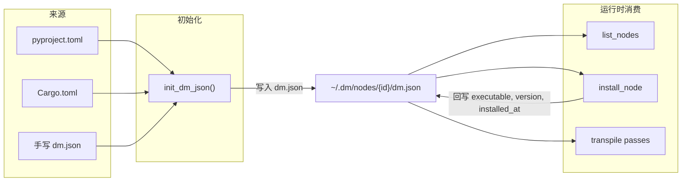
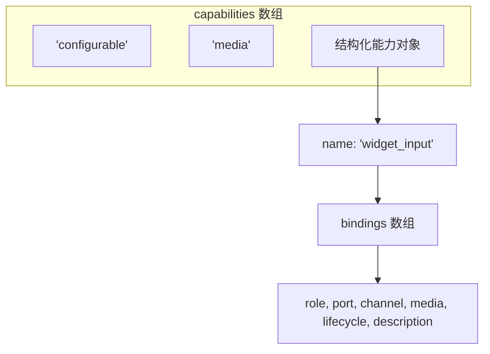
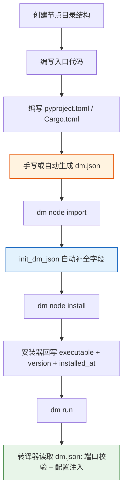
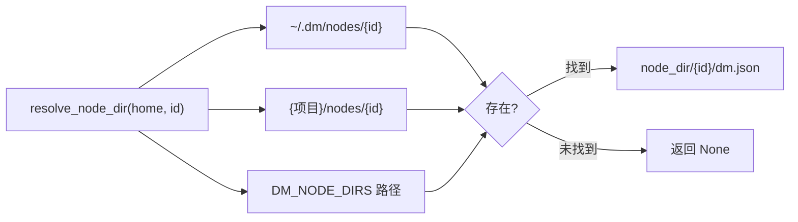

**dm.json** 是 Dora Manager 节点的**单一事实来源**——每个节点目录中必须包含此 JSON 文件，系统通过它完成节点发现、元数据加载、端口校验、配置注入与安装编排的全部生命周期管理。本文档从 Rust 源码中的类型定义出发，逐字段给出精确的语义、默认值策略与自动推断规则，帮助你从零构建一个符合规范的 dm.json。

Sources: [model.rs](https://github.com/l1veIn/dora-manager/blob/main/crates/dm-core/src/node/model.rs#L217-L288), [mod.rs](https://github.com/l1veIn/dora-manager/blob/main/crates/dm-core/src/node/mod.rs)

## dm.json 在系统中的角色

dm.json 不仅仅是一个静态描述文件——它在三个关键阶段被读取和写入：

1. **导入/创建阶段**：`dm node import` 时，`init_dm_json` 函数自动从 `pyproject.toml` / `Cargo.toml` 推断元数据并生成 dm.json。如果 dm.json 已存在，则直接反序列化并更新 `id` 字段。
2. **安装阶段**：`dm node install` 执行构建命令后，会回写 `executable`、`version`、`installed_at` 字段到 dm.json。
3. **转译阶段**：数据流 YAML 被转译为 Dora 原生格式时，转译器读取 dm.json 中的 `ports[].schema` 进行端口兼容性校验，读取 `config_schema` 进行环境变量注入。



Sources: [init.rs](https://github.com/l1veIn/dora-manager/blob/main/crates/dm-core/src/node/init.rs#L21-L112), [install.rs](https://github.com/l1veIn/dora-manager/blob/main/crates/dm-core/src/node/install.rs#L11-L75), [local.rs](https://github.com/l1veIn/dora-manager/blob/main/crates/dm-core/src/node/local.rs)

## 顶层字段全览

`Node` 结构体是 dm.json 的 Rust 投影。以下表格列出所有字段，其中"必填"基于 `serde` 的默认值策略判定——实际上所有字段都有默认值，一个合法的 dm.json 可以极其精简。

| 字段 | 类型 | 必填 | 默认值 | 语义 |
|------|------|------|--------|------|
| `id` | `string` | ✅ | — | 节点唯一标识符，必须与目录名一致 |
| `name` | `string` | — | `""` | 人类可读的显示名称 |
| `version` | `string` | ✅ | `""` | 语义化版本号 |
| `installed_at` | `string` | ✅ | `""` | Unix 时间戳（秒），安装时自动写入 |
| `source` | `object` | ✅ | — | 构建来源信息，含 `build` 与可选 `github` |
| `description` | `string` | — | `""` | 节点功能的简要描述 |
| `executable` | `string` | — | `""` | 相对于节点目录的可执行文件路径 |
| `repository` | `object?` | — | `null` | 源码仓库元数据 |
| `maintainers` | `array` | — | `[]` | 维护者列表 |
| `license` | `string?` | — | `null` | SPDX 许可证标识符 |
| `display` | `object` | — | `{}` | 展示元数据（分类、标签、头像） |
| `capabilities` | `array` | — | `[]` | 运行时能力声明（支持字符串标签或结构化对象） |
| `runtime` | `object` | — | `{}` | 运行时语言与平台信息 |
| `ports` | `array` | — | `[]` | 端口声明列表 |
| `files` | `object` | — | `{}` | 节点内文件索引 |
| `examples` | `array` | — | `[]` | 示例条目列表 |
| `config_schema` | `object?` | — | `null` | 配置字段定义 |
| `dynamic_ports` | `bool` | — | `false` | 是否接受 YAML 中声明的未注册端口 |

**关于 `path` 字段**：这是一个**仅运行时字段**，由 `#[serde(skip_deserializing)]` 标注，不会出现在 JSON 文件中。系统加载 dm.json 后通过 `node.with_path(node_dir)` 附加此字段。

Sources: [model.rs](https://github.com/l1veIn/dora-manager/blob/main/crates/dm-core/src/node/model.rs#L183-L247)

## source — 构建来源

```json
"source": {
  "build": "pip install -e .",
  "github": null
}
```

| 字段 | 类型 | 语义 |
|------|------|------|
| `build` | `string` | 安装命令。系统据此决定安装策略：以 `pip`/`uv` 开头走 Python venv 流程，以 `cargo` 开头走 Rust 编译流程 |
| `github` | `string?` | 可选的 GitHub 仓库 URL，在 `init_dm_json` 中从 `pyproject.toml` 的 `repository` 字段推断 |

**build 命令对安装流程的决定性影响**：安装器通过 `build_type.trim().to_lowercase()` 判断构建类型。`pip install -e .` 和 `uv pip install -e .` 触发本地 Python 安装（创建 `.venv`），`pip install {package}` 触发远程 PyPI 安装，`cargo install --path .` 触发 Rust 编译到 `bin/` 目录。其余值会报错 "Unsupported build type"。

**自动推断逻辑**：`infer_build_command` 遵循以下优先级——若存在 `pyproject.toml` 且 `build-backend` 为 `maturin`，生成 `pip install {id}`；若为普通 Python 项目，生成 `pip install -e .`；若存在 `Cargo.toml`，生成 `cargo install {id}`；最终兜底为 `pip install {id}`。

Sources: [model.rs](https://github.com/l1veIn/dora-manager/blob/main/crates/dm-core/src/node/model.rs#L6-L10), [install.rs](https://github.com/l1veIn/dora-manager/blob/main/crates/dm-core/src/node/install.rs#L29-L61), [init.rs](https://github.com/l1veIn/dora-manager/blob/main/crates/dm-core/src/node/init.rs#L230-L250)

## repository — 源码仓库

```json
"repository": {
  "url": "https://github.com/user/repo",
  "default_branch": "main",
  "reference": "v1.0.0",
  "subdir": "nodes/my-node"
}
```

| 字段 | 类型 | 默认值 | 语义 |
|------|------|--------|------|
| `url` | `string` | `""` | 仓库 URL |
| `default_branch` | `string?` | `null` | 默认分支名 |
| `reference` | `string?` | `null` | Git 引用（分支名、标签或 commit hash） |
| `subdir` | `string?` | `null` | 仓库内的子目录路径 |

**导入时的 Git 操作**：`import_git` 函数解析 GitHub URL 结构，支持 `https://github.com/{owner}/{repo}/tree/{ref}/{path}` 格式。当存在子目录路径时，系统使用 `git sparse-checkout` 仅拉取目标子目录，配合 `--depth 1 --filter=blob:none --sparse` 实现最小化克隆。

Sources: [model.rs](https://github.com/l1veIn/dora-manager/blob/main/crates/dm-core/src/node/model.rs#L13-L23), [import.rs](https://github.com/l1veIn/dora-manager/blob/main/crates/dm-core/src/node/import.rs#L86-L176)

## maintainers — 维护者

```json
"maintainers": [
  { "name": "Dora Manager", "email": "dev@example.com", "url": "https://example.com" }
]
```

| 字段 | 类型 | 默认值 | 语义 |
|------|------|--------|------|
| `name` | `string` | `""` | 维护者姓名 |
| `email` | `string?` | `null` | 联系邮箱 |
| `url` | `string?` | `null` | 个人主页 |

`init_dm_json` 从 `pyproject.toml` 的 `[project.authors]` 数组推断维护者列表，仅提取 `name` 字段。Rust 端序列化时通过 `skip_serializing_if = "Option::is_none"` 自动省略 `email` 和 `url` 的 null 值。

Sources: [model.rs](https://github.com/l1veIn/dora-manager/blob/main/crates/dm-core/src/node/model.rs#L25-L33), [init.rs](https://github.com/l1veIn/dora-manager/blob/main/crates/dm-core/src/node/init.rs#L66-L78)

## display — 展示元数据

```json
"display": {
  "category": "Builtin/Logic",
  "tags": ["logic", "bool", "and"],
  "avatar": null
}
```

| 字段 | 类型 | 默认值 | 语义 |
|------|------|--------|------|
| `category` | `string` | `""` | 分类路径（支持 `/` 分隔的层级），CLI 的 `dm node list` 用 `[category]` 格式展示 |
| `tags` | `string[]` | `[]` | 搜索标签数组 |
| `avatar` | `string?` | `null` | 节点图标路径（相对节点目录） |

项目中实际使用的分类包括 `Builtin/Logic`、`Builtin/Interaction`、`Builtin/Media`、`Builtin/Utility`、`Builtin/Storage`、`Builtin/Flow Control`、`Audio/Input`、`AI/Vision` 等。自定义节点建议沿用 `大类/子类` 的路径命名规范。

Sources: [model.rs](https://github.com/l1veIn/dora-manager/blob/main/crates/dm-core/src/node/model.rs#L35-L43)

## capabilities — 能力声明

`capabilities` 是一个混合类型数组，支持两种形态：



### 形态一：简单字符串标签

```json
"capabilities": ["configurable", "media"]
```

系统目前识别以下标签值：

| 值 | 语义 |
|----|------|
| `"configurable"` | 节点声明了 `config_schema`，支持配置面板 |
| `"media"` | 节点处理媒体流（音频/视频），被运行时用于媒体相关路由 |
| `"streaming"` | 节点涉及流式数据处理 |

### 形态二：结构化能力对象（含绑定）

```json
"capabilities": [
  "configurable",
  {
    "name": "widget_input",
    "bindings": [
      {
        "role": "widget",
        "channel": "register",
        "media": ["widgets"],
        "lifecycle": ["run_scoped", "stop_aware"],
        "description": "Registers a button widget with the DM interaction plane."
      },
      {
        "role": "widget",
        "port": "click",
        "channel": "input",
        "media": ["pulse"],
        "lifecycle": ["run_scoped", "stop_aware"],
        "description": "Emits a click pulse on the click output port."
      }
    ]
  }
]
```

每个绑定对象的字段：

| 字段 | 类型 | 语义 |
|------|------|------|
| `role` | `string` | 角色标识（如 `"widget"`、`"source"`） |
| `port` | `string?` | 关联的端口 ID |
| `channel` | `string?` | 通信通道标识（如 `"register"`、`"input"`、`"inline"`、`"artifact"`） |
| `media` | `string[]` | 媒体类型标签（如 `["widgets"]`、`["text", "json"]`、`["pulse"]`） |
| `lifecycle` | `string[]` | 生命周期约束（如 `["run_scoped", "stop_aware"]`） |
| `description` | `string?` | 绑定用途的人类可读描述 |

## runtime — 运行时信息

```json
"runtime": {
  "language": "python",
  "python": ">=3.10",
  "platforms": []
}
```

| 字段 | 类型 | 默认值 | 语义 |
|------|------|--------|------|
| `language` | `string` | `""` | `"python"`、`"rust"` 或 `"node"` |
| `python` | `string?` | `null` | Python 版本约束（如 `">=3.10"`） |
| `platforms` | `string[]` | `[]` | 支持的平台列表（目前项目中均为空数组，预留扩展） |

**自动推断**：`infer_runtime` 函数按优先级判断——存在 `pyproject.toml` 则为 `"python"`（同时提取 `requires-python`），存在 `Cargo.toml` 则为 `"rust"`，存在 `package.json` 则为 `"node"`。

Sources: [model.rs](https://github.com/l1veIn/dora-manager/blob/main/crates/dm-core/src/node/model.rs#L183-L191), [init.rs](https://github.com/l1veIn/dora-manager/blob/main/crates/dm-core/src/node/init.rs#L271-L291)

## ports — 端口声明

端口声明是 dm.json 中最结构化的部分，直接参与数据流转译阶段的**端口兼容性校验**。

```json
"ports": [
  {
    "id": "audio",
    "name": "audio",
    "direction": "output",
    "description": "Continuous audio stream (Float32 PCM)",
    "required": true,
    "multiple": false,
    "schema": {
      "title": "PCM Audio Chunk",
      "description": "Float32 PCM audio samples",
      "type": { "name": "floatingpoint", "precision": "SINGLE" }
    }
  }
]
```

| 字段 | 类型 | 默认值 | 语义 |
|------|------|--------|------|
| `id` | `string` | `""` | 端口标识符，必须与 YAML 中 `inputs`/`outputs` 的 key 匹配 |
| `name` | `string` | `""` | 人类可读的端口名称 |
| `direction` | `"input"` \| `"output"` | `"input"` | 数据流方向 |
| `description` | `string` | `""` | 端口用途说明 |
| `required` | `bool` | `true` | 是否为必需端口 |
| `multiple` | `bool` | `false` | 是否接受多条连接 |
| `schema` | `object?` | `null` | 端口数据 schema（详见下节） |

**direction 的序列化格式**：Rust 枚举 `NodePortDirection` 使用 `#[serde(rename_all = "snake_case")]`，因此 JSON 中写作 `"input"` 或 `"output"`。

**端口在转译中的作用**：当数据流 YAML 连接两个 managed 节点时，转译器会在双方 dm.json 的 `ports` 中查找对应 `id`。若**两端都声明了 `schema`**，则执行 Arrow 类型兼容性校验。若任一方缺少 `schema`，校验被静默跳过。当 `dynamic_ports` 为 `true` 时，未在 `ports` 中注册的端口也会被静默跳过。

Sources: [model.rs](https://github.com/l1veIn/dora-manager/blob/main/crates/dm-core/src/node/model.rs#L156-L181), [passes.rs](https://github.com/l1veIn/dora-manager/blob/main/crates/dm-core/src/dataflow/transpile/passes.rs#L182-L209)

### schema — 端口数据类型（Arrow Type System）

端口的 `schema` 字段遵循 **DM Port Schema** 规范，基于 Apache Arrow 类型系统声明数据契约。完整的 Port Schema 结构如下：

```json
{
  "$id": "dm-schema://audio-pcm",
  "title": "PCM Audio Chunk",
  "description": "Float32 PCM audio samples",
  "type": { "name": "floatingpoint", "precision": "SINGLE" },
  "nullable": false,
  "items": { },
  "properties": { },
  "required": [],
  "metadata": {}
}
```

| 字段 | 类型 | 语义 |
|------|------|------|
| `$id` | `string?` | Schema 唯一标识符（URI 格式），如 `"dm-schema://audio-pcm"` |
| `title` | `string?` | 短名称 |
| `description` | `string?` | 详细描述 |
| `type` | `object` | **必填**。Arrow 类型声明，结构因类型而异 |
| `nullable` | `bool` | 默认 `false`，值是否可为 null |
| `items` | `object?` | 列表类型的元素 schema（递归） |
| `properties` | `object?` | struct 类型的子字段（递归 map） |
| `required` | `string[]?` | struct 类型的必填字段名列表 |
| `metadata` | `any?` | 自由格式的附加注解 |

`schema` 也可以使用 `$ref` 引用外部文件：`{ "$ref": "schemas/audio.json" }`。解析器会相对于节点目录加载引用文件。

Sources: [schema/model.rs](https://github.com/l1veIn/dora-manager/blob/main/crates/dm-core/src/node/schema/model.rs#L158-L184), [parse.rs](https://github.com/l1veIn/dora-manager/blob/main/crates/dm-core/src/node/schema/parse.rs#L15-L97)

#### Arrow 类型速查表

`type` 字段的 `name` 决定了类型的解析方式。以下是所有支持的 Arrow 类型及其所需的附加字段：

| `type.name` | 附加字段 | 示例 | 常见用途 |
|-------------|---------|------|---------|
| `"null"` | 无 | `{"name": "null"}` | 触发信号、心跳 |
| `"bool"` | 无 | `{"name": "bool"}` | 布尔控制 |
| `"int"` | `bitWidth`, `isSigned` | `{"name": "int", "bitWidth": 8, "isSigned": false}` | 图像字节 (uint8)、整数 |
| `"floatingpoint"` | `precision` | `{"name": "floatingpoint", "precision": "SINGLE"}` | PCM 音频 (float32)、数值 |
| `"utf8"` | 无 | `{"name": "utf8"}` | 文本、JSON 编码数据 |
| `"largeutf8"` | 无 | `{"name": "largeutf8"}` | 大文本 |
| `"binary"` | 无 | `{"name": "binary"}` | 二进制数据块 |
| `"largebinary"` | 无 | `{"name": "largebinary"}` | 大二进制数据 |
| `"fixedsizebinary"` | `byteWidth` | `{"name": "fixedsizebinary", "byteWidth": 16}` | 固定长度二进制 |
| `"date"` | `unit` | `{"name": "date", "unit": "DAY"}` | 日期 |
| `"time"` | `unit`, `bitWidth` | `{"name": "time", "unit": "MICROSECOND", "bitWidth": 64}` | 时间 |
| `"timestamp"` | `unit`, `timezone?` | `{"name": "timestamp", "unit": "MICROSECOND", "timezone": "UTC"}` | 时间戳 |
| `"duration"` | `unit` | `{"name": "duration", "unit": "SECOND"}` | 时间段 |
| `"list"` | 无 + `items` | `{"name": "list"}` | 变长列表 |
| `"largelist"` | 无 + `items` | `{"name": "largelist"}` | 大变长列表 |
| `"fixedsizelist"` | `listSize` + `items` | `{"name": "fixedsizelist", "listSize": 1600}` | 固定长度列表（如音频帧） |
| `"struct"` | 无 + `properties` | `{"name": "struct"}` | 结构化记录 |
| `"map"` | `keysSorted` | `{"name": "map", "keysSorted": true}` | 键值映射 |

**precision 枚举值**：`"HALF"`（float16）、`"SINGLE"`（float32）、`"DOUBLE"`（float64）。**unit 枚举值**：`"SECOND"`、`"MILLISECOND"`、`"MICROSECOND"`、`"NANOSECOND"`。

Sources: [schema/parse.rs](https://github.com/l1veIn/dora-manager/blob/main/crates/dm-core/src/node/schema/parse.rs#L103-L256), [schema/model.rs](https://github.com/l1veIn/dora-manager/blob/main/crates/dm-core/src/node/schema/model.rs#L67-L152)

#### 端口兼容性校验规则

当两个 managed 节点通过数据流连接时，转译器调用 `check_compatibility(output_schema, input_schema)` 执行**子类型**语义检查。核心规则如下：

| 规则 | 说明 |
|------|------|
| 精确匹配 | 同类型始终兼容 |
| 整数安全拓宽 | `int32 → int64` 允许，`int64 → int32` 拒绝，符号必须一致 |
| 浮点安全拓宽 | `float32 → float64` 允许，反向拒绝 |
| utf8 → largeutf8 | 小文本到大文本安全 |
| binary → largebinary | 小二进制到大二进制安全 |
| fixedsizelist → list / largelist | 固定列表是变长列表的子类型 |
| list → largelist | 变长列表到大变长列表安全 |
| struct 字段覆盖 | output struct 必须包含 input struct 的所有 `required` 字段 |

不兼容的连接会生成 `TranspileDiagnostic`，但不会阻断转译流程（属于诊断警告而非硬错误）。

Sources: [schema/compat.rs](https://github.com/l1veIn/dora-manager/blob/main/crates/dm-core/src/node/schema/compat.rs#L91-L195)

## files — 文件索引

```json
"files": {
  "readme": "README.md",
  "entry": "dm_and/main.py",
  "config": "config.json",
  "tests": ["tests", "tests/test_basic.py"],
  "examples": []
}
```

| 字段 | 类型 | 默认值 | 语义 |
|------|------|--------|------|
| `readme` | `string` | `"README.md"` | README 文件相对路径 |
| `entry` | `string?` | `null` | 入口文件路径 |
| `config` | `string?` | `null` | 配置文件路径（config.json / config.toml / config.yaml） |
| `tests` | `string[]` | `[]` | 测试文件或目录列表 |
| `examples` | `string[]` | `[]` | 示例文件或目录列表 |

**入口文件推断**：Python 项目按 `{module}/main.py` → `src/{module}/main.py` → `main.py` 顺序探测（`module` 为 id 中 `-` 替换为 `_` 后的结果）；Rust 项目按 `src/main.rs` → `main.rs` 探测；Node 项目检查 `index.js`。配置文件按 `config.json` → `config.toml` → `config.yaml` → `config.yml` 顺序探测。

Sources: [model.rs](https://github.com/l1veIn/dora-manager/blob/main/crates/dm-core/src/node/model.rs#L193-L205), [init.rs](https://github.com/l1veIn/dora-manager/blob/main/crates/dm-core/src/node/init.rs#L293-L338)

## config_schema — 配置字段定义

`config_schema` 是一个自由格式的 JSON 对象，每个 key 对应一个配置项。这是**声明式配置**系统的核心，转译器在配置合并 Pass 中读取此字段，按优先级 `inline_config > config.json 持久化值 > default` 解析后注入到环境变量中。

```json
"config_schema": {
  "sample_rate": {
    "default": 16000,
    "description": "Audio sample rate in Hz",
    "env": "SAMPLE_RATE",
    "x-widget": {
      "type": "select",
      "options": [8000, 16000, 24000, 44100, 48000]
    }
  }
}
```

每个配置项的字段：

| 字段 | 类型 | 语义 |
|------|------|------|
| `default` | `any` | 默认值。不存在时环境变量不会被设置 |
| `description` | `string?` | 配置项的人类可读描述 |
| `env` | `string?` | 映射到的环境变量名。**只有声明了 `env` 的配置项会被注入到运行时环境** |
| `x-widget` | `object?` | 前端 UI 控件提示（详见下节） |

**环境变量注入流程**：转译器遍历 `config_schema` 中每个 key，读取其 `env` 字段作为环境变量名，然后按 `inline_config → config.json 持久化值 → default` 的优先级链查找值。若值为字符串则直接使用，否则调用 `.to_string()` 转换后写入 `merged_env`。值为 `null` 时跳过。

Sources: [model.rs](https://github.com/l1veIn/dora-manager/blob/main/crates/dm-core/src/node/model.rs#L274-L275), [passes.rs](https://github.com/l1veIn/dora-manager/blob/main/crates/dm-core/src/dataflow/transpile/passes.rs#L392-L419)

### x-widget — 前端控件提示

`x-widget` 是 `config_schema` 条目中的扩展字段，告诉前端节点详情页应该使用哪种 UI 控件渲染该配置项。前端 `SettingsTab.svelte` 直接读取 `s?.["x-widget"]?.type` 来决定渲染逻辑。

| `type` 值 | 附加字段 | 渲染为 | 示例 |
|-----------|---------|--------|------|
| `"select"` | `options: (string\|number)[]` | 下拉选择框 | `{"type": "select", "options": ["jpeg", "rgb8", "rgba8"]}` |
| `"slider"` | `min`, `max`, `step` | 滑动条 | `{"type": "slider", "min": 0, "max": 100, "step": 1}` |
| `"switch"` | 无 | 开关 | `{"type": "switch"}` |
| `"radio"` | `options` | 单选按钮组 | `{"type": "radio", "options": ["a", "b"]}` |
| `"checkbox"` | `options` | 多选复选框 | `{"type": "checkbox", "options": ["x", "y"]}` |
| `"file"` | 无 | 文件选择器 | `{"type": "file"}` |
| `"directory"` | 无 | 目录选择器 | `{"type": "directory"}` |

**无 x-widget 时的自动推断**：前端根据值的类型自动推断——字符串渲染为文本输入框（`<Input>`），数字渲染为数字输入框，布尔值渲染为开关，其余类型渲染为等宽字体的文本域（`<Textarea>`），尝试 JSON 解析输入值。

Sources: [SettingsTab.svelte](https://github.com/l1veIn/dora-manager/blob/main/web/src/routes/nodes/[id]/components/SettingsTab.svelte#L73-L244)

## dynamic_ports — 动态端口开关

```json
"dynamic_ports": false
```

当设为 `true` 时，数据流转译器**跳过** YAML 中声明的、但未在 `ports` 数组中注册的端口的校验。转译器查找端口时，如果未在 dm.json 的 `ports` 中找到匹配 ID 且 `dynamic_ports` 为 `true`，则静默跳过；否则若端口未注册且 `dynamic_ports` 为 `false`，也会跳过（但不会匹配 schema）。这对于需要根据用户配置动态创建端口的通用转发节点至关重要。

Sources: [model.rs](https://github.com/l1veIn/dora-manager/blob/main/crates/dm-core/src/node/model.rs#L277-L280), [passes.rs](https://github.com/l1veIn/dora-manager/blob/main/crates/dm-core/src/dataflow/transpile/passes.rs#L191-L197)

## 从零开发一个自定义节点：完整工作流

以下流程图展示了从空白目录到一个可运行的 managed 节点的完整路径：



### 步骤一：创建目录结构

以一个 Python 节点 `my-upper` 为例，标准目录结构如下：

```
my-upper/
├── pyproject.toml
├── dm.json              ← 可选手写，import 时自动推断
├── my_upper/
│   └── main.py          ← 入口文件
└── README.md
```

Sources: [init.rs (infer_files)](https://github.com/l1veIn/dora-manager/blob/main/crates/dm-core/src/node/init.rs#L293-L338)

### 步骤二：编写 pyproject.toml

```toml
[project]
name = "my-upper"
version = "0.1.0"
description = "Converts input text to uppercase"
requires-python = ">=3.10"
authors = [
    { name = "Your Name" }
]
```

`init_dm_json` 会自动读取 `name`、`version`、`description`、`requires-python`、`authors` 和 `license` 字段。

Sources: [init.rs (parse_pyproject)](https://github.com/l1veIn/dora-manager/blob/main/crates/dm-core/src/node/init.rs#L175-L193)

### 步骤三：手写最小 dm.json

如果你希望手动指定端口和配置（推荐），可以在目录中预置 dm.json：

```json
{
  "id": "my-upper",
  "version": "0.1.0",
  "installed_at": "",
  "source": { "build": "pip install -e ." },
  "description": "Converts input text to uppercase.",
  "ports": [
    {
      "id": "text_in",
      "direction": "input",
      "description": "Input text to transform",
      "required": true,
      "schema": { "type": { "name": "utf8" } }
    },
    {
      "id": "text_out",
      "direction": "output",
      "description": "Uppercased text",
      "required": true,
      "schema": { "type": { "name": "utf8" } }
    }
  ],
  "config_schema": {
    "prefix": {
      "default": "",
      "description": "Optional prefix added to output",
      "env": "PREFIX"
    }
  }
}
```

注意 `installed_at` 留空——安装时会自动回写。

### 步骤四：导入与安装

```bash
dm node import ./my-upper     # 导入到 ~/.dm/nodes/my-upper
dm node install my-upper       # 安装（创建 .venv，安装依赖，回写 dm.json）
```

安装完成后，dm.json 的 `executable` 字段被回写为 `.venv/bin/my-upper`（macOS/Linux）或 `.venv/Scripts/my-upper.exe`（Windows），`installed_at` 被设置为当前 Unix 时间戳。

Sources: [install.rs](https://github.com/l1veIn/dora-manager/blob/main/crates/dm-core/src/node/install.rs#L11-L75), [install.rs (executable)](https://github.com/l1veIn/dora-manager/blob/main/crates/dm-core/src/node/install.rs#L39-L58)

### 步骤五：在数据流中使用

```yaml
nodes:
  - id: producer
    build: pip install -e .
    path: producer
    outputs:
      - text_out
  - id: upper
    node_id: my-upper          # 引用 managed 节点
    inputs:
      text_in: producer/text_out
```

转译器在处理此 YAML 时会查找 `~/.dm/nodes/my-upper/dm.json`，执行端口 schema 兼容性校验（`utf8 → utf8`，精确匹配，通过），并将 `config_schema` 中声明了 `env` 的配置项注入到环境变量。

Sources: [passes.rs](https://github.com/l1veIn/dora-manager/blob/main/crates/dm-core/src/dataflow/transpile/passes.rs#L170-L260)

## 字段自动推断规则汇总

`init_dm_json` 的核心设计哲学是**零配置优先**——开发者无需手写 dm.json 中的大部分字段，系统会从标准项目文件中自动推断。

| dm.json 字段 | 推断来源 | 优先级 |
|-------------|---------|--------|
| `id` | 目录名 | 固定 |
| `name` | `pyproject.toml` `[project.name]` / `Cargo.toml` `[package.name]` / 目录名 | pyproject > cargo > fallback |
| `version` | `pyproject.toml` `[project.version]` / `Cargo.toml` `[package.version]` | pyproject > cargo > fallback |
| `description` | CLI 参数 / `pyproject.toml` `[project.description]` / `Cargo.toml` `[package.description]` | hints > pyproject > cargo |
| `source.build` | 按 `build-backend` / 文件类型推断 | 详见 `infer_build_command` |
| `repository` | `pyproject.toml` `[project.urls.Repository]` | 仅 pyproject |
| `maintainers` | `pyproject.toml` `[project.authors]` | 仅 pyproject |
| `license` | `pyproject.toml` `[project.license]` / `Cargo.toml` `[package.license]` | pyproject > cargo |
| `runtime.language` | 文件存在性探测：pyproject.toml → python, Cargo.toml → rust, package.json → node | 按优先级 |
| `runtime.python` | `pyproject.toml` `[project.requires-python]` | 仅 pyproject |
| `files.readme` | 文件探测 `README.md` | 默认 `"README.md"` |
| `files.entry` | 路径探测（Python/Rust/Node 各有候选列表） | 按候选顺序 |
| `files.config` | 文件探测 `config.json` → `config.toml` → `config.yaml` → `config.yml` | 按顺序 |
| `files.tests` | 目录中含 `test`/`tests` 的文件和目录 | 自动收集 |
| `files.examples` | 目录中含 `example`/`examples`/`demo` 的文件和目录 | 自动收集 |

Sources: [init.rs](https://github.com/l1veIn/dora-manager/blob/main/crates/dm-core/src/node/init.rs#L21-L362)

## 常见陷阱与最佳实践

**1. `id` 必须匹配目录名**：`init_dm_json` 在加载已有 dm.json 时会强制覆盖 `id` 为目录名。手动编辑时务必保持一致。

**2. `source.build` 决定安装路径**：写错 build 命令会导致安装失败。Python 节点必须以 `pip` 或 `uv` 开头，Rust 节点必须以 `cargo` 开头。`cargo install --path .` 是 Rust 本地开发的标准写法。

**3. `config_schema` 中只有声明了 `env` 的条目会被注入**：如果你希望配置项在运行时可用，务必提供 `env` 字段名，否则转译器在遍历时跳过该条目。

**4. 端口 schema 缺失不会报错但会跳过校验**：转译器在端口两端都声明了 schema 时才执行兼容性检查。如果你的节点需要类型安全，务必为每个端口提供 `schema`。

**5. `executable` 在安装后被回写**：Python 节点变为 `.venv/bin/{id}`（macOS/Linux）或 `.venv/Scripts/{id}.exe`（Windows），Rust 节点变为 `bin/dora-{id}` 或 `bin/{id}`（若 id 已以 `dora-` 开头则不加前缀）。安装前此字段为空字符串。

**6. 结构化 capabilities 的 `name` 是分组键**：多个 binding 对象通过同一个 `name` 值归属于同一个能力家族。转译器按 `name` 分组后传递给交互系统。

Sources: [init.rs](https://github.com/l1veIn/dora-manager/blob/main/crates/dm-core/src/node/init.rs#L31-L32), [install.rs](https://github.com/l1veIn/dora-manager/blob/main/crates/dm-core/src/node/install.rs#L29-L58), [passes.rs](https://github.com/l1veIn/dora-manager/blob/main/crates/dm-core/src/dataflow/transpile/passes.rs#L392-L419)

## 节点路径解析机制

系统通过多级路径搜索定位节点目录和 dm.json 文件。`resolve_node_dir` 函数按以下顺序搜索：

1. `~/.dm/nodes/{id}/` — 用户安装目录（最高优先级）
2. `{项目根}/nodes/{id}/` — 内置节点目录
3. `DM_NODE_DIRS` 环境变量指定的额外目录



这意味着内置节点（如 `nodes/dm-and/`）在未安装到 `~/.dm/nodes/` 的情况下也能被系统发现。

Sources: [paths.rs](https://github.com/l1veIn/dora-manager/blob/main/crates/dm-core/src/node/paths.rs#L11-L42)

---

**下一步阅读**：若需深入了解端口类型校验的数学基础与兼容性算法，请参阅 [Port Schema 与端口类型校验](8-port-schema-yu-duan-kou-lei-xing-xiao-yan)；若需了解 dm.json 如何参与数据流转译的完整多 Pass 管线，请参阅 [数据流转译器（Transpiler）：多 Pass 管线与四层配置合并](11-shu-ju-liu-zhuan-yi-qi-transpiler-duo-pass-guan-xian-yu-si-ceng-pei-zhi-he-bing)；若需查看内置节点的 dm.json 实例，请参阅 [内置节点总览：从媒体采集到 AI 推理](7-nei-zhi-jie-dian-zong-lan-cong-mei-ti-cai-ji-dao-ai-tui-li)。