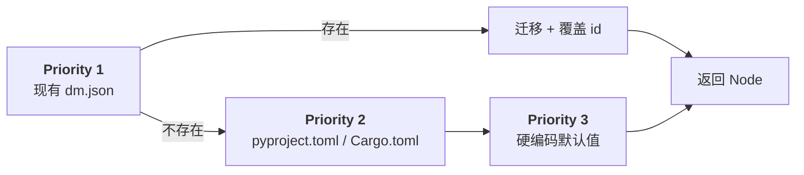
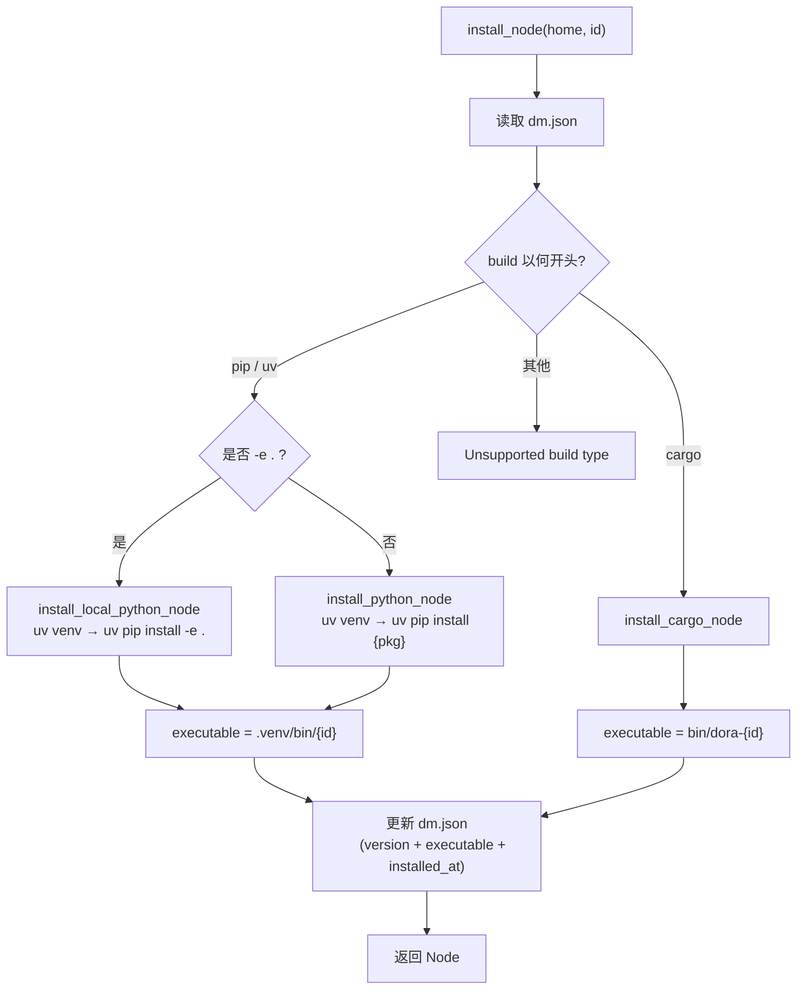
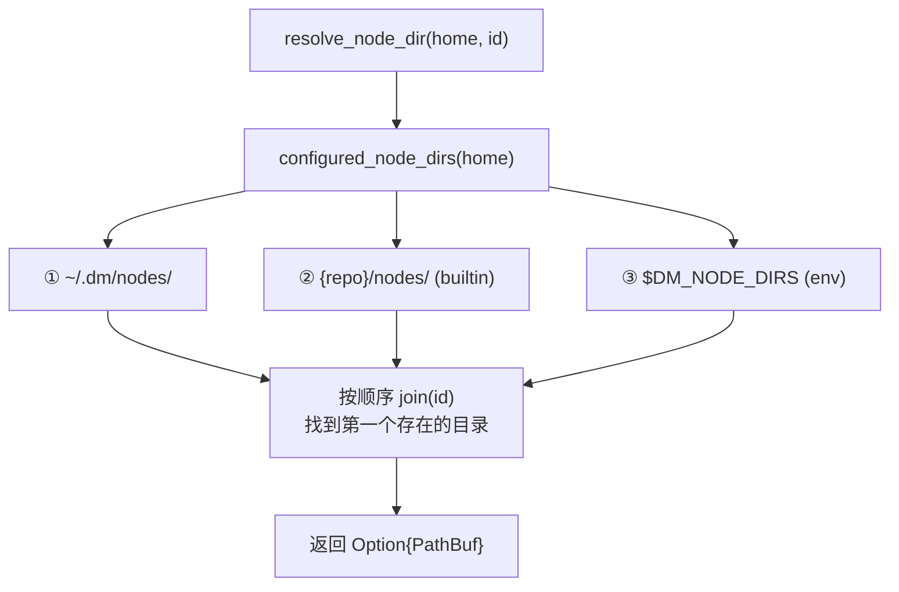

Dora Manager 的节点系统构建在一条清晰的原则之上：**每个节点都是一个自包含的目录，以 `dm.json` 作为唯一元数据契约**。本文深入解析节点从「被发现」到「被执行」的完整生命周期——涵盖安装（pip/uv/cargo）、导入（本地/GitHub）、多目录路径解析、以及基于 per-node 隔离的沙箱机制。理解这些机制，是掌握 [数据流转译器：多 Pass 管线与四层配置合并](08-transpiler) 中 `node: → path:` 转换的关键前提。

Sources: [mod.rs](https://github.com/l1veIn/dora-manager/blob/master/crates/dm-core/src/node/mod.rs#L1-L34), [model.rs](https://github.com/l1veIn/dora-manager/blob/master/crates/dm-core/src/node/model.rs#L105-L168)

## Node 模型：dm.json 契约

`dm.json` 是节点的**唯一真相源**（single source of truth）。它持久化于节点目录根下，由 `Node` 结构体精确映射，既序列化到磁盘，也通过 HTTP API 直接返回给前端。

`Node` 的核心字段分为以下几组：

| 字段组 | 关键字段 | 用途 |
|--------|----------|------|
| **标识** | `id`, `name`, `version` | 节点全局唯一 ID、可读名称、语义版本 |
| **来源** | `source.build`, `source.github` | 构建命令（如 `pip install -e .`）与 GitHub 仓库地址 |
| **运行时** | `executable`, `runtime.language` | 安装后可执行文件的相对路径与语言标记 |
| **契约** | `ports[]`, `config_schema`, `dynamic_ports` | 端口声明、配置 schema、是否允许动态端口 |
| **展示** | `display.category`, `display.tags`, `maintainers[]` | 前端分类展示、标签、维护者信息 |
| **文件索引** | `files.readme`, `files.entry`, `files.tests` | 关键文件的相对路径，用于浏览器查看 |
| **运行时路径** | `path` (skip_deserializing) | 不存储在 JSON 中，加载时动态填充 |

一个典型的已安装 Python 节点 `dm-log` 的 `dm.json` 片段如下——注意 `executable` 指向节点私有 `.venv` 中的二进制入口：

```json
{
  "id": "dm-log",
  "version": "0.1.0",
  "source": { "build": "pip install -e ." },
  "executable": ".venv/bin/dm-log",
  "runtime": { "language": "python", "python": ">=3.10" }
}
```

而对于 Rust 节点 `dm-queue`，`executable` 指向 `bin/dora-dm-queue`，`source.build` 为 `cargo install --path .`。两种语言采用不同的沙箱目录布局，但统一由同一套路径解析管线消费。

Sources: [model.rs](https://github.com/l1veIn/dora-manager/blob/master/crates/dm-core/src/node/model.rs#L44-L168), [dm-log/dm.json](https://github.com/l1veIn/dora-manager/blob/master/nodes/dm-log/dm.json#L1-L103), [dm-queue/dm.json](https://github.com/l1veIn/dora-manager/blob/master/nodes/dm-queue/dm.json#L1-L154)

## 节点的四种来源与对应操作

节点进入 Dora Manager 管辖范围有四条路径，每条对应独立的上游 API 和 CLI 子命令：

```mermaid
flowchart TD
    A[节点来源] --> B["`**create**`
    脚手架新建
    `dm node create``"]
    A --> C["`**import_local**
    复制本地目录
    `dm node import ./path``"]
    A --> D["`**import_git**
    克隆 GitHub 仓库
    `dm node import https://...``"]
    A --> E["`**builtin**
    仓库自带节点
    自动发现`"]
    B --> F["~/.dm/nodes/{id}/"]
    C --> F
    D --> F
    E --> G["{repo}/nodes/{id}/"]
    F --> H["init_dm_json
    生成/迁移 dm.json"]
    G --> H
    H --> I["install_node
    构建可执行文件"]
```

### create：脚手架创建

`create_node` 为指定 ID 生成一个完整的 Python 节点骨架，包含 `pyproject.toml`（含 `dora-rs` 依赖）、`{module}/main.py`（含输入处理模板）、`README.md`，然后调用 `init_dm_json` 生成 `dm.json`。脚手架使用 `pip install -e .` 作为构建命令，表示「可编辑安装」模式。

Sources: [local.rs](https://github.com/l1veIn/dora-manager/blob/master/crates/dm-core/src/node/local.rs#L13-L86)

### import_local：本地目录导入

`import_local` 将源目录的全部内容（`content_only` 模式）复制到 `~/.dm/nodes/{id}/`，然后执行 `init_dm_json`。此操作具有两个安全检查：目标目录不能已存在（防覆盖）、源目录必须有效。

Sources: [import.rs](https://github.com/l1veIn/dora-manager/blob/master/crates/dm-core/src/node/import.rs#L21-L55)

### import_git：GitHub 仓库克隆

`import_git` 支持从任意 GitHub URL 克隆节点代码。它具备精巧的 **sparse-checkout** 能力——当 URL 包含子目录路径（如 `https://github.com/org/repo/tree/main/nodes/demo`）时，只克隆指定子目录而非整个仓库。

URL 解析逻辑 `parse_github_source` 将 GitHub URL 拆解为三个组成部分：

| URL 组成 | 示例 | 提取结果 |
|----------|------|----------|
| `https://github.com/acme/project` | 仓库根 | `repo_url=acme/project.git`, 无 ref/path |
| `.../tree/release-1/examples/demo` | 分支+子目录 | `git_ref=release-1`, `repo_path=examples/demo` |
| `.../blob/main/README.md` | 文件视图 | 解析同上，但稀疏检出文件级路径 |

克隆策略使用 `--depth 1 --filter=blob:none --sparse` 实现最小化下载。如果克隆失败，已创建的目标目录会被自动清理（rollback on error）。

Sources: [import.rs](https://github.com/l1veIn/dora-manager/blob/master/crates/dm-core/src/node/import.rs#L58-L206)

### builtin：内置节点自动发现

项目仓库根目录下的 `nodes/` 目录包含内置节点（如 `dm-mjpeg`、`dm-queue`），这些节点无需显式导入。`paths.rs` 中的 `builtin_nodes_dir()` 通过 `CARGO_MANIFEST_DIR` 相对路径定位到 `{repo}/nodes/`，在路径解析链中作为后备搜索目录。

Sources: [paths.rs](https://github.com/l1veIn/dora-manager/blob/master/crates/dm-core/src/node/paths.rs#L7-L9)

## init_dm_json：元数据初始化的优先级链

所有四条来源路径最终都汇聚到 `init_dm_json`——它是 `dm.json` 的「初始化器」。该函数实现了一条**三级优先级链**来填充节点元数据：



具体地，当 `dm.json` 不存在时，每个字段的填充逻辑为：

| 字段 | pyproject.toml 来源 | Cargo.toml 来源 | 默认值 |
|------|---------------------|-----------------|--------|
| `name` | `project.name` | `package.name` | 目录 ID |
| `version` | `project.version` | `package.version` | 空字符串 |
| `description` | `project.description` 或 hints | `package.description` | 空字符串 |
| `source.build` | `maturin` 后端 → `pip install {id}`；否则 → `pip install -e .` | — | `cargo install {id}` |
| `runtime.language` | `"python"` | `"rust"` | `package.json` 存在 → `"node"`，否则空 |
| `files.entry` | `{module}/main.py` → `src/{module}/main.py` → `main.py` | `src/main.rs` → `main.rs` | `None` |

**构建命令推断** (`infer_build_command`) 特别值得关注：当 `pyproject.toml` 的 `build-system.build-backend` 为 `maturin` 时，系统推断这是一个 Rust/Python 混合项目，无法本地编译，因此使用 `pip install {id}`（从 PyPI 下载预编译 wheel）。对于纯 Python 项目则使用 `pip install -e .`（可编辑安装）。

Sources: [init.rs](https://github.com/l1veIn/dora-manager/blob/master/crates/dm-core/src/node/init.rs#L21-L112), [init.rs](https://github.com/l1veIn/dora-manager/blob/master/crates/dm-core/src/node/init.rs#L228-L248), [init.rs](https://github.com/l1veIn/dora-manager/blob/master/crates/dm-core/src/node/init.rs#L269-L289), [init.rs](https://github.com/l1veIn/dora-manager/blob/master/crates/dm-core/src/node/init.rs#L291-L336)

## 节点安装：双语言构建管线

`install_node` 根据 `dm.json` 中 `source.build` 字段的首个关键字分派到不同的安装路径：



### Python 安装沙箱

Python 节点的核心隔离策略是 **per-node `.venv`**。每个节点在 `{node_dir}/.venv/` 下拥有独立的虚拟环境，互不干扰。安装流程为：

1. **清理旧 venv**：如果 `.venv` 已存在，先删除以避免 `uv venv` 的交互式提示
2. **创建 venv**：优先使用 `uv venv`（更快的 Rust 实现），回退到 `python3 -m venv`
3. **安装依赖**：本地模式用 `uv pip install -e .`，包模式用 `uv pip install {package_spec}`
4. **提取版本**：通过 `importlib.metadata.version()` 从已安装包中读取真实版本号

安装完成后，`executable` 被设置为 `.venv/bin/{id}`（Unix）或 `.venv/Scripts/{id}.exe`（Windows），指向 venv 中由 `pyproject.toml` 的 `[project.scripts]` 声明的入口点。

### Rust 安装沙箱

Rust 节点使用 `cargo install --root {node_dir}` 将编译产物输出到节点目录下的 `bin/`。对于本地源码节点（`build` 包含 `--path .`），在节点目录内执行 `cargo install --path .`；否则从 crates.io 安装 `dora-{id}` 包。

可执行文件命名为 `bin/dora-{id}`（为非 `dora-` 前缀的 ID 自动补齐），确保与 dora 生态的命名约定一致。

Sources: [install.rs](https://github.com/l1veIn/dora-manager/blob/master/crates/dm-core/src/node/install.rs#L11-L75), [install.rs](https://github.com/l1veIn/dora-manager/blob/master/crates/dm-core/src/node/install.rs#L77-L133), [install.rs](https://github.com/l1veIn/dora-manager/blob/master/crates/dm-core/src/node/install.rs#L135-L194), [install.rs](https://github.com/l1veIn/dora-manager/blob/master/crates/dm-core/src/node/install.rs#L235-L274)

## 多目录路径解析

节点路径解析是连接「节点管理」和「数据流执行」的桥梁。`resolve_node_dir` 实现了一条**有序搜索链**，在多个候选目录中查找节点：



搜索链由 `configured_node_dirs` 构建，包含三个层级：

| 优先级 | 目录 | 说明 |
|--------|------|------|
| 1 | `~/.dm/nodes/` | 用户安装/导入的节点（可写，可卸载） |
| 2 | `{repo}/nodes/` | 仓库内置节点（只读，不可通过 `uninstall` 删除） |
| 3 | `$DM_NODE_DIRS` | 环境变量指定的额外搜索路径（支持多目录，系统路径分隔符分隔） |

`push_unique` 辅助函数确保同一绝对路径不会重复出现。`resolve_dm_json_path` 在 `resolve_node_dir` 的基础上追加 `dm.json`，而 `is_managed_node` 仅检查第一层级（`~/.dm/nodes/{id}/`），用于区分「可卸载节点」和「内置节点」。

`list_nodes` 使用 `BTreeSet` 实现去重——当多个搜索目录包含同名节点时，只有第一个出现的被采纳。这保证了优先级语义：用户安装的节点可以「遮蔽」同名内置节点。

Sources: [paths.rs](https://github.com/l1veIn/dora-manager/blob/master/crates/dm-core/src/node/paths.rs#L1-L53), [local.rs](https://github.com/l1veIn/dora-manager/blob/master/crates/dm-core/src/node/local.rs#L88-L136), [local.rs](https://github.com/l1veIn/dora-manager/blob/master/crates/dm-core/src/node/local.rs#L138-L163)

## 文件访问安全：路径遍历防护

节点支持通过 API 浏览其目录内的文件（文件树 + 文件内容），这引入了路径遍历攻击的风险。`resolve_safe_node_file` 实现了两层防护：

**第一层：组件白名单**。遍历请求路径的每个 `Component`，只允许 `Normal`（普通文件名）和 `CurDir`（`.`），一旦遇到 `ParentDir`（`..`）、`RootDir`（`/`）或 `Prefix`（Windows 盘符），立即拒绝。

**第二层：规范化校验**。在 `root.join(requested)` 后对结果调用 `canonicalize()`，然后验证规范化后的路径是否仍以节点根目录为前缀。这堵死了符号链接逃逸等绕过手段。

```rust
// 核心防护逻辑（简化）
let candidate = root.join(requested);
let resolved = candidate.canonicalize()?;
if !resolved.starts_with(root) {
    bail!("Invalid node file path");
}
```

此外，`collect_node_files` 在构建文件树时过滤掉了常见的非内容目录（`.git`、`.venv`、`node_modules`、`target` 等），确保浏览器只展示有意义的文件。

Sources: [local.rs](https://github.com/l1veIn/dora-manager/blob/master/crates/dm-core/src/node/local.rs#L279-L324)

## 转译管线中的节点解析

在 [数据流转译器：多 Pass 管线与四层配置合并](08-transpiler) 的多 Pass 管线中，**Pass 2: resolve_paths** 是节点管理系统的核心消费方。它将用户在 YAML 中声明的 `node: dm-log` 转换为 dora 运行时所需的绝对 `path: /home/user/.dm/nodes/dm-log/.venv/bin/dm-log`。

解析过程的诊断策略采用**收集式**（非短路式）——即使某个节点解析失败，管线仍继续处理其余节点，最终一次性报告所有问题。诊断类型包括：

| 诊断类型 | 含义 | 触发条件 |
|----------|------|----------|
| `NodeNotInstalled` | 节点目录不存在 | `resolve_node_dir` 返回 `None` |
| `MetadataUnreadable` | dm.json 缺失或格式错误 | 文件不存在或反序列化失败 |
| `MissingExecutable` | 节点未安装 | `executable` 字段为空 |

当节点无法解析时，转译器不会中止，而是在 emit 阶段保留原始 `node:` 字段——让 dora 运行时给出更精确的错误提示。

Sources: [passes.rs](https://github.com/l1veIn/dora-manager/blob/master/crates/dm-core/src/dataflow/transpile/passes.rs#L267-L341), [error.rs](https://github.com/l1veIn/dora-manager/blob/master/crates/dm-core/src/dataflow/transpile/error.rs#L1-L62)

## 运行时沙箱与环境注入

节点的沙箱隔离体现在三个维度：

**依赖隔离**：每个 Python 节点拥有独立的 `.venv`，每个 Rust 节点拥有独立的 `bin/`。不同节点可以依赖不同版本的同一库，互不冲突。安装时如果旧 venv 存在则先删除再重建，确保干净状态。

**环境变量注入**：转译管线的 Pass 4 `inject_runtime_env` 为每个受管节点注入四个标准环境变量：

| 环境变量 | 值 | 用途 |
|----------|-----|------|
| `DM_RUN_ID` | UUID | 当前运行实例标识 |
| `DM_NODE_ID` | YAML 中的节点 ID | 节点在数据流中的身份 |
| `DM_RUN_OUT_DIR` | `~/.dm/runs/{id}/out/` | 运行产出物目录 |
| `DM_SERVER_URL` | `http://127.0.0.1:3210` | dm-server 地址 |

这些变量让节点无需硬编码任何基础设施地址，即可与运行管理系统交互。

**文件系统边界**：节点通过 `DM_RUN_OUT_DIR` 写入产出物，通过 `DM_SERVER_URL` 与前端通信。文件浏览 API 的路径遍历防护确保节点目录成为天然的文件系统沙箱边界。

Sources: [passes.rs](https://github.com/l1veIn/dora-manager/blob/master/crates/dm-core/src/dataflow/transpile/passes.rs#L418-L449), [install.rs](https://github.com/l1veIn/dora-manager/blob/master/crates/dm-core/src/node/install.rs#L30-L44)

## 未来演进：预编译二进制分发

当前安装管线要求用户本地安装对应语言的工具链（Python/uv 或 Rust/cargo）。设计文档 `dm-node-install.md` 描绘了参考 `cargo-binstall` 的**预编译二进制优先**策略：

1. 读取 `dm.json` 中新增的 `source.binary` 字段
2. 检测当前平台 target triple
3. 优先从 GitHub Releases 下载预编译二进制（秒级完成）
4. 找不到预编译版本时 fallback 到现有的本地编译路径

这一演进将分三个阶段落地：先建立多平台 CI 构建产物，再在 `install_node` 中加入下载逻辑，最终统一 Python/Rust 节点的安装体验。

Sources: [dm-node-install.md](https://github.com/l1veIn/dora-manager/blob/master/docs/design/dm-node-install.md#L1-L118)

## 延伸阅读

- [节点（Node）：dm.json 契约与可执行单元](04-node-concept) — 节点概念的面向用户介绍
- [数据流转译器：多 Pass 管线与四层配置合并](08-transpiler) — 节点路径解析在转译管线中的位置
- [内置节点一览：从媒体采集到 AI 推理](19-builtin-nodes) — 内置节点的功能概览
- [Port Schema 规范：基于 Arrow 类型系统的端口校验](20-port-schema) — 节点端口声明的类型系统