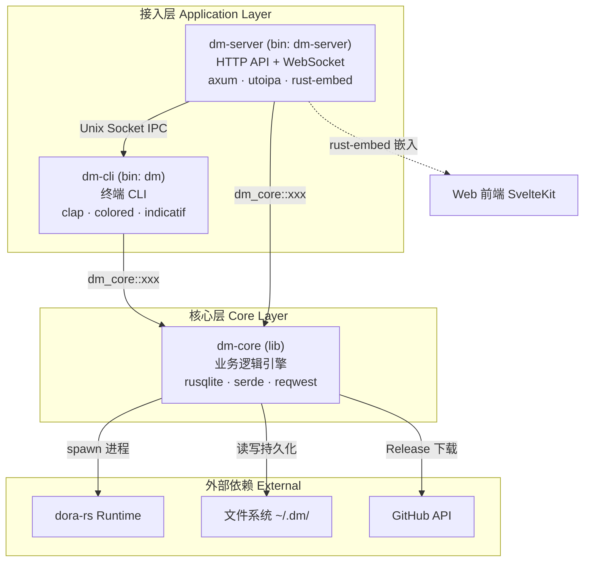
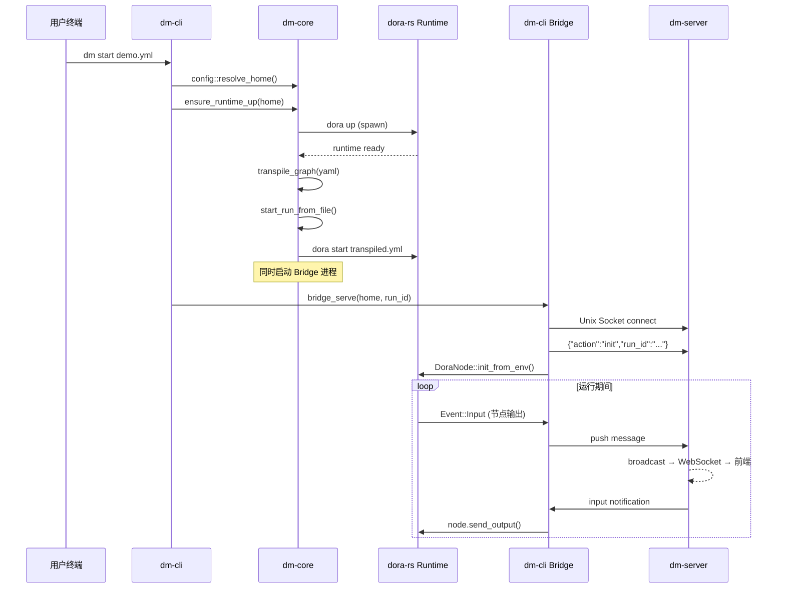

Dora Manager 的后端采用经典的**三层分离架构**，将全部 Rust 代码组织为三个独立的 crate：`dm-core` 承载所有业务逻辑，`dm-cli` 提供终端命令行接入，`dm-server` 提供 HTTP/WebSocket 接入。三者的关系可以概括为一句话——**一个无头引擎、两套薄壳适配器**。本文将系统性地解析每一层的职责边界、模块组织和交互模式，帮助你在后续深入各子系统之前建立清晰的思维模型。

Sources: [Cargo.toml](https://github.com/l1veIn/dora-manager/blob/main/Cargo.toml), [crates/dm-core/Cargo.toml](https://github.com/l1veIn/dora-manager/blob/main/crates/dm-core/Cargo.toml#L1-L8), [crates/dm-cli/Cargo.toml](https://github.com/l1veIn/dora-manager/blob/main/crates/dm-cli/Cargo.toml#L1-L12), [crates/dm-server/Cargo.toml](https://github.com/l1veIn/dora-manager/blob/main/crates/dm-server/Cargo.toml#L1-L12)

## 分层总览与依赖关系

下面的 Mermaid 图展示了三个 crate 之间的依赖方向。阅读前提：**箭头表示"依赖"**，即 dm-cli 和 dm-server 都依赖 dm-core，而 dm-core 不依赖任何上层 crate。



核心设计约束非常明确：**dm-cli 与 dm-server 之间不存在直接依赖**。两者都只是 dm-core 的消费者，分别面向终端用户和 Web 浏览器提供差异化的接入体验。唯一例外是 Bridge IPC 机制（通过 Unix Socket），它让 dm-cli 中的 Bridge 进程在运行时与 dm-server 建立实时通信通道。

Sources: [Cargo.toml](https://github.com/l1veIn/dora-manager/blob/main/Cargo.toml), [crates/dm-cli/Cargo.toml](https://github.com/l1veIn/dora-manager/blob/main/crates/dm-cli/Cargo.toml#L15), [crates/dm-server/Cargo.toml](https://github.com/l1veIn/dora-manager/blob/main/crates/dm-server/Cargo.toml#L15)

## dm-core：无头业务引擎

dm-core 是整个系统的**心脏**——它不关心请求来自终端还是浏览器，只负责处理"安装 dora 版本""启动数据流""采集运行指标"等纯业务操作。它以 `lib` crate 的形式存在，通过 `pub fn` 暴露功能，内部按领域模块组织为自包含的垂直切片。

### 模块地图

dm-core 内部包含 **9 个核心领域模块**。每个模块内部遵循一致的分层结构：`model`（数据结构定义）、`repo`（文件系统读写）、`service`（业务编排），形成清晰的关注点分离。

```text
dm-core/src/
├── api/              ← 顶层公共 API（setup, doctor, up/down, versions）
├── config.rs         ← DM_HOME 配置体系（config.toml 解析、路径约定）
├── dataflow/         ← 数据流管理（CRUD + 导入 + 转译器）
│   └── transpile/    ← 多 Pass 转译管线
├── dora.rs           ← dora CLI 进程封装（run_dora, exec_dora）
├── env.rs            ← 环境检测（Python, uv, Rust 可用性）
├── events/           ← 可观测性事件存储（SQLite + XES 导出）
├── install/          ← dora 版本安装（GitHub Release 下载 + 源码编译）
├── node/             ← 节点管理（安装、导入、dm.json 契约）
│   └── schema/       ← Port Schema 校验（Arrow 类型系统）
├── runs/             ← 运行实例生命周期（启动、状态刷新、指标采集）
│   ├── service_admin.rs    ← 清理、删除
│   ├── service_query.rs    ← 查询、列表
│   ├── service_runtime.rs  ← 状态同步、停止
│   └── service_start.rs    ← 启动编排
├── types.rs          ← 跨模块共享数据结构（StatusReport, DoctorReport...）
└── util.rs           ← 工具函数
```

这些模块之间的依赖关系构成一个有向无环图：`api` 是最高层的门面模块，它协调 `install`、`dora`、`config`、`runs` 等底层模块完成复杂业务流程。`types.rs` 和 `util.rs` 作为基础设施被所有模块共享。

Sources: [crates/dm-core/src/lib.rs](https://github.com/l1veIn/dora-manager/blob/main/crates/dm-core/src/lib.rs#L1-L22), [crates/dm-core/src/runs/mod.rs](https://github.com/l1veIn/dora-manager/blob/main/crates/dm-core/src/runs/mod.rs#L1-L27), [crates/dm-core/src/node/mod.rs](https://github.com/l1veIn/dora-manager/blob/main/crates/dm-core/src/node/mod.rs#L1-L35), [crates/dm-core/src/dataflow/mod.rs](https://github.com/l1veIn/dora-manager/blob/main/crates/dm-core/src/dataflow/mod.rs#L1-L22)

### 公共 API 面

dm-core 通过 `lib.rs` 的 `pub use` 暴露一组**顶层便捷函数**，这些函数构成了外部 crate 最常用的入口点：

| 函数 | 功能 | 底层模块 |
|------|------|----------|
| `setup(home, verbose, progress_tx)` | 一键安装 Python + uv + dora | `api::setup` |
| `doctor(home)` | 环境健康诊断 | `api::doctor` |
| `install(home, version, ...)` | 安装指定 dora 版本 | `install` |
| `up(home, verbose)` | 启动 dora coordinator + daemon | `api::runtime` |
| `down(home, verbose)` | 停止 dora 运行时 | `api::runtime` |
| `status(home, verbose)` | 运行时状态总览 | `api::runtime` |
| `versions(home)` | 列出已安装和可用版本 | `api::version` |
| `auto_down_if_idle(home, verbose)` | 空闲时自动关闭运行时 | `api::runtime` |

除此之外，各领域模块还暴露了更细粒度的 API，例如 `runs::start_run_from_yaml()`、`node::install_node()`、`dataflow::import_sources()` 等。dm-cli 和 dm-server 可以根据需要选择调用顶层便捷函数或直接使用领域模块的细粒度 API。

Sources: [crates/dm-core/src/lib.rs](https://github.com/l1veIn/dora-manager/blob/main/crates/dm-core/src/lib.rs#L18-L22), [crates/dm-core/src/api/mod.rs](https://github.com/l1veIn/dora-manager/blob/main/crates/dm-core/src/api/mod.rs#L1-L12)

### 核心设计原则：Node-Agnostic

dm-core 遵循一条关键约束——**它不知道任何特定节点的存在**。这意味着 `dm-core` 的代码中不会出现 `dora-qwen`、`dm-button` 等具体节点名。新增一个节点只需要编写该节点的代码并在其 `dm.json` 中声明元数据，无需修改 dm-core 的任何一行代码。转译器通过读取 `dm.json` 来解析节点路径和校验端口 schema，实现完全的数据驱动扩展。

Sources: [crates/dm-core/src/dataflow/transpile/mod.rs](https://github.com/l1veIn/dora-manager/blob/main/crates/dm-core/src/dataflow/transpile/mod.rs), [crates/dm-core/src/node/schema/mod.rs](https://github.com/l1veIn/dora-manager/blob/main/crates/dm-core/src/node/schema/mod.rs)

### dora 进程封装层

`dora.rs` 模块封装了 dm-core 与 dora-rs 运行时之间的所有进程级交互。它提供两种调用模式：

- **`run_dora()`**：捕获 stdout/stderr，返回 `(exit_code, stdout, stderr)` 元组，用于 `check`、`list` 等需要解析输出的命令
- **`exec_dora()`**：继承 stdio，返回原始退出码，用于 `start` 等需要交互式输出的命令

两个函数都遵循统一的模式：先通过 `active_dora_bin(home)` 从配置中解析当前活跃版本的 dora 二进制路径，然后以子进程方式执行。这种封装使得 dm-core 能够在版本切换后透明地指向正确的二进制文件。

Sources: [crates/dm-core/src/dora.rs](https://github.com/l1veIn/dora-manager/blob/main/crates/dm-core/src/dora.rs#L20-L78)

### 运行实例服务：内部分层

`runs` 模块是 dm-core 中最复杂的子系统之一。它将运行实例的业务逻辑拆分为 5 个 service 文件，每个文件专注单一职责：

| 文件 | 职责 |
|------|------|
| `service_start.rs` | 启动编排：转译 YAML → 启动 dora 进程 → 记录 run.json |
| `service_runtime.rs` | 状态同步：轮询 dora list → 刷新 run status → 停止运行 |
| `service_query.rs` | 查询：列表、详情、日志读取、转译产物读取 |
| `service_admin.rs` | 管理：删除运行记录、清理历史 |
| `service_metrics.rs` | 指标：CPU/内存采集与聚合 |

值得注意的是，`service.rs` 通过 `#[path = "..."]` 属性将这 5 个文件组装为一个统一的公共 API 面，对外暴露 20+ 个函数。这种组织方式在保持文件粒度可控的同时，对外呈现为一个内聚的模块。

Sources: [crates/dm-core/src/runs/service.rs](https://github.com/l1veIn/dora-manager/blob/main/crates/dm-core/src/runs/service.rs#L1-L47), [crates/dm-core/src/runs/mod.rs](https://github.com/l1veIn/dora-manager/blob/main/crates/dm-core/src/runs/mod.rs#L8-L27)

### 事件系统

dm-core 内置了一个**线程安全的 SQLite 事件存储**（`EventStore`），采用 `Mutex<Connection>` + WAL 模式保证并发安全。所有关键操作（版本安装、数据流启动、运行停止）都会自动发射结构化事件，支持按 `source`（core / server / frontend / ci）、`case_id`、`activity`、时间范围等维度过滤查询，并可导出为 XES 格式用于流程挖掘分析。

Sources: [crates/dm-core/src/events/mod.rs](https://github.com/l1veIn/dora-manager/blob/main/crates/dm-core/src/events/mod.rs#L1-L16), [crates/dm-core/src/events/store.rs](https://github.com/l1veIn/dora-manager/blob/main/crates/dm-core/src/events/store.rs#L10-L44)

## dm-cli：终端接入层

dm-cli 是一个**极薄的命令行适配器**。它的全部职责可以概括为三点：**解析参数**（通过 `clap`）、**调用 dm-core**、**格式化输出**（通过 `colored` + `indicatif`）。它不包含任何业务逻辑——甚至进度条的回调数据也来自 dm-core 的 `mpsc::UnboundedSender<InstallProgress>` 通道。

### 命令树

```text
dm (clap Parser)
├── setup          ← 一键安装（Python + uv + dora）
├── doctor         ← 环境健康诊断
├── install        ← 安装指定 dora 版本
├── uninstall      ← 卸载版本
├── use            ← 切换活跃版本
├── versions       ← 列出已安装和可用版本
├── up             ← 启动 dora coordinator + daemon
├── down           ← 停止运行时
├── status         ← 运行时状态总览
├── node           ← 节点管理子命令组
│   ├── install
│   ├── import
│   ├── list
│   └── uninstall
├── dataflow       ← 数据流管理子命令组
│   └── import
├── start          ← 启动数据流（自动确保 runtime up）
├── runs           ← 运行历史管理
│   ├── stop
│   ├── delete
│   ├── logs [--follow]
│   └── clean
├── bridge         ← (隐藏) Bridge IPC 服务
└── --             ← 透传到原生 dora CLI
```

Sources: [crates/dm-cli/src/main.rs](https://github.com/l1veIn/dora-manager/blob/main/crates/dm-cli/src/main.rs#L13-L115), [crates/dm-cli/src/cmd/mod.rs](https://github.com/l1veIn/dora-manager/blob/main/crates/dm-cli/src/cmd/mod.rs#L1-L4)

### 调用模式：纯委托 + 终端渲染

dm-cli 的 main 函数遵循一个固定的三步模式：**解析 CLI 参数 → 解析 DM_HOME 路径 → 调用 dm-core 函数 → 渲染输出**。以 `dm doctor` 为例：

```rust
Commands::Doctor => {
    let report = dm_core::doctor(&home).await?;
    display::print_doctor_report(&report);
}
```

整个 handler 只有 3 行有效代码。`display.rs` 模块负责将 dm-core 返回的结构化数据渲染为带颜色的终端输出，不包含任何条件分支逻辑或状态判断。

Sources: [crates/dm-cli/src/main.rs](https://github.com/l1veIn/dora-manager/blob/main/crates/dm-cli/src/main.rs#L186-L265), [crates/dm-cli/src/display.rs](https://github.com/l1veIn/dora-manager/blob/main/crates/dm-cli/src/display.rs#L1-L65)

### Bridge 进程：dm-cli 的特殊角色

dm-cli 中有一个特殊的 `bridge` 命令（隐藏，不暴露给用户）。Bridge 进程作为 dora 数据流中的一个节点运行，负责在 dora 事件系统和 dm-server 之间搭建 IPC 桥梁。它通过 Unix Socket（`~/.dm/bridge.sock`）与 dm-server 保持长连接，实现双向消息转发：

- **上行方向**：将 dora 节点的输出事件（如 `dm-display` 的文本消息、`dm-mjpeg` 的流元数据）转发给 dm-server
- **下行方向**：将来自 Web 前端的用户输入（如按钮点击、滑块变化）注入回 dora 数据流

这使得 dm-cli 不仅是用户直接交互的终端工具，还在运行实例生命周期中扮演关键的**通信中介**角色。

Sources: [crates/dm-cli/src/bridge.rs](https://github.com/l1veIn/dora-manager/blob/main/crates/dm-cli/src/bridge.rs#L57-L193)

## dm-server：HTTP 接入层

dm-server 基于 **Axum** 构建，在 dm-core 之上添加了四项独有能力：HTTP 路由、WebSocket 实时推送、Swagger 文档自动生成、前端静态资源嵌入。它监听 `127.0.0.1:3210`，为 Web 可视化面板提供完整的 RESTful API。

### 服务状态模型

dm-server 的全局状态通过 `AppState` 结构体管理，以 `Arc` 包装实现零成本 Clone 共享。所有 handler 都通过 Axum 的 `State<AppState>` 提取器获取共享状态：

```text
AppState (Clone)
├── home: Arc<PathBuf>           ← DM_HOME 路径
├── events: Arc<EventStore>      ← SQLite 事件存储（来自 dm-core）
├── messages: broadcast::Sender  ← 消息通知广播通道
└── media: Arc<MediaRuntime>     ← 媒体后端运行时（dm-server 独有）
```

Sources: [crates/dm-server/src/state.rs](https://github.com/l1veIn/dora-manager/blob/main/crates/dm-server/src/state.rs#L1-L25), [crates/dm-server/src/main.rs](https://github.com/l1veIn/dora-manager/blob/main/crates/dm-server/src/main.rs#L79-L96)

### Handler 委托模式

dm-server 的每个 handler 遵循统一的**薄委托模式**——从 HTTP 请求中提取参数，调用 dm-core 对应函数，将结果序列化为 JSON 返回。Handler 层不包含业务逻辑，仅处理 HTTP 语义（状态码、错误格式化）。

以 `GET /api/runs` 为例，完整实现如下：

```rust
pub async fn list_runs(
    State(state): State<AppState>,
    Query(params): Query<PaginationParams>,
) -> impl IntoResponse {
    let limit = params.limit.unwrap_or(20);
    let offset = params.offset.unwrap_or(0);
    let filter = dm_core::runs::RunListFilter { ... };
    match dm_core::runs::list_runs_filtered(&state.home, limit, offset, &filter) {
        Ok(result) => Json(result).into_response(),
        Err(e) => err(e).into_response(),
    }
}
```

Sources: [crates/dm-server/src/handlers/runs.rs](https://github.com/l1veIn/dora-manager/blob/main/crates/dm-server/src/handlers/runs.rs#L58-L75), [crates/dm-server/src/handlers/mod.rs](https://github.com/l1veIn/dora-manager/blob/main/crates/dm-server/src/handlers/mod.rs#L43-L46)

### API 路由结构

HTTP API 按功能域组织为 9 组路由，总计 50+ 个端点。下表展示了路由前缀与 dm-core 模块的对应关系：

| 路由前缀 | 功能域 | 核心委托目标 |
|----------|--------|-------------|
| `/api/doctor`, `/api/versions`, `/api/status` | 环境管理 | `api::doctor`, `api::versions`, `api::status` |
| `/api/install`, `/api/uninstall`, `/api/use`, `/api/up`, `/api/down` | 运行时管理 | `api::install`, `api::up/down` |
| `/api/nodes` | 节点管理 | `node::list_nodes`, `node::install_node` |
| `/api/dataflows` | 数据流 CRUD | `dataflow::list`, `dataflow::save` |
| `/api/dataflow/start`, `/api/dataflow/stop` | 数据流执行 | `runs::start_run_from_yaml` |
| `/api/runs` | 运行历史 | `runs::list_runs`, `runs::get_run` |
| `/api/runs/{id}/messages`, `/api/runs/{id}/streams` | 交互消息 | `services::message`（dm-server 私有） |
| `/api/runs/{id}/ws` | WebSocket 实时推送 | 文件系统监听 + `notify` crate |
| `/api/events` | 可观测性 | `events::EventStore` |

Sources: [crates/dm-server/src/main.rs](https://github.com/l1veIn/dora-manager/blob/main/crates/dm-server/src/main.rs#L97-L235), [crates/dm-server/src/handlers/mod.rs](https://github.com/l1veIn/dora-manager/blob/main/crates/dm-server/src/handlers/mod.rs#L1-L41)

### 服务端独有模块

dm-server 拥有两个 dm-core 中不存在的**服务端专属模块**，它们承载了不适合放入核心层的 HTTP 侧关注点：

- **`services::media`**（`MediaRuntime`）：管理 MediaMTX 媒体后端的完整生命周期——从 GitHub 下载二进制、生成配置文件、启动子进程、探活检测，到暴露 RTSP/HLS/WebRTC 流媒体端点。此模块封装了进程管理和网络配置逻辑，仅在 dm-server 中需要，因此放置在服务端而非核心层。

- **`services::message`**（`MessageService`）：基于 SQLite 的**运行实例交互消息持久化**。每个运行实例在 `runs/<uuid>/` 下维护独立的 `interaction.db`，记录来自 dora 节点的上行消息和来自 Web 前端的下行输入。该服务通过 `broadcast::Sender<MessageNotification>` 实现实时推送——当新消息写入时，所有订阅该通道的 WebSocket 连接会立即收到通知。

Sources: [crates/dm-server/src/services/media.rs](https://github.com/l1veIn/dora-manager/blob/main/crates/dm-server/src/services/media.rs#L70-L106), [crates/dm-server/src/services/message.rs](https://github.com/l1veIn/dora-manager/blob/main/crates/dm-server/src/services/message.rs#L104-L161)

### Bridge Socket：dm-server 与 dm-cli 的 IPC 通道

dm-server 在启动时创建一个 Unix Domain Socket（`~/.dm/bridge.sock`），用于接收 dm-cli Bridge 进程的实时连接。`bridge_socket_loop` 在主循环中对每个连接执行两阶段握手：

1. **初始化阶段**：读取 `{"action":"init","run_id":"..."}` 消息，绑定连接到特定运行实例
2. **双向转发阶段**：通过 `tokio::select!` 同时监听上行消息（从 Bridge 读取并写入交互数据库）和下行通知（从广播通道读取并写回 Bridge）

Sources: [crates/dm-server/src/handlers/bridge_socket.rs](https://github.com/l1veIn/dora-manager/blob/main/crates/dm-server/src/handlers/bridge_socket.rs#L28-L123)

### 后台任务

dm-server 在主 HTTP 服务之外还启动了一个**空闲监控协程**，每 30 秒检查是否有活跃运行实例。当所有运行结束后，它会自动执行 `dm_core::auto_down_if_idle` 释放 dora 运行时资源。这是一种资源优化策略——在 Web 面板场景中，用户可能忘记手动 `dm down`，空闲自动关闭避免了无谓的资源占用。

Sources: [crates/dm-server/src/main.rs](https://github.com/l1veIn/dora-manager/blob/main/crates/dm-server/src/main.rs#L244-L251)

### 前端静态嵌入

dm-server 通过 `rust_embed` 将编译后的 SvelteKit 产物（`web/build/` 目录）在编译期嵌入到 Rust 二进制中。运行时通过 `fallback` 路由将未匹配 API 请求的请求导向前端静态资源服务，实现**单二进制部署**——无需额外的 nginx 或 CDN。

Sources: [crates/dm-server/src/main.rs](https://github.com/l1veIn/dora-manager/blob/main/crates/dm-server/src/main.rs#L20-L22), [crates/dm-server/src/main.rs](https://github.com/l1veIn/dora-manager/blob/main/crates/dm-server/src/main.rs#L234-L235)

## 三层对比速查

| 维度 | dm-core | dm-cli | dm-server |
|------|---------|--------|-----------|
| **crate 类型** | `lib` | `bin` (`dm`) | `bin` (`dm-server`) |
| **核心职责** | 所有业务逻辑 | CLI 参数解析 + 终端渲染 | HTTP 路由 + WebSocket + 静态资源 |
| **依赖方向** | 被依赖（零上层依赖） | → dm-core | → dm-core |
| **独有依赖** | rusqlite, sha2, zip | clap, colored, indicatif, dora-core | axum, utoipa, rust-embed, notify |
| **状态管理** | 无状态函数 + 文件系统 | 无状态（每次命令独立进程） | `AppState`（Arc 共享 + broadcast channel） |
| **输出方式** | 返回 `Result<T>` | `println!` + 彩色 + 进度条 | `Json` + HTTP 状态码 + WebSocket 帧 |
| **测试策略** | 单元测试（tempdir 隔离） | 集成测试（`assert_cmd`） | Handler 级别测试 |

Sources: [crates/dm-core/Cargo.toml](https://github.com/l1veIn/dora-manager/blob/main/crates/dm-core/Cargo.toml#L1-L30), [crates/dm-cli/Cargo.toml](https://github.com/l1veIn/dora-manager/blob/main/crates/dm-cli/Cargo.toml#L1-L35), [crates/dm-server/Cargo.toml](https://github.com/l1veIn/dora-manager/blob/main/crates/dm-server/Cargo.toml#L1-L37)

## 设计决策与权衡

### 为什么选择三层分离而非二层？

将 CLI 和 Server 拆分为独立 crate 而非在同一个二进制中用子命令区分，基于三个考量：

1. **依赖隔离**：dm-cli 需要 `dora-core` 进行 YAML 解析（用于 `start` 命令），dm-server 需要 `axum` + `utoipa` 等 HTTP 生态；合并会引入不必要的编译依赖，增加编译时间和二进制体积。
2. **部署灵活性**：CI/CD 环境可能只需要 `dm` CLI，Web 面板场景需要 `dm-server`，二者独立分发避免携带无用依赖。
3. **编译速度**：dm-core 变更时只需重新编译 dm-core + 依赖它的 crate；如果 CLI 和 Server 在同一个 crate 中，任何变更都需要全量重编译。

Sources: [Cargo.toml](https://github.com/l1veIn/dora-manager/blob/main/Cargo.toml)

### 为什么 dm-core 使用函数式 API 而非 trait-based 架构？

dm-core 暴露的是一组 `pub async fn` 和 `pub fn`，而非面向对象的 trait 接口。这一选择使得调用方零样板代码——CLI 和 Server 可以直接 `dm_core::up(&home, verbose)` 调用，无需实现 trait 或构造复杂上下文对象。内部模块通过 `RuntimeBackend` trait 实现了可测试性（在 `service_start.rs` 中可见），但这一抽象仅限于内部使用，不暴露给外部调用方。这是一种**渐进式复杂度**策略——仅在确实需要多态的边界引入 trait，避免过度设计。

Sources: [crates/dm-core/src/lib.rs](https://github.com/l1veIn/dora-manager/blob/main/crates/dm-core/src/lib.rs#L18-L22), [crates/dm-core/src/runs/service.rs](https://github.com/l1veIn/dora-manager/blob/main/crates/dm-core/src/runs/service.rs#L1-L47)

## 完整数据流示例：从终端到运行时

以 `dm start demo.yml` 命令为例，完整调用链路跨越三层，展示了各层之间的协作关系：



Sources: [crates/dm-cli/src/main.rs](https://github.com/l1veIn/dora-manager/blob/main/crates/dm-cli/src/main.rs#L364-L385), [crates/dm-cli/src/bridge.rs](https://github.com/l1veIn/dora-manager/blob/main/crates/dm-cli/src/bridge.rs#L57-L193), [crates/dm-server/src/handlers/bridge_socket.rs](https://github.com/l1veIn/dora-manager/blob/main/crates/dm-server/src/handlers/bridge_socket.rs#L28-L123)

## 延伸阅读

- 要深入了解数据流转译器的多 Pass 管线和四层配置合并机制，请阅读 [数据流转译器（Transpiler）：多 Pass 管线与四层配置合并](11-shu-ju-liu-zhuan-yi-qi-transpiler-duo-pass-guan-xian-yu-si-ceng-pei-zhi-he-bing)
- 要了解节点的安装、导入和路径解析细节，请阅读 [节点管理系统：安装、导入、路径解析与沙箱隔离](12-jie-dian-guan-li-xi-tong-an-zhuang-dao-ru-lu-jing-jie-xi-yu-sha-xiang-ge-chi)
- 要了解运行实例的启动编排和指标采集流程，请阅读 [运行时服务：启动编排、状态刷新与 CPU/内存指标采集](13-yun-xing-shi-fu-wu-qi-dong-bian-pai-zhuang-tai-shua-xin-yu-cpu-nei-cun-zhi-biao-cai-ji)
- 要了解完整的 HTTP API 端点清单，请阅读 [HTTP API 全览：REST 路由、WebSocket 实时通道与 Swagger 文档](15-http-api-quan-lan-rest-lu-you-websocket-shi-shi-tong-dao-yu-swagger-wen-dang)
- 要了解 DM_HOME 目录结构和 config.toml 配置体系，请阅读 [配置体系：DM_HOME 目录结构与 config.toml](16-pei-zhi-ti-xi-dm_home-mu-lu-jie-gou-yu-config-toml)