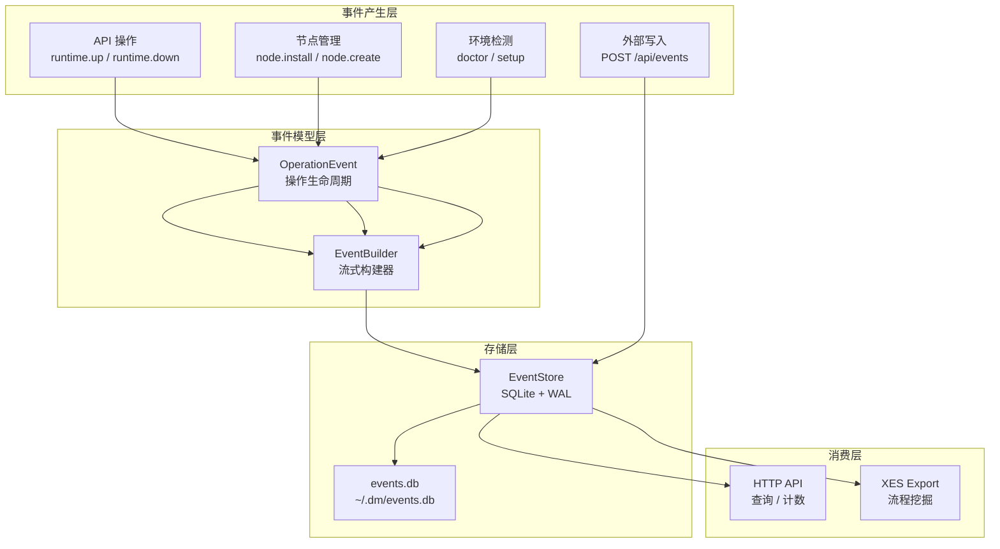
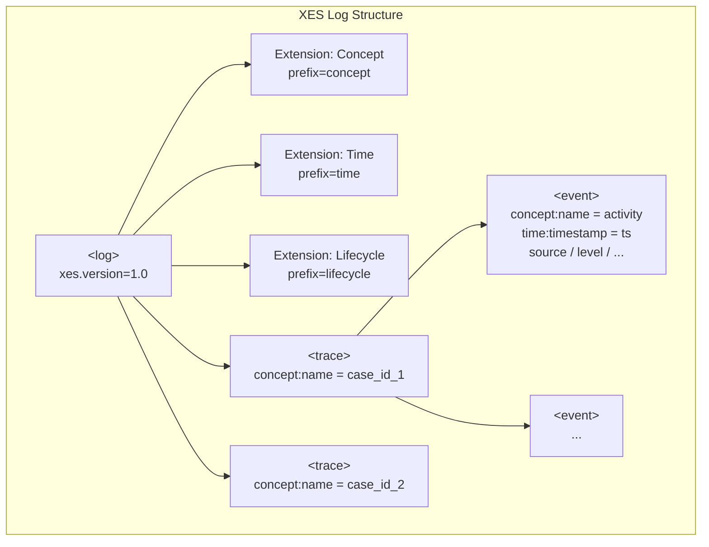
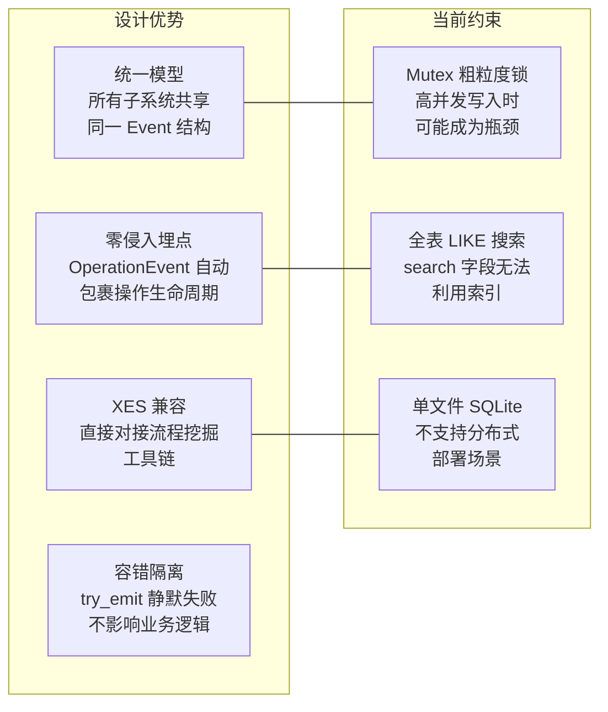

Dora Manager 的事件系统是一个**统一的可观测性基础设施**，将系统日志、数据流执行追踪、HTTP 请求记录、前端分析以及 CI 指标全部归一化为一种事件模型，存储于 SQLite 数据库中。该模型在设计上与 **XES（eXtensible Event Stream）标准**兼容，可直接导出为 XES XML 格式，供 PM4Py 等流程挖掘工具消费。本文将从数据模型、存储引擎、操作语义、HTTP API 以及 XES 导出机制五个维度展开深度解析。

Sources: [mod.rs](https://github.com/l1veIn/dora-manager/blob/master/crates/dm-core/src/events/mod.rs#L1-L5)

## 设计哲学：事件即唯一真相源

事件系统的核心设计原则是 **"Event as Single Source of Truth"**。dm-core 中所有关键操作——运行时启停、版本切换、节点安装、环境诊断、数据流启动——均通过 `OperationEvent` 抽象自动产生配对的 start/result 事件。这种模式无需在业务逻辑中手动埋点，仅通过将操作代码包裹在 `op.emit_start()` 和 `op.emit_result(&result)` 之间即可完成全链路追踪。



Sources: [mod.rs](https://github.com/l1veIn/dora-manager/blob/master/crates/dm-core/src/events/mod.rs#L12-L15), [op.rs](https://github.com/l1veIn/dora-manager/blob/master/crates/dm-core/src/events/op.rs#L1-L67)

## 数据模型：Event 与类型枚举

### Event 核心结构

`Event` 是整个系统的原子数据单元，其字段设计直接映射到 XES 标准中的 **Trace → Event** 层次结构：

| 字段 | 类型 | XES 映射 | 说明 |
|------|------|----------|------|
| `id` | `i64` | — | 自增主键，存储层分配 |
| `timestamp` | `String` | `time:timestamp` | ISO 8601 / RFC 3339 格式 |
| `case_id` | `String` | `concept:name` (Trace) | 关联标识符——通常是会话 ID、运行 ID 或请求 ID |
| `activity` | `String` | `concept:name` (Event) | 操作名称，如 `node.install`、`runtime.up` |
| `source` | `String` | `source` | 事件来源分类 |
| `level` | `String` | `level` | 严重性等级 |
| `node_id` | `Option<String>` | `node_id` | 可选的节点标识符 |
| `message` | `Option<String>` | `message` | 人类可读描述 |
| `attributes` | `Option<String>` | — | JSON 序列化的任意扩展属性 |

Sources: [model.rs](https://github.com/l1veIn/dora-manager/blob/master/crates/dm-core/src/events/model.rs#L80-L92)

### EventSource：五域分类

事件来源被划分为五个正交域，覆盖了 Dora Manager 运行时可能涉及的所有子系统：

| 枚举值 | 序列化 | 职责域 |
|--------|--------|--------|
| `Core` | `"core"` | 核心引擎操作：运行时管理、节点安装、版本切换、环境诊断 |
| `Dataflow` | `"dataflow"` | 数据流生命周期：节点调度、输出事件、拓扑变更 |
| `Server` | `"server"` | HTTP 服务层：API 请求日志、WebSocket 连接 |
| `Frontend` | `"frontend"` | 前端交互：UI 操作、用户行为分析 |
| `Ci` | `"ci"` | 持续集成：构建警告、测试结果、部署事件 |

`EventSource` 实现了 `Display`、`FromStr` 以及 `Serialize`/`Deserialize`（均为 `lowercase` 重命名策略），确保在序列化边界和 SQL 查询中使用一致的字符串表示。

Sources: [model.rs](https://github.com/l1veIn/dora-manager/blob/master/crates/dm-core/src/events/model.rs#L4-L40)

### EventLevel：五级严重性

| 枚举值 | 序列化 | 语义 |
|--------|--------|------|
| `Trace` | `"trace"` | 极细粒度的执行路径追踪 |
| `Debug` | `"debug"` | 调试诊断信息 |
| `Info` | `"info"` | 常规操作记录（**默认值**） |
| `Warn` | `"warn"` | 非致命异常或降级告警 |
| `Error` | `"error"` | 操作失败，通常伴随错误详情 |

Sources: [model.rs](https://github.com/l1veIn/dora-manager/blob/master/crates/dm-core/src/events/model.rs#L42-L78)

## EventBuilder：流式事件构建器

`EventBuilder` 采用 Rust Builder 模式，提供流畅的链式 API 来构造事件对象。其设计要点：

- **自动时间戳**：`build()` 时通过 `chrono::Utc::now().to_rfc3339()` 自动注入 UTC 时间戳，调用者无需关心时间同步
- **延迟属性聚合**：`attr()` 方法接受任意 `Serialize` 值，逐步累积到 `serde_json::Map` 中，最终在 `build()` 时一次性序列化为 JSON 字符串
- **零 ID 策略**：`Event.id` 在构建时设为 `0`，真正的 ID 由 SQLite 的 `AUTOINCREMENT` 在 `emit()` 时分配

```rust
// 典型用法：链式构建带丰富属性的事件
let event = EventBuilder::new(EventSource::Ci, "clippy.warn")
    .case_id("commit_abc123")
    .level(EventLevel::Warn)
    .message("unused variable")
    .attr("file", "src/main.rs")
    .attr("line", 42)
    .attr("severity", "warning")
    .build();
```

Sources: [builder.rs](https://github.com/l1veIn/dora-manager/blob/master/crates/dm-core/src/events/builder.rs#L1-L74)

## OperationEvent：操作生命周期追踪

`OperationEvent` 是事件系统的**核心操作语义层**，为长时间运行的操作提供自动化的 start/result 事件对：

1. **创建阶段**：`OperationEvent::new(home, source, activity)` 初始化上下文，自动生成 `session_{UUID}` 格式的 `case_id`
2. **开始信号**：`op.emit_start()` 发出一条 `message = "START"` 的 Info 级别事件
3. **结果信号**：`op.emit_result(&result)` 根据 `Result<T>` 的状态自动分支：
   - `Ok(_)` → Info 级别，`message = "OK"`
   - `Err(e)` → Error 级别，`message = {错误描述}`

这种模式确保每个关键操作在事件流中都留下**成对的开始/结束标记**，支持基于 `case_id` 的完整执行路径重建。

### 全量操作埋点清单

以下表格列出了 dm-core 中所有通过 `OperationEvent` 追踪的操作：

| 模块 | Activity | 触发场景 |
|------|----------|----------|
| `api/runtime.rs` | `runtime.up` | 启动 dora 协调器与守护进程 |
| `api/runtime.rs` | `runtime.down` | 停止 dora 运行时 |
| `api/runtime.rs` | `passthrough` | 直接透传 dora CLI 命令 |
| `api/version.rs` | `versions` | 查询已安装版本列表 |
| `api/version.rs` | `version.uninstall` | 卸载指定版本 |
| `api/version.rs` | `version.switch` | 切换活跃版本 |
| `api/doctor.rs` | `doctor` | 执行环境健康检查 |
| `api/setup.rs` | `setup` | 执行首次安装与依赖检查 |
| `node/local.rs` | `node.create` | 创建新节点脚手架 |
| `node/local.rs` | `node.list` | 列出所有可用节点 |
| `node/local.rs` | `node.uninstall` | 卸载指定节点 |
| `node/local.rs` | `node.status` | 查询节点状态 |
| `node/import.rs` | `node.import_local` | 从本地目录导入节点 |
| `node/import.rs` | `node.import_git` | 从 Git 仓库导入节点 |
| `node/install.rs` | `node.install` | 安装节点依赖并构建 |

Sources: [op.rs](https://github.com/l1veIn/dora-manager/blob/master/crates/dm-core/src/events/op.rs#L1-L67), [runtime.rs](https://github.com/l1veIn/dora-manager/blob/master/crates/dm-core/src/api/runtime.rs#L134-L279), [doctor.rs](https://github.com/l1veIn/dora-manager/blob/master/crates/dm-core/src/api/doctor.rs#L10-L59), [setup.rs](https://github.com/l1veIn/dora-manager/blob/master/crates/dm-core/src/api/setup.rs#L14-L52), [local.rs](https://github.com/l1veIn/dora-manager/blob/master/crates/dm-core/src/node/local.rs#L14-L223), [import.rs](https://github.com/l1veIn/dora-manager/blob/master/crates/dm-core/src/node/import.rs#L22-L62), [install.rs](https://github.com/l1veIn/dora-manager/blob/master/crates/dm-core/src/node/install.rs#L12-L73)

## EventStore：SQLite 存储引擎

### 存储位置与初始化

事件数据库位于 `<DM_HOME>/events.db`，其中 `DM_HOME` 的解析优先级为：`--home` 命令行参数 > `DM_HOME` 环境变量 > `~/.dm` 默认路径。dm-server 启动时作为应用状态的一部分全局初始化：

```rust
// dm-server main.rs
let events = EventStore::open(&home).expect("Failed to open event store");
let state = AppState {
    home: Arc::new(home),
    events: Arc::new(events),  // Arc 包装，全局共享
    // ...
};
```

Sources: [store.rs](https://github.com/l1veIn/dora-manager/blob/master/crates/dm-core/src/events/store.rs#L14-L44), [main.rs](https://github.com/l1veIn/dora-manager/blob/master/crates/dm-server/src/main.rs#L82-L93)

### Schema 与索引策略

`EventStore::open()` 在初始化时执行以下 DDL：

```sql
CREATE TABLE IF NOT EXISTS events (
    id          INTEGER PRIMARY KEY AUTOINCREMENT,
    timestamp   TEXT    NOT NULL,
    case_id     TEXT    NOT NULL,
    activity    TEXT    NOT NULL,
    source      TEXT    NOT NULL,
    level       TEXT    NOT NULL DEFAULT 'info',
    node_id     TEXT,
    message     TEXT,
    attributes  TEXT
);
```

四条索引分别覆盖了最常用的查询维度：`idx_events_case` (case_id)、`idx_events_source` (source)、`idx_events_time` (timestamp)、`idx_events_activity` (activity)。**注意 `activity` 索引支持 `LIKE` 前缀匹配查询**（虽然索引在 `%pattern%` 模式下无法充分利用 B-tree 特性，但对于精确分类查询仍然有效）。同时启用 `PRAGMA journal_mode=WAL` 以支持并发读写场景。

Sources: [store.rs](https://github.com/l1veIn/dora-manager/blob/master/crates/dm-core/src/events/store.rs#L22-L39)

### 线程安全模型

`EventStore` 通过 `Mutex<Connection>` 实现线程安全。这是一个 **粗粒度锁策略**——每次 `emit()`、`query()` 或 `count()` 操作都需要获取全局互斥锁。在当前的事件吞吐量场景下（操作级埋点，非高频日志），这种设计在简洁性和性能之间取得了合理平衡。对于未来可能的高并发写入场景（如数据流节点高频输出事件），可考虑迁移到连接池或分段锁方案。

Sources: [store.rs](https://github.com/l1veIn/dora-manager/blob/master/crates/dm-core/src/events/store.rs#L10-L12)

### 动态查询构建

`query()` 方法采用**动态 SQL 拼接**模式，根据 `EventFilter` 中非 `None` 的字段逐步追加 `WHERE` 条件。过滤维度包括：

| 过滤字段 | SQL 操作 | 匹配模式 |
|----------|----------|----------|
| `source` | `=` | 精确匹配 |
| `case_id` | `=` | 精确匹配 |
| `activity` | `LIKE` | 模糊匹配（`%pattern%`） |
| `level` | `=` | 精确匹配 |
| `node_id` | `=` | 精确匹配 |
| `since` | `>=` | 时间范围起始 |
| `until` | `<=` | 时间范围截止 |
| `search` | `LIKE` (三字段 OR) | 全文模糊搜索 activity + message + source |
| `limit` | `LIMIT` | 分页大小（默认 500） |
| `offset` | `OFFSET` | 分页偏移 |

结果按 `id DESC` 排序（最新事件优先），`count()` 方法复用相同的过滤逻辑但执行 `SELECT COUNT(*)` 聚合。

Sources: [store.rs](https://github.com/l1veIn/dora-manager/blob/master/crates/dm-core/src/events/store.rs#L70-L204)

### 级联删除：Run 与 Event 的生命周期绑定

当通过 `runs::service_admin::delete_run()` 删除一个运行实例时，事件系统会自动清理关联的所有事件：

```rust
pub fn delete_run(home: &Path, run_id: &str) -> Result<()> {
    repo::delete_run(home, run_id)?;
    let store = crate::events::EventStore::open(home)?;
    let _ = store.delete_by_case_id(run_id);  // 以 run_id 为 case_id 删除关联事件
    Ok(())
}
```

这确保了运行实例与其可观测性数据的一致性。`clean_runs()` 批量清理函数同样遵循此模式。

Sources: [service_admin.rs](https://github.com/l1veIn/dora-manager/blob/master/crates/dm-core/src/runs/service_admin.rs#L7-L27)

## XES 导出：流程挖掘兼容层

### XES 标准映射

XES（eXtensible Event Stream）是 IEEE 1849 标准定义的事件日志格式，被 ProM、PM4Py 等流程挖掘工具广泛支持。导出模块 `render_xes()` 将事件按以下规则映射到 XES 层次结构：



具体映射规则：
- **Log 级**：声明三个标准扩展（Concept、Time、Lifecycle）
- **Trace 级**：以 `case_id` 分组，每个唯一 `case_id` 生成一个 `<trace>` 元素，`concept:name` 设为 `case_id`
- **Event 级**：`activity` → `concept:name`，`timestamp` → `time:timestamp`，`source`/`level`/`node_id`/`message` 作为额外的 `<string>` 属性

事件首先按 `case_id` 分组到 `BTreeMap`（保证字典序输出），再在每组内按原始顺序遍历。

Sources: [export.rs](https://github.com/l1veIn/dora-manager/blob/master/crates/dm-core/src/events/export.rs#L1-L71)

### XML 转义与安全性

`escape_xml()` 函数对五种 XML 特殊字符（`& < > " '`）进行实体转义，确保 `message` 等用户可控字段不会破坏 XML 结构。这在节点安装错误消息、数据流执行异常等场景中尤为重要。

Sources: [export.rs](https://github.com/l1veIn/dora-manager/blob/master/crates/dm-core/src/events/export.rs#L65-L71)

## HTTP API：事件消费端点

dm-server 通过四个 HTTP 端点暴露事件系统的完整读写能力，所有端点共享同一个 `AppState.events: Arc<EventStore>` 实例：

| 端点 | 方法 | 功能 | 响应类型 |
|------|------|------|----------|
| `/api/events` | GET | 按条件查询事件列表 | `application/json` |
| `/api/events/count` | GET | 按条件统计事件数量 | `application/json` |
| `/api/events` | POST | 写入单条事件 | `application/json` |
| `/api/events/export` | GET | 导出为 XES XML | `application/xml` |

### 查询参数

GET 端点直接将 URL Query String 反序列化为 `EventFilter`，支持所有过滤字段：

```
GET /api/events?source=core&case_id=session_001&limit=50&offset=100
GET /api/events/count?level=error&since=2025-01-01T00:00:00Z
GET /api/events/export?source=dataflow&format=xes
```

### 事件写入

POST 端点接受完整的 `Event` JSON body（`id` 字段被忽略，由数据库自增分配），返回新创建的事件 ID：

```json
// POST /api/events
{
  "case_id": "run_abc123",
  "activity": "node.output",
  "source": "dataflow",
  "level": "info",
  "node_id": "opencv-plot",
  "message": "Frame rendered",
  "attributes": "{\"fps\": 30, \"resolution\": \"640x480\"}"
}

// Response: { "id": 42 }
```

Sources: [events.rs (handler)](https://github.com/l1veIn/dora-manager/blob/master/crates/dm-server/src/handlers/events.rs#L1-L52), [main.rs (routes)](https://github.com/l1veIn/dora-manager/blob/master/crates/dm-server/src/main.rs#L214-L218)

## try_emit：容错式发射

`try_emit()` 函数提供了一种**静默失败**的事件发射策略——它打开 EventStore 并尝试写入，如果数据库不可用（权限不足、磁盘满等），错误会被静默吞掉。这确保了事件系统的故障不会影响核心业务逻辑的正常执行。`OperationEvent` 的 `emit_start()` 和 `emit_result()` 都通过此函数间接调用 `store.emit()`。

Sources: [op.rs](https://github.com/l1veIn/dora-manager/blob/master/crates/dm-core/src/events/op.rs#L9-L14)

## 架构总结与设计权衡



事件系统在**简洁性**与**可扩展性**之间做出了明确的设计选择：单表 SQLite 存储简化了部署和备份（一个 `events.db` 文件即可迁移全部可观测性数据）；XES 兼容模型确保了事件数据的长期分析价值；`OperationEvent` 模式降低了埋点的认知负担。对于当前 Dora Manager 的单体部署场景，这些权衡是合理的。

Sources: [mod.rs](https://github.com/l1veIn/dora-manager/blob/master/crates/dm-core/src/events/mod.rs#L1-L15)

---

**下一步阅读**：了解事件系统如何被 dm-server 的 HTTP 层消费，参见 [HTTP API 路由全览与 Swagger 文档](12-http-api)；深入了解事件追踪的运行实例生命周期，参见 [运行时服务：启动编排、状态刷新与指标采集](10-runtime-service)；了解事件数据库的存储位置上下文，参见 [配置体系：DM_HOME 目录结构与 config.toml](13-config-system)。