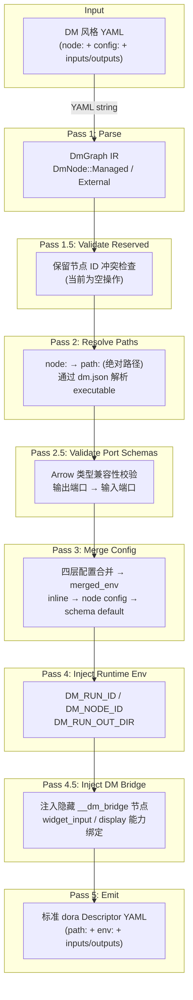
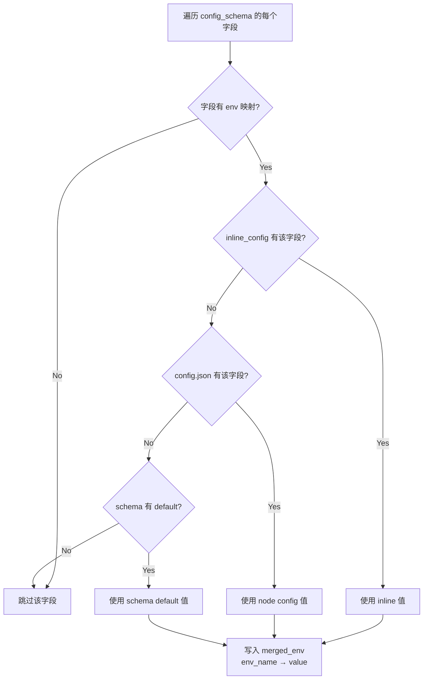
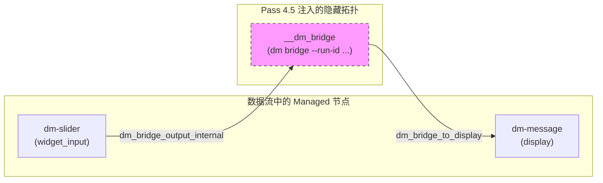
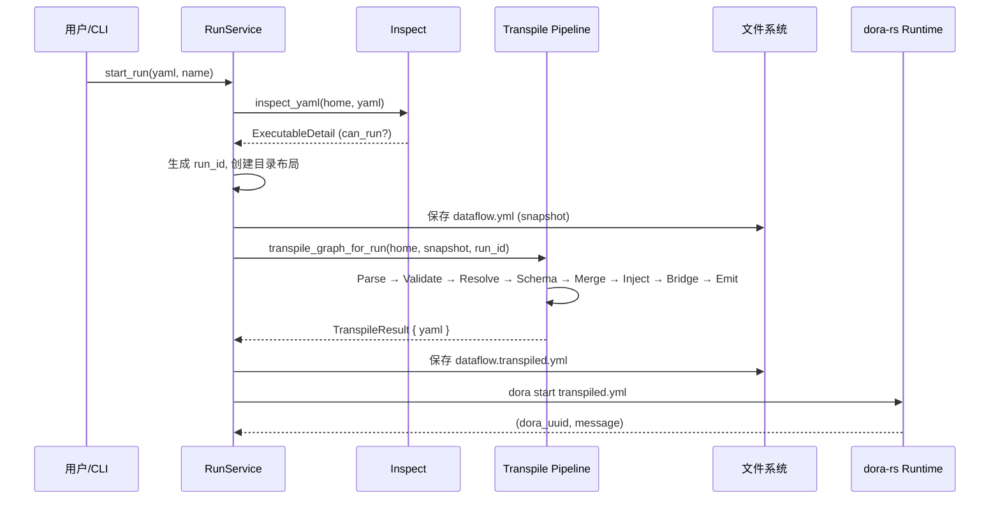

数据流（Dataflow）是 Dora Manager 的核心执行单元，但它并非直接被 dora-rs 运行时消费。用户编写的 DM 风格 YAML 包含声明式的 `node:` 引用、内联 `config:` 块和端口拓扑，这些语义必须被**转译**（transpile）为 dora-rs 能理解的标准 `Descriptor` 格式——以绝对 `path:` 替代符号引用、以 `env:` 注入合并后的配置值、以隐式 Bridge 节点注入交互能力。转译器（Transpiler）正是完成这一转换的多 Pass 管线，它驻留在 `dm-core` crate 中，是连接「用户意图」与「运行时执行」的关键编译层。

Sources: [mod.rs](https://github.com/l1veIn/dora-manager/blob/main/crates/dm-core/src/dataflow/transpile/mod.rs#L1-L11)

## 管线全景：从 DM YAML 到 dora Descriptor

转译器的入口函数 `transpile_graph_for_run` 接收 DM_HOME 路径和 YAML 文件路径，按照固定顺序执行七个 Pass。整个过程不使用短路（short-circuit）错误处理，而是通过诊断收集机制（diagnostics）让用户一次性看到所有问题。下图展示了管线的完整数据流：



管线的核心设计原则是**渐进式丰富**（progressive enrichment）：每个 Pass 只负责一个关注点，向 IR 中填充特定字段。`DmGraph` 作为所有 Pass 共享的可变状态，其字段由各 Pass 逐步填充 —— `resolved_path` 由 `resolve_paths` 填充，`merged_env` 由 `merge_config`、`inject_runtime_env` 和 `inject_dm_bridge` 三个 Pass 共同丰富。

Sources: [mod.rs](https://github.com/l1veIn/dora-manager/blob/main/crates/dm-core/src/dataflow/transpile/mod.rs#L47-L80)

## 类型化中间表示：DmGraph IR

转译器不直接操作原始 `serde_yaml::Value` 树，而是将每个节点解析为两种强类型变体之一，仅在最终 emit 阶段才转换回 YAML。这一设计将**语义解析**与**序列化**解耦，使每个 Pass 可以在类型安全的结构上操作。

```rust
// DmGraph — 所有 Pass 共享的核心 IR
pub(crate) struct DmGraph {
    pub nodes: Vec<DmNode>,
    pub extra_fields: serde_yaml::Mapping, // 透传顶层未知字段
}

pub(crate) enum DmNode {
    Managed(ManagedNode),      // 有 node: 字段的受管节点
    External { _yaml_id, raw }, // 外部节点（path: 指定），原样透传
}

pub(crate) struct ManagedNode {
    pub yaml_id: String,            // YAML 中的 id 字段
    pub node_id: String,            // node: 字段的值（节点标识符）
    pub inline_config: Value,       // YAML 中 config: 块的内联配置
    pub resolved_path: Option<String>, // Pass 2 填充的绝对可执行路径
    pub merged_env: Mapping,        // Pass 3/4/4.5 填充的环境变量
    pub extra_fields: Mapping,      // inputs/outputs 等其他字段透传
}
```

**Managed** 与 **External** 的区分是整个转译器的核心分类逻辑。在 Parse 阶段，只有同时具备 `node:` 字段的节点才会被归类为 `Managed`，进入后续的路径解析、配置合并等处理流程；而仅有 `path:` 或既无 `node:` 也无 `path:` 的节点则被归为 `External`，在整个管线中保持原始映射不变，仅在 emit 时原样输出。顶层非 `nodes` 字段（如 `communication`、`deploy`、`debug` 等）存储在 `extra_fields` 中，管线不做任何处理，确保未知的 dora 字段永远不会被丢弃。

Sources: [model.rs](https://github.com/l1veIn/dora-manager/blob/main/crates/dm-core/src/dataflow/transpile/model.rs#L1-L39), [passes.rs](https://github.com/l1veIn/dora-manager/blob/main/crates/dm-core/src/dataflow/transpile/passes.rs#L14-L100)

## Pass 1: Parse — YAML 文本到类型化 IR

Parse 阶段将原始 YAML 字符串解析为 `DmGraph` IR。对于每个节点条目，它首先提取 `id`、`node` 和 `path` 字段，然后根据是否存在 `node:` 字段决定节点的分类。Managed 节点会额外提取 `config:` 块（作为 `inline_config`）和已有的 `env:` 映射（作为 `merged_env` 的初始值），其余所有字段（`inputs`、`outputs`、`args` 等）存入 `extra_fields` 供后续 Pass 透传。节点分类逻辑清晰而严格：`node_field.is_some()` 即为 Managed，其余一律 External。

Sources: [passes.rs](https://github.com/l1veIn/dora-manager/blob/main/crates/dm-core/src/dataflow/transpile/passes.rs#L14-L100)

## Pass 1.5: Validate Reserved — 保留节点 ID 检查

此 Pass 当前为空操作。代码注释明确指出 `dm-core` 不再硬编码对特定节点 ID 的知识，保留 ID 冲突检查被委托给更上层的业务逻辑或运行时。它的存在是架构演化的产物——早期版本在此处检查保留节点 ID（如 `__dm_bridge`），后来随着 Bridge 注入逻辑的完善，此检查变得多余但接口被保留以维持管线结构的稳定性。

Sources: [passes.rs](https://github.com/l1veIn/dora-manager/blob/main/crates/dm-core/src/dataflow/transpile/passes.rs#L102-L113)

## Pass 2: Resolve Paths — node: 到绝对 path: 的解析

这是转译器的第一个**有副作用**的 Pass。对于每个 Managed 节点，它通过 `node::resolve_node_dir` 在所有配置的节点目录中查找节点目录，然后读取 `dm.json` 获取 `executable` 字段，将其与节点目录拼接为绝对路径。节点目录的查找遵循一个精心设计的优先级链：

| 查找顺序 | 路径 | 说明 |
|----------|------|------|
| 1 | `~/.dm/nodes/<node_id>/` | 用户安装的节点 |
| 2 | `<repo_root>/nodes/<node_id>/` | 内置节点（开发时） |
| 3 | `DM_NODE_DIRS` 环境变量 | 自定义额外节点路径 |

解析失败时不会中断管线，而是记录诊断信息（`NodeNotInstalled`、`MetadataUnreadable`、`MissingExecutable`）。一个重要的实现细节是：此 Pass 将 `dm.json` 的文件路径以临时 `__dm_meta_path` 键的形式存入 `extra_fields`，供后续的 `merge_config` Pass 复用，避免重复查找和文件 I/O，该临时键在 `merge_config` 完成后被清除。

Sources: [passes.rs](https://github.com/l1veIn/dora-manager/blob/main/crates/dm-core/src/dataflow/transpile/passes.rs#L272-L346), [paths.rs](https://github.com/l1veIn/dora-manager/blob/main/crates/dm-core/src/node/paths.rs#L11-L42)

## Pass 2.5: Validate Port Schemas — Arrow 类型兼容性校验

此 Pass 对 Managed 节点之间的端口连接执行**编译期类型检查**。它遍历每个 Managed 节点的 `inputs:` 映射，解析 `source_node/source_output` 格式的连接声明，然后从 `dm.json` 的 `ports` 数组中查找源节点的输出端口和目标节点的输入端口，分别解析其 Schema，最终调用 `check_compatibility` 验证类型兼容性。

校验遵循**双向声明**原则：只有当源端口和目标端口**都**声明了 Schema 时才触发校验。如果任一端未声明 Schema，则静默跳过；如果节点声明了 `dynamic_ports: true`，则未在 `ports` 数组中找到的端口也会被跳过。Schema 支持通过 `$ref` 引用外部 JSON Schema 文件，解析时以节点目录为基准路径进行解析。兼容性校验实现了 subtype 语义——允许安全扩展（如 `int32 → int64`、`utf8 → large_utf8`、`list → large_list`），拒绝窄化或不匹配。

Sources: [passes.rs](https://github.com/l1veIn/dora-manager/blob/main/crates/dm-core/src/dataflow/transpile/passes.rs#L118-L270), [compat.rs](https://github.com/l1veIn/dora-manager/blob/main/crates/dm-core/src/node/schema/compat.rs#L91-L195)

## Pass 3: Merge Config — 四层配置合并

这是转译器中最复杂的 Pass，它实现了**三层配置优先级**策略（设计上预留了第四层"flow 层"），将分散在不同位置的配置值合并为统一的环境变量映射。理解这一机制对于正确使用 DM 的配置体系至关重要。

### 三层优先级模型

配置值按照以下优先级从高到低合并（高优先级覆盖低优先级）：

| 优先级 | 层级 | 来源 | 存储位置 | 典型场景 |
|--------|------|------|----------|----------|
| 1（最高） | **Inline 配置** | 数据流 YAML 的 `config:` 块 | 数据流 YAML 文件 | 某次特定运行需要覆盖参数 |
| 2 | **Node 配置** | 节点目录下的 `config.json` | `~/.dm/nodes/<id>/config.json` | 用户为节点设置的全局默认值 |
| 3（最低） | **Schema 默认值** | `dm.json` 的 `config_schema.*.default` | `~/.dm/nodes/<id>/dm.json` | 节点开发者提供的开箱即用默认值 |

> **关于"四层"的说明**：转译器模块注释中提及"四层配置合并"（four-layer config merge），包含了设计预留的"flow 层"（数据流级别的配置文件）。在当前实现中，配置解析的实际查找链为 `inline_config → config_defaults (config.json) → schema default` 三层。预留的 flow 层位于 inline 与 node 配置之间，对应 `dataflow.yml` 同目录下的 `config.json`，但尚未被转译管线消费。

### 合并算法详解

合并过程遍历 `dm.json` 中 `config_schema` 的每个字段，执行以下步骤：



对于每个字段，首先检查 `config_schema[field].env` 是否存在，这是字段到环境变量名的映射。只有声明了 `env` 的字段才会被纳入合并。值的选择按优先级链 `inline_config.get(key) → config_defaults.get(key) → field_schema.get("default")` 进行 `or_else` 式的短路合并——第一个非 `null` 的值胜出。最终值被写入 `merged_env`，键为环境变量名（如 `LABEL`），值为字符串化的配置值。

Sources: [passes.rs](https://github.com/l1veIn/dora-manager/blob/main/crates/dm-core/src/dataflow/transpile/passes.rs#L348-L421), [local.rs](https://github.com/l1veIn/dora-manager/blob/main/crates/dm-core/src/node/local.rs#L173-L186)

### config_schema 声明格式

`dm.json` 中的 `config_schema` 采用扁平对象结构，每个键代表一个可配置项，值是一个描述对象：

```json
{
  "config_schema": {
    "label": {
      "env": "LABEL",
      "default": "Value",
      "description": "Slider label shown in the UI."
    },
    "min_val": {
      "env": "MIN_VAL",
      "default": 0,
      "description": "Minimum value."
    },
    "step": {
      "env": "STEP",
      "default": 1,
      "description": "Step interval."
    }
  }
}
```

| 字段 | 类型 | 说明 |
|------|------|------|
| `env` | `string` | **必需**。映射到的环境变量名，无此字段的配置项不会参与合并 |
| `default` | `any` | Schema 级默认值，最低优先级 |
| `description` | `string` | 可选，配置项说明 |
| `x-widget` | `object` | 可选，前端 UI 控件声明（`select`、`slider`、`switch` 等） |

以 [dm-slider](https://github.com/l1veIn/dora-manager/blob/main/nodes/dm-slider/dm.json#L85-L116) 节点为例，其 `config_schema` 声明了 6 个配置项（label、min_val、max_val、step、default_value、poll_interval），每个都映射到对应的环境变量。节点目录下的 `config.json` 则存储了用户级别的持久化配置，其结构是一个扁平的键值对象，键名与 `config_schema` 中的字段名对应。

Sources: [dm-slider/dm.json](https://github.com/l1veIn/dora-manager/blob/main/nodes/dm-slider/dm.json#L85-L116), [dm-test-audio-capture/config.json](https://github.com/l1veIn/dora-manager/blob/main/nodes/dm-test-audio-capture/config.json#L1-L9)

### 完配合并示例

以下展示一个具体的端到端配置合并过程。假设数据流 YAML 中声明了 `dm-test-audio-capture` 节点并覆盖了 `mode` 和 `duration_sec`：

**数据流 YAML（inline 配置）**：
```yaml
- id: microphone
  node: dm-test-audio-capture
  config:
    mode: repeat
    duration_sec: 2
```

**节点 config.json（node 级配置）**：
```json
{
  "channels": 1,
  "duration_sec": 3,
  "mode": "once",
  "sample_rate": 16000
}
```

**dm.json config_schema（default 级）**：
```json
{
  "mode": { "env": "MODE", "default": "once" },
  "duration_sec": { "env": "DURATION_SEC", "default": 3 },
  "sample_rate": { "env": "SAMPLE_RATE", "default": 16000 },
  "channels": { "env": "CHANNELS", "default": 1 }
}
```

**合并结果（merged_env）**：

| 配置项 | env 变量 | inline | node config | schema default | 最终值 | 来源 |
|--------|----------|--------|-------------|----------------|--------|------|
| mode | MODE | `repeat` | `once` | `once` | `repeat` | inline |
| duration_sec | DURATION_SEC | `2` | `3` | `3` | `2` | inline |
| sample_rate | SAMPLE_RATE | — | `16000` | `16000` | `16000` | node config |
| channels | CHANNELS | — | `1` | `1` | `1` | node config |

Sources: [passes.rs](https://github.com/l1veIn/dora-manager/blob/main/crates/dm-core/src/dataflow/transpile/passes.rs#L394-L419)

## Pass 4: Inject Runtime Env — 运行时环境注入

在配置合并完成后，转译器为每个 Managed 节点注入三个**运行时上下文环境变量**。这些变量对节点代码透明可用，使节点无需硬编码运行目录或自行推导身份标识。

| 环境变量 | 值来源 | 用途 |
|----------|--------|------|
| `DM_RUN_ID` | `uuid::Uuid::new_v4()` | 当前运行实例的唯一标识符 |
| `DM_NODE_ID` | 节点的 `yaml_id`（YAML 中的 `id` 字段） | 节点在数据流中的身份标识 |
| `DM_RUN_OUT_DIR` | `~/.dm/runs/<run_id>/out/` | 运行实例的输出目录（artifact 存储） |

这些环境变量被直接追加到 `merged_env` 映射中。由于 `merged_env` 在 emit 阶段会被序列化为节点的 `env:` 字段，dora-rs 在启动节点进程时会将它们设置为实际的环境变量，节点代码可以通过 `os.environ`（Python）或 `std::env`（Rust）直接读取。此 Pass 不接收诊断列表参数（`&mut Vec<TranspileDiagnostic>`），因为它是确定性操作，不存在校验失败的可能。

Sources: [passes.rs](https://github.com/l1veIn/dora-manager/blob/main/crates/dm-core/src/dataflow/transpile/passes.rs#L423-L450)

## Pass 4.5: Inject DM Bridge — 隐藏 Bridge 节点注入

这是转译管线中最具架构意义的 Pass。它扫描所有 Managed 节点的 `dm.json`，提取声明了 `widget_input` 或 `display` capability 的节点，并将它们的能力绑定（capability bindings）**降级**（lower）为一个隐藏的 `__dm_bridge` 节点。这个隐藏节点在转译输出的 YAML 中对用户不可见（ID 以双下划线开头），但它是交互系统运转的核心——它作为所有 UI 控件和显示面板的消息路由中枢。

### Bridge 注入的工作机制

注入过程分为四个阶段：

1. **扫描**：遍历所有 Managed 节点，加载其 `dm.json`，调用 `build_bridge_node_spec` 提取 `widget_input` 和 `display` 类型的 capability binding
2. **连线重写**：为每个有 `display` 能力的节点创建一个到 Bridge 的 input mapping（`dm_bridge_input_internal → __dm_bridge/dm_bridge_to_<yaml_id>`），为每个有 `widget_input` 能力的节点创建一个 output port（`dm_bridge_output_internal`）并让 Bridge 订阅它
3. **环境注入**：向节点注入 `DM_BRIDGE_INPUT_PORT` 和 `DM_BRIDGE_OUTPUT_PORT` 环境变量，告知节点其与 Bridge 的通信端口名
4. **Bridge 节点创建**：将所有收集到的 binding 规格序列化为 JSON，以 `DM_CAPABILITIES_JSON` 环境变量的形式注入 Bridge 节点



### Bridge 节点的最终形态

注入完成后，`__dm_bridge` 节点被追加到 `DmGraph.nodes` 的末尾，其结构如下：

| 字段 | 值 | 说明 |
|------|------|------|
| `yaml_id` | `__dm_bridge` | 隐藏标识，不会出现在用户视角 |
| `node_id` | `dm` | 指向 dm CLI 自身 |
| `resolved_path` | dm CLI 可执行文件的绝对路径 | 由 `resolve_dm_cli_exe` 解析 |
| `args` | `bridge --run-id <run_id>` | Bridge 子命令 |
| `env.DM_CAPABILITIES_JSON` | 序列化的 `Vec<HiddenBridgeNodeSpec>` | 所有节点的交互能力声明 |
| `inputs` | 来自各 display 节点的端口映射 | Bridge 接收 display 内容 |
| `outputs` | 发往各 widget_input 节点的端口列表 | Bridge 分发 UI 控件输入 |

Sources: [passes.rs](https://github.com/l1veIn/dora-manager/blob/main/crates/dm-core/src/dataflow/transpile/passes.rs#L453-L570), [bridge.rs](https://github.com/l1veIn/dora-manager/blob/main/crates/dm-core/src/dataflow/transpile/bridge.rs#L1-L161)

### 幂等性保护

Pass 4.5 在执行前会先检查 `DmGraph` 中是否已存在 `yaml_id == "__dm_bridge"` 的节点。如果存在则直接返回，不做任何操作。这保证了转译器的幂等性——即使被意外多次调用，也不会产生重复的 Bridge 节点。此外，如果没有任何节点声明了 `widget_input` 或 `display` 能力（即 `all_specs` 为空），Bridge 节点也不会被创建。

Sources: [passes.rs](https://github.com/l1veIn/dora-manager/blob/main/crates/dm-core/src/dataflow/transpile/passes.rs#L460-L517)

## Pass 5: Emit — IR 序列化为标准 YAML

Emit 阶段是管线的终点，它将丰富后的 `DmGraph` IR 转换回 `serde_yaml::Value`。对于 Managed 节点，它构建一个全新的 YAML Mapping，依次写入 `id`、`path`（已解析的绝对路径）、`env`（合并后的环境变量映射）以及所有 `extra_fields`（inputs、outputs、args 等），确保 emit 顺序与字段逻辑一致。External 节点则直接使用其保存的原始映射，不做任何修改。

关键的设计决策是：**未解析路径的节点保留 `node:` 字段**。如果 `resolved_path` 为 `None`（路径解析失败），emit 不会生成 `path:` 字段，而是输出原始的 `node:` 声明。这确保了 dora-rs 在尝试启动时能给出有意义的错误信息（"unknown operator"），而非转译器自行生成一个无效的空路径。顶层 `extra_fields`（非 `nodes` 字段）在最后被合并到根映射中，保证 `communication` 等标准 dora 字段的正确位置。

Sources: [passes.rs](https://github.com/l1veIn/dora-manager/blob/main/crates/dm-core/src/dataflow/transpile/passes.rs#L594-L653)

## 诊断收集模型

转译器采用**累积式诊断**（accumulated diagnostics）而非短路式错误传播。每个校验 Pass 将发现的问题以 `TranspileDiagnostic` 的形式追加到 `Vec<TranspileDiagnostic>` 中，管线不会因单个诊断而中断。转译完成后，所有诊断以 `[dm-core] transpile warning` 前缀打印到 stderr。这一模型让用户在一次转译中看到**所有**问题，而非在"修复 → 重新运行 → 发现下一个问题"的循环中浪费时间。

| 诊断类型 | 触发条件 | 严重性 |
|----------|----------|--------|
| `NodeNotInstalled` | `resolve_node_dir` 返回 `None` | Warning（节点无法运行） |
| `MetadataUnreadable` | `dm.json` 不存在或无法解析 | Warning（节点元数据缺失） |
| `MissingExecutable` | `dm.json` 的 `executable` 字段为空 | Warning（节点无法启动） |
| `InvalidPortSchema` | 端口 Schema 无法解析 | Warning（类型检查跳过） |
| `IncompatiblePortSchema` | 输出端口与输入端口类型不兼容 | Warning（运行时可能出错） |

诊断信息包含 `yaml_id`（YAML 中的节点 ID）和 `node_id`（节点标识符）双重定位，方便用户快速定位问题。值得注意的是，`inject_runtime_env` 和 `inject_dm_bridge` 不产生诊断——前者是确定性操作，后者的失败模式（dm.json 不可读）已在 `resolve_paths` 阶段被捕获。

Sources: [error.rs](https://github.com/l1veIn/dora-manager/blob/main/crates/dm-core/src/dataflow/transpile/error.rs#L1-L62), [mod.rs](https://github.com/l1veIn/dora-manager/blob/main/crates/dm-core/src/dataflow/transpile/mod.rs#L71-L74)

## 共享上下文：TranspileContext

所有 Pass 共享一个只读的 `TranspileContext` 结构，它只包含两个字段：`home`（DM_HOME 目录路径）和 `run_id`（运行实例 UUID）。这个极简的上下文设计体现了**最小知识原则**——每个 Pass 只获取它真正需要的信息，通过参数传递而非全局状态来获取依赖。可变状态全部集中在 `DmGraph` 及其内部的 `ManagedNode` 字段上，Pass 之间的数据流完全由 IR 的字段变更来表达，而非隐式的上下文修改。

Sources: [context.rs](https://github.com/l1veIn/dora-manager/blob/main/crates/dm-core/src/dataflow/transpile/context.rs#L1-L10)

## 转译器在运行流程中的位置

当用户通过 API 或 CLI 启动一个数据流时，运行服务（`service_start`）首先调用 `inspect_yaml` 检查数据流的可执行状态，确认所有节点已安装且 YAML 格式合法后，才进入转译流程。转译器的输出（标准 dora Descriptor YAML）被持久化到 `~/.dm/runs/<run_id>/dataflow.transpiled.yml`，最后由 `dora start` 命令消费启动运行时。



转译前，`service_start` 还会尝试自动安装缺失的节点：它先检查 YAML 中的 `source.git` 字段，再查询编译时嵌入的 `registry.json`，找到 git URL 后自动执行 `node import` + `node install`，完成后重新 `inspect_yaml` 以更新可执行状态。这一"自愈"机制确保了用户只需提供数据流 YAML，系统能自动补齐运行依赖。

Sources: [service_start.rs](https://github.com/l1veIn/dora-manager/blob/main/crates/dm-core/src/runs/service_start.rs#L99-L283), [repo.rs](https://github.com/l1veIn/dora-manager/blob/main/crates/dm-core/src/runs/repo.rs#L21-L31)

## API 层的配置聚合：inspect_config

除了转译管线内部的配置合并，`dataflow::service` 模块还提供了一个 `inspect_config` 函数，供 HTTP API 使用。它与转译器的 `merge_config` Pass 共享相同的配置源（inline、node config、schema default），但不仅输出合并结果，还暴露每一层的原始值和最终生效来源，使前端 Inspector 面板能够展示"配置溯源"视图——用户可以看到某个值到底来自 inline 覆盖、节点级配置还是 schema 默认值。

`AggregatedConfigField` 结构为每个配置字段保存了 `inline_value`、`node_value`、`default_value`、`effective_value` 和 `effective_source`，实现了完整的**配置溯源**能力。`effective_source` 的值域为 `inline`、`node`、`default`、`unset` 四种，对应三层来源加上"无值"状态。

Sources: [model.rs](https://github.com/l1veIn/dora-manager/blob/main/crates/dm-core/src/dataflow/model.rs#L141-L172), [service.rs](https://github.com/l1veIn/dora-manager/blob/main/crates/dm-core/src/dataflow/service.rs#L101-L200)

## 扩展阅读

转译器是后端架构中连接数据流定义与运行时的桥梁。要全面理解其上下文，建议按以下顺序阅读：

1. **节点契约** → [节点（Node）：dm.json 契约与可执行单元](4-jie-dian-node-dm-json-qi-yue-yu-ke-zhi-xing-dan-yuan)：理解 `dm.json` 的 `executable`、`config_schema`、`ports`、`capabilities` 字段如何被转译器消费
2. **数据流格式** → [数据流（Dataflow）：YAML 拓扑定义与节点连接](5-shu-ju-liu-dataflow-yaml-tuo-bu-ding-yi-yu-jie-dian-lian-jie)：理解 DM YAML 的 `node:` / `config:` / `inputs:` 语法
3. **交互系统** → [交互系统架构：dm-input / dm-message / Bridge 节点注入原理](22-jiao-hu-xi-tong-jia-gou-dm-input-dm-message-bridge-jie-dian-zhu-ru-yuan-li)：深入理解 Pass 4.5 注入的 Bridge 节点如何驱动 UI 控件和面板
4. **端口类型系统** → [Port Schema 与端口类型校验](8-port-schema-yu-duan-kou-lei-xing-xiao-yan)：理解 Pass 2.5 使用的 Arrow 类型兼容性校验
5. **运行时调用** → [运行时服务：启动编排、状态刷新与 CPU/内存指标采集](13-yun-xing-shi-fu-wu-qi-dong-bian-pai-zhuang-tai-shua-xin-yu-cpu-nei-cun-zhi-biao-cai-ji)：理解转译结果如何被 `service_start` 消费
6. **配置体系** → [配置体系：DM_HOME 目录结构与 config.toml](16-pei-zhi-ti-xi-dm_home-mu-lu-jie-gou-yu-config-toml)：理解 `DM_HOME` 目录结构与节点路径解析