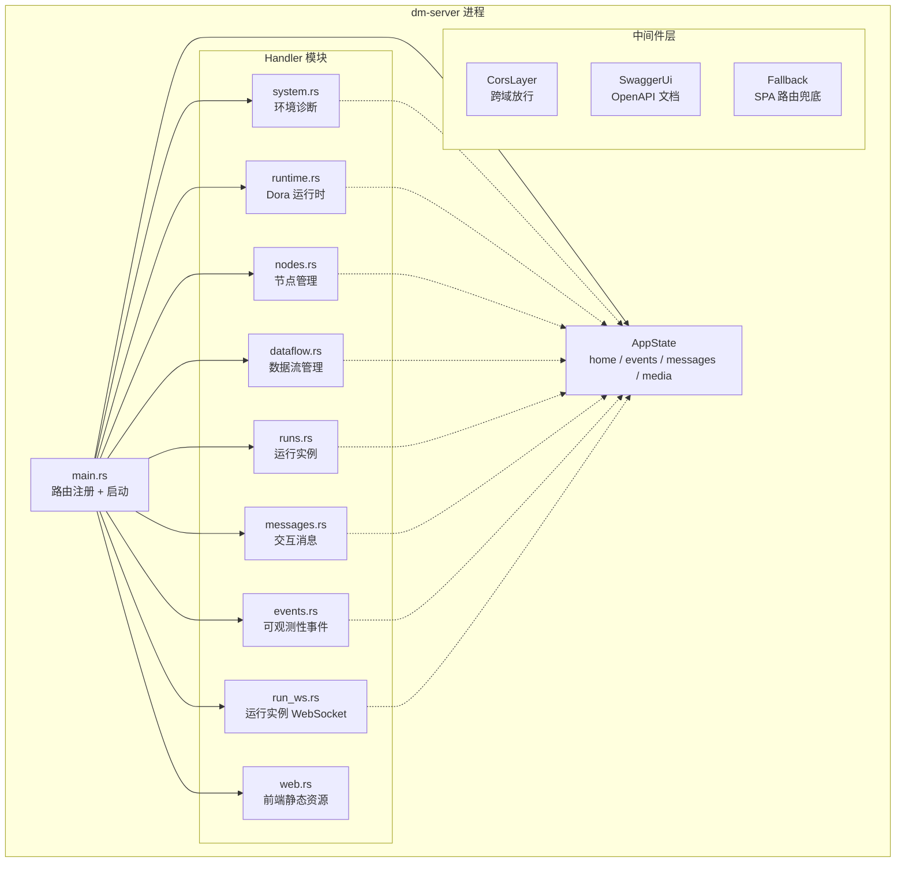

Dora Manager 的 HTTP API 层由 **dm-server** crate 承载，基于 Axum 框架构建，使用 utoipa 自动生成 OpenAPI 3.0 规范并通过 Swagger UI 提供交互式文档。所有 API 端点统一挂载在 `/api` 前缀下，服务默认监听 `127.0.0.1:3210`。本文将从架构视角完整梳理每一个路由端点、其请求/响应模式、WebSocket 协议以及 Swagger 文档的使用方式，帮助你在无需深入源码的前提下快速理解 API 全貌。

Sources: [main.rs](https://github.com/l1veIn/dora-manager/blob/master/crates/dm-server/src/main.rs#L1-L245), [Cargo.toml](https://github.com/l1veIn/dora-manager/blob/master/crates/dm-server/Cargo.toml#L1-L35)

## API 架构总览

dm-server 的 HTTP 层采用 **Handler 模块化拆分** 架构——按领域将处理函数组织到独立文件中，再通过 `handlers/mod.rs` 统一导出并 re-export 到路由注册表。整个服务依赖一个共享的 `AppState` 状态对象，通过 Axum 的 `State` 提取器注入到每个 handler。



`AppState` 持有四个关键字段：`home`（DM_HOME 目录路径）、`events`（SQLite 事件存储）、`messages`（tokio broadcast channel，用于 WebSocket 消息通知）、`media`（MediaMTX 集成运行时）。所有 handler 通过 `State(state): State<AppState>` 获取这些共享资源，无需全局变量或环境变量传递。

Sources: [state.rs](https://github.com/l1veIn/dora-manager/blob/master/crates/dm-server/src/state.rs#L1-L25), [handlers/mod.rs](https://github.com/l1veIn/dora-manager/blob/master/crates/dm-server/src/handlers/mod.rs#L1-L43)

## Swagger UI 与 OpenAPI 规范

Swagger UI 通过 **utoipa + utoipa-swagger-ui** 集成，无需手动维护 OpenAPI YAML。开发者在 handler 函数上添加 `#[utoipa::path(...)]` 宏注解，编译时自动聚合到 `ApiDoc` 结构体，生成完整的 OpenAPI JSON 规范。

**访问地址**：

| 入口 | URL | 说明 |
|------|-----|------|
| Swagger UI | `http://127.0.0.1:3210/swagger-ui/` | 交互式 API 测试界面 |
| OpenAPI JSON | `http://127.0.0.1:3210/api-docs/openapi.json` | 原始 OpenAPI 3.0 规范 |

Swagger UI 支持"Try it out"模式，可以直接在浏览器中构造请求并查看响应，非常适合调试和前端联调。所有带有 `#[utoipa::path]` 注解的端点都会自动出现在文档中，包括路径参数、查询参数、请求体的 Schema 定义。

Sources: [main.rs](https://github.com/l1veIn/dora-manager/blob/master/crates/dm-server/src/main.rs#L24-L76), [main.rs](https://github.com/l1veIn/dora-manager/blob/master/crates/dm-server/src/main.rs#L222-L223)

## 路由分组全览

dm-server 的路由按职责划分为 **6 个逻辑域**，下表给出每个域的 URL 前缀和核心能力概览。

| 路由域 | 前缀 | Handler 文件 | 核心职责 |
|--------|------|-------------|---------|
| 环境与系统 | `/api/doctor`, `/api/status`, `/api/config`, `/api/media/*` | [system.rs](https://github.com/l1veIn/dora-manager/blob/master/crates/dm-server/src/handlers/system.rs) | 健康诊断、版本管理、配置读写、媒体后端状态 |
| 运行时管理 | `/api/install`, `/api/uninstall`, `/api/use`, `/api/up`, `/api/down` | [runtime.rs](https://github.com/l1veIn/dora-manager/blob/master/crates/dm-server/src/handlers/runtime.rs) | Dora 版本安装/卸载/切换、runtime 启停 |
| 节点管理 | `/api/nodes/*` | [nodes.rs](https://github.com/l1veIn/dora-manager/blob/master/crates/dm-server/src/handlers/nodes.rs) | 节点列表、安装/导入/创建/卸载、配置读写、文件浏览 |
| 数据流管理 | `/api/dataflows/*` | [dataflow.rs](https://github.com/l1veIn/dora-manager/blob/master/crates/dm-server/src/handlers/dataflow.rs) | 数据流 CRUD、导入、版本历史、视图保存 |
| 运行实例 | `/api/runs/*` | [runs.rs](https://github.com/l1veIn/dora-manager/blob/master/crates/dm-server/src/handlers/runs.rs) | 运行实例启停、指标采集、日志查看、批量删除 |
| 交互与消息 | `/api/runs/{id}/messages/*`, `/api/runs/{id}/streams/*` | [messages.rs](https://github.com/l1veIn/dora-manager/blob/master/crates/dm-server/src/handlers/messages.rs) | 消息推送/查询、快照、流媒体描述符、WebSocket |
| 可观测事件 | `/api/events/*` | [events.rs](https://github.com/l1veIn/dora-manager/blob/master/crates/dm-server/src/handlers/events.rs) | 事件查询/计数/摄入/XES 导出 |

Sources: [main.rs](https://github.com/l1veIn/dora-manager/blob/master/crates/dm-server/src/main.rs#L96-L225)

## 环境与系统端点

这组端点用于系统自检和环境感知，前端在页面加载时通常首先调用 `/api/status` 来获取全局状态。

### 端点清单

| 方法 | 路径 | 说明 | 请求体 |
|------|------|------|--------|
| GET | `/api/doctor` | 系统健康诊断报告 | — |
| GET | `/api/versions` | 已安装的 dora 版本列表 | — |
| GET | `/api/status` | 运行时状态 + 运行实例概览 | — |
| GET | `/api/media/status` | 媒体后端（MediaMTX）状态 | — |
| POST | `/api/media/install` | 安装或解析媒体后端 | — |
| GET | `/api/config` | 读取 DM 配置（config.toml） | — |
| POST | `/api/config` | 更新 DM 配置 | `ConfigUpdate` |

`/api/doctor` 是系统级诊断入口，会检查 dora 二进制是否安装、DM_HOME 目录是否就绪等前置条件。`/api/status` 返回一个综合状态对象，包含 runtime 是否启动、当前活跃的 run 等信息。`/api/media/status` 和 `/api/media/install` 管理媒体流后端的就绪状态，对需要视频/音频流的数据流至关重要。

`ConfigUpdate` 的 Schema 定义如下：

```json
{
  "active_version": "string (可选) — 切换到的 dora 版本",
  "media": "object (可选) — 媒体后端配置"
}
```

Sources: [system.rs](https://github.com/l1veIn/dora-manager/blob/master/crates/dm-server/src/handlers/system.rs#L1-L108)

## 运行时管理端点

这组端点负责 dora runtime 的生命周期管理——安装特定版本的 dora、切换活跃版本、启动和停止 coordinator + daemon。

| 方法 | 路径 | 说明 | 请求体 |
|------|------|------|--------|
| POST | `/api/install` | 安装 dora 版本 | `InstallRequest` |
| POST | `/api/uninstall` | 卸载指定版本 | `UninstallRequest` |
| POST | `/api/use` | 切换活跃版本 | `UseRequest` |
| POST | `/api/up` | 启动 dora runtime（coordinator + daemon） | — |
| POST | `/api/down` | 停止 dora runtime | — |

关键行为：`/api/install` 接受可选的 `version` 字段，为空时安装最新版本。`/api/up` 启动 dora coordinator 和 daemon 进程。此外，dm-server 在后台启动了一个 **空闲监控任务**，每 30 秒检查一次——如果没有任何活跃的 run，会自动执行 `down` 操作以释放系统资源。

Sources: [runtime.rs](https://github.com/l1veIn/dora-manager/blob/master/crates/dm-server/src/handlers/runtime.rs#L1-L85), [main.rs](https://github.com/l1veIn/dora-manager/blob/master/crates/dm-server/src/main.rs#L234-L241)

## 节点管理端点

节点管理域提供了完整的节点生命周期操作，包括从注册表安装、从本地路径或 Git URL 导入、自定义创建，以及节点配置和文件浏览。

| 方法 | 路径 | 说明 | 请求体 |
|------|------|------|--------|
| GET | `/api/nodes` | 列出所有已安装节点 | — |
| GET | `/api/nodes/{id}` | 获取节点详情 | — |
| POST | `/api/nodes/install` | 从注册表安装节点 | `InstallNodeRequest` |
| POST | `/api/nodes/import` | 从路径或 URL 导入节点 | `ImportNodeRequest` |
| POST | `/api/nodes/create` | 创建空节点脚手架 | `CreateNodeRequest` |
| POST | `/api/nodes/uninstall` | 卸载节点 | `UninstallNodeRequest` |
| GET | `/api/nodes/{id}/readme` | 获取节点 README | — |
| GET | `/api/nodes/{id}/files` | 获取节点文件树 | — |
| GET | `/api/nodes/{id}/files/{*path}` | 获取节点文件内容 | — |
| GET | `/api/nodes/{id}/config` | 读取节点配置（dm.json） | — |
| POST | `/api/nodes/{id}/config` | 保存节点配置 | JSON Value |

`/api/nodes/import` 是一个智能端点，它会根据 `source` 字段的前缀自动判断导入方式——`https://` 或 `http://` 开头走 Git 克隆逻辑，否则视为本地路径。`id` 字段可选，不提供时会从 source 路径中推断。`/api/nodes/{id}/files` 返回一个类 Git 的文件树结构，`/api/nodes/{id}/files/{*path}` 支持通配符路径读取任意文件内容，为前端节点编辑器提供了完整的文件浏览能力。

Sources: [nodes.rs](https://github.com/l1veIn/dora-manager/blob/master/crates/dm-server/src/handlers/nodes.rs#L1-L212)

## 数据流管理端点

数据流管理域覆盖了从 YAML 创建/编辑/导入/删除到版本历史和视图持久化的完整生命周期。这组端点是前端图编辑器的核心支撑。

| 方法 | 路径 | 说明 | 请求体 |
|------|------|------|--------|
| GET | `/api/dataflows` | 列出所有数据流 | — |
| GET | `/api/dataflows/{name}` | 获取数据流 YAML 内容 | — |
| POST | `/api/dataflows/{name}` | 保存数据流 YAML | `SaveDataflowRequest` |
| POST | `/api/dataflows/import` | 批量导入数据流 | `ImportDataflowsRequest` |
| POST | `/api/dataflows/{name}/delete` | 删除数据流 | — |
| GET | `/api/dataflows/{name}/inspect` | 检视数据流（转译后详情） | — |
| GET | `/api/dataflows/{name}/meta` | 获取数据流元数据 | — |
| POST | `/api/dataflows/{name}/meta` | 保存数据流元数据 | `FlowMeta` |
| GET | `/api/dataflows/{name}/config-schema` | 获取数据流配置 Schema | — |
| GET | `/api/dataflows/{name}/history` | 获取版本历史列表 | — |
| GET | `/api/dataflows/{name}/history/{version}` | 获取特定版本 YAML | — |
| POST | `/api/dataflows/{name}/history/{version}/restore` | 恢复到指定版本 | — |
| GET | `/api/dataflows/{name}/view` | 获取可视化视图数据 | — |
| POST | `/api/dataflows/{name}/view` | 保存可视化视图数据 | JSON Value |

**版本历史机制**：每次通过 `POST /api/dataflows/{name}` 保存数据流时，系统会自动记录一个历史版本。前端可以通过 `/history` 系列端点浏览和回滚历史版本，实现数据流的时间旅行式管理。

**视图持久化**：`/view` 端点存储前端 SvelteFlow 画布的节点位置、连线样式等视觉信息，与数据流 YAML 解耦——YAML 描述逻辑拓扑，View 描述布局美学。

Sources: [dataflow.rs](https://github.com/l1veIn/dora-manager/blob/master/crates/dm-server/src/handlers/dataflow.rs#L1-L275)

## 运行实例端点

运行实例（Run）是数据流的一次执行记录。这组端点涵盖了启动、停止、查询、指标采集、日志读取和批量删除。

| 方法 | 路径 | 说明 | 请求体 / 查询参数 |
|------|------|------|--------|
| GET | `/api/runs` | 分页查询运行实例 | `?limit=&offset=&status=&search=` |
| GET | `/api/runs/active` | 获取当前活跃 run | `?metrics=true` |
| POST | `/api/runs/start` | 启动新 run | `StartRunRequest` |
| GET | `/api/runs/{id}` | 获取 run 详情 | `?include_metrics=true` |
| GET | `/api/runs/{id}/metrics` | 获取 run 指标 | — |
| POST | `/api/runs/{id}/stop` | 停止指定 run | — |
| POST | `/api/runs/delete` | 批量删除 run | `DeleteRunsRequest` |
| GET | `/api/runs/{id}/dataflow` | 获取 run 关联的原始 YAML | — |
| GET | `/api/runs/{id}/transpiled` | 获取 run 的转译后 YAML | — |
| GET | `/api/runs/{id}/view` | 获取 run 关联的视图数据 | — |
| GET | `/api/runs/{id}/logs/{node_id}` | 读取节点完整日志 | — |
| GET | `/api/runs/{id}/logs/{node_id}/tail` | 增量读取节点日志 | `?offset=` |

**启动流程的守卫逻辑**：`POST /api/runs/start` 在实际执行前会进行两项检查：(1) 如果数据流包含媒体节点（如 dm-mjpeg、dm-stream-publish），会检查媒体后端是否就绪，未就绪返回 400 错误及安装指引；(2) 自动确保 dora runtime 已启动（若未启动则自动调用 `up`）。`force` 参数控制冲突策略——为 `true` 时会先停止当前活跃的 run 再启动新的。

**停止操作的异步设计**：`POST /api/runs/{id}/stop` 采用 fire-and-forget 模式——先验证 run 存在性，然后在 tokio 后台任务中执行实际停止，HTTP 响应立即返回 `{ "status": "stopping" }`，避免前端因等待停止完成而阻塞。

Sources: [runs.rs](https://github.com/l1veIn/dora-manager/blob/master/crates/dm-server/src/handlers/runs.rs#L1-L333)

## 交互与消息端点

这组端点支撑了 **dm-server 作为交互状态唯一事实来源** 的核心架构。前端、dm-input、dm-display 都通过这些接口进行消息交换。

| 方法 | 路径 | 说明 | 关键参数 |
|------|------|------|---------|
| GET | `/api/runs/{id}/interaction` | 交互快照（streams + inputs） | — |
| POST | `/api/runs/{id}/messages` | 推送消息 | `PushMessageRequest` |
| GET | `/api/runs/{id}/messages` | 查询消息列表 | `?after_seq=&from=&tag=&limit=&desc=` |
| GET | `/api/runs/{id}/messages/snapshots` | 获取最新快照 | — |
| GET | `/api/runs/{id}/streams` | 列出流媒体描述符 | — |
| GET | `/api/runs/{id}/streams/{stream_id}` | 获取单个流描述符 | — |
| GET | `/api/runs/{id}/artifacts/{*path}` | 访问 run 产物文件 | 通配符路径 |

**消息类型与标签体系**：

| tag 值 | 用途 | payload 特征 |
|--------|------|-------------|
| `input` | 用户输入事件 | 自由格式，直接透传给 dm-input |
| `stream` | 流媒体声明 | 必须包含 `path`、`stream_id`、`kind` 字段 |
| 其他 | 自定义消息 | 可选 `file` 字段，路径会被标准化 |

**流媒体描述符**：`/streams` 端点返回的 `StreamDescriptor` 包含了流媒体的元信息（分辨率、帧率、编码格式）以及 viewer URL。当媒体后端就绪时，会自动注入 WebRTC 和 HLS 播放地址，前端可直接用于 `<video>` 标签。

Sources: [messages.rs](https://github.com/l1veIn/dora-manager/blob/master/crates/dm-server/src/handlers/messages.rs#L1-L558)

## 可观测性事件端点

事件系统基于 SQLite 存储，提供 XES 兼容的过程挖掘导出能力。

| 方法 | 路径 | 说明 | 查询参数 |
|------|------|------|---------|
| GET | `/api/events` | 查询事件列表 | `?source=&case_id=&limit=` |
| GET | `/api/events/count` | 统计事件数量 | 同上 |
| POST | `/api/events` | 摄入新事件 | `Event` JSON |
| GET | `/api/events/export` | 导出 XES 格式 | `?source=&format=xes` |

`/api/events/export` 返回 `application/xml` 格式的 XES 文件，可直接导入过程挖掘工具（如 ProM、Celonis）进行分析。

Sources: [events.rs](https://github.com/l1veIn/dora-manager/blob/master/crates/dm-server/src/handlers/events.rs#L1-L52)

## WebSocket 端点

dm-server 提供三个 WebSocket 端点，分别服务于不同的实时通信场景。

### Run WebSocket — `/api/runs/{id}/ws`

这是运行实例的 **综合实时推送通道**，通过 `notify` crate 监听日志文件变化，每秒推送指标数据。推送的消息类型包括：

| 消息类型 | 字段 | 说明 |
|---------|------|------|
| `ping` | — | 心跳包，每 10 秒一次 |
| `metrics` | `data: NodeMetrics[]` | 各节点的 CPU/内存指标 |
| `logs` | `nodeId`, `lines: string[]` | 节点日志新增行 |
| `io` | `nodeId`, `lines: string[]` | 含 `[DM-IO]` 标记的 IO 日志行 |
| `status` | `status: string` | run 状态变更通知 |

该 WebSocket 内部使用 **文件系统 watcher**（notify crate）监听日志目录变化，支持在活跃 run 和历史 run 之间自动切换日志源。活跃 run 读取 dora daemon 的实时输出目录，历史 run 读取归档日志目录。

### Messages WebSocket — `/api/runs/{id}/messages/ws`

交互消息的 **通知通道**。当有新消息通过 `POST /api/runs/{id}/messages` 写入时，broadcast channel 会通知所有订阅者。前端收到通知后应通过 HTTP 拉取最新数据，这是一个 **notify-only** 设计。

推送的消息格式：
```json
{ "run_id": "...", "seq": 42, "from": "web", "tag": "input" }
```

### Node WebSocket — `/api/runs/{id}/messages/ws/{node_id}?since=`

**dm-input 专用**的下行通道。连接建立后先 replay `since` 之后的历史消息，然后持续接收新的 input 事件。前端一般不直接使用此端点。

Sources: [run_ws.rs](https://github.com/l1veIn/dora-manager/blob/master/crates/dm-server/src/handlers/run_ws.rs#L1-L237), [messages.rs](https://github.com/l1veIn/dora-manager/blob/master/crates/dm-server/src/handlers/messages.rs#L223-L360)

## 请求/响应模式与前端通信

前端通过统一的 API 通信层 [`web/src/lib/api.ts`](https://github.com/l1veIn/dora-manager/blob/master/web/src/lib/api.ts) 与后端交互，该模块封装了 `get`、`getText`、`post`、`del` 四个基础方法，统一以 `/api` 为前缀，并在非 200 状态码时抛出异常。

**错误响应约定**：

| HTTP 状态码 | 含义 | 典型场景 |
|------------|------|---------|
| 200 | 成功 | 正常返回 JSON |
| 400 | 请求错误 | 参数缺失、配置格式错误、媒体后端未就绪 |
| 404 | 资源不存在 | 节点/数据流/run 未找到 |
| 409 | 冲突 | 已有活跃 run 运行中 |
| 500 | 服务器内部错误 | 未预期的运行时错误 |

大多数 handler 遵循统一的错误处理模式——通过 `handlers::err()` 辅助函数将 `anyhow::Error` 转为 `(500, error_message)` 响应，而业务级错误（如"节点不存在"）则返回相应的 4xx 状态码。

Sources: [api.ts](https://github.com/l1veIn/dora-manager/blob/master/web/src/lib/api.ts#L1-L33), [handlers/mod.rs](https://github.com/l1veIn/dora-manager/blob/master/crates/dm-server/src/handlers/mod.rs#L40-L42)

## 静态资源与 SPA 兜底

所有未匹配 `/api` 前缀的请求由 `web.rs` 的 `serve_web` handler 处理，它使用 `rust_embed` 将编译后的前端产物（`web/build/` 目录）嵌入到二进制中。对于未知路径返回 `index.html`（SPA 路由兜底），实现前端路由的 HTML5 History 模式支持。这意味着 **dm-server 的单二进制文件同时承载了 API 和前端**，部署时无需额外的静态文件服务器。

Sources: [web.rs](https://github.com/l1veIn/dora-manager/blob/master/crates/dm-server/src/handlers/web.rs#L1-L28), [main.rs](https://github.com/l1veIn/dora-manager/blob/master/crates/dm-server/src/main.rs#L224-L225)

## 扩展阅读

- 要了解 handler 背后的核心业务逻辑，参阅 [运行时服务：启动编排、状态刷新与指标采集](10-runtime-service)
- 要了解前端如何调用这些 API，参阅 [SvelteKit 项目结构与 API 通信层](14-sveltekit-structure)
- 要了解交互消息的完整生命周期，参阅 [交互系统：dm-input / dm-display / WebSocket 消息流](21-interaction-system)
- 要了解事件存储的底层实现，参阅 [事件系统：可观测性模型与 XES 兼容存储](11-event-system)