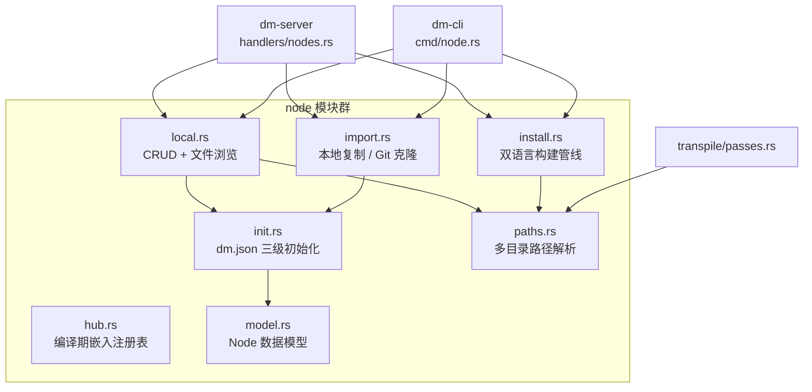
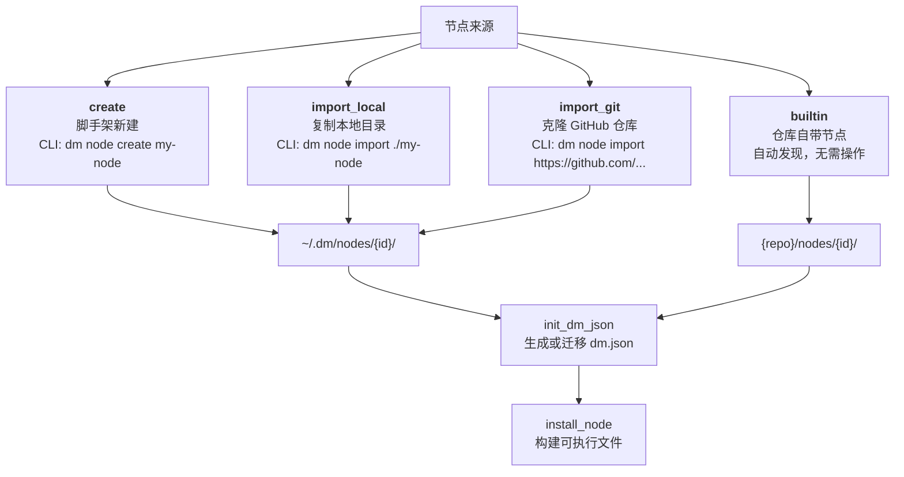
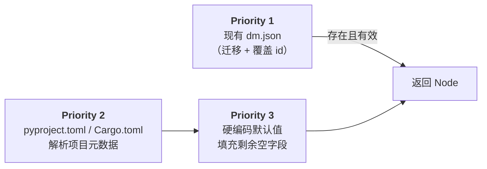
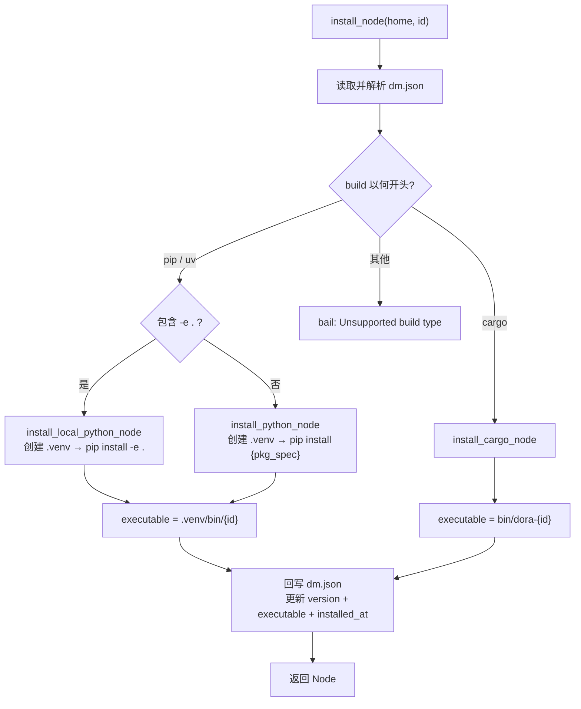
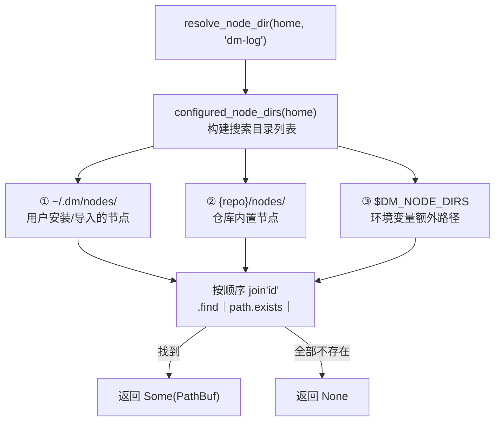

Dora Manager 的节点管理子系统位于 `dm-core/src/node/` 模块，负责从节点「被发现」到「可被执行」的完整生命周期。本文将深入剖析该系统的四大核心能力：**多来源导入**、**双语言安装管线**、**多目录路径解析**和**文件访问沙箱隔离**——这些机制共同构成了从用户声明 `node: dm-log` 到 dora 运行时执行绝对路径 `/home/user/.dm/nodes/dm-log/.venv/bin/dm-log` 的完整桥梁。

Sources: [mod.rs](https://github.com/l1veIn/dora-manager/blob/main/crates/dm-core/src/node/mod.rs#L1-L35)

## 架构总览：模块职责与数据流

节点管理由七个模块协同完成，每个模块职责单一、边界清晰：



| 模块 | 核心职责 | 对外暴露的关键函数 |
|------|----------|---------------------|
| `model.rs` | `Node` 结构体与 dm.json 序列化契约 | `Node`, `NodeSource`, `NodePort` |
| `paths.rs` | 多目录搜索链与路径解析 | `resolve_node_dir`, `resolve_dm_json_path`, `is_managed_node` |
| `init.rs` | 从 pyproject.toml/Cargo.toml 推断并生成 dm.json | `init_dm_json` |
| `import.rs` | 从外部来源（本地/GitHub）复制节点到管理目录 | `import_local`, `import_git` |
| `install.rs` | 根据 build 类型执行安装（venv/cargo） | `install_node` |
| `local.rs` | 节点列表、状态查询、文件浏览、配置读写 | `list_nodes`, `node_status`, `read_node_file` |
| `hub.rs` | 编译期嵌入的 `registry.json` 节点注册表 | `resolve_node_source`, `list_registry_nodes` |

Sources: [mod.rs](https://github.com/l1veIn/dora-manager/blob/main/crates/dm-core/src/node/mod.rs#L17-L29), [hub.rs](https://github.com/l1veIn/dora-manager/blob/main/crates/dm-core/src/node/hub.rs#L1-L98)

## Node 数据模型：dm.json 契约

`dm.json` 是节点的**唯一真相源**（single source of truth），持久化于节点目录根下。`Node` 结构体在 `model.rs` 中定义，实现了自定义的 `Serialize`（直写）和 `Deserialize`（带 legacy `dm` 字段合并）逻辑。

Node 的核心字段分为七个语义组：

| 字段组 | 关键字段 | 用途 |
|--------|----------|------|
| **标识** | `id`, `name`, `version` | 全局唯一 ID、可读名称、语义版本号 |
| **来源** | `source.build`, `source.github` | 构建命令（如 `pip install -e .`）与可选 GitHub 地址 |
| **运行时** | `executable`, `runtime.language`, `runtime.python` | 安装后的可执行文件相对路径与语言/版本标记 |
| **契约** | `ports[]`, `config_schema`, `dynamic_ports` | 端口声明（含 Schema）、配置 schema、是否允许动态端口 |
| **能力** | `capabilities[]`, `dm`（legacy） | 运行时能力声明，反序列化时自动合并 legacy `dm.bindings` |
| **展示** | `display.category`, `display.tags[]`, `maintainers[]` | 前端分类展示、标签筛选、维护者信息 |
| **文件索引** | `files.readme`, `files.entry`, `files.tests[]` | 关键文件相对路径，用于浏览器内文件查看 |

一个已安装的 Python 节点 `dm-message` 的 dm.json 典型结构如下——注意 `executable` 指向节点私有的 `.venv` 入口，`capabilities` 中既有简单标签（`"configurable"`），也有携带结构化绑定信息的详情对象：

```json
{
  "id": "dm-message",
  "version": "0.1.0",
  "source": { "build": "pip install -e ." },
  "executable": ".venv/bin/dm-message",
  "runtime": { "language": "python", "python": ">=3.10" },
  "capabilities": [
    "configurable",
    { "name": "display", "bindings": [
      { "role": "source", "port": "data", "channel": "inline", "media": ["text", "json"] }
    ]}
  ],
  "ports": [
    { "id": "data", "direction": "input", "schema": { "type": { "name": "utf8" } } }
  ]
}
```

**Legacy 兼容机制**值得特别说明：`Node` 的 `Deserialize` 实现在 [model.rs](https://github.com/l1veIn/dora-manager/blob/main/crates/dm-core/src/node/model.rs#L429-L464) 中使用了自定义逻辑。当 dm.json 包含已弃用的 `dm` 字段（旧版 `dm.bindings` 格式），`merge_legacy_dm_into_capabilities` 会按 `family` 分组将其合并到 `capabilities` 数组中，确保已有节点描述文件在新版代码中无需修改即可正常工作。

Sources: [model.rs](https://github.com/l1veIn/dora-manager/blob/main/crates/dm-core/src/node/model.rs#L217-L288), [model.rs](https://github.com/l1veIn/dora-manager/blob/main/crates/dm-core/src/node/model.rs#L466-L505), [dm-message/dm.json](https://github.com/l1veIn/dora-manager/blob/main/nodes/dm-message/dm.json#L1-L114)

## 四种来源与对应操作

节点进入 Dora Manager 管辖范围有四条路径，每条对应独立的 CLI 子命令和 HTTP API 端点：



### create：脚手架创建

`create_node` 在 `~/.dm/nodes/{id}/` 下生成一个完整的 Python 节点骨架。生成物包括三个文件：`pyproject.toml`（声明 `dora-rs >= 0.3.9` 和 `pyarrow` 依赖，注册 `[project.scripts]` 入口点）、`{module}/main.py`（包含 dora Node 事件循环模板）、`README.md`（含 YAML 使用示例）。随后调用 `init_dm_json` 生成 dm.json，构建命令推断为 `pip install -e .`（可编辑安装）。

Sources: [local.rs](https://github.com/l1veIn/dora-manager/blob/main/crates/dm-core/src/node/local.rs#L13-L86)

### import_local：本地目录导入

`import_local` 将源目录的全部内容以 `content_only` 模式（不复制目录本身，只复制其内容）复制到 `~/.dm/nodes/{id}/`，然后执行 `init_dm_json`。此操作具有两个安全前置检查：目标目录不能已存在（防止覆盖）、源路径必须是一个有效目录。CLI 层会将相对路径解析为绝对路径后再传入核心函数。

Sources: [import.rs](https://github.com/l1veIn/dora-manager/blob/main/crates/dm-core/src/node/import.rs#L21-L55), [cmd/node.rs](https://github.com/l1veIn/dora-manager/blob/main/crates/dm-cli/src/cmd/node.rs#L89-L162)

### import_git：GitHub 仓库克隆

`import_git` 支持从任意 GitHub URL 克隆节点代码，具备精巧的 **sparse-checkout** 能力。当 URL 包含子目录路径（如 `https://github.com/org/repo/tree/main/nodes/demo`）时，只克隆指定子目录而非整个仓库，大幅减少下载量。

URL 解析逻辑 `parse_github_source` 将 GitHub URL 拆解为三个组成部分：

| URL 格式 | 示例 | 解析结果 |
|----------|------|----------|
| 仓库根 | `https://github.com/acme/project` | `repo_url=acme/project.git`，无 ref/path |
| 分支+子目录 | `.../tree/release-1/examples/demo` | `git_ref=release-1`, `repo_path=examples/demo` |
| 非 GitHub 域 | `https://example.com/...` | 直接报错 `Invalid GitHub URL format` |

克隆策略使用 `--depth 1 --filter=blob:none --sparse` 实现最小化下载，对于指定分支还追加 `--branch {ref} --single-branch`。如果克隆或后续操作失败，已创建的目标目录会被自动清理（rollback on error），确保不留残留状态。

Sources: [import.rs](https://github.com/l1veIn/dora-manager/blob/main/crates/dm-core/src/node/import.rs#L58-L156), [import.rs](https://github.com/l1veIn/dora-manager/blob/main/crates/dm-core/src/node/import.rs#L178-L206)

### builtin：内置节点自动发现

项目仓库根目录下的 `nodes/` 目录包含全部内置节点（如 `dm-mjpeg`、`dm-queue`、`dora-yolo` 等），这些节点无需显式导入或安装。`paths.rs` 中的 `builtin_nodes_dir()` 通过 `CARGO_MANIFEST_DIR` 相对路径 `../../nodes` 定位到仓库的 `nodes/` 目录，在路径解析链中作为第二优先级搜索目录。此外，`hub.rs` 在编译期通过 `include_str!` 嵌入仓库根目录的 [registry.json](https://github.com/l1veIn/dora-manager/blob/main/registry.json)，提供节点 ID 到源路径的静态映射，当前包含 27 个节点条目。

Sources: [paths.rs](https://github.com/l1veIn/dora-manager/blob/main/crates/dm-core/src/node/paths.rs#L7-L9), [hub.rs](https://github.com/l1veIn/dora-manager/blob/main/crates/dm-core/src/node/hub.rs#L26-L58), [registry.json](https://github.com/l1veIn/dora-manager/blob/main/registry.json)

## init_dm_json：元数据初始化的三级优先级链

所有四条来源路径最终都汇聚到 `init_dm_json`。该函数实现了一条**三级优先级链**来填充节点元数据：



当 `dm.json` 不存在时，系统解析项目配置文件并按以下规则填充每个字段：

| 字段 | pyproject.toml 提取路径 | Cargo.toml 提取路径 | 最终默认值 |
|------|-------------------------|---------------------|------------|
| `name` | `project.name` | `package.name` | 目录 ID |
| `version` | `project.version` | `package.version`（字符串化） | 空字符串 |
| `description` | `project.description` 或 `hints.description` | `package.description` | 空字符串 |
| `source.build` | 见下表 | — | `pip install {id}` |
| `runtime.language` | `"python"` | `"rust"` | `package.json` 存在则 `"node"`，否则空 |
| `files.entry` | `{module}/main.py` → `src/{module}/main.py` → `main.py` | `src/main.rs` → `main.rs` | `None` |
| `files.config` | 扫描 `config.json/toml/yaml/yml` | 同左 | `None` |

**构建命令推断**（`infer_build_command`）的逻辑尤为精妙——它根据 `build-system.build-backend` 区分三种场景：

| build-backend | 推断的 build 命令 | 原因 |
|---------------|-------------------|------|
| `maturin` | `pip install {id}` | Rust/Python 混合项目，无法本地编译，从 PyPI 下载预编译 wheel |
| 其他 Python 后端 | `pip install -e .` | 纯 Python 项目，可编辑安装 |
| Cargo.toml 存在 | `cargo install {id}` | Rust 项目 |
| 均不存在 | `pip install {id}` | 兜底：假定 PyPI 上有同名包 |

Sources: [init.rs](https://github.com/l1veIn/dora-manager/blob/main/crates/dm-core/src/node/init.rs#L21-L114), [init.rs](https://github.com/l1veIn/dora-manager/blob/main/crates/dm-core/src/node/init.rs#L228-L250), [init.rs](https://github.com/l1veIn/dora-manager/blob/main/crates/dm-core/src/node/init.rs#L271-L291)

## 节点安装：双语言构建管线

`install_node` 是节点从「源码存在」到「可执行」的关键跃迁。它读取 dm.json，根据 `source.build` 字段的首个关键字分派到不同的安装路径：



### Python 安装沙箱：per-node .venv

Python 节点的核心隔离策略是**每个节点拥有独立虚拟环境**。安装流程分为四步：

1. **清理旧 venv**：如果 `.venv` 已存在，先 `remove_dir_all` 删除——这避免了 `uv venv` 在已有目录上的交互式提示阻塞安装流程
2. **创建 venv**：优先使用 `uv venv`（Rust 实现的极速虚拟环境工具），回退到 `python3 -m venv`
3. **安装依赖**：本地可编辑模式（`build` 含 `-e .`）使用 `uv pip install -e .`；包模式使用 `uv pip install {package_spec}`——其中 `package_spec` 从 build 命令尾部提取，或按 `dora-{id}` 命名约定推断
4. **提取版本号**：安装完成后，通过虚拟环境中的 Python 执行 `importlib.metadata.version('{pkg}')` 获取真实安装版本

安装完成后 `executable` 被设为 `.venv/bin/{id}`（Unix）或 `.venv/Scripts/{id}.exe`（Windows），指向 `pyproject.toml` 中 `[project.scripts]` 声明的入口点函数。

Sources: [install.rs](https://github.com/l1veIn/dora-manager/blob/main/crates/dm-core/src/node/install.rs#L11-L75), [install.rs](https://github.com/l1veIn/dora-manager/blob/main/crates/dm-core/src/node/install.rs#L77-L133), [install.rs](https://github.com/l1veIn/dora-manager/blob/main/crates/dm-core/src/node/install.rs#L135-L194)

### Rust 安装沙箱：per-node bin/

Rust 节点使用 `cargo install --root {node_dir}` 将编译产物输出到节点目录下的 `bin/` 子目录。构建策略分两种情况：如果 `build` 字段包含 `--path .`，在节点目录内执行本地编译；否则从 crates.io 安装 `dora-{id}` 包。可执行文件统一命名为 `bin/dora-{id}`——对于非 `dora-` 前缀的节点 ID 会自动补齐前缀，确保与 dora 生态命名约定一致。

安装前会检查 `cargo --version` 是否可用，不可用时给出明确的错误提示 `Cargo is not installed. Please install Rust first.`。

Sources: [install.rs](https://github.com/l1veIn/dora-manager/blob/main/crates/dm-core/src/node/install.rs#L235-L274)

### 安装后的两种目录布局对比

| 特征 | Python 节点 | Rust 节点 |
|------|-------------|-----------|
| 沙箱目录 | `{node_dir}/.venv/` | `{node_dir}/bin/` |
| 可执行路径 | `.venv/bin/{id}` | `bin/dora-{id}` |
| 依赖隔离 | venv 级别，完全隔离 | 编译期链接，无运行时依赖 |
| 版本获取 | `importlib.metadata.version()` | 当前返回 `"unknown"` |
| 重建机制 | 删除 `.venv` 后重新安装 | 删除 `bin/` 后重新编译 |

Sources: [install.rs](https://github.com/l1veIn/dora-manager/blob/main/crates/dm-core/src/node/install.rs#L40-L58)

## 多目录路径解析：三层搜索链

路径解析是连接「节点管理」和「数据流执行」的核心桥梁。`resolve_node_dir` 实现了一条**有序搜索链**，按优先级在多个候选目录中查找节点：



搜索链由 `configured_node_dirs` 构建，包含三个层级：

| 优先级 | 目录来源 | 路径 | 特性 |
|--------|----------|------|------|
| 1 | `nodes_dir(home)` | `~/.dm/nodes/` | 可写，支持 `uninstall` 删除 |
| 2 | `builtin_nodes_dir()` | `{repo}/nodes/` | 只读，不可通过 `uninstall` 删除 |
| 3 | `DM_NODE_DIRS` 环境变量 | 用户自定义路径 | 支持多目录（系统路径分隔符分隔） |

`push_unique` 辅助函数确保同一绝对路径不会重复出现在搜索列表中。在此基础上，系统提供了一组语义明确的基础函数：

- **`resolve_node_dir(home, id)`**：在三层搜索链中查找，返回第一个存在的 `dir/id/` 路径
- **`resolve_dm_json_path(home, id)`**：在找到的节点目录后追加 `dm.json`
- **`is_managed_node(home, id)`**：仅检查第一层级（`~/.dm/nodes/{id}/`），用于区分「可卸载节点」和「不可卸载的内置节点」

`list_nodes` 遍历所有搜索目录并使用 `BTreeSet` 去重——当多个目录包含同名节点时，只采纳第一个出现的。这保证了**优先级遮蔽**语义：用户安装的节点可以覆盖同名内置节点，而不会产生冲突。

Sources: [paths.rs](https://github.com/l1veIn/dora-manager/blob/main/crates/dm-core/src/node/paths.rs#L1-L53), [local.rs](https://github.com/l1veIn/dora-manager/blob/main/crates/dm-core/src/node/local.rs#L88-L136), [local.rs](https://github.com/l1veIn/dora-manager/blob/main/crates/dm-core/src/node/local.rs#L138-L163)

## 文件访问安全：路径遍历防护

节点支持通过 HTTP API 浏览其目录内的文件（文件树列表 + 文件内容读取），这引入了路径遍历（path traversal）攻击的风险。`resolve_safe_node_file` 在 [local.rs](https://github.com/l1veIn/dora-manager/blob/main/crates/dm-core/src/node/local.rs#L291-L317) 中实现了两层纵深防护：

**第一层：组件白名单校验。** 遍历请求路径的每个 `std::path::Component`，只允许 `Normal`（普通文件名）和 `CurDir`（`.`）。一旦遇到 `ParentDir`（`..`）、`RootDir`（`/`）或 `Prefix`（Windows 盘符），立即拒绝并返回错误。此外，空路径和绝对路径也会被直接拒绝。

**第二层：规范化前缀校验。** 在 `root.join(requested)` 后对结果调用 `canonicalize()`（解析符号链接和 `.`），然后验证规范化后的绝对路径是否仍以节点根目录为前缀。这堵死了符号链接逃逸等绕过第一层检查的攻击向量。

```rust
// 核心防护逻辑（简化示意）
let candidate = root.join(requested);
let resolved = candidate.canonicalize()?;
if !resolved.starts_with(root) {
    bail!("Invalid node file path");
}
```

此外，`collect_node_files` 在构建文件树时过滤掉了 13 种常见的非内容目录，包括 `.git`、`.venv`、`node_modules`、`target`、`__pycache__` 等，确保浏览器只展示有意义的源码文件。

Sources: [local.rs](https://github.com/l1veIn/dora-manager/blob/main/crates/dm-core/src/node/local.rs#L261-L336)

## 转译管线中的节点解析

在 [数据流转译器：多 Pass 管线与四层配置合并](08-transpiler) 中，**Pass 2: resolve_paths** 是节点管理系统的核心消费方。它将用户在 YAML 中声明的 `node: dm-log` 转换为 dora 运行时所需的绝对 `path:`。

解析过程分为四步：

1. 调用 `resolve_node_dir(home, &node_id)` 查找节点目录
2. 调用 `resolve_dm_json_path(home, &node_id)` 定位元数据文件
3. 读取并反序列化 dm.json 获取 `executable` 字段
4. 拼接 `node_cache_dir.join(&meta.executable)` 得到绝对路径

诊断策略采用**收集式**（非短路式）——即使某个节点解析失败，管线仍继续处理其余节点，最终一次性报告所有问题：

| 诊断类型 | 含义 | 触发条件 |
|----------|------|----------|
| `NodeNotInstalled` | 节点目录不存在 | `resolve_node_dir` 返回 `None` |
| `MetadataUnreadable` | dm.json 缺失或格式错误 | 文件不存在或反序列化失败 |
| `MissingExecutable` | 节点尚未安装 | `executable` 字段为空字符串 |

当节点无法解析时，转译器不会中止，而是在 emit 阶段保留原始 `node:` 字段——让 dora 运行时给出更精确的错误提示，而不是在转译阶段就丢失上下文。

Sources: [passes.rs](https://github.com/l1veIn/dora-manager/blob/main/crates/dm-core/src/dataflow/transpile/passes.rs#L277-L346)

## 运行时沙箱与环境注入

节点的沙箱隔离体现在三个维度：

**依赖隔离**：每个 Python 节点拥有独立的 `.venv`，每个 Rust 节点拥有独立的 `bin/`。不同节点可以依赖不同版本的同一库，互不冲突。安装时如果旧 venv 存在则先删除再重建，确保干净状态。

**环境变量注入**：转译管线的 Pass 4 `inject_runtime_env` 为每个受管节点注入三个标准环境变量：

| 环境变量 | 值示例 | 用途 |
|----------|--------|------|
| `DM_RUN_ID` | `a1b2c3d4-...` | 当前运行实例唯一标识 |
| `DM_NODE_ID` | `my_detector` | 节点在数据流 YAML 中的 ID |
| `DM_RUN_OUT_DIR` | `~/.dm/runs/{id}/out/` | 运行产出物写入目录 |

这些变量让节点无需硬编码任何基础设施地址，即可通过 `DM_RUN_OUT_DIR` 写入产出物、通过 `DM_NODE_ID` 标识自身身份。

**文件系统边界**：文件浏览 API 的 `resolve_safe_node_file` 将节点目录作为天然的沙箱边界，任何试图越界的文件访问请求都会被拒绝。

Sources: [passes.rs](https://github.com/l1veIn/dora-manager/blob/main/crates/dm-core/src/dataflow/transpile/passes.rs#L427-L450), [install.rs](https://github.com/l1veIn/dora-manager/blob/main/crates/dm-core/src/node/install.rs#L30-L44)

## 未来演进：预编译二进制分发

当前安装管线要求用户本地安装对应语言的工具链（Python/uv 或 Rust/cargo），Rust 节点首次编译可能需要 2-5 分钟。设计文档 [dm-node-install.md](https://github.com/l1veIn/dora-manager/blob/main/docs/design/dm-node-install.md#L1-L118) 描绘了参考 `cargo-binstall` 的**预编译二进制优先**策略：

1. 在 dm.json 中新增 `source.binary` 字段（含 GitHub 仓库和 asset 命名模式）
2. 安装时检测当前平台 target triple（如 `aarch64-apple-darwin`）
3. 优先从 GitHub Releases 下载匹配的预编译二进制（秒级完成）
4. 找不到预编译版本时 fallback 到现有的本地编译路径

| 阶段 | 内容 | 用户体验 |
|------|------|----------|
| **当前** | 纯 `cargo install` / `uv pip install` | 需要工具链，能跑 |
| **Phase 1** | GitHub Actions 多平台 CI → Release assets | 构建侧就绪 |
| **Phase 2** | `install_node` 加预编译下载逻辑 + fallback | 秒级安装，无工具链要求 |
| **Phase 3** | Python 节点也支持 PyInstaller 预编译 | 统一安装体验 |

Sources: [dm-node-install.md](https://github.com/l1veIn/dora-manager/blob/main/docs/design/dm-node-install.md#L1-L118)

## 延伸阅读

- [节点（Node）：dm.json 契约与可执行单元](04-jie-dian-node-dm-json-qi-yue-yu-ke-zhi-xing-dan-yuan) — 节点概念的面向用户入门
- [数据流转译器：多 Pass 管线与四层配置合并](08-shu-ju-liu-zhuan-yi-qi-transpiler-duo-pass-guan-xian-yu-si-ceng-pei-zhi-he-bing) — 节点路径解析在转译管线中的完整位置
- [运行时服务：启动编排、状态刷新与 CPU/内存指标采集](13-yun-xing-shi-fu-wu-qi-dong-bian-pai-zhuang-tai-shua-xin-yu-cpu-nei-cun-zhi-biao-cai-ji) — 运行实例如何消费已解析的节点路径
- [内置节点总览：从媒体采集到 AI 推理](19-nei-zhi-jie-dian-zong-lan-cong-mei-ti-cai-ji-dao-ai-tui-li) — 内置节点的功能分类概览
- [Port Schema 与端口类型校验](20-port-schema-yu-duan-kou-lei-xing-xiao-yan) — 节点端口声明的 Arrow 类型系统