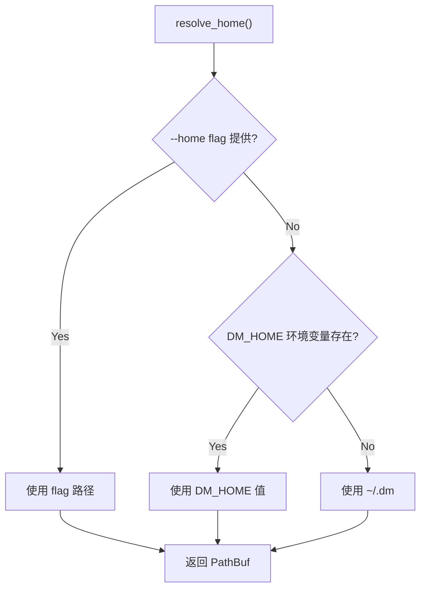
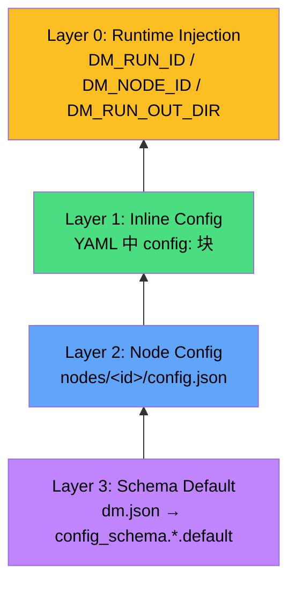
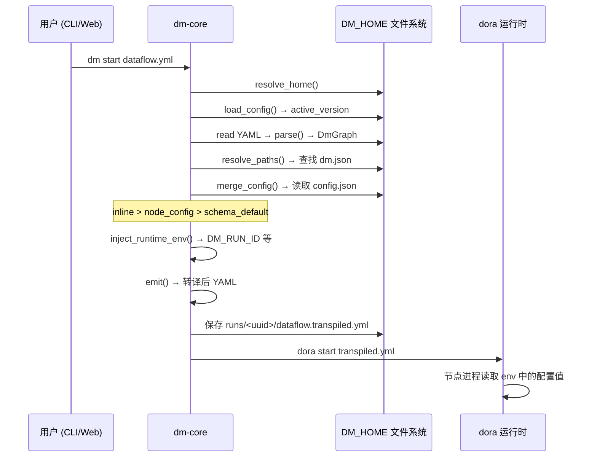

Dora Manager 的所有持久化状态——从 dora 二进制版本、节点安装、数据流项目、运行实例到事件日志——全部收敛于一个根目录 **DM_HOME**。这个设计哲学将「安装即配置」的零散问题收束为一个清晰的单点管理：`resolve_home()` 函数按照 `--home flag > DM_HOME 环境变量 > ~/.dm 默认值` 的三级优先链解析出根路径，随后所有子系统（节点管理、数据流转译、运行时编排、事件存储）均以此为锚点派生子目录。本文将系统性地解析 DM_HOME 的完整目录拓扑、全局配置文件 `config.toml` 的字段语义、四层配置合并管线如何将配置从 schema 默认值逐层覆盖到运行时环境变量，以及开发者如何通过环境变量和 API 动态调整配置。

Sources: [config.rs](https://github.com/l1veIn/dora-manager/blob/master/crates/dm-core/src/config.rs#L105-L118)

## DM_HOME 解析：三级优先链

`resolve_home()` 是整个配置体系的入口函数。它的解析逻辑严格遵循以下优先级：

| 优先级 | 来源 | 适用场景 |
|---|---|---|
| 1（最高） | `--home` CLI 标志 | CI/CD 流水线、自动化测试隔离 |
| 2 | `DM_HOME` 环境变量 | 开发环境持久化覆盖、多实例并行 |
| 3（最低） | `~/.dm`（`dirs::home_dir()`） | 默认行为，零配置即用 |



在 CLI 侧，`clap` 解析器通过 `#[arg(long, global = true)]` 将 `--home` 标志注入 `Cli` 结构体，随后在 `main()` 中通过 `dm_core::config::resolve_home(cli.home)` 将解析结果向下传递给所有子命令。在 dm-server 侧，服务器启动时调用 `resolve_home(None)` 走环境变量或默认路径。这意味着 **服务端不支持 `--home` 标志**——若需隔离服务器实例，应使用 `DM_HOME` 环境变量。

Sources: [config.rs](https://github.com/l1veIn/dora-manager/blob/master/crates/dm-core/src/config.rs#L105-L118), [main.rs (CLI)](https://github.com/l1veIn/dora-manager/blob/master/crates/dm-cli/src/main.rs#L17-L28), [main.rs (CLI)](https://github.com/l1veIn/dora-manager/blob/master/crates/dm-cli/src/main.rs#L178-L181), [main.rs (Server)](https://github.com/l1veIn/dora-manager/blob/master/crates/dm-server/src/main.rs#L79-L80)

## DM_HOME 目录结构全景

DM_HOME 并非在安装时一次性创建完整目录树，而是由各子系统按需（lazy-create）建立子目录。以下是一个经过完整使用后的典型目录结构：

```
~/.dm/                              ← DM_HOME 根目录
├── config.toml                     ← 全局配置 (DmConfig)
├── active                          ← 当前活跃的 dora 版本标识
├── versions/                       ← 已安装的 dora 运行时
│   └── 0.4.1/
│       └── dora                    ← 可执行二进制 (Windows: dora.exe)
├── dataflows/                      ← 已导入的数据流项目
│   └── system-test-full/
│       ├── dataflow.yml            ← YAML 拓扑定义
│       ├── flow.json               ← 项目元数据 (FlowMeta)
│       ├── view.json               ← 可视化编辑器布局
│       ├── config.json             ← 数据流级配置覆盖
│       └── .history/               ← 版本快照历史
│           └── 20250101T120000Z.yml
├── nodes/                          ← 已安装的管理节点
│   └── dm-microphone/
│       ├── dm.json                 ← 节点元数据与配置 schema
│       ├── config.json             ← 节点级配置覆盖
│       ├── pyproject.toml          ← Python 构建定义
│       └── dm_microphone/          ← 源码/构建产物
├── runs/                           ← 运行实例历史
│   └── <uuid>/
│       ├── run.json                ← 运行元数据 (RunInstance)
│       ├── dataflow.yml            ← 运行时数据流快照
│       ├── dataflow.transpiled.yml ← 转译后的 dora YAML
│       ├── view.json               ← 编辑器布局快照
│       ├── logs/                   ← 节点日志 (如 microphone.log)
│       └── out/                    ← 节点输出产物
└── events.db                       ← SQLite 事件存储 (WAL 模式)
```

每个子系统的路径解析均以纯函数形式实现，接受 `home: &Path` 参数而非全局状态，确保了可测试性和隔离性。以下是关键路径函数的映射关系：

| 子系统 | 路径函数 | 目标路径 | 职责 |
|---|---|---|---|
| 全局配置 | `config_path()` | `home/config.toml` | DmConfig 持久化 |
| 版本管理 | `versions_dir()` | `home/versions` | dora 二进制存放 |
| 活跃链接 | `active_link()` | `home/active` | 当前版本标识 |
| 节点管理 | `nodes_dir()` | `home/nodes` | 托管节点目录 |
| 数据流 | `dataflows_dir()` | `home/dataflows` | 项目 YAML + 元数据 |
| 运行实例 | `runs_dir()` | `home/runs` | 运行历史与日志 |
| 事件存储 | `EventStore::open()` | `home/events.db` | SQLite 可观测性 |

Sources: [paths.rs (dataflow)](https://github.com/l1veIn/dora-manager/blob/master/crates/dm-core/src/dataflow/paths.rs#L1-L36), [paths.rs (node)](https://github.com/l1veIn/dora-manager/blob/master/crates/dm-core/src/node/paths.rs#L1-L27), [repo.rs (runs)](https://github.com/l1veIn/dora-manager/blob/master/crates/dm-core/src/runs/repo.rs#L9-L48), [store.rs (events)](https://github.com/l1veIn/dora-manager/blob/master/crates/dm-core/src/events/store.rs#L14-L44), [config.rs](https://github.com/l1veIn/dora-manager/blob/master/crates/dm-core/src/config.rs#L120-L145)

## config.toml：全局配置模型

`config.toml` 是 DM_HOME 根目录下的唯一全局配置文件，使用 TOML 格式序列化 `DmConfig` 结构体。它的设计遵循 **渐进式配置** 原则：文件不存在时返回 `DmConfig::default()`，所有字段均提供合理默认值，无需手动创建。

### DmConfig 完整字段

```toml
# 当前激活的 dora 版本标识 (如 "0.4.1")，None 表示未安装
active_version = "0.4.1"

[media]
# 是否启用媒体后端（流媒体支持）
enabled = false
# 后端类型，目前仅支持 "media_mtx"
backend = "media_mtx"

[media.mediamtx]
# mediamtx 二进制路径 (None = 自动下载)
path = "/usr/local/bin/mediamtx"
# 指定版本 (None = 最新版)
version = "1.11.3"
# 是否自动下载 mediamtx
auto_download = true
# API 端口 (mediamtx 管理接口)
api_port = 9997
# RTSP 端口 (流媒体推送/拉取)
rtsp_port = 8554
# HLS 端口 (HTTP 直播流)
hls_port = 8888
# WebRTC 端口 (低延迟浏览器流)
webrtc_port = 8889
# 监听地址 (通常为 127.0.0.1)
host = "127.0.0.1"
# 公网访问地址 (部署场景, 覆盖 host)
public_host = "192.168.1.100"
# 完整的公网 WebRTC URL (覆盖 host:port 组合)
public_webrtc_url = "http://192.168.1.100:8889"
# 完整的公网 HLS URL
public_hls_url = "http://192.168.1.100:8888"
```

### 配置加载与持久化

`load_config()` 和 `save_config()` 构成配置 I/O 的完整闭环。加载时，若文件不存在则返回默认实例；保存时，`toml::to_string_pretty()` 生成人类可读的 TOML，同时 `create_dir_all()` 确保父目录存在。dm-server 通过 `GET /api/config` 和 `POST /api/config` 端点暴露在线配置读写能力。

Sources: [config.rs](https://github.com/l1veIn/dora-manager/blob/master/crates/dm-core/src/config.rs#L6-L103), [config.rs](https://github.com/l1veIn/dora-manager/blob/master/crates/dm-core/src/config.rs#L147-L166), [system.rs](https://github.com/l1veIn/dora-manager/blob/master/crates/dm-server/src/handlers/system.rs#L58-L107)

### MediaConfig 的运行时作用

`MediaConfig` 在 dm-server 启动时被加载并注入 `MediaRuntime`。当 `media.enabled = true` 时，服务器会初始化 mediamtx 进程作为流媒体后端，使用配置中的端口号生成 mediamtx 配置文件。`public_host`、`public_webrtc_url`、`public_hls_url` 字段专用于**非本地部署场景**，允许前端通过公网地址访问流媒体端点。

Sources: [media.rs](https://github.com/l1veIn/dora-manager/blob/master/crates/dm-server/src/services/media.rs#L77-L166), [main.rs (Server)](https://github.com/l1veIn/dora-manager/blob/master/crates/dm-server/src/main.rs#L79-L87)

## 四层配置合并管线

Dora Manager 的配置体系并非扁平的 key-value 存储，而是一个**从 schema 定义到运行时注入的四层合并管线**。这一管线在数据流转译（transpile）过程中执行，确保每个受管节点的环境变量由多层配置源按优先级叠加而成。



### 合并逻辑详解

| 优先级 | 层级 | 来源文件 | 作用域 | 示例 |
|---|---|---|---|---|
| 1（最高） | Inline Config | YAML `config:` 块 | 单个数据流实例 | `config: { sample_rate: 16000 }` |
| 2 | Node Config | `nodes/&lt;id&gt;/config.json` | 该节点的所有使用场景 | `{"sample_rate": 48000}` |
| 3 | Schema Default | `dm.json` → `config_schema` | 节点定义时的默认值 | `"default": 44100` |
| 4（运行时） | Runtime Injection | 转译器自动注入 | 所有受管节点 | `DM_RUN_ID`, `DM_NODE_ID` |

`merge_config` pass 的核心逻辑在 `passes.rs` 中实现：对 `config_schema` 中声明的每个字段，按 `inline_config > node_config_defaults > field_schema.default` 的顺序取第一个非 `null` 值，然后将其写入 `merged_env` 映射表。字段的 `env` 键指定了环境变量名称，最终在 `emit` pass 中以 `env:` 块的形式输出到转译后的 YAML。

Sources: [passes.rs](https://github.com/l1veIn/dora-manager/blob/master/crates/dm-core/src/dataflow/transpile/passes.rs#L343-L416), [passes.rs](https://github.com/l1veIn/dora-manager/blob/master/crates/dm-core/src/dataflow/transpile/passes.rs#L418-L449), [local.rs](https://github.com/l1veIn/dora-manager/blob/master/crates/dm-core/src/node/local.rs#L173-L220)

### config.json：节点级配置持久化

每个受管节点目录下的 `config.json` 是用户通过前端或 API 保存的**节点级配置覆盖**。它的值介于 schema 默认值和 inline config 之间——同一节点在不同数据流中可以使用不同 inline 值，但 `config.json` 为该节点提供了一个跨数据流的持久化默认值。

```json
// nodes/dm-microphone/config.json
{
  "sample_rate": 48000,
  "channels": 1
}
```

`get_node_config()` 在读取时自动处理文件不存在的情况（返回空对象 `{}`），`save_node_config()` 则通过 `serde_json::to_string_pretty()` 写入格式化的 JSON。前端通过 `GET/POST /api/nodes/{id}/config` 端点进行交互。

Sources: [local.rs](https://github.com/l1veIn/dora-manager/blob/master/crates/dm-core/src/node/local.rs#L173-L220)

### 配置聚合 API：inspect_config

`inspect_config()` 函数实现了**配置聚合查询**，它对数据流中每个受管节点扫描三层配置源，返回一个 `DataflowConfigAggregation` 结构，包含每个字段的 `inline_value`、`node_value`、`default_value`、`effective_value` 和 `effective_source`。这一 API 支撑了前端配置面板的「来源追溯」功能，让用户清晰看到每个配置值的生效来源。

| effective_source | 含义 |
|---|---|
| `"inline"` | 来自 YAML `config:` 块 |
| `"node"` | 来自 `config.json` 持久化配置 |
| `"default"` | 来自 `dm.json` 的 schema default |
| `"unset"` | 三层均未提供值 |

Sources: [service.rs](https://github.com/l1veIn/dora-manager/blob/master/crates/dm-core/src/dataflow/service.rs#L101-L215), [model.rs](https://github.com/l1veIn/dora-manager/blob/master/crates/dm-core/src/dataflow/model.rs#L136-L167)

## 节点搜索路径：DM_NODE_DIRS

节点的路径解析不仅限于 `DM_HOME/nodes/`，而是通过 `configured_node_dirs()` 构建一个**有序搜索链**：

1. `DM_HOME/nodes/` — 用户安装/导入的节点
2. `builtin_nodes_dir()` — 项目仓库 `nodes/` 目录（内置节点）
3. `DM_NODE_DIRS` 环境变量中的额外路径（PATH 分隔符分隔）

`resolve_node_dir()` 遍历搜索链，返回第一个包含目标节点 ID 的目录。`push_unique()` 确保不会因为路径重复而浪费搜索。这个机制让开发者可以在不修改 DM_HOME 的情况下，通过环境变量挂载外部节点仓库。

Sources: [paths.rs (node)](https://github.com/l1veIn/dora-manager/blob/master/crates/dm-core/src/node/paths.rs#L3-L52)

## 运行时环境变量注入

转译管线的最后一个 pass `inject_runtime_env()` 为每个受管节点注入四个**运行时环境变量**，这些变量不在任何配置文件中声明，而是由转译器根据运行上下文动态生成：

| 环境变量 | 来源 | 用途 |
|---|---|---|
| `DM_RUN_ID` | UUID v4 自动生成 | 运行实例唯一标识 |
| `DM_NODE_ID` | YAML 中的 `id` 字段 | 节点在数据流中的标识 |
| `DM_RUN_OUT_DIR` | `DM_HOME/runs/<run_id>/out` | 节点输出产物目录 |
| `DM_SERVER_URL` | 固定值 `http://127.0.0.1:3210` | dm-server 交互端点 |

这些变量使节点能够在运行时感知自身上下文——例如 `dm-save` 节点通过 `DM_RUN_OUT_DIR` 知道将文件写入何处，`dm-input` 节点通过 `DM_SERVER_URL` 与前端交互。

Sources: [passes.rs](https://github.com/l1veIn/dora-manager/blob/master/crates/dm-core/src/dataflow/transpile/passes.rs#L422-L449)

## 事件存储：events.db

`EventStore` 在 DM_HOME 根目录下维护一个 SQLite 数据库 `events.db`，启用 WAL（Write-Ahead Logging）模式以支持并发读写。它记录所有操作事件（节点安装、数据流转译、运行启停等），为 [事件系统：可观测性模型与 XES 兼容存储](11-event-system) 提供底层数据支撑。数据库在首次调用 `EventStore::open()` 时自动创建并执行 schema 初始化。

Sources: [store.rs](https://github.com/l1veIn/dora-manager/blob/master/crates/dm-core/src/events/store.rs#L14-L44)

## 配置 API 端点

dm-server 暴露两个端点用于运行时配置管理：

| 方法 | 路径 | 行为 |
|---|---|---|
| `GET` | `/api/config` | 读取当前 `config.toml`，返回 JSON |
| `POST` | `/api/config` | 合并更新（`active_version` 和/或 `media`），写回 `config.toml` |

`POST /api/config` 接受 `ConfigUpdate` 请求体，执行 **读取-合并-写回**（read-modify-write）语义：先加载现有配置，然后仅覆盖请求中提供的字段，最后序列化回磁盘。这避免了并发写入时的全量覆盖问题。

Sources: [system.rs](https://github.com/l1veIn/dora-manager/blob/master/crates/dm-server/src/handlers/system.rs#L58-L107)

## 完整配置流：从用户操作到节点进程



Sources: [transpile/mod.rs](https://github.com/l1veIn/dora-manager/blob/master/crates/dm-core/src/dataflow/transpile/mod.rs#L31-L81), [config.rs](https://github.com/l1veIn/dora-manager/blob/master/crates/dm-core/src/config.rs#L147-L166)

## 延伸阅读

- **四层配置合并的转译管线细节**：参见 [数据流转译器：多 Pass 管线与四层配置合并](08-transpiler)
- **节点 dm.json 的完整字段定义**：参见 [开发自定义节点：dm.json 完整字段参考](22-custom-node-guide)
- **运行实例的生命周期与状态管理**：参见 [运行实例（Run）：生命周期、状态与指标追踪](06-run-lifecycle)
- **事件存储的查询与导出**：参见 [事件系统：可观测性模型与 XES 兼容存储](11-event-system)