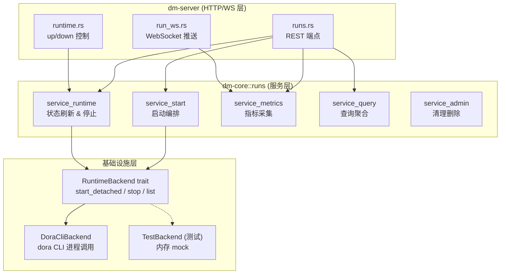
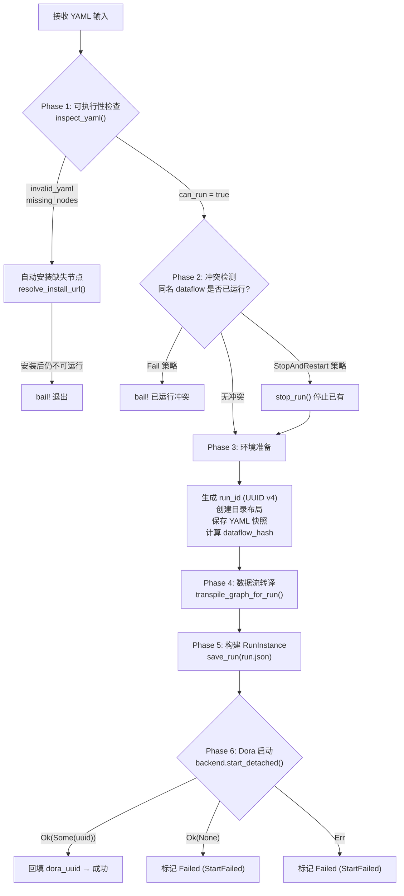
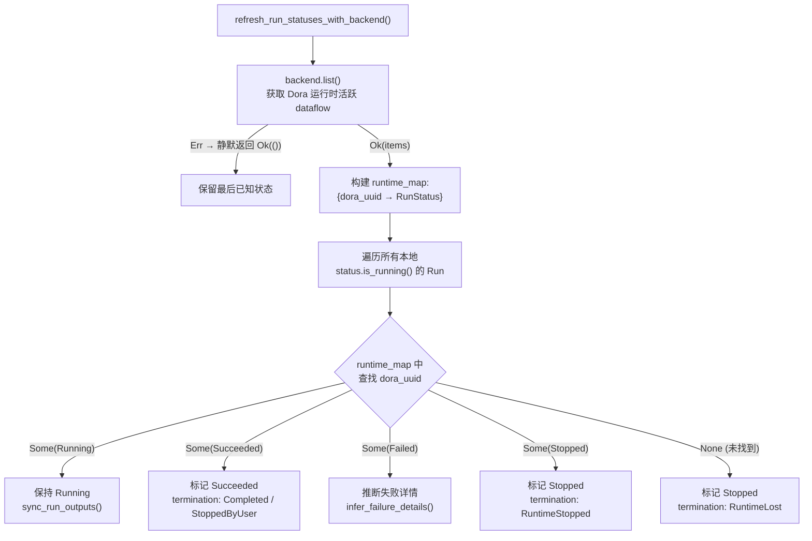

运行时服务（Runtime Service）是 Dora Manager 后端的核心引擎，负责将一份 YAML 数据流拓扑转化为一个受管理的 **运行实例（Run）**，并持续追踪其状态直至终止。该服务横跨 `dm-core` 的 `runs` 模块与 `dm-server` 的 HTTP/WebSocket 层，构成一个完整的"启动 → 监控 → 停止 → 归档"生命周期管理链路。本文将从架构分层、数据模型、启动编排、状态同步、指标采集和实时推送六个维度展开深入分析。

Sources: [mod.rs](https://github.com/l1veIn/dora-manager/blob/main/crates/dm-core/src/runs/mod.rs#L1-L27), [service.rs](https://github.com/l1veIn/dora-manager/blob/main/crates/dm-core/src/runs/service.rs#L1-L47)

## 架构总览：三层分离与 Backend 抽象

运行时服务的代码组织遵循 **职责分层** 原则：`model` 层定义纯数据结构，`repo` 层封装文件系统 I/O，`service` 层组合业务逻辑。这种分层通过 `service.rs` 这个门面文件（facade）统一导出——门面内部进一步拆分为五个 `#[path]` 模块（`service_start`、`service_runtime`、`service_metrics`、`service_query`、`service_admin`），外部调用者只需面对一组简洁的公共函数签名。

在所有分层之上，存在一个关键的设计抽象——**`RuntimeBackend` trait**。该 trait 将与 Dora CLI 二进制的所有交互（启动、停止、列举）封装为可替换的后端接口，使得核心业务逻辑可以在测试中被 `TestBackend` mock，而在生产环境中使用 `DoraCliBackend`。这种"trait 抽象 + 参数注入"的模式贯穿整个 `runs` 模块。



Sources: [runtime.rs](https://github.com/l1veIn/dora-manager/blob/main/crates/dm-core/src/runs/runtime.rs#L24-L34), [service.rs](https://github.com/l1veIn/dora-manager/blob/main/crates/dm-core/src/runs/service.rs#L1-L47)

## RunInstance 数据模型与文件系统布局

每个运行实例在磁盘上对应 `$DM_HOME/runs/<run_id>/` 目录，内部包含完整的状态快照、转译产物、日志与输出文件。`RunInstance` 是核心持久化模型，以 JSON 格式存储为 `run.json`。持久化操作通过"写临时文件 + 原子 rename"的方式保证数据完整性——`save_run()` 先写入 `run.json.<pid>.tmp`，再通过 `fs::rename` 原子替换，避免并发写入导致的数据损坏。

**文件系统布局**：

| 路径 | 用途 |
|---|---|
| `run.json` | 运行实例元数据（状态、时间戳、dora_uuid 等） |
| `dataflow.yml` | 原始 YAML 快照（启动时保存的原始输入） |
| `view.json` | 可选的画布视图状态（编辑器节点位置/缩放信息） |
| `dataflow.transpiled.yml` | 经过转译管线处理后的可执行 YAML |
| `out/<dora_uuid>/log_<node>.txt` | Dora 运行时的原始输出目录（实时日志） |

Sources: [repo.rs](https://github.com/l1veIn/dora-manager/blob/main/crates/dm-core/src/runs/repo.rs#L9-L46), [repo.rs](https://github.com/l1veIn/dora-manager/blob/main/crates/dm-core/src/runs/repo.rs#L56-L64)

**RunInstance 核心字段解析**：

| 字段 | 类型 | 说明 |
|---|---|---|
| `run_id` | `String` | UUID v4，全局唯一标识 |
| `dora_uuid` | `Option<String>` | Dora 运行时分配的 dataflow UUID，启动成功后回填 |
| `status` | `RunStatus` | 四态枚举：`Running` / `Succeeded` / `Stopped` / `Failed` |
| `termination_reason` | `Option<TerminationReason>` | 终止原因枚举（`Completed` / `StoppedByUser` / `StartFailed` / `NodeFailed` / `RuntimeLost` / `RuntimeStopped`） |
| `failure_node` / `failure_message` | `Option<String>` | 失败时定位到具体节点和错误摘要 |
| `outcome` | `RunOutcome` | 包含 `status`、`termination_reason`、`summary` 的人可读摘要 |
| `node_count_expected` / `node_count_observed` | `u32` | 预期节点数 vs 实际观测到的节点数 |
| `log_sync` | `RunLogSync` | 日志同步状态（`Pending` / `Synced`）及最后同步时间 |
| `source` | `RunSource` | 启动来源：`Cli` / `Server` / `Web` / `Unknown` |
| `stop_request` | `RunStopRequest` | 停止请求时间戳及最后的停止错误信息 |
| `dataflow_hash` | `String` | `sha256:` 前缀的原始 YAML 内容哈希，用于变更检测 |

Sources: [model.rs](https://github.com/l1veIn/dora-manager/blob/main/crates/dm-core/src/runs/model.rs#L127-L184)

## 启动编排：从 YAML 到运行实例

启动一个 Run 是一个多阶段的编排过程。无论是通过 CLI 的 `dm run` 还是 HTTP API 的 `POST /api/runs/start`，最终都汇聚到 `start_run_from_yaml_with_source_and_strategy` 函数。以下流程图展示了完整的六阶段编排路径：



Sources: [service_start.rs](https://github.com/l1veIn/dora-manager/blob/main/crates/dm-core/src/runs/service_start.rs#L99-L283)

### Phase 1：可执行性检查与自动安装

启动前首先调用 `inspect_yaml()` 对 YAML 进行静态分析。该函数解析 YAML 后逐一检查每个节点声明的路径，确认对应的 `dm.json` 文件是否存在于 `$DM_HOME/nodes/` 目录中。如果检测到缺失节点，系统不会立即报错，而是进入**自动安装流程**：

1. 对于每个缺失的 `node_id`，调用 `resolve_install_url()` 尝试获取安装源。解析优先级为：**YAML 中的 `source.git` 字段 > 全局 registry**。
2. 如果找到 git URL，依次执行 `node::import_git()` 和 `node::install_node()` 完成导入和安装。
3. 安装完成后重新调用 `inspect_yaml()` 验证可执行性。
4. 如果安装后仍缺少节点或 YAML 无效，才最终 `bail!` 退出。

这种"尽力恢复"策略大幅提升了用户体验——用户无需手动逐个安装依赖节点。

Sources: [service_start.rs](https://github.com/l1veIn/dora-manager/blob/main/crates/dm-core/src/runs/service_start.rs#L18-L43), [service_start.rs](https://github.com/l1veIn/dora-manager/blob/main/crates/dm-core/src/runs/service_start.rs#L108-L142)

### Phase 2：冲突检测与策略选择

`StartConflictStrategy` 枚举定义了两种冲突处理策略：**`Fail`**（默认，遇到同名运行中的 dataflow 直接报错）和 **`StopAndRestart`**（先停止已有运行再重新启动）。冲突检测通过 `find_active_run_by_name_with_backend()` 实现——该函数会先刷新所有 Run 的状态（确保检测到最新的运行时状态），再查找与目标 `dataflow_name` 匹配的活跃 Run。

在 HTTP 层，`POST /api/runs/start` 通过 `force` 参数映射到策略选择。当未指定 `force` 或 `force=false` 时使用 `Fail` 策略；当 `force=true` 时使用 `StopAndRestart`。

Sources: [service_start.rs](https://github.com/l1veIn/dora-manager/blob/main/crates/dm-core/src/runs/service_start.rs#L167-L180), [runs.rs](https://github.com/l1veIn/dora-manager/blob/main/crates/dm-server/src/handlers/runs.rs#L346-L353)

### Phase 3-5：环境准备与转译

通过 UUID v4 生成 `run_id`，调用 `repo::create_layout()` 创建完整目录结构（包括 `out/` 子目录用于 Dora 输出），将原始 YAML 保存为 `dataflow.yml` 快照。随后调用 `transpile_graph_for_run()` 执行多 Pass 转译管线（路径解析、端口校验、配置合并、运行时环境注入），产出 `dataflow.transpiled.yml`。

转译完成后，`graph.rs` 中的辅助函数提取节点清单并构建 `RunTranspileMetadata`（包含工作目录和解析后的节点路径映射），最终构建完整的 `RunInstance` 并持久化为 `run.json`。此时 Run 的 `status` 为 `Running`，`dora_uuid` 尚为 `None`——等待下一阶段回填。

Sources: [service_start.rs](https://github.com/l1veIn/dora-manager/blob/main/crates/dm-core/src/runs/service_start.rs#L182-L237), [graph.rs](https://github.com/l1veIn/dora-manager/blob/main/crates/dm-core/src/runs/graph.rs#L7-L44)

### Phase 6：Dora 进程启动与 UUID 回填

`DoraCliBackend::start_detached()` 通过 `tokio::process::Command` 执行 `dora start <transpiled_path> --detach`。该命令以分离模式启动数据流，Dora CLI 返回后数据流在后台持续运行。启动成功的关键信号是输出中包含 `dataflow start triggered: <uuid>` 或 `dataflow started: <uuid>`——`extract_dataflow_id()` 函数从输出中解析这两种前缀格式。

如果启动成功但未返回 UUID，`RunInstance` 会被立即标记为 `Failed`（`termination_reason: StartFailed`），记录 "did not return a runtime UUID" 错误。如果启动过程本身抛出异常，同样标记为 `Failed` 并记录异常详情。只有当成功获取 UUID 时，才会将其回填到 `RunInstance.dora_uuid` 并再次 `save_run()`。

Sources: [runtime.rs](https://github.com/l1veIn/dora-manager/blob/main/crates/dm-core/src/runs/runtime.rs#L44-L76), [runtime.rs](https://github.com/l1veIn/dora-manager/blob/main/crates/dm-core/src/runs/runtime.rs#L133-L143), [service_start.rs](https://github.com/l1veIn/dora-manager/blob/main/crates/dm-core/src/runs/service_start.rs#L239-L283)

### Server 层的额外保障

`dm-server` 的 `start_run` handler 在调用核心启动逻辑之前，还增加了两项保障。**媒体后端就绪检查**：如果 `inspect_yaml()` 检测到数据流包含媒体节点（`requires_media_backend`），但 `MediaBackendStatus` 不是 `Ready`，则直接返回 400 错误并附带修复指引。**运行时自动拉起**：调用 `ensure_runtime_up()` 检测 Dora daemon 是否在运行，如果不在则自动执行 `dora up`，最多等待 5 秒（10 次 × 500ms）确认启动成功。

Sources: [runs.rs](https://github.com/l1veIn/dora-manager/blob/main/crates/dm-server/src/handlers/runs.rs#L314-L380), [api/runtime.rs](https://github.com/l1veIn/dora-manager/blob/main/crates/dm-core/src/api/runtime.rs#L274-L282)

## 状态刷新：与 Dora 运行时的同步协议

`refresh_run_statuses()` 是状态管理的核心函数，负责将本地记录的 Run 状态与 Dora 运行时的真实状态进行同步。该函数在任何查询操作（`list_runs`、`get_run`、`list_active_runs`）之前被调用，确保调用者看到的状态是最新鲜的。

### 同步算法



**`RuntimeLost`** 是一个值得注意的状态——当本地记录显示某 Run 正在运行，但 Dora 运行时已不再报告该 dataflow 时，说明运行时发生了非预期的丢失（例如 Dora daemon 重启、进程崩溃）。系统将其标记为 `Stopped` 并附带 `RuntimeLost` 原因，确保状态最终一致。

同步算法中还有一个**容错设计**：当 `backend.list()` 本身失败（Dora daemon 不可达）时，函数静默返回 `Ok(())`，不会将任何活跃 Run 误判为失败。这是一种防御性选择——宁可状态暂时不新鲜，也不在运行时抖动时产生误报。

Sources: [service_runtime.rs](https://github.com/l1veIn/dora-manager/blob/main/crates/dm-core/src/runs/service_runtime.rs#L138-L268)

### 日志同步：sync_run_outputs()

当 Run 的状态发生变化时，`sync_run_outputs()` 会被调用来同步 Dora 运行时的输出。该函数扫描 `out/<dora_uuid>/` 目录，匹配 `log_<node_id>.txt` 格式的文件名，提取已观测到的节点列表，更新 `nodes_observed` 和 `node_count_observed`，并将 `log_sync.state` 标记为 `Synced`。

Sources: [service_runtime.rs](https://github.com/l1veIn/dora-manager/blob/main/crates/dm-core/src/runs/service_runtime.rs#L270-L304)

### 失败推断：infer_failure_details()

当 Dora 报告一个 dataflow 失败时，它只提供粗粒度的状态信息。`infer_failure_details()` 通过两步策略来丰富失败详情：首先检查 `RunInstance` 上是否已记录了 `failure_node` 和 `failure_message`；如果为空，则遍历所有已观测节点的日志文件，调用 `extract_error_summary()` 在日志内容中搜索已知错误模式（`AssertionError:`、`thread 'main' panicked at`、`panic:`、`ERROR`、Python Traceback 等），将匹配到的错误行压缩为不超过 240 字符的摘要文本。

Sources: [state.rs](https://github.com/l1veIn/dora-manager/blob/main/crates/dm-core/src/runs/state.rs#L34-L57), [state.rs](https://github.com/l1veIn/dora-manager/blob/main/crates/dm-core/src/runs/state.rs#L118-L152)

### 终止状态转换：apply_terminal_state()

`apply_terminal_state()` 是所有终态转换的统一入口。它将 `TerminalStateUpdate` 中的信息应用到 `RunInstance`，同时调用 `build_outcome()` 生成人可读的摘要文本。该函数保证了 `stopped_at` 时间戳在首次转换时被设置（幂等），并将 `stop_request` 清空，防止停止状态残留。

`build_outcome()` 的摘要生成逻辑如下表所示：

| 状态 | 条件 | 摘要文本 |
|---|---|---|
| `Running` | — | `"Running"` |
| `Succeeded` | — | `"Succeeded"` |
| `Stopped` | `StoppedByUser` | `"Stopped by user"` |
| `Stopped` | `RuntimeLost` | `"Stopped after Dora runtime lost track of the dataflow"` |
| `Stopped` | `RuntimeStopped` | `"Stopped by Dora runtime"` |
| `Stopped` | 其他 | `"Stopped"` |
| `Failed` | 有 node + message | `"Failed: <node> <message>"` |
| `Failed` | 仅 node | `"Failed: <node>"` |
| `Failed` | 仅 message | `"Failed: <message>"` |
| `Failed` | 均无 | `"Failed"` |

Sources: [state.rs](https://github.com/l1veIn/dora-manager/blob/main/crates/dm-core/src/runs/state.rs#L59-L116)

### 陈旧 Run 的对账：reconcile_stale_running_runs

当 Dora 运行时整体不可用时（daemon 进程已退出），本地可能残留大量 `status=Running` 的 Run 记录。`reconcile_stale_running_runs_if_runtime_down()` 通过 `dora check` 命令探测运行时状态——如果运行时确实已停止，则将所有本地 Running 状态的 Run 标记为 `Stopped(RuntimeLost)`。这个对账机制在 `refresh_run_statuses()` 中自动触发，也作为 `runtime::down()` 的清理步骤执行。

Sources: [service_runtime.rs](https://github.com/l1veIn/dora-manager/blob/main/crates/dm-core/src/runs/service_runtime.rs#L306-L353), [api/runtime.rs](https://github.com/l1veIn/dora-manager/blob/main/crates/dm-core/src/api/runtime.rs#L200-L262)

## 指标采集：CPU、内存与节点级监控

指标采集系统通过 `DoraCliBackend` 调用 `dora list --format json` 和 `dora node list --format json --dataflow <uuid>` 两个 CLI 命令，分别获取数据流级别和节点级别的实时指标。

### 两级指标结构

**数据流级别**（`RunMetrics`）：

| 字段 | 类型 | 来源 |
|---|---|---|
| `cpu` | `Option<f64>` | `dora list` JSON 中的 `cpu` 字段（百分比，如 `23.16`） |
| `memory_mb` | `Option<f64>` | `dora list` JSON 中的 `memory` 字段（GB → MB 自动转换，如 `1.83` → `1874.0`） |
| `nodes` | `Vec<NodeMetrics>` | `dora node list` 的逐节点详情 |

**节点级别**（`NodeMetrics`）：

| 字段 | 类型 | 来源示例 |
|---|---|---|
| `id` | `String` | `"dora-qwen"` |
| `status` | `String` | `"Running"` |
| `pid` | `Option<String>` | `"67842"` |
| `cpu` | `Option<String>` | `"23.7%"` |
| `memory` | `Option<String>` | `"1143 MB"` |

Sources: [service_metrics.rs](https://github.com/l1veIn/dora-manager/blob/main/crates/dm-core/src/runs/service_metrics.rs#L1-L96), [model.rs](https://github.com/l1veIn/dora-manager/blob/main/crates/dm-core/src/runs/model.rs#L219-L233)

### 采集模式与 NDJSON 解析

系统提供两种采集函数。**`get_run_metrics(home, run_id)`** 为单 Run 指标采集，先加载 Run 确认其处于 `Running` 状态且持有 `dora_uuid`，再依次调用数据流级和节点级指标采集。**`collect_all_active_metrics(home)`** 为批量采集，先一次性获取所有数据流的聚合指标，再为每个 UUID 逐个采集节点级指标，返回以 `dora_uuid` 为键的 `HashMap`。

两个函数都解析**换行分隔 JSON**（NDJSON）格式——Dora CLI 以每行一个 JSON 对象的方式输出结果。解析器对格式错误具备容错能力：无法解析的行被静默跳过，缺失字段返回 `None`。数据流级解析中，内存值从 GB 转换为 MB（`gb * 1024.0`）；节点级解析中，`cpu` 和 `memory` 保持为字符串形式（如 `"23.7%"`、`"1143 MB"`），因为 Dora CLI 直接返回格式化后的文本。

Sources: [service_metrics.rs](https://github.com/l1veIn/dora-manager/blob/main/crates/dm-core/src/runs/service_metrics.rs#L98-L154)

## 停止与清理

### 停止流程

`stop_run()` 通过 `DoraCliBackend::stop()` 执行 `dora stop <dora_uuid>`，设置了 15 秒超时（`STOP_TIMEOUT_SECS`）。停止过程包含一个**容错二次确认机制**：

1. 首先调用 `mark_stop_requested()` 在 `RunInstance` 上记录停止请求时间戳（`stop_request.requested_at`）。
2. 然后调用 `backend.stop()` 执行 `dora stop`。
3. 如果 `dora stop` 成功，标记为 `Stopped(StoppedByUser)`。
4. 如果 `dora stop` 失败，再次调用 `backend.list()` 检查该 dataflow 是否实际上已经不在运行列表中。
5. 如果已不在运行列表，仍标记为 `Stopped(StoppedByUser)`（容错成功）。
6. 如果仍在运行且是超时错误，保持 `Running` 状态但记录超时错误信息。
7. 如果仍在运行且非超时错误，标记为 `Failed(NodeFailed)`。

在 HTTP 层，`POST /api/runs/:id/stop` 采用 **fire-and-forget** 模式——将停止操作 `tokio::spawn` 到后台任务中，HTTP 响应立即返回 `{"status": "stopping"}`，避免客户端因等待 `dora stop` 超时而阻塞。

Sources: [service_runtime.rs](https://github.com/l1veIn/dora-manager/blob/main/crates/dm-core/src/runs/service_runtime.rs#L16-L121), [runs.rs](https://github.com/l1veIn/dora-manager/blob/main/crates/dm-server/src/handlers/runs.rs#L383-L412)

### 清理与删除

`delete_run()` 删除 Run 目录及其中所有文件，同时删除关联的事件记录（`EventStore::delete_by_case_id()`）。`clean_runs(home, keep)` 保留最近的 `keep` 条记录，按 `started_at` 降序排列后删除超出的历史记录。

Sources: [service_admin.rs](https://github.com/l1veIn/dora-manager/blob/main/crates/dm-core/src/runs/service_admin.rs#L1-L28)

## 实时推送：WebSocket 端点

`dm-server` 通过 `GET /api/runs/:id/ws` 提供 WebSocket 端点，实现运行时的实时日志流与指标推送。该端点建立后，在后台运行一个 `tokio::select!` 事件循环，同时处理四类事件：

| 事件源 | 间隔 | 推送内容 |
|---|---|---|
| 文件变更通知 (`notify` crate) | 实时 | `WsMessage::Logs`（新增日志行）和 `WsMessage::Io`（含 `[DM-IO]` 标记的交互行） |
| 指标轮询 | 1 秒 | `WsMessage::Metrics`（节点级指标）+ `WsMessage::Status`（Run 状态） |
| 心跳 | 10 秒 | `WsMessage::Ping` |
| 客户端消息 | — | 检测 `Close` 帧以断开连接 |

文件监听器使用 `notify::recommended_watcher` 监视日志目录。每次 metrics tick 时检查日志目录是否发生变化——当日志目录从 `out/<dora_uuid>/`（Dora 实时输出）变为空路径时，监听器会自动切换。每次读取日志时维护 `log_offsets` 哈希表（`HashMap<PathBuf, u64>`），只推送增量内容，避免重复传输。

`[DM-IO]` 标记行会被单独过滤出来作为 `WsMessage::Io` 消息推送，这是交互系统（按钮、滑块等控件）的消息通道——节点将交互事件写入日志，前端通过 WebSocket 实时接收。

Sources: [run_ws.rs](https://github.com/l1veIn/dora-manager/blob/main/crates/dm-server/src/handlers/run_ws.rs#L1-L149), [run_ws.rs](https://github.com/l1veIn/dora-manager/blob/main/crates/dm-server/src/handlers/run_ws.rs#L207-L228)

## 后台空闲监控

`dm-server` 启动时注册一个后台任务，定期执行 `auto_down_if_idle()`。该函数先调用 `refresh_run_statuses()` 更新所有 Run 状态（这可以检测到自然完成的数据流），然后检查是否还有活跃 Run。如果没有，则自动执行 `dora down` 关闭 Dora 运行时以释放系统资源。这种"用完即关"的策略适用于资源受限的开发环境。

Sources: [api/runtime.rs](https://github.com/l1veIn/dora-manager/blob/main/crates/dm-core/src/api/runtime.rs#L286-L296)

## RuntimeBackend 设计解析

`RuntimeBackend` trait 定义了三个方法，覆盖了运行时交互的完整生命周期：

```rust
pub trait RuntimeBackend {
    fn start_detached<'a>(&'a self, home: &'a Path, transpiled_path: &'a Path)
        -> BoxFutureResult<'a, (Option<String>, String)>;
    fn stop<'a>(&'a self, home: &'a Path, dora_uuid: &'a str)
        -> BoxFutureResult<'a, ()>;
    fn list(&self, home: &Path) -> Result<Vec<RuntimeDataflow>>;
}
```

`DoraCliBackend` 作为默认实现，其方法与 Dora CLI 命令的对应关系为：

| Trait 方法 | CLI 命令 | 返回值 |
|---|---|---|
| `start_detached` | `dora start <path> --detach` | `(Option<uuid>, output_text)` |
| `stop` | `dora stop <uuid>`（15s 超时） | `()` |
| `list` | `dora list` | `Vec<RuntimeDataflow>` |

`start_detached` 和 `stop` 返回 `BoxFutureResult`（即 `Pin<Box<dyn Future<Output = Result<T>> + Send>>`），因为这两个操作需要异步等待子进程完成。而 `list` 是同步的（使用 `std::process::Command`），因为状态刷新路径需要快速返回且调用者无需 await。所有接受 `RuntimeBackend` 参数的函数都以 `_with_backend` 后缀命名，内部实现函数标记为 `pub(super)`，形成清晰的可见性边界。

Sources: [runtime.rs](https://github.com/l1veIn/dora-manager/blob/main/crates/dm-core/src/runs/runtime.rs#L24-L34), [runtime.rs](https://github.com/l1veIn/dora-manager/blob/main/crates/dm-core/src/runs/runtime.rs#L43-L123)

## HTTP API 路由总览

以下表格汇总了运行时服务暴露的所有 HTTP 端点及其与核心函数的映射关系：

| 方法 | 路径 | 核心函数 | 说明 |
|---|---|---|---|
| GET | `/api/runs` | `list_runs_filtered` | 分页查询，支持 `status`/`search` 过滤 |
| GET | `/api/runs/active` | `list_runs_filtered` + `collect_all_active_metrics` | 活跃 Run 列表（`?metrics=true` 附带指标） |
| GET | `/api/runs/:id` | `get_run` + `get_run_metrics` | Run 详情（`?include_metrics=true` 附带指标） |
| GET | `/api/runs/:id/metrics` | `get_run_metrics` | 单 Run 实时指标 |
| POST | `/api/runs/start` | `start_run_from_yaml_with_source_and_strategy` | 启动新 Run（支持 `force` 参数） |
| POST | `/api/runs/:id/stop` | `stop_run`（后台异步） | 停止 Run（fire-and-forget） |
| POST | `/api/runs/delete` | `delete_run` | 批量删除 Run |
| GET | `/api/runs/:id/dataflow` | `read_run_dataflow` | 原始 YAML 快照 |
| GET | `/api/runs/:id/transpiled` | `read_run_transpiled` | 转译后的 YAML |
| GET | `/api/runs/:id/view` | `read_run_view` | 画布视图 JSON |
| GET | `/api/runs/:id/logs/:node` | `read_run_log` | 完整节点日志 |
| GET | `/api/runs/:id/logs/:node/tail` | `read_run_log_chunk` | 增量日志（`offset` 参数） |
| GET | `/api/runs/:id/logs/:node/stream` | SSE 日志流 | 实时日志推送（`tail_lines` 参数） |
| GET | `/api/runs/:id/ws` | WebSocket handler | 实时日志 + 指标 + 状态推送 |
| POST | `/api/up` | `ensure_runtime_up` | 启动 Dora 运行时 |
| POST | `/api/down` | `down` | 关闭 Dora 运行时 |

Sources: [runs.rs](https://github.com/l1veIn/dora-manager/blob/main/crates/dm-server/src/handlers/runs.rs#L1-L461), [runtime.rs](https://github.com/l1veIn/dora-manager/blob/main/crates/dm-server/src/handlers/runtime.rs#L69-L84)

## 设计亮点与权衡

**防御性状态管理**：`refresh_run_statuses_with_backend()` 在 `backend.list()` 失败时静默返回 `Ok(())`，而不是传播错误。这是一个刻意的设计选择——当 Dora daemon 不可达时，系统不会将所有活跃 Run 误判为失败，而是保留最后已知状态，等待下次刷新时重新同步。

**分离模式启动**：使用 `--detach` 标志启动数据流意味着 `dm-server` 进程不会成为数据流的父进程。即使服务器重启，已启动的数据流仍然在 Dora daemon 的管理下继续运行——服务器重启后通过 `refresh_run_statuses()` 重新发现并接管这些"孤儿"Run。

**容错停止**：`dora stop` 在某些边缘情况下（节点已自行退出、超时等）可能返回错误，但 dataflow 实际上已经停止。二次确认机制（`backend.list()` 检查）避免了将这类场景误判为 `Failed`。

**指标采集的性能考量**：`collect_all_active_metrics()` 对每个活跃 dataflow 都调用 `dora node list`，这意味着 N 个活跃 dataflow 会触发 N+1 次 CLI 进程调用（1 次 `dora list` + N 次 `dora node list`）。当前设计以进程调用的开销换取了实现的简洁性——无需维护长连接或额外的指标管道。在典型开发场景下（1-3 个并发 dataflow），这个开销可以接受。

Sources: [service_runtime.rs](https://github.com/l1veIn/dora-manager/blob/main/crates/dm-core/src/runs/service_runtime.rs#L138-L146), [service_start.rs](https://github.com/l1veIn/dora-manager/blob/main/crates/dm-core/src/runs/service_start.rs#L239-L243), [service_runtime.rs](https://github.com/l1veIn/dora-manager/blob/main/crates/dm-core/src/runs/service_runtime.rs#L36-L121)

---

**延伸阅读**：了解运行实例的完整生命周期概念与状态机模型，参见 [运行实例（Run）：生命周期状态机与指标追踪](6-yun-xing-shi-li-run-sheng-ming-zhou-qi-zhuang-tai-ji-yu-zhi-biao-zhui-zong)。了解数据流转译管线的多 Pass 处理细节，参见 [数据流转译器（Transpiler）：多 Pass 管线与四层配置合并](11-shu-ju-liu-zhuan-yi-qi-transpiler-duo-pass-guan-xian-yu-si-ceng-pei-zhi-he-bing)。了解 HTTP API 的完整路由设计与 Swagger 文档集成，参见 [HTTP API 全览：REST 路由、WebSocket 实时通道与 Swagger 文档](15-http-api-quan-lan-rest-lu-you-websocket-shi-shi-tong-dao-yu-swagger-wen-dang)。了解前端运行工作台如何消费这些指标和日志，参见 [运行工作台：网格布局、面板系统与实时日志查看](19-yun-xing-gong-zuo-tai-wang-ge-bu-ju-mian-ban-xi-tong-yu-shi-shi-ri-zhi-cha-kan)。