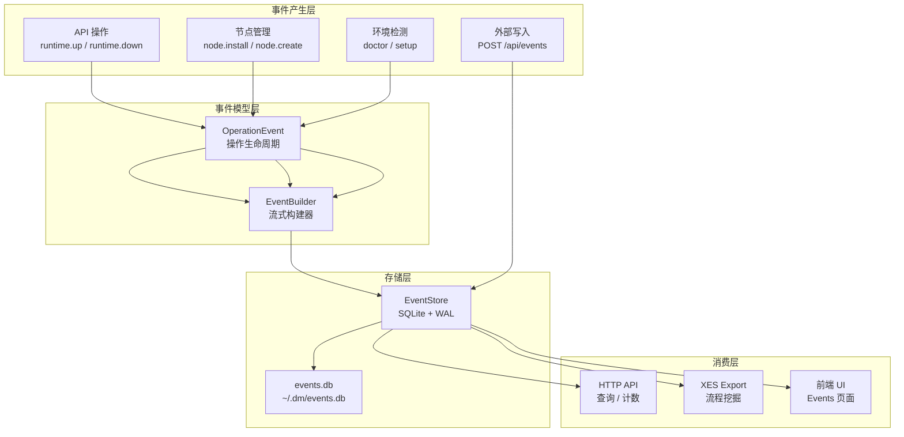
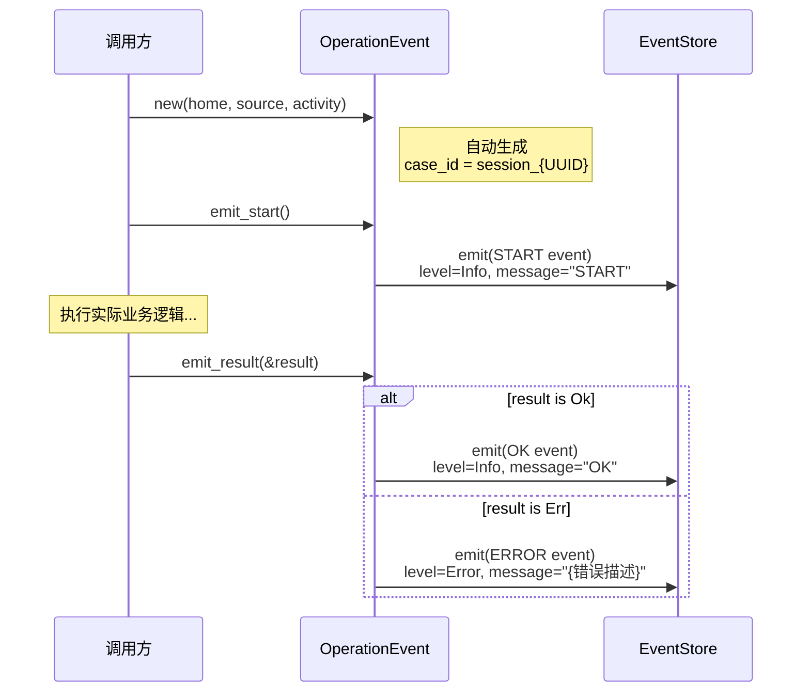
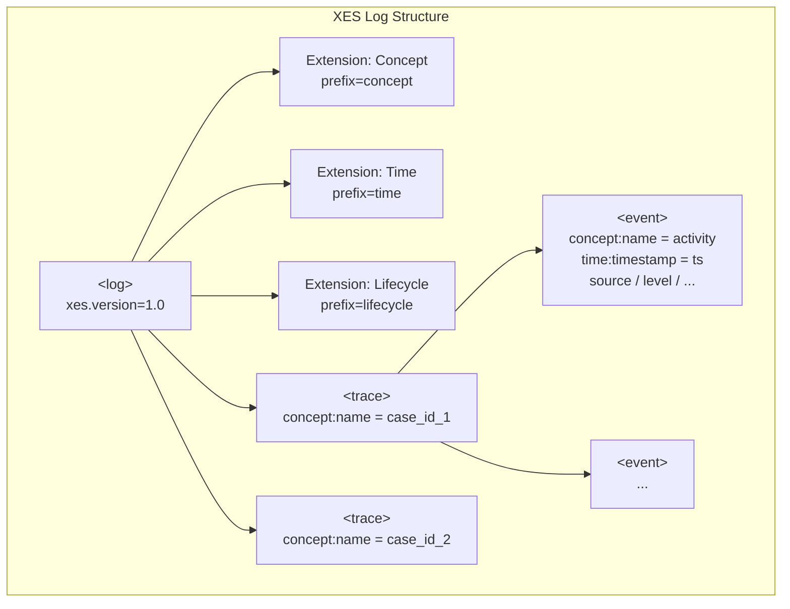
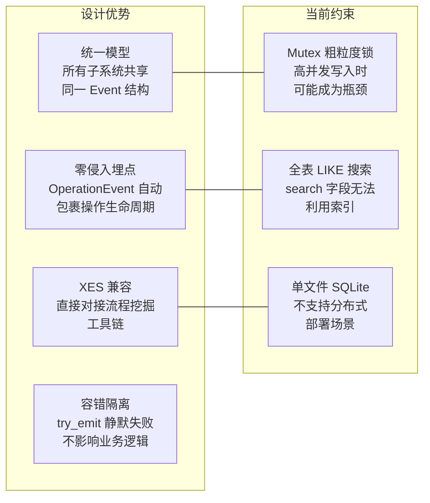

Dora Manager 的事件系统是一个**统一的可观测性基础设施**，将系统日志、数据流执行追踪、HTTP 请求记录、前端分析以及 CI 指标全部归一化为一种事件模型，存储于 SQLite 数据库中。该模型在设计上与 **XES（eXtensible Event Stream）标准**兼容——`case_id` 映射为 Trace，`activity` 映射为 Event，可直接导出为 PM4Py / ProM 等流程挖掘工具可消费的 XML 格式。本文将从数据模型、构建器模式、存储引擎、XES 导出、HTTP API 到前端 UI 逐层拆解这一系统的完整实现。

Sources: [mod.rs](https://github.com/l1veIn/dora-manager/blob/main/crates/dm-core/src/events/mod.rs#L1-L5)

## 设计哲学：事件即唯一真相源

事件系统的核心设计原则是 **"Event as Single Source of Truth"**。dm-core 中所有关键操作——运行时启停、版本切换、节点安装、环境诊断——均通过 `OperationEvent` 抽象自动产生配对的 start/result 事件。这种模式无需在业务逻辑中手工插入日志调用，而是由操作包装器自动生成完整的执行轨迹，确保可观测性数据的一致性和不可遗漏性。



Sources: [mod.rs](https://github.com/l1veIn/dora-manager/blob/main/crates/dm-core/src/events/mod.rs#L12-L15), [op.rs](https://github.com/l1veIn/dora-manager/blob/main/crates/dm-core/src/events/op.rs#L1-L67)

## 数据模型：Event 与类型枚举

### Event 核心结构

`Event` 是整个系统的原子数据单元，其字段设计直接映射到 XES 标准中的 **Trace → Event** 层次结构。所有字段在序列化边界（JSON API、SQLite 列）均以字符串形式存储，确保最大兼容性：

| 字段 | 类型 | XES 映射 | 说明 |
|------|------|----------|------|
| `id` | `i64` | — | 自增主键，存储层分配 |
| `timestamp` | `String` | `time:timestamp` | ISO 8601 / RFC 3339 格式，由 `EventBuilder` 自动注入 |
| `case_id` | `String` | `concept:name`（Trace 级） | 关联标识符——通常是会话 ID、运行 ID 或请求 ID |
| `activity` | `String` | `concept:name`（Event 级） | 操作名称，如 `node.install`、`runtime.up` |
| `source` | `String` | `source` | 事件来源分类 |
| `level` | `String` | `level` | 严重性等级，默认 `"info"` |
| `node_id` | `Option<String>` | `node_id` | 可选的节点标识符 |
| `message` | `Option<String>` | `message` | 人类可读描述 |
| `attributes` | `Option<String>` | — | JSON 序列化的任意扩展属性 |

Sources: [model.rs](https://github.com/l1veIn/dora-manager/blob/main/crates/dm-core/src/events/model.rs#L80-L92)

### EventSource：五域分类

事件来源被划分为五个正交域，覆盖了 Dora Manager 运行时可能涉及的所有子系统。每个变体通过 `#[serde(rename_all = "lowercase")]` 确保序列化输出为小写字符串，同时实现了 `Display` 和 `FromStr` trait，在 SQL 查询和 JSON 边界之间保持一致：

| 枚举值 | 序列化值 | 职责域 |
|--------|----------|--------|
| `Core` | `"core"` | 核心引擎操作：运行时管理、节点安装、版本切换、环境诊断 |
| `Dataflow` | `"dataflow"` | 数据流生命周期：节点调度、输出事件、拓扑变更 |
| `Server` | `"server"` | HTTP 服务层：API 请求日志、WebSocket 连接 |
| `Frontend` | `"frontend"` | 前端交互：UI 操作、用户行为分析 |
| `Ci` | `"ci"` | 持续集成：构建警告、测试结果、部署事件 |

Sources: [model.rs](https://github.com/l1veIn/dora-manager/blob/main/crates/dm-core/src/events/model.rs#L4-L40)

### EventLevel：五级严重性

严重性层级遵循标准日志分级的语义约定。`EventBuilder` 默认将级别设为 `Info`，只有 `OperationEvent` 在结果为错误时才自动提升至 `Error`：

| 枚举值 | 序列化值 | 语义 |
|--------|----------|------|
| `Trace` | `"trace"` | 极细粒度的执行路径追踪 |
| `Debug` | `"debug"` | 调试诊断信息 |
| `Info` | `"info"` | 常规操作记录（**默认值**） |
| `Warn` | `"warn"` | 非致命异常或降级告警 |
| `Error` | `"error"` | 操作失败，通常伴随错误详情 |

Sources: [model.rs](https://github.com/l1veIn/dora-manager/blob/main/crates/dm-core/src/events/model.rs#L42-L78)

## EventBuilder：流式事件构建器

`EventBuilder` 采用 Rust Builder 模式，提供流畅的链式 API 来构造事件对象。其三个核心设计决策值得关注：

- **自动时间戳**：`build()` 时通过 `chrono::Utc::now().to_rfc3339()` 自动注入 UTC 时间戳，调用者无需关心时间同步问题
- **延迟属性聚合**：`attr()` 方法接受任意 `impl Serialize` 值，逐步累积到内部的 `serde_json::Map` 中，最终在 `build()` 时一次性序列化为 JSON 字符串
- **零 ID 策略**：`Event.id` 在构建时硬编码为 `0`，真正的 ID 由 SQLite 的 `AUTOINCREMENT` 在 `emit()` 时分配

```rust
// 典型用法：链式构建带丰富属性的事件
let event = EventBuilder::new(EventSource::Ci, "clippy.warn")
    .case_id("commit_abc123")
    .level(EventLevel::Warn)
    .message("unused variable")
    .attr("file", "src/main.rs")
    .attr("line", 42)
    .attr("severity", "warning")
    .build();
```

Sources: [builder.rs](https://github.com/l1veIn/dora-manager/blob/main/crates/dm-core/src/events/builder.rs#L1-L74)

## OperationEvent：操作生命周期追踪

`OperationEvent` 是事件系统的**核心操作语义层**，为长时间运行的操作提供自动化的 start/result 事件对。它的设计将可观测性从"事后补加日志"转变为"声明式操作追踪"：



这种模式确保每个关键操作在事件流中都留下**成对的开始/结束标记**，支持基于 `case_id` 的完整执行路径重建。

Sources: [op.rs](https://github.com/l1veIn/dora-manager/blob/main/crates/dm-core/src/events/op.rs#L17-L67)

### 全量操作埋点清单

以下表格列出了 dm-core 中所有通过 `OperationEvent` 追踪的操作。每一行代表一对 start/result 事件，`case_id` 均为 `session_{UUID}` 格式：

| 模块 | Activity | 触发场景 |
|------|----------|----------|
| [runtime.rs](https://github.com/l1veIn/dora-manager/blob/main/crates/dm-core/src/api/runtime.rs#L137-L196) | `runtime.up` | 启动 dora 协调器与守护进程 |
| [runtime.rs](https://github.com/l1veIn/dora-manager/blob/main/crates/dm-core/src/api/runtime.rs#L201-L261) | `runtime.down` | 停止 dora 运行时 |
| [runtime.rs](https://github.com/l1veIn/dora-manager/blob/main/crates/dm-core/src/api/runtime.rs#L300-L306) | `passthrough` | 直接透传 dora CLI 命令 |
| [version.rs](https://github.com/l1veIn/dora-manager/blob/main/crates/dm-core/src/api/version.rs#L10-L59) | `versions` | 查询已安装版本列表 |
| [version.rs](https://github.com/l1veIn/dora-manager/blob/main/crates/dm-core/src/api/version.rs#L64-L88) | `version.uninstall` | 卸载指定版本 |
| [version.rs](https://github.com/l1veIn/dora-manager/blob/main/crates/dm-core/src/api/version.rs#L93-L120) | `version.switch` | 切换活跃版本 |
| [doctor.rs](https://github.com/l1veIn/dora-manager/blob/main/crates/dm-core/src/api/doctor.rs#L10-L60) | `doctor` | 执行环境健康检查 |
| [setup.rs](https://github.com/l1veIn/dora-manager/blob/main/crates/dm-core/src/api/setup.rs#L14-L53) | `setup` | 执行首次安装与依赖检查 |
| [local.rs](https://github.com/l1veIn/dora-manager/blob/main/crates/dm-core/src/node/local.rs#L14-L85) | `node.create` | 创建新节点脚手架 |
| [local.rs](https://github.com/l1veIn/dora-manager/blob/main/crates/dm-core/src/node/local.rs#L89-L135) | `node.list` | 列出所有可用节点 |
| [local.rs](https://github.com/l1veIn/dora-manager/blob/main/crates/dm-core/src/node/local.rs#L139-L140) | `node.uninstall` | 卸载指定节点 |
| [local.rs](https://github.com/l1veIn/dora-manager/blob/main/crates/dm-core/src/node/local.rs#L235-L236) | `node.status` | 查询节点状态 |
| [import.rs](https://github.com/l1veIn/dora-manager/blob/main/crates/dm-core/src/node/import.rs#L22-L54) | `node.import_local` | 从本地目录导入节点 |
| [import.rs](https://github.com/l1veIn/dora-manager/blob/main/crates/dm-core/src/node/import.rs#L59) | `node.import_git` | 从 Git 仓库导入节点 |
| [install.rs](https://github.com/l1veIn/dora-manager/blob/main/crates/dm-core/src/node/install.rs#L12-L13) | `node.install` | 安装节点依赖并构建 |

Sources: [op.rs](https://github.com/l1veIn/dora-manager/blob/main/crates/dm-core/src/events/op.rs#L1-L67)

## EventStore：SQLite 存储引擎

### 存储位置与初始化

事件数据库位于 `<DM_HOME>/events.db`，其中 `DM_HOME` 的解析优先级为：`--home` 命令行参数 > `DM_HOME` 环境变量 > `~/.dm` 默认路径。dm-server 启动时将 `EventStore` 作为应用状态的一部分全局初始化，通过 `Arc` 包装后在所有请求处理器之间共享：

```rust
// dm-server main.rs 启动时
let events = EventStore::open(&home).expect("Failed to open event store");
let state = AppState {
    home: Arc::new(home),
    events: Arc::new(events),  // Arc 包装，全局共享
    // ...
};
```

Sources: [store.rs](https://github.com/l1veIn/dora-manager/blob/main/crates/dm-core/src/events/store.rs#L14-L44), [main.rs](https://github.com/l1veIn/dora-manager/blob/main/crates/dm-server/src/main.rs#L82-L92), [state.rs](https://github.com/l1veIn/dora-manager/blob/main/crates/dm-server/src/state.rs#L6-L13), [config.rs](https://github.com/l1veIn/dora-manager/blob/main/crates/dm-core/src/config.rs#L107-L118)

### Schema 与索引策略

`EventStore::open()` 在初始化时执行 DDL，创建单表 `events` 并附带四条索引：

```sql
CREATE TABLE IF NOT EXISTS events (
    id          INTEGER PRIMARY KEY AUTOINCREMENT,
    timestamp   TEXT    NOT NULL,
    case_id     TEXT    NOT NULL,
    activity    TEXT    NOT NULL,
    source      TEXT    NOT NULL,
    level       TEXT    NOT NULL DEFAULT 'info',
    node_id     TEXT,
    message     TEXT,
    attributes  TEXT
);
```

| 索引名 | 目标列 | 支持的查询场景 |
|--------|--------|----------------|
| `idx_events_case` | `case_id` | 按运行实例/会话追踪完整事件链 |
| `idx_events_source` | `source` | 按来源域过滤（core/server/dataflow 等） |
| `idx_events_time` | `timestamp` | 时间范围查询（since/until） |
| `idx_events_activity` | `activity` | 按操作类型查找 |

数据库以 **WAL（Write-Ahead Log）模式**运行（`PRAGMA journal_mode=WAL`），允许并发读写而不阻塞读操作——这对 dm-server 的"写入事件的同时前端查询列表"场景至关重要。

Sources: [store.rs](https://github.com/l1veIn/dora-manager/blob/main/crates/dm-core/src/events/store.rs#L22-L39)

### 线程安全模型

`EventStore` 通过 `Mutex<Connection>` 实现线程安全。这是一个**粗粒度锁策略**——每次 `emit()`、`query()` 或 `count()` 操作都需要获取全局互斥锁。在当前的事件吞吐量场景下（操作级埋点，非高频日志），这种设计在简洁性和性能之间取得了合理的平衡。`Arc<EventStore>` 在 `AppState` 中的单例模式进一步简化了生命周期管理。

Sources: [store.rs](https://github.com/l1veIn/dora-manager/blob/main/crates/dm-core/src/events/store.rs#L10-L12), [state.rs](https://github.com/l1veIn/dora-manager/blob/main/crates/dm-server/src/state.rs#L10-L16)

### 动态查询构建

`query()` 方法采用**动态 SQL 拼接**模式，根据 `EventFilter` 中非 `None` 的字段逐步追加 `WHERE` 条件。过滤维度涵盖了事件的所有核心属性：

| 过滤字段 | SQL 操作 | 匹配模式 |
|----------|----------|----------|
| `source` | `=` | 精确匹配 |
| `case_id` | `=` | 精确匹配 |
| `activity` | `LIKE` | 模糊匹配（`%pattern%`） |
| `level` | `=` | 精确匹配 |
| `node_id` | `=` | 精确匹配 |
| `since` | `>=` | 时间范围起始 |
| `until` | `<=` | 时间范围截止 |
| `search` | `LIKE`（三字段 OR） | 全文模糊搜索 activity + message + source |
| `limit` | `LIMIT` | 分页大小（默认 500） |
| `offset` | `OFFSET` | 分页偏移 |

结果按 `id DESC` 排序（最新事件优先）。`count()` 方法复用相同的过滤逻辑但执行 `SELECT COUNT(*)` 聚合，用于前端分页计算。

Sources: [store.rs](https://github.com/l1veIn/dora-manager/blob/main/crates/dm-core/src/events/store.rs#L70-L204), [model.rs](https://github.com/l1veIn/dora-manager/blob/main/crates/dm-core/src/events/model.rs#L94-L107)

### 级联删除：Run 与 Event 的生命周期绑定

当通过 `runs::service_admin::delete_run()` 删除一个运行实例时，事件系统会自动清理关联的所有事件。这种级联删除机制确保了运行实例与其可观测性数据的一致性——不存在"孤儿事件"：

```rust
pub fn delete_run(home: &Path, run_id: &str) -> Result<()> {
    repo::delete_run(home, run_id)?;
    let store = crate::events::EventStore::open(home)?;
    let _ = store.delete_by_case_id(run_id);  // 以 run_id 为 case_id 删除关联事件
    Ok(())
}
```

`clean_runs()` 批量清理函数同样遵循此模式，在保留最近 N 个运行实例的同时清理其余的所有关联事件。

Sources: [service_admin.rs](https://github.com/l1veIn/dora-manager/blob/main/crates/dm-core/src/runs/service_admin.rs#L7-L27), [store.rs](https://github.com/l1veIn/dora-manager/blob/main/crates/dm-core/src/events/store.rs#L213-L220)

## XES 导出：流程挖掘兼容层

### XES 标准映射

XES（eXtensible Event Stream）是 IEEE 1849 标准定义的事件日志格式，被 ProM、PM4Py 等流程挖掘工具广泛支持。导出模块 `render_xes()` 将内部事件模型映射到 XES 的三层结构——Log → Trace → Event：



具体映射规则：

- **Log 级**：声明三个标准扩展（Concept、Time、Lifecycle），声明 `xes.version="1.0"` 和 `xes.features="nested-attributes"`
- **Trace 级**：以 `case_id` 分组，每个唯一 `case_id` 生成一个 `<trace>` 元素，`concept:name` 设为 `case_id` 值
- **Event 级**：`activity` → `concept:name`，`timestamp` → `time:timestamp`，`source`/`level`/`node_id`/`message` 作为额外的 `<string>` 属性

事件首先按 `case_id` 分组到 `BTreeMap`（保证字典序输出），再在每组内按原始顺序遍历，输出格式规范且可重现。

Sources: [export.rs](https://github.com/l1veIn/dora-manager/blob/main/crates/dm-core/src/events/export.rs#L1-L63)

### XML 转义与安全性

`escape_xml()` 函数对五种 XML 特殊字符（`& < > " '`）进行实体转义，确保 `message` 等用户可控字段不会破坏 XML 结构。这在节点安装错误消息、数据流执行异常等场景中尤为重要——用户生成的错误信息可能包含任意字符。

Sources: [export.rs](https://github.com/l1veIn/dora-manager/blob/main/crates/dm-core/src/events/export.rs#L65-L71)

## HTTP API：事件消费端点

dm-server 通过四个 HTTP 端点暴露事件系统的完整读写能力，所有端点共享同一个 `AppState.events: Arc<EventStore>` 实例：

| 端点 | 方法 | 功能 | 响应类型 |
|------|------|------|----------|
| `/api/events` | GET | 按条件查询事件列表 | `application/json` |
| `/api/events/count` | GET | 按条件统计事件数量 | `application/json` |
| `/api/events` | POST | 写入单条事件 | `application/json` |
| `/api/events/export` | GET | 导出为 XES XML | `application/xml` |

### 查询示例

GET 端点直接将 URL Query String 反序列化为 `EventFilter`，支持所有过滤字段的灵活组合：

```
GET /api/events?source=core&case_id=session_001&limit=50&offset=100
GET /api/events/count?level=error&since=2025-01-01T00:00:00Z
GET /api/events/export?source=dataflow&format=xes
```

### 事件写入

POST 端点接受完整的 `Event` JSON body（`id` 字段被忽略，由数据库自增分配），返回新创建的事件 ID：

```json
// POST /api/events
{
  "case_id": "run_abc123",
  "activity": "node.output",
  "source": "dataflow",
  "level": "info",
  "node_id": "opencv-plot",
  "message": "Frame rendered",
  "attributes": "{\"fps\": 30, \"resolution\": \"640x480\"}"
}

// Response: { "id": 42 }
```

Sources: [events.rs](https://github.com/l1veIn/dora-manager/blob/main/crates/dm-server/src/handlers/events.rs#L1-L52), [main.rs](https://github.com/l1veIn/dora-manager/blob/main/crates/dm-server/src/main.rs#L224-L228)

## try_emit：容错式发射

`try_emit()` 函数提供了一种**静默失败**的事件发射策略——它打开 EventStore 并尝试写入，如果数据库不可用（权限不足、磁盘满等），错误会被静默吞掉。这确保了事件系统的故障**永远不会影响核心业务逻辑**的正常执行：

```rust
pub fn try_emit(home: &Path, event: Event) {
    if let Ok(store) = EventStore::open(home) {
        let _ = store.emit(&event);
    }
}
```

`OperationEvent` 内部的 `emit_start()` 和 `emit_result()` 均通过此函数发射事件，实现了可观测性与业务逻辑的完全解耦。

Sources: [op.rs](https://github.com/l1veIn/dora-manager/blob/main/crates/dm-core/src/events/op.rs#L9-L14)

## 前端 Events 页面

前端通过 `/events` 路由提供了完整的可视化事件浏览器。该页面实现了以下交互能力：

- **多维度过滤**：Source（core/server/dataflow/frontend）、Level（info/warn/error/debug）、全文搜索（300ms 防抖）
- **分页浏览**：每页 50 条，并行请求 `/api/events/count` 和 `/api/events` 以优化加载速度
- **事件详情面板**：点击任意事件行打开 Sheet 侧栏，展示完整 JSON 属性载荷（带语法高亮）
- **XES 导出**：将当前过滤条件透传到 `/api/events/export`，浏览器新窗口下载 XML 文件
- **视觉编码**：Source 使用不同颜色的 Badge（core=蓝、server=紫、dataflow=绿、frontend=橙），Level 使用语义化变体（error=红色、warn=outline、info=default）

Sources: [+page.svelte](https://github.com/l1veIn/dora-manager/blob/main/web/src/routes/events/+page.svelte#L1-L316), [EventDetailsSheet.svelte](https://github.com/l1veIn/dora-manager/blob/main/web/src/routes/events/EventDetailsSheet.svelte#L1-L91)

## 架构总结与设计权衡



事件系统在**简洁性**与**可扩展性**之间做出了明确的设计选择：单表 SQLite 存储简化了部署和备份（一个 `events.db` 文件即可迁移全部可观测性数据）；XES 兼容模型确保了事件数据的长期分析价值；`OperationEvent` 模式降低了埋点的认知负担。对于当前的单机部署场景，这套架构提供了足够的可观测性能力，同时为未来向更复杂存储后端的迁移预留了接口空间。

Sources: [mod.rs](https://github.com/l1veIn/dora-manager/blob/main/crates/dm-core/src/events/mod.rs#L1-L15)

---

**下一步阅读**：了解事件系统如何被 dm-server 的 HTTP 层消费，参见 [HTTP API 全览：REST 路由、WebSocket 实时通道与 Swagger 文档](15-http-api-quan-lan-rest-lu-you-websocket-shi-shi-tong-dao-yu-swagger-wen-dang)；深入了解事件追踪的运行实例生命周期，参见 [运行时服务：启动编排、状态刷新与 CPU/内存指标采集](13-yun-xing-shi-fu-wu-qi-dong-bian-pai-zhuang-tai-shua-xin-yu-cpu-nei-cun-zhi-biao-cai-ji)；了解事件数据库的存储位置配置，参见 [配置体系：DM_HOME 目录结构与 config.toml](16-pei-zhi-ti-xi-dm_home-mu-lu-jie-gou-yu-config-toml)。