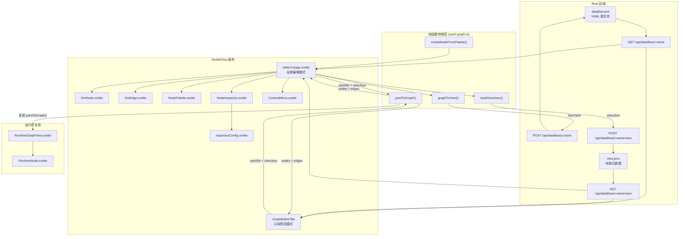

Dora Manager 的可视化图编辑器是一套基于 **SvelteFlow** 构建的双向编辑系统，其核心使命是将 Dora 数据流的 YAML 拓扑定义转化为可交互的节点图画布，同时保证画布上的每一次编辑操作都能精确地序列化回合法的 YAML 输出。系统横跨三个协作层次：**纯函数式转换引擎**（`yaml-graph.ts`）负责 YAML 文本与图数据结构之间的双向转译；**SvelteFlow 画布层**（`GraphEditorTab.svelte` / `editor/+page.svelte`）承载交互与状态管理；**后端持久化层**（Rust `repo.rs`）负责 `view.json` 和 `dataflow.yml` 的读写。本文将从架构总览入手，逐层剖析每个模块的设计决策与实现细节。

Sources: [yaml-graph.ts](https://github.com/l1veIn/dora-manager/blob/master/web/src/routes/dataflows/[id]/components/graph/yaml-graph.ts#L1-L5), [GraphEditorTab.svelte](https://github.com/l1veIn/dora-manager/blob/master/web/src/routes/dataflows/[id]/components/GraphEditorTab.svelte#L1-L41), [repo.rs](https://github.com/l1veIn/dora-manager/blob/master/crates/dm-core/src/dataflow/repo.rs#L86-L105)

## 架构总览

下图展示了图编辑器的核心数据流与组件协作关系。读者需要理解的关键前提：**YAML 是数据流的唯一 Source of Truth**，而 `view.json` 仅存储画布布局元数据（节点坐标与视口状态），两者在保存时分别写入后端的独立端点。



### 双模式设计：只读预览 vs 全屏编辑

系统提供两种画布形态，分别服务于「查看」和「编辑」两种场景。**只读预览模式**（`GraphEditorTab`）嵌入在数据流详情页的 Graph Editor Tab 中，节点不可拖拽、不可连线、不可删除，仅提供平移/缩放与 MiniMap 能力；**全屏编辑模式**（`editor/+page.svelte`）通过「Open Editor」按钮进入独立的 `:id/editor` 路由，解锁完整的拓扑编辑能力——包括节点创建、端口连线、删除、撤销/重做、配置编辑等。这种分层设计确保了查看场景的零误操作风险，同时为深度编辑提供全屏沉浸体验。

Sources: [GraphEditorTab.svelte](https://github.com/l1veIn/dora-manager/blob/master/web/src/routes/dataflows/[id]/components/GraphEditorTab.svelte#L52-L72), [editor/+page.svelte](https://github.com/l1veIn/dora-manager/blob/master/web/src/routes/dataflows/[id]/editor/+page.svelte#L573-L634)

## 转换引擎：yamlToGraph 与 graphToYaml

转换引擎是整个图编辑器的核心脊梁，由 [yaml-graph.ts](https://github.com/l1veIn/dora-manager/blob/master/web/src/routes/dataflows/[id]/components/graph/yaml-graph.ts) 实现，提供两个方向上的纯函数式转换。这种设计确保了转换逻辑的可测试性和无副作用特性——函数不依赖任何外部状态，输入相同参数始终产出相同结果。

### YAML → Graph：两轮扫描算法

`yamlToGraph()` 函数接收 YAML 字符串和 `ViewJson` 对象，输出 SvelteFlow 所需的 `nodes` 与 `edges` 数组。其内部采用**两轮扫描**策略：

**第一轮（节点创建）**：遍历 `parsed.nodes`，为每个 YAML 节点生成 `DmFlowNode`。节点 ID 直接沿用 YAML 中的 `id` 字段，位置优先从 `viewJson.nodes[id]` 读取，缺省时置零。每个节点携带 `inputs`（来自 YAML `inputs` 的 key 集合）、`outputs`（来自 YAML `outputs` 数组）和 `nodeType`（来自 YAML `node` 或 `path` 字段）。

**第二轮（边推导 + 虚拟节点生成）**：再次遍历所有 YAML 节点的 `inputs` 映射，对每个输入值调用 `classifyInput()` 进行分类：

| 输入格式 | 分类结果 | 图上的表现 |
|---------|---------|-----------|
| `microphone/audio` | `{ type: 'node', sourceId, outputPort }` | 常规边：`microphone → 当前节点` |
| `dora/timer/millis/2000` | `{ type: 'dora', raw }` | 虚拟 Timer 节点 + 边 |
| `panel/device_id` | `{ type: 'panel', widgetId }` | 虚拟 Panel 节点 + 边 |

Sources: [yaml-graph.ts](https://github.com/l1veIn/dora-manager/blob/master/web/src/routes/dataflows/[id]/components/graph/yaml-graph.ts#L63-L200), [types.ts](https://github.com/l1veIn/dora-manager/blob/master/web/src/routes/dataflows/[id]/components/graph/types.ts#L27-L47)

### 虚拟节点系统

Dora 的数据流 YAML 中存在一类特殊的输入源——`dora/timer/*` 和 `panel/*`——它们并非真实的可执行节点，而是框架内建的信号源。为了让用户在图上直观地看到这些连接关系，转换引擎引入了**虚拟节点**（Virtual Node）的概念。

虚拟节点在第一轮扫描中不存在，而是在第二轮扫描中被按需创建。Timer 虚拟节点以 `__virtual_dora_timer_millis_2000` 的格式生成 ID，携带 `isVirtual: true` 和 `virtualKind: 'timer'` 标记，并自动拥有一个 `tick` 输出端口。Panel 虚拟节点则更特殊——它是一个共享的单一节点（ID 固定为 `__virtual_panel`），其输出端口列表会随着 YAML 中 `panel/*` 引用的发现而动态追加。在 `DmNode.svelte` 的渲染中，虚拟节点通过虚线边框和颜色编码（Timer 为蓝色，Panel 为紫色）在视觉上与真实节点区分。

Sources: [yaml-graph.ts](https://github.com/l1veIn/dora-manager/blob/master/web/src/routes/dataflows/[id]/components/graph/yaml-graph.ts#L98-L187), [DmNode.svelte](https://github.com/l1veIn/dora-manager/blob/master/web/src/routes/dataflows/[id]/components/graph/DmNode.svelte#L17-L19), [DmNode.svelte](https://github.com/l1veIn/dora-manager/blob/master/web/src/routes/dataflows/[id]/components/graph/DmNode.svelte#L85-L108)

### Graph → YAML：保留式序列化

`graphToYaml()` 实现了反向转换——将画布上的节点和边序列化为合法的 YAML 字符串。其核心设计原则是**保留式序列化**：函数不仅接受当前的图状态，还接收 `originalYamlStr`（上次保存的 YAML 原文），从中提取每个节点的 `config`、`env`、`widgets` 等非拓扑字段，并在输出中原样保留。这意味着图编辑器可以安全地修改拓扑结构（增删节点、连线），而不会丢失用户在 YAML 中手动配置的环境变量或运行时参数。

反序列化的关键步骤是 `resolveEdgeToInputValue()`——它将 SvelteFlow 的边对象还原为 YAML 语法中的输入值字符串。对于连接到虚拟节点的边，函数能正确还原出 `dora/timer/millis/2000` 或 `panel/device_id` 这样的原始引用格式，确保序列化后的 YAML 与 Dora 引擎期望的格式完全兼容。

Sources: [yaml-graph.ts](https://github.com/l1veIn/dora-manager/blob/master/web/src/routes/dataflows/[id]/components/graph/yaml-graph.ts#L249-L320), [yaml-graph.ts](https://github.com/l1veIn/dora-manager/blob/master/web/src/routes/dataflows/[id]/components/graph/yaml-graph.ts#L223-L243)

### 输入分类器：classifyInput

[YAML 输入值的分类逻辑](https://github.com/l1veIn/dora-manager/blob/master/web/src/routes/dataflows/[id]/components/graph/types.ts#L33-L47)是连接解析的基础设施。该函数根据输入值的前缀模式进行分类：以 `dora/` 开头的识别为框架内建源，以 `panel/` 开头的识别为面板交互源，包含 `/` 但不以 `dora/` 或 `panel/` 开头的识别为节点间引用（格式为 `sourceNodeId/outputPort`）。这种基于前缀的约定式分类直接映射了 Dora 框架的输入源语义。

Sources: [types.ts](https://github.com/l1veIn/dora-manager/blob/master/web/src/routes/dataflows/[id]/components/graph/types.ts#L28-L47)

## 类型系统

图编辑器的类型体系定义在 [types.ts](https://github.com/l1veIn/dora-manager/blob/master/web/src/routes/dataflows/[id]/components/graph/types.ts) 中，构建在 SvelteFlow 的 `Node` 和 `Edge` 泛型之上：

| 类型 | 定义 | 用途 |
|------|------|------|
| `DmNodeData` | `Node` 的 data payload | 携带 label、nodeType、inputs/outputs、虚拟节点标记 |
| `ViewJson` | 视口 + 节点坐标映射 | 持久化画布布局状态 |
| `DmFlowNode` | `Node<DmNodeData, 'dmNode'>` | SvelteFlow 节点类型约束 |
| `DmFlowEdge` | `Edge` | SvelteFlow 边类型 |
| `InputSource` | 三种输入源的联合类型 | 驱动 `classifyInput` 的返回值 |

`DmNodeData` 中的 `inputs` 和 `outputs` 是字符串数组，存储端口 ID 列表。这些端口 ID 同时也是 SvelteFlow Handle 的 ID（格式为 `in-{portId}` 和 `out-{portId}`），构成了边连接的寻址基础。

Sources: [types.ts](https://github.com/l1veIn/dora-manager/blob/master/web/src/routes/dataflows/[id]/components/graph/types.ts#L1-L47)

## 自动布局：Dagre LR

当 `yamlToGraph()` 检测到画布上存在「位置为零且在 `viewJson` 中无记录」的节点时，会自动触发 [Dagre 布局算法](https://github.com/l1veIn/dora-manager/blob/master/web/src/routes/dataflows/[id]/components/graph/auto-layout.ts#L13-L44)。Dagre 是一个经典的层次化有向图布局库，项目配置了 `rankdir: 'LR'`（从左到右排列），配合 `nodesep: 60`（同层节点间距）和 `ranksep: 120`（层级间距）的参数，产出的布局符合数据流从输入到输出的自然阅读方向。

节点高度的估算采用公式 `NODE_HEIGHT_BASE + max(inputs, outputs) * PORT_ROW_HEIGHT`，其中基础高度 60px，每行端口 22px，宽度固定为 260px。这种启发式估算确保 Dagre 在分配空间时不会产生节点重叠。用户在全屏编辑模式下也可以随时通过工具栏的「Auto Layout」按钮手动触发重新布局。

Sources: [auto-layout.ts](https://github.com/l1veIn/dora-manager/blob/master/web/src/routes/dataflows/[id]/components/graph/auto-layout.ts#L1-L44)

## 画布组件详解

### DmNode：自定义节点渲染

[DmNode.svelte](https://github.com/l1veIn/dora-manager/blob/master/web/src/routes/dataflows/[id]/components/graph/DmNode.svelte) 是所有画布节点的统一渲染组件，通过 `nodeTypes: { dmNode: DmNode }` 注册到 SvelteFlow。组件结构分为三层：**头部**（Header）显示节点标签与类型；**主体**（Body）左右分列展示输入和输出端口；每个端口绑定一个 SvelteFlow `Handle` 组件作为连接锚点。

端口 Handle 的 ID 遵循 `{direction}-{portId}` 的命名约定（例如 `in-audio`、`out-tick`），这一约定贯穿整个系统——从 `yamlToGraph` 的边创建，到 `graphToYaml` 的边还原，到 `NodeInspector` 的连接查询，都依赖此约定进行端口寻址。

视觉上，DmNode 实现了完整的亮/暗色主题适配。虚拟节点通过 `isVirtual` 类名切换为虚线边框，Timer 节点的头部背景呈淡蓝色调（`rgba(59, 130, 246, 0.08)`），Panel 节点呈淡紫色调（`rgba(139, 92, 246, 0.08)`），每种虚拟节点类型的左侧色带也对应不同颜色，提供快速的视觉分类。

Sources: [DmNode.svelte](https://github.com/l1veIn/dora-manager/blob/master/web/src/routes/dataflows/[id]/components/graph/DmNode.svelte#L1-L55), [DmNode.svelte](https://github.com/l1veIn/dora-manager/blob/master/web/src/routes/dataflows/[id]/components/graph/DmNode.svelte#L57-L197)

### DmEdge：带删除按钮的自定义边

[DmEdge.svelte](https://github.com/l1veIn/dora-manager/blob/master/web/src/routes/dataflows/[id]/components/graph/DmEdge.svelte) 替代了 SvelteFlow 的默认边渲染，提供两个增强功能：**贝塞尔曲线路径**（通过 `getBezierPath` 计算平滑曲线）和**悬浮删除按钮**。删除按钮使用 `foreignObject` 叠加在边的中点位置，默认透明度为 0，仅在鼠标悬浮到边上方时显示，避免视觉噪音。点击删除按钮调用 SvelteFlow 的 `deleteElements` API，触发 `ondelete` 回调进入编辑器的删除流程。

Sources: [DmEdge.svelte](https://github.com/l1veIn/dora-manager/blob/master/web/src/routes/dataflows/[id]/components/graph/DmEdge.svelte#L1-L111)

### NodePalette：节点选择面板

[NodePalette.svelte](https://github.com/l1veIn/dora-manager/blob/master/web/src/routes/dataflows/[id]/components/graph/NodePalette.svelte) 以 Dialog 弹窗形式呈现，从 `GET /api/nodes` 加载所有已安装节点的元数据。面板支持**关键词搜索**（匹配 name、id、tags）和**分类过滤**（基于 `dm.json` 中的 `display.category` 字段）。用户可以通过两种方式添加节点：**点击选择**（在上下文菜单指定的位置创建）或**拖拽放置**（将节点从面板拖到画布上，利用 HTML5 Drag & Drop API 传递序列化的节点模板数据）。

节点模板数据通过 `getPaletteData()` 函数从 API 响应中提取端口信息——过滤 `ports` 数组中 `direction === 'input'` 和 `direction === 'output'` 的条目，映射为端口 ID 列表，最终传递给 `createNodeFromPalette()` 生成新的 `DmFlowNode`。

Sources: [NodePalette.svelte](https://github.com/l1veIn/dora-manager/blob/master/web/src/routes/dataflows/[id]/components/graph/NodePalette.svelte#L1-L93)

### NodeInspector：属性检查器

[NodeInspector.svelte](https://github.com/l1veIn/dora-manager/blob/master/web/src/routes/dataflows/[id]/components/graph/NodeInspector.svelte) 是一个可拖拽、可缩放的浮动面板，展示选中节点的详细属性。面板支持两种交互模式：**Info & Ports** 标签页显示节点 ID（可内联编辑重命名）、类型、以及所有输入/输出端口的连接状态；**Configuration** 标签页通过 `InspectorConfig` 子组件加载和编辑节点配置。

检查器的窗口位置和大小通过 `localStorage` 持久化（键名 `dm-inspector-bounds`），确保用户在多次打开编辑器时不需要重新调整面板位置。面板还实现了基于鼠标事件的拖拽和缩放逻辑，拖拽时限制在视口范围内避免窗口移出屏幕。

Sources: [NodeInspector.svelte](https://github.com/l1veIn/dora-manager/blob/master/web/src/routes/dataflows/[id]/components/graph/NodeInspector.svelte#L1-L128), [NodeInspector.svelte](https://github.com/l1veIn/dora-manager/blob/master/web/src/routes/dataflows/[id]/components/graph/NodeInspector.svelte#L130-L284)

### InspectorConfig：四层配置聚合编辑

[InspectorConfig.svelte](https://github.com/l1veIn/dora-manager/blob/master/web/src/routes/dataflows/[id]/components/graph/InspectorConfig.svelte) 是配置编辑的核心组件，从 `GET /api/dataflows/:name/config-schema` 加载**聚合配置字段**（Aggregated Config Fields）。每个字段携带 `effective_value`（当前生效值）、`effective_source`（值来源层级）和 `schema`（类型描述与 widget 声明）。

字段的来源标识以颜色编码的标签呈现：

| 来源 | 标签颜色 | 含义 |
|------|---------|------|
| `inline` | 蓝色 | 来自 YAML 中的 `config` 字段 |
| `node` | 紫色 | 来自节点的全局配置 |
| `default` / `unset` | 灰色 | 来自 `dm.json` 中的默认值 |

组件根据 `schema["x-widget"].type` 动态选择 UI 控件：`select` → 下拉选择器，`slider` → 滑块+数值输入，`switch` → 开关，`radio` → 单选按钮组，`checkbox` → 多选框，`file` / `directory` → 路径选择器。对于未声明 widget 的字段，则根据 `schema.type` 回退到标准表单控件（`string` → Input，`number` → 数值 Input，`boolean` → 复选框，其他 → Textarea）。标记为 `secret` 的字段会使用密码输入框，且编辑时写入全局配置而非 inline YAML，并显示安全警告。

Sources: [InspectorConfig.svelte](https://github.com/l1veIn/dora-manager/blob/master/web/src/routes/dataflows/[id]/components/graph/InspectorConfig.svelte#L1-L120), [InspectorConfig.svelte](https://github.com/l1veIn/dora-manager/blob/master/web/src/routes/dataflows/[id]/components/graph/InspectorConfig.svelte#L131-L339)

### ContextMenu：上下文菜单

[ContextMenu.svelte](https://github.com/l1veIn/dora-manager/blob/master/web/src/routes/dataflows/[id]/components/graph/ContextMenu.svelte) 提供基于右键的快捷操作，根据点击目标分为三种菜单形态：

- **画布空白处**：添加节点、全选、自动布局
- **节点**：复制、检查属性、删除
- **边**：删除连线

菜单使用固定定位的 `z-[101]` 层级渲染，配合一个全屏透明的 `z-[100]` 背景层捕获外部点击以关闭菜单。这种两层分离设计避免了 SvelteFlow 画布的 pointer-events 干扰。

Sources: [ContextMenu.svelte](https://github.com/l1veIn/dora-manager/blob/master/web/src/routes/dataflows/[id]/components/graph/ContextMenu.svelte#L1-L101)

## 编辑器状态管理与操作

### 撤销/重做系统

全屏编辑器实现了一个基于 **Snapshot 栈**的撤销/重做系统。每次编辑操作前调用 `pushUndo()` 将当前 `nodes` 和 `edges` 的深拷贝压入 `undoStack`（最多保留 30 层），同时清空 `redoStack`。撤销时从 `undoStack` 弹出并压入 `redoStack`，重做则反向操作。`isDirty` 标记在任何状态变更后被设为 `true`，驱动保存按钮的视觉状态变化（outline → default 高亮）。

值得注意的是，`handleUpdateConfig` 故意省略了 `pushUndo()` 调用，避免配置编辑过程中的每一次按键/滑块拖动都产生一个历史快照，导致撤销栈被大量中间状态填满。

Sources: [editor/+page.svelte](https://github.com/l1veIn/dora-manager/blob/master/web/src/routes/dataflows/[id]/editor/+page.svelte#L67-L111)

### 连接校验

`isValidConnection()` 函数在用户尝试从输出端口拖线到输入端口时被调用，执行两项校验：**禁止自连接**（`source === target` 时拒绝）；**禁止同端口重复入边**（数据流语义要求每个输入端口最多只有一个数据源）。此外还检查是否已存在完全相同的连接（source + target + sourceHandle + targetHandle 四元组匹配），防止创建重复边。

Sources: [editor/+page.svelte](https://github.com/l1veIn/dora-manager/blob/master/web/src/routes/dataflows/[id]/editor/+page.svelte#L283-L318)

### 节点重命名

`handleRenameNode()` 实现了节点的 ID 重命名。该操作具有级联效应——不仅修改节点自身的 `id` 和 `data.label`，还需要遍历所有边，将引用旧 ID 的 `source` 和 `target` 字段替换为新 ID，并同步更新边的 `id`（边的 ID 由 `e-{source}-{sourcePort}-{target}-{targetPort}` 格式组成）。如果当前选中的检查器节点是被重命名的节点，还需要更新 `selectedNode` 引用。

Sources: [editor/+page.svelte](https://github.com/l1veIn/dora-manager/blob/master/web/src/routes/dataflows/[id]/editor/+page.svelte#L239-L264)

### 键盘快捷键

编辑器注册了全局键盘事件监听，支持以下快捷操作：

| 快捷键 | 功能 |
|--------|------|
| `⌘/Ctrl + S` | 保存 |
| `⌘/Ctrl + Z` | 撤销 |
| `⌘/Ctrl + Shift + Z` | 重做 |
| `⌘/Ctrl + D` | 复制选中节点 |
| `Backspace / Delete` | 删除选中元素（由 SvelteFlow 原生处理） |

Sources: [editor/+page.svelte](https://github.com/l1veIn/dora-manager/blob/master/web/src/routes/dataflows/[id]/editor/+page.svelte#L441-L458)

## 保存流程与 view.json 持久化

保存操作由 `saveAll()` 函数驱动，执行两个独立的 API 调用：

1. **`graphToYaml(nodes, edges, lastYaml)`** → `POST /api/dataflows/:name`：将当前图状态序列化为 YAML 并写入后端。`lastYaml` 参数确保非拓扑字段（config、env、widgets）被原样保留。
2. **`buildViewJson(nodes)`** → `POST /api/dataflows/:name/view`：将所有节点的当前位置序列化为 `view.json` 并写入后端。`view.json` 的结构简单，仅包含 `nodes: { [nodeId]: { x, y } }` 映射，不存储拓扑信息。

在后端，`view.json` 存储在数据流目录下（与 `dataflow.yml` 同级），由 [repo.rs](https://github.com/l1veIn/dora-manager/blob/master/crates/dm-core/src/dataflow/repo.rs#L96-L105) 的 `write_view` 函数写入。首次加载时如果文件不存在，`read_view` 返回空对象 `{}`，触发 Dagre 自动布局。

Sources: [editor/+page.svelte](https://github.com/l1veIn/dora-manager/blob/master/web/src/routes/dataflows/[id]/editor/+page.svelte#L423-L438), [repo.rs](https://github.com/l1veIn/dora-manager/blob/master/crates/dm-core/src/dataflow/repo.rs#L86-L105), [yaml-graph.ts](https://github.com/l1veIn/dora-manager/blob/master/web/src/routes/dataflows/[id]/components/graph/yaml-graph.ts#L206-L217)

## 运行时图视图复用

图编辑器的转换引擎不仅在编辑场景中使用，还被运行时视图复用。[RuntimeGraphView.svelte](https://github.com/l1veIn/dora-manager/blob/master/web/src/routes/runs/[id]/graph/RuntimeGraphView.svelte) 直接导入 `yamlToGraph` 函数将数据流 YAML 渲染为运行时监控画面，但使用独立的 `RuntimeNode.svelte` 组件替代 `DmNode`——RuntimeNode 在基础节点渲染之上增加了**运行状态指示器**（running/failed/stopped 图标）、**资源指标展示**（CPU、内存）和**日志闪烁动画**。

运行时视图通过 WebSocket 连接（`/api/runs/:runId/ws`）接收实时推送，处理三类消息：`status` 更新数据流全局状态并切换边的动画效果；`metrics` 注入各节点的 CPU/内存数据；`logs` / `io` 触发节点上的日志指示器闪烁（500ms 自动消失）。这种复用架构体现了 `yamlToGraph` 转换函数的通用性——同一份 YAML 数据在编辑和监控两种上下文中被不同组件消费。

Sources: [RuntimeGraphView.svelte](https://github.com/l1veIn/dora-manager/blob/master/web/src/routes/runs/[id]/graph/RuntimeGraphView.svelte#L1-L167)

## 文件结构总览

```
web/src/routes/dataflows/[id]/
├── +page.svelte                          # 数据流详情页（包含 Graph/YAML/Meta/History 四个 Tab）
├── editor/+page.svelte                   # 全屏编辑器页面
└── components/
    ├── GraphEditorTab.svelte             # 只读图预览组件
    ├── YamlEditorTab.svelte              # CodeMirror YAML 编辑器
    ├── MetaTab.svelte                    # flow.json 元数据编辑
    ├── HistoryTab.svelte                 # 历史版本浏览
    └── graph/
        ├── types.ts                      # 类型定义与 classifyInput
        ├── yaml-graph.ts                 # 双向转换引擎核心
        ├── auto-layout.ts                # Dagre LR 自动布局
        ├── DmNode.svelte                 # 自定义节点渲染
        ├── DmEdge.svelte                 # 自定义边渲染（带删除按钮）
        ├── NodePalette.svelte            # 节点选择面板（Dialog）
        ├── NodeInspector.svelte          # 属性检查器（浮动面板）
        ├── InspectorConfig.svelte        # 四层配置聚合编辑
        └── ContextMenu.svelte            # 右键上下文菜单
```

Sources: [目录结构](https://github.com/l1veIn/dora-manager/blob/master/web/src/routes/dataflows/[id]/)

## 设计演进：四阶段交付模型

图编辑器的开发遵循了文档化的四阶段渐进式交付策略：

| 阶段 | 文档 | 核心交付物 | 状态 |
|------|------|-----------|------|
| P1 | [P1-readonly-canvas.md](https://github.com/l1veIn/dora-manager/blob/master/docs/nodeEditor/P1-readonly-canvas.md) | 只读画布 + view.json 后端 + Dagre 布局 | ✅ 已完成 |
| P2 | [P2-editable-canvas.md](https://github.com/l1veIn/dora-manager/blob/master/docs/nodeEditor/P2-editable-canvas.md) | 拓扑编辑 + graphToYaml 序列化 | ✅ 已完成 |
| P3 | [P3-palette-inspector.md](https://github.com/l1veIn/dora-manager/blob/master/docs/nodeEditor/P3-palette-inspector.md) | NodePalette + NodeInspector + 配置编辑 | ✅ 已完成 |
| P4 | [P4-schema-validation-polish.md](https://github.com/l1veIn/dora-manager/blob/master/docs/nodeEditor/P4-schema-validation-polish.md) | 端口 Schema 校验 + 撤销/重做 + 主题适配 | 🔄 部分完成 |

P4 阶段中的撤销/重做系统、主题适配、节点复制功能已经实现，但基于 Port Schema 的连接校验（通过 `GET /api/dataflows/:name/validate` 端点获取类型兼容性诊断信息并给边着色）尚未落地。当前边的渲染不携带校验状态，仅使用统一的灰色/蓝色样式。

Sources: [P1-readonly-canvas.md](https://github.com/l1veIn/dora-manager/blob/master/docs/nodeEditor/P1-readonly-canvas.md#L1-L30), [P2-editable-canvas.md](https://github.com/l1veIn/dora-manager/blob/master/docs/nodeEditor/P2-editable-canvas.md#L1-L19), [P3-palette-inspector.md](https://github.com/l1veIn/dora-manager/blob/master/docs/nodeEditor/P3-palette-inspector.md#L1-L20), [P4-schema-validation-polish.md](https://github.com/l1veIn/dora-manager/blob/master/docs/nodeEditor/P4-schema-validation-polish.md#L1-L24)

## 关键依赖

| 依赖 | 版本 | 用途 |
|------|------|------|
| `@xyflow/svelte` | ^1.5.1 | SvelteFlow 画布引擎 |
| `@dagrejs/dagre` | ^2.0.4 | 层次化有向图自动布局 |
| `yaml` (npm) | — | YAML 解析与序列化（`yaml-graph.ts` 内使用） |
| `svelte-codemirror-editor` | ^2.1.0 | YAML 文本编辑器（YamlEditorTab） |
| `@codemirror/lang-yaml` | ^6.1.2 | CodeMirror YAML 语法高亮 |
| `mode-watcher` | ^1.1.0 | 亮/暗主题状态追踪 |

Sources: [package.json](https://github.com/l1veIn/dora-manager/blob/master/web/package.json)

## 下一步阅读

- 如果想了解 SvelteFlow 画布在运行监控场景中的具体表现，参见 [运行工作台：网格布局、面板系统与实时交互](16-runtime-workspace)。
- 如果想理解 InspectorConfig 所依赖的四层配置聚合机制的后端实现，参见 [数据流转译器：多 Pass 管线与四层配置合并](08-transpiler)。
- 如果想了解图编辑器消费的节点元数据来源，参见 [内置节点一览：从媒体采集到 AI 推理](19-builtin-nodes) 和 [Port Schema 规范：基于 Arrow 类型系统的端口校验](20-port-schema)。