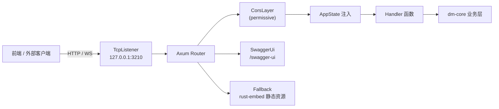
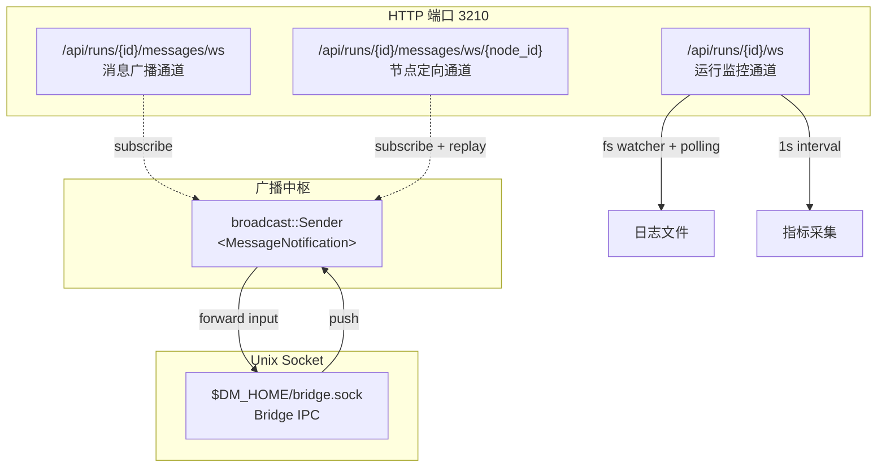

dm-server 是 Dora Manager 的 HTTP 服务层，基于 **Axum** 框架构建，固定监听 `127.0.0.1:3210`。它向上层 SvelteKit 前端暴露两类通信接口：**REST API**（请求-响应模式，用于资源 CRUD 与命令执行）和 **WebSocket / SSE 实时通道**（推送模式，用于日志流、指标采集与交互消息）。所有 REST 端点通过 `utoipa` 注解自动生成 OpenAPI 规范，并通过 Swagger UI 交互式浏览。本章将按功能域逐层拆解全部路由、请求/响应结构、实时通道协议，以及如何在 Swagger 中查阅完整文档。

Sources: [main.rs](https://github.com/l1veIn/dora-manager/blob/main/crates/dm-server/src/main.rs#L1-L270), [Cargo.toml](https://github.com/l1veIn/dora-manager/blob/main/crates/dm-server/Cargo.toml#L1-L38)

## 服务启动与全局架构

dm-server 在启动时执行四项初始化：解析 `DM_HOME` 目录并加载配置、打开事件存储（SQLite）、初始化媒体运行时（MediaMTX 桥接）、构建 Axum 路由表并绑定监听端口。此外它还启动两个后台任务——每 30 秒的空闲监控器（自动 `dora down`）和一个 Unix Domain Socket 监听器（`$DM_HOME/bridge.sock`），用于与数据流内的 Bridge 节点进行 IPC 通信。

Sources: [main.rs](https://github.com/l1veIn/dora-manager/blob/main/crates/dm-server/src/main.rs#L79-L269)

### 全局状态模型

所有 handler 共享一个 `AppState` 结构体，由 Axum 的状态注入机制自动传递：

```rust
pub struct AppState {
    pub home: Arc<PathBuf>,                      // DM_HOME 根目录
    pub events: Arc<EventStore>,                 // 可观测性事件存储
    pub messages: broadcast::Sender<MessageNotification>,  // 消息广播通道（容量 512）
    pub media: Arc<MediaRuntime>,                // 媒体后端运行时
}
```

`broadcast::Sender<MessageNotification>` 是交互系统的核心广播枢纽——任何来自 REST 推送、WebSocket 输入或 Bridge IPC 的消息，都通过此通道扇出给所有订阅中的 WebSocket 客户端。

Sources: [state.rs](https://github.com/l1veIn/dora-manager/blob/main/crates/dm-server/src/state.rs#L1-L25), [main.rs](https://github.com/l1veIn/dora-manager/blob/main/crates/dm-server/src/main.rs#L90-L95)

### 路由注册总览

整个路由表在 `Router::new()` 链式调用中注册，按注释分为七大功能域。以下 Mermaid 图展示了请求从网络层到达 handler 的完整链路：



Sources: [main.rs](https://github.com/l1veIn/dora-manager/blob/main/crates/dm-server/src/main.rs#L97-L235)

## REST API 路由全表

以下按功能域分类列出全部 REST 端点，标注 HTTP 方法、路径、请求体结构和核心用途。

### 环境与系统管理

| 方法 | 路径 | 用途 | 关键参数 |
|------|------|------|----------|
| GET | `/api/doctor` | 系统健康诊断报告 | — |
| GET | `/api/versions` | 已安装 dora 版本列表 | — |
| GET | `/api/status` | 运行时与活跃 Run 状态 | — |
| GET | `/api/media/status` | 媒体后端状态 | — |
| POST | `/api/media/install` | 安装/配置媒体后端 | — |
| GET | `/api/config` | 读取 DM 配置 | — |
| POST | `/api/config` | 更新 DM 配置 | `ConfigUpdate { active_version, media }` |

Sources: [system.rs](https://github.com/l1veIn/dora-manager/blob/main/crates/dm-server/src/handlers/system.rs#L1-L108)

### 运行时生命周期管理

| 方法 | 路径 | 用途 | 请求体 |
|------|------|------|--------|
| POST | `/api/install` | 安装指定 dora 版本 | `InstallRequest { version? }` |
| POST | `/api/uninstall` | 卸载指定 dora 版本 | `UninstallRequest { version }` |
| POST | `/api/use` | 切换活跃 dora 版本 | `UseRequest { version }` |
| POST | `/api/up` | 启动 dora coordinator 守护进程 | — |
| POST | `/api/down` | 停止 dora coordinator | — |

Sources: [runtime.rs](https://github.com/l1veIn/dora-manager/blob/main/crates/dm-server/src/handlers/runtime.rs#L1-L85)

### 节点管理

| 方法 | 路径 | 用途 | 关键参数 |
|------|------|------|----------|
| GET | `/api/nodes` | 列出所有已安装节点 | — |
| GET | `/api/nodes/{id}` | 获取节点状态详情 | Path: `id` |
| POST | `/api/nodes/install` | 从注册中心安装节点 | `InstallNodeRequest { id }` |
| POST | `/api/nodes/import` | 从本地路径/Git URL 导入 | `ImportNodeRequest { source, id? }` |
| POST | `/api/nodes/create` | 创建空白节点脚手架 | `CreateNodeRequest { id, description }` |
| POST | `/api/nodes/uninstall` | 卸载节点 | `UninstallNodeRequest { id }` |
| POST | `/api/nodes/{id}/open` | 在外部工具中打开 | `OpenNodeRequest { target: "finder"\|"terminal"\|"vscode" }` |
| GET | `/api/nodes/{id}/readme` | 获取节点 README | Path: `id` |
| GET | `/api/nodes/{id}/files` | 获取节点文件树 | Path: `id` |
| GET | `/api/nodes/{id}/files/{*path}` | 读取节点文件内容 | Path: `id`, 通配符 `path` |
| GET | `/api/nodes/{id}/artifacts/{*path}` | 获取节点二进制制品 | Path: `id`, 通配符 `path` |
| GET | `/api/nodes/{id}/config` | 读取节点配置 | Path: `id` |
| POST | `/api/nodes/{id}/config` | 保存节点配置 | Path: `id`, Body: JSON Value |

Sources: [nodes.rs](https://github.com/l1veIn/dora-manager/blob/main/crates/dm-server/src/handlers/nodes.rs#L1-L289)

### 数据流管理

| 方法 | 路径 | 用途 | 关键参数 |
|------|------|------|----------|
| GET | `/api/dataflows` | 列出所有数据流 | — |
| GET | `/api/dataflows/{name}` | 获取数据流详情 | Path: `name` |
| POST | `/api/dataflows/{name}` | 保存/更新数据流 YAML | `SaveDataflowRequest { yaml }` |
| POST | `/api/dataflows/import` | 批量导入数据流 | `ImportDataflowsRequest { sources: Vec<String> }` |
| POST | `/api/dataflows/{name}/delete` | 删除数据流 | Path: `name` |
| GET | `/api/dataflows/{name}/inspect` | 检查数据流结构 | Path: `name` |
| GET | `/api/dataflows/{name}/meta` | 获取数据流元数据 | Path: `name` |
| POST | `/api/dataflows/{name}/meta` | 保存数据流元数据 | Path: `name`, Body: `FlowMeta` |
| GET | `/api/dataflows/{name}/config-schema` | 获取配置 Schema | Path: `name` |
| GET | `/api/dataflows/{name}/history` | 版本历史列表 | Path: `name` |
| GET | `/api/dataflows/{name}/history/{version}` | 获取指定版本 YAML | Path: `name`, `version` |
| POST | `/api/dataflows/{name}/history/{version}/restore` | 恢复指定版本 | Path: `name`, `version` |
| GET | `/api/dataflows/{name}/view` | 获取图编辑器视图数据 | Path: `name` |
| POST | `/api/dataflows/{name}/view` | 保存图编辑器视图数据 | Path: `name`, Body: JSON Value |

Sources: [dataflow.rs](https://github.com/l1veIn/dora-manager/blob/main/crates/dm-server/src/handlers/dataflow.rs#L1-L275)

### 数据流执行（兼容旧接口）

| 方法 | 路径 | 用途 | 请求体 |
|------|------|------|--------|
| POST | `/api/dataflow/start` | 启动数据流（内部转发至 `start_run`） | `RunDataflowRequest { yaml }` |
| POST | `/api/dataflow/stop` | 停止当前活跃数据流 | — |

注意 `/api/dataflow/start` 和 `/api/dataflow/stop` 是无 `s` 的旧路径，它们在内部将请求转发至 runs 域的 `start_run` 和 `stop_run`，保持向后兼容。

Sources: [dataflow.rs](https://github.com/l1veIn/dora-manager/blob/main/crates/dm-server/src/handlers/dataflow.rs#L200-L238)

### 运行实例管理

| 方法 | 路径 | 用途 | 关键参数 |
|------|------|------|----------|
| GET | `/api/runs` | 分页查询运行历史 | Query: `limit`, `offset`, `status`, `search` |
| POST | `/api/runs/start` | 启动新运行实例 | `StartRunRequest { yaml, name?, force?, view_json? }` |
| GET | `/api/runs/active` | 获取当前活跃运行 | Query: `metrics?` |
| GET | `/api/runs/{id}` | 获取运行详情 | Path: `id`, Query: `include_metrics?` |
| GET | `/api/runs/{id}/metrics` | 获取 CPU/内存指标 | Path: `id` |
| POST | `/api/runs/{id}/stop` | 停止运行 | Path: `id` |
| POST | `/api/runs/delete` | 批量删除运行记录 | `DeleteRunsRequest { run_ids: Vec<String> }` |
| GET | `/api/runs/{id}/dataflow` | 获取运行使用的原始 YAML | Path: `id` |
| GET | `/api/runs/{id}/transpiled` | 获取转译后的数据流 | Path: `id` |
| GET | `/api/runs/{id}/view` | 获取运行时的视图快照 | Path: `id` |

Sources: [runs.rs](https://github.com/l1veIn/dora-manager/blob/main/crates/dm-server/src/handlers/runs.rs#L1-L461)

### 日志访问（REST + SSE）

| 方法 | 路径 | 用途 | 关键参数 |
|------|------|------|----------|
| GET | `/api/runs/{id}/logs/{node_id}` | 一次性读取完整日志 | Path: `id`, `node_id` |
| GET | `/api/runs/{id}/logs/{node_id}/tail` | 分段读取日志 | Query: `offset` |
| GET | `/api/runs/{id}/logs/{node_id}/stream` | **SSE** 实时日志流 | Query: `tail_lines`（50–5000，默认 500） |

SSE 端点 `/stream` 返回四种事件类型：
- **`snapshot`**：连接建立时发送初始尾部日志
- **`append`**：后续新增日志行（350ms 轮询间隔）
- **`eof`**：运行结束，附带最终 status
- **`error`**：读取异常

Sources: [runs.rs](https://github.com/l1veIn/dora-manager/blob/main/crates/dm-server/src/handlers/runs.rs#L179-L265)

### 交互消息系统

| 方法 | 路径 | 用途 | 关键参数 |
|------|------|------|----------|
| GET | `/api/runs/{id}/interaction` | 交互摘要（输入控件 + 流列表） | Path: `id` |
| POST | `/api/runs/{id}/messages` | 推送消息（来自 Bridge 或前端） | `PushMessageRequest { from, tag, payload, timestamp? }` |
| GET | `/api/runs/{id}/messages` | 查询消息历史 | Query: `after_seq`, `before_seq`, `from`, `tag`, `limit`, `desc` |
| GET | `/api/runs/{id}/messages/snapshots` | 获取各节点最新快照 | Path: `id` |
| GET | `/api/runs/{id}/streams` | 列出所有流描述符 | Path: `id` |
| GET | `/api/runs/{id}/streams/{stream_id}` | 获取单个流详情 | Path: `id`, `stream_id` |
| GET | `/api/runs/{id}/artifacts/{*path}` | 获取运行输出制品文件 | Path: `id`, 通配符 `path` |

`tag` 字段决定了消息的路由语义：`"input"` 表示用户输入（前端 → 节点），`"stream"` 表示媒体流声明，其他 tag 用于自定义节点间通信。

Sources: [messages.rs](https://github.com/l1veIn/dora-manager/blob/main/crates/dm-server/src/handlers/messages.rs#L1-L558), [message.rs](https://github.com/l1veIn/dora-manager/blob/main/crates/dm-server/src/services/message.rs#L1-L120)

### 事件与可观测性

| 方法 | 路径 | 用途 | 关键参数 |
|------|------|------|----------|
| GET | `/api/events` | 按条件查询事件 | Query: `EventFilter` |
| POST | `/api/events` | 写入事件 | Body: `Event` |
| GET | `/api/events/count` | 统计事件数量 | Query: `EventFilter` |
| GET | `/api/events/export` | 导出为 XES 格式 | Query: `EventFilter`, `format` |

Sources: [events.rs](https://github.com/l1veIn/dora-manager/blob/main/crates/dm-server/src/handlers/events.rs#L1-L52)

## WebSocket 实时通道

dm-server 提供三个 WebSocket 端点和一个 Unix Domain Socket IPC 通道，覆盖运行时监控、交互消息和 Bridge 节点通信。



Sources: [main.rs](https://github.com/l1veIn/dora-manager/blob/main/crates/dm-server/src/main.rs#L214-L223), [run_ws.rs](https://github.com/l1veIn/dora-manager/blob/main/crates/dm-server/src/handlers/run_ws.rs#L1-L237), [messages.rs](https://github.com/l1veIn/dora-manager/blob/main/crates/dm-server/src/handlers/messages.rs#L223-L360)

### 运行监控 WebSocket — `/api/runs/{id}/ws`

这是前端运行工作台的核心实时通道。连接建立后，服务端使用 `notify` crate 的文件系统监视器 + 1 秒轮询间隔，持续推送五类消息帧：

| 帧类型 (`type`) | 字段 | 触发条件 |
|----------------|------|----------|
| **`ping`** | — | 每 10 秒心跳 |
| **`metrics`** | `data: Vec<NodeMetrics>` | 每秒采集（运行中状态） |
| **`logs`** | `nodeId`, `lines: Vec<String>` | 日志文件变更（增量追加） |
| **`io`** | `nodeId`, `lines: Vec<String>` | 含 `[DM-IO]` 标记的日志行 |
| **`status`** | `status: String` | 运行状态变更（如 `"Running"` → `"Finished"`） |

该通道在日志目录切换时（如从 live 路径切换到归档路径）自动重新监视新目录，确保日志流不中断。

Sources: [run_ws.rs](https://github.com/l1veIn/dora-manager/blob/main/crates/dm-server/src/handlers/run_ws.rs#L16-L149)

### 消息广播 WebSocket — `/api/runs/{id}/messages/ws`

这是一个轻量级的**全量广播通道**。连接后，客户端订阅 `broadcast::Sender<MessageNotification>`，仅接收与当前 `run_id` 匹配的通知。每个通知包含 `run_id`、`seq`（序列号）、`from`（来源节点）和 `tag`。客户端收到通知后，可自行调用 REST `GET /api/runs/{id}/messages` 获取完整消息体。

Sources: [messages.rs](https://github.com/l1veIn/dora-manager/blob/main/crates/dm-server/src/handlers/messages.rs#L223-L270)

### 节点定向 WebSocket — `/api/runs/{id}/messages/ws/{node_id}?since=N`

这是面向特定节点的**回放 + 实时**通道，主要用于 Bridge 节点接收来自前端的用户输入。连接建立时：

1. **历史回放**：查询 `since` 序列号之后、`target_to == node_id` 的所有消息，逐条发送
2. **实时订阅**：订阅广播通道，过滤 `run_id` 匹配且 `from == "web"` 且 `tag == "input"` 的新消息，转发给该节点

这种"先回放再订阅"的设计确保 Bridge 节点在短暂断连后能恢复未接收的输入。

Sources: [messages.rs](https://github.com/l1veIn/dora-manager/blob/main/crates/dm-server/src/handlers/messages.rs#L272-L360)

### Bridge Unix Domain Socket — `$DM_HOME/bridge.sock`

非 HTTP 的 IPC 通道，由 dm-server 在启动时创建。数据流中的 Bridge 节点（由转译器注入）通过此 socket 与服务端通信。协议为**行分隔 JSON**，包含两种消息：

| 动作 | 方向 | 格式 |
|------|------|------|
| **`init`** | Bridge → Server | `{"action":"init","run_id":"..."}` |
| **`push`** | Bridge → Server | `{"action":"push","from":"...","tag":"...","payload":{...},"timestamp":...}` |
| **`input`** | Server → Bridge | `{"action":"input","to":"...","value":...}` |

Bridge 连接后先发送 `init` 声明 `run_id`，随后双向通信：Bridge 推送来自节点的 `display`/`stream` 消息，服务端转发用户 `input` 消息给 Bridge。

Sources: [bridge_socket.rs](https://github.com/l1veIn/dora-manager/blob/main/crates/dm-server/src/handlers/bridge_socket.rs#L1-L174)

## Swagger 文档与 OpenAPI 规范

dm-server 集成了 `utoipa` + `utoipa-swagger-ui`，所有已注册的 REST 端点均通过 `#[utoipa::path(...)]` 宏注解自动纳入 OpenAPI 规范。

### 访问方式

- **Swagger UI 交互式界面**：`http://127.0.0.1:3210/swagger-ui/`
- **OpenAPI JSON 规范**：`http://127.0.0.1:3210/api-docs/openapi.json`

在 Swagger UI 中可直接测试每个端点——输入路径参数、请求体，执行并查看响应。所有 `ToSchema` 标注的结构体（如 `StartRunRequest`、`PushMessageRequest`、`StreamDescriptor` 等）也会自动生成 Schema 定义。

Sources: [main.rs](https://github.com/l1veIn/dora-manager/blob/main/crates/dm-server/src/main.rs#L24-L77), [main.rs](https://github.com/l1veIn/dora-manager/blob/main/crates/dm-server/src/main.rs#L233)

### 已注册的 OpenAPI 路径清单

当前 `ApiDoc` 的 `openapi` 宏注册了以下路径（共 28 个端点）：

| 域 | 端点数 | 示例 |
|----|--------|------|
| System | 7 | `/api/doctor`, `/api/status`, `/api/config` |
| Runtime | 5 | `/api/install`, `/api/up`, `/api/down` |
| Nodes | 8 | `/api/nodes`, `/api/nodes/{id}/config` |
| Dataflows | 6 | `/api/dataflows`, `/api/dataflows/{name}` |
| Runs | 7 | `/api/runs`, `/api/runs/start`, `/api/runs/{id}/metrics` |
| Interaction | 7 | `/api/runs/{id}/messages`, `/api/runs/{id}/streams` |

注意：部分路由（如 `/api/dataflows/{name}/view`、`/api/runs/{id}/logs` 等）虽已注册但尚未添加到 `openapi` 宏中，它们在运行时完全可用，但不会出现在 Swagger 文档里。

Sources: [main.rs](https://github.com/l1veIn/dora-manager/blob/main/crates/dm-server/src/main.rs#L25-L76)

## 前端 API 通信层

前端通过 `web/src/lib/api.ts` 统一封装了四个 HTTP 方法函数：

```typescript
export async function get<T>(path: string): Promise<T>      // GET + JSON 解析
export async function getText(path: string): Promise<string> // GET + 原始文本
export async function post<T>(path: string, body?: unknown): Promise<T>  // POST + JSON
export async function del<T>(path: string): Promise<T>       // DELETE + JSON
```

所有函数以 `/api` 为前缀基础路径（`API_BASE = '/api'`），在 `rust-embed` 嵌入模式下，前端构建产物由 dm-server 直接提供，因此不存在跨域问题（但服务端仍配置了 `CorsLayer::permissive()` 以支持开发模式代理）。

错误处理方面，非 2xx 响应被统一解析为 `ApiError`，它会尝试从响应体中提取 `error`、`message` 或 `detail` 字段，确保前后端错误信息的一致性。

Sources: [api.ts](https://github.com/l1veIn/dora-manager/blob/main/web/src/lib/api.ts#L1-L109)

## 错误处理模式

所有 handler 遵循统一的错误处理模式：业务逻辑返回 `anyhow::Result`，handler 层通过模式匹配将错误映射为 HTTP 状态码：

| 场景 | HTTP 状态码 | 示例 |
|------|------------|------|
| 资源未找到 | `404 Not Found` | 节点/数据流/Run ID 不存在 |
| 请求参数错误 | `400 Bad Request` | 无效 JSON、缺少必填字段 |
| 冲突 | `409 Conflict` | 已有活跃运行 |
| 内部错误 | `500 Internal Server Error` | 文件 I/O 失败、数据库异常 |
| 批量部分成功 | `207 Multi-Status` | 批量删除中部分失败 |

Sources: [mod.rs](https://github.com/l1veIn/dora-manager/blob/main/crates/dm-server/src/handlers/mod.rs#L43-L45), [runs.rs](https://github.com/l1veIn/dora-manager/blob/main/crates/dm-server/src/handlers/runs.rs#L430-L460)

## 路由设计原则总结

dm-server 的 API 设计体现了以下架构决策：

1. **功能域前缀分离**：`/api/nodes/*`、`/api/dataflows/*`、`/api/runs/*`、`/api/events/*` 四大领域清晰隔离，避免命名冲突
2. **读写对称路由**：同一路径通过 GET/POST 区分读取与写入（如 `/api/nodes/{id}/config`）
3. **渐进式实时策略**：短请求用 REST，持续数据用 WebSocket，日志流用 SSE——三种协议各司其职
4. **Run 作用域隔离**：所有交互消息和流端点都嵌套在 `/api/runs/{id}/` 下，确保多运行实例的隔离性
5. **Swagger-first 文档**：通过编译期宏注解保持文档与代码的强一致性

---

**下一步阅读**：了解服务端如何管理持久化配置，参阅 [配置体系：DM_HOME 目录结构与 config.toml](16-pei-zhi-ti-xi-dm_home-mu-lu-jie-gou-yu-config-toml)；了解前端如何消费这些 API 构建 UI，参阅 [SvelteKit 项目结构：路由设计、API 通信层与状态管理](17-sveltekit-xiang-mu-jie-gou-lu-you-she-ji-api-tong-xin-ceng-yu-zhuang-tai-guan-li)；了解交互消息在 Bridge 节点中的完整流转，参阅 [交互系统架构：dm-input / dm-display / Bridge 节点注入原理](22-jiao-hu-xi-tong-jia-gou-dm-input-dm-display-bridge-jie-dian-zhu-ru-yuan-li)。