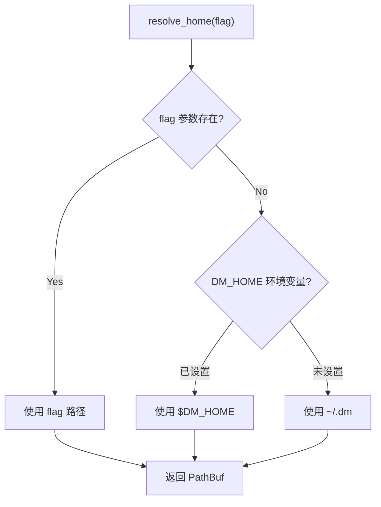
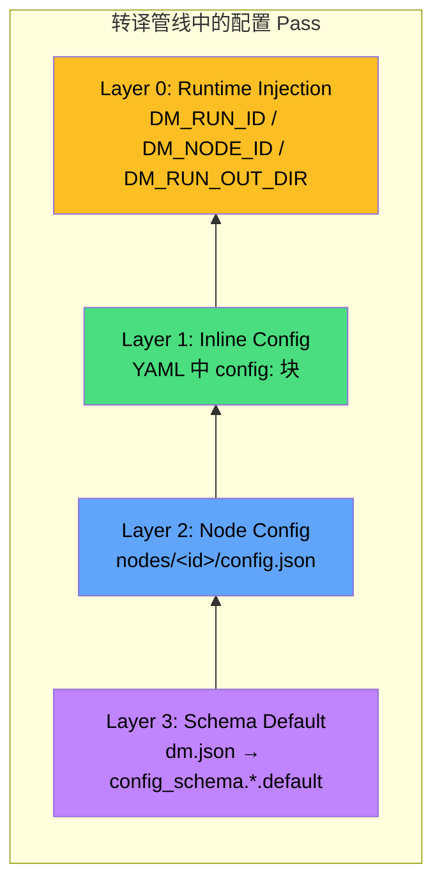
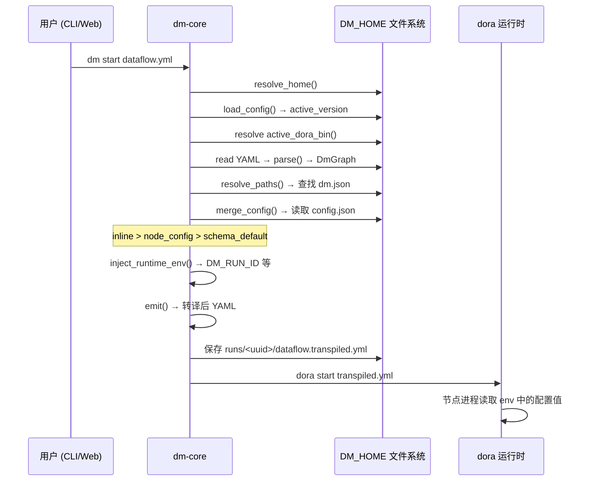

Dora Manager 的所有持久化状态——从 dora 二进制版本、节点安装、数据流项目、运行实例到事件日志——全部收敛于一个根目录 **DM_HOME**。这一设计哲学将「安装即配置」的零散问题收束为一个清晰的单点管理：一个目录，一份配置文件，一套纯函数路径解析。本文将系统性地拆解 DM_HOME 的解析机制、目录结构、config.toml 配置模型，以及贯穿整个数据流转译管线的四层配置合并策略。

Sources: [config.rs](https://github.com/l1veIn/dora-manager/blob/main/crates/dm-core/src/config.rs#L1-L167)

## DM_HOME 解析：三级优先链

`resolve_home()` 是整个配置体系的入口函数。所有 CLI 子命令和 dm-server 启动流程都通过它获得 DM_HOME 路径，随后将此路径作为 `&Path` 参数传入各子系统的路径解析函数。该函数的解析逻辑严格遵循以下三级优先级：

| 优先级 | 来源 | 适用场景 |
|---|---|---|
| 1（最高） | `--home` CLI 标志 | CI/CD 流水线、自动化测试隔离 |
| 2 | `DM_HOME` 环境变量 | 开发环境持久化覆盖、多实例并行 |
| 3（默认） | `~/.dm`（通过 `dirs::home_dir()` 解析） | 零配置即用，开箱即用 |



在 CLI 侧，`clap` 解析器通过 `#[arg(long, global = true)]` 将 `--home` 声明为全局标志，使其在所有子命令中均可使用。`main()` 入口函数调用 `dm_core::config::resolve_home(cli.home)` 解析路径后，将结果作为 `&Path` 逐层传递给各子命令处理函数。dm-server 则在启动时调用 `resolve_home(None)`，跳过 CLI 标志层，走环境变量或默认路径——这意味着服务器默认不响应 `--home` 标志，但可通过 `DM_HOME` 环境变量控制。

Sources: [config.rs](https://github.com/l1veIn/dora-manager/blob/main/crates/dm-core/src/config.rs#L105-L118), [main.rs (CLI)](https://github.com/l1veIn/dora-manager/blob/main/crates/dm-cli/src/main.rs#L19-L30), [main.rs (Server)](https://github.com/l1veIn/dora-manager/blob/main/crates/dm-server/src/main.rs#L79-L81)

## DM_HOME 目录结构全景

DM_HOME 并非在安装时一次性创建完整目录树，而是由各子系统**按需懒创建（lazy-create）**。以下是一个经过完整使用周期后的典型目录结构：

```
~/.dm/                              ← DM_HOME 根目录
├── config.toml                     ← 全局配置 (DmConfig)
├── versions/                       ← 已安装的 dora 运行时
│   └── 0.4.1/
│       └── dora                    ← 可执行二进制 (Windows: dora.exe)
├── dataflows/                      ← 已导入的数据流项目
│   └── system-test-full/
│       ├── dataflow.yml            ← YAML 拓扑定义
│       ├── flow.json               ← 项目元数据 (FlowMeta)
│       ├── view.json               ← 可视化编辑器布局
│       ├── config.json             ← 数据流级配置覆盖
│       └── .history/               ← 版本快照历史
│           └── 20250101T120000Z.yml
├── nodes/                          ← 已安装的管理节点
│   └── dm-microphone/
│       ├── dm.json                 ← 节点元数据与配置 schema
│       ├── config.json             ← 节点级配置覆盖
│       ├── pyproject.toml          ← Python 构建定义
│       └── dm_microphone/          ← 源码/构建产物
├── runs/                           ← 运行实例历史
│   └── <uuid>/
│       ├── run.json                ← 运行元数据 (RunInstance)
│       ├── dataflow.yml            ← 运行时数据流快照
│       ├── dataflow.transpiled.yml ← 转译后的 dora YAML
│       ├── view.json               ← 编辑器布局快照
│       ├── logs/                   ← 节点日志 (如 microphone.log)
│       └── out/                    ← 节点输出产物
└── events.db                       ← SQLite 事件存储 (WAL 模式)
```

每个子系统的路径解析均以**纯函数**形式实现——接受 `home: &Path` 参数而非全局可变状态。这一设计确保了可测试性（测试中可使用临时目录）和隔离性（多个 DM_HOME 实例互不干扰）。以下是关键路径函数的完整映射：

| 子系统 | 路径函数 | 目标路径 | 职责 |
|---|---|---|---|
| 全局配置 | `config_path()` | `home/config.toml` | DmConfig 持久化 |
| 版本管理 | `versions_dir()` | `home/versions` | dora 二进制存放 |
| 节点管理 | `nodes_dir()` | `home/nodes` | 托管节点目录 |
| 数据流 | `dataflows_dir()` | `home/dataflows` | 项目 YAML + 元数据 |
| 运行实例 | `runs_dir()` | `home/runs` | 运行历史与日志 |
| 事件存储 | `EventStore::open()` | `home/events.db` | SQLite 可观测性 |

Sources: [paths.rs (dataflow)](https://github.com/l1veIn/dora-manager/blob/main/crates/dm-core/src/dataflow/paths.rs#L1-L36), [paths.rs (node)](https://github.com/l1veIn/dora-manager/blob/main/crates/dm-core/src/node/paths.rs#L1-L27), [repo.rs (runs)](https://github.com/l1veIn/dora-manager/blob/main/crates/dm-core/src/runs/repo.rs#L1-L46), [store.rs (events)](https://github.com/l1veIn/dora-manager/blob/main/crates/dm-core/src/events/store.rs#L14-L44)

### dataflows/ 子目录详解

每个导入的数据流项目在 `dataflows/` 下拥有独立子目录，包含多个辅助文件。`initialize_flow_project()` 函数负责创建 `.history/` 目录和初始 `flow.json` 元数据。每次保存 YAML 时，若内容发生变化，旧版本会被自动快照到 `.history/` 中，文件名采用 ISO 时间戳格式（如 `20250101T120000Z.yml`），支持完整的版本回溯与恢复。

| 文件 | 数据模型 | 创建时机 |
|---|---|---|
| `dataflow.yml` | 原始 YAML 文本 | 导入或首次保存 |
| `flow.json` | `FlowMeta`（id, name, description, tags, author 等） | `initialize_flow_project()` |
| `view.json` | 可视化编辑器节点布局 | 用户在前端编辑器中操作后 |
| `config.json` | 数据流级配置覆盖值 | 用户为数据流中的节点设置专属参数时 |
| `.history/*.yml` | 历史版本快照 | 每次 YAML 内容变更时 |

Sources: [repo.rs (dataflow)](https://github.com/l1veIn/dora-manager/blob/main/crates/dm-core/src/dataflow/repo.rs#L256-L325), [paths.rs (dataflow)](https://github.com/l1veIn/dora-manager/blob/main/crates/dm-core/src/dataflow/paths.rs#L1-L36)

### runs/ 子目录详解

运行实例目录包含一次数据流执行的完整生命周期记录。`create_layout()` 在启动运行时创建目录结构，确保 `out/` 输出目录存在。节点日志有两种存储位置：新版运行使用 `out/<dora_uuid>/log_<node_id>.txt`（由 dora 运行时直接写入），旧版使用 `logs/<node_id>.log`。

| 文件 | 数据模型 | 写入时机 |
|---|---|---|
| `run.json` | `RunInstance`（状态、指标、时间戳等） | 运行启动/状态变更时 |
| `dataflow.yml` | 原始 YAML 快照 | 运行启动时 |
| `dataflow.transpiled.yml` | 转译后的 dora YAML | 转译管线输出 |
| `view.json` | 编辑器布局快照 | 运行启动时 |
| `out/` | 节点输出产物 | 运行时由节点写入 |
| `logs/` | 节点日志（旧版） | 运行时由日志采集写入 |

Sources: [repo.rs (runs)](https://github.com/l1veIn/dora-manager/blob/main/crates/dm-core/src/runs/repo.rs#L9-L46), [model.rs (runs)](https://github.com/l1veIn/dora-manager/blob/main/crates/dm-core/src/runs/model.rs#L127-L184)

## config.toml：全局配置模型

`config.toml` 是 DM_HOME 根目录下的**唯一全局配置文件**，使用 TOML 格式序列化 `DmConfig` 结构体。它的设计遵循**渐进式配置**原则：文件不存在时 `load_config()` 返回 `DmConfig::default()`，所有字段均提供合理默认值，用户无需手动创建即可正常使用。

### DmConfig 完整字段参考

```toml
# 当前激活的 dora 版本标识 (如 "0.4.1")
# None = 尚未安装任何版本，dm setup 会自动安装
active_version = "0.4.1"

[media]
# 是否启用媒体后端（流媒体支持）
enabled = false
# 后端类型，目前仅支持 "media_mtx"
backend = "media_mtx"

[media.mediamtx]
# mediamtx 二进制路径 (None = 自动下载到 DM_HOME)
path = "/usr/local/bin/mediamtx"
# 指定版本 (None = 最新版)
version = "1.11.3"
# 是否自动下载 mediamtx（首次使用时）
auto_download = true
# API 端口（mediamtx 管理接口）
api_port = 9997
# RTSP 端口（流媒体推送/拉取）
rtsp_port = 8554
# HLS 端口（HTTP 直播流）
hls_port = 8888
# WebRTC 端口（低延迟浏览器流）
webrtc_port = 8889
# 监听地址（通常为 127.0.0.1）
host = "127.0.0.1"
# 公网访问地址（部署场景，覆盖 host）
public_host = "192.168.1.100"
# 完整的公网 WebRTC URL（覆盖 host:port 组合）
public_webrtc_url = "http://192.168.1.100:8889"
# 完整的公网 HLS URL
public_hls_url = "http://192.168.1.100:8888"
```

| 字段 | 类型 | 默认值 | 用途 |
|---|---|---|---|
| `active_version` | `Option<String>` | `None` | 标记当前使用的 dora 版本，对应 `versions/` 下的目录名 |
| `media.enabled` | `bool` | `false` | 是否启用流媒体后端 |
| `media.backend` | `MediaBackend` | `MediaMtx` | 后端类型（当前仅支持 MediaMTX） |
| `media.mediamtx.path` | `Option<String>` | `None` | 手动指定 mediamtx 路径，None 则自动下载 |
| `media.mediamtx.auto_download` | `bool` | `true` | 首次使用时是否自动下载 mediamtx |
| `media.mediamtx.api_port` | `u16` | `9997` | mediamtx 管理 API 端口 |
| `media.mediamtx.rtsp_port` | `u16` | `8554` | RTSP 流媒体端口 |
| `media.mediamtx.hls_port` | `u16` | `8888` | HLS 直播流端口 |
| `media.mediamtx.webrtc_port` | `u16` | `8889` | WebRTC 低延迟流端口 |
| `media.mediamtx.host` | `String` | `"127.0.0.1"` | mediamtx 监听地址 |
| `media.mediamtx.public_host` | `Option<String>` | `None` | 公网部署时的外部访问地址 |
| `media.mediamtx.public_webrtc_url` | `Option<String>` | `None` | 完整的公网 WebRTC URL |
| `media.mediamtx.public_hls_url` | `Option<String>` | `None` | 完整的公网 HLS URL |

Sources: [config.rs](https://github.com/l1veIn/dora-manager/blob/main/crates/dm-core/src/config.rs#L6-L103)

### 配置加载与持久化

`load_config()` 和 `save_config()` 构成配置 I/O 的完整闭环。加载时，若文件不存在则返回默认实例（不创建文件）；保存时，`toml::to_string_pretty()` 生成人类可读的 TOML 格式，同时 `create_dir_all()` 确保 DM_HOME 根目录存在。这意味着首次调用 `save_config()` 时会自动创建 `~/.dm/` 目录。

dm-server 通过 `GET /api/config` 和 `POST /api/config` 两个端点暴露运行时配置管理。`POST` 端点执行**读取-合并-写回（read-modify-write）**语义：先加载现有配置，仅覆盖请求体中提供的字段（`active_version` 和/或 `media`），最后序列化回磁盘。这避免了并发写入时的全量覆盖问题。

Sources: [config.rs](https://github.com/l1veIn/dora-manager/blob/main/crates/dm-core/src/config.rs#L147-L166), [system.rs (handlers)](https://github.com/l1veIn/dora-manager/blob/main/crates/dm-server/src/handlers/system.rs#L58-L107)

### MediaConfig 的运行时作用

`MediaConfig` 在 dm-server 启动时被加载并注入 `MediaRuntime`。当 `media.enabled = true` 时，服务器会初始化 mediamtx 进程作为流媒体后端，使用配置中的端口号生成 mediamtx 配置文件。`public_host`、`public_webrtc_url`、`public_hls_url` 字段专用于**非本地部署场景**——当 dm-server 运行在远程服务器上时，前端需要通过这些公网地址访问流媒体，而非 `127.0.0.1`。

Sources: [media.rs](https://github.com/l1veIn/dora-manager/blob/main/crates/dm-server/src/services/media.rs#L1-L50), [main.rs (Server)](https://github.com/l1veIn/dora-manager/blob/main/crates/dm-server/src/main.rs#L79-L95)

## 四层配置合并管线

Dora Manager 的配置体系并非扁平的 key-value 存储，而是一个**从 schema 定义到运行时注入的四层合并管线**。这一管线在数据流转译（transpile）过程中执行，确保每个受管节点的环境变量由多层配置源按优先级叠加而成。转译管线共包含 7 个 Pass，其中配置相关的 Pass 为 Pass 3（`merge_config`）和 Pass 4（`inject_runtime_env`）。



### 合并逻辑详解

`merge_config` Pass 遍历数据流中的每个受管节点（`DmNode::Managed`），从 `__dm_meta_path`（由 `resolve_paths` Pass 预存）读取节点的 `dm.json` 元数据。对 `config_schema` 中声明的每个字段，按以下优先级取第一个非 `null` 值：

| 优先级 | 层级 | 来源文件 | 作用域 | 示例 |
|---|---|---|---|---|
| 1（最高） | Inline Config | YAML `config:` 块 | 单个数据流实例 | `config: { sample_rate: 16000 }` |
| 2 | Node Config | `nodes/<id>/config.json` | 该节点的所有使用场景 | `{"sample_rate": 48000}` |
| 3 | Schema Default | `dm.json` → `config_schema` | 节点定义时的默认值 | `"default": 44100` |
| 4（运行时） | Runtime Injection | 转译器自动生成 | 所有受管节点 | `DM_RUN_ID`, `DM_NODE_ID` |

合并后的值以**环境变量**形式写入 `merged_env` 映射表，字段 schema 中的 `env` 键指定了目标环境变量名。最终 `emit` Pass 将 `merged_env` 输出到 dora YAML 的 `env:` 块中。

Sources: [passes.rs](https://github.com/l1veIn/dora-manager/blob/main/crates/dm-core/src/dataflow/transpile/passes.rs#L348-L421), [mod.rs (transpile)](https://github.com/l1veIn/dora-manager/blob/main/crates/dm-core/src/dataflow/transpile/mod.rs#L1-L84)

### config.json：节点级配置持久化

每个受管节点目录下的 `config.json` 是用户通过前端或 API 保存的**节点级配置覆盖**。它的值介于 schema 默认值和 inline config 之间——同一节点在不同数据流中可以使用不同 inline 值，但 `config.json` 为该节点提供了一个跨数据流的统一基线。

```json
// nodes/dm-microphone/config.json
{
  "sample_rate": 48000,
  "channels": 1
}
```

`get_node_config()` 在读取时自动处理文件不存在的情况（返回空对象 `{}`），`save_node_config()` 则通过 `serde_json::to_string_pretty()` 写入格式化的 JSON。前端通过 `GET/POST /api/nodes/{id}/config` 端点进行交互。

Sources: [local.rs (node)](https://github.com/l1veIn/dora-manager/blob/main/crates/dm-core/src/node/local.rs#L173-L232)

### 配置聚合 API：inspect_config

`inspect_config()` 函数实现了**配置聚合查询**，它对数据流中每个受管节点扫描三层配置源（inline、node config、schema default），返回一个 `DataflowConfigAggregation` 结构。每个配置字段都包含 `inline_value`、`node_value`、`default_value`、`effective_value` 和 `effective_source`，前端据此展示「当前值来自何处」的溯源信息。

| effective_source | 含义 |
|---|---|
| `"inline"` | 来自 YAML `config:` 块 |
| `"node"` | 来自 `config.json` 持久化配置 |
| `"default"` | 来自 `dm.json` 的 schema default |
| `"unset"` | 三层均未提供值 |

该 API 通过 `GET /api/dataflows/{name}/config-schema` 端点暴露，前端利用它为每个节点渲染参数配置面板，并标注每个参数值的来源层级。

Sources: [service.rs (dataflow)](https://github.com/l1veIn/dora-manager/blob/main/crates/dm-core/src/dataflow/service.rs#L101-L215), [model.rs (dataflow)](https://github.com/l1veIn/dora-manager/blob/main/crates/dm-core/src/dataflow/model.rs#L140-L171), [dataflow.rs (handlers)](https://github.com/l1veIn/dora-manager/blob/main/crates/dm-server/src/handlers/dataflow.rs#L145-L154)

## 节点搜索路径：DM_NODE_DIRS

节点的路径解析不仅限于 `DM_HOME/nodes/`，而是通过 `configured_node_dirs()` 构建一个**有序搜索链**。`resolve_node_dir()` 遍历搜索链，返回第一个包含目标节点 ID 的目录。`push_unique()` 确保不会因路径重复而浪费搜索。

| 优先级 | 搜索路径 | 来源 |
|---|---|---|
| 1 | `DM_HOME/nodes/` | 用户安装/导入的节点 |
| 2 | `builtin_nodes_dir()`（项目仓库 `nodes/` 目录） | 编译时内建节点 |
| 3 | `DM_NODE_DIRS` 环境变量中的额外路径 | 开发者自定义外部节点仓库 |

```bash
# 示例：挂载外部节点仓库
export DM_NODE_DIRS="/opt/dora-nodes:/home/user/my-nodes"
```

这一机制让开发者可以在不修改 DM_HOME 的情况下，通过环境变量挂载外部节点仓库，非常适合 CI/CD 环境和节点开发调试。

Sources: [paths.rs (node)](https://github.com/l1veIn/dora-manager/blob/main/crates/dm-core/src/node/paths.rs#L1-L52)

## 运行时环境变量注入

转译管线的 `inject_runtime_env` Pass 为每个受管节点注入三个**运行时环境变量**。这些变量不在任何配置文件中声明，而是由转译器根据运行上下文动态生成，优先级高于所有用户配置层：

| 环境变量 | 来源 | 用途 |
|---|---|---|
| `DM_RUN_ID` | UUID v4 自动生成 | 运行实例唯一标识 |
| `DM_NODE_ID` | YAML 中的 `id` 字段 | 节点在数据流中的标识 |
| `DM_RUN_OUT_DIR` | `DM_HOME/runs/<run_id>/out` | 节点输出产物目录 |

这些变量使节点能够在运行时感知自身上下文——例如 `dm-save` 节点通过 `DM_RUN_OUT_DIR` 知道将文件写入何处，`dm-input` 节点通过 `DM_SERVER_URL`（由 Bridge 注入）与前端交互。

Sources: [passes.rs](https://github.com/l1veIn/dora-manager/blob/main/crates/dm-core/src/dataflow/transpile/passes.rs#L427-L450)

## 事件存储：events.db

`EventStore` 在 DM_HOME 根目录下维护一个 SQLite 数据库 `events.db`，启用 **WAL（Write-Ahead Logging）** 模式以支持并发读写。它记录所有操作事件（节点安装、数据流转译、运行启停等），为可观测性提供结构化查询能力。数据库在 `EventStore::open()` 时自动创建，包含 `events` 表和四个索引（case_id、source、timestamp、activity），支持高效的时间范围和来源过滤查询。

Sources: [store.rs (events)](https://github.com/l1veIn/dora-manager/blob/main/crates/dm-core/src/events/store.rs#L14-L44)

## 配置 API 端点

dm-server 暴露两个端点用于运行时配置管理：

| 方法 | 路径 | 行为 |
|---|---|---|
| `GET` | `/api/config` | 读取当前 `config.toml`，返回 JSON |
| `POST` | `/api/config` | 合并更新（`active_version` 和/或 `media`），写回 `config.toml` |

`POST /api/config` 接受 `ConfigUpdate` 请求体，执行**读取-合并-写回**语义：先加载现有配置，然后仅覆盖请求中提供的字段，最后序列化回磁盘。`media` 字段会先经过 `serde_json::from_value::<MediaConfig>()` 反序列化校验，无效值将返回 400 错误。

Sources: [system.rs (handlers)](https://github.com/l1veIn/dora-manager/blob/main/crates/dm-server/src/handlers/system.rs#L58-L107)

## 完整配置流：从用户操作到节点进程

以下时序图展示了从用户发起 `dm start` 到节点进程读取配置值的完整数据流：



Sources: [transpile/mod.rs](https://github.com/l1veIn/dora-manager/blob/main/crates/dm-core/src/dataflow/transpile/mod.rs#L33-L84), [config.rs](https://github.com/l1veIn/dora-manager/blob/main/crates/dm-core/src/config.rs#L147-L166), [dora.rs](https://github.com/l1veIn/dora-manager/blob/main/crates/dm-core/src/dora.rs#L20-L35)

## 设计原则总结

| 原则 | 实现方式 |
|---|---|
| **单根目录** | 所有状态收敛于 DM_HOME，备份/迁移只需复制一个目录 |
| **渐进式配置** | `config.toml` 不存在时使用默认值，无需手动创建 |
| **纯函数路径** | 所有路径函数接受 `&Path` 而非全局状态，确保可测试性 |
| **按需创建** | 子目录由各子系统在首次使用时创建，避免空目录树 |
| **四层合并** | 从 schema default 到 runtime injection 的清晰优先级链 |
| **环境变量传递** | 最终配置以 `env:` 形式传递给 dora，与节点实现语言无关 |

Sources: [config.rs](https://github.com/l1veIn/dora-manager/blob/main/crates/dm-core/src/config.rs#L1-L167), [tests_config.rs](https://github.com/l1veIn/dora-manager/blob/main/crates/dm-core/src/tests/tests_config.rs#L1-L148)

## 延伸阅读

- **四层配置合并的转译管线细节**：参见 [数据流转译器（Transpiler）：多 Pass 管线与四层配置合并](11-shu-ju-liu-zhuan-yi-qi-transpiler-duo-pass-guan-xian-yu-si-ceng-pei-zhi-he-bing)
- **节点 dm.json 的完整字段定义**：参见 [自定义节点开发指南：dm.json 完整字段参考](9-zi-ding-yi-jie-dian-kai-fa-zhi-nan-dm-json-wan-zheng-zi-duan-can-kao)
- **运行实例的生命周期与状态管理**：参见 [运行实例（Run）：生命周期状态机与指标追踪](6-yun-xing-shi-li-run-sheng-ming-zhou-qi-zhuang-tai-ji-yu-zhi-biao-zhui-zong)
- **事件存储的查询与导出**：参见 [事件系统：可观测性模型与 XES 兼容事件存储](14-shi-jian-xi-tong-ke-guan-ce-xing-mo-xing-yu-xes-jian-rong-shi-jian-cun-chu)
- **节点管理系统的路径解析与沙箱隔离**：参见 [节点管理系统：安装、导入、路径解析与沙箱隔离](12-jie-dian-guan-li-xi-tong-an-zhuang-dao-ru-lu-jing-jie-xi-yu-sha-xiang-ge-chi)