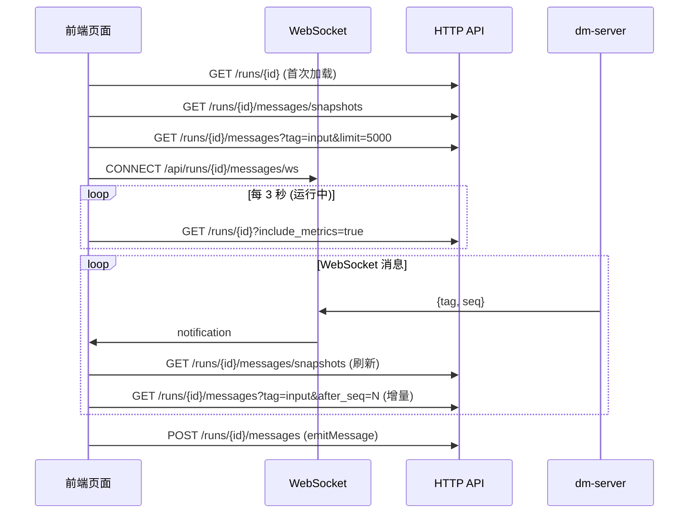

运行工作台（Run Workspace）是 Dora Manager 前端的核心运行时界面，负责将一次数据流运行实例（Run）的所有可观测信息——节点日志、消息流、输入控件、图表、视频流——整合到一个可自由布局的面板系统中。本文将从**页面骨架**、**GridStack 网格引擎**、**面板注册表与渲染管线**、**实时通信模型**四个维度展开解析。

Sources: [+page.svelte](https://github.com/l1veIn/dora-manager/blob/master/web/src/routes/runs/[id]/+page.svelte#L1-L510)

## 页面骨架：三层分区结构

运行工作台的页面布局采用经典的「Header + Sidebar + Main Content」三层分区，由 [`+page.svelte`](https://github.com/l1veIn/dora-manager/blob/master/web/src/routes/runs/[id]/+page.svelte) 统一编排：

```
┌──────────────────────────────────────────────────────────┐
│  RunHeader (h-14)                                        │
│  [← Runs / name] [Status] [Stop] [YAML] [Transpiled] [Graph] │
├────────────┬─────────────────────────────────────────────┤
│  Sidebar   │  Workspace Toolbar (h-10)                   │
│  (300px)   │  [Toggle] [Workspace]         [+ Add Panel] │
│            ├─────────────────────────────────────────────┤
│ RunSummary │  GridStack 12-Column Workspace              │
│ Card       │  ┌──────────────┬──────────┐               │
│            │  │ MessagePanel │ Input    │               │
│ Node List  │  │ (w:8 h:5)    │ (w:4 h:5)│               │
│ (scrollable)│  └──────────────┴──────────┘               │
│            │  ┌──────────────────────────┐               │
│            │  │ TerminalPanel (w:12 h:4) │               │
│            │  └──────────────────────────┘               │
└────────────┴─────────────────────────────────────────────┘
```

**顶栏 RunHeader** 提供运行元信息（名称、状态徽章）、Stop 控制按钮，以及三个只读视图入口——YAML 原文、转译后 YAML、运行时拓扑图。后两者通过 Dialog 模态弹窗展示，数据按需懒加载。

**左侧边栏**（`isRunSidebarOpen` 控制折叠）由 [`RunSummaryCard`](https://github.com/l1veIn/dora-manager/blob/master/web/src/routes/runs/[id]/RunSummaryCard.svelte) 和 [`RunNodeList`](https://github.com/l1veIn/dora-manager/blob/master/web/src/routes/runs/[id]/RunNodeList.svelte) 两部分组成。SummaryCard 展示 Run ID、启动时间、持续时长、退出码、活跃节点数等元数据，以及 CPU/内存全局指标徽章。NodeList 则以可滚动列表呈现所有节点，每项附带 CPU 和内存 Badge（运行中时从 metrics 获取）或日志文件大小（停止后），点击节点会触发 `openNodeTerminal()` 自动在 Workspace 中定位或注入终端面板。

**右侧主区域**包含一个工具栏和 GridStack 网格容器。工具栏左侧为侧边栏折叠按钮，右侧为 "Add Panel" 下拉菜单，支持动态添加五种面板类型。

Sources: [+page.svelte](https://github.com/l1veIn/dora-manager/blob/master/web/src/routes/runs/[id]/+page.svelte#L395-L510), [RunHeader.svelte](https://github.com/l1veIn/dora-manager/blob/master/web/src/routes/runs/[id]/RunHeader.svelte#L107-L188), [RunSummaryCard.svelte](https://github.com/l1veIn/dora-manager/blob/master/web/src/routes/runs/[id]/RunSummaryCard.svelte#L26-L198), [RunNodeList.svelte](https://github.com/l1veIn/dora-manager/blob/master/web/src/routes/runs/[id]/RunNodeList.svelte#L29-L110)

## GridStack 网格引擎：12 列自由布局

Workspace 组件（[`Workspace.svelte`](https://github.com/l1veIn/dora-manager/blob/master/web/src/lib/components/workspace/Workspace.svelte)）使用 **GridStack.js** 作为网格布局引擎，配置为 12 列、80px 单元格高度、10px 间距的响应式网格：

```typescript
GridStack.init({
    column: 12,
    cellHeight: 80,
    margin: 10,
    float: true,       // 允许垂直方向留空
    animate: true,
    handle: '.grid-drag-handle',  // 仅标题栏可拖拽
    resizable: { handles: 's, e, se' },  // 三个方向可缩放
});
```

### Svelte-GridStack 桥接：`gridWidget` Action

核心挑战在于 GridStack 需要直接操控 DOM 元素的位置与尺寸，而 Svelte 通过 `{#each}` 响应式地管理 DOM 生命周期。两者通过一个 **Svelte Action** `gridWidget` 实现桥接：

1. **创建阶段**：Svelte `{#each}` 渲染每个 `gridItems` 条目时，`use:gridWidget` 将 `gs-id`/`gs-x`/`gs-y`/`gs-w`/`gs-h` 属性写入 DOM 节点，然后通过 `gridServer.makeWidget(node)` 将其纳入 GridStack 的物理引擎控制。
2. **拖拽/缩放变更**：GridStack `change` 事件回调中，遍历变更项同步回写 `gridItems` 状态数组，再通过 `onLayoutChange` 向上层传播。
3. **销毁阶段**：Svelte 移除 DOM 节点时触发 Action 的 `destroy()` 回调，调用 `gridServer.removeWidget(node, false)`（`false` 表示不销毁 DOM，交由 Svelte 处理）。

### 布局持久化

布局通过 `handleLayoutChange()` 持久化到 `localStorage`，键名为 `dm-workspace-layout-{run.name}`。页面首次加载时从 `localStorage` 恢复布局，并经过 `normalizeWorkspaceLayout()` 进行 schema 迁移——将旧版 `subscribedSourceId` 等字段转换为统一的 `nodes`/`tags` 数组格式。

Sources: [Workspace.svelte](https://github.com/l1veIn/dora-manager/blob/master/web/src/lib/components/workspace/Workspace.svelte#L1-L175), [types.ts](https://github.com/l1veIn/dora-manager/blob/master/web/src/lib/components/workspace/types.ts#L49-L146)

## 面板注册表与渲染管线

面板系统采用**注册表模式**，每种面板类型由一个 `PanelDefinition` 定义：

| 字段 | 类型 | 说明 |
|---|---|---|
| `kind` | `PanelKind` | 面板类型标识：`message` / `input` / `chart` / `table` / `video` / `terminal` |
| `title` | `string` | 面板标题栏显示名 |
| `dotClass` | `string` | 标题栏状态点 CSS 类（颜色标识） |
| `sourceMode` | `"history" \| "snapshot" \| "external"` | 数据获取模式 |
| `supportedTags` | `string[] \| "*"` | 面板关心的消息标签 |
| `defaultConfig` | `PanelConfig` | 新建面板时的默认配置 |
| `component` | `any` | 面板渲染组件（Svelte 组件引用） |

注册表在 [`registry.ts`](https://github.com/l1veIn/dora-manager/blob/master/web/src/lib/components/workspace/panels/registry.ts) 中以 `Record<PanelKind, PanelDefinition>` 形式维护，通过 `getPanelDefinition(kind)` 查询，未找到时降级为 `message` 面板。

### 六种面板一览

| 面板 | sourceMode | 默认标签 | 核心功能 |
|---|---|---|---|
| **Message** | `history` | `["*"]` | 节点消息流，双向无限滚动，节点/标签过滤 |
| **Input** | `snapshot` | `["widgets"]` | 响应式控件网格，10 种控件类型，实时发送 |
| **Chart** | `snapshot` | `["chart"]` | 折线图/柱状图，layerchart 渲染，多序列 |
| **Table** | `snapshot` | `["table"]` | 复用 MessagePanel 组件 |
| **Video** | `snapshot` | `["stream"]` | Plyr + HLS.js 媒体播放，手动/消息双模式 |
| **Terminal** | `external` | `[]` | 节点日志查看，tail 轮询，下载导出 |

### 渲染管线

Workspace 的 `{#each}` 循环对每个 `gridItems` 条目执行以下渲染管线：

```
gridItems[i] → getPanelDefinition(item.widgetType)
                    ↓
            PanelComponent (Svelte组件)
                    ↗
RootWidgetWrapper (标题栏 + 最大化 + 关闭)
```

[`RootWidgetWrapper`](https://github.com/l1veIn/dora-manager/blob/master/web/src/lib/components/workspace/widgets/RootWidgetWrapper.svelte) 为所有面板提供统一外壳——一个带有 `.grid-drag-handle` 类的 32px 标题栏（面板名称 + 彩色圆点 + 最大化/关闭按钮），双击标题栏或点击最大化按钮可切换全屏覆盖模式（`fixed inset-0 z-50`），Escape 键退出。

面板组件接收统一的 `PanelRendererProps`（包含 `item`/`api`/`context`/`onConfigChange`），其中 `PanelContext` 是面板与运行时交互的核心上下文：

```typescript
type PanelContext = {
    runId: string;
    snapshots: any[];                          // 消息快照列表
    inputValues: Record<string, any>;          // 输入控件当前值
    nodes: any[];                              // 运行节点列表
    refreshToken: number;                      // 数据刷新令牌
    isRunActive: boolean;                      // 运行是否活跃
    emitMessage: (message: {...}) => Promise<void>;  // 发送消息到数据流
};
```

Sources: [registry.ts](https://github.com/l1veIn/dora-manager/blob/master/web/src/lib/components/workspace/panels/registry.ts#L1-L80), [types.ts](https://github.com/l1veIn/dora-manager/blob/master/web/src/lib/components/workspace/panels/types.ts#L1-L41), [RootWidgetWrapper.svelte](https://github.com/l1veIn/dora-manager/blob/master/web/src/lib/components/workspace/widgets/RootWidgetWrapper.svelte#L1-L45)

## 五种面板实现详解

### Message 面板：双向无限滚动消息流

Message 面板（[`MessagePanel.svelte`](https://github.com/l1veIn/dora-manager/blob/master/web/src/lib/components/workspace/panels/message/MessagePanel.svelte)）是最复杂的面板之一。它使用 `createMessageHistoryState()` 创建一个基于 Svelte 5 `$state` 的消息状态管理器，支持三种加载模式：

- **`loadInitial()`**：首次加载最新 50 条消息（`desc: true`），倒序获取后正序排列
- **`loadNew()`**：基于 `newestSeq` 增量获取新消息（`after_seq`），用于实时推送
- **`loadOld()`**：基于 `oldestSeq` 向上翻页加载历史消息（`before_seq` + `desc: true`），保持滚动位置

消息条目通过 [`MessageItem.svelte`](https://github.com/l1veIn/dora-manager/blob/master/web/src/lib/components/workspace/panels/message/MessageItem.svelte) 渲染，根据 `tag` 字段自动选择渲染方式：`text`（等宽文本）、`image`（viewerjs 全屏预览）、`video`（原生播放器）、`audio`（音频控件）、`json`（JSON 树形展示）、`markdown`（marked 渲染）、未知标签则降级为 JSON 默认视图。

### Input 面板：响应式控件网格

Input 面板（[`InputPanel.svelte`](https://github.com/l1veIn/dora-manager/blob/master/web/src/lib/components/workspace/panels/input/InputPanel.svelte)）从 `snapshots` 中筛选 `tag === "widgets"` 的快照，将每个快照的 `payload.widgets` 展开为控件网格。支持 10 种控件类型：

| 控件类型 | 组件 | 交互方式 |
|---|---|---|
| `input` | ControlInput | 文本输入，即时发送 |
| `textarea` | ControlTextarea | 多行文本 |
| `button` | ControlButton | 点击触发 |
| `select` | ControlSelect | 下拉选择 |
| `slider` | ControlSlider | 滑块调节 |
| `switch` | ControlSwitch | 开关切换 |
| `radio` | ControlRadio | 单选按钮组 |
| `checkbox` | ControlCheckbox | 多选复选框 |
| `path`/`file_picker`/`directory` | ControlPath | 路径选择器 |
| `file` | 原生 `<input type="file">` | 文件上传（Base64 编码） |

控件的值通过 `context.emitMessage()` 以 `{from: "web", tag: "input", payload: {to, output_id, value}}` 格式发送到后端，再由 dm-server 转发到对应节点。Input 面板同时维护 `draftValues` 本地状态和 `context.inputValues` 服务端状态的优先级链：`draftValues > inputValues > widget.default`。

### Chart 面板：数据可视化

Chart 面板（[`ChartPanel.svelte`](https://github.com/l1veIn/dora-manager/blob/master/web/src/lib/components/workspace/panels/chart/ChartPanel.svelte)）使用 `layerchart` 库渲染折线图和柱状图。数据格式要求快照 `payload` 包含 `labels`（X 轴标签数组）和 `series`（数据系列数组，每项含 `name`/`data`/`color`）。内部通过 `dataset()` 和 `seriesDefs()` 两个转换函数将 payload 映射为 layerchart 所需的数据结构。

### Video 面板：双模式媒体播放

Video 面板（[`VideoPanel.svelte`](https://github.com/l1veIn/dora-manager/blob/master/web/src/lib/components/workspace/panels/video/VideoPanel.svelte)）封装了 [`PlyrPlayer`](https://github.com/l1veIn/dora-manager/blob/master/web/src/lib/components/workspace/panels/video/PlyrPlayer.svelte)（Plyr + HLS.js），提供两种工作模式：

- **手动模式**：用户直接输入媒体 URL，选择源类型（HLS/Video/Audio/Auto）
- **消息模式**：从 `tag === "stream"` 的快照中自动提取可用源，支持多种 payload 格式（`sources` 数组、`url`/`src` 字段、`hls_url` 字段、`viewer.hls_url` 字段、`path` 遗留格式），并自动推断源类型

PlyrPlayer 组件内部处理 HLS.js 初始化、媒体类型切换、错误处理和资源清理。

### Terminal 面板：节点日志终端

Terminal 面板（[`TerminalPanel.svelte`](https://github.com/l1veIn/dora-manager/blob/master/web/src/lib/components/workspace/panels/terminal/TerminalPanel.svelte)）是 [`RunLogViewer`](https://github.com/l1veIn/dora-manager/blob/master/web/src/routes/runs/[id]/RunLogViewer.svelte) 的面板包装。日志查看器支持全量加载（`fetchFullLog`）和增量 tail（`tailLog`，每 2 秒轮询），通过 `offset` 参数实现增量读取。日志内容经过 HTML 转义，并高亮 `[DM-IO]` 标记行（`text-sky-500`）。

Sources: [MessagePanel.svelte](https://github.com/l1veIn/dora-manager/blob/master/web/src/lib/components/workspace/panels/message/MessagePanel.svelte#L1-L212), [InputPanel.svelte](https://github.com/l1veIn/dora-manager/blob/master/web/src/lib/components/workspace/panels/input/InputPanel.svelte#L1-L249), [ChartPanel.svelte](https://github.com/l1veIn/dora-manager/blob/master/web/src/lib/components/workspace/panels/chart/ChartPanel.svelte#L1-L199), [VideoPanel.svelte](https://github.com/l1veIn/dora-manager/blob/master/web/src/lib/components/workspace/panels/video/VideoPanel.svelte#L1-L350), [TerminalPanel.svelte](https://github.com/l1veIn/dora-manager/blob/master/web/src/lib/components/workspace/panels/terminal/TerminalPanel.svelte#L1-L23), [RunLogViewer.svelte](https://github.com/l1veIn/dora-manager/blob/master/web/src/routes/runs/[id]/RunLogViewer.svelte#L1-L275), [message-state.svelte.ts](https://github.com/l1veIn/dora-manager/blob/master/web/src/lib/components/workspace/panels/message/message-state.svelte.ts#L1-L145)

## 实时通信模型

运行工作台的实时性通过三层机制协同实现：



### WebSocket 实时通知

WebSocket 连接（`/api/runs/{id}/messages/ws`）仅推送轻量级通知（包含 `tag` 和 `seq`），前端收到通知后主动拉取完整数据。这种 **"通知 + 拉取"** 模式避免了 WebSocket 传输大量 payload 的开销，同时保持了数据一致性。WebSocket 断开后自动 1 秒延迟重连。

### 定时轮询

主轮询（`mainPolling`）每 3 秒刷新运行详情和指标数据，仅在 `isRunActive` 为 `true` 时执行。运行结束后清空 `metrics` 并停止轮询。

### 增量数据获取

`fetchNewInputValues()` 通过 `after_seq` 参数只获取上次 `latestInputSeq` 之后的新输入值，避免重复传输。`fetchSnapshots()` 则全量刷新快照列表（通过 `snapshotRefreshInFlight` Promise 去重，防止并发请求）。`messageRefreshToken` 是一个单调递增计数器，每次数据变更后递增，驱动面板组件的 `$effect` 响应式更新。

Sources: [+page.svelte](https://github.com/l1veIn/dora-manager/blob/master/web/src/routes/runs/[id]/+page.svelte#L218-L393)

## 布局管理与面板动态操作

### 面板动态添加

`addWidget()` 函数通过 "Add Panel" 下拉菜单触发，计算当前布局中最大 `y + h` 值，在网格底部追加新面板（默认 w:6, h:4）。新面板的 `config` 从注册表的 `defaultConfig` 克隆，确保面板以合理默认值初始化。

### 节点终端自动注入

`openNodeTerminal()` 是连接侧边栏 NodeList 与 Workspace 的关键交互。当用户在侧边栏点击某个节点时，该函数执行以下逻辑：

1. 查找已绑定该 `nodeId` 的终端面板 → 直接定位
2. 查找任意空闲终端面板 → 复用并重设 `nodeId`
3. 无终端面板 → 调用 `mutateTreeInjectTerminal()` 在底部注入新的全宽终端面板

定位后通过 `scrollIntoView({ behavior: "smooth" })` 平滑滚动到目标面板，并添加 1.5 秒的 `ring-2 ring-primary/80` 高亮动画以引导用户注意力。

### 布局 Schema 迁移

`normalizeWorkspaceLayout()` 负责将旧版布局 schema 升级到当前版本。典型迁移包括：`stream` 面板类型重命名为 `message`；`subscribedSourceId` 转换为 `nodes` 数组；`subscribedInputs` 转换为 `nodes` 数组并设置默认 `tags: ["widgets"]`。

Sources: [+page.svelte](https://github.com/l1veIn/dora-manager/blob/master/web/src/routes/runs/[id]/+page.svelte#L58-L168), [types.ts](https://github.com/l1veIn/dora-manager/blob/master/web/src/lib/components/workspace/types.ts#L61-L146)

## 数据模型总结

### WorkspaceGridItem

每个网格面板由 `WorkspaceGridItem` 描述：

| 字段 | 类型 | 说明 |
|---|---|---|
| `id` | `string` | 随机生成唯一标识（7 位 base36） |
| `widgetType` | `PanelKind` | 面板类型枚举 |
| `config` | `PanelConfig` | 面板专属配置（nodes/tags/gridCols 等） |
| `x` / `y` | `number` | GridStack 网格坐标 |
| `w` / `h` | `number` | GridStack 网格尺寸 |
| `min` | `{w, h}?` | 最小尺寸约束（可选） |

### 默认布局

`getDefaultLayout()` 创建一个双面板默认布局——左侧 Message 面板（8 列 × 5 行）和右侧 Input 面板（4 列 × 5 行），在首次访问且无 localStorage 缓存时使用。

Sources: [types.ts](https://github.com/l1veIn/dora-manager/blob/master/web/src/lib/components/workspace/types.ts#L1-L58)

## 与其他页面的关联

运行工作台是 Dora Manager 前端架构中最复杂的页面，它整合了多个子系统的能力：

- 数据流 YAML 拓扑的定义与编辑参见 [可视化图编辑器：SvelteFlow 画布与 YAML 同步](15-graph-editor)
- 面板中 Input 控件的完整控件类型定义与渲染参见 [响应式组件（Widgets）：控件注册表与动态渲染](17-reactive-widgets)
- 后端消息 API 与 WebSocket 端点的实现细节参见 [HTTP API 路由全览与 Swagger 文档](12-http-api)
- dm-input / dm-display 交互节点如何产生和消费面板数据参见 [交互系统：dm-input / dm-display / WebSocket 消息流](21-interaction-system)
- Run 的生命周期与状态模型基础参见 [运行实例（Run）：生命周期、状态与指标追踪](06-run-lifecycle)