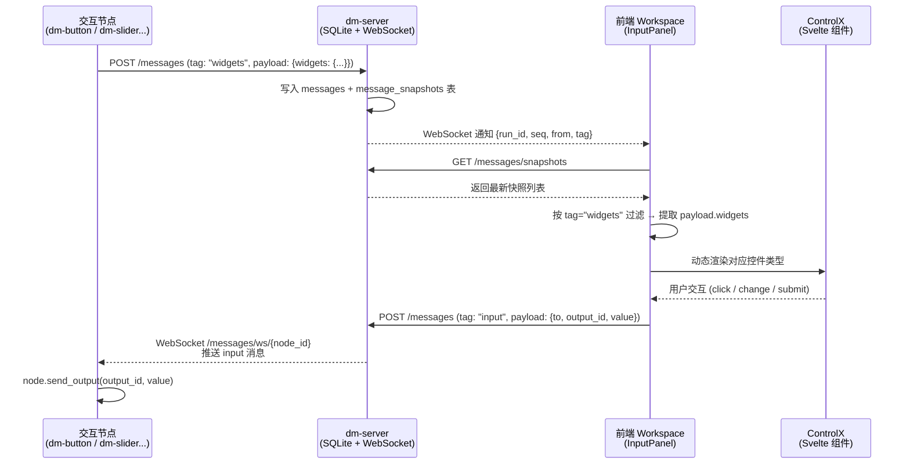
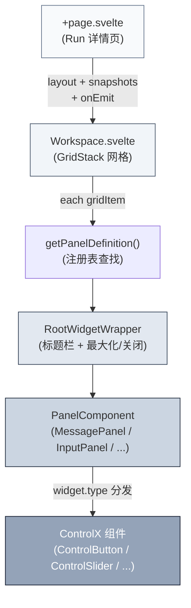

Dora Manager 的 Widget 系统是一套 **声明式、数据驱动的 UI 控件协议**——后端节点在启动时将自身的控件定义（按钮、滑块、输入框等）以 JSON 快照的形式注册到 dm-server，前端运行工作台的 InputPanel 根据这些快照动态渲染对应的 Svelte 组件，用户操作后产生的输入值通过 HTTP/WebSocket 回传至节点。整个过程形成了"节点声明 → 服务器中继 → 前端渲染 → 用户交互 → 节点接收"的完整闭环。本文将从架构全景、Widget 协议、面板注册表、控件类型矩阵以及实时通信管线五个维度展开分析。

Sources: [registry.ts](https://github.com/l1veIn/dora-manager/blob/master/web/src/lib/components/workspace/panels/registry.ts#L1-L80), [InputPanel.svelte](https://github.com/l1veIn/dora-manager/blob/master/web/src/lib/components/workspace/panels/input/InputPanel.svelte#L1-L249)

## 架构全景：Widget 的声明-渲染-回传循环

Widget 系统的核心设计遵循"**节点不碰 UI，UI 不碰 Arrow**"的原则。节点只需知道如何构造一个 JSON 描述，前端只需知道如何将这个描述映射到 Svelte 组件。两者通过 dm-server 的消息系统解耦。



上图展示了完整的数据流闭环。节点通过 HTTP POST 将 Widget 声明推送至 dm-server 的 `message_snapshots` 表——该表以 `(node_id, tag)` 为联合主键，意味着同一节点的同一标签只会保留最新的快照（UPSERT 语义）。前端通过 WebSocket 接收变更通知后，拉取最新快照列表，由 `InputPanel` 解析 `payload.widgets` 字典并按 `type` 字段分发到对应的 `ControlX` 组件。

Sources: [messages.rs (push)](https://github.com/l1veIn/dora-manager/blob/master/crates/dm-server/src/services/message.rs#L138-L161), [messages.rs (snapshots)](https://github.com/l1veIn/dora-manager/blob/master/crates/dm-server/src/services/message.rs#L226-L243), [+page.svelte (fetchSnapshots)](https://github.com/l1veIn/dora-manager/blob/master/web/src/routes/runs/[id]/+page.svelte#L218-L235)

## Widget 协议：JSON 声明格式

每个交互节点在启动时向 dm-server 发送一条 `tag: "widgets"` 的消息，其 `payload` 结构如下：

```json
{
  "label": "Temperature Control",
  "widgets": {
    "temperature": {
      "type": "slider",
      "label": "Temperature",
      "min": 0,
      "max": 100,
      "step": 1,
      "default": 50
    },
    "mode": {
      "type": "select",
      "label": "Mode",
      "options": ["auto", "manual", "scheduled"]
    }
  }
}
```

**`payload.label`** 是该节点的整体显示名称（对应 InputPanel 卡片标题），**`payload.widgets`** 是一个以 output_id 为键、控件定义为值的字典。每个控件定义必须包含 `type` 字段，其余字段因类型而异。关键语义如下：

| 字段 | 含义 | 适用类型 |
|------|------|---------|
| `type` | 控件类型标识符 | 全部 |
| `label` | 控件显示标签 | 全部 |
| `default` | 初始默认值 | input, textarea, slider, switch |
| `placeholder` | 占位提示文本 | input, textarea |
| `min` / `max` / `step` | 数值范围与步进 | slider |
| `options` | 选项列表（字符串或 `{value, label}` 对象） | select, radio, checkbox |
| `value` | 按钮发送值 | button |
| `variant` | 按钮视觉变体 (default/outline/ghost) | button |
| `switchLabel` | 开关旁的描述文字 | switch |

当用户操作控件时，前端向 dm-server 发送 `tag: "input"` 的消息，`payload` 结构为 `{to: nodeId, output_id: outputId, value: ...}`。后端通过 WebSocket 将此消息推送给目标节点，节点解析后调用 `node.send_output()` 将值注入 dora 数据流。

Sources: [dm-button main.py](https://github.com/l1veIn/dora-manager/blob/master/nodes/dm-button/dm_button/main.py#L102-L112), [dm-slider main.py](https://github.com/l1veIn/dora-manager/blob/master/nodes/dm-slider/dm_slider/main.py#L96-L108), [InputPanel.svelte (emitMessage)](https://github.com/l1veIn/dora-manager/blob/master/web/src/lib/components/workspace/panels/input/InputPanel.svelte#L87-L104)

## 面板注册表（Panel Registry）：类型系统与组件映射

面板注册表是 Widget 系统的核心路由层，定义在 [registry.ts](https://github.com/l1veIn/dora-manager/blob/master/web/src/lib/components/workspace/panels/registry.ts) 中。它将每种面板类型（`PanelKind`）映射到一个完整的 `PanelDefinition`，包括标题、视觉标识、数据源模式、标签过滤规则和 Svelte 组件引用。

```typescript
export type PanelKind = "message" | "input" | "chart" | "table" | "video" | "terminal";
```

当前系统注册了六种面板类型，各自的职责与数据消费模式如下：

| PanelKind | 标题 | 数据源模式 | 消费标签 | 用途 |
|-----------|------|-----------|---------|------|
| `message` | Message | `history`（历史消息流） | `*`（全部标签） | 消息时间线，展示所有节点通信 |
| `input` | Input | `snapshot`（最新快照） | `widgets` | Widget 控件面板，动态渲染用户输入界面 |
| `chart` | Chart | `snapshot`（最新快照） | `chart` | 数据可视化图表（LineChart / BarChart） |
| `table` | Table | `snapshot`（最新快照） | `table` | 表格数据展示 |
| `video` | Plyr | `snapshot`（最新快照） | `stream` | 视频流播放器（HLS / WebRTC） |
| `terminal` | Terminal | `external`（外部数据源） | — | 节点日志终端 |

**`sourceMode`** 字段决定了面板如何获取数据：

- **`history`**：通过 `createMessageHistoryState` 持续拉取消息历史，支持分页（前向 / 后向加载），适用于需要展示完整消息流的场景（如 MessagePanel）
- **`snapshot`**：通过 `createSnapshotViewState` 过滤 `context.snapshots` 数组，只展示符合当前过滤条件的最新快照，适用于 Widget 控件和图表等"最新状态优先"的场景
- **`external`**：面板自行管理数据获取逻辑（如 TerminalPanel 通过独立 WebSocket 连接获取日志）

每个 `PanelDefinition` 还包含 `defaultConfig`，在创建新面板实例时作为配置初始值。例如 InputPanel 的默认配置为 `{nodes: ["*"], tags: ["widgets"], gridCols: 2}`，表示监听所有节点的 widgets 标签，以两列网格布局展示。

Sources: [registry.ts](https://github.com/l1veIn/dora-manager/blob/master/web/src/lib/components/workspace/panels/registry.ts#L9-L79), [types.ts (PanelKind)](https://github.com/l1veIn/dora-manager/blob/master/web/src/lib/components/workspace/types.ts#L8), [types.ts (PanelDefinition)](https://github.com/l1veIn/dora-manager/blob/master/web/src/lib/components/workspace/panels/types.ts#L30-L40)

## 动态渲染机制：Workspace → RootWidgetWrapper → PanelComponent

运行工作台的渲染链路分为三个层级，从外到内逐层委托：



**第一层：Workspace.svelte** 是 GridStack 网格容器。它接收 `layout`（`WorkspaceGridItem[]`）、`snapshots`、`inputValues`、`onEmit` 等顶层属性，组装为 `PanelContext` 传递给所有面板。每个 `gridItem` 通过 Svelte Action `gridWidget` 与 GridStack 绑定，实现拖拽和调整大小。渲染时先通过 `getPanelDefinition(dataItem.widgetType)` 查找注册表，再动态实例化 `definition.component`。

**第二层：RootWidgetWrapper.svelte** 是所有面板的通用外壳，提供标题栏（含彩色圆点标识 `definition.dotClass`）、拖拽手柄、最大化/还原按钮和关闭按钮。它通过 `{@render children()}` 将内容区域委托给下一层。

**第三层：具体的 PanelComponent**（如 InputPanel）接收 `PanelRendererProps`，包括 `item`（当前面板配置）、`context`（运行时上下文）和 `onConfigChange` 回调。InputPanel 是 Widget 系统的核心消费者，它从 `context.snapshots` 中过滤 `tag === "widgets"` 的快照，提取 `payload.widgets` 字典，然后按每个 widget 的 `type` 字段分发到对应的 `ControlX` 组件。

Sources: [Workspace.svelte](https://github.com/l1veIn/dora-manager/blob/master/web/src/lib/components/workspace/Workspace.svelte#L131-L161), [RootWidgetWrapper.svelte](https://github.com/l1veIn/dora-manager/blob/master/web/src/lib/components/workspace/widgets/RootWidgetWrapper.svelte#L1-L45), [+page.svelte (Workspace 实例化)](https://github.com/l1veIn/dora-manager/blob/master/web/src/routes/runs/[id]/+page.svelte#L494-L504)

## 控件类型矩阵：九种内置 Widget

InputPanel 通过 `{#if widget.type === "..."}` 链式条件分发，支持九种（含别名共十一种）控件类型。每种类型对应一个独立的 Svelte 组件，遵循统一的 Props 接口模式。

| 控件类型 | 组件 | 关键 Props | 值类型 | 触发方式 |
|---------|------|-----------|--------|---------|
| `button` | ControlButton | `variant`, `value` | `string` | 点击 |
| `input` | ControlInput | `placeholder` | `string` | Enter 或点击发送按钮 |
| `textarea` | ControlTextarea | `placeholder` | `string` | Cmd/Ctrl+Enter 或点击发送 |
| `slider` | ControlSlider | `min`, `max`, `step` | `number` | 拖动松手 |
| `select` | ControlSelect | `options` | `string` | 选择后立即发送 |
| `switch` | ControlSwitch | `switchLabel` | `boolean` | 切换后立即发送 |
| `radio` | ControlRadio | `options` | `string` | 选择后点击发送 |
| `checkbox` | ControlCheckbox | `options` | `string[]` | 勾选后点击发送 |
| `path` / `file_picker` / `directory` | ControlPath | `mode` (file/directory) | `string` | 确认后发送 |
| `file` | 原生 `<input type="file">` | — | `string` (Base64) | 选择文件后发送 |

从交互模式上看，这些控件分为两类：

**即时发送型**（slider、select、switch）：用户操作后立即调用 `handleEmit()`，无需额外确认步骤。适合参数调节等需要快速反馈的场景。

**确认发送型**（input、textarea、radio、checkbox、path）：用户先修改草稿值（`draftValues`），通过 Enter 键、发送按钮或确认按钮显式提交。适合需要仔细编辑后再提交的场景。ControlInput 和 ControlTextarea 在发送按钮旁带有加载动画指示器（`sendingId === key` 时显示旋转边框）。

Sources: [InputPanel.svelte (widget 分发)](https://github.com/l1veIn/dora-manager/blob/master/web/src/lib/components/workspace/panels/input/InputPanel.svelte#L219-L241), [ControlButton.svelte](https://github.com/l1veIn/dora-manager/blob/master/web/src/lib/components/workspace/panels/input/controls/ControlButton.svelte#L1-L27), [ControlSlider.svelte](https://github.com/l1veIn/dora-manager/blob/master/web/src/lib/components/workspace/panels/input/controls/ControlSlider.svelte#L1-L32), [ControlSwitch.svelte](https://github.com/l1veIn/dora-manager/blob/master/web/src/lib/components/workspace/panels/input/controls/ControlSwitch.svelte#L1-L27)

## 实时通信管线：WebSocket 双通道架构

Widget 系统的实时性依赖 dm-server 的两条 WebSocket 通道，分别服务于不同角色：

**通道一：前端广播通道**（`/api/runs/{id}/messages/ws`）。前端连接此通道接收所有新消息的通知。当 `push_message` API 被调用时，dm-server 通过 `tokio::sync::broadcast` 将 `MessageNotification`（包含 `run_id, seq, from, tag`）发送给所有订阅者。前端收到通知后根据 `tag` 决定后续操作：如果是 `input` 类型则增量拉取最新输入值（`fetchNewInputValues`），其他类型则刷新快照列表（`fetchSnapshots`）。

**通道二：节点回传通道**（`/api/runs/{id}/messages/ws/{node_id}?since=N`）。交互节点连接此通道接收发往自己的 `input` 消息。建立连接时，dm-server 先回放 `since` 序号之后的历史消息（确保断线重连不丢数据），然后持续监听 broadcast 通道，过滤出 `from === "web" && tag === "input"` 且目标为该节点的消息推送过去。

后端消息存储使用 SQLite 的 **双表设计**：`messages` 表存储完整历史记录（INSERT ONLY），`message_snapshots` 表存储每个 `(node_id, tag)` 组合的最新状态（UPSERT）。Widget 声明之所以存入 `message_snapshots`，是因为前端只需要"当前有效"的控件定义，而非历史变更序列。输入值则不同——前端通过 `GET /messages?tag=input&limit=5000` 拉取全部历史输入，以 key-value 方式（`${nodeId}:${outputId}` → `value`）构建 `inputValues` 映射，用于恢复控件的上次状态。

Sources: [messages.rs (messages_ws)](https://github.com/l1veIn/dora-manager/blob/master/crates/dm-server/src/handlers/messages.rs#L223-L270), [messages.rs (node_ws)](https://github.com/l1veIn/dora-manager/blob/master/crates/dm-server/src/handlers/messages.rs#L272-L360), [state.rs (MessageNotification)](https://github.com/l1veIn/dora-manager/blob/master/crates/dm-server/src/state.rs#L14-L24), [+page.svelte (emitMessage)](https://github.com/l1veIn/dora-manager/blob/master/web/src/routes/runs/[id]/+page.svelte#L284-L296)

## 值解析策略：三级回退链与 Draft 机制

InputPanel 中控件值的解析遵循严格的优先级链，实现在 `initialValue()` 函数中：

```typescript
function initialValue(binding, outputId, widget) {
    const key = widgetKey(binding.node_id, outputId);  // "nodeId:outputId"
    if (draftValues[key] !== undefined) return draftValues[key];      // 1. 草稿值
    if (context.inputValues[key] !== undefined) return context.inputValues[key];  // 2. 历史输入
    if (widget?.default !== undefined) return widget.default;         // 3. 声明默认值
    if (widget?.type === "checkbox") return [];                       // 4. 类型零值
    if (widget?.type === "switch") return false;
    if (widget?.type === "slider") return widget?.min ?? 0;
    return "";
}
```

**第一优先级**是 `draftValues`——用户当前会话中的未提交编辑。这些值在用户修改控件时立即写入 `draftValues[key]`，确保即使组件因 Svelte 响应式更新而重新渲染，用户的编辑也不会丢失。**第二优先级**是 `context.inputValues`——从后端拉取的历史输入值，用于恢复上一次运行的控件状态。**第三优先级**是 `widget.default`——节点声明中指定的默认值。最后的兜底是按控件类型返回合理的零值（空字符串、空数组、false、0）。

当用户通过确认发送型控件提交值时，`handleEmit()` 先将值写入 `draftValues`，然后调用 `context.emitMessage()` POST 到后端，完成后清除 `sendingId`。这种设计确保了网络延迟期间 UI 仍然能立即反映用户操作。

Sources: [InputPanel.svelte (initialValue)](https://github.com/l1veIn/dora-manager/blob/master/web/src/lib/components/workspace/panels/input/InputPanel.svelte#L76-L85), [InputPanel.svelte (handleEmit)](https://github.com/l1veIn/dora-manager/blob/master/web/src/lib/components/workspace/panels/input/InputPanel.svelte#L87-L104)

## 布局持久化与面板生命周期

Workspace 的布局信息（`WorkspaceGridItem[]`）通过 `localStorage` 按数据流名称持久化，键名为 `dm-workspace-layout-${run.name}`。每次布局变更（拖拽、调整大小、添加/移除面板）都触发 `handleLayoutChange()`，将当前布局序列化存储。

**`WorkspaceGridItem`** 的结构包含位置信息（`x`, `y`, `w`, `h`）和面板配置（`widgetType`, `config`）：

```typescript
type WorkspaceGridItem = {
    id: string;              // 唯一 ID
    widgetType: PanelKind;   // 面板类型
    config: PanelConfig;     // 过滤条件 + 类型特有配置
    x: number; y: number;    // GridStack 网格坐标
    w: number; h: number;    // 宽高（以网格单元为单位）
    min?: { w: number; h: number };  // 最小尺寸
};
```

首次加载时，`normalizeWorkspaceLayout()` 负责处理向后兼容性——将旧版布局格式（如 `subscribedSourceId`、`subscribedInputs` 等废弃字段）转换为新格式，并补全缺失的默认配置。默认布局（`getDefaultLayout()`）生成一个 12 列网格：左侧 8 单元宽的 Message 面板 + 右侧 4 单元宽的 Input 面板。

用户通过运行页面的 "Add Panel" 下拉菜单可动态添加面板。`addWidget()` 计算当前布局的最大 Y 坐标，将新面板放置在底部。`mutateTreeInjectTerminal()` 则是一个特殊的辅助函数，当用户从节点列表中点击某个节点时，自动注入或复用 Terminal 面板并聚焦到该节点。

Sources: [types.ts (WorkspaceGridItem)](https://github.com/l1veIn/dora-manager/blob/master/web/src/lib/components/workspace/types.ts#L49-L58), [types.ts (getDefaultLayout)](https://github.com/l1veIn/dora-manager/blob/master/web/src/lib/components/workspace/types.ts#L61-L76), [types.ts (normalizeWorkspaceLayout)](https://github.com/l1veIn/dora-manager/blob/master/web/src/lib/components/workspace/types.ts#L108-L146), [+page.svelte (addWidget)](https://github.com/l1veIn/dora-manager/blob/master/web/src/routes/runs/[id]/+page.svelte#L77-L95)

## 扩展新控件类型的检查清单

若需添加一种新的 Widget 类型，需在以下三个层面进行修改：

**1. 前端：创建 ControlX 组件** — 在 `web/src/lib/components/workspace/panels/input/controls/` 下新建 Svelte 文件，定义 `Props` 接口（至少包含 `outputId`、`disabled`、`onSend` 或 `onValueChange`），并实现对应的 UI 交互。

**2. 前端：注册分发分支** — 在 `InputPanel.svelte` 的 `{#if widget.type === "..."}` 链中添加新的匹配分支，实例化新组件并传递所需 props。同时在 `initialValue()` 函数中为新类型添加合理的零值兜底。

**3. 后端：节点侧声明** — 在交互节点的 `main.py` 中，构造包含新 `type` 字段的 widgets 字典，通过 `emit()` 函数注册到 dm-server。节点无需了解前端如何渲染，只需确保 `output_id` 与 dora 数据流中的输出端口 ID 一致。

值得注意的是，**无需修改 dm-server 的任何代码**。服务端对 `payload.widgets` 的内容完全透传——它只负责存储和转发，不做类型校验。这种"哑管道"设计是 Widget 系统可扩展性的关键。

Sources: [InputPanel.svelte (widget 分发)](https://github.com/l1veIn/dora-manager/blob/master/web/src/lib/components/workspace/panels/input/InputPanel.svelte#L219-L241), [messages.rs (push 透传)](https://github.com/l1veIn/dora-manager/blob/master/crates/dm-server/src/handlers/messages.rs#L69-L97)

## 延伸阅读

- [运行工作台：网格布局、面板系统与实时交互](16-runtime-workspace) — Workspace 的 GridStack 布局引擎与面板管理系统详解
- [交互系统：dm-input / dm-display / WebSocket 消息流](21-interaction-system) — 交互族节点的架构定位与消息流协议
- [内置节点一览：从媒体采集到 AI 推理](19-builtin-nodes) — dm-button、dm-slider、dm-text-input 等交互节点的完整字段参考
- [HTTP API 路由全览与 Swagger 文档](12-http-api) — `/messages`、`/snapshots` 等端点的请求/响应格式