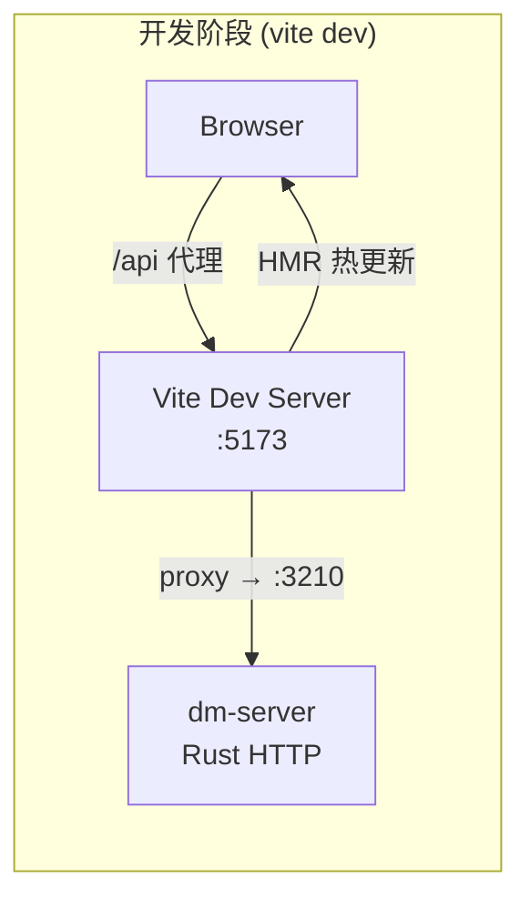
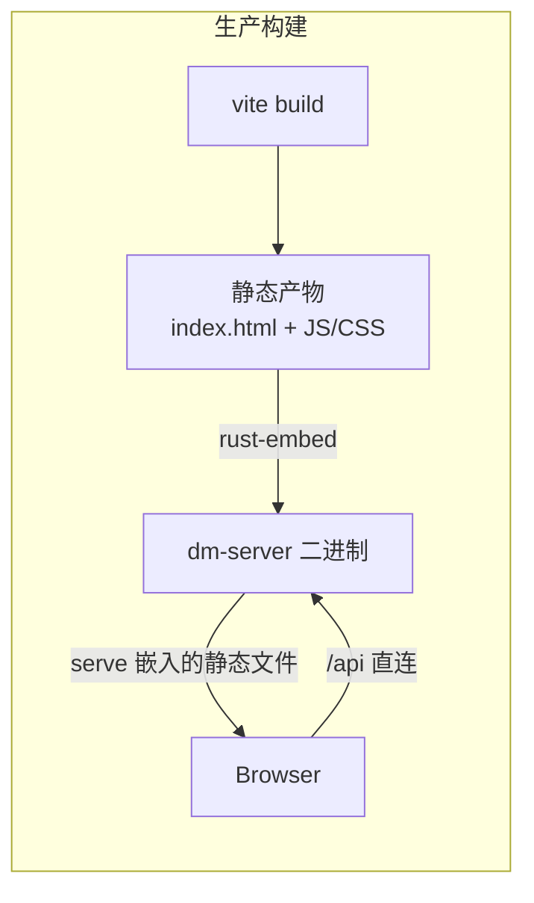
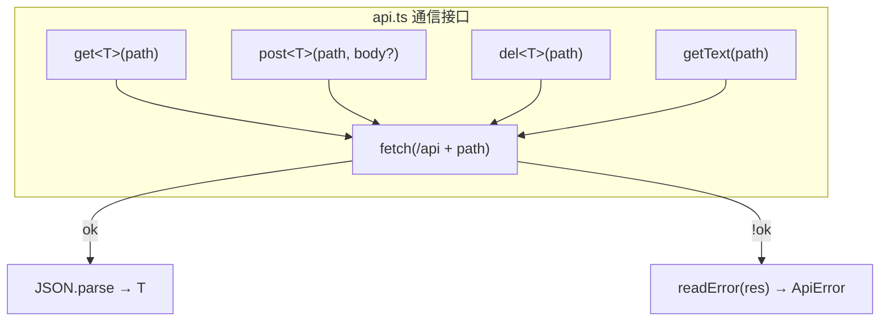
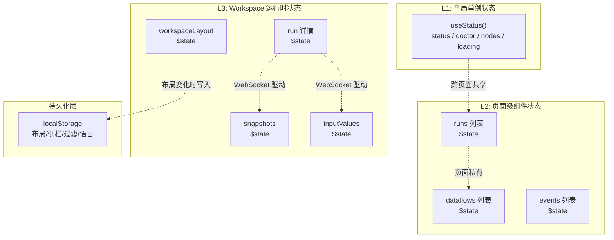
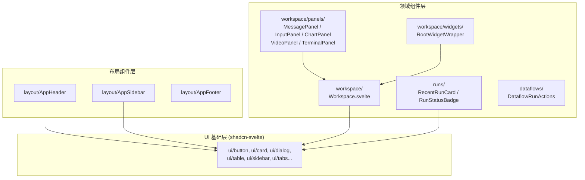

Dora Manager 的前端是一个基于 **SvelteKit 2 + Svelte 5** 构建的单页应用（SPA），以 `adapter-static` 输出纯静态产物，最终通过 `rust-embed` 嵌入 Rust 后端二进制。本文将从前端工程的三根支柱——**路由设计**、**API 通信层**与**状态管理**——出发，系统性地拆解 `web/` 目录的架构决策与实现模式。

Sources: [svelte.config.js](https://github.com/l1veIn/dora-manager/blob/main/web/svelte.config.js#L1-L15), [vite.config.ts](https://github.com/l1veIn/dora-manager/blob/main/web/vite.config.ts#L1-L16), [package.json](https://github.com/l1veIn/dora-manager/blob/main/web/package.json#L1-L68)

---

## 构建与部署模型

在深入路由和状态之前，先理解前端的构建拓扑——它决定了整个通信层的设计基础。





构建配置中有三个关键决策：

| 配置项 | 值 | 架构含义 |
|--------|-----|---------|
| `adapter-static` + `fallback: 'index.html'` | SPA 模式 | 所有路由在客户端解析，无需服务端渲染 |
| `ssr: false` + `prerender: false` | 纯 CSR | 禁用服务端渲染和预渲染，完全依赖浏览器执行 |
| `vite.proxy /api → :3210` | 开发代理 | 开发时 Vite 将 API 请求转发到本地 dm-server |

开发时通过 Vite 代理桥接前后端，生产时前端静态文件直接嵌入 Rust 二进制，由 `dm-server` 同时提供 API 和静态文件服务——这意味着前端永远通过 `/api` 前缀与后端通信，不存在跨域问题。

Sources: [svelte.config.js](https://github.com/l1veIn/dora-manager/blob/main/web/svelte.config.js#L6-L9), [+layout.ts](https://github.com/l1veIn/dora-manager/blob/main/web/src/routes/+layout.ts#L1-L3), [vite.config.ts](https://github.com/l1veIn/dora-manager/blob/main/web/vite.config.ts#L8-L15)

---

## 路由架构：文件系统驱动的页面拓扑

SvelteKit 采用**文件系统路由**——`src/routes/` 目录结构即 URL 结构。Dora Manager 定义了六个顶级路由域，覆盖了从节点管理到运行监控的完整工作流：

```
routes/
├── +layout.svelte          ← 全局 Shell（Sidebar + Header + Content）
├── +layout.ts              ← ssr: false, prerender: false
├── +page.svelte            ← / Dashboard 仪表盘
├── dataflows/
│   ├── +page.svelte        ← /dataflows 数据流列表
│   └── [id]/
│       ├── +page.svelte    ← /dataflows/:id 数据流工作台（Tab 式）
│       └── editor/
│           └── +page.svelte ← /dataflows/:id/editor 全屏图编辑器
├── nodes/
│   ├── +page.svelte        ← /nodes 节点目录
│   └── [id]/
│       └── +page.svelte    ← /nodes/:id 节点详情
├── runs/
│   ├── +page.svelte        ← /runs 运行历史列表
│   └── [id]/
│       └── +page.svelte    ← /runs/:id 运行工作台（Workspace 面板系统）
├── events/
│   └── +page.svelte        ← /events 事件日志查看器
└── settings/
    └── +page.svelte        ← /settings 系统设置
```

### 双模式布局系统

全局布局 `+layout.svelte` 实现了一个**条件渲染的双模式 Shell**：

- **标准模式**：`Sidebar.Provider` > `AppSidebar` + `AppHeader` + 内容区——用于所有常规页面
- **编辑器模式**：当 URL 以 `/editor` 结尾时，隐藏 Sidebar 和 Header，提供全屏沉浸式画布体验

这一判断通过 Svelte 5 的 `$derived` 响应式计算实现，基于 `$app/state` 中的 `page.url.pathname` 实时推导：

```svelte
let isEditorRoute = $derived(page.url?.pathname?.endsWith('/editor') ?? false);
```

标准模式下的导航结构由 `AppSidebar` 组件硬编码为六个导航项（Dashboard、Nodes、Dataflows、Runs、Events、Settings），Sidebar 的展开/折叠状态持久化到 `localStorage`。`AppHeader` 显示当前 `dm` 版本号（通过 `useStatus()` 全局 Store 获取）和 Sidebar 触发按钮。

Sources: [+layout.svelte](https://github.com/l1veIn/dora-manager/blob/main/web/src/routes/+layout.svelte#L1-L53), [AppSidebar.svelte](https://github.com/l1veIn/dora-manager/blob/main/web/src/lib/components/layout/AppSidebar.svelte#L14-L21), [AppHeader.svelte](https://github.com/l1veIn/dora-manager/blob/main/web/src/lib/components/layout/AppHeader.svelte#L1-L19)

### 路由功能矩阵

| 路由 | 主要功能 | 数据获取方式 | 实时更新 |
|------|---------|-------------|---------|
| `/` (Dashboard) | 活跃运行概览、快速启动、频繁数据流 | `onMount` + `Promise.all` 并发请求 | `setInterval` 轮询活跃运行 |
| `/dataflows` | 数据流 CRUD、搜索过滤、一键运行 | `onMount` + `$effect` 自动刷新 | 无 |
| `/dataflows/[id]` | 图编辑器 + YAML 编辑 + 元信息（Tab 式） | `onMount` 加载数据流详情 | 无 |
| `/dataflows/[id]/editor` | 全屏 SvelteFlow 图编辑器 | 继承父路由数据 | 无 |
| `/nodes` | 节点目录、安装/卸载、搜索过滤 | `onMount` 拉取节点列表 | 无 |
| `/nodes/[id]` | 节点详情（README/代码/设置 Tab） | `onMount` 加载节点详情 | 无 |
| `/runs` | 运行历史列表、分页、搜索、批量删除 | `onMount` 拉取运行列表 | 无 |
| `/runs/[id]` | **运行工作台**（Workspace 面板系统） | `onMount` + WebSocket + 轮询 | **WebSocket + 3s 轮询** |
| `/events` | 事件日志查看、过滤、XES 导出 | `onMount` 拉取事件列表 | 无 |
| `/settings` | Dora 版本管理、MediaMTX 配置 | `onMount` 加载配置/版本/诊断 | 无 |

Sources: [+page.svelte (Dashboard)](https://github.com/l1veIn/dora-manager/blob/main/web/src/routes/+page.svelte#L1-L100), [dataflows/+page.svelte](https://github.com/l1veIn/dora-manager/blob/main/web/src/routes/dataflows/+page.svelte#L38-L56), [nodes/+page.svelte](https://github.com/l1veIn/dora-manager/blob/main/web/src/routes/nodes/+page.svelte#L41-L51), [runs/+page.svelte](https://github.com/l1veIn/dora-manager/blob/main/web/src/routes/runs/+page.svelte#L65-L86), [runs/[id]/+page.svelte](web/src/routes/runs/[id]/+page.svelte#L255-L303), [events/+page.svelte](https://github.com/l1veIn/dora-manager/blob/main/web/src/routes/events/+page.svelte#L37-L65), [settings/+page.svelte](https://github.com/l1veIn/dora-manager/blob/main/web/src/routes/settings/+page.svelte#L54-L94)

---

## API 通信层：轻量级 Fetch 封装

整个前端的 HTTP 通信层浓缩在一个文件中——[`$lib/api.ts`](https://github.com/l1veIn/dora-manager/blob/main/web/src/lib/api.ts)。它的设计哲学是**最小抽象、最大类型安全**。

### 四函数通信接口



| 函数 | HTTP 方法 | 请求体 | 返回类型 | 典型用途 |
|------|----------|--------|---------|---------|
| `get<T>(path)` | GET | — | `Promise<T>` | 查询资源（节点列表、运行详情等） |
| `getText(path)` | GET | — | `Promise<string>` | 获取纯文本响应 |
| `post<T>(path, body?)` | POST | `JSON.stringify(body)` | `Promise<T>` | 创建/操作资源（启动运行、保存配置等） |
| `del<T>(path)` | DELETE | — | `Promise<T>` | 删除资源 |

所有函数共享 `API_BASE = '/api'` 前缀，统一通过 `fetch()` 发起请求。非 `ok` 响应统一抛出 `ApiError`。

### ApiError 结构化错误处理

`ApiError` 是一个扩展自 `Error` 的自定义类，携带丰富的错误上下文：

```
ApiError {
  status: number       // HTTP 状态码
  message: string      // 提取后的可读错误信息
  rawMessage: string   // 原始响应体文本
  details?: unknown    // JSON 解析后的完整错误体
}
```

错误提取遵循一个**渐进式降级策略**：先尝试解析 JSON 体中的 `error`/`message`/`detail` 字段，再回退到原始文本清理，最终兜底到 `status statusText`。这确保了无论后端返回什么格式的错误，前端总能获得一个可读的错误消息。

Sources: [api.ts](https://github.com/l1veIn/dora-manager/blob/main/web/src/lib/api.ts#L1-L109)

---

## 状态管理：Svelte 5 Runes 驱动的多层次架构

Dora Manager 前端没有使用任何外部状态管理库（如 Redux、Zustand）。它完全依赖 **Svelte 5 的 Runes 响应式原语**（`$state`、`$derived`、`$effect`）构建了一个三层状态架构：



### 第一层：全局单例 Store（`useStatus()`）

[`$lib/stores/status.svelte.ts`](https://github.com/l1veIn/dora-manager/blob/main/web/src/lib/stores/status.svelte.ts) 实现了一个经典的**模块级单例 Store** 模式——利用 Svelte 5 的 `$state` 在模块顶层声明响应式变量，再通过闭包函数暴露只读 getter：

```typescript
// 模块级响应式状态——整个应用共享同一份实例
let status = $state<any>(null);
let doctor = $state<any>(null);
let nodes = $state<any[]>([]);
let loading = $state(true);

export function useStatus() {
    return {
        get status() { return status; },
        get doctor() { return doctor; },
        get nodes() { return nodes; },
        get loading() { return loading; },
        refresh,  // 并发拉取 /status, /doctor, /nodes
    };
}
```

`refresh()` 函数通过 `Promise.all` 并发请求三个端点，任何一个失败都不会阻断其他请求（`.catch(() => null)` 防御性处理）。这个 Store 被 `AppHeader`（显示版本号）和 Dashboard 页面消费。

Sources: [status.svelte.ts](https://github.com/l1veIn/dora-manager/blob/main/web/src/lib/stores/status.svelte.ts#L1-L35)

### 第二层：页面级组件状态

每个路由页面在 `<script>` 块中声明自己的 `$state` 变量，这是最普遍的状态管理模式。以 Runs 列表页为例：

```typescript
let runs = $state<any[]>([]);
let loading = $state(true);
let totalRuns = $state(0);
let currentPage = $state(1);
let statusFilter = $state("all");
let searchQuery = $state("");
```

**所有页面级状态都是组件私有的**——它们的生命周期与页面组件绑定，导航离开时自动销毁。需要跨页面保留的状态（如过滤条件、分页位置）通过 `localStorage` 显式持久化。

页面间数据共享的典型方式是**重新获取**（re-fetch），而非通过全局 Store 传递。例如，从 `/dataflows` 导航到 `/dataflows/:id` 时，目标页面会独立调用 `get('/dataflows/:id')` 获取完整数据。

Sources: [runs/+page.svelte](https://github.com/l1veIn/dora-manager/blob/main/web/src/routes/runs/+page.svelte#L23-L34), [nodes/+page.svelte](https://github.com/l1veIn/dora-manager/blob/main/web/src/routes/nodes/+page.svelte#L21-L28)

### 第三层：Workspace 运行时状态

`/runs/[id]` 是整个应用状态最复杂的页面。它同时管理着三种不同频率的数据流：

| 状态变量 | 更新频率 | 数据源 | 触发机制 |
|----------|---------|--------|---------|
| `run` (运行详情) | ~3 秒 | `GET /runs/:id` | `setInterval` 轮询（仅 running 状态） |
| `snapshots` (消息快照) | 实时 | `GET /runs/:id/messages/snapshots` | **WebSocket `onmessage`** 驱动 |
| `inputValues` (控件值) | 实时 | `GET /runs/:id/messages?tag=input` | **WebSocket `onmessage`** + 增量拉取 |
| `workspaceLayout` (面板布局) | 用户操作 | `localStorage` | GridStack `change` 事件 |
| `messageRefreshToken` | 递增计数器 | 本地 | WebSocket 消息到达时 +1 |

#### WebSocket 实时通道

运行工作台通过 `/api/runs/:id/messages/ws` 建立 WebSocket 连接，实现消息的实时推送。连接管理遵循**自动重连**模式：

```
onMount → connectMessageSocket()
  ├── onmessage → fetchSnapshots() + fetchNewInputValues() + messageRefreshToken++
  ├── onerror → socket.close()
  └── onclose → scheduleMessageSocketReconnect() (1秒延迟重连)
onDestroy → closeMessageSocket() + clearInterval
```

WebSocket 仅负责**通知**（推送"有新数据"的信号），实际的 payloads 仍然通过 REST API 拉取——这是一种经典的"通知-拉取"模式，避免了 WebSocket 消息体过大和序列化复杂度。

Sources: [runs/[id]/+page.svelte](web/src/routes/runs/[id]/+page.svelte#L438-L486), [runs/[id]/+page.svelte](web/src/routes/runs/[id]/+page.svelte#L305-L383)

### LocalStorage 持久化策略

前端使用 `localStorage` 持久化多种 UI 状态，键名遵循 `dm-` 前缀约定：

| localStorage 键 | 作用域 | 数据类型 | 写入时机 |
|-----------------|--------|---------|---------|
| `dm-app-sidebar-open` | 全局 | `"true"` / `"false"` | 侧栏切换时 |
| `dm-language` | 全局 | locale string | 语言切换时 |
| `dm-workspace-layout-{name}` | 每个数据流 | JSON (WorkspaceGridItem[]) | GridStack 布局变化时 |
| `dm-run-sidebar-open-{name}` | 每次运行 | `"true"` / `"false"` | 运行侧栏切换时 |
| `dm-run-interaction-notice-dismissed-{name}` | 每次运行 | `"true"` | 关闭交互提示时 |
| `dm:nodes:catalog-state` | 节点目录 | JSON (filter state) | 过滤条件变化时 |

Sources: [+layout.svelte](https://github.com/l1veIn/dora-manager/blob/main/web/src/routes/+layout.svelte#L18-L29), [i18n.ts](https://github.com/l1veIn/dora-manager/blob/main/web/src/lib/i18n.ts#L15-L20), [runs/[id]/+page.svelte](web/src/routes/runs/[id]/+page.svelte#L76-L84), [nodes/+page.svelte](https://github.com/l1veIn/dora-manager/blob/main/web/src/routes/nodes/+page.svelte#L148-L163)

---

## 组件体系：三层组件金字塔

前端组件按职责分为三层，形成清晰的金字塔结构：



### shadcn-svelte UI 基础层

`$lib/components/ui/` 目录包含 28 个 shadcn-svelte 组件，由 `components.json` 配置管理。这些组件是**纯展示型**的，不包含任何业务逻辑——它们提供了 Button、Card、Dialog、Table、Sidebar、Tabs、Tooltip 等标准化 UI 元素，使用 Tailwind CSS 变体系统实现样式定制。

`app.css` 通过 CSS 自定义属性定义了完整的亮色/暗色主题令牌系统（基于 oklch 色彩空间），配合 `ModeWatcher` 实现自动暗色模式切换。

Sources: [components.json](https://github.com/l1veIn/dora-manager/blob/main/web/components.json#L1-L16), [app.css](https://github.com/l1veIn/dora-manager/blob/main/web/src/app.css#L1-L41)

### Workspace 面板系统

Workspace 是 `/runs/[id]` 页面的核心——一个基于 **GridStack** 的可拖拽、可调整大小的面板网格系统。它的架构围绕**注册表模式**展开：

**面板注册表**（[`panels/registry.ts`](https://github.com/l1veIn/dora-manager/blob/main/web/src/lib/components/workspace/panels/registry.ts)）定义了六种面板类型：

| PanelKind | 标题 | 数据源模式 | 支持的标签 | 用途 |
|-----------|------|-----------|-----------|------|
| `message` | Message | `history` | `"*"`（所有） | 消息流查看器 |
| `input` | Input | `snapshot` | `["widgets"]` | 交互控件面板 |
| `chart` | Chart | `snapshot` | `["chart"]` | 数据图表 |
| `table` | Table | `snapshot` | `["table"]` | 表格展示（复用 MessagePanel） |
| `video` | Plyr | `snapshot` | `["stream"]` | HLS/WebRTC 视频播放 |
| `terminal` | Terminal | `external` | `[]` | xterm.js 终端（节点日志） |

每种面板通过 `PanelDefinition` 接口声明其元数据：标题、指示灯颜色、数据源模式、默认配置和渲染组件。`PanelContext` 作为统一的注入上下文，为所有面板提供 `runId`、`snapshots`、`inputValues`、`nodes`、`emitMessage` 等运行时数据。

`RootWidgetWrapper` 为每个面板提供统一的视觉包装——标题栏（带拖拽手柄）、最大化/还原按钮、关闭按钮。GridStack 通过 Svelte Action（`gridWidget`）无缝集成到 Svelte 的 `#each` 渲染循环中。

Sources: [panels/registry.ts](https://github.com/l1veIn/dora-manager/blob/main/web/src/lib/components/workspace/panels/registry.ts#L1-L79), [panels/types.ts](https://github.com/l1veIn/dora-manager/blob/main/web/src/lib/components/workspace/panels/types.ts#L1-L41), [Workspace.svelte](https://github.com/l1veIn/dora-manager/blob/main/web/src/lib/components/workspace/Workspace.svelte#L1-L175), [RootWidgetWrapper.svelte](https://github.com/l1veIn/dora-manager/blob/main/web/src/lib/components/workspace/widgets/RootWidgetWrapper.svelte#L1-L44)

### 布局类型系统

Workspace 的布局数据通过 `WorkspaceGridItem` 类型描述：

```typescript
type WorkspaceGridItem = {
    id: string;           // 唯一标识
    widgetType: PanelKind; // 面板类型
    config: PanelConfig;   // 面板配置（节点过滤、标签等）
    x: number; y: number;  // GridStack 网格坐标
    w: number; h: number;  // 网格宽高
    min?: { w: number; h: number }; // 最小尺寸
};
```

网格系统采用 **12 列布局**，单元格高度 80px，支持浮空定位。布局的序列化/反序列化通过 `normalizeWorkspaceLayout()` 处理向后兼容（例如将旧的 `stream` 类型迁移为 `message`，将 `subscribedSourceId` 迁移为 `nodes` 数组）。

Sources: [types.ts](https://github.com/l1veIn/dora-manager/blob/main/web/src/lib/components/workspace/types.ts#L1-L147)

---

## 辅助模块

除了三大支柱之外，`$lib/` 中还有几个支撑性的辅助模块：

**`$lib/nodes/catalog.ts`** — 节点目录的工具函数集，提供节点排序（安装状态优先 → 来源权重 → 安装时间）、来源识别（builtin/git/local）、运行时标签提取等纯函数。

**`$lib/terminal/xterm.ts`** — xterm.js 的托管封装，提供 `createManagedTerminal()` 工厂函数，返回统一的 `ManagedTerminal` 接口（write、resetWithText、fit、dispose），配置了 JetBrains Mono 字体和暗色主题。

**`$lib/runs/outcomeSummary.ts`** — 运行结果摘要的格式化工具，从多行错误堆栈中提取首行摘要和根因，用于在列表页展示简洁的失败原因。

**`$lib/utils.ts`** — shadcn-svelte 的标准工具函数 `cn()`（`clsx` + `tailwind-merge`），以及 Svelte 组件类型辅助。

**`$lib/hooks/is-mobile.svelte.ts`** — 基于 `MediaQuery` 的响应式断点检测类，用于移动端适配。

Sources: [catalog.ts](https://github.com/l1veIn/dora-manager/blob/main/web/src/lib/nodes/catalog.ts#L1-L90), [xterm.ts](https://github.com/l1veIn/dora-manager/blob/main/web/src/lib/terminal/xterm.ts#L1-L50), [outcomeSummary.ts](https://github.com/l1veIn/dora-manager/blob/main/web/src/lib/runs/outcomeSummary.ts#L1-L48), [utils.ts](https://github.com/l1veIn/dora-manager/blob/main/web/src/lib/utils.ts#L1-L13), [is-mobile.svelte.ts](https://github.com/l1veIn/dora-manager/blob/main/web/src/lib/hooks/is-mobile.svelte.ts#L1-L9)

---

## 国际化与主题

**国际化**通过 `svelte-i18n` 实现。[`$lib/i18n.ts`](https://github.com/l1veIn/dora-manager/blob/main/web/src/lib/i18n.ts) 在模块加载时注册中英文消息包，初始化时从 `localStorage` 的 `dm-language` 键读取用户偏好，回退到浏览器语言。`locale` 的订阅回调自动将变更写回 `localStorage`。

**暗色模式**通过 `mode-watcher` 库的 `<ModeWatcher />` 组件实现，它会自动检测系统偏好并切换 `<html>` 元素的 `dark` 类。`app.css` 中定义了完整的 `:root` 和 `.dark` CSS 自定义属性集，覆盖背景、前景、卡片、边框、侧栏等所有设计令牌。

Sources: [i18n.ts](https://github.com/l1veIn/dora-manager/blob/main/web/src/lib/i18n.ts#L1-L21), [app.css](https://github.com/l1veIn/dora-manager/blob/main/web/src/app.css#L1-L60)

---

## 技术栈总览

| 分类 | 技术 | 版本 | 用途 |
|------|------|------|------|
| 框架 | SvelteKit | ^2.50 | 路由、SSR/CSR、文件约定 |
| UI 运行时 | Svelte | ^5.51 | 响应式组件（Runes API） |
| CSS | Tailwind CSS | ^4.2 | 原子化样式 |
| UI 组件库 | shadcn-svelte (bits-ui) | ^2.16 | 无头 UI 组件 |
| 图编辑器 | @xyflow/svelte | ^1.5 | 数据流可视化编辑 |
| 面板网格 | GridStack | ^12.4 | 拖拽/调整大小的面板系统 |
| 终端 | @xterm/xterm | ^5.5 | 节点日志终端 |
| 图表 | layerchart + d3-scale | ^2.0 / ^4.0 | 数据可视化 |
| 代码编辑 | svelte-codemirror-editor | ^2.1 | YAML/JSON 编辑器 |
| 视频 | plyr + hls.js | ^3.8 / ^1.6 | HLS/WebRTC 视频播放 |
| 图标 | lucide-svelte | ^0.575 | 统一图标集 |
| i18n | svelte-i18n | ^4.0 | 国际化 |
| 暗色模式 | mode-watcher | ^1.1 | 系统/手动暗色切换 |
| YAML 解析 | yaml (js-yaml) | ^2.8 | 数据流 YAML 处理 |
| 图布局 | @dagrejs/dagre | ^2.0 | 有向图自动布局 |

Sources: [package.json](https://github.com/l1veIn/dora-manager/blob/main/web/package.json#L16-L67)

---

## 架构模式总结

| 模式 | 实现方式 | 优势 |
|------|---------|------|
| **模块级单例 Store** | `$state` + 闭包 getter | 零依赖全局状态，Svelte 5 原生响应式 |
| **通知-拉取实时模型** | WebSocket 通知 → REST 拉取 payloads | 避免大消息体序列化，保持 API 一致性 |
| **注册表面板系统** | `Record<PanelKind, PanelDefinition>` | 开放-封闭原则，新增面板类型无需修改 Workspace |
| **Svelte Action 集成** | `use:gridWidget` | 无缝桥接 Svelte 声明式渲染与 GridStack 命令式 API |
| **条件布局 Shell** | `$derived` URL 匹配 | 单一布局入口点处理多模式 |
| **localStorage UI 持久化** | 约定式键名 + JSON 序列化 | 跨导航保留用户偏好，无需后端状态 |

---

## 延伸阅读

- [可视化图编辑器：SvelteFlow 画布、右键菜单与 YAML 双向同步](18-ke-shi-hua-tu-bian-ji-qi-svelteflow-hua-bu-you-jian-cai-dan-yu-yaml-shuang-xiang-tong-bu) — 深入 `/dataflows/[id]` 路由中的 SvelteFlow 图编辑器实现
- [运行工作台：网格布局、面板系统与实时日志查看](19-yun-xing-gong-zuo-tai-wang-ge-bu-ju-mian-ban-xi-tong-yu-shi-shi-ri-zhi-cha-kan) — 深入 Workspace 面板系统的交互设计与实时数据流
- [响应式控件（Widgets）：控件注册表、动态渲染与 WebSocket 参数注入](20-xiang-ying-shi-kong-jian-widgets-kong-jian-zhu-ce-biao-dong-tai-xuan-ran-yu-websocket-can-shu-zhu-ru) — 深入 InputPanel 的控件注册表和动态渲染机制
- [HTTP API 全览：REST 路由、WebSocket 实时通道与 Swagger 文档](15-http-api-quan-lan-rest-lu-you-websocket-shi-shi-tong-dao-yu-swagger-wen-dang) — 后端 API 端点的完整参考，前端的通信对端
- [前后端联编与发布：rust-embed 静态嵌入与 CI/CD 流水线](25-qian-hou-duan-lian-bian-yu-fa-bu-rust-embed-jing-tai-qian-ru-yu-ci-cd-liu-shui-xian) — 理解静态产物如何嵌入 Rust 二进制的完整构建流程