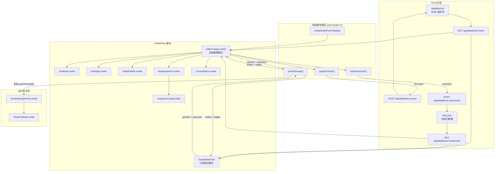

Dora Manager 的可视化图编辑器是一套基于 **@xyflow/svelte** 构建的双向编辑系统，其核心使命是将 Dora 数据流的 YAML 拓扑定义转化为可交互的节点图画布，同时保证画布上的每一次编辑操作——添加节点、连线、删除、重命名——都能精确地序列化回合法的 YAML 输出。系统横跨前后端两层：前端负责 SvelteFlow 画布渲染、交互逻辑和转换引擎，后端负责 YAML 源文件与 `view.json` 布局元数据的持久化存储。本文将深入拆解其架构设计、数据流转机制和关键组件实现。

Sources: [yaml-graph.ts](https://github.com/l1veIn/dora-manager/blob/main/web/src/routes/dataflows/[id]/components/graph/yaml-graph.ts#L1-L5), [editor/+page.svelte](https://github.com/l1veIn/dora-manager/blob/main/web/src/routes/dataflows/[id]/editor/+page.svelte#L1-L55), [GraphEditorTab.svelte](https://github.com/l1veIn/dora-manager/blob/main/web/src/routes/dataflows/[id]/components/GraphEditorTab.svelte#L1-L25)

## 架构总览

下图展示了图编辑器的核心数据流与组件协作关系。理解此架构的关键前提是：**YAML 是数据流的唯一 Source of Truth**，而 `view.json` 仅存储画布布局元数据（节点坐标与视口状态），两者在保存时分别写入后端的独立端点。



Sources: [yaml-graph.ts](https://github.com/l1veIn/dora-manager/blob/main/web/src/routes/dataflows/[id]/components/graph/yaml-graph.ts#L63-L200), [GraphEditorTab.svelte](https://github.com/l1veIn/dora-manager/blob/main/web/src/routes/dataflows/[id]/components/GraphEditorTab.svelte#L32-L36), [editor/+page.svelte](https://github.com/l1veIn/dora-manager/blob/main/web/src/routes/dataflows/[id]/editor/+page.svelte#L219-L239)

### 双模式设计：只读预览 vs 全屏编辑

系统提供两种画布形态，分别服务于「查看」和「编辑」两种场景。**只读预览模式**（`GraphEditorTab`）嵌入在数据流详情页的 Graph Editor Tab 中，节点不可拖拽、不可连线、不可删除，仅提供平移/缩放与 MiniMap 能力。**全屏编辑模式**（`editor/+page.svelte`）是一个独立路由页面，从只读画布的 "Open Editor" 按钮进入，解锁完整的拓扑编辑能力。

| 特性 | 只读预览（GraphEditorTab） | 全屏编辑（editor/+page.svelte） |
|------|--------------------------|-------------------------------|
| 节点拖拽 | ❌ `nodesDraggable={false}` | ✅ |
| 端口连线 | ❌ `nodesConnectable={false}` | ✅ 带校验 |
| 元素选择 | ❌ `elementsSelectable={false}` | ✅ |
| 删除操作 | ❌ `deleteKey={null}` | ✅ Backspace/Delete |
| 右键菜单 | ❌ | ✅ 三级菜单 |
| 撤销/重做 | ❌ | ✅ 30 层快照栈 |
| 节点面板 | ❌ | ✅ Dialog 弹窗 |
| 属性检查器 | ❌ | ✅ 浮动面板 |
| 脏标记/保存 | ❌ | ✅ `isDirty` + `saveAll()` |

Sources: [GraphEditorTab.svelte](https://github.com/l1veIn/dora-manager/blob/main/web/src/routes/dataflows/[id]/components/GraphEditorTab.svelte#L56-L71), [editor/+page.svelte](https://github.com/l1veIn/dora-manager/blob/main/web/src/routes/dataflows/[id]/editor/+page.svelte#L601-L621)

## 转换引擎：yamlToGraph 与 graphToYaml

转换引擎是整个图编辑器的核心脊梁，由 [yaml-graph.ts](https://github.com/l1veIn/dora-manager/blob/main/web/src/routes/dataflows/[id]/components/graph/yaml-graph.ts) 实现，提供两个方向上的纯函数式转换。这种设计确保了转换逻辑的可测试性和无副作用——函数不依赖任何外部状态，仅接受输入参数并返回确定性结果。

### YAML → Graph：两轮扫描算法

`yamlToGraph()` 函数接收 YAML 字符串和 `ViewJson` 对象，输出 SvelteFlow 所需的 `nodes` 与 `edges` 数组。其内部采用**两轮扫描**策略：

**第一轮（节点创建）**：遍历 `parsed.nodes`，为每个 YAML 节点生成 `DmFlowNode`。节点 ID 直接沿用 YAML 中的 `id` 字段，位置优先从 `viewJson.nodes[id]` 读取，缺省时置零。每个节点携带 `inputs`（来自 YAML `inputs` 的 key 集合）、`outputs`（来自 YAML `outputs` 数组）和 `nodeType`（来自 `node` 或 `path` 字段）。

**第二轮（边推导 + 虚拟节点生成）**：再次遍历所有 YAML 节点的 `inputs` 映射，对每个输入值调用 `classifyInput()` 进行分类：

| 输入格式 | 分类结果 | 图上的表现 |
|---------|---------|-----------|
| `microphone/audio` | `{ type: 'node', sourceId, outputPort }` | 常规边：`microphone → 当前节点` |
| `dora/timer/millis/2000` | `{ type: 'dora', raw }` | 虚拟 Timer 节点 + 边 |
| `panel/device_id` | `{ type: 'panel', widgetId }` | 虚拟 Panel 节点 + 边 |

对于 `node` 类型，直接创建一条从 `sourceId` 的 `out-{outputPort}` Handle 到当前节点 `in-{inputPort}` Handle 的边。对于 `dora` 和 `panel` 类型，则按需创建虚拟节点（首次出现时）并建立连接。

Sources: [yaml-graph.ts](https://github.com/l1veIn/dora-manager/blob/main/web/src/routes/dataflows/[id]/components/graph/yaml-graph.ts#L63-L200), [types.ts](https://github.com/l1veIn/dora-manager/blob/main/web/src/routes/dataflows/[id]/components/graph/types.ts#L28-L47)

### 虚拟节点系统

Dora 的数据流 YAML 中存在一类特殊的输入源——`dora/timer/*` 和 `panel/*`——它们并非真实的可执行节点，而是框架内建的信号源。为了让用户在图上直观地看到这些连接关系，转换引擎引入了**虚拟节点**（Virtual Node）的概念。

虚拟节点在第一轮扫描中不存在，而是在第二轮扫描中被按需创建。Timer 虚拟节点以 `__virtual_dora_timer_millis_2000` 的格式生成 ID，携带 `isVirtual: true` 和 `virtualKind: 'timer'` 标记，并自动拥有一个 `tick` 输出端口。Panel 虚拟节点则更特殊——它始终只有一个实例 `__virtual_panel`，但其 `outputs` 数组会随着发现的 `panel/*` 输入动态增长，即一个 Panel 虚拟节点可以拥有多个输出端口，每个端口对应一个 widget ID。

Sources: [yaml-graph.ts](https://github.com/l1veIn/dora-manager/blob/main/web/src/routes/dataflows/[id]/components/graph/yaml-graph.ts#L98-L187), [DmNode.svelte](https://github.com/l1veIn/dora-manager/blob/main/web/src/routes/dataflows/[id]/components/graph/DmNode.svelte#L15-L19)

### Graph → YAML：保留式序列化

`graphToYaml()` 实现了反向转换——将画布上的节点和边序列化为合法的 YAML 字符串。其核心设计原则是**保留式序列化**：函数不仅接受当前的图状态，还接收 `originalYamlStr`（上次保存的 YAML 原文），从中提取每个节点的 `config`、`env`、`widgets` 等非拓扑字段并原样回写。此外，顶层的非 `nodes` 字段（如 `communication` 配置）也被完整保留。

反序列化的关键步骤是 `resolveEdgeToInputValue()`——它将 SvelteFlow 的边对象还原为 YAML 语法中的输入值字符串。对于连接到虚拟节点的边，函数能正确还原出 `dora/timer/millis/2000` 或 `panel/device_id` 这样的原始引用格式，确保序列化后的 YAML 与原始格式语义等价。

Sources: [yaml-graph.ts](https://github.com/l1veIn/dora-manager/blob/main/web/src/routes/dataflows/[id]/components/graph/yaml-graph.ts#L249-L320), [yaml-graph.ts](https://github.com/l1veIn/dora-manager/blob/main/web/src/routes/dataflows/[id]/components/graph/yaml-graph.ts#L223-L243)

### 输入分类器：classifyInput

[YAML 输入值的分类逻辑](https://github.com/l1veIn/dora-manager/blob/main/web/src/routes/dataflows/[id]/components/graph/types.ts#L33-L47)是连接解析的基础设施。该函数根据输入值的前缀模式进行分类：以 `dora/` 开头的识别为框架内建源，以 `panel/` 开头的识别为面板控件源，其余包含 `/` 的识别为节点间引用（`{sourceId}/{outputPort}`），最终回退到 `dora` 类型。这个三路分支确保了所有可能的 YAML 输入值都能被正确映射到图上的连接关系。

Sources: [types.ts](https://github.com/l1veIn/dora-manager/blob/main/web/src/routes/dataflows/[id]/components/graph/types.ts#L33-L47)

## 类型系统

图编辑器的类型体系定义在 [types.ts](https://github.com/l1veIn/dora-manager/blob/main/web/src/routes/dataflows/[id]/components/graph/types.ts) 中，构建在 SvelteFlow 的 `Node` 和 `Edge` 泛型之上：

| 类型 | 定义 | 用途 |
|------|------|------|
| `DmNodeData` | `Node` 的 data payload | 携带 label、nodeType、inputs/outputs、虚拟节点标记 |
| `ViewJson` | 视口 + 节点坐标映射 | 持久化画布布局状态 |
| `DmFlowNode` | `Node<DmNodeData, 'dmNode'>` | SvelteFlow 节点类型约束 |
| `DmFlowEdge` | `Edge` | SvelteFlow 边类型 |
| `InputSource` | 三种输入源的联合类型 | 驱动 `classifyInput` 的返回值 |

`DmNodeData` 中的 `inputs` 和 `outputs` 是字符串数组，存储端口 ID 列表。这些端口 ID 同时也是 SvelteFlow Handle 的 ID（格式为 `in-{portId}` 和 `out-{portId}`），构成了边连接的寻址基础——从 `yamlToGraph` 的边创建、到 `graphToYaml` 的边还原、再到 `NodeInspector` 的连接查询，整个系统都依赖此命名约定。

Sources: [types.ts](https://github.com/l1veIn/dora-manager/blob/main/web/src/routes/dataflows/[id]/components/graph/types.ts#L1-L47)

## 自动布局：Dagre LR

当 `yamlToGraph()` 检测到画布上存在「位置为零且在 `viewJson` 中无记录」的节点时，会自动触发 [Dagre 布局算法](https://github.com/l1veIn/dora-manager/blob/main/web/src/routes/dataflows/[id]/components/graph/auto-layout.ts#L13-L44)。Dagre 是一个经典的有向图层次布局库，此处配置为从左到右（`rankdir: 'LR'`）排列，节点间距 60px，层级间距 120px。

节点高度的估算采用公式 `NODE_HEIGHT_BASE + max(inputs, outputs) * PORT_ROW_HEIGHT`，其中基础高度 60px，每行端口 22px，宽度固定为 260px。这种启发式估算确保 Dagre 在分配空间时不会产生节点重叠。布局完成后，节点坐标从 Dagre 的中心点坐标转换为 SvelteFlow 的左上角坐标（减去宽高的一半）。

用户在全屏编辑模式下也可以随时通过工具栏按钮或右键菜单的 "Auto Layout" 选项手动触发重新布局。

Sources: [auto-layout.ts](https://github.com/l1veIn/dora-manager/blob/main/web/src/routes/dataflows/[id]/components/graph/auto-layout.ts#L1-L44), [yaml-graph.ts](https://github.com/l1veIn/dora-manager/blob/main/web/src/routes/dataflows/[id]/components/graph/yaml-graph.ts#L189-L199)

## 画布组件详解

### DmNode：自定义节点渲染

[DmNode.svelte](https://github.com/l1veIn/dora-manager/blob/main/web/src/routes/dataflows/[id]/components/graph/DmNode.svelte) 是所有画布节点的统一渲染组件，通过 `nodeTypes: { dmNode: DmNode }` 注册到 SvelteFlow。组件结构分为三层：**头部**（Header）显示节点标签和类型，左侧有一条 4px 的彩色指示条；**主体**（Body）分为左右两列，左列排列输入端口及其 Handle，右列排列输出端口及其 Handle；整体包裹在圆角卡片中。

端口 Handle 的 ID 遵循 `{direction}-{portId}` 的命名约定（例如 `in-audio`、`out-tick`），这一约定贯穿整个系统。输入端口显示为 `← {portName}`，输出端口显示为 `{portName} →`，视觉上清晰地区分数据流向。

视觉上，DmNode 实现了完整的亮/暗色主题适配。虚拟节点通过 `isVirtual` 类名切换为虚线边框，Timer 节点的头部背景呈淡蓝色调（`rgba(59, 130, 246, 0.08)`），Panel 节点呈淡紫色调（`rgba(139, 92, 246, 0.08)`），每种虚拟节点类型的左侧色条颜色也分别对应蓝色和紫色。

Sources: [DmNode.svelte](https://github.com/l1veIn/dora-manager/blob/main/web/src/routes/dataflows/[id]/components/graph/DmNode.svelte#L15-L55), [DmNode.svelte](https://github.com/l1veIn/dora-manager/blob/main/web/src/routes/dataflows/[id]/components/graph/DmNode.svelte#L57-L197)

### DmEdge：带删除按钮的自定义边

[DmEdge.svelte](https://github.com/l1veIn/dora-manager/blob/main/web/src/routes/dataflows/[id]/components/graph/DmEdge.svelte) 替代了 SvelteFlow 的默认边渲染，提供两个增强功能：**贝塞尔曲线路径**（通过 `getBezierPath` 计算平滑曲线）和**悬浮删除按钮**。删除按钮使用 `foreignObject` 嵌入 SVG 中，定位在边的中点位置，默认透明度为 0，仅在鼠标悬停到边（`hover` 状态）或边被选中时才显现。按钮调用 `useSvelteFlow()` 返回的 `deleteElements()` 实现删除，无需通过编辑器页面的回调。

Sources: [DmEdge.svelte](https://github.com/l1veIn/dora-manager/blob/main/web/src/routes/dataflows/[id]/components/graph/DmEdge.svelte#L1-L111)

### NodePalette：节点选择面板

[NodePalette.svelte](https://github.com/l1veIn/dora-manager/blob/main/web/src/routes/dataflows/[id]/components/graph/NodePalette.svelte) 以 Dialog 弹窗形式呈现，从 `GET /api/nodes` 加载所有已安装节点的元数据。面板支持**关键词搜索**（匹配 name、id、tags）和**分类过滤**（根据 `dm.json` 中的 `display.category` 字段），节点以双列网格展示。

节点模板数据通过 `getPaletteData()` 函数从 API 响应中提取端口信息——过滤 `ports` 数组中 `direction === 'input'` 和 `direction === 'output'` 的条目，映射为端口 ID 列表，最终传递给 `createNodeFromPalette()` 生成新的 `DmFlowNode`。面板同时支持**点击添加**和**拖拽添加**两种交互——拖拽时通过 `dataTransfer` 传递序列化的节点模板数据。

Sources: [NodePalette.svelte](https://github.com/l1veIn/dora-manager/blob/main/web/src/routes/dataflows/[id]/components/graph/NodePalette.svelte#L1-L93), [NodePalette.svelte](https://github.com/l1veIn/dora-manager/blob/main/web/src/routes/dataflows/[id]/components/graph/NodePalette.svelte#L66-L92)

### NodeInspector：属性检查器

[NodeInspector.svelte](https://github.com/l1veIn/dora-manager/blob/main/web/src/routes/dataflows/[id]/components/graph/NodeInspector.svelte) 是一个可拖拽、可缩放的浮动面板，展示选中节点的详细属性。面板支持两种交互模式：**Info & Ports** 标签页显示节点 ID（可点击编辑实现重命名）、节点类型、输入/输出端口列表及每个端口的连接状态（Connected / Unconnected）；**Configuration** 标签页嵌入 `InspectorConfig` 组件进行配置编辑。

检查器的窗口位置和大小通过 `localStorage` 持久化（键名 `dm-inspector-bounds`），确保用户在多次打开编辑器时不需要重新调整面板位置。面板实现了完整的边界约束逻辑（`clampBounds`），确保拖拽和缩放操作不会让窗口超出视口范围。尺寸被限制在 360-560px 宽度、320-760px 高度之间。

Sources: [NodeInspector.svelte](https://github.com/l1veIn/dora-manager/blob/main/web/src/routes/dataflows/[id]/components/graph/NodeInspector.svelte#L25-L151), [NodeInspector.svelte](https://github.com/l1veIn/dora-manager/blob/main/web/src/routes/dataflows/[id]/components/graph/NodeInspector.svelte#L152-L189)

### InspectorConfig：四层配置聚合编辑

[InspectorConfig.svelte](https://github.com/l1veIn/dora-manager/blob/main/web/src/routes/dataflows/[id]/components/graph/InspectorConfig.svelte) 是配置编辑的核心组件，从 `GET /api/dataflows/:name/config-schema` 加载**聚合配置字段**（Aggregated Config Fields）。每个字段携带 `effective_value`、`effective_source` 和 `schema` 三个维度的信息，构成了 [数据流转译器](08-transpiler) 中四层配置合并机制的前端呈现。

字段的来源标识以颜色编码的标签呈现：

| 来源 | 标签颜色 | 含义 |
|------|---------|------|
| `inline` | 蓝色 | 来自 YAML 中的 `config` 字段 |
| `node` | 紫色 | 来自节点的全局配置（通过 `POST /api/nodes/:type/config` 写入） |
| `default` / `unset` | 灰色 | 来自 `dm.json` 中的默认值 |

组件根据 `schema["x-widget"].type` 动态选择 UI 控件：`select` → 下拉选择器，`slider` → 滑块+数值输入，`switch` → 开关，`radio` → 单选按钮组，`checkbox` → 多选框，`file` / `directory` → 路径选择器。对于未声明 widget 的字段，则根据 `schema.type` 回退到基础控件：`string` → 文本输入，`number` → 数字输入，`boolean` → 复选框，其余类型 → JSON 文本域。

一个重要的设计细节：标记为 `secret: true` 的字段在编辑时会写入节点的全局配置而非 inline YAML，并显示警告提示用户不要将敏感信息内联在数据流文件中。

Sources: [InspectorConfig.svelte](https://github.com/l1veIn/dora-manager/blob/main/web/src/routes/dataflows/[id]/components/graph/InspectorConfig.svelte#L34-L119), [InspectorConfig.svelte](https://github.com/l1veIn/dora-manager/blob/main/web/src/routes/dataflows/[id]/components/graph/InspectorConfig.svelte#L168-L339)

### ContextMenu：上下文菜单

[ContextMenu.svelte](https://github.com/l1veIn/dora-manager/blob/main/web/src/routes/dataflows/[id]/components/graph/ContextMenu.svelte) 提供基于右键的快捷操作，根据点击目标分为三种菜单形态：

| 点击目标 | 可用操作 |
|---------|---------|
| 画布空白处 | 添加节点（打开 NodePalette）、全选、自动布局 |
| 节点 | 复制、检查属性（打开 Inspector）、删除 |
| 边 | 删除连线 |

菜单使用固定定位的 `z-[101]` 层级渲染，配合一个全屏透明的 `z-[100]` 背景层捕获外部点击以关闭菜单。这种两层分离设计避免了 SvelteFlow 画布的 pointer-events 干扰。每个菜单项都配有 lucide-svelte 图标，删除类操作使用 `danger` 类名在悬停时呈现红色警示效果。

Sources: [ContextMenu.svelte](https://github.com/l1veIn/dora-manager/blob/main/web/src/routes/dataflows/[id]/components/graph/ContextMenu.svelte#L1-L101)

## 编辑器状态管理与操作

### 撤销/重做系统

全屏编辑器实现了一个基于 **Snapshot 栈**的撤销/重做系统。每次编辑操作前调用 `pushUndo()` 将当前 `nodes` 和 `edges` 的深拷贝压入 `undoStack`（最多保留 30 层），同时清空 `redoStack`。撤销时从 `undoStack` 弹出并压入 `redoStack`，重做则反向操作。快照通过 `JSON.parse(JSON.stringify(val))` 实现深拷贝，确保各快照之间的状态完全隔离。

值得注意的是，`handleUpdateConfig` 故意省略了 `pushUndo()` 调用，避免配置编辑过程中的每一次按键/滑块拖动都产生一个历史快照，导致撤销栈被大量中间状态填满。

Sources: [editor/+page.svelte](https://github.com/l1veIn/dora-manager/blob/main/web/src/routes/dataflows/[id]/editor/+page.svelte#L67-L114)

### 连接校验

`isValidConnection()` 函数在用户尝试从输出端口拖线到输入端口时被调用，执行三项校验：

| 校验规则 | 实现方式 |
|---------|---------|
| 禁止自连接 | `source === target` 时返回 `false` |
| 禁止同端口重复入边 | 检查 `edges` 中是否已存在相同 `target + targetHandle` |
| 禁止完全相同的重复连线 | 检查四元组 `(source, target, sourceHandle, targetHandle)` 是否已存在 |

其中「同端口最多一个入边」的约束来源于数据流的语义——每个输入端口只应接收一个数据源的消息流。

Sources: [editor/+page.svelte](https://github.com/l1veIn/dora-manager/blob/main/web/src/routes/dataflows/[id]/editor/+page.svelte#L291-L311)

### 节点重命名

`handleRenameNode()` 实现了节点的 ID 重命名。该操作具有级联效应——不仅修改节点自身的 `id` 和 `data.label`，还需要遍历所有边，将引用旧 ID 的 `source` 和 `target` 字段替换为新 ID，并同步更新边的 `id`（边的 ID 由 `e-{source}-{sourcePort}-{target}-{targetPort}` 格式构成，任何一端变化都需要重建）。如果重命名的是当前选中节点，`selectedNodeId` 也会同步更新。

Sources: [editor/+page.svelte](https://github.com/l1veIn/dora-manager/blob/main/web/src/routes/dataflows/[id]/editor/+page.svelte#L250-L275)

### 键盘快捷键

编辑器注册了全局键盘事件监听，支持以下快捷操作：

| 快捷键 | 功能 |
|--------|------|
| `⌘/Ctrl + S` | 保存（触发 `saveAll()`） |
| `⌘/Ctrl + Z` | 撤销 |
| `⌘/Ctrl + Shift + Z` | 重做 |
| `⌘/Ctrl + D` | 复制选中节点 |
| `Backspace / Delete` | 删除选中元素（由 SvelteFlow 原生处理，通过 `ondelete` 回调） |

Sources: [editor/+page.svelte](https://github.com/l1veIn/dora-manager/blob/main/web/src/routes/dataflows/[id]/editor/+page.svelte#L449-L466)

## 保存流程与 view.json 持久化

保存操作由 `saveAll()` 函数驱动，执行两个独立的 API 调用：

1. **`graphToYaml(nodes, edges, lastYaml)`** → `POST /api/dataflows/:name`：将当前图状态序列化为 YAML 并写入后端。`lastYaml` 参数确保非拓扑字段（config、env、widgets）被原样保留。
2. **`buildViewJson(nodes)`** → `POST /api/dataflows/:name/view`：将所有节点的当前位置序列化为 `view.json` 并写入后端。`view.json` 的结构简单，仅包含 `nodes: { [nodeId]: { x, y } }` 映射，不存储拓扑信息。

保存成功后，`lastYaml` 被更新为新 YAML，`isDirty` 标记清零。顶栏的保存按钮根据 `isDirty` 状态切换样式——未修改时显示灰色 "Saved"，有修改时显示醒目的 "Save" 按钮。

Sources: [editor/+page.svelte](https://github.com/l1veIn/dora-manager/blob/main/web/src/routes/dataflows/[id]/editor/+page.svelte#L431-L446), [yaml-graph.ts](https://github.com/l1veIn/dora-manager/blob/main/web/src/routes/dataflows/[id]/components/graph/yaml-graph.ts#L206-L217), [yaml-graph.ts](https://github.com/l1veIn/dora-manager/blob/main/web/src/routes/dataflows/[id]/components/graph/yaml-graph.ts#L249-L320)

## YAML 编辑器：CodeMirror 集成

除了图形化编辑，系统还提供了 [YamlEditorTab.svelte](https://github.com/l1veIn/dora-manager/blob/main/web/src/routes/dataflows/[id]/components/YamlEditorTab.svelte) 作为纯文本编辑入口，嵌入在数据流详情页的 "dataflow.yml" Tab 中。该组件基于 `svelte-codemirror-editor` 和 `@codemirror/lang-yaml` 构建，支持 YAML 语法高亮和暗色主题（`oneDark`）。

YAML 编辑器的保存逻辑与图编辑器独立——点击 "Save code" 按钮后直接将文本内容通过 `POST /api/dataflows/:name` 写入后端，保存成功后重新拉取最新的数据流对象并通知父组件刷新状态。这确保了无论是通过图形界面还是文本编辑器修改 YAML，两个 Tab 之间的数据始终一致。

Sources: [YamlEditorTab.svelte](https://github.com/l1veIn/dora-manager/blob/main/web/src/routes/dataflows/[id]/components/YamlEditorTab.svelte#L1-L95), [+page.svelte](https://github.com/l1veIn/dora-manager/blob/main/web/src/routes/dataflows/[id]/+page.svelte#L414-L432)

## 运行时图视图复用

图编辑器的转换引擎不仅在编辑场景中使用，还被运行时视图复用。[RuntimeGraphView.svelte](https://github.com/l1veIn/dora-manager/blob/main/web/src/routes/runs/[id]/graph/RuntimeGraphView.svelte) 直接导入 `yamlToGraph` 函数将数据流 YAML 渲染为运行时监控画布，但使用专用的 `RuntimeNode` 替代 `DmNode`，后者在基础节点渲染之上增加了运行时状态指标：CPU 使用率（`{cpu}%`）、内存占用（`{memory} MB`）、状态图标（running/stopped/failed/unknown）和日志闪烁指示器。

运行时视图通过 WebSocket 连接（`/api/runs/:runId/ws`）接收实时推送，处理三类消息：

| 消息类型 | 处理逻辑 |
|---------|---------|
| `status` | 更新数据流全局状态，切换边的动画效果（running 时蓝色动画线） |
| `metrics` | 注入各节点的 CPU/内存数据，更新节点边框颜色 |
| `logs` / `io` | 触发节点上的日志指示器闪烁（蓝色脉冲，500ms 后自动消失） |

Sources: [RuntimeGraphView.svelte](https://github.com/l1veIn/dora-manager/blob/main/web/src/routes/runs/[id]/graph/RuntimeGraphView.svelte#L1-L167), [RuntimeNode.svelte](https://github.com/l1veIn/dora-manager/blob/main/web/src/routes/runs/[id]/graph/RuntimeNode.svelte#L1-L116)

## 文件结构总览

```
web/src/routes/dataflows/[id]/
├── +page.svelte                          # 数据流详情页（Graph/YAML/Meta/History 四个 Tab）
├── editor/+page.svelte                   # 全屏编辑器页面（~767 行）
└── components/
    ├── GraphEditorTab.svelte             # 只读图预览组件
    ├── YamlEditorTab.svelte              # CodeMirror YAML 编辑器
    ├── MetaTab.svelte                    # flow.json 元数据编辑
    ├── HistoryTab.svelte                 # 历史版本浏览
    └── graph/
        ├── types.ts                      # 类型定义与 classifyInput
        ├── yaml-graph.ts                 # 双向转换引擎核心（~321 行）
        ├── auto-layout.ts                # Dagre LR 自动布局（~45 行）
        ├── DmNode.svelte                 # 自定义节点渲染
        ├── DmEdge.svelte                 # 自定义边渲染（带删除按钮）
        ├── NodePalette.svelte            # 节点选择面板（Dialog）
        ├── NodeInspector.svelte          # 属性检查器（浮动面板）
        ├── InspectorConfig.svelte        # 四层配置聚合编辑
        └── ContextMenu.svelte            # 右键上下文菜单
```

Sources: [目录结构](https://github.com/l1veIn/dora-manager/blob/main/web/src/routes/dataflows/[id]/)

## 设计演进：四阶段交付模型

图编辑器的开发遵循了文档化的四阶段渐进式交付策略：

| 阶段 | 文档 | 核心交付物 | 状态 |
|------|------|-----------|------|
| P1 | [P1-readonly-canvas.md](https://github.com/l1veIn/dora-manager/blob/main/docs/nodeEditor/P1-readonly-canvas.md) | 只读画布 + view.json 后端 + Dagre 布局 | ✅ 已完成 |
| P2 | [P2-editable-canvas.md](https://github.com/l1veIn/dora-manager/blob/main/docs/nodeEditor/P2-editable-canvas.md) | 拓扑编辑 + graphToYaml 序列化 | ✅ 已完成 |
| P3 | [P3-palette-inspector.md](https://github.com/l1veIn/dora-manager/blob/main/docs/nodeEditor/P3-palette-inspector.md) | NodePalette + NodeInspector + 配置编辑 | ✅ 已完成 |
| P4 | [P4-schema-validation-polish.md](https://github.com/l1veIn/dora-manager/blob/main/docs/nodeEditor/P4-schema-validation-polish.md) | 端口 Schema 校验 + 撤销/重做 + 主题适配 | 🔄 部分完成 |

P4 阶段中的撤销/重做系统、主题适配、节点复制功能已经实现，但基于 Port Schema 的连接校验（通过 `GET /api/dataflows/:name/validate` 端点获取类型兼容性诊断信息并给边着色）尚未落地。当前边的渲染不携带校验状态，仅使用统一的灰色/蓝色（选中时）样式。

Sources: [P1-readonly-canvas.md](https://github.com/l1veIn/dora-manager/blob/main/docs/nodeEditor/P1-readonly-canvas.md#L1-L30), [P2-editable-canvas.md](https://github.com/l1veIn/dora-manager/blob/main/docs/nodeEditor/P2-editable-canvas.md#L1-L19), [P3-palette-inspector.md](https://github.com/l1veIn/dora-manager/blob/main/docs/nodeEditor/P3-palette-inspector.md#L1-L19), [P4-schema-validation-polish.md](https://github.com/l1veIn/dora-manager/blob/main/docs/nodeEditor/P4-schema-validation-polish.md#L1-L19)

## 关键依赖

| 依赖 | 版本 | 用途 |
|------|------|------|
| `@xyflow/svelte` | ^1.5.1 | SvelteFlow 画布引擎（节点/边渲染、视口控制、交互事件） |
| `@dagrejs/dagre` | ^2.0.4 | 层次化有向图自动布局（LR 方向） |
| `yaml` (npm) | ^2.8.3 | YAML 解析与序列化（`yaml-graph.ts` 内使用） |
| `svelte-codemirror-editor` | ^2.1.0 | YAML 文本编辑器（YamlEditorTab） |
| `@codemirror/lang-yaml` | ^6.1.2 | CodeMirror YAML 语法高亮 |
| `@codemirror/theme-one-dark` | ^6.1.3 | CodeMirror 暗色主题 |
| `mode-watcher` | — | 亮/暗主题状态追踪 |

Sources: [package.json](https://github.com/l1veIn/dora-manager/blob/main/web/package.json#L17-L66)

## 下一步阅读

- 如果想了解 SvelteFlow 画布在运行监控场景中的具体表现——包括 WebSocket 实时指标推送、日志面板和 RuntimeNode 状态可视化——参见 [运行工作台：网格布局、面板系统与实时日志查看](16-yun-xing-gong-zuo-tai-wang-ge-bu-ju-mian-ban-xi-tong-yu-shi-shi-ri-zhi-cha-kan)。
- 如果想理解 InspectorConfig 所依赖的四层配置聚合机制（default → node global → flow → inline）的后端实现，参见 [数据流转译器（Transpiler）：多 Pass 管线与四层配置合并](08-shu-ju-liu-zhuan-yi-qi-transpiler-duo-pass-guan-xian-yu-si-ceng-pei-zhi-he-bing)。
- 如果想了解图编辑器消费的节点元数据来源（`dm.json` 中的 ports、display、config schema），参见 [内置节点总览：从媒体采集到 AI 推理](19-nei-zhi-jie-dian-zong-lan-cong-mei-ti-cai-ji-dao-ai-tui-li) 和 [Port Schema 与端口类型校验](20-port-schema-yu-duan-kou-lei-xing-xiao-yan)。
- 如果想了解前端整体的路由设计、API 通信层和状态管理范式，参见 [SvelteKit 项目结构：路由设计、API 通信层与状态管理](17-sveltekit-xiang-mu-jie-gou-lu-you-she-ji-api-tong-xin-ceng-yu-zhuang-tai-guan-li)。