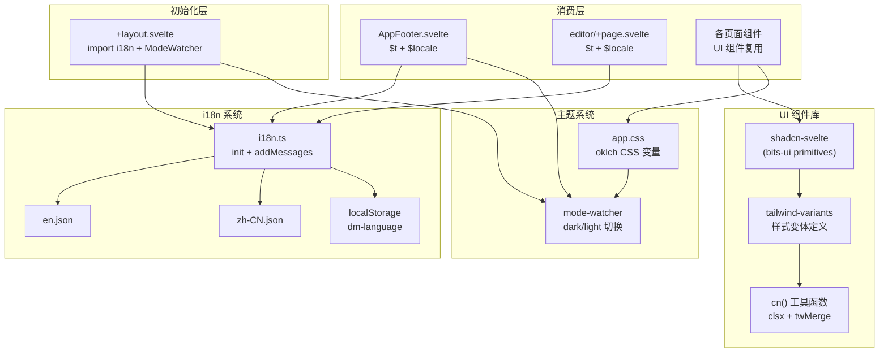

Dora Manager 的前端 UI 建立在两个核心基础设施之上：基于 **svelte-i18n** 的运行时国际化系统，和基于 **shadcn-svelte + Tailwind CSS v4** 的组件库。本文将深入解析这两套系统的架构设计、当前实现状态以及扩展模式，帮助你在已有的设计约束下高效地添加多语言支持和复用 UI 组件。

Sources: [i18n.ts](https://github.com/l1veIn/dora-manager/blob/master/web/src/lib/i18n.ts#L1-L22), [components.json](https://github.com/l1veIn/dora-manager/blob/master/web/components.json#L1-L16)

## 系统架构总览

i18n 和 UI 组件库在 Dora Manager 中形成了一个分层的关注点体系——国际化负责文本内容的locale适配，组件库负责视觉一致性与交互模式，主题系统负责色彩方案的明暗切换。三者通过 CSS 变量层和 Svelte 的响应式 store 实现松耦合协作。



Sources: [+layout.svelte](https://github.com/l1veIn/dora-manager/blob/master/web/src/routes/+layout.svelte#L1-L53), [app.css](https://github.com/l1veIn/dora-manager/blob/master/web/src/app.css#L1-L149)

## 国际化（i18n）系统

### 引擎选型与现状

Dora Manager 在设计文档中曾规划使用 **Paraglide**（inlang 的编译时 i18n 方案），但实际实现采用了 **svelte-i18n**——一个基于 store 的运行时国际化库。这一选择带来了更简单的集成路径：无需编译步骤，直接通过 `$t()` store 的 Svelte 响应式语法即可完成翻译键的动态替换。

当前 i18n 系统的关键特征：

| 维度 | 实现方案 |
|---|---|
| 引擎 | svelte-i18n v4.0.1（运行时 store） |
| 配置入口 | [i18n.ts](https://github.com/l1veIn/dora-manager/blob/master/web/src/lib/i18n.ts) |
| 语言文件 | [en.json](https://github.com/l1veIn/dora-manager/blob/master/web/src/lib/locales/en.json), [zh-CN.json](https://github.com/l1veIn/dora-manager/blob/master/web/src/lib/locales/zh-CN.json) |
| 回退语言 | `en` |
| 持久化 | `localStorage` 键 `dm-language` |
| 支持语言 | `en`, `zh-CN` |

Sources: [package.json](https://github.com/l1veIn/dora-manager/blob/master/web/package.json#L41), [i18n.ts](https://github.com/l1veIn/dora-manager/blob/master/web/src/lib/i18n.ts#L1-L22)

### 初始化流程

i18n 系统在应用的根布局中通过 `import "$lib/i18n"` 副作用导入完成初始化。具体流程分为三个阶段：**注册词典** → **检测初始语言** → **订阅持久化**。

[en.json](https://github.com/l1veIn/dora-manager/blob/master/web/src/lib/locales/en.json) 和 [zh-CN.json](https://github.com/l1veIn/dora-manager/blob/master/web/src/lib/locales/zh-CN.json) 通过 `addMessages()` 静态注册到 svelte-i18n 的消息词典中。初始语言的检测优先级为：`localStorage` 中缓存的 `dm-language` 键 → 浏览器 `navigator.language` → 回退到 `en`。语言变更通过 `locale.subscribe()` 自动同步回 `localStorage`，确保跨会话的一致性。

```typescript
// web/src/lib/i18n.ts — 初始化逻辑的三个阶段
// 阶段 1: 注册词典
addMessages('en', en);
addMessages('zh-CN', zhCN);

// 阶段 2: 检测初始语言（localStorage > navigator > fallback）
init({
    fallbackLocale: 'en',
    initialLocale: window.localStorage.getItem("dm-language") || getLocaleFromNavigator(),
});

// 阶段 3: 语言变更时持久化
locale.subscribe((newLocale) => {
    if (newLocale) window.localStorage.setItem("dm-language", newLocale);
});
```

Sources: [i18n.ts](https://github.com/l1veIn/dora-manager/blob/master/web/src/lib/i18n.ts#L1-L22)

### 当前翻译键与覆盖范围

截至当前版本，i18n 系统的翻译词典极为精简，仅包含 **4 个键**：

| 键 | `en` | `zh-CN` |
|---|---|---|
| `theme` | Theme | 主题 |
| `language` | Language | 语言 |
| `english` | English | English |
| `chinese` | 中文 | 中文 |

实际使用 `$t()` 的组件仅有两处：侧边栏底部的 [AppFooter.svelte](https://github.com/l1veIn/dora-manager/blob/master/web/src/lib/components/layout/AppFooter.svelte) 和独立编辑器页面 [editor/+page.svelte](https://github.com/l1veIn/dora-manager/blob/master/web/src/routes/dataflows/[id]/editor/+page.svelte)。这意味着 **i18n 系统处于基础架构就绪但尚未全面铺开的状态**——大部分页面（Dashboard、Settings、Nodes、Runs、Events）中的文本仍为硬编码英文。

Sources: [en.json](https://github.com/l1veIn/dora-manager/blob/master/web/src/lib/locales/en.json#L1-L5), [zh-CN.json](https://github.com/l1veIn/dora-manager/blob/master/web/src/lib/locales/zh-CN.json#L1-L5)

### 语言切换器实现

语言切换 UI 以 DropdownMenu 形式嵌入在两个位置：AppSidebar 底部和独立编辑器工具栏。其核心模式是直接赋值 `$locale` store 来触发全局语言切换。

```svelte
<!-- AppFooter.svelte 中的语言切换器精简模式 -->
<script>
    import { t, locale } from "svelte-i18n";
    import * as DropdownMenu from "$lib/components/ui/dropdown-menu/index.js";
</script>

<DropdownMenu.Root>
    <DropdownMenu.Trigger>
        <!-- 触发按钮显示当前语言名 + locale 标签 -->
        <span>{$t("language")} ({$locale?.toUpperCase()})</span>
    </DropdownMenu.Trigger>
    <DropdownMenu.Content side="top" align="start">
        {#each ["en", "zh-CN"] as tag}
            <DropdownMenu.Item>
                <button onclick={() => ($locale = tag)}>
                    {tag === "en" ? $t("english") : $t("chinese")}
                </button>
            </DropdownMenu.Item>
        {/each}
    </DropdownMenu.Content>
</DropdownMenu.Root>
```

Sources: [AppFooter.svelte](https://github.com/l1veIn/dora-manager/blob/master/web/src/lib/components/layout/AppFooter.svelte#L1-L46), [editor/+page.svelte](https://github.com/l1veIn/dora-manager/blob/master/web/src/routes/dataflows/[id]/editor/+page.svelte#L516-L536)

## UI 组件库架构

### 技术选型与分层

Dora Manager 的 UI 组件库基于 **shadcn-svelte** 构建，这是一个"复制而非安装"的组件模式库。与传统的 npm 依赖不同，shadcn-svelte 将组件源码直接拷贝到项目中，开发者拥有完全的控制权和修改自由度。

| 层级 | 技术方案 | 职责 |
|---|---|---|
| 原语层 | **bits-ui** | 无样式的 headless 组件，提供可访问性（a11y）与键盘交互 |
| 样式层 | **tailwind-variants** (`tv`) | 声明式样式变体系统，替代 classnames 方案 |
| 合并层 | **cn()** = `clsx` + `twMerge` | 智能合并 Tailwind class，解决冲突覆盖 |
| 主题层 | **app.css** CSS 变量 | oklch 色彩空间的语义化 design token |

Sources: [components.json](https://github.com/l1veIn/dora-manager/blob/master/web/components.json#L1-L16), [utils.ts](https://github.com/l1veIn/dora-manager/blob/master/web/src/lib/utils.ts#L1-L14), [app.css](https://github.com/l1veIn/dora-manager/blob/master/web/src/app.css#L1-L149)

### 组件清单与分类

项目中的 UI 组件位于 `web/src/lib/components/ui/` 目录，共 **25 个组件族**。按功能可划分为以下类别：

| 类别 | 组件 | 典型用途 |
|---|---|---|
| **布局容器** | Card, Resizable, ScrollArea, Separator, Tabs | 页面区域划分与内容组织 |
| **数据展示** | Table, Badge, Avatar, Skeleton, Tooltip | 信息展示与状态标识 |
| **表单控件** | Button, Input, Textarea, Checkbox, Switch, Slider, RadioGroup, Select, Label | 用户输入与配置交互 |
| **弹出层** | Dialog, AlertDialog, Sheet, DropdownMenu, HoverCard | 模态、侧抽屉、上下文菜单 |
| **导航** | Sidebar (20+ 子组件) | 应用主导航框架 |
| **通知** | Sonner (Toast) | 操作反馈与状态提示 |
| **自定义** | PathPicker | 路径选择器（项目特有） |

Sources: [ui/ directory](https://github.com/l1veIn/dora-manager/blob/master/web/src/lib/components/ui)

### 组件变体模式（tailwind-variants）

shadcn-svelte 组件普遍采用 `tailwind-variants`（`tv`）定义样式变体。以 Button 组件为例，其变体系统支持 **6 种视觉变体**（variant）和 **6 种尺寸**（size），通过 `defaultVariants` 设置默认值。

```typescript
// button.svelte 中的 tv 变体定义（精简）
export const buttonVariants = tv({
    base: "inline-flex items-center justify-center ...",
    variants: {
        variant: {
            default: "bg-primary text-primary-foreground ...",
            destructive: "bg-destructive text-white ...",
            outline: "bg-background border shadow-xs ...",
            secondary: "bg-secondary text-secondary-foreground ...",
            ghost: "hover:bg-accent ...",
            link: "text-primary underline-offset-4 ...",
        },
        size: {
            default: "h-9 px-4 py-2",
            sm: "h-8 px-3",
            lg: "h-10 px-6",
            icon: "size-9",
            "icon-sm": "size-8",
            "icon-lg": "size-10",
        },
    },
    defaultVariants: { variant: "default", size: "default" },
});
```

这种模式的核心优势在于：组件消费者通过 `variant` 和 `size` prop 驱动样式选择，而非直接拼接 class 字符串；外部传入的 `className` 通过 `cn()` 函数与变体样式智能合并，保证扩展性不破坏基础样式。

Sources: [button.svelte](https://github.com/l1veIn/dora-manager/blob/master/web/src/lib/components/ui/button/button.svelte#L1-L83), [badge.svelte](https://github.com/l1veIn/dora-manager/blob/master/web/src/lib/components/ui/badge/badge.svelte#L1-L51)

### cn() 工具函数

[cn()](https://github.com/l1veIn/dora-manager/blob/master/web/src/lib/utils.ts) 是整个组件库的样式合并枢纽，组合了两个库的能力：`clsx` 负责条件式 class 拼接（处理 falsy 值、数组、对象），`twMerge` 负责 Tailwind CSS class 冲突解决（当 `px-4` 和 `px-6` 同时存在时，后者胜出）。

```typescript
import { clsx, type ClassValue } from "clsx";
import { twMerge } from "tailwind-merge";

export function cn(...inputs: ClassValue[]) {
    return twMerge(clsx(inputs));
}
```

这一函数在每一个 UI 组件的 `class` 属性中都被调用：`class={cn(buttonVariants({ variant, size }), className)}`——先应用变体样式，再合并外部覆盖。

Sources: [utils.ts](https://github.com/l1veIn/dora-manager/blob/master/web/src/lib/utils.ts#L1-L14)

## 主题系统

### oklch 色彩空间与 CSS 变量

Dora Manager 采用 **oklch 色彩空间** 定义主题色，这是现代 CSS 中感知均匀的色彩模型。所有语义化颜色通过 CSS 自定义属性在 [app.css](https://github.com/l1veIn/dora-manager/blob/master/web/src/app.css) 中定义，分为亮色（`:root`）和暗色（`.dark`）两套完整映射。

| 语义 Token | 亮色值 | 用途 |
|---|---|---|
| `--background` | `oklch(1 0 0)` (纯白) | 页面背景 |
| `--foreground` | `oklch(0.129 0.042 264.695)` | 主文本 |
| `--primary` | `oklch(0.208 0.042 265.755)` | 主操作按钮、强调色 |
| `--destructive` | `oklch(0.577 0.245 27.325)` | 危险操作、错误状态 |
| `--muted` | `oklch(0.968 0.007 247.896)` | 次要信息、禁用态背景 |
| `--border` | `oklch(0.929 0.013 255.508)` | 边框 |
| `--sidebar-*` | 独立的侧边栏色系 | 侧边栏专用 token |

暗色模式下，background 和 foreground 值互换，primary 变亮、destructive 调暗，形成视觉舒适的对比度。这些 CSS 变量通过 `@theme inline` 块映射为 Tailwind 的颜色 token（如 `--color-primary` → `bg-primary`），使得所有 Tailwind 工具类都能直接引用语义化颜色。

Sources: [app.css](https://github.com/l1veIn/dora-manager/blob/master/web/src/app.css#L1-L149)

### 模式切换（mode-watcher）

主题切换由 **mode-watcher** 库驱动，通过 `<ModeWatcher />` 组件在根布局中全局注册。该组件监听系统色彩方案偏好（`prefers-color-scheme`），并在用户手动切换时在 `<html>` 元素上添加/移除 `.dark` class。

切换入口分布在两处：侧边栏底部的 Sun/Moon 图标按钮和独立编辑器工具栏。它们都调用 `toggleMode()` 函数实现明暗切换，切换结果自动持久化到 `localStorage`。

Sources: [+layout.svelte](https://github.com/l1veIn/dora-manager/blob/master/web/src/routes/+layout.svelte#L1-L53), [AppFooter.svelte](https://github.com/l1veIn/dora-manager/blob/master/web/src/lib/components/layout/AppFooter.svelte#L1-L46), [sonner.svelte](https://github.com/l1veIn/dora-manager/blob/master/web/src/lib/components/ui/sonner/sonner.svelte#L1-L35)

### Toast 通知与主题联动

[Sonner](https://github.com/l1veIn/dora-manager/blob/master/web/src/lib/components/ui/sonner/sonner.svelte) 组件（Toast 通知容器）是主题联动的一个典型示例。它通过 `mode.current` 响应式获取当前主题状态，确保 toast 弹窗的背景色和文本色随明暗切换自动适配：

```svelte
<Sonner
    theme={mode.current}
    style="--normal-bg: var(--color-popover);
           --normal-text: var(--color-popover-foreground);
           --normal-border: var(--color-border);"
>
```

这种将 CSS 变量注入第三方组件样式的模式，是整个项目中保持视觉一致性的核心手段。

Sources: [sonner.svelte](https://github.com/l1veIn/dora-manager/blob/master/web/src/lib/components/ui/sonner/sonner.svelte#L1-L35)

## 组件使用模式与最佳实践

### 页面组件组合模式

Dora Manager 的页面普遍采用"从 `$lib/components/ui` 导入基础组件 + 从 `lucide-svelte` 导入图标"的组合模式。以 Settings 页面为例，它同时使用了 Card、Button、Input、Label、Switch、Badge、Separator 七个 UI 组件族，以及多个 Lucide 图标。

典型的组件导入约定：

```typescript
// 命名空间导入（适用于多子组件族）
import * as Card from "$lib/components/ui/card/index.js";
import * as Dialog from "$lib/components/ui/dialog/index.js";

// 具名导入（适用于单组件族）
import { Button } from "$lib/components/ui/button/index.js";
import { Badge } from "$lib/components/ui/badge/index.js";
import { Input } from "$lib/components/ui/input/index.js";

// 图标导入
import { Settings2, Download, Trash2 } from "lucide-svelte";
```

Sources: [settings/+page.svelte](https://github.com/l1veIn/dora-manager/blob/master/web/src/routes/settings/+page.svelte#L1-L22), [CreateNodeDialog.svelte](https://github.com/l1veIn/dora-manager/blob/master/web/src/routes/nodes/CreateNodeDialog.svelte#L1-L10)

### 状态驱动的视觉变体

[RunStatusBadge](https://github.com/l1veIn/dora-manager/blob/master/web/src/lib/components/runs/RunStatusBadge.svelte) 是一个将状态逻辑映射到 Badge 视觉变体的典型示例。它通过条件分支将运行状态（`running` / `succeeded` / `stopped` / `failed`）映射为不同的 Badge variant 和自定义颜色 class：

| 状态 | Badge variant | 自定义 class | 视觉效果 |
|---|---|---|---|
| running | outline | `bg-blue-50 text-blue-700 ...` | 蓝色描边 |
| succeeded | default | `bg-emerald-600 ...` | 绿色实底 |
| stopped | secondary | `bg-muted/50 text-muted-foreground` | 灰色低调 |
| failed | destructive | `bg-red-600 ...` | 红色警告 |

这种"variant + 自定义 class"的双重覆盖模式，在保持 shadcn-svelte 基础样式一致性的同时，为领域特定的视觉语义留出了充足的定制空间。

Sources: [RunStatusBadge.svelte](https://github.com/l1veIn/dora-manager/blob/master/web/src/lib/components/runs/RunStatusBadge.svelte#L1-L34)

### Sidebar 状态管理

Sidebar 组件族是 UI 库中最为复杂的部分，包含 20+ 子组件和一个基于 Svelte 5 class 的状态管理系统。[context.svelte.ts](https://github.com/l1veIn/dora-manager/blob/master/web/src/lib/components/ui/sidebar/context.svelte.ts) 通过 `setContext` / `getContext` 模式将 `SidebarState` 实例注入组件树，提供统一的 `open`、`toggle()`、`isMobile` 等响应式接口。

`SidebarState` 类使用 `$derived.by()` 实现计算属性（如 `state = expanded | collapsed`），通过 `#isMobile` 私有字段（基于 `MediaQuery` 响应式类）区分桌面和移动端行为——桌面端使用 sidebar 折叠/展开，移动端使用 overlay 覆盖模式。

Sources: [context.svelte.ts](https://github.com/l1veIn/dora-manager/blob/master/web/src/lib/components/ui/sidebar/context.svelte.ts#L1-L82), [is-mobile.svelte.ts](https://github.com/l1veIn/dora-manager/blob/master/web/src/lib/hooks/is-mobile.svelte.ts#L1-L10)

## 设计意图与实施差异

值得注意的一个架构事实是：设计文档 [design_ui_system.md](https://github.com/l1veIn/dora-manager/blob/master/docs/design_ui_system.md) 中规划的 i18n 引擎为 **Paraglide**（inlang 的编译时方案），但实际实现采用了 **svelte-i18n**（运行时 store 方案）。两者的核心差异在于：

| 维度 | Paraglide（规划） | svelte-i18n（实际） |
|---|---|---|
| 翻译时机 | 编译时 tree-shaking | 运行时 store 查找 |
| 使用方式 | `import * as m from '$lib/paraglide/messages'` | `$t("key")` store 自动订阅 |
| 文件路径 | `web/messages/en.json` | `web/src/lib/locales/en.json` |
| 运行时开销 | 零（仅打包使用的翻译） | 有（store 订阅 + 字典查找） |
| 类型安全 | 编译时键校验 | 无（字符串键） |

当前选择 svelte-i18n 意味着扩展翻译时只需在 `locales/*.json` 中添加键值对，然后在组件中通过 `$t("new.key")` 引用即可，无需重新编译。但代价是缺乏编译时的键名校验——如果翻译键拼写错误，只能运行时发现。

Sources: [design_ui_system.md](https://github.com/l1veIn/dora-manager/blob/master/docs/design_ui_system.md#L21-L22), [i18n.ts](https://github.com/l1veIn/dora-manager/blob/master/web/src/lib/i18n.ts#L1-L22)

## 扩展指南

### 添加新翻译键

要为页面添加国际化支持，需要修改三个位置：两个语言文件和目标组件。

1. 在 [en.json](https://github.com/l1veIn/dora-manager/blob/master/web/src/lib/locales/en.json) 和 [zh-CN.json](https://github.com/l1veIn/dora-manager/blob/master/web/src/lib/locales/zh-CN.json) 中添加对应的键值对
2. 在目标组件中导入 `import { t } from "svelte-i18n"`
3. 将硬编码文本替换为 `$t("your.key")`

建议的 JSON 结构使用点分隔的层级命名（如 `nodes.create.title`），虽然当前实现是扁平结构，但 svelte-i18n 原生支持嵌套 JSON 的点路径访问。

Sources: [en.json](https://github.com/l1veIn/dora-manager/blob/master/web/src/lib/locales/en.json#L1-L5), [AppFooter.svelte](https://github.com/l1veIn/dora-manager/blob/master/web/src/lib/components/layout/AppFooter.svelte#L6)

### 添加新 shadcn-svelte 组件

shadcn-svelte 的组件通过 CLI 工具添加（如 `npx shadcn-svelte@latest add popover`），CLI 会根据 [components.json](https://github.com/l1veIn/dora-manager/blob/master/web/components.json) 中的配置将组件源码直接拷贝到 `$lib/components/ui/popover/` 目录。添加后即可在页面中按标准模式导入使用。

关键配置参数说明：`aliases.ui` 指向 `$lib/components/ui`（组件存放路径），`aliases.utils` 指向 `$lib/utils`（cn 函数位置），`tailwind.baseColor` 为 `slate`（影响默认配色方案），`registry` 指向 shadcn-svelte 官方注册源。

Sources: [components.json](https://github.com/l1veIn/dora-manager/blob/master/web/components.json#L1-L16)

## 延伸阅读

- 要理解组件库背后的 SvelteKit 项目结构和 API 通信层，参阅 [SvelteKit 项目结构与 API 通信层](14-sveltekit-structure)
- 要了解组件在运行工作台中的布局使用方式，参阅 [运行工作台：网格布局、面板系统与实时交互](16-runtime-workspace)
- 要了解前后端联编时 UI 产物如何被嵌入 Rust 二进制，参阅 [前后端联编：rust_embed 静态嵌入与发布流程](23-build-and-embed)