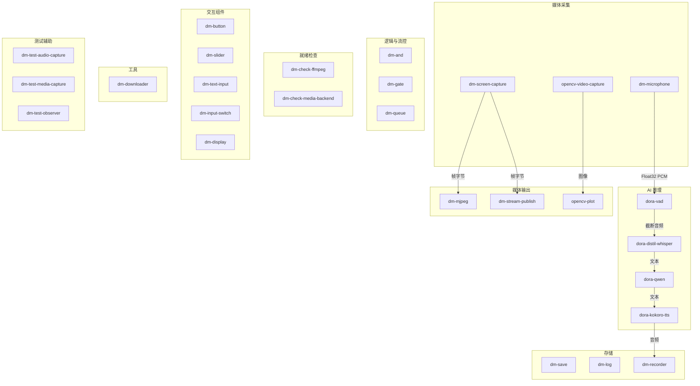
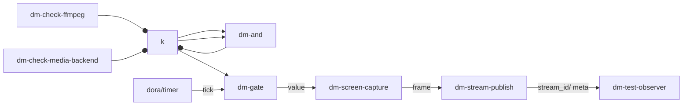
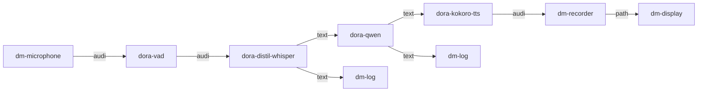

Dora Manager 的 `nodes/` 目录内置了 **27 个节点**，覆盖了从信号采集、逻辑控制、AI 推理到存储持久化的完整数据流构建需求。这些节点通过统一的 `dm.json` 契约描述端口、配置和运行时元信息，可直接在 YAML 数据流中引用，无需额外安装。本文将按功能域逐一解析每个节点的设计意图、端口模型和典型用法，帮助你快速找到构建数据流所需的"零件"。

Sources: [README.md](https://github.com/l1veIn/dora-manager/blob/master/nodes/README.md#L1-L12), [dm.json 示例](https://github.com/l1veIn/dora-manager/blob/master/nodes/dm-and/dm.json#L1-L103)

## 节点全景与分类

在深入各个节点之前，先建立整体认知。下图按功能域展示了全部 27 个内置节点的归属关系和数据流向：

Sources: [nodes/](https://github.com/l1veIn/dora-manager/blob/master/nodes/README.md#L1-L12)

上图的连线展示了最经典的 AI 语音管线（Microphone → VAD → Whisper → Qwen → TTS）和媒体管线（Screen → Stream Publish → Web UI）的数据流方向。下面按功能域逐一展开。

### 速查总表

| 分类 | 节点 ID | 语言 | 简述 | 核心能力标记 |
|------|---------|------|------|-------------|
| 媒体采集 | `dm-microphone` | Python | 麦克风音频采集，支持设备选择 | `media` |
| 媒体采集 | `dm-screen-capture` | Python | 屏幕截图采集 | — |
| 媒体采集 | `opencv-video-capture` | Python | OpenCV 摄像头采集 | — |
| 媒体输出 | `dm-mjpeg` | Rust | MJPEG-over-HTTP 预览端点 | `media` |
| 媒体输出 | `dm-stream-publish` | Python | 帧流发布到媒体后端 | `media` |
| 媒体输出 | `opencv-plot` | Python | OpenCV 图像标注绘制 | — |
| AI 推理 | `dora-distil-whisper` | Python | Whisper 语音转文字 | — |
| AI 推理 | `dora-vad` | Python | Silero VAD 语音活动检测 | — |
| AI 推理 | `dora-qwen` | Python | Qwen LLM 文本生成 | — |
| AI 推理 | `dora-kokoro-tts` | Python | Kokoro 文字转语音 | — |
| 逻辑流控 | `dm-and` | Python | 布尔 AND 聚合 | — |
| 逻辑流控 | `dm-gate` | Python | 条件门控（启用/禁用直通） | — |
| 逻辑流控 | `dm-queue` | Rust | FIFO 缓冲与 flush 控制 | `streaming` |
| 就绪检查 | `dm-check-ffmpeg` | Python | 检查 FFmpeg 可用性 | — |
| 就绪检查 | `dm-check-media-backend` | Python | 检查媒体后端就绪 | — |
| 交互组件 | `dm-button` | Python | 按钮触发控件 | `interaction` |
| 交互组件 | `dm-slider` | Python | 数值滑块控件 | `interaction` |
| 交互组件 | `dm-text-input` | Python | 文本输入控件 | `interaction` |
| 交互组件 | `dm-input-switch` | Python | 布尔开关控件 | `interaction` |
| 交互组件 | `dm-display` | Python | 内容展示（文本/图像/音频等） | — |
| 存储 | `dm-save` | Python | 二进制文件持久化 | — |
| 存储 | `dm-log` | Python | 追加式日志序列化 | — |
| 存储 | `dm-recorder` | Python | 音频 WAV 录制 | `media` |
| 工具 | `dm-downloader` | Python | 模型权重下载与哈希校验 | — |
| 测试 | `dm-test-audio-capture` | Python | 固定时长麦克风采集 | `media` |
| 测试 | `dm-test-media-capture` | Python | 截图/录屏采集 | `media` |
| 测试 | `dm-test-observer` | Python | 多模态事件聚合观察器 | `media` |

Sources: [nodes/](https://github.com/l1veIn/dora-manager/blob/master/nodes/README.md#L1-L12)

## 媒体采集节点

媒体采集节点负责从物理设备或操作系统获取原始数据，是数据流的"源"端。

### dm-microphone：麦克风音频采集

**dm-microphone** 通过 `sounddevice` 库捕获麦克风输入，输出 Float32 PCM 音频流。它支持运行时设备切换——节点启动时在 `devices` 端口发布可用设备列表（JSON），UI 层可通过 `device_id` 输入端口动态切换设备。采集缓冲区由 `max_duration` 配置控制，默认 0.1 秒（100ms），即每 100ms 发送一个音频块。

| 端口 | 方向 | 类型 | 说明 |
|------|------|------|------|
| `audio` | 输出 | Float32 PCM | 连续音频流 |
| `devices` | 输出 | UTF-8 JSON | 可用设备列表 |
| `device_id` | 输入 | UTF-8 | 选择设备 ID |
| `tick` | 输入 | null | 心跳保活 |

关键配置：`sample_rate`（默认 16000Hz）、`max_duration`（缓冲时长，默认 0.1s）。

Sources: [dm-microphone/dm.json](https://github.com/l1veIn/dora-manager/blob/master/nodes/dm-microphone/dm.json#L1-L105), [dm_microphone/main.py](https://github.com/l1veIn/dora-manager/blob/master/nodes/dm-microphone/dm_microphone/main.py#L1-L140)

### dm-screen-capture：屏幕截图采集

**dm-screen-capture** 通过 FFmpeg 后端捕获屏幕帧，编码为 PNG 或 JPEG 字节输出。支持三种采集模式：`once`（启动时截一帧退出）、`repeat`（按固定间隔连续截屏）、`triggered`（每次 `trigger` 端口收到事件时截一帧）。在 `triggered` 模式下，通常配合 `dm-gate` 和定时器实现节流控制。

| 端口 | 方向 | 类型 | 说明 |
|------|------|------|------|
| `trigger` | 输入 | null | 可选触发信号（triggered 模式） |
| `frame` | 输出 | UInt8 编码帧 | PNG 或 JPEG 图像字节 |
| `meta` | 输出 | UTF-8 JSON | 帧元数据 |

关键配置：`mode`（once/repeat/triggered）、`width`/`height`（默认 1280×720）、`output_format`（png/jpeg）、`interval_sec`（repeat 模式间隔）。

Sources: [dm-screen-capture/dm.json](https://github.com/l1veIn/dora-manager/blob/master/nodes/dm-screen-capture/dm.json#L1-L133), [dm-screen-capture/README.md](https://github.com/l1veIn/dora-manager/blob/master/nodes/dm-screen-capture/README.md#L1-L28)

### opencv-video-capture：OpenCV 摄像头采集

**opencv-video-capture** 是来自 Dora Hub 的社区节点，使用 OpenCV 的 `VideoCapture` 接口采集摄像头画面。通过 `tick` 端口触发帧采集，输出带 width/height/encoding 元数据的图像数组。该节点的 `dm.json` 中未声明 `ports`，端口信息来源于其 README 文档中的 YAML 示例约定。

关键环境变量：`PATH`（摄像头索引，默认 0）、`IMAGE_WIDTH`/`IMAGE_HEIGHT`、`JPEG_QUALITY`（编码质量）。

Sources: [opencv-video-capture/README.md](https://github.com/l1veIn/dora-manager/blob/master/nodes/opencv-video-capture/README.md#L1-L75), [opencv-video-capture/dm.json](https://github.com/l1veIn/dora-manager/blob/master/nodes/opencv-video-capture/dm.json#L1-L39)

## 媒体输出节点

媒体输出节点负责将数据流中的帧或图像呈现给用户或推送到下游服务。

### dm-mjpeg：MJPEG-over-HTTP 实时预览

**dm-mjpeg** 是 Dora Manager 中仅有的两个 Rust 原生节点之一（另一个是 `dm-queue`）。它在本地启动一个基于 `axum` 的 HTTP 服务器，将 Dora 数据流中的帧以 MJPEG 格式暴露给浏览器。支持 `/stream`（MJPEG 流）、`/snapshot.jpg`（单帧快照）和 `/healthz`（健康检查）三个端点。

| 端口 | 方向 | 类型 | 说明 |
|------|------|------|------|
| `frame` | 输入 | UInt8 | 图像字节（支持 jpeg/rgb8/rgba8/yuv420p） |

内部使用 `tokio` 异步运行时分离 Dora 事件循环和 HTTP 服务线程，通过无界通道传递帧数据。`drop_if_no_client` 配置（默认 true）在没有 HTTP 客户端连接时跳过帧处理，节省 CPU。

Sources: [dm-mjpeg/dm.json](https://github.com/l1veIn/dora-manager/blob/master/nodes/dm-mjpeg/dm.json#L1-L102), [dm-mjpeg/README.md](https://github.com/l1veIn/dora-manager/blob/master/nodes/dm-mjpeg/README.md#L1-L20), [dm-mjpeg/src/main.rs](https://github.com/l1veIn/dora-manager/blob/master/nodes/dm-mjpeg/src/main.rs#L1-L131)

### dm-stream-publish：流媒体发布

**dm-stream-publish** 接收编码后的图像帧，通过 FFmpeg 管道将帧推送到 dm-server 媒体后端（基于 mediamtx），使 Web UI 的 `VideoPanel` 能够渲染实时视频流。它在启动时通过 HTTP API 向 dm-server 注册流，随后持续向 RTSP/RTMP 端点推送 H.264 编码数据。

| 端口 | 方向 | 类型 | 说明 |
|------|------|------|------|
| `frame` | 输入 | UInt8 | PNG/JPEG 编码图像 |
| `stream_id` | 输出 | UTF-8 | 已发布的流标识 |
| `meta` | 输出 | UTF-8 JSON | 流元数据 |

典型组合模式：`dm-screen-capture`（triggered 模式）→ `dm-stream-publish`，在 [system-test-stream.yml](https://github.com/l1veIn/dora-manager/blob/master/tests/dataflows/system-test-stream.yml#L39-L65) 中有完整示例。

Sources: [dm-stream-publish/dm.json](https://github.com/l1veIn/dora-manager/blob/master/nodes/dm-stream-publish/dm.json#L1-L123), [dm-stream-publish/README.md](https://github.com/l1veIn/dora-manager/blob/master/nodes/dm-stream-publish/README.md#L1-L23)

### opencv-plot：OpenCV 图像标注

**opencv-plot** 在基础图像上绘制边界框（bbox）、文本和标注，典型场景是目标检测结果的可视化。输入包括 `image`（基础图像数组）、`bbox`（检测框/置信度/标签）、`text`（标注文本），输出为标注后的图像。该节点沿用了 Dora Hub 的图像数据约定，通过 metadata 携带 width/height/encoding 信息。

Sources: [opencv-plot/README.md](https://github.com/l1veIn/dora-manager/blob/master/nodes/opencv-plot/README.md#L1-L94)

## AI 推理节点

AI 推理节点封装了语音、语言和视觉领域的模型推理能力，构成了 Dora Manager 最具价值的"智能层"。

### dora-vad：语音活动检测

**dora-vad** 基于 Silero VAD 模型，在连续音频流中检测语音的起止点，仅输出包含有效语音的音频片段。它持续累积音频缓冲区，当检测到语音结束（静音持续超过 `MIN_SILENCE_DURATION_MS`，默认 200ms）时才触发输出。`MAX_AUDIO_DURATION_S`（默认 75s）限制最长语音时长，避免无限等待。

| 端口 | 方向 | 类型 | 说明 |
|------|------|------|------|
| `audio` | 输入 | Float32 | 连续音频流（8kHz 或 16kHz） |
| `audio` | 输出 | Float32 | 截断后的语音片段 |
| `timestamp_start` | 输出 | Int | 语音起始时间戳 |
| `timestamp_end` | 输出 | Int | 语音结束时间戳 |

Sources: [dora-vad/dora_vad/main.py](https://github.com/l1veIn/dora-manager/blob/master/nodes/dora-vad/dora_vad/main.py#L1-L90), [dora-vad/README.md](https://github.com/l1veIn/dora-manager/blob/master/nodes/dora-vad/README.md#L1-L44)

### dora-distil-whisper：语音转文字

**dora-distil-whisper** 封装了 OpenAI Whisper 系列模型（默认 `whisper-large-v3-turbo`），将音频转写为文本。在 macOS 上自动切换为 MLX Whisper 加速推理，Linux 上使用 HuggingFace Transformers CUDA 推理。节点内置了去噪逻辑（`remove_text_noise`）和重复检测（`cut_repetition`），过滤模型幻觉输出。

| 端口（来自 README） | 方向 | 类型 | 说明 |
|------|------|------|------|
| `input` | 输入 | Float32 音频 | 来自 VAD 的语音片段 |
| `text` | 输出 | UTF-8 | 转写文本 |

关键环境变量：`TARGET_LANGUAGE`（默认 english）、`MODEL_NAME_OR_PATH`、`TRANSLATE`（是否翻译模式）。

Sources: [dora-distil-whisper/dora_distil_whisper/main.py](https://github.com/l1veIn/dora-manager/blob/master/nodes/dora-distil-whisper/dora_distil_whisper/main.py#L1-L200), [dora-distil-whisper/README.md](https://github.com/l1veIn/dora-manager/blob/master/nodes/dora-distil-whisper/README.md#L1-L29)

### dora-qwen：Qwen LLM 推理

**dora-qwen** 封装了 Qwen2.5 系列语言模型，支持多轮对话。它在 macOS 上使用 `llama-cpp-python`（GGUF 格式），在 Linux 上使用 HuggingFace Transformers + CUDA。模型默认为 `Qwen/Qwen2.5-0.5B-Instruct-GGUF`，可通过 `MODEL_NAME_OR_PATH` 环境变量替换为更大参数量的模型。

该节点维护对话历史（`history` 列表），支持通过特殊前缀（`<|im_start|>`、`<|vision_start|>`、`<|tool|>`）注入系统提示、图像和工具调用结果。`ACTIVATION_WORDS` 环境变量可限制只在用户输入包含特定词汇时才生成回复。

| 端口（来自代码约定） | 方向 | 类型 | 说明 |
|------|------|------|------|
| `text` / `system_prompt` / `tools` | 输入 | UTF-8 | 对话输入、系统提示、工具定义 |
| `text` | 输出 | UTF-8 | 模型生成文本 |

Sources: [dora-qwen/dora_qwen/main.py](https://github.com/l1veIn/dora-manager/blob/master/nodes/dora-qwen/dora_qwen/main.py#L1-L230), [dora-qwen/README.md](https://github.com/l1veIn/dora-manager/blob/master/nodes/dora-qwen/README.md#L1-L38)

### dora-kokoro-tts：文字转语音

**dora-kokoro-tts** 基于 Kokoro-82M 模型将文本转为语音。它支持中英文自动检测——当检测到中文字符时自动切换 `lang_code="z"` 的管道。输出 24kHz Float32 音频流，按句子分段发送。文本预处理会移除 `<think...</think` 标签内容（来自 LLM 的内部推理），避免朗读推理过程。

| 端口（来自代码约定） | 方向 | 类型 | 说明 |
|------|------|------|------|
| `text` | 输入 | UTF-8 | 待合成文本 |
| `audio` | 输出 | Float32 | 24kHz PCM 音频 |

关键环境变量：`LANGUAGE`（默认 "a"，即美式英语）、`VOICE`（默认 "af_heart"）、`REPO_ID`（默认 "hexgrad/Kokoro-82M"）。

Sources: [dora-kokoro-tts/dora_kokoro_tts/main.py](https://github.com/l1veIn/dora-manager/blob/master/nodes/dora-kokoro-tts/dora_kokoro_tts/main.py#L1-L81), [dora-kokoro-tts/README.md](https://github.com/l1veIn/dora-manager/blob/master/nodes/dora-kokoro-tts/README.md#L1-L39)

## 逻辑与流控节点

逻辑节点负责数据流的条件分支、信号聚合和缓冲控制——它们不产生"新"数据，而是决定"数据何时、如何流动"。

### dm-and：布尔 AND 聚合

**dm-and** 对多个布尔输入执行逻辑与（AND）运算，通常用于聚合多个就绪检查信号。它预定义了 4 个布尔输入端口（a/b/c/d），通过 `expected_inputs` 配置指定参与 AND 的输入子集。当 `require_all_seen=true`（默认）时，所有期望输入必须至少收到一次事件才输出 `true`。

| 端口 | 方向 | 类型 | 说明 |
|------|------|------|------|
| `a`/`b`/`c`/`d` | 输入 | Bool | 布尔输入 |
| `ok` | 输出 | Bool | AND 结果 |
| `details` | 输出 | UTF-8 JSON | 包含各输入状态的详细信息 |

典型用法：聚合 `dm-check-ffmpeg/ok` 和 `dm-check-media-backend/ok`，只有两者都就绪时才启动流媒体管道。

Sources: [dm-and/dm.json](https://github.com/l1veIn/dora-manager/blob/master/nodes/dm-and/dm.json#L1-L103), [dm-and/dm_and/main.py](https://github.com/l1veIn/dora-manager/blob/master/nodes/dm-and/dm_and/main.py#L1-L94)

### dm-gate：条件门控

**dm-gate** 实现了一个简单的"开关门"——只有当 `enabled` 输入为 `true` 时，`value` 输入的事件才会被转发到输出。当门关闭时，事件被静默丢弃。`emit_on_enable` 配置（默认 false）控制门开启时是否立即转发缓存的上一个值。

| 端口 | 方向 | 类型 | 说明 |
|------|------|------|------|
| `enabled` | 输入 | Bool | 门控开关 |
| `value` | 输入 | 任意 | 待门控的值 |
| `value` | 输出 | 任意 | 转发后的值 |

典型用法：`dm-and/ok` → `dm-gate/enabled`，配合定时器实现"就绪后才定时触发"的模式。

Sources: [dm-gate/dm.json](https://github.com/l1veIn/dora-manager/blob/master/nodes/dm-gate/dm.json#L1-L72), [dm-gate/dm_gate/main.py](https://github.com/l1veIn/dora-manager/blob/master/nodes/dm-gate/dm_gate/main.py#L1-L82)

### dm-queue：FIFO 缓冲与流控

**dm-queue** 是 Rust 原生节点，提供 FIFO 缓冲、flush 信令、环形覆盖和磁盘溢出功能。它是数据流中处理速率不匹配问题的核心工具——当生产者速度大于消费者时，数据在队列中排队，满足条件时一次性 flush。

| 端口 | 方向 | 类型 | 说明 |
|------|------|------|------|
| `data` | 输入 | Binary | 待缓冲的任意数据 |
| `control` | 输入 | UTF-8 | 控制命令（flush/reset/stop） |
| `tick` | 输入 | null | 定时心跳（触发超时 flush） |
| `flushed` | 输出 | Binary | flush 后的数据 |
| `buffering` | 输出 | UTF-8 JSON | 缓冲区状态 |
| `error` | 输出 | UTF-8 JSON | 错误信息 |

flush 策略通过 `flush_on` 配置：`signal`（收到控制命令时 flush）或 `full`（缓冲区满时自动 flush）。`flush_timeout` 支持超时自动 flush。`max_size_bytes`（默认 2MB）和 `max_size_buffers`（默认 100）限制缓冲区大小。

Sources: [dm-queue/dm.json](https://github.com/l1veIn/dora-manager/blob/master/nodes/dm-queue/dm.json#L1-L154), [dm-queue/README.md](https://github.com/l1veIn/dora-manager/blob/master/nodes/dm-queue/README.md#L1-L18), [dm-queue/src/main.rs](https://github.com/l1veIn/dora-manager/blob/master/nodes/dm-queue/src/main.rs#L1-L185)

## 就绪检查节点

就绪检查节点（Readiness Check）遵循统一的输出模式：`ok`（Bool）和 `details`（UTF-8 JSON），支持三种运行模式——`once`（启动检查一次）、`repeat`（定期重复检查）、`triggered`（收到 trigger 事件时检查）。

### dm-check-ffmpeg

检查本地系统是否安装了 FFmpeg 可执行文件。通过 `ffmpeg_path` 配置指定路径（默认 `ffmpeg`），尝试执行 `ffmpeg -version` 并解析返回结果。

Sources: [dm-check-ffmpeg/dm.json](https://github.com/l1veIn/dora-manager/blob/master/nodes/dm-check-ffmpeg/dm.json#L1-L84)

### dm-check-media-backend

检查 dm-server 的媒体后端服务是否就绪。通过 HTTP 请求 `server_url`（默认 `http://127.0.0.1:3210`）的健康检查端点进行探测。

Sources: [dm-check-media-backend/dm.json](https://github.com/l1veIn/dora-manager/blob/master/nodes/dm-check-media-backend/dm.json#L1-L84)

## 交互组件节点

交互节点是 Dora Manager 的"双向桥梁"——它们让 Web UI 成为数据流的一等参与者。这些节点在 `dm.json` 中声明了 `interaction` 字段，标记它们参与交互系统。

> 关于交互系统的完整架构，参见 [交互系统：dm-input / dm-display / WebSocket 消息流](21-interaction-system)。

### dm-button：按钮控件

纯输出节点。用户在 UI 中点击按钮时，`click` 端口发出一个 UTF-8 事件。典型场景是"触发下载"、"启动录制"等一次性操作。

配置项：`label`（按钮标签，默认 "Run"）。

Sources: [dm-button/dm.json](https://github.com/l1veIn/dora-manager/blob/master/nodes/dm-button/dm.json#L1-L74)

### dm-slider：数值滑块

纯输出节点。用户拖动滑块时，`value` 端口发出 Float64 数值。支持 `min_val`/`max_val`/`step`/`default_value` 配置。

Sources: [dm-slider/dm.json](https://github.com/l1veIn/dora-manager/blob/master/nodes/dm-slider/dm.json#L1-L84)

### dm-text-input：文本输入

纯输出节点。用户提交文本时，`value` 端口发出 UTF-8 字符串。支持 `multiline`（多行文本域）和 `placeholder` 配置。

Sources: [dm-text-input/dm.json](https://github.com/l1veIn/dora-manager/blob/master/nodes/dm-text-input/dm.json#L1-L89)

### dm-input-switch：布尔开关

纯输出节点。用户切换开关时，`value` 端口发出布尔值。配置 `default_value` 控制初始状态。

Sources: [dm-input-switch/dm.json](https://github.com/l1veIn/dora-manager/blob/master/nodes/dm-input-switch/dm.json#L1-L79)

### dm-display：内容展示

纯输入节点。它接收两种数据并通过 WebSocket 推送到 dm-server，在 Web UI 的运行工作台中展示：
- **`path` 端口**：接收文件路径（通常来自 `dm-save` 等），根据文件扩展名自动推断渲染模式（`.png` → image, `.wav` → audio, `.json` → json 等）
- **`data` 端口**：接收内联内容（文本/JSON），直接推送到 UI，无需经过文件系统

`render` 配置支持 `auto`/`text`/`image`/`audio`/`video`/`json`/`markdown` 七种模式。`auto` 模式下根据输入端口和内容类型自动选择。

Sources: [dm-display/dm.json](https://github.com/l1veIn/dora-manager/blob/master/nodes/dm-display/dm.json#L1-L86), [dm-display/dm_display/main.py](https://github.com/l1veIn/dora-manager/blob/master/nodes/dm-display/dm_display/main.py#L1-L185)

## 存储节点

存储节点将数据流中的内容持久化到磁盘。它们共享一个约定：写入路径在当前运行的 `runs/:id/out/` 目录下，通过 `DM_RUN_OUT_DIR` 环境变量注入。

### dm-save：文件持久化

**dm-save** 将二进制载荷写入磁盘，输出写入文件的绝对路径。它是"帧 → 文件 → 展示"模式的关键中间节点，通常与 `dm-display` 组合使用。

配置亮点：
- **命名模板**：`{timestamp}_{seq}` 支持时间戳和序列号变量
- **容量控制**：`max_files`/`max_total_size`/`max_age` 三维限制
- **覆盖模式**：`overwrite_latest=true` 时保持一个稳定的 `latest` 文件

Sources: [dm-save/dm.json](https://github.com/l1veIn/dora-manager/blob/master/nodes/dm-save/dm.json#L1-L108), [dm-save/README.md](https://github.com/l1veIn/dora-manager/blob/master/nodes/dm-save/README.md#L1-L24)

### dm-log：追加式日志

**dm-log** 将输入事件序列化后追加写入日志文件，基于 `loguru` 库实现。支持 `text`/`json`/`csv` 三种序列化格式，以及 `rotation`（如 "50 MB"）和 `retention`（如 "7 days"）等日志轮转策略。

Sources: [dm-log/dm.json](https://github.com/l1veIn/dora-manager/blob/master/nodes/dm-log/dm.json#L1-L103)

### dm-recorder：音频 WAV 录制

**dm-recorder** 将 Float32 PCM 音频块聚合为完整的 WAV 文件。输出路径可用于 `dm-display` 的 `path` 端口进行音频回放。支持 `sample_rate` 和 `channels` 配置。

Sources: [dm-recorder/dm.json](https://github.com/l1veIn/dora-manager/blob/master/nodes/dm-recorder/dm.json#L1-L88)

## 工具与测试节点

### dm-downloader：模型权重下载器

**dm-downloader** 是一个带 UI 反馈的下载器节点。它支持 `sha256:hex` 格式的哈希校验、`tar.gz`/`zip` 等格式的自动解压、原子写入（下载到 `.dm-tmp` 后重命名）和失败重试。生命周期：Checking → Ready/Waiting → Downloading → Verifying → (Extracting) → Ready。

下载目录按平台自动选择：macOS 为 `~/Library/Application Support/dm/downloads/`，Linux 为 `~/.local/share/dm/downloads/`。

Sources: [dm-downloader/README.md](https://github.com/l1veIn/dora-manager/blob/master/nodes/dm-downloader/README.md#L1-L70), [dm-downloader/dm.json](https://github.com/l1veIn/dora-manager/blob/master/nodes/dm-downloader/dm.json#L1-L101)

### 测试辅助节点

三个测试节点用于系统测试数据流，模拟实际节点的行为但不依赖真实硬件：

| 节点 | 功能 |
|------|------|
| `dm-test-audio-capture` | 固定时长麦克风采集，输出 `audio`/`audio_stream`/`meta` |
| `dm-test-media-capture` | 截图/录屏采集，输出 `image`/`video`/`meta` |
| `dm-test-observer` | 聚合多源元数据，输出人类可读摘要和机器可读 JSON |

Sources: [dm-test-audio-capture/dm.json](https://github.com/l1veIn/dora-manager/blob/master/nodes/dm-test-audio-capture/dm.json#L1-L143), [dm-test-media-capture/dm.json](https://github.com/l1veIn/dora-manager/blob/master/nodes/dm-test-media-capture/dm.json#L1-L102), [dm-test-observer/dm.json](https://github.com/l1veIn/dora-manager/blob/master/nodes/dm-test-observer/dm.json#L1-L102)

## 典型管线组合

以下展示两个实际存在的系统测试数据流，演示节点如何协同工作。

### 流媒体管线：条件启动 + 实时推流

这个管线展示了"就绪检查 → AND 聚合 → 门控定时 → 采集 → 发布"的完整模式。只有 FFmpeg 和媒体后端都就绪时，定时器信号才通过门控触发屏幕截图，截图帧通过 `dm-stream-publish` 推送到 Web UI。

Sources: [system-test-stream.yml](https://github.com/l1veIn/dora-manager/blob/master/tests/dataflows/system-test-stream.yml#L1-L77)

### AI 语音对话管线

这是 [qwen-dev.yml](https://github.com/l1veIn/dora-manager/blob/master/tests/dataflows/qwen-dev.yml) 中完整管线的核心路径：麦克风采集 → VAD 检测语音 → Whisper 转写 → Qwen 生成回复 → Kokoro TTS 合成语音 → Recorder 录制音频文件 → Display 播放。每个 AI 节点的输出同时通过 `dm-log` 持久化，通过 `dm-display` 实时展示。

Sources: [qwen-dev.yml](https://github.com/l1veIn/dora-manager/blob/master/tests/dataflows/qwen-dev.yml#L1-L257)

## 设计模式总结

纵观全部内置节点，可以发现几个反复出现的设计模式：

**就绪信号模式**：`dm-check-*` 节点输出统一的 `{ok, details}` 对，通过 `dm-and` 聚合后控制 `dm-gate`，确保下游管线只在依赖就绪时才启动。

**存储家族模式**：`dm-save`/`dm-log`/`dm-recorder` 共享"写入文件 → 输出路径 → dm-display 展示"的链路，`DM_RUN_OUT_DIR` 环境变量统一管理输出目录。

**交互控件模式**：`dm-button`/`dm-slider`/`dm-text-input`/`dm-input-switch` 都是纯输出节点，通过 `interaction` 元数据声明控件类型，由 Web UI 运行时自动渲染对应的 Widget。

**Port Schema 声明**：Dora Manager 前缀（`dm-*`）的节点在 `dm.json` 的 `ports` 数组中声明了完整的 Arrow 类型 schema，而 Dora Hub 前缀（`dora-*`/`opencv-*`）的节点多为空数组，端口信息依赖 README 文档约定。关于端口校验的完整规范，参见 [Port Schema 规范：基于 Arrow 类型系统的端口校验](20-port-schema)。

Sources: [dm-exclusive-nodes.md](https://github.com/l1veIn/dora-manager/blob/master/docs/dm-exclusive-nodes.md#L1-L92)

## 延伸阅读

- [Port Schema 规范：基于 Arrow 类型系统的端口校验](20-port-schema) — 理解端口类型系统的设计原理
- [交互系统：dm-input / dm-display / WebSocket 消息流](21-interaction-system) — 交互节点的运行时通信架构
- [开发自定义节点：dm.json 完整字段参考](22-custom-node-guide) — 如何开发并注册自己的节点
- [系统测试数据流：集成测试策略与 CheckList](25-testing-strategy) — 内置测试节点的使用场景