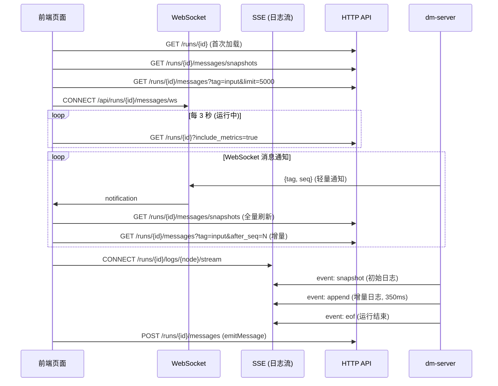

运行工作台（Run Workspace）是 Dora Manager 前端中最核心、最复杂的页面，承载了一次数据流运行实例（Run）的全部可观测与可交互能力。它将节点日志、消息流、输入控件、图表、视频流整合到一个基于 GridStack.js 的自由布局面板系统中，用户可以按需添加、拖拽、缩放、最大化各类面板，并实时观察数据流的运行状态。本文将逐一拆解其三层页面骨架、12 列网格引擎与 Svelte 桥接机制、六种面板的注册表架构与渲染管线、实时通信模型（WebSocket + SSE + 轮询），以及布局持久化与迁移策略。

Sources: [+page.svelte](https://github.com/l1veIn/dora-manager/blob/main/web/src/routes/runs/[id]/+page.svelte#L1-L625), [Workspace.svelte](https://github.com/l1veIn/dora-manager/blob/main/web/src/lib/components/workspace/Workspace.svelte#L1-L175)

## 页面骨架：三层分区结构

运行工作台的路由入口为 `web/src/routes/runs/[id]/+page.svelte`，采用经典的「Header + Sidebar + Main Content」三层分区布局。整个页面以 `flex flex-col` 纵向排列，顶部是固定高度的 `RunHeader`，下方是 `flex-1` 的水平 Flex 容器，内含可折叠侧边栏和 Workspace 主区域。

```
┌──────────────────────────────────────────────────────────────────┐
│  RunHeader                                                       │
│  [← Runs / run-name] [Status] [Stop] [YAML] [Transpiled] [Graph]│
├─────────────┬────────────────────────────────────────────────────┤
│  Sidebar    │  Workspace Toolbar (h-10)                          │
│  (300px,    │  [Toggle Sidebar] [Workspace]    [+ Add Panel ▾]   │
│  可折叠)    ├────────────────────────────────────────────────────┤
│             │  GridStack 12-Column Workspace                    │
│  ┌────────┐ │  ┌────────────────────┬──────────────┐            │
│  │Summary │ │  │  Message Panel     │ Input Panel  │            │
│  │Card    │ │  │  (w:8, h:5)        │ (w:4, h:5)   │            │
│  ├────────┤ │  └────────────────────┴──────────────┘            │
│  │Node    │ │  ┌───────────────────────────────────┐            │
│  │List    │ │  │  Terminal Panel (w:12, h:4)        │            │
│  │(scroll)│ │  └───────────────────────────────────┘            │
│  └────────┘ │                                                    │
└─────────────┴────────────────────────────────────────────────────┘
```

**RunHeader** 是页面顶部固定导航栏，显示运行名称、状态徽章（`RunStatusBadge`），以及三个只读视图入口——YAML 原文、转译后 YAML（Transpiled）、运行时拓扑图（Graph）。前两者通过 CodeMirror 只读编辑器在 Dialog 模态弹窗中展示，Graph 则调用 `RuntimeGraphView` 组件渲染完整的节点拓扑图。所有视图数据按需懒加载，首次点击才发起 HTTP 请求。运行处于 `running` 状态时，右侧还会出现 Stop 按钮，点击后触发 `stopRun()` 发送 POST 请求并启动 burst 轮询（4 次 × 1 秒间隔）以快速捕获状态变更。

Sources: [RunHeader.svelte](https://github.com/l1veIn/dora-manager/blob/main/web/src/routes/runs/[id]/RunHeader.svelte#L117-L226), [+page.svelte](https://github.com/l1veIn/dora-manager/blob/main/web/src/routes/runs/[id]/+page.svelte#L489-L531)

## 左侧边栏：运行摘要与节点列表

左侧边栏宽度固定 300px，通过 `isRunSidebarOpen` 状态控制折叠/展开，折叠状态持久化到 `localStorage`（键名 `dm-run-sidebar-open-{run.name}`）。边栏由两个子组件纵向堆叠：

**RunSummaryCard** 展示运行的元信息摘要：Run ID、Dora UUID、启动时间、持续时间、退出码、观察到的节点数（observed / expected），以及运行级别的 CPU 和内存指标徽章。当运行包含转译详情（`run.transpile`）时，还会额外展示 Working Dir 和 Resolved Flow（每个节点的解析路径）。

**RunNodeList** 以列表形式展示运行中所有节点。每个节点条目显示节点 ID，以及运行时附带的 CPU / 内存指标徽章（来自 `metrics.nodes` 数组）。当用户点击某个节点时，触发 `onNodeSelect` 回调（即 `openNodeTerminal()`），自动在 Workspace 中定位或创建该节点的终端面板——这是侧边栏与主工作区联动的核心交互路径。

Sources: [RunSummaryCard.svelte](https://github.com/l1veIn/dora-manager/blob/main/web/src/routes/runs/[id]/RunSummaryCard.svelte#L1-L195), [RunNodeList.svelte](https://github.com/l1veIn/dora-manager/blob/main/web/src/routes/runs/[id]/RunNodeList.svelte#L1-L111), [+page.svelte](https://github.com/l1veIn/dora-manager/blob/main/web/src/routes/runs/[id]/+page.svelte#L517-L531)

## GridStack 网格引擎与 Svelte 桥接

Workspace 组件是面板系统的物理容器，使用 **GridStack.js** 作为底层网格布局引擎。GridStack 被初始化为 12 列、80px 单元格高度、10px 间距的响应式网格，启用 `float: true` 以允许面板之间垂直方向留有空隙。拖拽仅通过标题栏的 `.grid-drag-handle` 类触发，缩放手柄限制在南、东、东南三个方向。

```typescript
GridStack.init({
    column: 12,
    cellHeight: 80,
    margin: 10,
    float: true,
    animate: true,
    handle: '.grid-drag-handle',
    resizable: { handles: 's, e, se' },
}, gridContainer);
```

### Svelte Action 桥接：`gridWidget`

GridStack 需要直接操控 DOM 元素的位置与尺寸，而 Svelte 通过 `{#each}` 响应式地管理 DOM 生命周期——这两套系统存在潜在冲突。Workspace 通过一个 **Svelte Action** `gridWidget` 实现无缝桥接，其生命周期如下：

1. **创建阶段**：Svelte 的 `{#each}` 循环渲染每个 `gridItems` 条目时，`use:gridWidget={dataItem}` 将 GridStack 所需的 `gs-id`/`gs-x`/`gs-y`/`gs-w`/`gs-h` 属性写入 DOM 节点，然后在 `tick()` 之后调用 `gridServer.makeWidget(node)` 将其纳入 GridStack 的物理引擎控制。
2. **变更同步**：GridStack 的 `change` 事件在用户拖拽或缩放后触发，回调中遍历所有变更项，将新的 `x`/`y`/`w`/`h` 写回 `gridItems` 状态数组，再通过 `onLayoutChange` 向上层 `+page.svelte` 传播。
3. **销毁阶段**：Svelte 从 `{#each}` 中移除某个条目时，触发 Action 的 `destroy()` 回调，调用 `gridServer.removeWidget(node, false)`（`false` 表示仅清除 GridStack 元数据，DOM 销毁交给 Svelte 处理）。

Sources: [Workspace.svelte](https://github.com/l1veIn/dora-manager/blob/main/web/src/lib/components/workspace/Workspace.svelte#L48-L127)

### 布局持久化与 Schema 迁移

布局通过 `handleLayoutChange()` 自动持久化到 `localStorage`，键名为 `dm-workspace-layout-{run.name}`。页面首次加载时，`fetchRunDetail()` 中检测到运行节点列表非空且 `workspaceLoaded` 为 false 时，从 `localStorage` 恢复已保存的布局，并经过 `normalizeWorkspaceLayout()` 进行 schema 迁移。

`normalizeWorkspaceLayout()` 负责将旧版布局数据升级到当前版本，典型迁移规则包括：将旧的 `stream` 面板类型重命名为 `message`；将 `subscribedSourceId`（单字符串）转换为 `nodes` 数组；将 `subscribedInputs` 转换为 `nodes` 数组并设置默认 `tags: ["widgets"]`；删除已废弃的 `subscribedSourceId`/`subscribedSources`/`subscribedInputs` 字段。

Sources: [types.ts](https://github.com/l1veIn/dora-manager/blob/main/web/src/lib/components/workspace/types.ts#L108-L146), [+page.svelte](https://github.com/l1veIn/dora-manager/blob/main/web/src/routes/runs/[id]/+page.svelte#L76-L84), [+page.svelte](https://github.com/l1veIn/dora-manager/blob/main/web/src/routes/runs/[id]/+page.svelte#L264-L281)

## 数据模型：WorkspaceGridItem

每个网格面板由 `WorkspaceGridItem` 类型描述，它是整个面板系统的核心数据结构：

| 字段 | 类型 | 说明 |
|---|---|---|
| `id` | `string` | 随机生成的 7 位 base36 唯一标识 |
| `widgetType` | `PanelKind` | 面板类型枚举：`message` / `input` / `chart` / `table` / `video` / `terminal` |
| `config` | `PanelConfig` | 面板专属配置（nodes/tags/nodeId/gridCols 等） |
| `x` / `y` | `number` | GridStack 网格坐标 |
| `w` / `h` | `number` | GridStack 网格尺寸（列数 × 行数） |
| `min` | `{w, h}?` | 最小尺寸约束（可选） |

`getDefaultLayout()` 在首次访问且无 localStorage 缓存时创建默认双面板布局——左侧 Message 面板（8 列 × 5 行）占据主区域，右侧 Input 面板（4 列 × 5 行）用于交互控件。

Sources: [types.ts](https://github.com/l1veIn/dora-manager/blob/main/web/src/lib/components/workspace/types.ts#L1-L76)

## 面板注册表与渲染管线

面板系统采用**注册表模式（Registry Pattern）**，每种面板类型由一个 `PanelDefinition` 对象统一定义。注册表在 `registry.ts` 中以 `Record<PanelKind, PanelDefinition>` 的形式维护，通过 `getPanelDefinition(kind)` 查询，未找到时降级为 `message` 面板。

### PanelDefinition 结构

| 字段 | 类型 | 说明 |
|---|---|---|
| `kind` | `PanelKind` | 面板类型标识 |
| `title` | `string` | 标题栏显示名 |
| `dotClass` | `string` | 标题栏彩色圆点 CSS 类 |
| `sourceMode` | `"history" \| "snapshot" \| "external"` | 数据获取模式 |
| `supportedTags` | `string[] \| "*"` | 面板关心的消息标签 |
| `defaultConfig` | `PanelConfig` | 新建面板时的默认配置 |
| `component` | Svelte 组件 | 面板渲染组件引用 |

### 三种数据获取模式

面板的数据获取方式由 `sourceMode` 区分，这决定了面板如何从运行时获取数据：

| sourceMode | 机制 | 适用面板 |
|---|---|---|
| `history` | 基于 seq 的增量消息历史查询（`loadInitial`/`loadNew`/`loadOld`） | Message |
| `snapshot` | 从 `context.snapshots` 数组中按 nodes/tags 过滤 | Input, Chart, Table, Video |
| `external` | 面板自行管理数据获取（如 SSE 连接） | Terminal |

### 渲染管线

Workspace 的 `{#each gridItems}` 循环对每个条目执行统一的渲染管线：

```
gridItems[i]
    → getPanelDefinition(item.widgetType)  // 查注册表
    → <div use:gridWidget={dataItem}>      // Svelte Action 桥接 GridStack
        → RootWidgetWrapper                // 统一外壳（标题栏 + 最大化 + 关闭）
            → PanelComponent               // 具体面板组件
                props: { item, api, context, onConfigChange }
```

**RootWidgetWrapper** 为所有面板提供统一外壳——一个 32px 高的 `.grid-drag-handle` 标题栏，包含彩色圆点标识、面板名称、最大化/关闭按钮。双击标题栏或点击最大化按钮可将面板展开为全屏浮层（`fixed inset-0 z-50`，带毛玻璃背景），按 Escape 键恢复。关闭按钮调用 `api.close(item.id)` 从布局中移除面板。

面板组件接收统一的 `PanelRendererProps`，其中 `PanelContext` 是面板与运行时交互的核心上下文对象：

```typescript
type PanelContext = {
    runId: string;                                    // 运行 ID
    snapshots: any[];                                 // 消息快照列表
    inputValues: Record<string, any>;                 // 输入控件当前值
    nodes: any[];                                     // 运行节点列表
    refreshToken: number;                             // 数据刷新令牌（单调递增）
    isRunActive: boolean;                             // 运行是否活跃
    emitMessage: (message: {...}) => Promise<void>;   // 发送消息到数据流
};
```

Sources: [registry.ts](https://github.com/l1veIn/dora-manager/blob/main/web/src/lib/components/workspace/panels/registry.ts#L1-L80), [types.ts](https://github.com/l1veIn/dora-manager/blob/main/web/src/lib/components/workspace/panels/types.ts#L1-L41), [RootWidgetWrapper.svelte](https://github.com/l1veIn/dora-manager/blob/main/web/src/lib/components/workspace/widgets/RootWidgetWrapper.svelte#L1-L45)

## 六种面板实现详解

### Message 面板：双向无限滚动消息流

Message 面板是最复杂的面板之一，使用 `createMessageHistoryState()` 创建基于 Svelte 5 `$state` 的消息状态管理器，支持三个方向的增量加载：

- **`loadInitial()`**：首次加载最新 50 条消息（`desc: true` 参数倒序获取后正序排列），建立 `oldestSeq` 和 `newestSeq` 基线。
- **`loadNew()`**：基于 `newestSeq` 以 `after_seq` 参数增量获取新消息，由 `refreshToken` 变化触发。
- **`loadOld()`**：当用户滚动到顶部（`scrollTop < 10`）时，基于 `oldestSeq` 以 `before_seq` + `desc: true` 向上翻页加载历史消息，并通过 `scrollHeight` 差值保持滚动位置不跳动。

面板顶部提供两个下拉过滤器——按节点 ID 过滤和按消息标签过滤（`text`/`image`/`json`/`markdown`/`audio`/`video` 及动态标签）。消息条目通过 `MessageItem` 组件渲染，根据 `tag` 字段自动选择渲染方式：`text`（等宽文本块）、`image`（Viewer.js 全屏预览 + 下载按钮）、`video`/`audio`（原生播放器）、`json`（语法高亮折叠树）、`markdown`（prose 排版），未知标签降级为 JSON 视图。

Sources: [MessagePanel.svelte](https://github.com/l1veIn/dora-manager/blob/main/web/src/lib/components/workspace/panels/message/MessagePanel.svelte#L1-L217), [message-state.svelte.ts](https://github.com/l1veIn/dora-manager/blob/main/web/src/lib/components/workspace/panels/message/message-state.svelte.ts#L1-L145), [MessageItem.svelte](https://github.com/l1veIn/dora-manager/blob/main/web/src/lib/components/workspace/panels/message/MessageItem.svelte#L1-L125)

### Input 面板：响应式控件网格

Input 面板从 `context.snapshots` 中筛选 `tag === "widgets"` 的快照，将每个快照的 `payload.widgets` 展开为控件网格。它支持 10 种控件类型，由独立的 Svelte 组件分别渲染：

| 控件类型 | 组件 | 交互方式 |
|---|---|---|
| `input` | ControlInput | 单行文本输入，回车或点击发送 |
| `textarea` | ControlTextarea | 多行文本 |
| `button` | ControlButton | 点击触发 |
| `select` | ControlSelect | 下拉选择 |
| `slider` | ControlSlider | 范围滑块调节 |
| `switch` | ControlSwitch | 开关切换 |
| `radio` | ControlRadio | 单选按钮组 |
| `checkbox` | ControlCheckbox | 多选复选框 |
| `path`/`file_picker`/`directory` | ControlPath | 路径选择器 |
| `file` | 原生 `<input type="file">` | 文件上传（Base64 编码） |

控件的值通过 `context.emitMessage()` 以 `{from: "web", tag: "input", payload: {to, output_id, value}}` 格式发送到后端，再由 dm-server 转发到数据流中的目标节点。Input 面板维护一条值优先级链：`draftValues`（本地草稿） > `context.inputValues`（服务端已发送值） > `widget.default`（控件默认值）。网格列数可通过右上角下拉菜单在 1/2/3 列之间切换。

Sources: [InputPanel.svelte](https://github.com/l1veIn/dora-manager/blob/main/web/src/lib/components/workspace/panels/input/InputPanel.svelte#L1-L249)

### Chart 面板：数据可视化

Chart 面板使用 `layerchart` 库渲染折线图和柱状图。数据格式要求快照的 `payload` 包含 `labels`（X 轴标签数组）和 `series`（数据系列数组，每个系列含 `name`/`data`/`color`）。面板内部将这种结构转换为 `layerchart` 所需的扁平化数据集格式，并根据 `payload.type` 字段选择 `LineChart` 或 `BarChart` 组件。每个图表卡片显示标题、节点 ID、图表类型徽章，以及可选的描述文本。

Sources: [ChartPanel.svelte](https://github.com/l1veIn/dora-manager/blob/main/web/src/lib/components/workspace/panels/chart/ChartPanel.svelte#L1-L199)

### Video 面板：双模式媒体播放

Video 面板封装了 PlyrPlayer（基于 Plyr + HLS.js），支持两种播放模式：

- **手动模式（Manual）**：用户直接输入媒体 URL，选择源类型（HLS/Video/Audio/Auto），可配置 autoplay 和 muted 开关。
- **消息模式（Message）**：从 `tag === "stream"` 的快照中自动提取可用媒体源。`extractSources()` 函数兼容多种 payload 格式——`sources` 数组、`url`/`src` 字段、`hls_url` 字段、`viewer.hls_url` 字段、以及 `path` 遗留格式（自动拼接 MediaMTX HLS 地址）。源类型通过 URL 后缀和 MIME 类型自动推断。

模式切换采用圆角 Toggle 按钮组设计，节点过滤和源选择使用圆角 Select 下拉框，整体视觉风格统一。

Sources: [VideoPanel.svelte](https://github.com/l1veIn/dora-manager/blob/main/web/src/lib/components/workspace/panels/video/VideoPanel.svelte#L1-L350)

### Table 面板

Table 面板目前复用 MessagePanel 组件，以消息流的形式展示结构化表格数据，默认过滤标签为 `["table"]`。

Sources: [registry.ts](https://github.com/l1veIn/dora-manager/blob/main/web/src/lib/components/workspace/panels/registry.ts#L37-L45)

### Terminal 面板：实时节点日志终端

Terminal 面板是运行工作台中唯一使用 `external` 数据获取模式的面板，它自行管理数据生命周期，核心渲染委托给 `RunLogViewer` 组件。终端基于 **xterm.js** 构建，通过 `createManagedTerminal()` 工厂函数初始化——配置 JetBrains Mono 等宽字体、12px 字号、1.35 行高、5000 行回滚缓冲区，以及深蓝色主题（`#0b1020` 背景）。`FitAddon` 确保终端随容器尺寸自动适配。

日志获取策略根据运行状态分为两条路径：

- **运行中（`isRunActive = true`）**：通过 **SSE（Server-Sent Events）** 连接 `/api/runs/{id}/logs/{nodeId}/stream?tail_lines=800` 建立实时日志流。后端首先发送 `snapshot` 事件（最后 N 行日志），然后每 350ms 轮询日志文件增量发送 `append` 事件，运行结束后发送 `eof` 事件关闭流。
- **已结束（`isRunActive = false`）**：通过 HTTP GET `/api/runs/{id}/logs/{nodeId}` 一次性获取完整日志文件。

状态机通过 `viewKey`（`{runId}:{nodeId}:{live|done}` 组合键）驱动：当 `runId`、`nodeId` 或 `isRunActive` 任一变化时，`$effect` 自动触发 `loadView()` 切换到对应的数据获取策略。终端工具栏提供节点选择下拉框（可切换查看不同节点日志）、刷新按钮和下载按钮（将完整日志导出为 `.log` 文件）。

Sources: [TerminalPanel.svelte](https://github.com/l1veIn/dora-manager/blob/main/web/src/lib/components/workspace/panels/terminal/TerminalPanel.svelte#L1-L23), [RunLogViewer.svelte](https://github.com/l1veIn/dora-manager/blob/main/web/src/routes/runs/[id]/RunLogViewer.svelte#L1-L256), [xterm.ts](https://github.com/l1veIn/dora-manager/blob/main/web/src/lib/terminal/xterm.ts#L1-L51), [runs.rs](https://github.com/l1veIn/dora-manager/blob/main/crates/dm-server/src/handlers/runs.rs#L190-L265)

## 实时通信模型

运行工作台的实时性通过三层通信机制协同实现，各层分工明确：



### WebSocket 实时通知

WebSocket 连接（`/api/runs/{id}/messages/ws`）仅推送轻量级通知（包含 `tag` 和 `seq`），前端收到通知后主动拉取完整数据。这种 **"通知 + 拉取"** 模式避免了 WebSocket 传输大量 payload 的开销，同时保持数据一致性。WebSocket 断开后通过 `scheduleMessageSocketReconnect()` 在 1 秒后自动重连。收到 `input` 类型的通知时，前端还会调用 `fetchNewInputValues()` 以 `after_seq` 参数增量获取新的输入值。

Sources: [+page.svelte](https://github.com/l1veIn/dora-manager/blob/main/web/src/routes/runs/[id]/+page.svelte#L438-L467)

### 定时轮询

主轮询（`mainPolling`）每 3 秒通过 `fetchRunDetail()` 刷新运行详情和指标数据，仅在 `isRunActive` 为 true 或存在 `stopRequest` 时执行。运行结束后清空 `metrics` 并停止轮询。

Sources: [+page.svelte](https://github.com/l1veIn/dora-manager/blob/main/web/src/routes/runs/[id]/+page.svelte#L469-L486)

### 增量数据获取

`fetchNewInputValues()` 通过 `after_seq` 参数只获取上次 `latestInputSeq` 之后的新输入值，避免重复传输。`fetchSnapshots()` 全量刷新快照列表，但通过 `snapshotRefreshInFlight` Promise 去重，防止并发请求。`messageRefreshToken` 是一个单调递增计数器，每次 WebSocket 通知或 `emitMessage` 后递增，驱动面板的 `$effect` 检测数据变化并触发刷新。

Sources: [+page.svelte](https://github.com/l1veIn/dora-manager/blob/main/web/src/routes/runs/[id]/+page.svelte#L305-L383)

### SSE 日志流协议

后端 `stream_run_logs` 处理器通过 Axum 的 SSE 响应构建日志流。协议包含四种事件类型：

| 事件 | 数据 | 说明 |
|---|---|---|
| `snapshot` | 完整文本 | 初始发送最后 N 行日志（`tail_lines` 参数，默认 500，范围 50-5000） |
| `append` | 增量文本 | 每 350ms 轮询日志文件，发送上次 offset 之后的新内容 |
| `eof` | 运行状态 | 运行已结束，流关闭 |
| `error` | 错误信息 | 读取失败 |

后端通过 `read_tail_text()` 实现高效的尾部读取——从文件末尾向前以 8KB 块读取并统计换行符数量，定位到最后 N 行的起始位置，避免加载完整日志文件。

Sources: [runs.rs](https://github.com/l1veIn/dora-manager/blob/main/crates/dm-server/src/handlers/runs.rs#L190-L310)

## 面板动态操作

### 动态添加面板

`addWidget()` 函数通过工具栏的 "Add Panel" 下拉菜单触发。它计算当前布局中最大的 `y + h` 值，在网格底部追加新面板（默认 w:6, h:4），`config` 从注册表的 `defaultConfig` 克隆。支持五种面板类型：Message、Input、Chart、Video（Plyr）、Terminal。

Sources: [+page.svelte](https://github.com/l1veIn/dora-manager/blob/main/web/src/routes/runs/[id]/+page.svelte#L94-L112)

### 节点终端自动注入

`openNodeTerminal()` 是侧边栏 NodeList 与 Workspace 联动的关键交互函数。当用户在侧边栏点击某个节点时，它按优先级执行以下逻辑：

1. **查找已绑定该 `nodeId` 的终端面板** → 直接定位并滚动
2. **查找任意空闲终端面板** → 复用并重设 `config.nodeId`
3. **无终端面板** → 调用 `mutateTreeInjectTerminal()` 在底部注入新的全宽（w:12）终端面板

定位后通过 `scrollIntoView({ behavior: "smooth" })` 平滑滚动到目标面板，并添加 1.5 秒的 `ring-2 ring-primary/80` 高亮动画，通过 forced reflow 技巧确保动画正确触发。

Sources: [+page.svelte](https://github.com/l1veIn/dora-manager/blob/main/web/src/routes/runs/[id]/+page.svelte#L114-L185), [types.ts](https://github.com/l1veIn/dora-manager/blob/main/web/src/lib/components/workspace/types.ts#L78-L106)

### 交互提示条

当运行包含 `tag === "widgets"` 的快照时，Workspace 工具栏下方会出现一条交互提示条，引导用户使用 Input 面板发送值。提示条可手动关闭，关闭状态持久化到 `localStorage`。

Sources: [+page.svelte](https://github.com/l1veIn/dora-manager/blob/main/web/src/routes/runs/[id]/+page.svelte#L587-L607)

## 错误状态处理

### 运行失败横幅

当运行包含 `failure_node` 或 `failure_message` 字段时，RunHeader 下方展示 `RunFailureBanner`——红色警告横幅显示失败节点名称和错误消息，帮助用户快速定位问题。

Sources: [RunFailureBanner.svelte](https://github.com/l1veIn/dora-manager/blob/main/web/src/routes/runs/[id]/RunFailureBanner.svelte#L1-L38), [+page.svelte](https://github.com/l1veIn/dora-manager/blob/main/web/src/routes/runs/[id]/+page.svelte#L510-L515)

### Stop 请求状态机

Stop 操作通过 `StopRequestState` 状态机管理，包含三种阶段：`idle`（初始）、`pending`（已请求，等待响应）、`delayed`（超过 15 秒仍未停止）。状态机与后端 `stop_requested_at` 时间戳同步，并在 UI 上反映为不同的按钮文案和状态徽章。这种设计允许用户安全离开页面——dm-server 会继续在后台管理运行生命周期。

Sources: [+page.svelte](https://github.com/l1veIn/dora-manager/blob/main/web/src/routes/runs/[id]/+page.svelte#L38-L243)

## 六种面板对比总览

| 面板 | sourceMode | 默认标签 | 数据来源 | 核心交互 |
|---|---|---|---|---|
| **Message** | `history` | `["*"]` | HTTP 增量查询 + seq | 双向无限滚动、节点/标签过滤 |
| **Input** | `snapshot` | `["widgets"]` | snapshots 快照 | 10 种控件、实时发送、网格列切换 |
| **Chart** | `snapshot` | `["chart"]` | snapshots 快照 | 折线/柱状图、多序列 |
| **Table** | `snapshot` | `["table"]` | snapshots 快照 | 复用 Message 面板 |
| **Video** | `snapshot` | `["stream"]` | snapshots 快照 | 手动 URL / 消息自动源、HLS 播放 |
| **Terminal** | `external` | `[]` | SSE 实时流 / HTTP 全量 | 节点切换、实时尾随、日志下载 |

Sources: [registry.ts](https://github.com/l1veIn/dora-manager/blob/main/web/src/lib/components/workspace/panels/registry.ts#L9-L75)

## 与其他页面的关联

运行工作台整合了多个子系统的能力，其上下游页面提供更深入的专题内容：

- 数据流 YAML 拓扑的编辑与可视化参见 [可视化图编辑器：SvelteFlow 画布、右键菜单与 YAML 双向同步](18-ke-shi-hua-tu-bian-ji-qi-svelteflow-hua-bu-you-jian-cai-dan-yu-yaml-shuang-xiang-tong-bu)
- Input 面板中控件的完整类型定义与渲染机制参见 [响应式控件（Widgets）：控件注册表、动态渲染与 WebSocket 参数注入](20-xiang-ying-shi-kong-jian-widgets-kong-jian-zhu-ce-biao-dong-tai-xuan-ran-yu-websocket-can-shu-zhu-ru)
- 后端消息 API、WebSocket 端点与 SSE 日志流的实现细节参见 [HTTP API 全览：REST 路由、WebSocket 实时通道与 Swagger 文档](15-http-api-quan-lan-rest-lu-you-websocket-shi-shi-tong-dao-yu-swagger-wen-dang)
- dm-input / dm-display 交互节点如何产生和消费面板数据参见 [交互系统架构：dm-input / dm-display / Bridge 节点注入原理](22-jiao-hu-xi-tong-jia-gou-dm-input-dm-display-bridge-jie-dian-zhu-ru-yuan-li)
- Run 的生命周期与状态模型基础参见 [运行实例（Run）：生命周期状态机与指标追踪](06-yun-xing-shi-li-run-sheng-ming-zhou-qi-zhuang-tai-ji-yu-zhi-biao-zhui-zong)
- 前端项目的路由设计与 API 通信层参见 [SvelteKit 项目结构：路由设计、API 通信层与状态管理](17-sveltekit-xiang-mu-jie-gou-lu-you-she-ji-api-tong-xin-ceng-yu-zhuang-tai-guan-li)