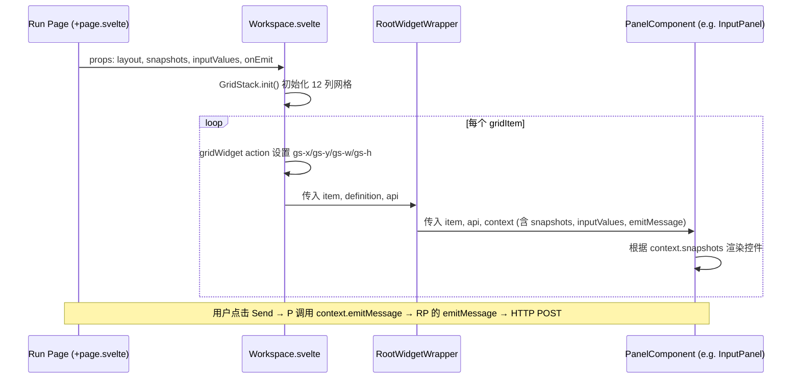
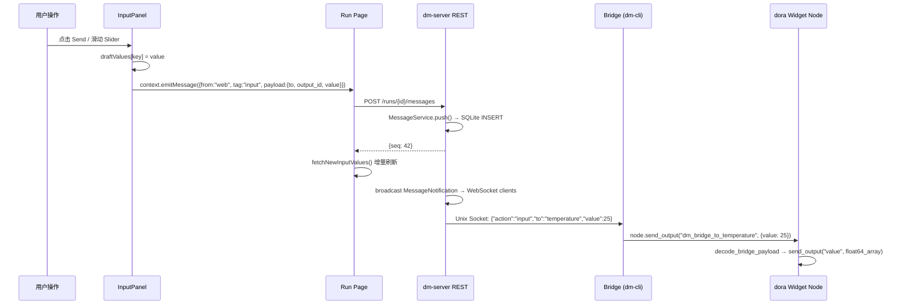

Dora Manager 的响应式控件系统是一套从数据流节点到 Web UI 的双向通信架构——节点声明控件形态（按钮、滑块、开关等），前端根据快照数据动态渲染，用户操作通过 WebSocket + HTTP 管线注入回数据流。本文将逐层拆解控件注册表（Panel Registry）、快照驱动的动态渲染、以及 Bridge 中继的参数注入全链路。

Sources: [types.ts](https://github.com/l1veIn/dora-manager/blob/main/web/src/lib/components/workspace/types.ts#L1-L147), [registry.ts](https://github.com/l1veIn/dora-manager/blob/main/web/src/lib/components/workspace/panels/registry.ts#L1-L80), [InputPanel.svelte](https://github.com/l1veIn/dora-manager/blob/main/web/src/lib/components/workspace/panels/input/InputPanel.svelte#L1-L249)

## 系统架构全景

在深入各层细节之前，需要理解控件系统的四层架构以及数据在各层间的流转方式。整个系统遵循一个清晰的设计原则：**前端对节点零感知**——它不直接连接 dora 节点，而是通过 dm-server 的消息服务作为中间层。

```mermaid
graph LR
    subgraph "Dora 数据流层"
        WN[Widget Nodes<br/>dm-button / dm-slider / dm-text-input]
        DN[Display Nodes<br/>dm-message]
    end

    subgraph "Bridge 进程 (dm-cli)"
        BR[Bridge Serve<br/>Unix Socket ↔ DoraNode API]
    end

    subgraph "dm-server (Rust)"
        MS[MessageService<br/>SQLite + Snapshots]
        WS[/messages/ws<br/>WebSocket 通道]
        HTTP[REST API<br/>push / list / snapshots]
    end

    subgraph "前端 (Svelte)"
        IP[InputPanel<br/>动态控件渲染]
        MP[MessagePanel<br/>消息历史展示]
    end

    WN -- "接收 Bridge 转发的输入" --> BR
    BR -- "tag=widgets<br/>注册快照" --> MS
    BR -- "tag=input<br/>转发用户输入" --> MS
    DN -- "display 输出" --> BR
    BR -- "tag=text/chart/..." --> MS
    MS -- "broadcast" --> WS
    HTTP -- "REST" --> MS
    WS -- "实时通知" --> IP
    WS -- "实时通知" --> MP
    IP -- "POST /messages" --> HTTP
```

**数据流关键节点**：Widget Node（如 `dm-slider`）本身不直接与前端通信。它在 dora 数据流中作为普通节点运行，通过 Bridge 进程（`dm-cli bridge` 命令）作为中介：Bridge 一端连接 dora 的 `DoraNode` API，另一端通过 Unix Socket 连接 dm-server。dm-server 将所有消息持久化到 SQLite 并通过 WebSocket 广播变更通知。

Sources: [bridge.rs](https://github.com/l1veIn/dora-manager/blob/main/crates/dm-cli/src/bridge.rs#L57-L193), [messages.rs](https://github.com/l1veIn/dora-manager/blob/main/crates/dm-server/src/services/message.rs#L104-L161), [messages handler](https://github.com/l1veIn/dora-manager/blob/main/crates/dm-server/src/handlers/messages.rs#L223-L270)

## 控件注册表（Panel Registry）

控件注册表是前端 Workspace 系统的核心路由表——它将每种面板类型（Panel Kind）映射到对应的 Svelte 组件、默认配置和过滤规则。

### PanelKind 类型定义

系统当前支持 6 种面板类型：

| Panel Kind | 组件 | 数据源模式 | 支持的 Tag | 用途 |
|---|---|---|---|---|
| `message` | MessagePanel | `history` | `*`（全部） | 消息历史流式展示 |
| `input` | InputPanel | `snapshot` | `widgets` | 交互控件渲染 |
| `chart` | ChartPanel | `snapshot` | `chart` | 图表数据可视化 |
| `table` | MessagePanel | `snapshot` | `table` | 表格数据展示 |
| `video` | VideoPanel | `snapshot` | `stream` | 媒体流播放 |
| `terminal` | TerminalPanel | `external` | `[]`（空） | 节点日志终端 |

Sources: [types.ts](https://github.com/l1veIn/dora-manager/blob/main/web/src/lib/components/workspace/types.ts#L8-L8), [registry.ts](https://github.com/l1veIn/dora-manager/blob/main/web/src/lib/components/workspace/panels/registry.ts#L9-L75)

### 注册表结构

每个 `PanelDefinition` 包含以下关键字段：

```typescript
type PanelDefinition = {
    kind: PanelKind;           // 面板类型标识
    title: string;             // 标题栏显示名称
    dotClass: string;          // 标题栏状态点 CSS 类
    sourceMode: PanelSourceMode; // 数据获取模式
    supportedTags: string[] | "*"; // 订阅哪些 tag 的消息
    defaultConfig: PanelConfig;   // 新建面板时的默认配置
    component: any;            // Svelte 组件引用
};
```

`sourceMode` 决定了面板如何获取数据——`history` 模式使用分页历史查询（MessagePanel），`snapshot` 模式使用最新快照（InputPanel/ChartPanel），`external` 模式完全由面板自行管理数据源（TerminalPanel 通过独立的 run WebSocket 获取日志）。

Sources: [types.ts (panels)](https://github.com/l1veIn/dora-manager/blob/main/web/src/lib/components/workspace/panels/types.ts#L30-L40)

### 面板查找与降级

`getPanelDefinition(kind)` 函数提供安全的面板查找，当传入未知的 `kind` 时降级到 `message` 面板：

```typescript
export function getPanelDefinition(kind: PanelKind): PanelDefinition {
    return panelRegistry[kind] ?? panelRegistry.message;
}
```

这种降级策略确保即使布局持久化中存储了已废弃的面板类型（例如 `stream` 已合并到 `message`），`normalizeWorkspaceLayout` 函数也能将其安全映射为 `message` 类型并合并默认配置。

Sources: [registry.ts](https://github.com/l1veIn/dora-manager/blob/main/web/src/lib/components/workspace/panels/registry.ts#L77-L79), [types.ts](https://github.com/l1veIn/dora-manager/blob/main/web/src/lib/components/workspace/types.ts#L108-L146)

## Workspace 网格与 Widget 渲染管线

Workspace 是所有面板的容器组件，使用 **GridStack** 库实现拖拽、缩放的网格布局。理解它的渲染管线有助于定位控件为何不显示或为何数据不更新。

### 渲染管线架构



Workspace 组件通过 `{#each gridItems as dataItem}` 遍历布局数组，对每个 `gridItem` 执行以下步骤：

1. **`getPanelDefinition(dataItem.widgetType)`** 获取面板定义
2. **`use:gridWidget`** Svelte Action 将 DOM 节点注册到 GridStack
3. **`<RootWidgetWrapper>`** 渲染标题栏（含拖拽把手、最大化、关闭按钮）
4. **`<PanelComponent>`** 在 Wrapper 内部渲染实际的面板内容

`PanelContext` 是面板与外界的唯一接口，包含 `runId`、`snapshots`、`inputValues`、`nodes`、`refreshToken`、`isRunActive` 和 `emitMessage` 函数。

Sources: [Workspace.svelte](https://github.com/l1veIn/dora-manager/blob/main/web/src/lib/components/workspace/Workspace.svelte#L1-L175), [RootWidgetWrapper.svelte](https://github.com/l1veIn/dora-manager/blob/main/web/src/lib/components/workspace/widgets/RootWidgetWrapper.svelte#L1-L45), [types.ts (panels)](https://github.com/l1veIn/dora-manager/blob/main/web/src/lib/components/workspace/panels/types.ts#L4-L28)

### 布局持久化

Workspace 布局通过 `localStorage` 按 `dm-workspace-layout-{run.name}` 键持久化。`handleLayoutChange` 回调在每次 GridStack 变更（拖拽、缩放、添加/删除面板）时触发，将最新的 `gridItems` 数组序列化保存。页面重新加载时通过 `normalizeWorkspaceLayout` 处理向后兼容（例如将废弃的 `stream` 类型映射为 `message`，将旧的 `subscribedSourceId` 迁移为 `nodes` 数组）。

Sources: [+page.svelte](https://github.com/l1veIn/dora-manager/blob/main/web/src/routes/runs/[id]/+page.svelte#L76-L84), [types.ts](https://github.com/l1veIn/dora-manager/blob/main/web/src/lib/components/workspace/types.ts#L108-L146)

## Bridge 中继与控件注册协议

控件之所以能被前端「自动发现」，核心在于 **Bridge 进程在启动时向 dm-server 推送 `tag=widgets` 快照**。这是整个控件系统的注册协议。

### Transpiler 注入 Bridge 节点

当用户执行 `dm start` 启动一个包含交互节点（如 `dm-slider`）的数据流时，Transpiler 的 Pass 4.5（`inject_dm_bridge`）会扫描所有 Managed 节点的 `capabilities`，发现声明了 `widget_input` 或 `display` 能力的节点后，自动注入一个隐藏的 `__dm_bridge` 节点到数据流中。这个 Bridge 节点的关键环境变量包括：

| 环境变量 | 值 | 作用 |
|---|---|---|
| `DM_CAPABILITIES_JSON` | JSON 数组 | 所有需要桥接的节点规格 |
| `DM_BRIDGE_INPUT_PORT` | `dm_bridge_input_internal` | Bridge 输出端口到节点的映射 |
| `DM_BRIDGE_OUTPUT_ENV_KEY` | `dm_display_from_{id}` | 节点输出到 Bridge 的映射 |

Sources: [passes.rs](https://github.com/l1veIn/dora-manager/blob/main/crates/dm-core/src/dataflow/transpile/passes.rs#L456-L570), [bridge.rs (core)](https://github.com/l1veIn/dora-manager/blob/main/crates/dm-core/src/dataflow/transpile/bridge.rs#L10-L84)

### Bridge 注册控件

Bridge 进程启动后，会为每个声明了 `widget_input` 能力的节点构造一个控件描述 JSON，并通过 `push` 动作发送给 dm-server：

```json
{
  "action": "push",
  "from": "temperature",
  "tag": "widgets",
  "payload": {
    "label": "Temperature (°C)",
    "widgets": {
      "value": {
        "type": "slider",
        "label": "Temperature (°C)",
        "min": -20, "max": 50, "step": 1, "default": 20
      }
    }
  }
}
```

`widget_payload` 函数根据 `node_id` 分派不同的控件描述构造逻辑。目前已内置支持以下节点的自动描述：`dm-text-input`（input/textarea）、`dm-button`（button）、`dm-slider`（slider）、`dm-input-switch`（switch）。未内置的节点类型将生成空的 `widgets: {}`。

Sources: [bridge.rs](https://github.com/l1veIn/dora-manager/blob/main/crates/dm-cli/src/bridge.rs#L244-L289)

### dm-server 快照机制

`MessageService` 使用 SQLite 的 `UPSERT` 语义实现快照表——`message_snapshots` 表以 `(node_id, tag)` 为主键，每次 `push` 操作同时写入历史消息表和更新快照表：

```sql
INSERT INTO message_snapshots (node_id, tag, payload, seq, updated_at)
VALUES (?1, ?2, ?3, ?4, ?5)
ON CONFLICT(node_id, tag) DO UPDATE SET
    payload = excluded.payload, seq = excluded.seq, updated_at = excluded.updated_at
```

这意味着无论 Bridge 重启多少次、发送多少次注册消息，前端获取的始终是该节点最新的控件描述。`GET /api/runs/{id}/messages/snapshots` 返回所有快照，前端通过 `tag === "widgets"` 过滤出控件描述。

Sources: [message.rs](https://github.com/l1veIn/dora-manager/blob/main/crates/dm-server/src/services/message.rs#L138-L161), [message.rs snapshots](https://github.com/l1veIn/dora-manager/blob/main/crates/dm-server/src/services/message.rs#L226-L243)

## InputPanel 动态渲染机制

InputPanel 是控件系统的前端核心——它读取 `tag=widgets` 的快照数据，根据 `widget.type` 字段动态选择对应的 Svelte 控件组件进行渲染。

### 控件类型映射表

| `widget.type` | 组件 | 交互方式 | 输出类型 |
|---|---|---|---|
| `input` | ControlInput | 输入框 + Send 按钮 | `string` |
| `textarea` | ControlTextarea | 多行文本框 + Cmd/Ctrl+Enter 发送 | `string` |
| `button` | ControlButton | 单次点击触发 | `string`（常量 `"clicked"`） |
| `select` | ControlSelect | 下拉选择 | `string` |
| `slider` | ControlSlider | 滑块拖动 | `number` |
| `switch` | ControlSwitch | 开关切换 | `boolean` |
| `radio` | ControlRadio | 单选按钮组 + Send | `string` |
| `checkbox` | ControlCheckbox | 多选复选框 + Send | `string[]` |
| `path` / `file_picker` / `directory` | ControlPath | 路径选择器 | `string` |
| `file` | 原生 `<input type="file">` | 文件上传 | `string`（Base64） |

Sources: [InputPanel.svelte](https://github.com/l1veIn/dora-manager/blob/main/web/src/lib/components/workspace/panels/input/InputPanel.svelte#L219-L241)

### 快照过滤与控件渲染

InputPanel 使用 `createSnapshotViewState` 响应式过滤快照——它接收全局 `snapshots` 数组和当前面板的 `nodes`/`tags` 过滤器，返回匹配的控件列表。渲染逻辑的核心是**双重迭代**：

```
遍历 widgetSnapshots (每个 binding = 一个节点的控件声明)
  → 遍历 binding.payload.widgets (每个 widget = 该节点的一个输出端口控件)
    → 根据 widget.type 选择对应的 Control* 组件
```

每个控件卡片的标题栏显示 `binding.payload.label`（节点级别的标签）或降级到 `binding.node_id`。当一个节点声明了多个 widget 时，还会在每个控件上方显示 `widget.label ?? outputId` 作为区分标签。

Sources: [InputPanel.svelte](https://github.com/l1veIn/dora-manager/blob/main/web/src/lib/components/workspace/panels/input/InputPanel.svelte#L198-L248), [message-state.svelte.ts](https://github.com/l1veIn/dora-manager/blob/main/web/src/lib/components/workspace/panels/message/message-state.svelte.ts#L121-L144)

### 值的初始状态解析

控件值的解析遵循三级优先链：`draftValues[key]` → `context.inputValues[key]` → `widget.default` → 类型默认值（checkbox 为 `[]`、switch 为 `false`、slider 为 `widget.min ?? 0`、其余为 `""`）。`key` 的格式为 `{nodeId}:{outputId}`，这保证了同一面板中不同节点的同输出端口名不会冲突。

`draftValues` 是纯前端状态，在用户操作但尚未发送时暂存；`context.inputValues` 则是从 `GET /runs/{id}/messages?tag=input` 历史查询中恢复的已发送值。

Sources: [InputPanel.svelte](https://github.com/l1veIn/dora-manager/blob/main/web/src/lib/components/workspace/panels/input/InputPanel.svelte#L76-L104)

## WebSocket 参数注入全链路

当用户在 InputPanel 中操作控件并点击发送时，数据经过一条完整的前后端链路最终到达 dora 数据流节点。理解这条链路是排查控件「发不出去」或「节点收不到」问题的关键。

### 发送链路详解



关键步骤分解：

**步骤 1：前端发送** — `handleEmit` 函数构造消息体 `{from: "web", tag: "input", payload: {to: nodeId, output_id: outputId, value}}` 并调用 `context.emitMessage`，最终通过 `POST /api/runs/{id}/messages` 发送到 dm-server。

**步骤 2：服务端持久化** — `push_message` handler 调用 `MessageService::push()`，将消息写入 `messages` 历史表并更新 `message_snapshots` 快照表，然后通过 `broadcast::Sender` 发送 `MessageNotification`。

**步骤 3：Bridge 接收** — `bridge_socket_loop` 在 dm-server 中监听 Unix Socket 连接。当有新的 `tag=input` 消息时，它查找完整的消息体并转发给 Bridge 进程：`{"action":"input","to":"temperature","value":25}`。

**步骤 4：Bridge 转发到 dora** — Bridge 进程收到 `InputNotification`，查找 `widget_specs` 路由表找到对应的输出端口，构造 `{"value": 25}` JSON 并通过 `DoraNode::send_output` 发送到 `dm_bridge_to_temperature` 端口。

**步骤 5：Widget Node 处理** — 以 `dm-slider` 为例，节点监听 `dm_bridge_input_internal` 端口，通过 `decode_bridge_payload` 解码 JSON，提取 `value` 字段并转换为 `float64` Arrow 数组，最终通过 `node.send_output("value", ...)` 发送到数据流的下一个节点。

Sources: [InputPanel.svelte](https://github.com/l1veIn/dora-manager/blob/main/web/src/lib/components/workspace/panels/input/InputPanel.svelte#L87-L104), [+page.svelte](https://github.com/l1veIn/dora-manager/blob/main/web/src/routes/runs/[id]/+page.svelte#L371-L383), [messages.rs handler](https://github.com/l1veIn/dora-manager/blob/main/crates/dm-server/src/handlers/messages.rs#L69-L97), [bridge_socket.rs](https://github.com/l1veIn/dora-manager/blob/main/crates/dm-server/src/handlers/bridge_socket.rs#L96-L113), [bridge.rs](https://github.com/l1veIn/dora-manager/blob/main/crates/dm-cli/src/bridge.rs#L168-L187), [dm_slider main.py](https://github.com/l1veIn/dora-manager/blob/main/nodes/dm-slider/dm_slider/main.py#L59-L76)

### 实时刷新机制

Run Page 在 `onMount` 时建立 WebSocket 连接到 `/api/runs/{id}/messages/ws`。服务端的 `handle_messages_ws` 函数订阅 `AppState.messages` 广播通道，当收到匹配当前 `run_id` 的 `MessageNotification` 时，将通知 JSON 推送给前端：

```typescript
socket.onmessage = async (event) => {
    const notification = JSON.parse(event.data);
    await fetchSnapshots();        // 刷新所有快照
    if (notification.tag === "input") {
        await fetchNewInputValues(); // 增量刷新输入值
    }
    messageRefreshToken += 1;      // 触发面板重新渲染
};
```

WebSocket 断连时通过指数退避策略自动重连（初始 1 秒延迟）。`messageRefreshToken` 是一个简单的计数器，每次收到通知时递增，所有面板通过 `$effect` 监听这个 token 来触发数据刷新。

Sources: [+page.svelte](https://github.com/l1veIn/dora-manager/blob/main/web/src/routes/runs/[id]/+page.svelte#L438-L467), [messages handler ws](https://github.com/l1veIn/dora-manager/blob/main/crates/dm-server/src/handlers/messages.rs#L242-L270)

## 控件开发实战

### 数据流中的控件声明

以下 YAML 展示了四种控件如何在一个数据流中协同工作：

```yaml
nodes:
  - id: temperature
    node: dm-slider
    outputs: [value]
    config:
      label: "Temperature (°C)"
      min_val: -20
      max_val: 50
      step: 1
      default_value: 20

  - id: trigger
    node: dm-button
    outputs: [click]
    config:
      label: "Send Greeting"

  - id: message
    node: dm-text-input
    outputs: [value]
    config:
      label: "Message"
      placeholder: "Type your message here..."

  - id: enabled
    node: dm-input-switch
    outputs: [value]
    config:
      label: "Feature Enabled"
      default_value: "true"
```

每个控件的 `config` 中的环境变量（如 `label`、`min_val`）会在 Transpiler 的配置合并 Pass 中被注入为环境变量，Bridge 读取这些变量构造控件描述。

Sources: [demo-interactive-widgets.yml](demos/demo-interactive-widgets.yml#L26-L63)

### dm.json 能力声明

交互节点必须在 `dm.json` 的 `capabilities` 数组中声明 `widget_input` 能力，并定义两个 binding：

```json
{
  "capabilities": [
    "configurable",
    {
      "name": "widget_input",
      "bindings": [
        {
          "role": "widget",
          "channel": "register",
          "media": ["widgets"],
          "lifecycle": ["run_scoped", "stop_aware"]
        },
        {
          "role": "widget",
          "port": "value",
          "channel": "input",
          "media": ["number"],
          "lifecycle": ["run_scoped", "stop_aware"]
        }
      ]
    }
  ]
}
```

`channel: "register"` + `media: ["widgets"]` 的 binding 触发 Bridge 在启动时发送控件注册快照；`channel: "input"` + `port: "value"` 的 binding 定义了用户输入通过哪个端口注入到节点。端口号必须与节点代码中 `node.send_output` 的端口名一致。

Sources: [dm-slider/dm.json](https://github.com/l1veIn/dora-manager/blob/main/nodes/dm-slider/dm.json#L25-L56), [bridge.rs (core)](https://github.com/l1veIn/dora-manager/blob/main/crates/dm-core/src/dataflow/transpile/bridge.rs#L46-L84)

### Bridge 节点 Python 模板

所有 Widget Node 遵循统一的处理模式——监听 Bridge 输入端口、解码 JSON payload、提取 value、转发到数据流输出端口：

```python
def main():
    bridge_input_port = os.getenv("DM_BRIDGE_INPUT_PORT", "dm_bridge_input_internal")
    node = Node()
    for event in node:
        if event["type"] != "INPUT" or event["id"] != bridge_input_port:
            continue
        payload = decode_bridge_payload(event["value"])
        if payload is None:
            continue
        node.send_output("value", normalize_output(payload.get("value")))
```

`decode_bridge_payload` 处理 Arrow 数据的多种编码形式（单元素列表、UInt8Array 字节序列等），统一转换为 JSON dict。`normalize_output` 将 Python 类型转换为对应的 Arrow 数组类型。

Sources: [dm_slider/main.py](https://github.com/l1veIn/dora-manager/blob/main/nodes/dm-slider/dm_slider/main.py#L59-L79), [dm-button/main.py](https://github.com/l1veIn/dora-manager/blob/main/nodes/dm-button/dm_button/main.py#L60-L77)

## 面板添加与终端注入

除了 Input 面板自动出现在默认布局中外，用户还可以通过 Workspace 工具栏的 "Add Panel" 按钮手动添加面板。`addWidget` 函数在布局最下方追加新的 `WorkspaceGridItem`：

```typescript
function addWidget(type: PanelKind) {
    let maxY = 0;
    for (let item of workspaceLayout) {
        maxY = Math.max(maxY, item.y + item.h);
    }
    workspaceLayout = [...workspaceLayout, {
        id: generateId(),
        widgetType: type,
        config: { ...getPanelDefinition(type).defaultConfig },
        x: 0, y: maxY, w: 6, h: 4,
    }];
}
```

Terminal 面板有一个特殊的注入机制——当用户点击节点列表中的节点时，`openNodeTerminal` 会查找已有的 Terminal 面板并切换其 `nodeId`，或在布局底部追加一个新的 Terminal 面板。注入后通过 `scrollIntoView` + 高亮动画提示用户面板位置。

Sources: [+page.svelte](https://github.com/l1veIn/dora-manager/blob/main/web/src/routes/runs/[id]/+page.svelte#L94-L185), [types.ts](https://github.com/l1veIn/dora-manager/blob/main/web/src/lib/components/workspace/types.ts#L78-L106)

## 常见问题排查

| 症状 | 可能原因 | 排查方向 |
|---|---|---|
| InputPanel 显示 "No input controls available" | Bridge 未注册控件 | 检查 `GET /snapshots` 是否返回 `tag=widgets` 的快照；检查 Bridge 进程日志 |
| 控件操作后节点无反应 | Bridge 路由表缺失 | 检查 Bridge 日志是否有 `routed input ->` 输出；确认 `DM_CAPABILITIES_JSON` 包含该节点 |
| 控件值重置为默认值 | `inputValues` 未加载 | 检查 `GET /messages?tag=input` 是否返回历史输入消息 |
| WebSocket 频繁断连 | 服务端重启或网络问题 | 检查浏览器 DevTools Network 面板的 WS 连接状态；确认重连逻辑正常 |
| 控件类型显示 "Unsupported" | `widget.type` 不在映射表 | 检查 Bridge 的 `widget_payload` 函数是否为该节点类型生成了正确的控件描述 |

---

**下一步阅读**：理解了控件系统后，可以继续探索 [交互系统架构：dm-input / dm-message / Bridge 节点注入原理](22-jiao-hu-xi-tong-jia-gou-dm-input-dm-message-bridge-jie-dian-zhu-ru-yuan-li) 以深入 Bridge 的双向通信机制，或查看 [运行工作台：网格布局、面板系统与实时日志查看](19-yun-xing-gong-zuo-tai-wang-ge-bu-ju-mian-ban-xi-tong-yu-shi-shi-ri-zhi-cha-kan) 了解面板系统的整体布局设计。