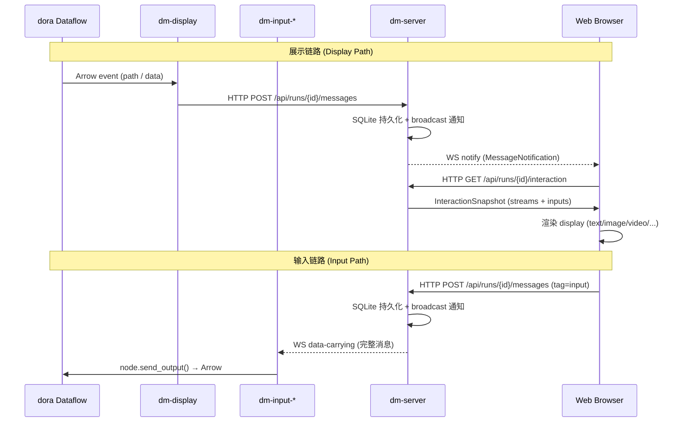
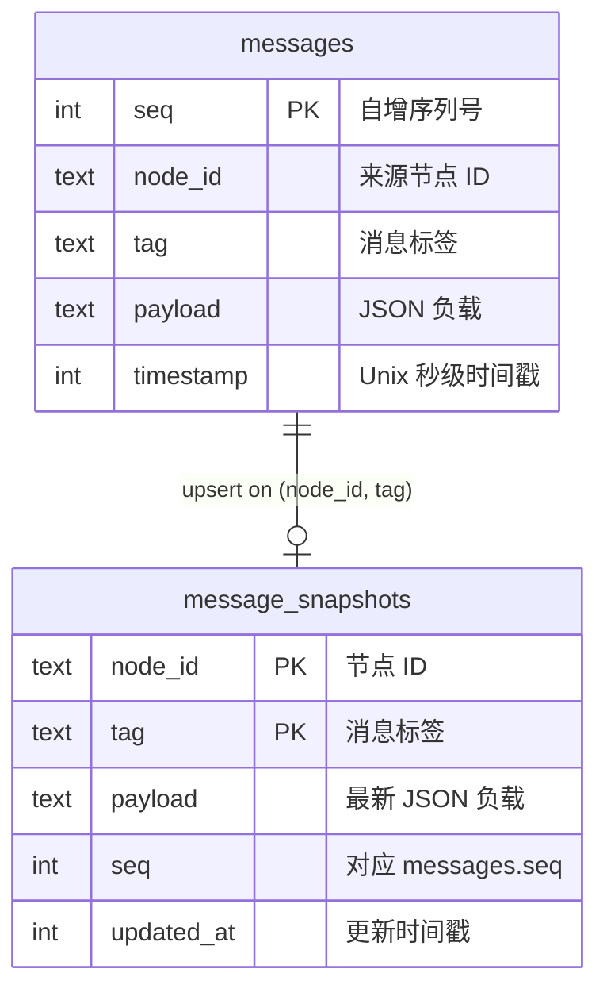

交互系统是 Dora Manager 中人机通信的核心桥梁。它建立了一套 **run-scoped 的消息服务模型**：`dm-display` 将数据流内的内容推送至 `dm-server`，`dm-server` 通过 WebSocket 和 HTTP API 将内容呈现给 Web 前端；反过来，前端用户操作经过 `dm-server` 中继后通过专用下行 WebSocket 传递给各类 `dm-input` 节点，最终以 Arrow 数据形式注入 dora 数据流。整个设计遵循一个核心约束——**dm-server 是唯一中继，所有交互消息必须经过它**。

Sources: [interaction-nodes.md](https://github.com/l1veIn/dora-manager/blob/master/docs/interaction-nodes.md#L1-L37), [run-scoped-interaction-messaging-milestone.md](https://github.com/l1veIn/dora-manager/blob/master/docs/run-scoped-interaction-messaging-milestone.md#L1-L18)

## 架构全景

在理解每个组件之前，先建立全局视野。下面的 Mermaid 图展示了交互系统的完整消息链路——从数据流计算节点，经过 `dm-display` / `dm-input` 节点，通过 `dm-server` 中继，最终到达 Web 浏览器。请注意两个关键特征：**展示侧**（dataflow → display → server → web）和**输入侧**（web → server → input → dataflow）是完全解耦的上下行链路。

> **Mermaid 前置知识**：以下图表使用 `sequenceDiagram` 格式，实线箭头表示同步请求（HTTP），虚线箭头表示异步推送（WebSocket），`participant` 块代表独立进程。



Sources: [interaction-nodes.md](https://github.com/l1veIn/dora-manager/blob/master/docs/interaction-nodes.md#L9-L28), [main.rs](https://github.com/l1veIn/dora-manager/blob/master/crates/dm-server/src/main.rs#L192-L213)

## 核心设计原则

交互系统遵循五项经过迭代验证的架构原则，这些原则直接塑造了节点和 server 之间的契约：

| 原则 | 含义 | 违反后果 |
|------|------|---------|
| **展示侧不碰 Arrow** | dm-display 只接收路径字符串或轻量文本，不做 Arrow 序列化 | 节点承担不必要的序列化负担 |
| **节点不起服务器** | 交互节点是 dm-server 的轻量 HTTP/WS 客户端，不监听端口 | 端口冲突、安全风险 |
| **上下行解耦** | 展示和输入是独立节点，可单独使用也可组合 | 耦合度增加、复用困难 |
| **dm-server 是唯一中继** | 所有人机通信经过 dm-server | 多中继导致状态不一致 |
| **DB 是事实来源** | SQLite 先落库，再暴露给客户端；断线恢复依赖数据库 + HTTP 查询 | 内存态丢失、不可恢复 |

Sources: [run-scoped-interaction-messaging-milestone.md](https://github.com/l1veIn/dora-manager/blob/master/docs/run-scoped-interaction-messaging-milestone.md#L30-L69)

## dm-display：展示型节点

**dm-display** 是交互族中的展示侧节点。它的唯一职责是将数据流中需要人类查看的内容转发给 `dm-server`。它有两种输入端口——`path`（文件路径）和 `data`（内联内容）——分别对应两种不同的展示模式。

### 双端口输入模型

| 端口 | 方向 | 用途 | 典型场景 |
|------|------|------|---------|
| `path` | input | 接收 `runs/:id/out/` 下的文件相对路径 | 图片、音频、视频、日志文件 |
| `data` | input | 接收轻量内联内容 | 文本、JSON、Markdown |

`path` 端口设计为从存储族节点（如 dm-log、dm-save、dm-recorder）的输出接入——dm-display 读取这些节点已持久化的产物路径，然后通过 HTTP 通知 dm-server "有新内容可展示"。`data` 端口则绕过文件系统，直接传递文本内容，适合不需要持久化的轻量展示场景。

Sources: [dm.json](https://github.com/l1veIn/dora-manager/blob/master/nodes/dm-display/dm.json#L33-L59), [README.md](https://github.com/l1veIn/dora-manager/blob/master/nodes/dm-display/README.md#L1-L6)

### 渲染模式自动推断

dm-display 的 `render` 配置项支持 `"auto"` 模式，此时节点根据文件扩展名自动选择渲染方式：

```python
EXT_TO_RENDER = {
    ".log": "text", ".txt": "text",
    ".json": "json", ".md": "markdown",
    ".png": "image", ".jpg": "image", ".jpeg": "image",
    ".wav": "audio", ".mp3": "audio",
    ".mp4": "video",
}
```

对于 `data` 端口，`auto` 模式会根据内容类型推断——`dict`/`list` 解析为 `json`，其他解析为 `text`。开发者也可以通过 `RENDER` 环境变量强制指定渲染模式。

Sources: [main.py](https://github.com/l1veIn/dora-manager/blob/master/nodes/dm-display/dm_display/main.py#L15-L44), [main.py](https://github.com/l1veIn/dora-manager/blob/master/nodes/dm-display/dm_display/main.py#L93-L113)

### 消息发送协议

dm-display 在收到 dora INPUT 事件后，构造统一格式的消息并通过 HTTP POST 发送至 `dm-server`：

```
POST /api/runs/{run_id}/messages
{
  "from": "<node_id>",
  "tag": "<render_mode>",        // text, image, json, markdown, audio, video
  "payload": {
    "label": "<显示标题>",
    "kind": "file" | "inline",
    "file": "<相对路径>",         // kind=file 时存在
    "content": "<内容>"           // kind=inline 时存在
  },
  "timestamp": <unix_seconds>
}
```

关键实现细节：`tag` 字段直接使用了渲染模式名称（如 `"text"`、`"image"`），这让 server 端的 snapshot 查询可以按 tag 过滤不同类型的展示内容。

Sources: [main.py](https://github.com/l1veIn/dora-manager/blob/master/nodes/dm-display/dm_display/main.py#L116-L178)

## dm-input 家族：输入型节点

输入型节点是交互系统的"人→数据流"方向桥梁。它们在启动时向 `dm-server` 注册 widget 描述，然后通过专用 WebSocket 接收用户在 Web 前端的操作，最终以 Arrow 格式注入 dora 数据流。当前内置了四种输入节点：

### 输入节点对照表

| 节点 | Widget 类型 | 输出端口 | 输出 Arrow 类型 | 典型用途 |
|------|------------|---------|----------------|---------|
| **dm-text-input** | `input` / `textarea` | `value` | `utf8` | 文本提示、多行输入 |
| **dm-button** | `button` | `click` | `utf8` | 触发动作、流程控制 |
| **dm-slider** | `slider` | `value` | `float64` | 数值调节、参数控制 |
| **dm-input-switch** | `switch` | `value` | `boolean` | 开关切换、模式选择 |

Sources: [dm.json](https://github.com/l1veIn/dora-manager/blob/master/nodes/dm-text-input/dm.json#L54-L57), [dm.json](https://github.com/l1veIn/dora-manager/blob/master/nodes/dm-button/dm.json#L54-L57), [dm.json](https://github.com/l1veIn/dora-manager/blob/master/nodes/dm-slider/dm.json#L44-L47), [dm.json](https://github.com/l1veIn/dora-manager/blob/master/nodes/dm-input-switch/dm.json#L54-L57)

### 统一的生命周期：注册 → 监听 → 输出

所有输入节点遵循完全相同的生命周期模式，这从它们的代码结构中可以清晰看出：

**阶段一：Widget 注册**。节点启动后立即通过 HTTP POST 向 server 发送 `tag: "widgets"` 的消息，声明自己提供哪些控件：

```python
widgets = {
    "value": {                       # output_id = 输出端口名
        "type": "textarea",          # widget 类型
        "label": "Prompt",           # 显示标签
        "default": "",               # 默认值
        "placeholder": "Type..."     # 占位文本
    }
}
emit(server_url, run_id, node_id, "widgets", {
    "label": label,
    "widgets": widgets,
})
```

**阶段二：WebSocket 长连接监听**。节点连接到 `ws://server/api/runs/{run_id}/messages/ws/{node_id}?since=<seq>`，这是一个 data-carrying WebSocket——server 会先 replay `since` 之后的历史消息，然后持续推送新的 input 事件：

```python
since = 0
while RUNNING:
    ws = websocket.create_connection(
        messages_ws_url(server_url, run_id, node_id, since),
        timeout=2,
    )
    while RUNNING:
        raw = ws.recv()
        message = json.loads(raw)
        on_message(node, widgets, message)
        since = max(since, int(message.get("seq", since)))
```

**阶段三：数据回注**。`on_message` 回调检查消息的 `tag` 是否为 `"input"`，然后通过 `node.send_output()` 将值以 Arrow 格式发送回 dora 数据流。每种节点的 `normalize_output` 函数负责将 JSON 值转换为正确的 Arrow 类型。

Sources: [main.py](https://github.com/l1veIn/dora-manager/blob/master/nodes/dm-text-input/dm_text_input/main.py#L74-L151), [main.py](https://github.com/l1veIn/dora-manager/blob/master/nodes/dm-button/dm_button/main.py#L80-L151), [main.py](https://github.com/l1veIn/dora-manager/blob/master/nodes/dm-slider/dm_slider/main.py#L79-L159)

### 断线重连与 seq 追踪

输入节点的 WebSocket 连接采用 **seq-based 断线恢复** 策略。`since` 变量记录已处理的最大序列号——当连接断开后重新建立，`since` 参数确保 server replay 所有遗漏的消息。这保证即使在网络抖动场景下，用户的输入操作也不会丢失：

```python
since = max(since, int(message.get("seq", since)))
```

每次 WebSocket 重连时，`since` 被传入 URL query 参数，server 端的 `handle_node_ws` 会先从 SQLite 查询并 replay `after_seq: since` 的所有消息。

Sources: [main.py](https://github.com/l1veIn/dora-manager/blob/master/nodes/dm-text-input/dm_text_input/main.py#L56-L61), [messages.rs](https://github.com/l1veIn/dora-manager/blob/master/crates/dm-server/src/handlers/messages.rs#L272-L318)

## dm-server 消息服务

`dm-server` 是交互系统的中枢。它提供 **run-scoped 的消息存储、查询和推送**三大能力。每个 run 维护独立的 SQLite 数据库（`runs/<run_id>/interaction.db`），确保消息隔离。

### 数据库模型



`messages` 表是 append-only 的消息日志，记录每一次交互的完整历史。`message_snapshots` 表以 `(node_id, tag)` 为主键，通过 `ON CONFLICT DO UPDATE` 实现 upsert 语义——总是保存每个节点每个 tag 的最新状态。这种双表设计同时满足了**历史回溯**和**最新状态快照**两个需求。

Sources: [message.rs](https://github.com/l1veIn/dora-manager/blob/master/crates/dm-server/src/services/message.rs#L108-L161)

### HTTP API 路由一览

| 方法 | 路径 | 用途 |
|------|------|------|
| `GET` | `/api/runs/{id}/interaction` | 获取 interaction 快照（streams + inputs） |
| `POST` | `/api/runs/{id}/messages` | 写入消息（display / widgets / input / stream） |
| `GET` | `/api/runs/{id}/messages` | 查询消息历史（支持 after_seq / from / tag / limit 过滤） |
| `GET` | `/api/runs/{id}/messages/snapshots` | 获取所有快照 |
| `GET` | `/api/runs/{id}/streams` | 获取视频流描述符列表 |
| `GET` | `/api/runs/{id}/artifacts/{path}` | 读取 artifact 文件 |
| `GET` (WS) | `/api/runs/{id}/messages/ws` | Web 前端通知 WebSocket |
| `GET` (WS) | `/api/runs/{id}/messages/ws/{node_id}` | 输入节点数据 WebSocket |

Sources: [main.rs](https://github.com/l1veIn/dora-manager/blob/master/crates/dm-server/src/main.rs#L192-L213), [messages.rs](https://github.com/l1veIn/dora-manager/blob/master/crates/dm-server/src/handlers/messages.rs#L40-L97)

### 消息写入与广播

当 `push_message` handler 收到一条消息时，执行三个关键步骤：

1. **normalize_payload** —— 根据 tag 类型规范化负载。`tag=input` 直接透传；`tag=stream` 校验必需字段（path、stream_id、kind）；其他 tag 如果包含 `file` 字段则验证路径安全性（拒绝绝对路径和路径遍历）。
2. **SQLite 写入** —— 在事务中同时写入 `messages`（append）和 `message_snapshots`（upsert）。
3. **broadcast 通知** —— 通过 tokio `broadcast::Sender` 发送 `MessageNotification`，所有订阅的 WebSocket 连接（Web 前端和输入节点）都会收到通知。

Sources: [messages.rs](https://github.com/l1veIn/dora-manager/blob/master/crates/dm-server/src/handlers/messages.rs#L69-L97), [message.rs](https://github.com/l1veIn/dora-manager/blob/master/crates/dm-server/src/services/message.rs#L138-L161), [state.rs](https://github.com/l1veIn/dora-manager/blob/master/crates/dm-server/src/state.rs#L18-L24)

### 两种 WebSocket 的职责分化

dm-server 维护两种性质完全不同的 WebSocket 连路：

**Web Notify WebSocket**（`/api/runs/{id}/messages/ws`）：专为 Web 前端设计，**只发轻量通知**，不承载完整数据。前端收到 `MessageNotification` 后自行调用 HTTP API 拉取最新数据。这是 **notify vs fetch 分离** 原则的具体实现——WS 负责"何时取"，HTTP 负责"取什么"。

**Node Data WebSocket**（`/api/runs/{id}/messages/ws/{node_id}?since=<seq>`）：专为输入节点设计，**承载完整消息数据**。连接建立时先从 SQLite replay 历史消息，然后通过 `broadcast::Receiver` 持续接收新消息。server 端会过滤——只转发 `from == "web"` 且 `tag == "input"` 的消息给输入节点：

```rust
if message.from != "web" && message.tag != "input" {
    continue;
}
```

Sources: [messages.rs](https://github.com/l1veIn/dora-manager/blob/master/crates/dm-server/src/handlers/messages.rs#L242-L360)

## Interaction Snapshot 聚合

`GET /api/runs/{id}/interaction` 端点是前端获取交互状态的主要入口，它返回 `MessageService::interaction_summary()` 的计算结果。这个方法执行以下聚合逻辑：

1. 查询 `message_snapshots` 获取所有最新状态
2. 查询所有 `tag=input` 的消息历史，构建 `current_values` 映射（按 `(target_node_id, output_id)` 索引最新输入值）
3. 遍历 snapshots：
   - `tag=widgets` → 构建 `InteractionBinding`（包含 node_id、label、widgets 描述、current_values）
   - `tag=input` → 跳过（已包含在 binding 的 current_values 中）
   - 其他 tag → 构建 `InteractionStream`（包含 render 类型、file/content、kind）

最终返回 `{ "streams": [...], "inputs": [...] }` 的 JSON 结构。

Sources: [message.rs](https://github.com/l1veIn/dora-manager/blob/master/crates/dm-server/src/services/message.rs#L245-L333)

## 前端消费模型

### Workspace 面板系统

Web 前端通过 **Workspace 面板注册表** 渲染交互内容。每种面板类型在 `panelRegistry` 中注册，定义了数据获取模式、支持的 tag、默认配置和渲染组件：

| 面板类型 | 数据模式 | 默认 tag 过滤 | 渲染组件 | 用途 |
|---------|---------|--------------|---------|------|
| `message` | `history` | `*` (所有) | MessagePanel | 展示消息历史流 |
| `input` | `snapshot` | `widgets` | InputPanel | 渲染输入控件 |
| `chart` | `snapshot` | `chart` | ChartPanel | 图表展示 |
| `video` | `snapshot` | `stream` | VideoPanel | 视频流播放 |
| `terminal` | `external` | (无) | TerminalPanel | 节点日志终端 |

默认 Workspace 布局包含两个面板——左侧 `message` 面板（8 格宽）和右侧 `input` 面板（4 格宽），用户可通过 "Add Panel" 按钮添加更多面板实例。

Sources: [registry.ts](https://github.com/l1veIn/dora-manager/blob/master/web/src/lib/components/workspace/panels/registry.ts#L9-L79), [types.ts](https://github.com/l1veIn/dora-manager/blob/master/web/src/lib/components/workspace/types.ts#L61-L76)

### InputPanel 的控件映射

`InputPanel` 组件根据 widget 的 `type` 字段动态渲染不同的 HTML 控件。完整的控件映射表如下：

| widget.type | HTML 渲染 | 值类型 | 事件触发 |
|------------|----------|-------|---------|
| `input` | `<Input>` | string | `onblur` |
| `textarea` | `<textarea>` | string | `onblur` |
| `button` | `<Button>` | string (label) | `onclick` |
| `slider` | `<input type="range">` | number | `onchange` |
| `switch` | `<input type="checkbox">` | boolean | `onchange` |
| `select` | `<select>` | string | `onchange` |
| `radio` | `<input type="radio">` | string | `onchange` |
| `checkbox` | `<input type="checkbox">` 多选 | string[] | `onchange` |
| `file` | `<input type="file">` | base64 string | `onchange` |

用户操作触发 `handleEmit` 函数，该函数构造标准化的消息格式并发送至 server：

```typescript
await context.emitMessage({
    from: "web",
    tag: "input",
    payload: {
        to: nodeId,          // 目标输入节点 ID
        output_id: outputId, // widget 对应的输出端口
        value: value,        // 用户输入值
    },
});
```

Sources: [InputPanel.svelte](https://github.com/l1veIn/dora-manager/blob/master/web/src/lib/components/workspace/panels/input/InputPanel.svelte#L87-L104), [InteractionPane.svelte](https://github.com/l1veIn/dora-manager/blob/master/web/src/routes/runs/[id]/InteractionPane.svelte#L230-L311)

### MessagePanel 的历史加载策略

`MessagePanel` 使用 `createMessageHistoryState` 管理**双向分页**的消息历史加载：

- **初始加载**：请求最新 50 条消息（`desc: true`），确定是否还有更早的历史
- **向上翻页**：当用户滚动到顶部（`scrollTop < 10`），加载 `before_seq: oldestSeq` 的更早消息
- **增量更新**：当 `refreshToken` 变化（来自 WS 通知），请求 `after_seq: newestSeq` 的新消息

这种设计实现了高效的消息浏览体验——初始只加载最近的消息，按需加载历史，同时保持实时更新。

Sources: [message-state.svelte.ts](https://github.com/l1veIn/dora-manager/blob/master/web/src/lib/components/workspace/panels/message/message-state.svelte.ts#L20-L119)

### WebSocket 连接管理

Run 页面在 `onMount` 时建立两条 WebSocket 连接：

1. **消息通知 WS**：`/api/runs/{id}/messages/ws` —— 收到通知后触发 `fetchSnapshots()` 和 `fetchNewInputValues()`
2. **运行状态 WS**：`/api/runs/{id}/ws` —— 推送日志、指标、状态变化（由 `run_ws.rs` 实现）

消息通知 WS 采用自动重连策略——连接关闭后 1 秒延迟重试，确保网络恢复后能继续接收更新。

Sources: [+page.svelte](https://github.com/l1veIn/dora-manager/blob/master/web/src/routes/runs/[id]/+page.svelte#L344-L392)

## 运行时环境注入

交互节点的正常运行依赖四个由 transpiler 在 Pass 4 自动注入的环境变量。`inject_runtime_env` 函数遍历所有 Managed 节点，向每个节点注入：

| 环境变量 | 值 | 用途 |
|---------|---|------|
| `DM_RUN_ID` | 当前 run 的 UUID | 标识消息所属的 run |
| `DM_NODE_ID` | 节点在 YAML 中的 `id` | 标识消息来源节点 |
| `DM_RUN_OUT_DIR` | `~/.dm/runs/&lt;id&gt;/out` 绝对路径 | dm-display 用于路径相对化 |
| `DM_SERVER_URL` | `http://127.0.0.1:3210` | 节点连接 server 的地址 |

这组环境变量是交互节点与 dm-server 建立通信的基础——没有它们，节点无法知道消息应该发给哪个 run、自己是哪个节点、server 在哪里监听。

Sources: [passes.rs](https://github.com/l1veIn/dora-manager/blob/master/crates/dm-core/src/dataflow/transpile/passes.rs#L422-L449)

## 端到端示例：interaction-demo

`tests/dataflows/interaction-demo.yml` 展示了最简的交互闭环：

```yaml
nodes:
  - id: prompt
    node: dm-text-input
    outputs:
      - value
    config:
      label: "Prompt"
      placeholder: "Type something..."
      multiline: true

  - id: echo
    node: dora-echo
    inputs:
      value: prompt/value
    outputs:
      - value

  - id: display
    node: dm-display
    inputs:
      data: echo/value
    config:
      label: "Echo Output"
      render: text
```

数据流路径：`用户在 Web 输入文本` → `POST /api/runs/{id}/messages (tag=input)` → `dm-server 存储 + 广播` → `dm-text-input 通过 WS 收到消息` → `node.send_output("value", text)` → `dora-echo 转发` → `dm-display 收到 data 端口事件` → `POST /api/runs/{id}/messages (tag=text)` → `dm-server 更新 snapshot` → `Web 前端通过 WS 收到通知` → `渲染展示面板`。

Sources: [interaction-demo.yml](https://github.com/l1veIn/dora-manager/blob/master/tests/dataflows/interaction-demo.yml#L1-L25)

## 扩展自定义输入节点

创建新的输入节点只需遵循以下契约：

1. **dm.json 声明**：在 `interaction` 字段中设置 `"emit": ["widgets"], "on": true`，标记为交互型输入节点
2. **启动注册**：向 `POST /api/runs/{run_id}/messages` 发送 `tag: "widgets"` 消息，payload 包含 `label` 和 `widgets` 字典
3. **WS 监听**：连接 `/api/runs/{run_id}/messages/ws/{node_id}?since=0`，处理 `tag: "input"` 的消息
4. **数据回注**：从消息的 `payload.output_id` 和 `payload.value` 中提取数据，调用 `node.send_output()` 以 Arrow 格式输出

Widget 的 `type` 字段决定了前端渲染方式——如果你需要一种新的控件类型，需要在 [InputPanel.svelte](https://github.com/l1veIn/dora-manager/blob/master/web/src/lib/components/workspace/panels/input/InputPanel.svelte) 中添加对应的渲染分支。

Sources: [dm.json](https://github.com/l1veIn/dora-manager/blob/master/nodes/dm-button/dm.json#L54-L57), [main.py](https://github.com/l1veIn/dora-manager/blob/master/nodes/dm-button/dm_button/main.py#L91-L107)

## 相关阅读

- [内置节点一览：从媒体采集到 AI 推理](19-builtin-nodes) — 了解交互节点在完整节点生态中的定位
- [Port Schema 规范：基于 Arrow 类型系统的端口校验](20-port-schema) — 理解输入节点输出端口的类型约束
- [开发自定义节点：dm.json 完整字段参考](22-custom-node-guide) — 创建新交互节点时的完整字段指南
- [运行工作台：网格布局、面板系统与实时交互](16-runtime-workspace) — 前端 Workspace 的完整使用说明