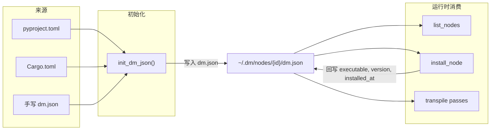

**dm.json** 是 Dora Manager 节点的**单一事实来源**——每个节点目录中必须包含此文件，系统通过它完成节点发现、元数据加载、端口校验、配置注入与安装编排的全部生命周期管理。本文档从 Rust 源码中的类型定义出发，逐字段给出完整语义、默认值策略、序列化规则与真实项目中的使用范例，面向需要编写或迁移自定义节点的进阶开发者。

Sources: [model.rs](https://github.com/l1veIn/dora-manager/blob/master/crates/dm-core/src/node/model.rs#L1-L213), [mod.rs](https://github.com/l1veIn/dora-manager/blob/master/crates/dm-core/src/node/mod.rs#L1-L34)

## dm.json 在系统中的角色

dm.json 不仅仅是一个静态描述文件——它在三个关键阶段被读取和写入：

1. **导入/创建阶段**：`dm node import` 或 `dm node create` 时，`init_dm_json` 函数自动从 `pyproject.toml` / `Cargo.toml` 推断元数据并生成 dm.json。如果 dm.json 已存在，则直接反序列化并更新 `id` 字段。[init.rs](https://github.com/l1veIn/dora-manager/blob/master/crates/dm-core/src/node/init.rs#L21-L112)
2. **安装阶段**：`dm node install` 执行构建命令后，会回写 `executable`、`version`、`installed_at` 字段到 dm.json。[install.rs](https://github.com/l1veIn/dora-manager/blob/master/crates/dm-core/src/node/install.rs#L11-L75)
3. **转译阶段**：数据流 YAML 被转译为 Dora 原生格式时，转译器读取 dm.json 中的 `ports[].schema` 进行端口兼容性校验，读取 `config_schema` 进行环境变量注入。[passes.rs](https://github.com/l1veIn/dora-manager/blob/master/crates/dm-core/src/dataflow/transpile/passes.rs#L160-L260)



Sources: [init.rs](https://github.com/l1veIn/dora-manager/blob/master/crates/dm-core/src/node/init.rs#L21-L112), [install.rs](https://github.com/l1veIn/dora-manager/blob/master/crates/dm-core/src/node/install.rs#L11-L75), [local.rs](https://github.com/l1veIn/dora-manager/blob/master/crates/dm-core/src/node/local.rs#L88-L136), [passes.rs](https://github.com/l1veIn/dora-manager/blob/master/crates/dm-core/src/dataflow/transpile/passes.rs#L186-L260)

## 顶层字段全览

`Node` 结构体是 dm.json 的 Rust 投影。以下表格列出所有字段，其中"必填"基于 `serde` 的默认值策略判定——实际上所有字段都有默认值，一个合法的 dm.json 可以极其精简。

| 字段 | 类型 | 必填 | 默认值 | 语义 |
|------|------|------|--------|------|
| `id` | `string` | ✅ | — | 节点唯一标识符，必须与目录名一致 |
| `name` | `string` | — | `""` | 人类可读的显示名称 |
| `version` | `string` | ✅ | `""` | 语义化版本号 |
| `installed_at` | `string` | ✅ | `""` | Unix 时间戳（秒），安装时自动写入 |
| `source` | `object` | ✅ | — | 构建来源信息，含 `build` 与可选 `github` |
| `description` | `string` | — | `""` | 节点功能的简要描述 |
| `executable` | `string` | — | `""` | 相对于节点目录的可执行文件路径 |
| `repository` | `object?` | — | `null` | 源码仓库元数据 |
| `maintainers` | `array` | — | `[]` | 维护者列表 |
| `license` | `string?` | — | `null` | SPDX 许可证标识符 |
| `display` | `object` | — | `{}` | 展示元数据（分类、标签、头像） |
| `capabilities` | `array` | — | `[]` | 运行时能力声明 |
| `runtime` | `object` | — | `{}` | 运行时语言与平台信息 |
| `ports` | `array` | — | `[]` | 端口声明列表 |
| `files` | `object` | — | `{}` | 节点内文件索引 |
| `examples` | `array` | — | `[]` | 示例条目列表 |
| `config_schema` | `object?` | — | `null` | 配置字段定义 |
| `dynamic_ports` | `bool` | — | `false` | 是否接受 YAML 中声明的未注册端口 |

**关于 `path` 字段**：这是一个**仅运行时字段**，由 `#[serde(skip_deserializing)]` 标注，不会出现在 JSON 文件中。系统加载 dm.json 后通过 `node.with_path(node_dir)` 附加此字段。[model.rs](https://github.com/l1veIn/dora-manager/blob/master/crates/dm-core/src/node/model.rs#L165-L168)

Sources: [model.rs](https://github.com/l1veIn/dora-manager/blob/master/crates/dm-core/src/node/model.rs#L110-L168)

## source — 构建来源

```json
"source": {
  "build": "pip install -e .",
  "github": null
}
```

| 字段 | 类型 | 语义 |
|------|------|------|
| `build` | `string` | 安装命令。系统据此决定安装策略：以 `pip`/`uv` 开头走 Python venv 流程，以 `cargo` 开头走 Rust 编译流程 |
| `github` | `string?` | 可选的 GitHub 仓库 URL，在 `init_dm_json` 中从 `pyproject.toml` 的 `repository` 字段推断 |

**build 命令对安装流程的决定性影响**：安装器通过 `build_type.trim().to_lowercase()` 判断构建类型。`pip install -e .` 和 `uv pip install -e .` 触发本地 Python 安装（创建 `.venv`），`pip install {package}` 触发远程 PyPI 安装，`cargo install --path .` 触发本地 Rust 编译。任何其他值都会导致 "Unsupported build type" 错误。[install.rs](https://github.com/l1veIn/dora-manager/blob/master/crates/dm-core/src/node/install.rs#L29-L61)

**自动推断逻辑**：`init_dm_json` 中的 `infer_build_command` 遵循以下优先级——若存在 `pyproject.toml` 且 `build-backend` 为 `maturin`，生成 `pip install {id}`；若为普通 Python 项目，生成 `pip install -e .`；若存在 `Cargo.toml`，生成 `cargo install {id}`；兜底为 `pip install {id}`。[init.rs](https://github.com/l1veIn/dora-manager/blob/master/crates/dm-core/src/node/init.rs#L228-L248)

Sources: [model.rs](https://github.com/l1veIn/dora-manager/blob/master/crates/dm-core/src/node/model.rs#L6-L10), [install.rs](https://github.com/l1veIn/dora-manager/blob/master/crates/dm-core/src/node/install.rs#L29-L61), [init.rs](https://github.com/l1veIn/dora-manager/blob/master/crates/dm-core/src/node/init.rs#L228-L248)

## repository — 源码仓库

```json
"repository": {
  "url": "https://github.com/user/repo",
  "default_branch": "main",
  "reference": "v1.0.0",
  "subdir": "nodes/my-node"
}
```

| 字段 | 类型 | 默认值 | 语义 |
|------|------|--------|------|
| `url` | `string` | `""` | 仓库 URL |
| `default_branch` | `string?` | `null` | 默认分支名 |
| `reference` | `string?` | `null` | Git 引用（分支名、标签或 commit hash） |
| `subdir` | `string?` | `null` | 仓库内的子目录路径 |

**导入时的 Git 操作**：`import_git` 函数解析 GitHub URL 结构，支持 `https://github.com/{owner}/{repo}/tree/{ref}/{path}` 格式。当存在 `subdir` 时，系统使用 `git sparse-checkout` 仅拉取目标子目录。[import.rs](https://github.com/l1veIn/dora-manager/blob/master/crates/dm-core/src/node/import.rs#L158-L200)

Sources: [model.rs](https://github.com/l1veIn/dora-manager/blob/master/crates/dm-core/src/node/model.rs#L24-L22)

## maintainers — 维护者

```json
"maintainers": [
  { "name": "Dora Manager", "email": "dev@example.com", "url": "https://example.com" }
]
```

| 字段 | 类型 | 默认值 | 语义 |
|------|------|--------|------|
| `name` | `string` | `""` | 维护者姓名（必填，空字符串项在序列化时保留） |
| `email` | `string?` | `null` | 联系邮箱 |
| `url` | `string?` | `null` | 个人主页 |

`init_dm_json` 从 `pyproject.toml` 的 `[project.authors]` 数组推断维护者列表。[init.rs](https://github.com/l1veIn/dora-manager/blob/master/crates/dm-core/src/node/init.rs#L66-L78)

Sources: [model.rs](https://github.com/l1veIn/dora-manager/blob/master/crates/dm-core/src/node/model.rs#L25-L32)

## display — 展示元数据

```json
"display": {
  "category": "Builtin/Logic",
  "tags": ["logic", "bool", "and"],
  "avatar": null
}
```

| 字段 | 类型 | 默认值 | 语义 |
|------|------|--------|------|
| `category` | `string` | `""` | 分类路径（支持 `/` 分隔的层级），CLI 的 `dm node list` 用 `[category]` 格式展示 |
| `tags` | `string[]` | `[]` | 搜索标签 |
| `avatar` | `string?` | `null` | 节点图标路径 |

项目中实际使用的分类包括 `Builtin/Logic`、`Builtin/Interaction`、`Builtin/Media`、`Builtin/Utility`、`Builtin/Storage`、`Audio/Input` 等。

Sources: [model.rs](https://github.com/l1veIn/dora-manager/blob/master/crates/dm-core/src/node/model.rs#L34-L42)

## capabilities — 能力声明

```json
"capabilities": ["configurable", "media"]
```

`capabilities` 是一个字符串数组，系统目前识别以下值：

| 值 | 语义 |
|----|------|
| `"configurable"` | 节点声明了 `config_schema`，支持配置面板 |
| `"media"` | 节点处理媒体流（音频/视频），被运行时用于媒体相关路由 |

迁移脚本 `migrate_dm_json.py` 会根据是否存在 `config_schema` 自动注入 `"configurable"`。[migrate_dm_json.py](https://github.com/l1veIn/dora-manager/blob/master/scripts/migrate_dm_json.py#L127)

Sources: [model.rs](https://github.com/l1veIn/dora-manager/blob/master/crates/dm-core/src/node/model.rs#L143)

## runtime — 运行时信息

```json
"runtime": {
  "language": "python",
  "python": ">=3.10",
  "platforms": []
}
```

| 字段 | 类型 | 默认值 | 语义 |
|------|------|--------|------|
| `language` | `string` | `""` | `"python"`、`"rust"` 或 `"node"` |
| `python` | `string?` | `null` | Python 版本约束（如 `">=3.10"`） |
| `platforms` | `string[]` | `[]` | 支持的平台列表（目前项目中均为空数组） |

**自动推断**：`infer_runtime` 函数按优先级判断——存在 `pyproject.toml` 则为 `"python"`（同时提取 `requires-python`），存在 `Cargo.toml` 则为 `"rust"`，存在 `package.json` 则为 `"node"`。[init.rs](https://github.com/l1veIn/dora-manager/blob/master/crates/dm-core/src/node/init.rs#L269-L289)

Sources: [model.rs](https://github.com/l1veIn/dora-manager/blob/master/crates/dm-core/src/node/model.rs#L72-L79), [init.rs](https://github.com/l1veIn/dora-manager/blob/master/crates/dm-core/src/node/init.rs#L269-L289)

## ports — 端口声明

端口声明是 dm.json 中最结构化的部分，直接参与数据流转译阶段的**端口兼容性校验**。

```json
"ports": [
  {
    "id": "audio",
    "name": "audio",
    "direction": "output",
    "description": "Continuous audio stream (Float32 PCM)",
    "required": true,
    "multiple": false,
    "schema": {
      "title": "PCM Audio Chunk",
      "description": "Float32 PCM audio samples",
      "type": { "name": "floatingpoint", "precision": "SINGLE" }
    }
  }
]
```

| 字段 | 类型 | 默认值 | 语义 |
|------|------|--------|------|
| `id` | `string` | `""` | 端口标识符，必须与 YAML 中 `inputs`/`outputs` 的 key 匹配 |
| `name` | `string` | `""` | 人类可读的端口名称 |
| `direction` | `"input"` \| `"output"` | `"input"` | 数据流方向 |
| `description` | `string` | `""` | 端口用途说明 |
| `required` | `bool` | `true` | 是否为必需端口 |
| `multiple` | `bool` | `false` | 是否接受多条连接 |
| `schema` | `object?` | `null` | 端口数据 schema（详见下节） |

**direction 的序列化格式**：Rust 枚举 `NodePortDirection` 使用 `#[serde(rename_all = "snake_case")]`，因此 JSON 中写作 `"input"` 或 `"output"`。[model.rs](https://github.com/l1veIn/dora-manager/blob/master/crates/dm-core/src/node/model.rs#L44-L50)

**端口在转译中的作用**：当数据流 YAML 连接两个 managed 节点时，转译器会在双方 dm.json 的 `ports` 中查找对应 `id`，若**两端都声明了 `schema`**，则执行 Arrow 类型兼容性校验。若任一方缺少 `schema`，校验被静默跳过。当 `dynamic_ports` 为 `true` 时，未在 `ports` 中声明的端口不会触发警告。[passes.rs](https://github.com/l1veIn/dora-manager/blob/master/crates/dm-core/src/dataflow/transpile/passes.rs#L182-L204)

Sources: [model.rs](https://github.com/l1veIn/dora-manager/blob/master/crates/dm-core/src/node/model.rs#L52-L69), [passes.rs](https://github.com/l1veIn/dora-manager/blob/master/crates/dm-core/src/dataflow/transpile/passes.rs#L182-L204)

### schema — 端口数据类型（Arrow Type System）

端口的 `schema` 字段遵循 **DM Port Schema** 规范，基于 Apache Arrow 类型系统声明数据契约。完整的 Port Schema 结构如下：

```json
{
  "$id": "dm-schema://audio-pcm",
  "title": "PCM Audio Chunk",
  "description": "Float32 PCM audio samples",
  "type": { "name": "floatingpoint", "precision": "SINGLE" },
  "nullable": false,
  "items": { },
  "properties": { },
  "required": [],
  "metadata": {}
}
```

| 字段 | 类型 | 语义 |
|------|------|------|
| `$id` | `string?` | Schema 唯一标识符（URI 格式） |
| `title` | `string?` | 短名称 |
| `description` | `string?` | 详细描述 |
| `type` | `object` | **必填**。Arrow 类型声明，结构因类型而异 |
| `nullable` | `bool` | 默认 `false`，值是否可为 null |
| `items` | `object?` | 列表类型的元素 schema（递归） |
| `properties` | `object?` | struct 类型的子字段（递归 map） |
| `required` | `string[]?` | struct 类型的必填字段名列表 |
| `metadata` | `any?` | 自由格式的附加注解 |

`schema` 也可以使用 `$ref` 引用外部文件：`{ "$ref": "schemas/audio.json" }`。解析器会相对于节点目录加载引用文件。[parse.rs](https://github.com/l1veIn/dora-manager/blob/master/crates/dm-core/src/node/schema/parse.rs#L15-L22)

Sources: [schema/model.rs](https://github.com/l1veIn/dora-manager/blob/master/crates/dm-core/src/node/schema/model.rs#L157-L184), [parse.rs](https://github.com/l1veIn/dora-manager/blob/master/crates/dm-core/src/node/schema/parse.rs#L15-L97)

#### Arrow 类型速查表

`type` 字段的 `name` 决定了类型的解析方式。以下是所有支持的 Arrow 类型及其所需的附加字段：

| type.name | 附加字段 | 示例 | 常见用途 |
|-----------|---------|------|---------|
| `"null"` | 无 | `{"name": "null"}` | 触发信号、心跳 |
| `"bool"` | 无 | `{"name": "bool"}` | 布尔控制 |
| `"int"` | `bitWidth`, `isSigned` | `{"name": "int", "bitWidth": 8, "isSigned": false}` | 图像字节 (uint8)、整数 |
| `"floatingpoint"` | `precision` | `{"name": "floatingpoint", "precision": "SINGLE"}` | PCM 音频 (float32)、数值 |
| `"utf8"` | 无 | `{"name": "utf8"}` | 文本、JSON 编码数据 |
| `"largeutf8"` | 无 | `{"name": "largeutf8"}` | 大文本 |
| `"binary"` | 无 | `{"name": "binary"}` | 二进制数据块 |
| `"largebinary"` | 无 | `{"name": "largebinary"}` | 大二进制数据 |
| `"fixedsizebinary"` | `byteWidth` | `{"name": "fixedsizebinary", "byteWidth": 16}` | 固定长度二进制 |
| `"date"` | `unit` | `{"name": "date", "unit": "DAY"}` | 日期 |
| `"time"` | `unit`, `bitWidth` | `{"name": "time", "unit": "MICROSECOND", "bitWidth": 64}` | 时间 |
| `"timestamp"` | `unit`, `timezone?` | `{"name": "timestamp", "unit": "MICROSECOND", "timezone": "UTC"}` | 时间戳 |
| `"duration"` | `unit` | `{"name": "duration", "unit": "SECOND"}` | 时间段 |
| `"list"` | 无 + `items` | `{"name": "list"}` | 变长列表 |
| `"largelist"` | 无 + `items` | `{"name": "largelist"}` | 大变长列表 |
| `"fixedsizelist"` | `listSize` + `items` | `{"name": "fixedsizelist", "listSize": 1600}` | 固定长度列表（如音频帧） |
| `"struct"` | 无 + `properties` | `{"name": "struct"}` | 结构化记录 |
| `"map"` | `keysSorted` | `{"name": "map", "keysSorted": true}` | 键值映射 |

**precision 枚举值**：`"HALF"`（float16）、`"SINGLE"`（float32）、`"DOUBLE"`（float64）。**unit 枚举值**：`"SECOND"`、`"MILLISECOND"`、`"MICROSECOND"`、`"NANOSECOND"`。[schema/model.rs](https://github.com/l1veIn/dora-manager/blob/master/crates/dm-core/src/node/schema/model.rs#L11-L107)

Sources: [schema/parse.rs](https://github.com/l1veIn/dora-manager/blob/master/crates/dm-core/src/node/schema/parse.rs#L103-L256), [schema/model.rs](https://github.com/l1veIn/dora-manager/blob/master/crates/dm-core/src/node/schema/model.rs#L67-L107)

#### 端口兼容性校验规则

当两个 managed 节点通过数据流连接时，转译器调用 `check_compatibility(output_schema, input_schema)` 执行**子类型**语义检查。核心规则如下：

| 规则 | 说明 |
|------|------|
| 精确匹配 | 同类型始终兼容 |
| 整数安全拓宽 | `int32 → int64` 允许，`int64 → int32` 拒绝，符号必须一致 |
| 浮点安全拓宽 | `float32 → float64` 允许，反向拒绝 |
| utf8 → largeutf8 | 小文本到大文本安全 |
| binary → largebinary | 小二进制到大二进制安全 |
| fixedsizelist → list | 固定列表是变长列表的子类型 |
| struct 字段覆盖 | output struct 必须包含 input struct 的所有 `required` 字段 |

Sources: [schema/compat.rs](https://github.com/l1veIn/dora-manager/blob/master/crates/dm-core/src/node/schema/compat.rs#L91-L195)

## files — 文件索引

```json
"files": {
  "readme": "README.md",
  "entry": "dm_and/main.py",
  "config": "config.json",
  "tests": ["tests", "tests/test_basic.py"],
  "examples": []
}
```

| 字段 | 类型 | 默认值 | 语义 |
|------|------|--------|------|
| `readme` | `string` | `"README.md"` | README 文件相对路径 |
| `entry` | `string?` | `null` | 入口文件路径 |
| `config` | `string?` | `null` | 配置文件路径（config.json / config.toml / config.yaml） |
| `tests` | `string[]` | `[]` | 测试文件或目录列表 |
| `examples` | `string[]` | `[]` | 示例文件或目录列表 |

**入口文件推断**：Python 项目按 `{module}/main.py` → `src/{module}/main.py` → `main.py` 顺序探测；Rust 项目按 `src/main.rs` → `main.rs` 探测；Node 项目检查 `index.js`。配置文件按 `config.json` → `config.toml` → `config.yaml` → `config.yml` 顺序探测。[init.rs](https://github.com/l1veIn/dora-manager/blob/master/crates/dm-core/src/node/init.rs#L291-L336)

Sources: [model.rs](https://github.com/l1veIn/dora-manager/blob/master/crates/dm-core/src/node/model.rs#L82-L93), [init.rs](https://github.com/l1veIn/dora-manager/blob/master/crates/dm-core/src/node/init.rs#L291-L336)

## config_schema — 配置字段定义

`config_schema` 是一个自由格式的 JSON 对象，每个 key 对应一个配置项。这是**声明式配置**系统的核心，转译器在 Pass 3（配置合并阶段）读取此字段，按优先级 `inline_config > config.json 持久化值 > default` 解析后注入到环境变量中。

```json
"config_schema": {
  "sample_rate": {
    "default": 16000,
    "description": "Audio sample rate in Hz",
    "env": "SAMPLE_RATE",
    "x-widget": {
      "type": "select",
      "options": [8000, 16000, 24000, 44100, 48000]
    }
  }
}
```

每个配置项的字段：

| 字段 | 类型 | 语义 |
|------|------|------|
| `default` | `any` | 默认值。不存在时环境变量不会被设置 |
| `description` | `string?` | 配置项的人类可读描述 |
| `env` | `string?` | 映射到的环境变量名。**只有声明了 `env` 的配置项会被注入到运行时环境** |
| `x-widget` | `object?` | 前端 UI 控件提示（详见下节） |

**环境变量注入流程**：转译器遍历 `config_schema` 中每个 key，读取其 `env` 字段作为环境变量名，然后按 inline_config → config.json 持久化 → default 的优先级链查找值，最终写入 `merged_env`。[passes.rs](https://github.com/l1veIn/dora-manager/blob/master/crates/dm-core/src/dataflow/transpile/passes.rs#L370-L416)

Sources: [model.rs](https://github.com/l1veIn/dora-manager/blob/master/crates/dm-core/src/node/model.rs#L158), [passes.rs](https://github.com/l1veIn/dora-manager/blob/master/crates/dm-core/src/dataflow/transpile/passes.rs#L370-L416)

### x-widget — 前端控件提示

`x-widget` 是 `config_schema` 条目中的扩展字段，告诉前端节点详情页应该使用哪种 UI 控件渲染该配置项。前端 `SettingsTab.svelte` 直接读取 `s?.["x-widget"]?.type` 来决定渲染逻辑。

| type 值 | 附加字段 | 渲染为 | 示例 |
|---------|---------|--------|------|
| `"select"` | `options: (string\|number)[]` | 下拉选择框 | `{"type": "select", "options": ["jpeg", "rgb8", "rgba8"]}` |
| `"slider"` | `min`, `max`, `step` | 滑动条 | `{"type": "slider", "min": 0, "max": 100, "step": 1}` |
| `"switch"` | 无 | 开关 | `{"type": "switch"}` |
| `"radio"` | `options` | 单选按钮组 | `{"type": "radio", "options": ["a", "b"]}` |
| `"checkbox"` | `options` | 多选复选框 | `{"type": "checkbox", "options": ["x", "y"]}` |
| `"file"` | 无 | 文件选择器 | `{"type": "file"}` |
| `"directory"` | 无 | 目录选择器 | `{"type": "directory"}` |

未声明 `x-widget` 时，前端根据值的类型自动推断：字符串渲染为文本输入框，数字渲染为数字输入框，布尔值渲染为开关。

Sources: [SettingsTab.svelte](https://github.com/l1veIn/dora-manager/blob/master/web/src/routes/nodes/[id]/components/SettingsTab.svelte#L73-L182), [InspectorConfig.svelte](https://github.com/l1veIn/dora-manager/blob/master/web/src/routes/dataflows/[id]/components/graph/InspectorConfig.svelte#L169)

## dynamic_ports — 动态端口开关

```json
"dynamic_ports": false
```

当设为 `true` 时，数据流转译器**跳过** YAML 中声明的、但未在 `ports` 数组中注册的端口的校验。这对于需要根据用户配置动态创建端口的节点（如通用的数据转发节点）至关重要。默认 `false` 意味着所有在 YAML 中使用的端口都应该在 `ports` 中有对应声明。

Sources: [model.rs](https://github.com/l1veIn/dora-manager/blob/master/crates/dm-core/src/node/model.rs#L159-L163), [passes.rs](https://github.com/l1veIn/dora-manager/blob/master/crates/dm-core/src/dataflow/transpile/passes.rs#L186-L192)

## 完整 dm.json 示例

以下是一个功能完备的 dm.json，展示了所有字段的实际用法：

```json
{
  "id": "dm-microphone",
  "name": "dm-microphone",
  "version": "0.1.0",
  "installed_at": "1773318598",
  "source": {
    "build": "pip install -e .",
    "github": null
  },
  "description": "Microphone input with device selection. Publishes available devices for dynamic widget binding.",
  "executable": ".venv/bin/dm-microphone",
  "maintainers": [
    { "name": "Dora Manager" }
  ],
  "display": {
    "category": "Audio/Input",
    "tags": ["audio", "microphone", "input"]
  },
  "capabilities": ["configurable", "media"],
  "runtime": {
    "language": "python",
    "python": ">=3.10",
    "platforms": []
  },
  "ports": [
    {
      "id": "audio",
      "name": "audio",
      "direction": "output",
      "description": "Continuous audio stream (Float32 PCM)",
      "required": true,
      "multiple": false,
      "schema": {
        "title": "PCM Audio Chunk",
        "description": "Float32 PCM audio samples",
        "type": { "name": "floatingpoint", "precision": "SINGLE" }
      }
    },
    {
      "id": "device_id",
      "name": "device_id",
      "direction": "input",
      "description": "Select microphone by device ID",
      "required": false,
      "multiple": false,
      "schema": { "type": { "name": "utf8" } }
    }
  ],
  "files": {
    "readme": "README.md",
    "entry": "dm_microphone/main.py",
    "tests": [],
    "examples": []
  },
  "examples": [],
  "config_schema": {
    "sample_rate": {
      "default": 16000,
      "env": "SAMPLE_RATE",
      "x-widget": {
        "type": "select",
        "options": [8000, 16000, 24000, 44100, 48000]
      }
    },
    "max_duration": {
      "default": 0.1,
      "description": "Buffer duration in seconds before sending audio chunk",
      "env": "MAX_DURATION"
    }
  },
  "dynamic_ports": false
}
```

Sources: [dm-microphone/dm.json](https://github.com/l1veIn/dora-manager/blob/master/nodes/dm-microphone/dm.json)

## 最小 dm.json 模板

对于刚起步的节点，以下模板涵盖了必要字段，其余均可依赖默认值：

```json
{
  "id": "my-node",
  "version": "0.1.0",
  "installed_at": "",
  "source": {
    "build": "pip install -e ."
  },
  "description": "A brief description of what this node does.",
  "ports": [
    {
      "id": "input",
      "name": "input",
      "direction": "input",
      "description": "Input data",
      "required": true,
      "multiple": false,
      "schema": { "type": { "name": "utf8" } }
    },
    {
      "id": "output",
      "name": "output",
      "direction": "output",
      "description": "Processed result",
      "required": true,
      "multiple": false,
      "schema": { "type": { "name": "utf8" } }
    }
  ]
}
```

实际上，通过 `dm node create my-node "描述"` 命令创建节点时，`init_dm_json` 会自动生成完整的 dm.json，包含从 `pyproject.toml` 推断的所有元数据。[init.rs](https://github.com/l1veIn/dora-manager/blob/master/crates/dm-core/src/node/init.rs#L21-L112), [local.rs](https://github.com/l1veIn/dora-manager/blob/master/crates/dm-core/src/node/local.rs#L13-L86)

## 字段自动推断规则汇总

`init_dm_json` 的核心设计哲学是**零配置优先**——开发者无需手写 dm.json 中的大部分字段，系统会从标准项目文件中自动推断。以下是完整的推断链：

| dm.json 字段 | 推断来源 | 优先级 |
|-------------|---------|--------|
| `id` | 目录名 | 固定 |
| `name` | `pyproject.toml` `[project.name]` / `Cargo.toml` `[package.name]` / 目录名 | pyproject > cargo > fallback |
| `version` | `pyproject.toml` `[project.version]` / `Cargo.toml` `[package.version]` | pyproject > cargo > fallback |
| `description` | CLI 参数 `--description` / `pyproject.toml` `[project.description]` / `Cargo.toml` `[package.description]` | hints > pyproject > cargo |
| `source.build` | 按 `build-backend` / 文件类型推断 | 详见 `infer_build_command` |
| `repository` | `pyproject.toml` `[project.urls.Repository]` | 仅 pyproject |
| `maintainers` | `pyproject.toml` `[project.authors]` | 仅 pyproject |
| `license` | `pyproject.toml` `[project.license]` / `Cargo.toml` `[package.license]` | pyproject > cargo |
| `runtime.language` | 文件存在性探测：pyproject.toml → python, Cargo.toml → rust, package.json → node | 按优先级 |
| `runtime.python` | `pyproject.toml` `[project.requires-python]` | 仅 pyproject |
| `files.readme` | 文件探测 `README.md` | 默认 `"README.md"` |
| `files.entry` | 路径探测（详见 `infer_files`） | Python/Rust/Node 各有候选列表 |
| `files.config` | 文件探测 `config.json` → `config.toml` → `config.yaml` → `config.yml` | 按顺序 |
| `files.tests` | 目录中含 `test`/`tests` 的文件和目录 | 自动收集 |
| `files.examples` | 目录中含 `example`/`examples`/`demo` 的文件和目录 | 自动收集 |

Sources: [init.rs](https://github.com/l1veIn/dora-manager/blob/master/crates/dm-core/src/node/init.rs#L21-L361)

## 常见陷阱与最佳实践

**1. `id` 必须匹配目录名**：`init_dm_json` 在加载已有 dm.json 时会强制覆盖 `id` 为目录名。[init.rs](https://github.com/l1veIn/dora-manager/blob/master/crates/dm-core/src/node/init.rs#L32)

**2. `source.build` 决定安装路径**：写错 build 命令会导致安装失败。Python 节点必须以 `pip` 或 `uv` 开头，Rust 节点必须以 `cargo` 开头。[install.rs](https://github.com/l1veIn/dora-manager/blob/master/crates/dm-core/src/node/install.rs#L29-L61)

**3. `config_schema` 中只有声明了 `env` 的条目会被注入**：如果你希望配置项在运行时可用，务必提供 `env` 字段名，否则转译器会跳过该条目。[passes.rs](https://github.com/l1veIn/dora-manager/blob/master/crates/dm-core/src/dataflow/transpile/passes.rs#L390-L393)

**4. 端口 schema 缺失不会报错但会跳过校验**：转译器在端口两端都声明了 schema 时才执行兼容性检查。如果你的节点需要类型安全，务必为每个端口提供 `schema`。[passes.rs](https://github.com/l1veIn/dora-manager/blob/master/crates/dm-core/src/dataflow/transpile/passes.rs#L198-L204)

**5. `executable` 在安装后被回写**：Python 节点变为 `.venv/bin/{id}`（macOS/Linux）或 `.venv/Scripts/{id}.exe`（Windows），Rust 节点变为 `bin/dora-{id}` 或 `bin/{id}`（若 id 已以 `dora-` 开头）。[install.rs](https://github.com/l1veIn/dora-manager/blob/master/crates/dm-core/src/node/install.rs#L39-L58)

**6. `interaction` 字段是透传字段**：部分内置交互节点（如 dm-slider、dm-text-input）在 dm.json 中包含 `interaction` 字段，但该字段不在 Rust `Node` 结构体中——serde 反序列化时会静默忽略。此字段可能被前端或其他工具链直接读取原始 JSON 使用。

Sources: [init.rs](https://github.com/l1veIn/dora-manager/blob/master/crates/dm-core/src/node/init.rs#L32), [install.rs](https://github.com/l1veIn/dora-manager/blob/master/crates/dm-core/src/node/install.rs#L29-L58), [passes.rs](https://github.com/l1veIn/dora-manager/blob/master/crates/dm-core/src/dataflow/transpile/passes.rs#L198-L204)

---

**下一步阅读**：若需深入了解端口类型校验的数学基础与兼容性算法，请参阅 [Port Schema 规范：基于 Arrow 类型系统的端口校验](20-port-schema)；若需了解 dm.json 如何参与数据流转译的完整多 Pass 管线，请参阅 [数据流转译器：多 Pass 管线与四层配置合并](08-transpiler)；若需浏览已有节点的 dm.json 实例，请参阅 [内置节点一览：从媒体采集到 AI 推理](19-builtin-nodes)。