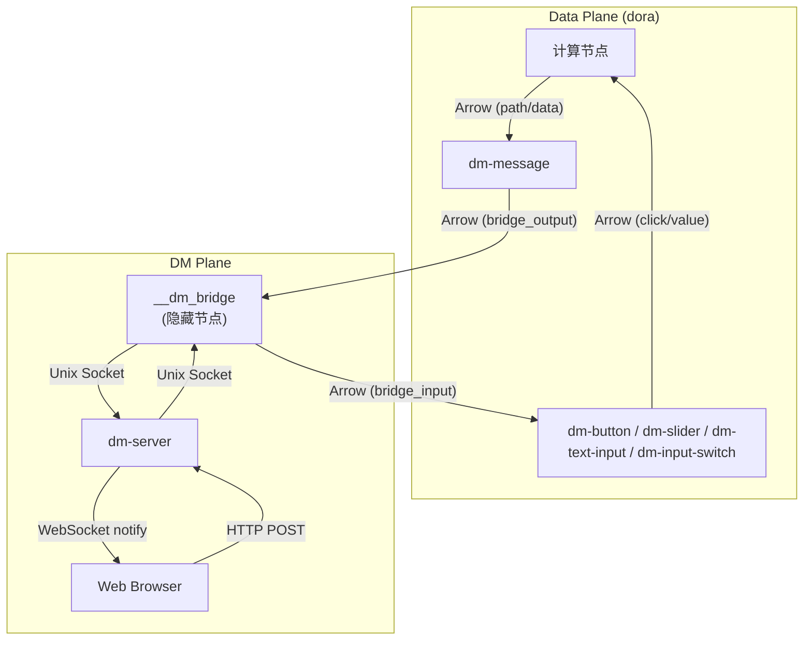
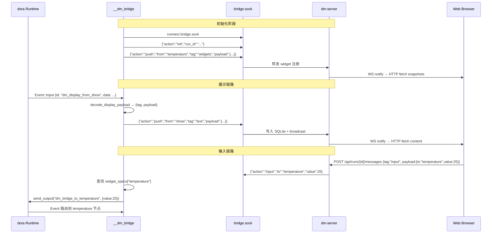

交互系统是 Dora Manager 中连接人类与数据流的桥梁层。它的核心架构决策是引入一个**隐藏的 Bridge 节点**——由 transpiler 在编译时自动注入——将所有 DM-plane 通信（展示推送、用户输入回注）汇聚到一个通过 Unix domain socket 与 dm-server 通信的单一进程。这一设计使得交互节点本身无需任何网络代码，仅需使用标准 dora Arrow 端口即可完成全部人机通信。本文将从**双平面模型**出发，深入解析 capability 声明如何驱动 transpiler 注入 Bridge、节点如何通过 Arrow 端口与 Bridge 交互、以及 dm-server 如何通过 Unix socket 完成消息中继。

Sources: [bridge.rs](https://github.com/l1veIn/dora-manager/blob/main/crates/dm-core/src/dataflow/transpile/bridge.rs#L1-L27), [passes.rs](https://github.com/l1veIn/dora-manager/blob/main/crates/dm-core/src/dataflow/transpile/passes.rs#L442-L564), [bridge.rs](https://github.com/l1veIn/dora-manager/blob/main/crates/dm-cli/src/bridge.rs#L1-L80)

## 双平面模型：Data Plane 与 DM Plane

交互系统的架构基础是一个明确的双平面分离。**Data Plane** 是 dora 运行时提供的标准 Arrow 流通信——节点之间通过 `inputs` / `outputs` 端口传递结构化数据。**DM Plane** 是 Dora Manager 新增的交互层——负责将 data-plane 数据桥接到 Web 前端，或将用户操作回注到 data-plane。

这两个平面在节点的 `dm.json` 中通过 `capabilities` 字段声明交汇点。例如 `dm-message` 的 capability 声明了 `display` 族，其中 `port: "data"` 表示 data-plane 的 `data` 输入端口同时是 DM-plane 的内联展示源。这种绑定关系不是运行时协商的——它在 transpile 阶段被静态解析并转化为具体的连接拓扑。



这个架构图揭示了关键洞察：**交互节点没有任何网络栈**。dm-message 只通过标准 dora 输出端口发送 JSON 字符串，dm-button 只通过标准 dora 输入端口接收 JSON 字符串。所有与 dm-server 的通信（HTTP、WebSocket、Unix socket）都集中在 `__dm_bridge` 一个进程里完成。

Sources: [dm.json](https://github.com/l1veIn/dora-manager/blob/main/nodes/dm-message/dm.json#L41-L75), [dm.json](https://github.com/l1veIn/dora-manager/blob/main/nodes/dm-button/dm.json#L37-L55), [bridge.rs](https://github.com/l1veIn/dora-manager/blob/main/crates/dm-cli/src/bridge.rs#L78-L200)

## dm-message：展示型节点的工作原理

**dm-message** 是交互族的展示侧节点，负责将 data-plane 中需要人类查看的内容转发到 DM-plane。它有两个标准 dora 输入端口——`path`（文件路径）和 `data`（内联内容）——以及一个由 transpiler 注入的隐藏输出端口 `dm_bridge_output_internal`。

### 双端口输入与统一 Bridge 输出

dm-message 的工作流极为简洁：接收 dora INPUT 事件，构造一个 `{tag, payload}` 格式的 JSON 消息，通过 bridge 输出端口发送出去。具体而言，当 `path` 端口收到文件路径时，payload 包含 `{kind: "file", file: "<相对路径>"}`；当 `data` 端口收到内联内容时，payload 包含 `{kind: "inline", content: "<内容>"}`。`tag` 字段始终使用渲染模式名称（如 `"text"`、`"image"`、`"json"`）。

核心发送函数 `emit_bridge` 只有四行代码：

```python
def emit_bridge(node: Node, output_port: str, tag: str, payload: dict):
    node.send_output(
        output_port,
        pa.array([json.dumps({"tag": tag, "payload": payload}, ensure_ascii=False)]),
    )
```

输出端口名称从 `DM_BRIDGE_OUTPUT_PORT` 环境变量读取，默认值为 `dm_bridge_output_internal`——这个端口在 YAML 中不存在，完全由 transpiler 在 `inject_dm_bridge` pass 中动态注入。

Sources: [main.py](https://github.com/l1veIn/dora-manager/blob/main/nodes/dm-message/dm_display/main.py#L116-L121), [main.py](https://github.com/l1veIn/dora-manager/blob/main/nodes/dm-message/dm_display/main.py#L143-L172)

### 渲染模式自动推断

dm-message 的 `render` 配置项支持 `"auto"` 模式，此时根据输入来源自动选择渲染方式。对于 `path` 输入，通过文件扩展名映射（`.log` → `text`、`.json` → `json`、`.png` → `image` 等）；对于 `data` 输入，根据 Python 值类型推断（`dict`/`list` → `json`，其他 → `text`）。开发者也可通过 `RENDER` 环境变量强制指定。

Sources: [main.py](https://github.com/l1veIn/dora-manager/blob/main/nodes/dm-message/dm_display/main.py#L15-L29), [main.py](https://github.com/l1veIn/dora-manager/blob/main/nodes/dm-message/dm_display/main.py#L87-L113)

## dm-input 家族：输入型节点的工作原理

输入型节点是交互系统的"人→数据流"方向桥梁。当前内置四种，它们遵循完全相同的工作模式：**在隐藏的 bridge 输入端口上监听 JSON 消息，解析后通过标准 dora 输出端口发送 Arrow 数据**。

### 输入节点对照表

| 节点 | dm.json 声明的 Capability | 输出端口 | 输出 Arrow 类型 | 典型用途 |
|------|--------------------------|---------|----------------|---------|
| **dm-text-input** | `widget_input` | `value` | `utf8` | 文本提示、多行输入 |
| **dm-button** | `widget_input` | `click` | `utf8` | 触发动作、流程控制 |
| **dm-slider** | `widget_input` | `value` | `float64` | 数值调节、参数控制 |
| **dm-input-switch** | `widget_input` | `value` | `boolean` | 开关切换、模式选择 |

Sources: [dm.json](https://github.com/l1veIn/dora-manager/blob/main/nodes/dm-text-input/dm.json#L37-L55), [dm.json](https://github.com/l1veIn/dora-manager/blob/main/nodes/dm-button/dm.json#L37-L55), [dm.json](https://github.com/l1veIn/dora-manager/blob/main/nodes/dm-slider/dm.json#L37-L56), [dm.json](https://github.com/l1veIn/dora-manager/blob/main/nodes/dm-input-switch/dm.json#L37-L56)

### 统一的消息接收模式

所有输入节点的核心逻辑完全一致——从 `DM_BRIDGE_INPUT_PORT` 环境变量指定的端口读取 JSON 消息，提取 `value` 字段，类型转换后发送到语义输出端口。以 dm-button 为例：

```python
bridge_input_port = env_str("DM_BRIDGE_INPUT_PORT", "dm_bridge_input_internal")
node = Node()

for event in node:
    if event["type"] != "INPUT" or event["id"] != bridge_input_port:
        continue
    payload = decode_bridge_payload(event["value"])
    if payload is None:
        continue
    node.send_output("click", normalize_output(payload.get("value")))
```

每个节点的差异仅在 `normalize_output` 函数中——dm-slider 将值转换为 `float64`，dm-input-switch 转换为 `boolean`，dm-text-input 和 dm-button 保持为 `utf8` 字符串。这种模式意味着**添加新的输入节点类型只需实现两个函数**：`decode_bridge_payload`（解析 JSON）和 `normalize_output`（类型转换）。

Sources: [main.py](https://github.com/l1veIn/dora-manager/blob/main/nodes/dm-button/dm_button/main.py#L54-L81), [main.py](https://github.com/l1veIn/dora-manager/blob/main/nodes/dm-slider/dm_slider/main.py#L53-L80), [main.py](https://github.com/l1veIn/dora-manager/blob/main/nodes/dm-input-switch/dm_input_switch/main.py#L55-L77), [main.py](https://github.com/l1veIn/dora-manager/blob/main/nodes/dm-text-input/dm_text_input/main.py#L77-L104)

## Bridge 节点注入：Transpiler 的核心魔法

Bridge 注入是整个交互系统中最关键的架构决策。它通过 transpiler 的 Pass 4.5（`inject_dm_bridge`）在编译时自动完成，对 YAML 作者完全透明。

### Capability 驱动的自动发现

注入过程的第一步是**capability 扫描**。`build_bridge_node_spec` 函数读取每个 managed 节点的 `dm.json`，检查其 `capabilities` 字段中是否包含 `display` 或 `widget_input` 族。关键逻辑如下：

```rust
let bindings = meta
    .capability_bindings()
    .into_iter()
    .filter_map(|(family, binding)| match family.as_str() {
        "widget_input" | "display" => Some(HiddenBridgeBindingSpec { ... }),
        _ => None,
    })
    .collect::<Vec<_>>();
```

只有声明了这两种 capability 的节点才会参与 bridge 拓扑生成。其他节点（如 dora-echo、dm-log 等纯计算或存储节点）完全不受影响。这意味着 **dm-core 不包含任何节点 ID 的硬编码**——bridge 注入完全由 capability 元数据驱动。

Sources: [bridge.rs](https://github.com/l1veIn/dora-manager/blob/main/crates/dm-core/src/dataflow/transpile/bridge.rs#L68-L102), [model.rs](https://github.com/l1veIn/dora-manager/blob/main/crates/dm-core/src/node/model.rs#L333-L345)

### 隐藏端口的动态注入

扫描完成后，`inject_dm_bridge` 函数为每个交互节点动态注入隐藏端口和环境变量。这个过程分为两个方向：

**Widget Input 方向**（dm-button、dm-slider 等）——transpiler 做三件事：
1. 向节点的 `inputs` 映射中添加 `dm_bridge_input_internal: __dm_bridge/<bridge_output_port>` 连接
2. 注入 `DM_BRIDGE_INPUT_PORT` 环境变量，值固定为 `dm_bridge_input_internal`
3. 记录该节点的 `bridge_output_port`（格式为 `dm_bridge_to_<yaml_id>`），供 bridge 节点使用

**Display 方向**（dm-message）——transpiler 同样做三件事：
1. 向节点的 `outputs` 列表中添加 `dm_bridge_output_internal`
2. 注入 `DM_BRIDGE_OUTPUT_PORT` 环境变量
3. 记录该节点的 `bridge_input_port`（格式为 `dm_display_from_<yaml_id>`），供 bridge 节点使用

Sources: [passes.rs](https://github.com/l1veIn/dora-manager/blob/main/crates/dm-core/src/dataflow/transpile/passes.rs#L462-L530), [bridge.rs](https://github.com/l1veIn/dora-manager/blob/main/crates/dm-core/src/dataflow/transpile/bridge.rs#L142-L170)

### `__dm_bridge` 隐藏节点的生成

当所有交互节点的 spec 收集完毕后，transpiler 向数据流图中追加一个隐藏的 managed 节点，其 YAML ID 为 `__dm_bridge`：

```rust
graph.nodes.push(DmNode::Managed(ManagedNode {
    yaml_id: HIDDEN_DM_BRIDGE_YAML_ID.to_string(),  // "__dm_bridge"
    node_id: "dm".to_string(),                        // 使用 dm CLI 作为可执行文件
    resolved_path: bridge_path,                       // 指向 dm CLI 二进制
    merged_env: env,                                  // 包含 DM_CAPABILITIES_JSON
    extra_fields: bridge_extra,                       // 包含所有 inputs/outputs 连接
}));
```

这个节点的 `resolved_path` 指向 dm CLI 可执行文件，`args` 设为 `bridge --run-id <id>`，最关键的环境变量 `DM_CAPABILITIES_JSON` 包含所有交互节点的序列化 spec——它是 bridge 进程运行时构建路由表的唯一数据源。bridge 的 `inputs` 映射将所有 display 节点的 `dm_bridge_output_internal` 输出汇聚到自身的 `dm_display_from_*` 端口；bridge 的 `outputs` 列表包含所有 `dm_bridge_to_*` 端口，分别连向对应的输入节点。

Sources: [passes.rs](https://github.com/l1veIn/dora-manager/blob/main/crates/dm-core/src/dataflow/transpile/passes.rs#L530-L564), [bridge.rs](https://github.com/l1veIn/dora-manager/blob/main/crates/dm-core/src/dataflow/transpile/bridge.rs#L25-L27)

### 注入示例：从 YAML 到编译后的拓扑

以 `demos/demo-interactive-widgets.yml` 中的一个 slider+display 子图为例，展示注入前后的拓扑变化：

**原始 YAML（用户编写的）**：
```yaml
- id: temperature
  node: dm-slider
  outputs: [value]
  config:
    label: "Temperature (°C)"
    min_val: -20
    max_val: 50
```

**Transpiler 注入后（等效展开）**：
```yaml
- id: temperature
  path: /path/to/dm-slider/.venv/bin/dm-slider
  outputs: [value]
  inputs:
    dm_bridge_input_internal: __dm_bridge/dm_bridge_to_temperature
  env:
    DM_BRIDGE_INPUT_PORT: "dm_bridge_input_internal"
    LABEL: "Temperature (°C)"
    MIN_VAL: "-20"
    MAX_VAL: "50"
    # ... 其他环境变量

- id: __dm_bridge
  path: /path/to/dm
  args: "bridge --run-id <uuid>"
  outputs:
    - dm_bridge_to_temperature
    # ... 其他 widget 节点的输出端口
  inputs:
    # ... display 节点的 bridge 输出
  env:
    DM_CAPABILITIES_JSON: '[{"yaml_id":"temperature","node_id":"dm-slider",...}]'
    DM_RUN_ID: "<uuid>"
```

用户完全看不到 `__dm_bridge` 节点的存在——它在 `dm start` 时的 transpile 阶段自动注入，在 `dm stop` 时随数据流一起销毁。

Sources: [demo-interactive-widgets.yml](demos/demo-interactive-widgets.yml#L1-L129), [passes.rs](https://github.com/l1veIn/dora-manager/blob/main/crates/dm-core/src/dataflow/transpile/passes.rs#L442-L564)

## Bridge 进程运行时：Unix Socket 双向中继

`__dm_bridge` 节点在运行时启动 `dm bridge --run-id <id>` 子命令，执行 `bridge_serve` 函数。这是一个双角色进程——它既是 dora 数据流中的一个普通节点（通过 `DoraNode::init_from_env()` 初始化），又是 dm-server 的 Unix socket 客户端。

### 路由表构建

Bridge 进程启动后，首先从 `DM_CAPABILITIES_JSON` 环境变量解析出所有 spec，构建两张路由表：

| 路由表 | 键 | 用途 |
|--------|---|------|
| `widget_specs` | yaml_id → (output_port, widget_payload) | 输入方向：确定用户输入应通过哪个 dora 输出端口发送给哪个节点 |
| `display_ports` | dora input port → BridgeSpec | 展示方向：确定收到的 dora 事件来自哪个 display 节点 |

Sources: [bridge.rs](https://github.com/l1veIn/dora-manager/blob/main/crates/dm-cli/src/bridge.rs#L82-L112)

### Widget 注册与 Socket 连接

路由表构建后，bridge 通过 Unix domain socket（`~/.dm/bridge.sock`）连接到 dm-server。连接建立后发送两条消息：

1. **Init 消息**：`{"action":"init","run_id":"<uuid>"}` —— 声明自己是哪个 run 的 bridge
2. **Widget 注册**：对每个 widget_input 节点，发送 `{"action":"push","from":"<yaml_id>","tag":"widgets","payload":{...}}` —— widget 描述由 `widget_payload()` 函数根据节点类型（dm-text-input → textarea、dm-button → button、dm-slider → slider、dm-input-switch → switch）动态生成

Sources: [bridge.rs](https://github.com/l1veIn/dora-manager/blob/main/crates/dm-cli/src/bridge.rs#L113-L138), [bridge.rs](https://github.com/l1veIn/dora-manager/blob/main/crates/dm-cli/src/bridge.rs#L236-L282)

### 统一 FIFO 任务队列

Bridge 进程采用 **统一任务队列** 模式处理两个异步事件源——dora 数据流事件和 Unix socket 消息。两个 producer（一个 dora 事件的同步线程、一个 socket 读取的 async task）将任务推入同一个 `mpsc::channel`，由唯一的 consumer 按 FIFO 顺序处理：



Sources: [bridge.rs](https://github.com/l1veIn/dora-manager/blob/main/crates/dm-cli/src/bridge.rs#L139-L200), [bridge.rs](https://github.com/l1veIn/dora-manager/blob/main/crates/dm-cli/src/bridge.rs#L284-L356)

### 展示方向：从 dora 事件到 Server 消息

当 bridge 从 dora 收到 `Event::Input` 时，它检查 `id` 是否在 `display_ports` 路由表中。如果匹配，解码 Arrow 数据中的 JSON 字符串（格式为 `{tag, payload}`），构造 `{"action":"push","from":"<yaml_id>","tag":"<render_mode>","payload":<display_payload>}` 消息写入 Unix socket。dm-server 的 `bridge_socket_loop` 收到后调用 `MessageService::push()` 存入 SQLite 并广播通知给 Web 前端。

Sources: [bridge.rs](https://github.com/l1veIn/dora-manager/blob/main/crates/dm-cli/src/bridge.rs#L155-L174), [bridge_socket.rs](https://github.com/l1veIn/dora-manager/blob/main/crates/dm-server/src/handlers/bridge_socket.rs#L138-L169)

### 输入方向：从 Server 消息到 dora 输出

当 bridge 从 Unix socket 收到输入通知（`{"action":"input","to":"<yaml_id>","value":<val>}`）时，它查找 `widget_specs` 路由表获取对应的 dora 输出端口名，然后调用 `send_json_command` 将值转换为合适的 Arrow 类型并通过 `node.send_output()` 发送。`send_json_command` 根据 JSON 值类型选择 Arrow 数组类型：`bool` → `BooleanArray`、整数 → `Int64Array`、浮点 → `Float64Array`、字符串 → `StringArray`。

Sources: [bridge.rs](https://github.com/l1veIn/dora-manager/blob/main/crates/dm-cli/src/bridge.rs#L176-L193), [bridge.rs](https://github.com/l1veIn/dora-manager/blob/main/crates/dm-cli/src/bridge.rs#L298-L356)

## dm-server 的 Bridge Socket 端点

dm-server 在启动时创建 `~/.dm/bridge.sock` Unix domain socket，并在后台运行 `bridge_socket_loop`。这个循环为每个连接执行以下生命周期：

1. **读取 init 消息** —— 提取 `run_id`，绑定连接到特定 run
2. **进入 select 循环** —— 同时监听两个方向：
   - **Socket 读取**：解析 `push` 消息，调用 `MessageService::push()` 持久化并广播
   - **Broadcast 接收**：过滤出 `tag == "input"` 的通知，查询完整消息后回写给 bridge

Server 端的关键设计是 **push 消息的幂等持久化**——每条消息写入 `messages` 表（append-only）的同时，通过 `ON CONFLICT DO UPDATE` 语义更新 `message_snapshots` 表，确保每个 `(node_id, tag)` 组合总是保存最新状态。这种双表设计同时支持历史回溯和快速快照查询。

Sources: [bridge_socket.rs](https://github.com/l1veIn/dora-manager/blob/main/crates/dm-server/src/handlers/bridge_socket.rs#L1-L174), [main.rs](https://github.com/l1veIn/dora-manager/blob/main/crates/dm-server/src/main.rs#L246-L262), [message.rs](https://github.com/l1veIn/dora-manager/blob/main/crates/dm-server/src/services/message.rs#L138-L161)

## Transpile 管线中的位置

Bridge 注入在整个 transpile 管线中的位置至关重要。完整的 7 步管线如下：

| Pass | 名称 | 与交互系统的关系 |
|------|------|---------------|
| 1 | `parse` | 将节点分类为 Managed / External |
| 1.5 | `validate_reserved` | 空——dm-core 不硬编码任何节点 ID |
| 2 | `resolve_paths` | 解析 dm.json，获取 capability 元数据 |
| 2.5 | `validate_port_schemas` | 校验用户声明的端口连接类型兼容性 |
| 3 | `merge_config` | 四层配置合并，生成 LABEL / RENDER 等环境变量 |
| 4 | `inject_runtime_env` | 注入 DM_RUN_ID / DM_NODE_ID / DM_RUN_OUT_DIR |
| **4.5** | **`inject_dm_bridge`** | **扫描 capabilities → 构建路由表 → 注入隐藏端口 → 追加 `__dm_bridge` 节点** |
| 5 | `emit` | 将 IR 序列化为 dora 兼容的 YAML |

Pass 4.5 必须在 `inject_runtime_env` 之后执行，因为 bridge 节点本身也需要 `DM_RUN_ID` 和 `DM_RUN_OUT_DIR`。而它必须在 `resolve_paths` 和 `merge_config` 之后执行，因为它依赖已解析的 dm.json 元数据和已合并的环境变量来构建 widget 描述。

Sources: [mod.rs](https://github.com/l1veIn/dora-manager/blob/main/crates/dm-core/src/dataflow/transpile/mod.rs#L1-L85)

## Capability Binding 声明规范

Bridge 注入完全由节点 `dm.json` 中的 `capabilities` 字段驱动。当前支持两个 capability 族：

### `display` 族

声明节点是展示型节点，桥接 data-plane 内容到 DM-plane。每个 binding 声明一个数据通道：

| 字段 | 含义 | 典型值 |
|------|------|--------|
| `role` | 节点在该族中的角色 | `"source"` |
| `port` | dora 端口名，标识数据-plane 与 DM-plane 的交汇点 | `"data"` 或 `"path"` |
| `channel` | DM 侧的语义通道 | `"inline"` 或 `"artifact"` |
| `media` | 支持的渲染类型列表 | `["text", "json", "markdown"]` |
| `lifecycle` | 生命周期提示 | `[]` |

Sources: [dm.json](https://github.com/l1veIn/dora-manager/blob/main/nodes/dm-message/dm.json#L41-L75), [dm-capability-binding-v0.md](https://github.com/l1veIn/dora-manager/blob/main/docs/design/dm-capability-binding-v0.md#L56-L100)

### `widget_input` 族

声明节点是输入型节点，接收 DM-plane 的用户操作并注入 data-plane。每个 binding 声明一个交互通道：

| 字段 | 含义 | 典型值 |
|------|------|--------|
| `role` | 节点角色 | `"widget"` |
| `channel` | 通道语义：`"register"` 为注册，`"input"` 为数据接收 | `"register"` / `"input"` |
| `port` | dora 输出端口名（仅 `channel=input` 时存在） | `"value"` / `"click"` |
| `media` | 交互数据类型 | `["text"]`、`["number"]`、`["boolean"]`、`["pulse"]` |
| `lifecycle` | 生命周期约束 | `["run_scoped", "stop_aware"]` |

每个 widget_input 节点通常声明两个 binding：一个 `channel: "register"` 描述 widget 注册信息，一个 `channel: "input"` 描述数据接收端口。Bridge 进程根据这两个 binding 分别生成 widget 描述（用于前端渲染）和路由表条目（用于输入回注）。

Sources: [dm.json](https://github.com/l1veIn/dora-manager/blob/main/nodes/dm-button/dm.json#L37-L55), [dm.json](https://github.com/l1veIn/dora-manager/blob/main/nodes/dm-slider/dm.json#L37-L56), [dm-capability-binding-v0.md](https://github.com/l1veIn/dora-manager/blob/main/docs/design/dm-capability-binding-v0.md#L102-L148)

## 扩展自定义交互节点

创建新的交互节点遵循严格的契约，且无需修改 dm-core 或 bridge 代码：

**创建新的展示型节点**：
1. 在 `dm.json` 中声明 `display` capability，指定 `port` 和 `channel`
2. 节点实现中，将内容序列化为 `{"tag": "<render>", "payload": {...}}` 格式的 JSON 字符串
3. 通过 `DM_BRIDGE_OUTPUT_PORT` 环境变量指定的端口发送 Arrow 字符串数组

**创建新的输入型节点**：
1. 在 `dm.json` 中声明 `widget_input` capability，指定 `channel: "register"` 和 `channel: "input"` 的 binding
2. 节点实现中，监听 `DM_BRIDGE_INPUT_PORT` 环境变量指定的端口
3. 解析收到的 JSON 消息，提取 `value` 字段，类型转换后通过声明的输出端口发送

**Bridge 进程的 `widget_payload()` 函数** 根据节点 `node_id` 分支生成 widget 描述——当前硬编码了四种类型（dm-text-input → input/textarea、dm-button → button、dm-slider → slider、dm-input-switch → switch）。如果需要全新的 widget 类型，需要同时扩展 `widget_payload()` 和 Web 前端的 `InteractionPane.svelte`。

Sources: [bridge.rs](https://github.com/l1veIn/dora-manager/blob/main/crates/dm-cli/src/bridge.rs#L236-L282), [InteractionPane.svelte](https://github.com/l1veIn/dora-manager/blob/main/web/src/routes/runs/[id]/InteractionPane.svelte#L200-L321)

## 相关阅读

- [Capability Binding：节点能力声明与运行时角色绑定](23-capability-binding-jie-dian-neng-li-sheng-ming-yu-yun-xing-shi-jiao-se-bang-ding) — 深入了解 capability 体系的完整设计
- [内置节点总览：从媒体采集到 AI 推理](7-nei-zhi-jie-dian-zong-lan-cong-mei-ti-cai-ji-dao-ai-tui-li) — 了解交互节点在完整节点生态中的定位
- [数据流转译器（Transpiler）：多 Pass 管线与四层配置合并](11-shu-ju-liu-zhuan-yi-qi-transpiler-duo-pass-guan-xian-yu-si-ceng-pei-zhi-he-bing) — 理解 bridge 注入在整个 transpile 管线中的位置
- [响应式控件（Widgets）：控件注册表、动态渲染与 WebSocket 参数注入](20-xiang-ying-shi-kong-jian-widgets-kong-jian-zhu-ce-biao-dong-tai-xuan-ran-yu-websocket-can-shu-zhu-ru) — 前端 widget 渲染机制的详细文档