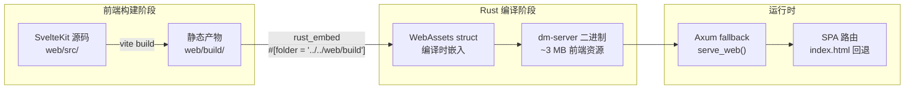
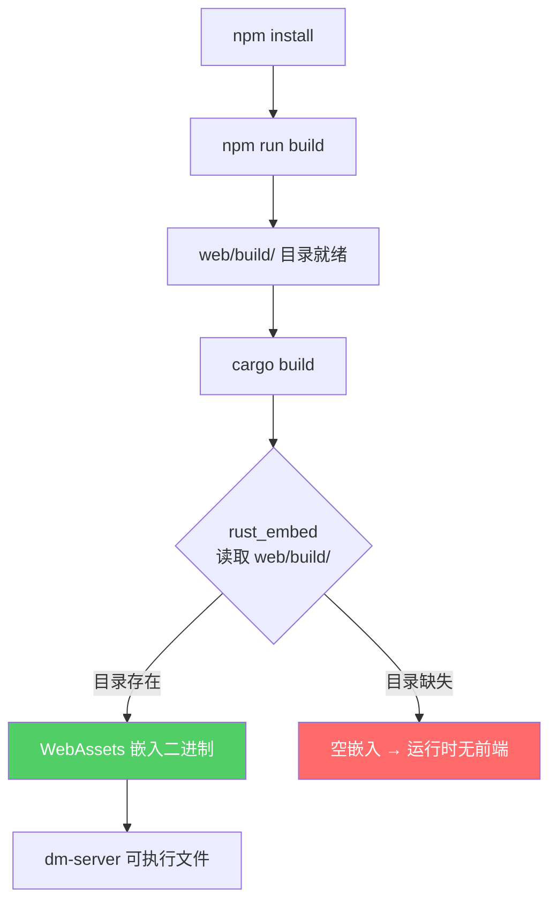
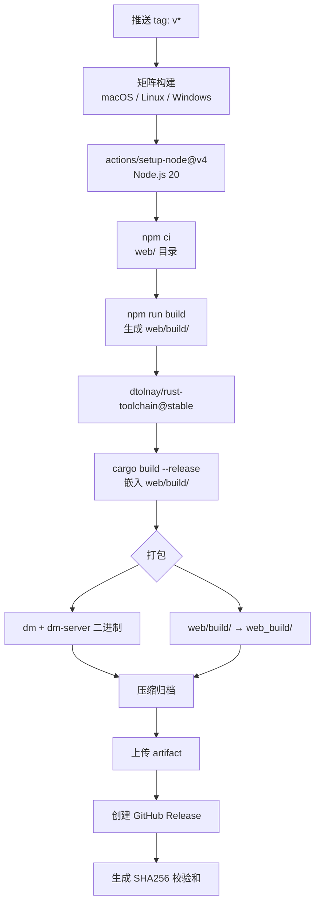

Dora Manager 采用**编译时静态嵌入**策略，将 SvelteKit 前端的完整构建产物通过 `rust_embed` 打包进 Rust 二进制文件。这意味着最终用户只需下载一个 `dm-server` 可执行文件即可获得完整的 Web UI 体验——无需额外的文件服务器或前端部署步骤。本文将系统讲解这一联编机制的每一层设计：从前端构建产物的结构、`rust_embed` 的编译时嵌入原理、Axum 的 SPA 路由回退策略，到开发环境与生产发布流程的完整闭环。

Sources: [main.rs](https://github.com/l1veIn/dora-manager/blob/master/crates/dm-server/src/main.rs#L20-L22), [svelte.config.js](https://github.com/l1veIn/dora-manager/blob/master/web/svelte.config.js#L1-L15)

## 整体架构：前后端如何缝合

整个联编机制可以用一条清晰的编译管线来描述——前端先行构建为纯静态文件，Rust 编译器在 `cargo build` 阶段将这些文件嵌入到二进制中，运行时 Axum 通过 fallback handler 提供服务。



这个设计的核心优势在于**零运行时依赖**——dm-server 是一个自包含的 HTTP 服务器，既提供 `/api/*` 的后端 API，又直接托管前端页面。用户打开 `http://127.0.0.1:3210` 即可访问完整应用。

Sources: [main.rs](https://github.com/l1veIn/dora-manager/blob/master/crates/dm-server/src/main.rs#L20-L22), [handlers/web.rs](https://github.com/l1veIn/dora-manager/blob/master/crates/dm-server/src/handlers/web.rs#L1-L27)

## 前端构建产物：adapter-static 与 SPA 模式

### SvelteKit 静态适配器配置

Dora Manager 的前端使用 `@sveltejs/adapter-static` 将 SvelteKit 应用编译为纯静态文件。这个选择是联编机制的前提——只有静态文件才能被 `rust_embed` 在编译时嵌入。

关键配置在 `svelte.config.js` 中：`adapter-static` 设置 `fallback: 'index.html'`，这意味着 SvelteKit 会生成一个标准的 SPA（Single Page Application）结构，所有未匹配的路由都回退到 `index.html`，由客户端 JavaScript 处理路由。同时 `paths.relative: false` 确保所有资源引用使用绝对路径（如 `/_app/immutable/...`），避免嵌入后的路径解析问题。 [svelte.config.js](https://github.com/l1veIn/dora-manager/blob/master/web/svelte.config.js#L1-L15)

### 构建产物的目录结构

执行 `npm run build`（即 `vite build`）后，所有产物输出到 `web/build/` 目录，该目录**被 `.gitignore` 排除**，不纳入版本控制：

```
web/build/
├── index.html                          # SPA 入口（约 1 KB）
├── robots.txt
└── _app/
    ├── version.json
    └── immutable/
        ├── assets/                     # CSS 文件（约 330 KB）
        │   ├── 0.BgrlRXg5.css
        │   ├── 10.unNUpGj7.css
        │   └── ...
        ├── chunks/                     # 共享 JS 模块
        │   ├── BrG2omaf.js
        │   └── ...
        ├── entry/                      # 入口 JS
        │   ├── start.C2exKWgn.js
        │   └── app.BcTUXpNC.js
        └── nodes/                      # 各路由页面（0-11 共 12 个）
            ├── 0.B9BPPpvp.js
            └── ...
```

整个 `web/build/` 目录约 **2.9 MB**，包含 87 个文件。其中 `_app/immutable/` 下的文件名都包含内容哈希（如 `C2exKWgn`），天然支持长期缓存策略。`index.html` 是唯一的入口文件，通过 `<script>` 和 `<link rel="modulepreload">` 引用各模块。 [index.html](https://github.com/l1veIn/dora-manager/blob/master/web/build/index.html#L1-L36)

### 开发环境中的代理模式

在本地开发时，无需每次修改前端都重新编译 Rust。Vite 开发服务器通过 `vite.config.ts` 中的 proxy 配置，将 `/api` 请求自动转发到 `127.0.0.1:3210`（dm-server 后端地址），同时 WebSocket 连接也一并代理（`ws: true`）。这使前后端可以独立运行、热更新：

```typescript
// vite.config.ts
server: {
    proxy: {
        '/api': {
            target: 'http://127.0.0.1:3210',
            changeOrigin: true,
            ws: true    // 支持 WebSocket 代理
        }
    }
}
```

[vite.config.ts](https://github.com/l1veIn/dora-manager/blob/master/web/vite.config.ts#L1-L16)

Sources: [vite.config.ts](https://github.com/l1veIn/dora-manager/blob/master/web/vite.config.ts#L8-L15), [web/.gitignore](https://github.com/l1veIn/dora-manager/blob/master/web/.gitignore#L1-L25)

## rust_embed：编译时静态嵌入机制

### 嵌入声明与工作原理

`rust_embed` 是一个 Rust 过程宏（procedural macro），它在 **编译时** 读取指定目录的所有文件，将其内容以无损方式嵌入到 Rust 二进制中。Dora Manager 中的声明极为简洁：

```rust
use rust_embed::Embed;

#[derive(Embed)]
#[folder = "../../web/build"]
struct WebAssets;
```

这段声明做了三件事：第一，`#[folder]` 属性指定相对于当前源文件（`crates/dm-server/src/main.rs`）的路径，实际指向项目根目录下的 `web/build`；第二，编译器在 `cargo build` 时将该目录中所有文件读入内存并编入二进制；第三，自动为 `WebAssets` 生成 `get(path: &str) -> Option<EmbeddedFile>` 方法。

**关键约束**：由于嵌入发生在编译时，`web/build/` 目录必须在 Rust 编译之前就已存在且包含完整产物。如果目录缺失或为空，编译不会失败（`rust_embed` 允许空目录），但运行时所有前端资源请求将返回 404 或回退到空 index.html。 [main.rs](https://github.com/l1veIn/dora-manager/blob/master/crates/dm-server/src/main.rs#L11-L22)

### 依赖版本与特性

在工作区 `Cargo.toml` 中，`rust-embed` 启用了 `axum` 特性：

```toml
rust-embed = { version = "8.11", features = ["axum"] }
mime_guess = "2"
```

`axum` 特性为 `rust_embed` 生成的类型提供了与 Axum 框架的集成支持（如 `IntoResponse` 实现）。`mime_guess` 则用于根据文件扩展名推断 MIME 类型，确保 CSS 文件返回 `text/css`、JS 文件返回 `application/javascript` 等。 [Cargo.toml](https://github.com/l1veIn/dora-manager/blob/master/Cargo.toml), [dm-server/Cargo.toml](https://github.com/l1veIn/dora-manager/blob/master/crates/dm-server/Cargo.toml#L22-L23)

Sources: [Cargo.toml](https://github.com/l1veIn/dora-manager/blob/master/Cargo.toml), [dm-server/Cargo.toml](https://github.com/l1veIn/dora-manager/blob/master/crates/dm-server/Cargo.toml#L1-L35)

## 运行时服务：SPA 路由与 fallback 策略

### serve_web Handler 实现

前端资源的运行时服务由 `handlers/web.rs` 中的 `serve_web` 函数处理。该函数被注册为 Axum 路由器的 **fallback handler**——即所有未被 `/api/*` 路由匹配的请求都会进入此处理流程：

```rust
pub async fn serve_web(uri: Uri) -> impl IntoResponse {
    let mut path = uri.path().trim_start_matches('/').to_string();
    if path.is_empty() {
        path = "index.html".to_string();
    }
    match WebAssets::get(&path) {
        Some(content) => {
            let mime = mime_guess::from_path(&path).first_or_octet_stream();
            ([(header::CONTENT_TYPE, mime.as_ref())], content.data).into_response()
        }
        None => {
            // SPA fallback: 未知路径返回 index.html
            if let Some(index) = WebAssets::get("index.html") {
                let mime = mime_guess::from_path("index.html").first_or_octet_stream();
                ([(header::CONTENT_TYPE, mime.as_ref())], index.data).into_response()
            } else {
                (StatusCode::NOT_FOUND, "404 Not Found").into_response()
            }
        }
    }
}
```

这段代码实现了经典的 **SPA 路由回退模式**，逻辑分为三层：

| 请求路径 | 匹配结果 | 响应 |
|----------|---------|------|
| `/` 或空路径 | 精确匹配 `index.html` | 200 + `text/html` |
| `/_app/immutable/assets/0.BgrlRXg5.css` | 精确匹配静态资源 | 200 + 对应 MIME 类型 |
| `/dataflows/my-flow`、`/runs/abc123` 等前端路由 | 无匹配文件 → 回退到 `index.html` | 200 + `text/html`（客户端路由接管） |

[handlers/web.rs](https://github.com/l1veIn/dora-manager/blob/master/crates/dm-server/src/handlers/web.rs#L1-L27)

### Fallback 注册方式

在 `main.rs` 的路由配置中，`serve_web` 通过 `.fallback()` 方法注册，位于所有 API 路由和 Swagger UI 之后：

```rust
let app = Router::new()
    .route("/api/...", ...)    // 70+ API 路由
    .layer(CorsLayer::permissive())
    .with_state(state.clone())
    .merge(SwaggerUi::new("/swagger-ui")...)
    .fallback(axum::routing::get(handlers::serve_web));  // 最后注册
```

Axum 的 fallback 机制保证 API 路由优先匹配，只有当请求路径不以 `/api` 或 `/swagger-ui` 开头时才进入前端服务逻辑。 [main.rs](https://github.com/l1veIn/dora-manager/blob/master/crates/dm-server/src/main.rs#L224-L225)

### 内置测试验证

项目包含两个关键测试，验证 SPA 路由行为的正确性。`serve_web_root_returns_index_html` 测试根路径 `/` 返回包含 `<!doctype html>` 的 HTML 内容。`serve_web_unknown_path_falls_back_to_index` 测试任意未知路径（如 `/missing-route`）也能正确回退到 `index.html`，确保 SvelteKit 的客户端路由可以在浏览器中正常接管导航。 [tests.rs](https://github.com/l1veIn/dora-manager/blob/master/crates/dm-server/src/tests.rs#L1513-L1548)

Sources: [handlers/web.rs](https://github.com/l1veIn/dora-manager/blob/master/crates/dm-server/src/handlers/web.rs#L1-L27), [main.rs](https://github.com/l1veIn/dora-manager/blob/master/crates/dm-server/src/main.rs#L224-L225), [tests.rs](https://github.com/l1veIn/dora-manager/blob/master/crates/dm-server/src/tests.rs#L1513-L1548)

## 构建顺序与依赖关系

### 编译时序的刚性约束

由于 `rust_embed` 在编译时读取 `web/build/`，整个构建管线存在严格的**时序依赖**：



**如果跳过前端构建直接 `cargo build`**，编译不会报错（`rust_embed` 允许空目录），但运行 `dm-server` 后访问 `http://127.0.0.1:3210` 会得到 "404 Not Found"。这是因为 `WebAssets::get("index.html")` 返回 `None`，两条匹配路径都进入 `None` 分支。 [handlers/web.rs](https://github.com/l1veIn/dora-manager/blob/master/crates/dm-server/src/handlers/web.rs#L18-L25)

### Release Profile 优化

工作区 `Cargo.toml` 为 release 构建配置了激进的优化参数：

```toml
[profile.release]
lto = true           # 跨 crate 链接时优化，消除未使用代码
codegen-units = 1    # 单编译单元，允许更激进的全局优化
strip = true         # 剥离调试符号，减小二进制体积
opt-level = 3        # 最高优化级别
```

这些设置与 `rust_embed` 的静态嵌入配合尤为有效——LTO 能够识别并压缩嵌入的静态资源中的冗余字节模式，而 `strip = true` 确保最终二进制不会因为嵌入的资源而携带额外调试信息。 [Cargo.toml](https://github.com/l1veIn/dora-manager/blob/master/Cargo.toml)

Sources: [Cargo.toml](https://github.com/l1veIn/dora-manager/blob/master/Cargo.toml), [handlers/web.rs](https://github.com/l1veIn/dora-manager/blob/master/crates/dm-server/src/handlers/web.rs#L18-L25)

## 开发工作流：dev.sh 并行启动

### 一键启动脚本

项目提供了 `dev.sh` 脚本，将前端构建 + 后端启动 + 前端开发服务器整合为一个命令。其执行流程为：

| 阶段 | 命令 | 目的 |
|------|------|------|
| 预检 | 检查 `cargo`、`node`、`npm` | 确保开发环境就绪 |
| 前端构建 | `cd web && npm install && npm run build` | 生成 `web/build/` 供 Rust 编译 |
| 后端启动 | `cargo run -p dm-server` | 编译并启动 dm-server（端口 3210） |
| 前端开发服务器 | `cd web && npm run dev` | 启动 Vite HMR（端口 5173） |

脚本使用 `trap cleanup EXIT INT TERM` 确保 Ctrl+C 时同时终止两个进程。开发者日常开发时通常直接访问 Vite 开发服务器（端口 5173），享受热模块替换（HMR）；API 请求通过 Vite 代理转发到后端。只有需要验证嵌入式静态服务行为时，才直接访问 `127.0.0.1:3210`。 [dev.sh](https://github.com/l1veIn/dora-manager/blob/master/dev.sh)

### 开发模式 vs 生产模式对比

| 特性 | 开发模式 | 生产模式（嵌入） |
|------|---------|----------------|
| 前端服务 | Vite dev server (5173) | dm-server 内嵌 (3210) |
| API 请求 | Vite proxy → 3210 | 直接由 dm-server 处理 |
| 热更新 | ✅ HMR 即时生效 | ❌ 需重新 `npm run build` + `cargo build` |
| SPA 路由 | Vite 内置处理 | `serve_web` fallback 逻辑 |
| WebSocket | Vite 代理 (`ws: true`) | Axum 原生 WebSocket |
| 二进制产物 | 仅 debug build | 单个 release 二进制 |

Sources: [dev.sh](https://github.com/l1veIn/dora-manager/blob/master/dev.sh), [vite.config.ts](https://github.com/l1veIn/dora-manager/blob/master/web/vite.config.ts#L8-L15)

## 发布流程：CI/CD 中的前后端联编

### Release 工作流

当推送版本标签（如 `v0.1.0`）时，`.github/workflows/release.yml` 触发多平台构建。其管线严格遵循"前端先行"的时序约束：



值得注意的是，release 工作流不仅将前端嵌入到 `dm-server` 二进制中，**还将 `web/build/` 额外复制为 `web_build/`** 放入发布归档。这是为了支持一种替代部署模式——某些高级用户可能希望用 Nginx 等独立服务器托管前端，直接指向 `dm-server` 的 API 端口。 [release.yml](https://github.com/l1veIn/dora-manager/blob/master/.github/workflows/release.yml#L66-L101)

### CI 工作流中的联编验证

在持续集成（`ci.yml`）中，每次 push 到 master 或 PR 都会执行完整的前后端联编验证。流水线包含：前端 lint（`npm run lint` 即 `svelte-check`）、前端构建（`npm run build`）、Rust 格式检查（`cargo fmt --check`）、Clippy 静态分析、编译和测试。这确保任何破坏前后端联编的变更都会在合并前被捕获。 [ci.yml](https://github.com/l1veIn/dora-manager/blob/master/.github/workflows/ci.yml#L1-L120)

### 多平台构建矩阵

| 平台 | Target | Runner | 归档格式 |
|------|--------|--------|---------|
| macOS (Apple Silicon) | `aarch64-apple-darwin` | `macos-latest` | `.tar.gz` |
| Linux (x86_64) | `x86_64-unknown-linux-gnu` | `ubuntu-latest` | `.tar.gz` |
| Windows (x86_64) | `x86_64-pc-windows-msvc` | `windows-latest` | `.zip` |

每个平台都包含 `dm`（CLI 工具）和 `dm-server`（带嵌入前端的 HTTP 服务器）两个二进制文件。 [release.yml](https://github.com/l1veIn/dora-manager/blob/master/.github/workflows/release.yml#L18-L34)

Sources: [release.yml](https://github.com/l1veIn/dora-manager/blob/master/.github/workflows/release.yml#L1-L133), [ci.yml](https://github.com/l1veIn/dora-manager/blob/master/.github/workflows/ci.yml#L1-L120)

## 常见问题与排查

### 构建时：`cargo build` 后前端页面空白或 404

**根因**：`web/build/` 目录不存在或为空（例如克隆仓库后首次编译时跳过了前端构建）。`rust_embed` 不会对空目录产生编译错误，因此问题只在运行时暴露。

**排查**：检查 `web/build/index.html` 是否存在。若不存在，执行：
```bash
cd web && npm install && npm run build && cd .. && cargo build
```

### 运行时：前端路由刷新后 404

**根因**：如果部署时未使用 `dm-server` 的内置服务（例如用 Nginx 直接托管 `web_build/`），需要配置 Nginx 的 `try_files` 指令以实现 SPA 回退：
```nginx
location / {
    try_files $uri $uri/ /index.html;
}
```

使用 `dm-server` 本身提供服务时不存在此问题，因为 `serve_web` 的 fallback 逻辑已内置 SPA 回退。 [handlers/web.rs](https://github.com/l1veIn/dora-manager/blob/master/crates/dm-server/src/handlers/web.rs#L18-L25)

### CI 中：前端构建成功但 Rust 编译找不到资源

**根因**：`#[folder = "../../web/build"]` 是相对于 `crates/dm-server/src/main.rs` 的路径，CI 的工作目录必须是项目根目录。如果 `working-directory` 设置不当导致路径解析失败，`rust_embed` 会嵌入空目录。

**验证**：CI 脚本中 `npm run build` 的 `working-directory: web` 完成后，后续的 `cargo build` 在项目根目录执行，路径关系正确。 [ci.yml](https://github.com/l1veIn/dora-manager/blob/master/.github/workflows/ci.yml#L47-L53)

Sources: [handlers/web.rs](https://github.com/l1veIn/dora-manager/blob/master/crates/dm-server/src/handlers/web.rs#L18-L25), [ci.yml](https://github.com/l1veIn/dora-manager/blob/master/.github/workflows/ci.yml#L47-L53)

## 总结与延伸阅读

Dora Manager 的前后端联编方案以极低的实现复杂度（仅 27 行 Web Handler + 3 行 Embed 声明）实现了"单二进制部署"的工程目标。这一设计的选择——而非动态文件读取或反向代理——带来了三个核心优势：**零配置部署**（无需管理静态文件路径）、**原子发布**（前后端版本始终一致）、**跨平台一致行为**（不依赖操作系统的文件系统特性）。

关于构建与发布的自动化配置细节，请继续阅读 [CI/CD：GitHub Actions 构建与发布配置](24-ci-cd)。如需了解前端本身的 API 通信层实现，参见 [SvelteKit 项目结构与 API 通信层](14-sveltekit-structure)。后端的完整路由设计详见 [HTTP API 路由全览与 Swagger 文档](12-http-api)。