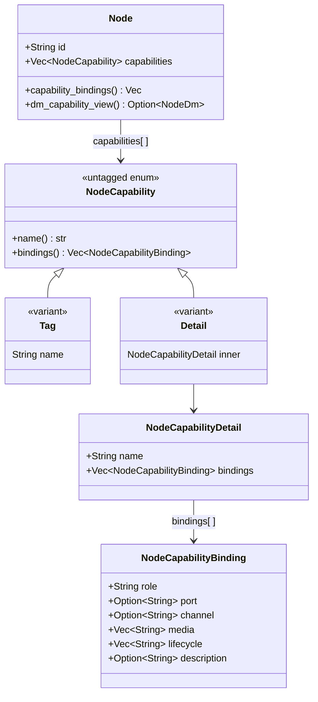
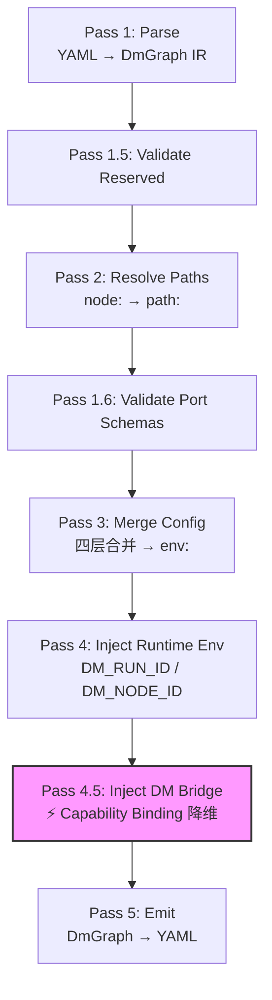
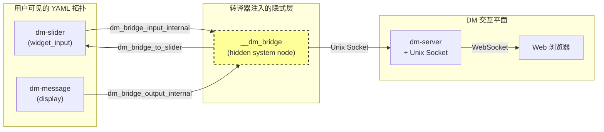

Capability Binding 是 Dora Manager 中将**节点声明元数据**与**运行时行为角色**显式关联的核心机制。它回答了一个根本性的架构问题：当数据流中存在交互类节点（控件输入、内容展示）时，系统如何在不污染 dora 数据平面拓扑的前提下，让这些节点获得 DM 平台特有的运行时能力？本文将深入剖析 capability 的声明模型（`dm.json` 中的 `capabilities` 字段）、类型系统（Tag 与 Detail 的联合体设计）、运行时降维路径（transpiler 的 hidden bridge 注入），以及完整的生命周期——从节点作者在 JSON 中声明，到转译器自动编织隐式 bridge 节点，再到 bridge 进程与 dm-server 的 Unix Socket 通信。

Sources: [dm-capability-binding-v0.md](https://github.com/l1veIn/dora-manager/blob/main/docs/design/dm-capability-binding-v0.md#L1-L231), [panel-ontology-memo.md](https://github.com/l1veIn/dora-manager/blob/main/docs/design/panel-ontology-memo.md#L1-L327)

## 为什么需要 Capability Binding：双平面架构的命名

在深入技术细节之前，理解 **双平面** 这一架构判断是至关重要的。Dora Manager 的系统中始终存在两个独立的数据世界：

- **Dora 数据平面**：节点进程、Arrow 载荷、`for event in node` 循环、端口拓扑、YAML 声明——这是纯粹的计算与数据流世界。
- **DM 交互平面**：run-scoped 消息持久化、控件注册、浏览器输入事件、内容快照与历史、WebSocket 通知——这是面向产品层的人机交互世界。

这两个平面从未真正合并过。早期的 `dm-panel` 显式节点方案让图变得混乱不堪；后来的 server-client 节点方案虽然清理了图拓扑，却把 DM 特有的连接管理、消息序列化、生命周期控制等逻辑分散到了每个交互节点中。Capability Binding 的核心设计选择是：**不试图消除双平面，而是显式命名并结构化它们之间的绑定关系**。`dora` 拥有执行与数据流，`dm` 拥有产品级能力绑定，而 `dm.json` 声明这两者在何处交汇。

Sources: [panel-ontology-memo.md](https://github.com/l1veIn/dora-manager/blob/main/docs/design/panel-ontology-memo.md#L85-L151), [panel-ontology-memo.md](https://github.com/l1veIn/dora-manager/blob/main/docs/design/panel-ontology-memo.md#L224-L296)

## 声明模型：dm.json 中的 capabilities 字段

### 双形态联合体：Tag 与 Detail

`capabilities` 字段采用**混合列表**设计，列表中的每个元素既可以是简单的字符串标签（Tag），也可以是携带详细绑定信息的结构化对象（Detail）。这一设计通过 Rust 的 `untagged` enum 实现：



**Tag** 用于声明粗粒度的能力标签，如 `"configurable"` 表示节点支持配置合并、`"media"` 表示节点涉及媒体处理。Tag 不携带任何额外字段，`bindings()` 方法返回空切片。**Detail** 则声明一个命名的能力族（如 `display` 或 `widget_input`），其内部包含一个或多个 `NodeCapabilityBinding`，每个绑定精确描述节点在该能力族中扮演的具体角色。

Sources: [model.rs](https://github.com/l1veIn/dora-manager/blob/main/crates/dm-core/src/node/model.rs#L71-L116), [model.rs](https://github.com/l1veIn/dora-manager/blob/main/crates/dm-core/src/node/model.rs#L339-L384)

### Binding 字段语义

每个 `NodeCapabilityBinding` 由以下字段组成，它们共同定义了 DM 平面与 dora 数据平面的交汇点：

| 字段 | 类型 | 含义 |
|------|------|------|
| `role` | `String` | 节点在该能力族中的角色，如 `"widget"` 或 `"source"` |
| `port` | `Option<String>` | 绑定所关联的 dora 端口名，无端口则为纯节点级行为 |
| `channel` | `Option<String>` | DM 侧的语义通道，如 `"register"`、`"input"`、`"inline"`、`"artifact"` |
| `media` | `Vec<String>` | 载荷/渲染提示，如 `["text", "json"]`、`["image", "video"]` |
| `lifecycle` | `Vec<String>` | 生命周期提示，如 `["run_scoped", "stop_aware"]` |
| `description` | `Option<String>` | 供工具界面使用的人类可读说明 |

关键设计约束：**绑定是以绑定为中心，而非以端口为中心**。一个绑定可以指向一个 `port`（当 DM 平面与 dora 数据平面在端口处交汇时），但某些 DM 语义（如控件注册）是节点级别的，因此 `port` 是可选的。这避免了将所有 DM 关注点强行塞入虚假数据端口的反模式。

Sources: [dm-capability-binding-v0.md](https://github.com/l1veIn/dora-manager/blob/main/docs/design/dm-capability-binding-v0.md#L39-L86), [model.rs](https://github.com/l1veIn/dora-manager/blob/main/crates/dm-core/src/node/model.rs#L79-L93)

## 能力族详解：widget_input、display 与 Tag 类型

### widget_input 族

`widget_input` 族声明节点参与浏览器端的控件输入流程。每个 `widget_input` 节点通常包含两个绑定：

1. **`channel = "register"`**：节点向 DM 平面发布控件定义（widget definition）。这是节点级行为，通常不指定 `port`，`media` 为 `["widgets"]`，`lifecycle` 包含 `["run_scoped", "stop_aware"]`。
2. **`channel = "input"`**：DM 平面将用户的输入值回传到节点的数据平面端口。此时 `port` 指向节点的实际输出端口名（如 `"value"` 或 `"click"`），`media` 描述载荷类型（如 `"text"`、`"number"`、`"pulse"`、`"boolean"`）。

目前使用 `widget_input` 族的内置节点及其差异如下表所示：

| 节点 | 绑定端口 | media 类型 | 控件形态 |
|------|----------|-----------|---------|
| `dm-text-input` | `value` | `["text"]` | 单行输入 / 多行文本域 |
| `dm-button` | `click` | `["pulse"]` | 触发按钮 |
| `dm-slider` | `value` | `["number"]` | 数值滑块 |
| `dm-input-switch` | `value` | `["boolean"]` | 开关切换 |

Sources: [dm-text-input/dm.json](https://github.com/l1veIn/dora-manager/blob/main/nodes/dm-text-input/dm.json#L25-L57), [dm-button/dm.json](https://github.com/l1veIn/dora-manager/blob/main/nodes/dm-button/dm.json#L25-L57), [dm-slider/dm.json](https://github.com/l1veIn/dora-manager/blob/main/nodes/dm-slider/dm.json#L25-L57), [dm-input-switch/dm.json](https://github.com/l1veIn/dora-manager/blob/main/nodes/dm-input-switch/dm.json#L25-L57)

### display 族

`display` 族声明节点作为 **sink 终点**参与 DM 交互平面的消息展示。dm-message 节点是一个典型的 sink 风格交互节点——它作为数据流的终点，将接收到的内容转化为人类可见的 DM run 消息。每个 `dm-message` 节点包含一个绑定：

- **`channel = "message"`**：统一消息通道，通过 `message` 输入端口传入内容，自动检测内联文本与文件路径，支持 `text`、`json`、`markdown`、`image`、`audio`、`video` 等多种媒体类型。

```json
{
  "name": "display",
  "bindings": [
    {
      "role": "source",
      "port": "message",
      "channel": "message",
      "media": ["text", "json", "markdown", "image", "audio", "video"],
      "lifecycle": [],
      "description": "Emits a human-visible message into the DM interaction plane, auto-detecting inline content versus artifact files."
    }
  ]
}
```

与 `widget_input` 的双向交互不同，`display` 族是**单向的 sink 模式**——数据只从 dora 数据平面流入 DM 交互平面，没有从浏览器回传到节点的路径。这使得 dm-message 天然适合用作数据流的可观测终点。

Sources: [dm-message/dm.json](https://github.com/l1veIn/dora-manager/blob/main/nodes/dm-message/dm.json#L25-L59), [dm-capability-binding-v0.md](https://github.com/l1veIn/dora-manager/blob/main/docs/design/dm-capability-binding-v0.md#L96-L111)

### Tag 类型能力

与结构化的 `widget_input` 和 `display` 不同，Tag 类型能力仅作为粗粒度分类标签存在：

| Tag | 含义 | 典型节点 |
|-----|------|---------|
| `"configurable"` | 节点拥有 `config_schema`，支持四层配置合并 | 绝大多数内置节点 |
| `"media"` | 节点涉及媒体处理（音频/视频/图像流） | `dm-microphone`、`dm-mjpeg`、`dm-stream-publish` |

Tag 不被转译器降维为 bridge 通道——它们主要用于数据流检查逻辑（如 `inspect` 模块通过 `media` 标签判断数据流是否需要媒体后端）和前端分类展示。

Sources: [inspect.rs](https://github.com/l1veIn/dora-manager/blob/main/crates/dm-core/src/dataflow/inspect.rs#L147-L160), [dm-microphone/dm.json](https://github.com/l1veIn/dora-manager/blob/main/nodes/dm-microphone/dm.json#L7-L9)

## 遗留兼容：dm.bindings 的归一化迁移

`dm.json` 中存在一个已弃用的 `dm` 字段，其内部携带 `bindings` 数组。当 Rust 反序列化器读取 `dm.json` 时，`NodeSerde` 中间结构同时接受 `dm` 和 `capabilities` 两个字段，随后通过 `merge_legacy_dm_into_capabilities` 函数将遗留绑定归一化到统一的 `capabilities` 列表中：

归一化逻辑按 `family` 分组收集遗留绑定，然后对每个能力族执行：
- 若 `capabilities` 中已存在同名的 `Detail` 条目，则将遗留绑定**去重追加**到现有绑定的 `bindings` 列表中
- 若不存在，则新建一个 `NodeCapabilityDetail` 条目

最终，反序列化产出的 `Node` 结构中 `dm` 字段被强制设为 `None`，所有能力信息统一存储在 `capabilities` 中。节点作者可以使用 `scripts/migrate_dm_json.py` 迁移脚本将旧的 `dm` 字段自动转换为新的 `capabilities` 格式。

Sources: [model.rs](https://github.com/l1veIn/dora-manager/blob/main/crates/dm-core/src/node/model.rs#L429-L505), [migrate_dm_json.py](https://github.com/l1veIn/dora-manager/blob/main/scripts/migrate_dm_json.py#L337-L352)

## 运行时降维：Transpiler 的 Hidden Bridge 注入

这是 Capability Binding 最精巧的部分——从静态声明到运行时行为的转化发生在转译管线的 **Pass 4.5** 中。

### 转译管线中的位置

转译管线的执行顺序如下：



`inject_dm_bridge` 在路径解析和配置合并完成之后执行，因为此时所有受管节点的 `dm.json` 元数据已被加载，环境变量也已合并完成。

Sources: [mod.rs](https://github.com/l1veIn/dora-manager/blob/main/crates/dm-core/src/dataflow/transpile/mod.rs#L1-L84), [passes.rs](https://github.com/l1veIn/dora-manager/blob/main/crates/dm-core/src/dataflow/transpile/passes.rs#L452-L570)

### Bridge 节点注入的完整流程

`inject_dm_bridge` 的工作可以分解为以下步骤：

**第一步：收集绑定规格**。遍历所有受管节点，加载其 `dm.json`，调用 `build_bridge_node_spec` 提取 `widget_input` 和 `display` 族的绑定。只有包含这两种族的节点才会产生规格；仅包含 Tag 类型能力的节点被跳过。

**第二步：为每个交互节点注入隐式端口和边**。对每个产生规格的节点：

- 若节点拥有 `display` 族绑定，则为其注入一个 `dm_bridge_output_internal` 输出端口，并将 `DM_BRIDGE_OUTPUT_ENV_KEY` 环境变量设为该端口名。这使节点的运行时代码知道将展示内容发送到哪个端口。
- 若节点拥有 `widget_input` 族绑定，则为其注入一个 `dm_bridge_input_internal` 输入映射（指向 hidden bridge 的输出），并将 `DM_BRIDGE_INPUT_ENV_KEY` 环境变量设为该端口名。这使节点的运行时代码知道从哪个端口接收控件输入。

**第三步：创建 hidden bridge 节点**。将所有收集到的规格序列化为 JSON，通过 `DM_CAPABILITIES_JSON` 环境变量传递给 bridge 进程。Bridge 节点本身使用 `dm` CLI 的 `bridge` 子命令作为可执行文件，其 `yaml_id` 为 `__dm_bridge`，对用户不可见。



Sources: [passes.rs](https://github.com/l1veIn/dora-manager/blob/main/crates/dm-core/src/dataflow/transpile/passes.rs#L456-L570), [bridge.rs](https://github.com/l1veIn/dora-manager/blob/main/crates/dm-core/src/dataflow/transpile/bridge.rs#L46-L84)

### Bridge 进程的运行时行为

当 `dora` 启动转译后的 YAML 时，`__dm_bridge` 作为普通 dora 节点运行。它通过 `DM_CAPABILITIES_JSON` 环境变量反序列化所有绑定规格，然后执行以下关键工作：

**输入侧路由**：当 dora 事件到达 display 相关端口时，bridge 将载荷解码为 JSON，附加来源节点信息，通过 Unix Socket 推送给 dm-server，由 server 存储到 run-scoped SQLite 数据库并通过 WebSocket 通知前端。

**输出侧路由**：当 dm-server 收到前端用户输入并通过 Unix Socket 传递给 bridge 时，bridge 根据 `InputNotification.to` 字段匹配对应的 widget 规格，将 JSON 值转换为 Arrow 类型（`StringArray`、`Float64Array`、`BooleanArray` 等），通过 `dora` 的 `send_output` 发送到对应节点的输入端口。

**控件注册**：bridge 启动时自动从绑定规格中提取 `widget_input` 节点的环境变量（`LABEL`、`DEFAULT_VALUE`、`PLACEHOLDER` 等），构造 widget 定义 JSON 并通过 Unix Socket 推送给 dm-server，完成控件注册。

Sources: [bridge.rs](https://github.com/l1veIn/dora-manager/blob/main/crates/dm-cli/src/bridge.rs#L57-L193), [bridge.rs](https://github.com/l1veIn/dora-manager/blob/main/crates/dm-cli/src/bridge.rs#L237-L355)

## 端到端示例：demo-interactive-widgets 的 Binding 降维

以 `demos/demo-interactive-widgets.yml` 为例，该数据流包含四个 `widget_input` 节点（`dm-slider`、`dm-button`、`dm-text-input`、`dm-input-switch`）和四个 `display` 节点（`dm-message`）。转译过程中：

1. **Pass 2** 解析所有节点的 `dm.json`，确认可执行路径
2. **Pass 3** 合并每个节点的 config（如 `label: "Temperature (°C)"`）到环境变量
3. **Pass 4.5** 检测到 8 个节点携带 `widget_input` 或 `display` 能力族，为每个节点注入隐式端口映射，收集 8 份 `HiddenBridgeBindingSpec`，创建 `__dm_bridge` 节点
4. **Pass 5** 产出最终 YAML，`__dm_bridge` 作为第 13 个节点出现，但用户在原始 YAML 中从未编写过它

Bridge 启动后自动注册四种控件（slider、button、input、switch），建立 display 通道，完成从"静态 JSON 声明"到"运行时双向交互"的完整降维。

Sources: [demo-interactive-widgets.yml](demos/demo-interactive-widgets.yml#L1-L129), [passes.rs](https://github.com/l1veIn/dora-manager/blob/main/crates/dm-core/src/dataflow/transpile/passes.rs#L456-L570)

## 自定义节点中的 Capability 声明

如果你正在开发一个自定义节点并希望它参与 DM 交互平面，在 `dm.json` 中添加对应的 capability 声明即可。以下是两个关键要点：

**声明位置**：在 `dm.json` 的 `capabilities` 数组中添加结构化对象。如果你的节点需要控件输入能力，添加 `widget_input` 族；如果需要展示能力，添加 `display` 族。同时保留 `"configurable"` Tag 以支持配置合并。

**端口对齐**：binding 中的 `port` 字段必须与 `dm.json` 的 `ports` 数组中声明的端口 ID 一致。例如，`widget_input` 族中 `channel = "input"` 的绑定所引用的端口必须是 `direction: "output"` 类型的端口——因为从 bridge 的视角看，用户输入值需要通过 dora 数据平面发送**到**该节点的输出端口。

Sources: [dm-capability-binding-v0.md](https://github.com/l1veIn/dora-manager/blob/main/docs/design/dm-capability-binding-v0.md#L136-L191), [dm-text-input/dm.json](https://github.com/l1veIn/dora-manager/blob/main/nodes/dm-text-input/dm.json#L63-L77)

## 延伸阅读

- [交互系统架构：dm-input / dm-message / Bridge 节点注入原理](22-jiao-hu-xi-tong-jia-gou-dm-input-dm-message-bridge-jie-dian-zhu-ru-yuan-li)——理解交互节点的具体实现细节与 HTTP/WebSocket 通信模式
- [数据流转译器（Transpiler）：多 Pass 管线与四层配置合并](11-shu-ju-liu-zhuan-yi-qi-transpiler-duo-pass-guan-xian-yu-si-ceng-pei-zhi-he-bing)——capability binding 在整体转译管线中的完整上下文
- [响应式控件（Widgets）：控件注册表、动态渲染与 WebSocket 参数注入](20-xiang-ying-shi-kong-jian-widgets-kong-jian-zhu-ce-biao-dong-tai-xuan-ran-yu-websocket-can-shu-zhu-ru)——前端如何消费 bridge 注册的控件定义
- [自定义节点开发指南：dm.json 完整字段参考](9-zi-ding-yi-jie-dian-kai-fa-zhi-nan-dm-json-wan-zheng-zi-duan-can-kao)——`capabilities` 字段在完整 `dm.json` 中的位置与写法