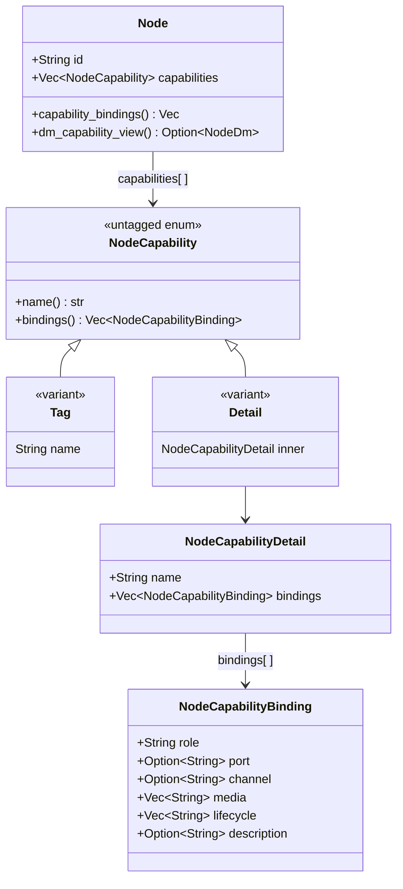

Capability Binding 是 Dora Manager 中将**节点声明元数据**与**运行时行为角色**显式关联的核心机制。它回答了一个根本性的架构问题：当数据流中存在交互类节点（控件输入、内容展示）时，系统如何在不污染 dora 数据平面拓扑的前提下，让这些节点获得 DM 平台特有的运行时能力？本文将深入剖析 capability 的声明模型（`dm.json` 中的 `capabilities` 字段）、类型系统（Tag 与 Detail 的联合体设计）、运行时角色绑定，以及完整的生命周期——从节点作者在 JSON 中声明，到转译器自动解析能力绑定，再到 SDK 节点通过 HTTP API 与 dm-server 通信。

Sources: [dm-capability-binding-v0.md](https://github.com/l1veIn/dora-manager/blob/main/docs/design/dm-capability-binding-v0.md#L1-L231), [panel-ontology-memo.md](https://github.com/l1veIn/dora-manager/blob/main/docs/design/panel-ontology-memo.md#L1-L327)

## 为什么需要 Capability Binding：双平面架构的命名

在深入技术细节之前，理解 **双平面** 这一架构判断是至关重要的。Dora Manager 的系统中始终存在两个独立的数据世界：

- **Dora 数据平面**：节点进程、Arrow 载荷、`for event in node` 循环、端口拓扑、YAML 声明——这是纯粹的计算与数据流世界。
- **DM 交互平面**：run-scoped 消息持久化、控件注册、浏览器输入事件、内容快照与历史、WebSocket 通知——这是面向产品层的人机交互世界。

这两个平面从未真正合并过。早期的 `dm-panel` 显式节点方案让图变得混乱不堪；后来的 server-client 节点方案虽然清理了图拓扑，却把 DM 特有的连接管理、消息序列化、生命周期控制等逻辑分散到了每个交互节点中。Capability Binding 的核心设计选择是：**不试图消除双平面，而是显式命名并结构化它们之间的绑定关系**。`dora` 拥有执行与数据流，`dm` 拥有产品级能力绑定，而 `dm.json` 声明这两者在何处交汇。

Sources: [panel-ontology-memo.md](https://github.com/l1veIn/dora-manager/blob/main/docs/design/panel-ontology-memo.md#L85-L151), [panel-ontology-memo.md](https://github.com/l1veIn/dora-manager/blob/main/docs/design/panel-ontology-memo.md#L224-L296)

## 声明模型：dm.json 中的 capabilities 字段

### 双形态联合体：Tag 与 Detail

`capabilities` 字段采用**混合列表**设计，列表中的每个元素既可以是简单的字符串标签（Tag），也可以是携带详细绑定信息的结构化对象（Detail）。这一设计通过 Rust 的 `untagged` enum 实现：


```mermaid
classDiagram
    class Node {
        +String id
        +Vec~NodeCapability~ capabilities
        +capability_bindings() Vec
        +dm_capability_view() Option~NodeDm~
    }
    class NodeCapability {
        <<untagged enum>>
        +name() str
        +bindings() Vec~NodeCapabilityBinding~
    }
    class Tag {
        <<variant>>
        String name
    }
    class Detail {
        <<variant>>
        NodeCapabilityDetail inner
    }
    class NodeCapabilityDetail {
        +String name
        +Vec~NodeCapabilityBinding~ bindings
    }
    class NodeCapabilityBinding {
        +String role
        +Option~String~ port
        +Option~String~ channel
        +Vec~String~ media
        +Vec~String~ lifecycle
        +Option~String~ description
    }
    Node --> NodeCapability : capabilities[ ]
    NodeCapability <|-- Tag
    NodeCapability <|-- Detail
    Detail --> NodeCapabilityDetail
    NodeCapabilityDetail --> NodeCapabilityBinding : bindings[ ]
```

**Tag** 用于声明粗粒度的能力标签，如 `"configurable"` 表示节点支持配置合并、`"media"` 表示节点涉及媒体处理。Tag 不携带任何额外字段，`bindings()` 方法返回空切片。**Detail** 则声明一个命名的能力族（如 `display` 或 `widget_input`），其内部包含一个或多个 `NodeCapabilityBinding`，每个绑定精确描述节点在该能力族中扮演的具体角色。

Sources: [model.rs](https://github.com/l1veIn/dora-manager/blob/main/crates/dm-core/src/node/model.rs#L71-L116), [model.rs](https://github.com/l1veIn/dora-manager/blob/main/crates/dm-core/src/node/model.rs#L339-L384)

### Binding 字段语义

每个 `NodeCapabilityBinding` 由以下字段组成，它们共同定义了 DM 平面与 dora 数据平面的交汇点：

| 字段 | 类型 | 含义 |
|------|------|------|
| `role` | `String` | 节点在该能力族中的角色，如 `"widget"` 或 `"source"` |
| `port` | `Option<String>` | 绑定所关联的 dora 端口名，无端口则为纯节点级行为 |
| `channel` | `Option<String>` | DM 侧的语义通道，如 `"register"`、`"input"`、`"inline"`、`"artifact"` |
| `media` | `Vec<String>` | 载荷/渲染提示，如 `["text", "json"]`、`["image", "video"]` |
| `lifecycle` | `Vec<String>` | 生命周期提示，如 `["run_scoped", "stop_aware"]` |
| `description` | `Option<String>` | 供工具界面使用的人类可读说明 |

关键设计约束：**绑定是以绑定为中心，而非以端口为中心**。一个绑定可以指向一个 `port`（当 DM 平面与 dora 数据平面在端口处交汇时），但某些 DM 语义（如控件注册）是节点级别的，因此 `port` 是可选的。这避免了将所有 DM 关注点强行塞入虚假数据端口的反模式。

Sources: [dm-capability-binding-v0.md](https://github.com/l1veIn/dora-manager/blob/main/docs/design/dm-capability-binding-v0.md#L39-L86), [model.rs](https://github.com/l1veIn/dora-manager/blob/main/crates/dm-core/src/node/model.rs#L79-L93)

## 能力族详解：widget_input、display 与 Tag 类型

### widget_input 族

`widget_input` 族声明节点参与浏览器端的控件输入流程。每个 `widget_input` 节点通常包含两个绑定：

1. **`channel = "register"`**：节点向 DM 平面发布控件定义（widget definition）。这是节点级行为，通常不指定 `port`，`media` 为 `["widgets"]`，`lifecycle` 包含 `["run_scoped", "stop_aware"]`。
2. **`channel = "input"`**：DM 平面将用户的输入值回传到节点的数据平面端口。此时 `port` 指向节点的实际输出端口名（如 `"value"` 或 `"click"`），`media` 描述载荷类型（如 `"text"`、`"number"`、`"pulse"`、`"boolean"`）。

目前使用 `widget_input` 族的内置节点及其差异如下表所示：

| 节点 | 绑定端口 | media 类型 | 控件形态 |
|------|----------|-----------|---------|
| `dm-text-input` | `value` | `["text"]` | 单行输入 / 多行文本域 |
| `dm-button` | `click` | `["pulse"]` | 触发按钮 |
| `dm-slider` | `value` | `["number"]` | 数值滑块 |
| `dm-input-switch` | `value` | `["boolean"]` | 开关切换 |

Sources: [dm-text-input/dm.json](https://github.com/l1veIn/dora-manager/blob/main/nodes/dm-text-input/dm.json#L25-L57), [dm-button/dm.json](https://github.com/l1veIn/dora-manager/blob/main/nodes/dm-button/dm.json#L25-L57), [dm-slider/dm.json](https://github.com/l1veIn/dora-manager/blob/main/nodes/dm-slider/dm.json#L25-L57), [dm-input-switch/dm.json](https://github.com/l1veIn/dora-manager/blob/main/nodes/dm-input-switch/dm.json#L25-L57)

### display 族

`display` 族声明节点作为 **sink 终点**参与 DM 交互平面的消息展示。dm-message 节点是一个典型的 sink 风格交互节点——它作为数据流的终点，将接收到的内容转化为人类可见的 DM run 消息。每个 `dm-message` 节点包含一个绑定：

- **`channel = "message"`**：统一消息通道，通过 `message` 输入端口传入内容，自动检测内联文本与文件路径，支持 `text`、`json`、`markdown`、`image`、`audio`、`video` 等多种媒体类型。

```json
{
  "name": "display",
  "bindings": [
    {
      "role": "source",
      "port": "message",
      "channel": "message",
      "media": ["text", "json", "markdown", "image", "audio", "video"],
      "lifecycle": [],
      "description": "Emits a human-visible message into the DM interaction plane, auto-detecting inline content versus artifact files."
    }
  ]
}
```

与 `widget_input` 的双向交互不同，`display` 族是**单向的 sink 模式**——数据只从 dora 数据平面流入 DM 交互平面，没有从浏览器回传到节点的路径。这使得 dm-message 天然适合用作数据流的可观测终点。

Sources: [dm-message/dm.json](https://github.com/l1veIn/dora-manager/blob/main/nodes/dm-message/dm.json#L25-L59), [dm-capability-binding-v0.md](https://github.com/l1veIn/dora-manager/blob/main/docs/design/dm-capability-binding-v0.md#L96-L111)

### Tag 类型能力

与结构化的 `widget_input` 和 `display` 不同，Tag 类型能力仅作为粗粒度分类标签存在：

| Tag | 含义 | 典型节点 |
|-----|------|---------|
| `"configurable"` | 节点拥有 `config_schema`，支持四层配置合并 | 绝大多数内置节点 |
| `"media"` | 节点涉及媒体处理（音频/视频/图像流） | `dm-microphone`、`dm-mjpeg`、`dm-stream-publish` |

Tag 主要用于数据流检查逻辑（如 `inspect` 模块通过 `media` 标签判断数据流是否需要媒体后端）和前端分类展示。

Sources: [inspect.rs](https://github.com/l1veIn/dora-manager/blob/main/crates/dm-core/src/dataflow/inspect.rs#L147-L160), [dm-microphone/dm.json](https://github.com/l1veIn/dora-manager/blob/main/nodes/dm-microphone/dm.json#L7-L9)

## 运行时降维：SDK 节点的能力自描述

这是 Capability Binding 从静态声明到运行时行为的关键转化。与旧的 Bridge 注入模式不同，当前架构中**没有隐式注入的 hidden bridge 节点**，节点的能力声明直接通过 **dm Python SDK** 在运行时自描述。

### SDK 节点启动流程

交互节点（如 `dm-slider`、`dm-display`）启动时，SDK 自动完成能力自描述：

1. **读取运行时环境变量**：SDK 的 `dm.Message()` 从 `DM_RUN_ID` 和 `DM_NODE_ID` 环境变量获取运行时上下文
2. **注册控件**：节点通过 `msg.send("widgets", payload)` 将 dm.json 中声明的控件形态注册到 dm-server，前端通过快照 API 自动发现
3. **启动输入轮询**：输入型节点启动后台线程，通过 `msg.get(tag="input", after_seq=...)` 轮询用户输入
4. **处理 dora 事件**：节点正常处理 dora 数据平面的事件循环

```python
def main():
    msg = dm.Message()
    node = Node()
    yaml_id = os.environ.get("DM_NODE_ID", "unknown")

    # 启动时注册控件——能力自描述
    msg.send("widgets", {
        "label": "Temperature (°C)",
        "widgets": {
            "value": {
                "type": "slider",
                "min": -20, "max": 50, "step": 1, "default": 20
            }
        }
    })

    # 启动后台线程轮询用户输入
    last_seq = 0
    def poll():
        nonlocal last_seq
        while node.is_running():
            messages = msg.get(tag="input", after_seq=last_seq)
            for item in messages:
                last_seq = item["seq"]
                if item["payload"].get("to") == yaml_id:
                    node.send_output("value", pa.array([float(item["payload"]["value"])]))
            time.sleep(0.1)
    threading.Thread(target=poll, daemon=True).start()

    for event in node:
        ...
```

### 架构对比：Bridge 注入 vs SDK 自描述

| 维度 | 旧 Bridge 架构（已移除） | 新 SDK 架构 |
|------|--------------------------|------------|
| **通信方式** | Unix Socket 双向中继 | HTTP API (REST + 轮询) |
| **隐式节点** | `__dm_bridge` hidden 节点 | 无隐式节点 |
| **注册机制** | 转译器注入隐式端口和环境变量 | SDK 启动时 `msg.send("widgets", ...)` |
| **输入路由** | Bridge 进程反序列化 → Arrow 转换 → dora send_output | SDK 后台线程 `msg.get()` 轮询 → `node.send_output` |
| **输入注入端口** | `DM_BRIDGE_INPUT_PORT` 环境变量 | 无需特殊端口（通过 tag 和 payload.to 路由） |
| **展示路由** | Show 端口 → Bridge 进程 → Unix Socket → dm-server | `msg.send()` → HTTP POST → dm-server |
| **控件注册** | Bridge 启动时自动提取节点 env vars | 每个节点独立 `msg.send("widgets", ...)` |
| **运行环境** | `DM_BRIDGE_OUTPUT_PORT`, `DM_CAPABILITIES_JSON`, `bridge.sock` | 仅 `DM_RUN_ID`, `DM_NODE_ID` |

### dm.json 中的 Binding 声明与 SDK 行为映射

节点在 `dm.json` 中声明的 binding 字段直接对应 SDK 的行为模式：

- **`channel = "register"`** + `media = ["widgets"]`：节点启动时调用 `msg.send("widgets", payload)` 注册控件描述
- **`channel = "input"`** + `port = "value"`：节点启动后台线程，通过 `msg.get(tag="input", ...)` 轮询并过滤 `payload.to == yaml_id`，类型转换后从声明的 `port` 输出
- **`display` 族 + `channel = "message"`**：节点在收到 dora INPUT 事件时，通过 `msg.send(tag, payload)` 推送到 dm-server

每个 SDK 节点独立完成上述操作，不依赖任何中间代理节点。

Sources: [dm-slider/main.py](https://github.com/l1veIn/dora-manager/blob/main/nodes/dm-slider/dm_slider/main.py#L82-L118), [dm-display/main.py](https://github.com/l1veIn/dora-manager/blob/main/nodes/dm-display/dm_display/main.py#L115-L168), [\\_message.py](https://github.com/l1veIn/dora-manager/blob/main/sdk/python/dm/_message.py#L1-L136), [dm-sdk-demo/main.py](https://github.com/l1veIn/dora-manager/blob/main/nodes/dm-sdk-demo/dm_sdk_demo/main.py#L84-L138)

## 端到端示例：demo-interactive-widgets 的 Binding 降维

以 `demos/demo-interactive-widgets.yml` 为例，该数据流包含四个 `widget_input` 节点（`dm-slider`、`dm-button`、`dm-text-input`、`dm-input-switch`）和四个 `display` 节点（`dm-message`）。节点的 Binding 声明在运行时通过 SDK 自动生效：

1. **启动阶段**：每个节点启动时，SDK 从环境中读取 `DM_NODE_ID`，通过 `msg.send("widgets", payload)` 注册控件描述
2. **输入轮询**：输入节点启动后台线程，通过 `msg.get(tag="input", after_seq=...)` 轮询用户输入
3. **展示推送**：展示节点收到 dora INPUT 事件时，通过 `msg.send(tag, payload)` 推送到 dm-server
4. **前端消费**：前端通过快照 API 获取所有已注册的控件描述，动态渲染用户交互界面

Sources: [demo-interactive-widgets.yml](demos/demo-interactive-widgets.yml#L1-L129), [passes.rs](https://github.com/l1veIn/dora-manager/blob/main/crates/dm-core/src/dataflow/transpile/passes.rs#L456-L570)

## 自定义节点中的 Capability 声明

如果你正在开发一个自定义节点并希望它参与 DM 交互平面，在 `dm.json` 中添加对应的 capability 声明即可。以下是两个关键要点：

**声明位置**：在 `dm.json` 的 `capabilities` 数组中添加结构化对象。如果你的节点需要控件输入能力，添加 `widget_input` 族；如果需要展示能力，添加 `display` 族。同时保留 `"configurable"` Tag 以支持配置合并。

**端口对齐**：binding 中的 `port` 字段必须与 `dm.json` 的 `ports` 数组中声明的端口 ID 一致。例如，`widget_input` 族中 `channel = "input"` 的绑定所引用的端口必须是 `direction: "output"` 类型的端口——因为用户输入值需要通过 dora 数据平面从该端口输出。SDK 节点中 `node.send_output(port, value)` 的端口名必须与 binding 中声明的 `port` 一致。

Sources: [dm-capability-binding-v0.md](https://github.com/l1veIn/dora-manager/blob/main/docs/design/dm-capability-binding-v0.md#L136-L191), [dm-text-input/dm.json](https://github.com/l1veIn/dora-manager/blob/main/nodes/dm-text-input/dm.json#L63-L77)

## 延伸阅读

- [交互系统架构：SDK 双端口模型与消息服务](22-jiao-hu-xi-tong-jia-gou-sdk-shuang-duan-kou-mo-xing-yu-xiao-xi-fu-wu)——理解交互节点的具体实现细节与 HTTP/WebSocket 通信模式
- [数据流转译器（Transpiler）：多 Pass 管线与四层配置合并](11-shu-ju-liu-zhuan-yi-qi-transpiler-duo-pass-guan-xian-yu-si-ceng-pei-zhi-he-bing)——capability binding 在整体转译管线中的完整上下文
- [响应式控件（Widgets）：控件注册表、动态渲染与 WebSocket 参数注入](20-xiang-ying-shi-kong-jian-widgets-kong-jian-zhu-ce-biao-dong-tai-xuan-ran-yu-websocket-can-shu-zhu-ru)——前端如何消费 SDK 注册的控件定义
- [自定义节点开发指南：dm.json 完整字段参考](9-zi-ding-yi-jie-dian-kai-fa-zhi-nan-dm-json-wan-zheng-zi-duan-can-kao)——`capabilities` 字段在完整 `dm.json` 中的位置与写法