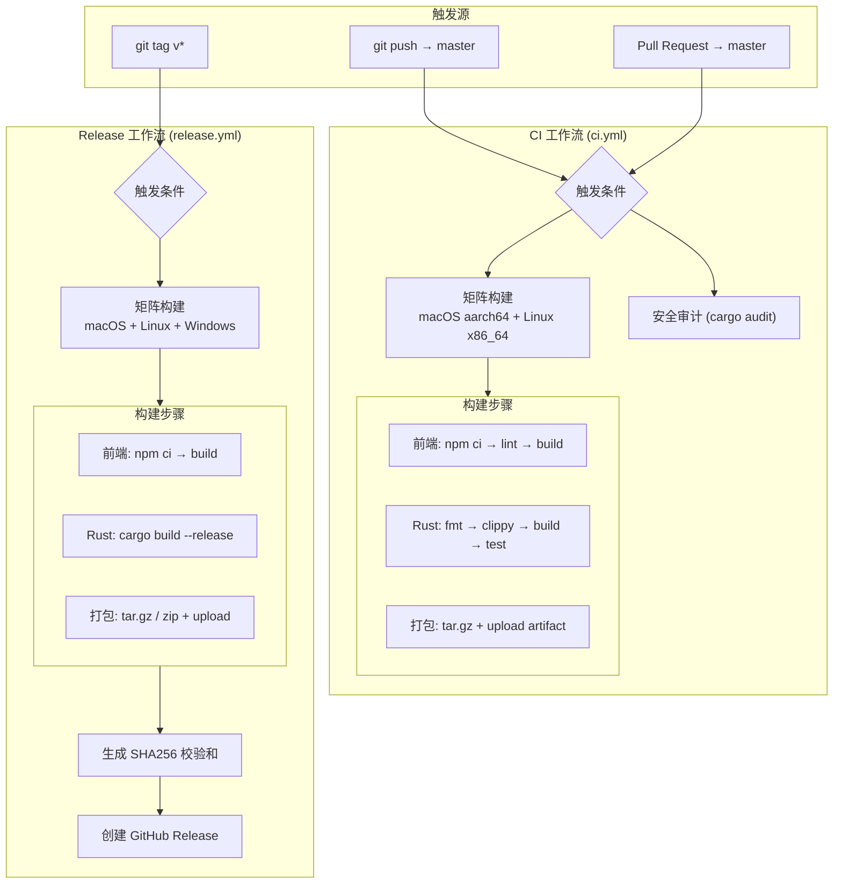
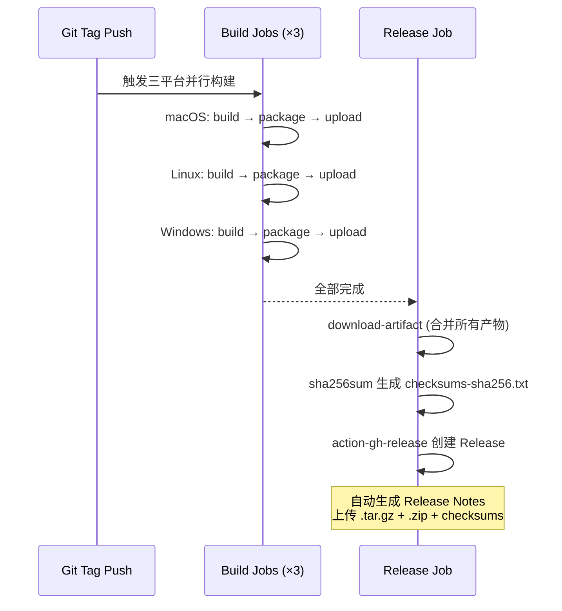
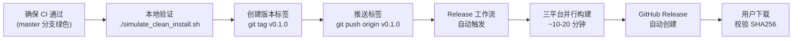

Dora Manager 的持续集成与持续发布体系由两个 GitHub Actions 工作流驱动——**CI 工作流**负责每次推送和 Pull Request 的全量质量门禁，**Release 工作流**负责在版本标签推送时自动构建跨平台发布产物并创建 GitHub Release。两条管线覆盖了前端 SvelteKit 构建、Rust 编译与静态分析、多平台产物打包、安全审计、SHA256 校验和生成等完整环节，构成了从代码提交到用户可下载二进制文件的全自动化交付链路。

Sources: [ci.yml](https://github.com/l1veIn/dora-manager/blob/master/.github/workflows/ci.yml#L1-L120), [release.yml](https://github.com/l1veIn/dora-manager/blob/master/.github/workflows/release.yml#L1-L133)

## 整体架构：双工作流协作模型

整个 CI/CD 体系的核心设计原则是**职责分离**：CI 管线关注代码质量与正确性验证，Release 管线关注产物构建与版本发布。两者共享相似的前端/Rust 构建步骤，但在构建模式（debug vs release）、触发条件和产出物管理上存在本质差异。



Sources: [ci.yml](https://github.com/l1veIn/dora-manager/blob/master/.github/workflows/ci.yml#L1-L11), [release.yml](https://github.com/l1veIn/dora-manager/blob/master/.github/workflows/release.yml#L1-L15)

## CI 工作流：持续集成质量门禁

### 触发策略与环境配置

CI 工作流在 `push` 和 `pull_request` 两种事件上触发，目标分支均为 `master`。全局环境变量设置了 `CARGO_TERM_COLOR=always`（保证 CI 日志中保留彩色输出）和 `RUSTFLAGS="-D warnings"`（将所有编译警告提升为编译错误），这一配置确保任何未通过 lint 的代码都无法通过 CI，从源头遏制技术债务的累积。

Sources: [ci.yml](https://github.com/l1veIn/dora-manager/blob/master/.github/workflows/ci.yml#L1-L11)

### 矩阵构建：跨平台并行验证

CI 工作流采用 **matrix strategy** 实现跨平台并行构建，当前配置了两个目标平台：

| 维度 | macOS 构建 | Linux 构建 | Windows 构建 |
|------|-----------|-----------|-------------|
| **Target** | `aarch64-apple-darwin` | `x86_64-unknown-linux-gnu` | — |
| **Runner** | `macos-latest` | `ubuntu-latest` | — |
| **产物格式** | `tar.gz` | `tar.gz` | — |
| **状态** | ✅ 已启用 | ✅ 已启用 | ⏳ 待修复路径分隔符问题 |

关键设计细节：`fail-fast: false` 确保即使某个平台构建失败，其他平台的构建仍会继续执行——这对诊断跨平台特定问题至关重要，否则一次失败就会掩盖其他平台上可能存在的不同问题。Windows 构建目前被注释掉，源码中标注了待修复的路径分隔符和 Unix 工具依赖问题。

Sources: [ci.yml](https://github.com/l1veIn/dora-manager/blob/master/.github/workflows/ci.yml#L13-L28)

### 构建流水线：从前端到 Rust 的完整检查链

每个矩阵实例的构建过程分为**前端阶段**和 **Rust 阶段**两个串行序列，前端先于 Rust 构建——这一顺序并非随意安排，而是因为 dm-server 在编译时通过 `rust-embed` crate 将 `web/build/` 目录的静态产物嵌入到二进制文件中（详见 [前后端联编：rust_embed 静态嵌入与发布流程](23-build-and-embed)）。如果前端未先构建，Rust 编译将嵌入空目录或不完整产物。

**前端阶段**执行三个步骤：`npm ci`（基于 `package-lock.json` 的确定性安装）→ `npm run lint`（Svelte 类型检查）→ `npm run build`（Vite 生产构建）。Node.js 版本锁定为 20，并配置了 npm 缓存以加速后续构建。

**Rust 阶段**执行四个步骤，形成质量递进的检查链：

| 步骤 | 命令 | 目的 |
|------|------|------|
| Format check | `cargo fmt --check` | 验证代码风格一致性 |
| Clippy | `cargo clippy --workspace --all-targets --target &lt;triple&gt;` | 静态分析 + 编译警告（配合 `-D warnings`） |
| Build | `cargo build --workspace --target &lt;triple&gt;` | Debug 模式编译全 workspace |
| Tests | `cargo test --workspace --target &lt;triple&gt;` | 运行全 workspace 测试套件 |

Rust 工具链通过 `dtolnay/rust-toolchain@stable` 安装，与仓库中的 `rust-toolchain.toml` 保持一致（stable channel + clippy + rustfmt 组件）。`Swatinem/rust-cache@v2` 按 target triple 缓存编译产物，显著减少增量构建时间。

Sources: [ci.yml](https://github.com/l1veIn/dora-manager/blob/master/.github/workflows/ci.yml#L29-L73), [rust-toolchain.toml](https://github.com/l1veIn/dora-manager/blob/master/rust-toolchain.toml)

### 产物打包与上传

构建完成后，CI 工作流会将二进制文件和前端产物打包为单一归档文件。打包逻辑根据操作系统分为 Unix（bash）和 Windows（PowerShell）两条路径，但当前仅 Unix 路径实际运行。打包内容包含 `dm`（CLI 工具）和 `dm-server`（HTTP 服务器）两个二进制文件，以及 `web_build/` 目录中的前端静态资源。产物通过 `actions/upload-artifact@v4` 上传，保留期为 7 天，命名格式为 `dora-manager-&lt;target-triple&gt;`。

Sources: [ci.yml](https://github.com/l1veIn/dora-manager/blob/master/.github/workflows/ci.yml#L75-L107)

### 安全审计：独立 Job

CI 工作流的第二个 Job 是 `audit`，它在 `ubuntu-latest` 上独立运行，执行 `cargo audit` 对 `Cargo.lock` 中所有依赖进行已知漏洞扫描。这个 Job 与构建 Job 是**并行关系**——它不依赖构建结果，而是独立检出代码、安装工具链后直接扫描。这种设计使得安全审计可以在构建仍在进行时就开始，缩短整体流水线时间。

Sources: [ci.yml](https://github.com/l1veIn/dora-manager/blob/master/.github/workflows/ci.yml#L109-L120)

## Release 工作流：跨平台版本发布

### 触发条件与权限模型

Release 工作流仅在推送匹配 `v*` 模式的 Git 标签时触发，例如 `v0.1.0`、`v1.2.3-beta`。与 CI 工作流不同，它显式声明了 `permissions: contents: write`，这是因为后续步骤需要通过 GitHub API 创建 Release 并上传附件——默认的 `GITHUB_TOKEN` 权限在较新的 GitHub Actions 中是只读的，必须显式提升。

Sources: [release.yml](https://github.com/l1veIn/dora-manager/blob/master/.github/workflows/release.yml#L1-L14)

### 三平台矩阵构建

Release 工作流的构建矩阵比 CI 多了 Windows 平台：

| 维度 | macOS | Linux | Windows |
|------|-------|-------|---------|
| **Target** | `aarch64-apple-darwin` | `x86_64-unknown-linux-gnu` | `x86_64-pc-windows-msvc` |
| **Runner** | `macos-latest` | `ubuntu-latest` | `windows-latest` |
| **产物格式** | `tar.gz` | `tar.gz` | `zip` |
| **二进制后缀** | 无 | 无 | `.exe` |

`binary_suffix` 矩阵变量的引入是一个精巧的设计——Windows 二进制文件带有 `.exe` 后缀，而 Unix 二进制没有。通过参数化后缀，打包步骤可以在同一模板中处理两种情况，避免为 Windows 维护一套完全独立的打包逻辑。

Sources: [release.yml](https://github.com/l1veIn/dora-manager/blob/master/.github/workflows/release.yml#L16-L35)

### Release 构建差异：省略 lint，专注产出

与 CI 工作流相比，Release 工作流的构建步骤有两个关键差异：**省略了 `cargo fmt --check` 和 `cargo clippy`**，以及**使用 `--release` Profile 编译**。省略 lint 的合理性在于，能触发 Release 的代码必定已经通过了 CI 管线（因为标签只能推送到已合并 PR 的分支上），重复检查是冗余的。Release Profile 在根 `Cargo.toml` 中进行了深度优化配置：

```toml
[profile.release]
lto = true           # 跨 crate 链接时优化，消除死代码
codegen-units = 1    # 单编译单元，最大化优化机会
strip = true         # 剥离调试符号，减小二进制体积
opt-level = 3        # 最高优化级别
```

这些配置的组合效果是产生体积最小、运行最快的二进制文件，代价是编译时间显著增加——这正是 Release 管线愿意付出的合理代价。

Sources: [release.yml](https://github.com/l1veIn/dora-manager/blob/master/.github/workflows/release.yml#L36-L64), [Cargo.toml](https://github.com/l1veIn/dora-manager/blob/master/Cargo.toml)

### 版本化打包与产物命名

Release 打包的命名模式为 `dora-manager-&lt;version&gt;-&lt;target-triple&gt;.&lt;ext&gt;`，例如 `dora-manager-v0.1.0-aarch64-apple-darwin.tar.gz`。版本号从 `GITHUB_REF_NAME` 环境变量中提取（即标签名本身），这确保了产物名称与 Git 标签的一一对应关系。打包结构将所有文件放入以版本号命名的子目录中：

```
dora-manager-v0.1.0-aarch64-apple-darwin.tar.gz
└── dora-manager-v0.1.0/
    ├── dm              # CLI 工具
    ├── dm-server       # HTTP 服务器（内嵌前端）
    └── web_build/      # 前端静态资源（备用）
```

产物通过 `actions/upload-artifact@v4` 上传，保留期仅 1 天——因为 Release Job 会立即消费这些产物。

Sources: [release.yml](https://github.com/l1veIn/dora-manager/blob/master/.github/workflows/release.yml#L66-L106)

### Release 创建：校验和与自动发布

Release 工作流的最终阶段是 `release` Job，它通过 `needs: build` 依赖所有矩阵构建完成后才执行。这个 Job 的流程是：下载所有构建产物 → 生成 SHA256 校验和 → 创建 GitHub Release。



校验和文件 `checksums-sha256.txt` 的生成使用标准 `sha256sum` 工具，用户下载产物后可以验证文件完整性。Release 创建使用 `softprops/action-gh-release@v2`，配合 `generate_release_notes: true` 自动从 Git 提交历史中提取变更日志——这意味着开发者只需推送标签，其余一切自动完成。

Sources: [release.yml](https://github.com/l1veIn/dora-manager/blob/master/.github/workflows/release.yml#L108-L133)

## 工作流配置要素对比

下表汇总了两个工作流在关键配置维度上的异同：

| 配置维度 | CI 工作流 | Release 工作流 |
|---------|----------|--------------|
| **触发条件** | push/PR → master | 推送 `v*` 标签 |
| **构建模式** | `debug`（无 `--release`） | `--release`（LTO + strip） |
| **平台覆盖** | macOS + Linux | macOS + Linux + Windows |
| **Rust 检查** | fmt + clippy + build + test | 仅 build |
| **前端检查** | lint + build | 仅 build |
| **产物保留** | 7 天 | 1 天（即用即弃） |
| **命名格式** | `dora-manager-&lt;target&gt;` | `dora-manager-&lt;version&gt;-&lt;target&gt;` |
| **安全审计** | ✅ 独立 Job | ❌ 不包含 |
| **产物发布** | Upload Artifact | Create GitHub Release |
| **校验和** | 不生成 | SHA256 校验和文件 |
| **权限** | 默认（只读） | `contents: write` |

Sources: [ci.yml](https://github.com/l1veIn/dora-manager/blob/master/.github/workflows/ci.yml#L1-L120), [release.yml](https://github.com/l1veIn/dora-manager/blob/master/.github/workflows/release.yml#L1-L133)

## 关键第三方 Actions 清单

两个工作流依赖以下社区 Actions，此处按用途分类说明：

| Action | 版本 | 用途 | 使用位置 |
|--------|------|------|---------|
| `actions/checkout` | v4 | 检出仓库代码 | CI + Release |
| `actions/setup-node` | v4 | 安装 Node.js 20 + npm 缓存 | CI + Release |
| `dtolnay/rust-toolchain` | stable | 安装 Rust 工具链 + 组件 | CI + Release |
| `Swatinem/rust-cache` | v2 | 缓存 Rust 编译产物 | CI + Release |
| `actions/upload-artifact` | v4 | 上传构建产物 | CI + Release |
| `actions/download-artifact` | v4 | 下载构建产物 | 仅 Release |
| `softprops/action-gh-release` | v2 | 创建 GitHub Release | 仅 Release |

`Swatinem/rust-cache` 的 `key` 参数值得注意：CI 使用 `key: $&#123;&#123; matrix.target &#125;&#125;`，而 Release 使用 `key: $&#123;&#123; matrix.target &#125;&#125;-release`——这意味着 debug 和 release 构建的缓存互不干扰，因为两者编译的中间产物在优化级别上存在根本差异。

Sources: [ci.yml](https://github.com/l1veIn/dora-manager/blob/master/.github/workflows/ci.yml#L30-L59), [release.yml](https://github.com/l1veIn/dora-manager/blob/master/.github/workflows/release.yml#L37-L61)

## 发布操作：从代码到 GitHub Release

对于项目维护者而言，一次完整的发布操作流程如下：



仓库中提供的 `simulate_clean_install.sh` 脚本是一个发布前的**端到端冒烟测试**工具：它在沙箱环境中模拟全新安装流程——备份现有 `~/.dm` 目录 → 构建前端 → 编译 Rust release 二进制 → 执行 `dm install` → 执行 `dm doctor` → 启动 `dm-server` → 验证 HTTP 端点返回 200。这个脚本确保发布产物在实际用户环境中能够正常工作。

Sources: [release.yml](https://github.com/l1veIn/dora-manager/blob/master/.github/workflows/release.yml#L1-L10), [simulate_clean_install.sh](https://github.com/l1veIn/dora-manager/blob/master/simulate_clean_install.sh)

## 已知限制与演进方向

当前 CI/CD 体系存在几个明确的待改进项，均已在代码注释中标记：

- **Windows CI 构建**：CI 矩阵中 Windows 目标已被注释，原因标注为"路径分隔符和 Unix 工具依赖"问题。Release 工作流中 Windows 构建是启用的，这意味着 Windows 支持在 release 模式下可用，但在日常 CI 质量门禁中未覆盖。
- **前端测试缺失**：`web/package.json` 中 `test` 脚本当前仅输出占位信息，前端尚无自动化测试覆盖。
- **Release Notes 质量**：依赖 `generate_release_notes: true` 自动生成，若项目未来需要更结构化的变更日志，可能需要引入 conventional commits 或 changelog 生成工具。

Sources: [ci.yml](https://github.com/l1veIn/dora-manager/blob/master/.github/workflows/ci.yml#L27-L28), [web/package.json](https://github.com/l1veIn/dora-manager/blob/master/web/package.json#L14-L15)

## 延伸阅读

- 了解 dm-server 如何在编译时嵌入前端产物：[前后端联编：rust_embed 静态嵌入与发布流程](23-build-and-embed)
- 了解三个 Rust crate 的分层设计：[整体架构：dm-core / dm-cli / dm-server 分层设计](07-architecture-overview)
- 了解本地开发环境的构建与热更新流程：[开发环境搭建与热更新工作流](03-dev-environment)