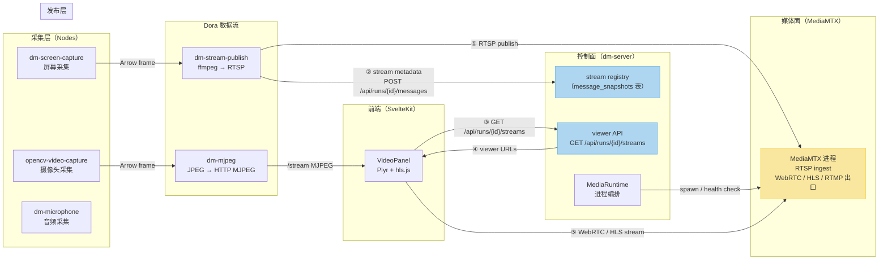
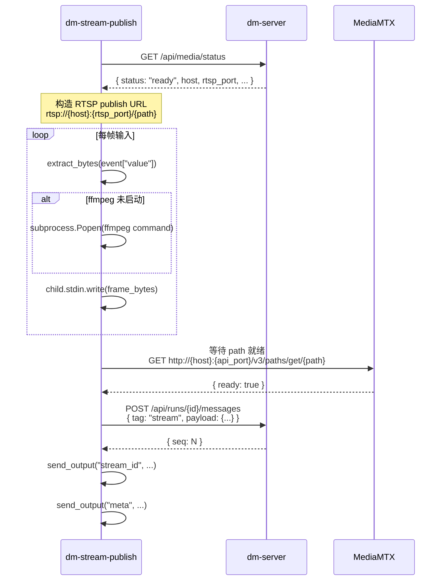
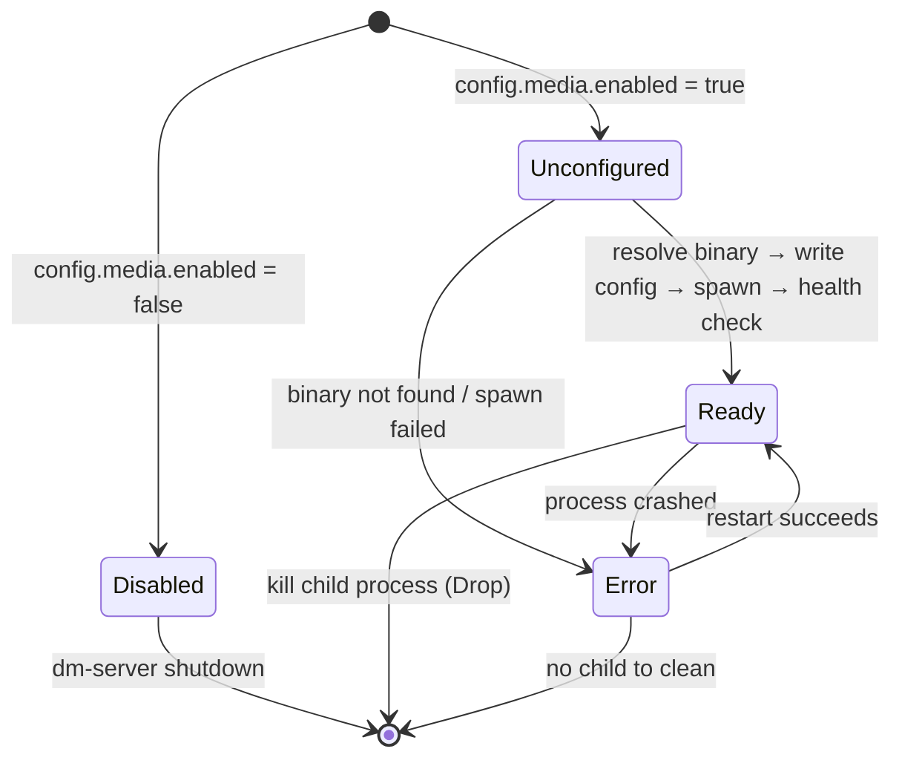
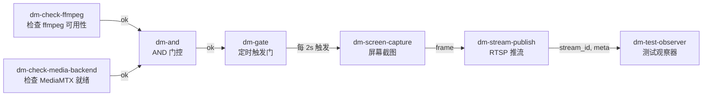

本文深入解析 Dora Manager 的媒体流体系——从节点层帧采集、经由 dm-server 控制面编排，到 MediaMTX 媒体面分发，最终在前端 VideoPanel 中播放的完整链路。你将理解为什么系统采用 **控制面与数据面分离** 的架构决策，以及 MJPEG 预览、RTSP 发布、WebRTC/HLS 播放各自的角色定位。

Sources: [dm-streaming-architecture.md](https://github.com/l1veIn/dora-manager/blob/main/docs/design/dm-streaming-architecture.md#L1-L48)

## 架构总览：控制面与数据面分离

Dora Manager 的媒体流架构遵循一个核心原则：**dm-server 只做控制面，不做媒体面**。这意味着 dm-server 负责流元数据的注册、查询和 viewer URL 生成，而实际的音视频帧搬运、协议转换、浏览器分发全部交给专业的媒体服务器 MediaMTX 处理。

下面的架构图展示了从采集到播放的完整数据流路径：



**核心数据流**：采集节点发出 Arrow 帧到 Dora 数据流 → `dm-stream-publish` 将帧通过 ffmpeg 编码并 RTSP 推流到 MediaMTX → 同时通过 HTTP API 向 dm-server 注册 stream 元数据 → 前端 VideoPanel 查询 viewer API 获取播放地址 → 最终从 MediaMTX 拉取 WebRTC 或 HLS 流播放。

Sources: [dm-streaming-architecture.md](https://github.com/l1veIn/dora-manager/blob/main/docs/design/dm-streaming-architecture.md#L56-L80), [dm-server-mediamtx-integration.md](https://github.com/l1veIn/dora-manager/blob/main/docs/design/dm-server-mediamtx-integration.md#L65-L82)

## 双轨策略：MJPEG 预览 vs. 正式流媒体

系统同时存在两条媒体通路，分别服务于不同场景：

| 维度 | MJPEG 预览（dm-mjpeg） | 正式流媒体（dm-stream-publish + MediaMTX） |
|---|---|---|
| **定位** | 调试、零依赖预览 | 生产级实时流分发 |
| **协议** | MJPEG over HTTP（`multipart/x-mixed-replace`） | RTSP ingest → WebRTC / HLS 出口 |
| **前端复杂度** | 零（`` 标签即可） | 中（需 hls.js / Plyr 播放器） |
| **延迟** | ~1 帧 | WebRTC 最低；HLS 2-10 秒 |
| **音视频同步** | 无（纯视频） | 支持 |
| **多客户端** | 受限（无鉴权、无会话管理） | 完整的 publish/subscribe 模型 |
| **扩展性** | 无 | 可扩展到音频、点云、3D 场景 |

**MJPEG 不适合作为流媒体基础设施**，因为它缺少多协议能力、鉴权与会话编排、转发桥接以及录制回放能力。但在"快速验证帧数据是否到达"这种调试场景下，MJPEG 的零依赖、高可靠性仍然是最佳选择。

Sources: [dm-streaming-architecture.md](https://github.com/l1veIn/dora-manager/blob/main/docs/design/dm-streaming-architecture.md#L50-L68), [dm-mjpeg.md](https://github.com/l1veIn/dora-manager/blob/main/docs/design/dm-mjpeg.md#L33-L49)

## dm-mjpeg 节点：轻量级 MJPEG 预览服务

`dm-mjpeg` 是一个 Rust 编写的 sink 适配器节点，将 Dora 数据流中的视频帧暴露为 MJPEG over HTTP 端点。它的定位是**预览节点**——接收帧、缩放编码为 JPEG、对外提供 `/stream` 实时预览——不负责录制、归档或转码。

### 内部架构

节点采用**双线程 + 异步通道**架构：一个阻塞线程运行 Dora 事件循环接收帧数据，通过 `mpsc::unbounded_channel` 将帧发送到 Tokio 异步运行时；异步运行时中的 `FrameProcessor` 负责帧率限制和 JPEG 编码，编码后的帧存入 `StreamState`（基于 `tokio::sync::watch` 的单写多读通道），最后由 Axum HTTP 服务器消费。

```
Dora 事件循环 (blocking thread)
  → Event::Input { id: "frame", data, metadata }
  → extract_frame() → IncomingFrame
  → mpsc::unbounded_channel 传递
  ↓
Tokio FrameProcessor (async task)
  → 帧率检查（max_fps 节流）
  → encode_frame() → JPEG 编码
  → StreamState::update() → watch channel
  ↓
Axum HTTP Server
  → GET /stream → multipart 响应，逐帧推送最新 JPEG
  → GET /snapshot.jpg → 返回最新单帧
  → GET /healthz → 存活检查
```

关键设计细节：`StreamState` 维护一个原子"最新 JPEG 帧"槽位（`Arc<RwLock<Option<Arc<EncodedFrame>>>>`），慢客户端不会导致无界队列积压——当客户端消费速度慢于生产速度时，服务器跳过旧帧只发送最新帧。`/stream` 端点使用 `async_stream` 生成器构建 SSE 风格的 multipart 响应体，每个 chunk 由 `--frame` 分隔符包裹。

Sources: [main.rs](https://github.com/l1veIn/dora-manager/blob/main/nodes/dm-mjpeg/src/main.rs#L10-L35), [lib.rs](https://github.com/l1veIn/dora-manager/blob/main/nodes/dm-mjpeg/src/lib.rs#L108-L145)

### 支持的输入格式

| 格式 | 说明 | 要求 |
|---|---|---|
| `jpeg` | 完整 JPEG 字节流，可直通或重编码 | 无 |
| `rgb8` | `width × height × 3` 紧密排列的 RGB 数据 | 必须提供 width/height |
| `rgba8` | `width × height × 4` 紧密排列的 RGBA 数据 | 必须提供 width/height |
| `yuv420p` | 平面 YUV420 数据 | 必须提供 width/height |

YUV420p 到 RGB 的转换使用标准 BT.601 系数：`R = Y + 1.402V`、`G = Y - 0.344U - 0.714V`、`B = Y + 1.772U`，逐像素计算后 clamp 到 [0, 255]。

Sources: [lib.rs](https://github.com/l1veIn/dora-manager/blob/main/nodes/dm-mjpeg/src/lib.rs#L309-L355)

### 配置参数

所有配置通过环境变量传入（dm.json 的 `config_schema` 映射到环境变量）：

| 参数 | 环境变量 | 默认值 | 说明 |
|---|---|---|---|
| `host` | `HOST` | `127.0.0.1` | HTTP 监听地址 |
| `port` | `PORT` | `4567` | HTTP 监听端口 |
| `quality` | `QUALITY` | `80` | JPEG 压缩质量 (1-100) |
| `max_fps` | `MAX_FPS` | `30` | 最大帧率 |
| `width` | `WIDTH` | `0`（原始） | 缩放宽度 |
| `height` | `HEIGHT` | `0`（原始） | 缩放高度 |
| `input_format` | `INPUT_FORMAT` | `jpeg` | 输入像素格式 |
| `drop_if_no_client` | `DROP_IF_NO_CLIENT` | `true` | 无客户端时仅保留最新帧 |
| `allow_origin` | `ALLOW_ORIGIN` | 空（无 CORS） | CORS 头值 |

Sources: [dm.json](https://github.com/l1veIn/dora-manager/blob/main/nodes/dm-mjpeg/dm.json#L61-L101), [main.rs](https://github.com/l1veIn/dora-manager/blob/main/nodes/dm-mjpeg/src/main.rs#L38-L54)

## dm-stream-publish 节点：RTSP 发布与流注册

`dm-stream-publish` 是整个正式流媒体管线的关键枢纽节点。它是一个 Python 节点，接收上游的编码帧数据，通过 **ffmpeg 子进程** 编码为 H.264 并推流到 MediaMTX 的 RTSP 入口，同时向 dm-server 注册流元数据。

### 启动与初始化流程



节点在启动时首先调用 `GET /api/media/status` 确认 MediaMTX 后端已就绪；若状态非 `ready` 则直接抛出异常退出。构造的 RTSP 发布路径遵循 run-scoped 命名规则：`run-{run_id}--{node_id}--{stream_name}`，确保不同运行实例之间的路径不会冲突。

Sources: [main.py](https://github.com/l1veIn/dora-manager/blob/main/nodes/dm-stream-publish/dm_stream_publish/main.py#L157-L220)

### ffmpeg 编码管线

`dm-stream-publish` 构建的 ffmpeg 命令行采用最低延迟配置：

```
ffmpeg -hide_banner -loglevel warning
  -fflags nobuffer -flags low_delay
  -f image2pipe -framerate {fps} -vcodec {input_codec} -i -
  -an -c:v libx264 -preset veryfast -tune zerolatency
  -pix_fmt yuv420p -muxdelay 0.1
  -rtsp_transport tcp -f rtsp {publish_url}
```

关键参数解析：
- **`-f image2pipe -i -`**：从 stdin 逐帧读取图片数据（PNG 或 JPEG）
- **`-preset veryfast -tune zerolatency`**：H.264 编码以极低延迟为优先目标
- **`-rtsp_transport tcp`**：使用 TCP 传输 RTSP，比 UDP 更可靠
- **`-muxdelay 0.1`**：最小化复用延迟

Sources: [main.py](https://github.com/l1veIn/dora-manager/blob/main/nodes/dm-stream-publish/dm_stream_publish/main.py#L100-L119)

### stream message 协议

当 ffmpeg 成功推流后，`dm-stream-publish` 向 dm-server 发送一条 `tag = "stream"` 的消息，payload 遵循统一的 stream message schema v1：

```json
{
  "kind": "video",
  "stream_id": "screen-live-publish/main",
  "label": "Live Screen",
  "path": "run-abc123--screen-live-publish--main",
  "live": true,
  "codec": "h264",
  "width": 1280,
  "height": 720,
  "fps": 5,
  "transport": {
    "publish": "rtsp",
    "play": ["webrtc", "hls"]
  }
}
```

`path` 是 MediaMTX 中的路径标识，`transport.play` 声明可用的播放协议列表。dm-server 收到此消息后，将其存入 `message_snapshots` 表（以 `node_id + tag` 为主键的 upsert），后续前端通过 stream viewer API 查询时，server 根据 `path` 和 MediaMTX 配置自动生成 WebRTC/HLS 的完整播放 URL。

Sources: [dm-screen-stream-node.md](https://github.com/l1veIn/dora-manager/blob/main/docs/design/dm-screen-stream-node.md#L14-L49), [messages.rs](https://github.com/l1veIn/dora-manager/blob/main/crates/dm-server/src/handlers/messages.rs#L420-L458)

## dm-server MediaMTX 集成：媒体运行时编排

dm-server 对 MediaMTX 的集成采用**外部二进制编排**模式：MediaMTX 不是嵌入的 Rust crate，而是由 dm-server 下载、配置、启动和监控的独立进程。

### MediaRuntime 生命周期



`MediaRuntime` 是 dm-server 启动时在 `main.rs` 中初始化并挂载到 `AppState.media` 的核心服务。它的 `initialize()` 方法执行以下流程：

1. **解析二进制路径**：依次检查 `DM_MEDIAMTX_PATH` 环境变量 → `config.toml` 中的 `mediamtx.path` → 自动下载
2. **生成运行时配置**：写入 `<DM_HOME>/runtime/mediamtx.generated.yml`，配置 API、RTSP、HLS、WebRTC 端口
3. **启动子进程**：使用 `tokio::process::Command` spawn MediaMTX
4. **等待就绪**：250ms 延迟后标记状态为 `Ready`

**关键降级策略**：MediaMTX 启动失败**不会阻塞 dm-server 主功能**。交互系统、面板系统、运行管理等功能正常运行，只是 streaming 相关能力标记为 `unavailable`。

Sources: [media.rs](https://github.com/l1veIn/dora-manager/blob/main/crates/dm-server/src/services/media.rs#L79-L218), [main.rs](https://github.com/l1veIn/dora-manager/blob/main/crates/dm-server/src/main.rs#L60-L64)

### 二进制解析策略

dm-server 按以下优先级解析 MediaMTX 二进制路径：

| 优先级 | 来源 | 说明 |
|---|---|---|
| 1 | `DM_MEDIAMTX_PATH` 环境变量 | 显式指定路径，最高优先 |
| 2 | `config.toml` → `mediamtx.path` | 配置文件中的路径 |
| 3 | 自动下载 | 从 GitHub Release 下载到本地缓存 |

自动下载流程从 GitHub API 获取指定版本的 release 资产，根据当前平台（`OS + ARCH`）选择匹配的压缩包，下载后解压到版本化缓存目录 `<DM_HOME>/bin/mediamtx/<version>/<platform>/mediamtx`。例如 macOS ARM64 平台缓存路径为 `~/.dm/bin/mediamtx/v1.11.1/darwin-arm64/mediamtx`。

Sources: [media.rs](https://github.com/l1veIn/dora-manager/blob/main/crates/dm-server/src/services/media.rs#L168-L297)

### 生成的 MediaMTX 配置

dm-server 根据 `config.toml` 中的端口配置动态生成 MediaMTX 配置文件：

```yaml
api: yes
apiAddress: 127.0.0.1:9997
rtspAddress: :8554
hls: yes
hlsAddress: :8888
webrtc: yes
webrtcAddress: :8889
paths:
  all:
    source: publisher
```

`paths.all.source: publisher` 表示所有路径都接受外部推流——这是第一版的简化策略，run 维度的隔离通过路径命名（`run-{id}--{node}--{stream}`）实现，而非 MediaMTX 内部的鉴权机制。

Sources: [media.rs](https://github.com/l1veIn/dora-manager/blob/main/crates/dm-server/src/services/media.rs#L337-L353)

### 配置体系

dm-server 的媒体配置存储在 `<DM_HOME>/config.toml` 中：

```toml
[media]
enabled = true
backend = "mediamtx"

[media.mediamtx]
path = "/path/to/mediamtx"     # 可选，显式二进制路径
version = "v1.11.1"            # 可选，指定下载版本
auto_download = true            # 是否自动下载
api_port = 9997                 # MediaMTX API 端口
rtsp_port = 8554                # RTSP 端口
hls_port = 8888                 # HLS 端口
webrtc_port = 8889              # WebRTC 端口
host = "127.0.0.1"              # MediaMTX 监听地址
public_host = "192.168.1.100"   # 可选，前端访问用的公网地址
public_webrtc_url = ""          # 可选，覆盖 WebRTC URL 计算
public_hls_url = ""             # 可选，覆盖 HLS URL 计算
```

`public_host` / `public_webrtc_url` / `public_hls_url` 用于部署场景：当 dm-server 与前端不在同一台机器时，前端需要用公网可达的地址访问 MediaMTX，而非 `127.0.0.1`。

Sources: [config.rs](https://github.com/l1veIn/dora-manager/blob/main/crates/dm-core/src/config.rs#L14-L112)

## Stream Viewer API：从前端查询到播放

dm-server 提供两个核心 API 端点，让前端获取可播放的流地址：

### GET /api/runs/{id}/streams

返回指定运行实例下所有已注册流的完整描述，包含 viewer 信息：

```json
{
  "streams": [
    {
      "stream_id": "screen-live-publish/main",
      "from": "screen-live-publish",
      "kind": "video",
      "label": "Live Screen",
      "path": "run-abc123--screen-live-publish--main",
      "live": true,
      "codec": "h264",
      "width": 1280,
      "height": 720,
      "fps": 5,
      "viewer": {
        "preferred": "webrtc",
        "webrtc_url": "http://127.0.0.1:8889/run-abc123--screen-live-publish--main",
        "hls_url": "http://127.0.0.1:8888/run-abc123--screen-live-publish--main/index.m3u8"
      }
    }
  ]
}
```

**viewer URL 的生成逻辑**在 `stream_descriptor_from_snapshot` 函数中实现：只有当 `MediaBackendStatus` 为 `Ready` 时才会填充 `viewer` 对象，否则返回 `null`。URL 的拼接使用 `MediaRuntime` 的 `hls_base_url()` / `webrtc_base_url()` 方法，这些方法会优先使用 `public_hls_url` / `public_webrtc_url` 配置，其次根据 `public_host` 或 `host` + 端口号动态构造。

### GET /api/media/status

返回媒体后端的整体状态：

```json
{
  "backend": "mediamtx",
  "status": "ready",
  "enabled": true,
  "binary_path": "/Users/xxx/.dm/bin/mediamtx/v1.11.1/darwin-arm64/mediamtx",
  "host": "127.0.0.1",
  "api_port": 9997,
  "rtsp_port": 8554,
  "hls_port": 8888,
  "webrtc_port": 8889,
  "message": "MediaMTX 1.11.1 ready via download"
}
```

Sources: [messages.rs](https://github.com/l1veIn/dora-manager/blob/main/crates/dm-server/src/handlers/messages.rs#L82-L130), [system.rs](https://github.com/l1veIn/dora-manager/blob/main/crates/dm-server/src/handlers/system.rs#L45-L53)

## 前端 VideoPanel：HLS 播放与流订阅

前端通过 `VideoPanel` 面板组件消费流媒体数据。这个面板在 Panel Registry 中注册为 `video` 类型，数据源模式为 `snapshot`（订阅 `stream` tag 的最新快照）。

### 双模式设计

VideoPanel 支持两种工作模式：

- **Manual 模式**：用户手动输入 HLS/视频 URL，直接播放任意流地址
- **Message 模式**：自动订阅当前 run 中所有 `tag = "stream"` 的消息快照，从中提取播放地址

在 Message 模式下，VideoPanel 从 `context.snapshots` 中筛选 `tag === "stream"` 的快照，按 `seq` 降序排列后，依次尝试从 payload 中提取播放源：

```mermaid
flowchart TD
    A[stream snapshot payload] --> B{有 payload.sources 数组?}
    B -- 是 --> C[遍历 sources 提取 URL]
    B -- 否 --> D{有 payload.url 或 payload.src?}
    D -- 是 --> E[提取为 Primary Source]
    D -- 否 --> F{有 payload.hls_url?}
    F -- 是 --> G[提取为 HLS Source]
    F -- 否 --> H{有 payload.viewer.hls_url?}
    H -- 是 --> I[提取为 Viewer HLS]
    H -- 否 --> J{有 payload.path?}
    J -- 是 --> K[构造 Legacy HLS URL<br/>hostname:8888/{path}/index.m3u8]
    J -- 否 --> L[无可用源]
```

这个多级回退机制确保了无论节点发送的是完整的 viewer 信息、直接的 HLS URL、还是仅发送 MediaMTX path，VideoPanel 都能找到可播放的地址。

Sources: [VideoPanel.svelte](https://github.com/l1veIn/dora-manager/blob/main/web/src/lib/components/workspace/panels/video/VideoPanel.svelte#L75-L141)

### PlyrPlayer：基于 hls.js 的播放引擎

`PlyrPlayer` 是封装了 Plyr 播放器 + hls.js 的底层播放组件：

- **HLS 流**：使用 `hls.js` 库进行分片加载和解码，配置了 `enableWorker: true` 和零重试策略（`manifestLoadingMaxRetry: 0`），确保在流不可用时快速反馈错误而非长时间等待
- **原生视频/音频**：直接设置 `<video>` 或 `<audio>` 元素的 `src` 属性
- **错误处理**：hls.js 的 `fatal error` 和 media 元素的 `error` 事件都会显示在播放器底部的错误横幅中

Sources: [PlyrPlayer.svelte](https://github.com/l1veIn/dora-manager/blob/main/web/src/lib/components/workspace/panels/video/PlyrPlayer.svelte#L30-L92)

### Panel Registry 中的注册

VideoPanel 在面板注册表中以 `sourceMode: "snapshot"` 注册，监听 `stream` tag 的消息：

```typescript
video: {
    kind: "video",
    title: "Plyr",
    dotClass: "bg-rose-500",
    sourceMode: "snapshot",
    supportedTags: ["stream"],
    defaultConfig: {
        mode: "manual",
        nodeId: "*",
        selectedSourceId: "",
        src: "",
        sourceType: "hls",
        autoplay: false,
        muted: true,
        poster: "",
        nodes: ["*"],
        tags: ["stream"],
    },
    component: VideoPanel,
}
```

用户在运行工作台中添加 Video 面板时，默认处于 Manual 模式；切换到 Message 模式后，面板自动订阅 run 的 stream 消息并展示可用源列表。

Sources: [registry.ts](https://github.com/l1veIn/dora-manager/blob/main/web/src/lib/components/workspace/panels/registry.ts#L45-L67)

## 完整数据流管线示例

`system-test-stream.yml` 系统测试数据流展示了完整的流媒体管线编排：



这个数据流实现了一个**门控启动**模式：只有当 ffmpeg 和 MediaMTX 都就绪后，才开始周期性采集屏幕帧并推流。`dm-gate` 节点在 `enabled` 输入为真时，才将定时器信号传递给下游的 `dm-screen-capture`，避免在媒体基础设施未就绪时浪费采集资源。

Sources: [system-test-stream.yml](https://github.com/l1veIn/dora-manager/blob/main/tests/dataflows/system-test-stream.yml#L1-L77)

## Stream 元数据的存储与查询

dm-server 的流元数据存储**复用现有消息体系**，而非独立建表。`dm-stream-publish` 发送的 `tag = "stream"` 消息写入 `messages` 表，同时在 `message_snapshots` 表中以 `(node_id, tag)` 为键进行 upsert——这意味着每个节点的每个 tag 只保留最新的快照。

`MessageService` 的 `stream_snapshots()` 方法从 `message_snapshots` 中过滤 `tag = "stream"` 的记录：

```rust
pub fn stream_snapshots(&self) -> Result<Vec<MessageSnapshot>> {
    Ok(self.snapshots()?
        .into_iter()
        .filter(|snapshot| snapshot.tag == "stream")
        .collect())
}
```

`list_streams` handler 调用此方法后，再通过 `stream_descriptor_from_snapshot` 将原始快照转换为包含 viewer URL 的 `StreamDescriptor`。这种设计使得第一版不需要新的数据库表，只有当未来需要更复杂的流索引时才考虑独立存储。

Sources: [message.rs](https://github.com/l1veIn/dora-manager/blob/main/crates/dm-server/src/services/message.rs#L285-L292), [messages.rs](https://github.com/l1veIn/dora-manager/blob/main/crates/dm-server/src/handlers/messages.rs#L82-L108)

## 架构优势与扩展方向

### 已实现的架构优势

1. **控制面/数据面分离**：dm-server 不处理任何媒体帧字节，元数据和媒体流完全解耦
2. **降级容错**：MediaMTX 不可用时 dm-server 主功能不受影响
3. **面板系统兼容**：VideoPanel 是标准的 panel renderer，不破坏现有 Workspace 架构
4. **跨平台支持**：MediaMTX 二进制按 `OS + ARCH` 下载缓存，覆盖 macOS / Linux / Windows
5. **统一 stream 协议**：`kind` 字段预留了 `audio`、`pointcloud`、`scene3d` 扩展空间

### 尚未实现的扩展方向

| 方向 | 当前状态 | 所需变更 |
|---|---|---|
| 音频流（AudioPanel） | 协议预留 `kind = "audio"` | 新增 dm-microphone → dm-stream-publish 音频管线 |
| 点云流（PointCloudPanel） | 协议预留 `kind = "pointcloud"` | 新增专用渲染面板 |
| 录制/回放 UI | 未实现 | MediaMTX 已支持录制，需前端管理界面 |
| TURN 自动部署 | 未实现 | WebRTC 穿越复杂网络环境 |
| 下载校验和验证 | 未实现 | 校验 GitHub Release asset 的 checksum |

Sources: [dm-streaming-architecture.md](https://github.com/l1veIn/dora-manager/blob/main/docs/design/dm-streaming-architecture.md#L200-L226), [dm-streaming-implementation-checklist.md](https://github.com/l1veIn/dora-manager/blob/main/docs/design/dm-streaming-implementation-checklist.md#L50-L58)

---

**前置阅读**：理解本文需要先掌握 [交互系统架构：dm-input / dm-message / Bridge 节点注入原理](22-jiao-hu-xi-tong-jia-gou-dm-input-dm-message-bridge-jie-dian-zhu-ru-yuan-li) 中的消息系统基础，以及 [运行时服务：启动编排、状态刷新与 CPU/内存指标采集](13-yun-xing-shi-fu-wu-qi-dong-bian-pai-zhuang-tai-shua-xin-yu-cpu-nei-cun-zhi-biao-cai-ji) 中的运行实例生命周期。

**下一步深入**：若需了解节点安装与 dm.json 契约的完整字段定义，请参考 [内置节点总览：从媒体采集到 AI 推理](7-nei-zhi-jie-dian-zong-lan-cong-mei-ti-cai-ji-dao-ai-tui-li)；若需了解前端面板系统的整体设计，请参考 [运行工作台：网格布局、面板系统与实时日志查看](19-yun-xing-gong-zuo-tai-wang-ge-bu-ju-mian-ban-xi-tong-yu-shi-shi-ri-zhi-cha-kan)。