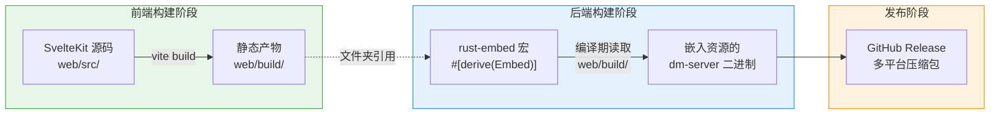
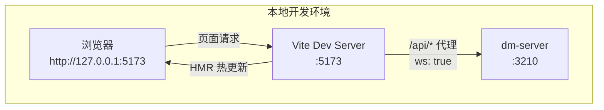
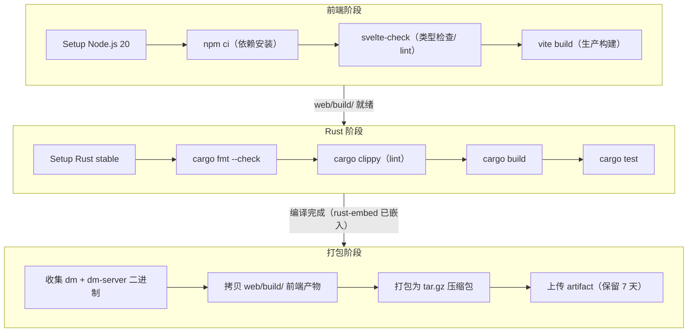
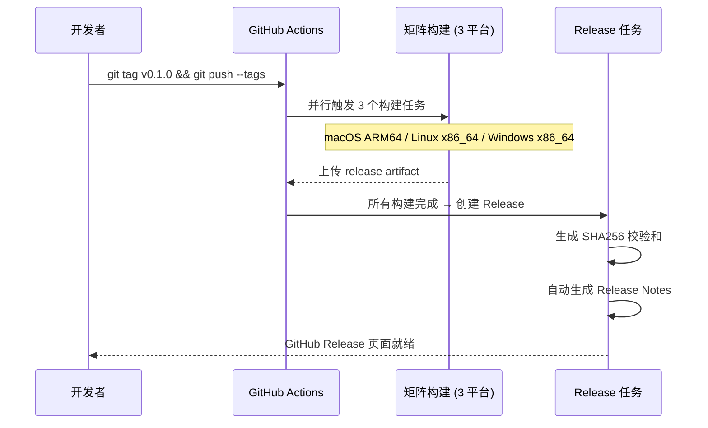

Dora Manager 采用 **单二进制部署** 模式——SvelteKit 前端在构建阶段编译为纯静态文件，随后通过 `rust-embed` 在 Rust 编译期将其直接嵌入 `dm-server` 二进制。最终产物只有一个可执行文件，无需额外部署 Node.js 或 Nginx。本文将完整解析从 `npm run build` 到 GitHub Release 的全链路机制：前端静态化构建、编译期资源嵌入、SPA 回退服务、本地开发热更新工作流，以及跨平台 CI/CD 流水线的每个阶段。

Sources: [main.rs](https://github.com/l1veIn/dora-manager/blob/main/crates/dm-server/src/main.rs#L20-L22), [CHANGELOG.md](https://github.com/l1veIn/dora-manager/blob/main/CHANGELOG.md)

## 整体构建管线概览

在深入每个环节之前，先建立对完整管线的宏观认知。下面的 Mermaid 图展示了从源码到可发布二进制的完整数据流：



**关键设计决策**：选择编译期嵌入而非运行时读取文件系统，使得 `dm-server` 成为一个真正的**自包含二进制**——拷贝即部署，不存在前端文件丢失或路径不对齐的风险。代价是每次前端变更都需要重新编译后端，但这在 CI 环境中是自然发生的。

Sources: [main.rs](https://github.com/l1veIn/dora-manager/blob/main/crates/dm-server/src/main.rs#L20-L22), [Cargo.toml](https://github.com/l1veIn/dora-manager/blob/main/Cargo.toml)

## 前端静态化构建：SvelteKit adapter-static

SvelteKit 默认支持 SSR（服务端渲染）和 CSR（客户端渲染）等多种模式。Dora Manager 选择的是 **纯静态站点生成** 模式，这意味着构建产物是一组纯 HTML/CSS/JS 文件，不依赖任何 Node.js 运行时。

### adapter-static 配置

配置的核心在 [svelte.config.js](https://github.com/l1veIn/dora-manager/blob/main/web/svelte.config.js)：

```javascript
import adapter from '@sveltejs/adapter-static';

const config = {
    kit: {
        adapter: adapter({
            fallback: 'index.html'  // SPA 回退入口
        }),
        paths: {
            relative: false  // 使用绝对路径引用资源
        }
    }
};
```

两个关键参数的作用：

| 参数 | 值 | 作用 |
|---|---|---|
| `fallback` | `'index.html'` | 所有未匹配的路由请求回退到 `index.html`，实现 SPA 客户端路由 |
| `relative` | `false` | 资源引用使用绝对路径（如 `/_app/...`），避免嵌套路由下的路径解析错误 |

`fallback: 'index.html'` 是单页应用的关键——当用户直接访问 `/runs/abc123` 这样的 URL 时，服务器不需要知道这个路由，只需返回 `index.html`，由前端 JavaScript 负责解析和渲染对应页面。

### 构建产物

运行 `npm run build`（实际执行 `vite build`）后，所有产物输出到 `web/build/` 目录。该目录被 `.gitignore` 排除在版本控制之外，仅在构建时生成。构建流程在 [package.json](https://github.com/l1veIn/dora-manager/blob/main/web/package.json) 中定义，包含 `lint`（svelte-check 类型检查）和 `build`（vite 生产构建）两个关键步骤。

Sources: [svelte.config.js](https://github.com/l1veIn/dora-manager/blob/main/web/svelte.config.js#L1-L15), [package.json](https://github.com/l1veIn/dora-manager/blob/main/web/package.json#L7-L9), [.gitignore](https://github.com/l1veIn/dora-manager/blob/main/web/.gitignore#L3-L9)

## rust-embed 编译期嵌入机制

### 宏声明与文件夹映射

在 [main.rs](https://github.com/l1veIn/dora-manager/blob/main/crates/dm-server/src/main.rs#L20-L22) 中，`rust-embed` 通过过程宏在编译期将整个 `web/build/` 目录树嵌入二进制：

```rust
#[derive(Embed)]
#[folder = "../../web/build"]
struct WebAssets;
```

这个声明做了三件事：

1. **编译期文件读取**：`#[folder]` 属性指向相对于 `crates/dm-server/` 的路径 `../../web/build`，即项目根目录下的 `web/build/`。编译时，`rust-embed` 遍历该目录下所有文件，将其字节内容以常量形式编入二进制。
2. **零运行时开销**：所有文件内容存储在 ELF/Mach-O 的 `.rodata` 段，通过内存映射直接访问，无需额外的文件 I/O。
3. **API 封装**：生成的 `WebAssets` 类型提供 `get(path) -> Option<EmbeddedFile>` 方法，按路径检索嵌入文件。

### 依赖配置

`rust-embed` 在工作区级别的 [Cargo.toml](https://github.com/l1veIn/dora-manager/blob/main/Cargo.toml) 中声明：

```toml
rust-embed = { version = "8.11", features = ["axum"] }
mime_guess = "2"
```

`features = ["axum"]` 启用了与 Axum 框架的集成类型转换（`EmbeddedFile` 可直接转为 Axum 响应），而 `mime_guess` 用于根据文件扩展名推断 `Content-Type`。

**构建时序约束**：由于 `rust-embed` 在 Rust 编译阶段读取 `web/build/`，前端必须先于后端构建完成。这一顺序在 CI 流水线和发布流程中通过步骤排列严格保证。

Sources: [main.rs](https://github.com/l1veIn/dora-manager/blob/main/crates/dm-server/src/main.rs#L20-L22), [Cargo.toml](https://github.com/l1veIn/dora-manager/blob/main/Cargo.toml), [dm-server/Cargo.toml](https://github.com/l1veIn/dora-manager/blob/main/crates/dm-server/Cargo.toml#L24-L25)

## 静态资源服务与 SPA 回退

嵌入的前端资源通过 Axum 的 **fallback 路由** 提供服务。在 [main.rs](https://github.com/l1veIn/dora-manager/blob/main/crates/dm-server/src/main.rs#L234-L235) 的路由构建中：

```rust
let app = Router::new()
    .route("/api/...", ...)   // API 路由优先匹配
    .merge(SwaggerUi::new("/swagger-ui")...)
    .fallback(axum::routing::get(handlers::serve_web));  // 非API请求全部走这里
```

`fallback` 的语义是：所有未被 `/api/*` 路由或 Swagger 路由匹配的请求，都交给 `serve_web` 处理。这保证了 API 端点和前端资源互不冲突。

### serve_web 处理逻辑

[handlers/web.rs](https://github.com/l1veIn/dora-manager/blob/main/crates/dm-server/src/handlers/web.rs#L6-L27) 实现了经典的 SPA 回退模式：

```rust
pub async fn serve_web(uri: Uri) -> impl IntoResponse {
    let mut path = uri.path().trim_start_matches('/').to_string();
    if path.is_empty() {
        path = "index.html".to_string();
    }

    match WebAssets::get(&path) {
        Some(content) => {
            let mime = mime_guess::from_path(&path).first_or_octet_stream();
            ([(header::CONTENT_TYPE, mime.as_ref())], content.data).into_response()
        }
        None => {
            // SPA 回退：未匹配的路径返回 index.html
            if let Some(index) = WebAssets::get("index.html") {
                let mime = mime_guess::from_path("index.html").first_or_octet_stream();
                ([(header::CONTENT_TYPE, mime.as_ref())], index.data).into_response()
            } else {
                (StatusCode::NOT_FOUND, "404 Not Found").into_response()
            }
        }
    }
}
```

决策流程如下表：

| 请求路径 | `WebAssets::get()` 结果 | 返回 |
|---|---|---|
| `/` | 重写为 `index.html` → 匹配成功 | `index.html` + `text/html` |
| `/assets/app-abc.js` | 匹配成功 | JS 文件 + `application/javascript` |
| `/runs/xyz123` | 无对应文件 → **回退** | `index.html`（由前端路由接管） |
| `/nonexistent.css` | 无对应文件 → **回退** | `index.html`（优雅降级） |

`mime_guess::from_path()` 根据文件扩展名自动推断 MIME 类型（`.js` → `application/javascript`、`.css` → `text/css`、`.svg` → `image/svg+xml`），无法识别时回退到 `application/octet-stream`。

Sources: [handlers/web.rs](https://github.com/l1veIn/dora-manager/blob/main/crates/dm-server/src/handlers/web.rs#L1-L27), [main.rs](https://github.com/l1veIn/dora-manager/blob/main/crates/dm-server/src/main.rs#L234-L235)

## 本地开发工作流：dev.sh 双进程模式

在开发阶段，前端和后端独立运行，通过 Vite 开发服务器的代理机制通信。这一流程由 [dev.sh](https://github.com/l1veIn/dora-manager/blob/main/dev.sh) 脚本编排。

### 架构拓扑



Vite 开发服务器在 [vite.config.ts](https://github.com/l1veIn/dora-manager/blob/main/web/vite.config.ts#L7-L14) 中配置了代理规则：

```typescript
server: {
    proxy: {
        '/api': {
            target: 'http://127.0.0.1:3210',
            changeOrigin: true,
            ws: true    // WebSocket 代理
        }
    }
}
```

`ws: true` 是关键配置——它确保 WebSocket 连接（用于运行日志流和消息推送）也通过代理转发到后端，而不仅仅是 HTTP 请求。

### dev.sh 编排逻辑

[dev.sh](https://github.com/l1veIn/dora-manager/blob/main/dev.sh) 脚本按以下顺序编排双进程：

1. **前置检查**：验证 `cargo` 和 `node` 已安装
2. **后端启动**：`cargo run -p dm-server &` 启动 Rust 后端，等待端口 3210 就绪（超时 30 秒）
3. **前端启动**：`npm run dev -- --host 127.0.0.1 --port 5173` 启动 Vite 开发服务器
4. **智能复用**：如果检测到端口 3210 已被 `dm-server` 进程占用，则跳过后端启动，仅启动前端开发服务器
5. **优雅退出**：通过 `trap cleanup EXIT INT TERM` 捕获 Ctrl+C 信号，确保两个子进程都被正确终止

这种双进程模式的开发体验优于每次前端变更都要重新编译 Rust 二进制——前端代码的修改通过 Vite HMR 几乎即时生效，而后端 API 的变更只需重启 `dm-server`。

Sources: [dev.sh](https://github.com/l1veIn/dora-manager/blob/main/dev.sh), [vite.config.ts](https://github.com/l1veIn/dora-manager/blob/main/web/vite.config.ts#L7-L14)

## CI 流水线：构建验证与质量门禁

CI 流水线定义在 [.github/workflows/ci.yml](https://github.com/l1veIn/dora-manager/blob/main/.github/workflows/ci.yml) 中，在每次推送到 `master` 分支或创建 Pull Request 时自动触发。

### 矩阵构建策略

流水线使用 GitHub Actions 的 `matrix` 策略实现跨平台构建验证：

| 矩阵项 | target | runner | 说明 |
|---|---|---|---|
| macOS ARM64 | `aarch64-apple-darwin` | `macos-latest` | Apple Silicon 原生构建 |
| Linux x86_64 | `x86_64-unknown-linux-gnu` | `ubuntu-latest` | 标准 Linux 发行版 |
| Windows | *暂未启用* | — | 路径分隔符问题待修复 |

`fail-fast: false` 意味着某个平台的失败不会取消其他平台的构建，确保完整覆盖。

### 阶段执行顺序



值得注意的细节：

- **环境变量** `RUSTFLAGS: "-D warnings"` 将所有编译警告提升为错误，确保代码质量门禁
- **Rust 缓存**通过 `Swatinem/rust-cache@v2` 加速后续构建，以 `matrix.target` 作为缓存键
- **产物打包**虽然 `rust-embed` 已将前端嵌入二进制，但 CI 仍将 `web/build/` 单独打包到 `web_build/` 目录，供非嵌入场景使用

此外还有独立的 **Security Audit** 任务，使用 `cargo audit` 检查依赖中的已知安全漏洞。

Sources: [ci.yml](https://github.com/l1veIn/dora-manager/blob/main/.github/workflows/ci.yml#L1-L120)

## Release 流水线：跨平台二进制发布

Release 流水线定义在 [.github/workflows/release.yml](https://github.com/l1veIn/dora-manager/blob/main/.github/workflows/release.yml) 中，由 Git 标签推送触发（`v*` 模式匹配，如 `v0.1.0`）。

### 双阶段设计

Release 流水线采用 **build + release** 两阶段模式：



### 构建矩阵

| 平台 | target | archive 格式 | 二进制后缀 |
|---|---|---|---|
| macOS ARM64 | `aarch64-apple-darwin` | `.tar.gz` | （无） |
| Linux x86_64 | `x86_64-unknown-linux-gnu` | `.tar.gz` | （无） |
| Windows x86_64 | `x86_64-pc-windows-msvc` | `.zip` | `.exe` |

与 CI 流水线相比，Release 额外包含 Windows 平台，使用 `--release` 配置进行优化构建。

### 产物结构

每个平台的压缩包遵循统一的目录结构：

```
dora-manager-v0.1.0-aarch64-apple-darwin/
├── dm                    # CLI 工具
├── dm-server             # HTTP 服务器（含嵌入前端）
└── web_build/            # 前端静态文件（独立副本）
    ├── index.html
    └── ...
```

`dm-server` 二进制已通过 `rust-embed` 内嵌了完整的 `web/build/`，`web_build/` 目录的独立副本主要作为备用或调试参考。

### 发布优化 Profile

工作区 [Cargo.toml](https://github.com/l1veIn/dora-manager/blob/main/Cargo.toml) 中的 Release profile 配置确保最终产物经过深度优化：

```toml
[profile.release]
lto = true           # 链接时优化（跨 crate 内联）
codegen-units = 1     # 单代码生成单元（更好的优化，编译更慢）
strip = true          # 剥离调试符号（更小体积）
opt-level = 3         # 最高优化级别
```

这些设置显著减小二进制体积（`strip = true` 可减小 30-50%），同时通过 LTO 和单一 codegen-unit 提升运行时性能。代价是编译时间增长，但在 CI 环境中可以接受。

Sources: [release.yml](https://github.com/l1veIn/dora-manager/blob/main/.github/workflows/release.yml#L1-L133), [Cargo.toml](https://github.com/l1veIn/dora-manager/blob/main/Cargo.toml)

## 构建时序与常见问题排查

### 构建时序的关键约束

由于 `rust-embed` 在 Rust 编译期读取 `web/build/` 目录，构建顺序是不可变的：**前端必须先于后端构建**。若顺序颠倒，`rust-embed` 会因 `web/build/` 不存在而导致编译失败（默认行为下空目录不会报错，但产物中将无任何前端资源）。

这要求在任何本地手动构建时遵循：

```bash
# 1. 构建前端
cd web && npm ci && npm run build && cd ..

# 2. 构建后端
cargo build --release -p dm-server
```

### 快速参考表

| 场景 | 命令 | 说明 |
|---|---|---|
| 本地开发 | `./dev.sh` | 双进程热更新，无需重新编译 Rust |
| 手动生产构建 | 先 `cd web && npm run build`，再 `cargo build --release -p dm-server` | 前端先于后端 |
| 触发正式发布 | `git tag v0.x.x && git push --tags` | 自动触发 Release 流水线 |
| 验证嵌入效果 | `cargo run -p dm-server`，访问 `http://127.0.0.1:3210` | 应看到前端页面 |
| 查看 API 文档 | 访问 `http://127.0.0.1:3210/swagger-ui/` | Swagger UI 随服务启动 |

Sources: [dev.sh](https://github.com/l1veIn/dora-manager/blob/main/dev.sh), [CHANGELOG.md](https://github.com/l1veIn/dora-manager/blob/main/CHANGELOG.md)

## 延伸阅读

- [SvelteKit 项目结构：路由设计、API 通信层与状态管理](17-sveltekit-xiang-mu-jie-gou-lu-you-she-ji-api-tong-xin-ceng-yu-zhuang-tai-guan-li) — 理解前端 `web/src/` 的完整架构，联编时哪些目录会进入 `web/build/`
- [HTTP API 全览：REST 路由、WebSocket 实时通道与 Swagger 文档](15-http-api-quan-lan-rest-lu-you-websocket-shi-shi-tong-dao-yu-swagger-wen-dang) — API 路由与前端资源回退路由的优先级关系详解
- [开发环境搭建：从源码构建与热更新工作流](3-kai-fa-huan-jing-da-jian-cong-yuan-ma-gou-jian-yu-re-geng-xin-gong-zuo-liu) — `dev.sh` 的使用细节与环境配置
- [测试策略：单元测试、数据流集成测试与系统测试 CheckList](26-ce-shi-ce-lue-dan-yuan-ce-shi-shu-ju-liu-ji-cheng-ce-shi-yu-xi-tong-ce-shi-checklist) — CI 流水线中 `cargo test` 覆盖的测试层级