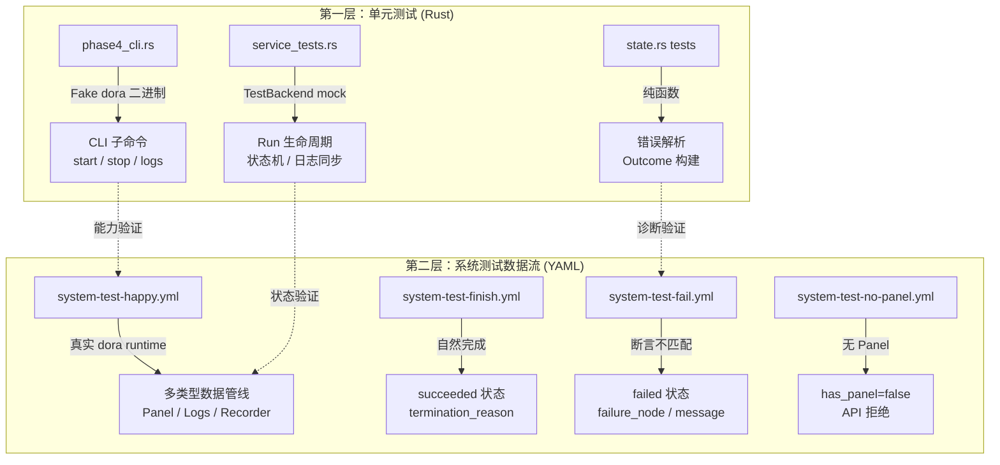
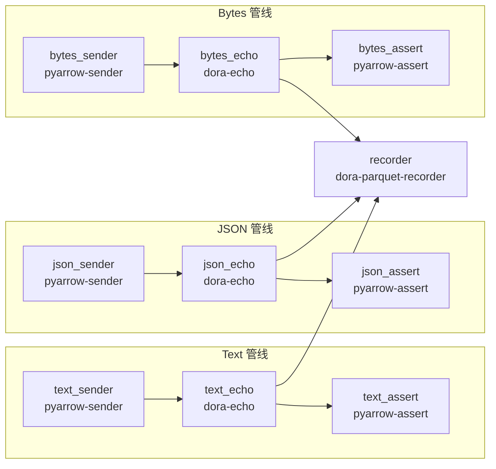
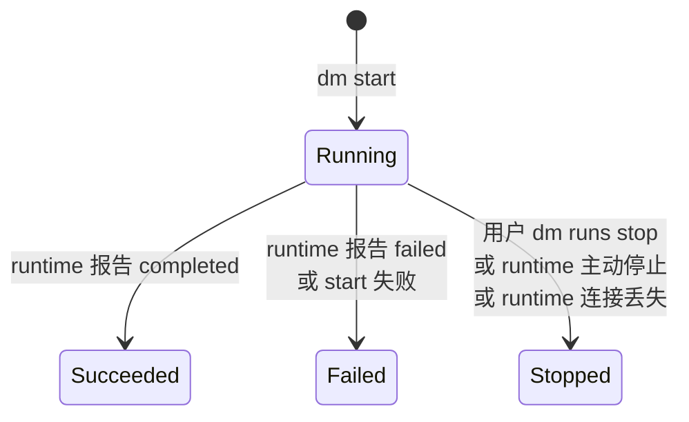
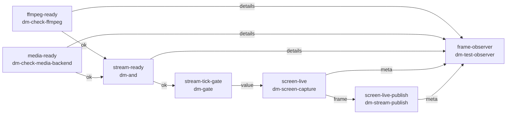

系统测试数据流是 Dora Manager 测试体系中**连接单元测试与真实运行时的桥梁层**。它不测业务逻辑（如 `qwen-dev.yml` 的 AI 推理管线），而是专注于验证 **run 生命周期管理、Panel 存储、日志系统、状态流转、失败诊断** 这五大核心运维场景是否端到端正确。本文档将系统阐述其设计哲学、测试矩阵、自定义测试节点架构，以及完整的验证 CheckList。

Sources: [system-test-dataflows-plan.md](https://github.com/l1veIn/dora-manager/blob/master/docs/system-test-dataflows-plan.md#L1-L19)

## 设计哲学：确定性优先的集成测试

Dora Manager 的系统测试数据流遵循一条核心原则：**确定性高于覆盖面**。这意味着测试套件优先使用合成数据（synthetic data）而非真实硬件输入，确保每一次 `dm start` 在几秒内产生可预测的结果。具体而言，设计围绕五条原则展开：

- **使用确定性节点**：`pyarrow-sender`、`pyarrow-assert`、`dora-echo` 等节点在给定输入下产生完全确定的输出，不依赖外部状态。
- **避免硬件依赖**：主测试套件不依赖麦克风、摄像头等本地硬件。媒体采集节点作为**第二阶段扩展**单独处理。
- **快速可重复**：happy-path 流程应在数秒内完成。
- **合成数据优先**：文本用字符串 `"system-test-text"`，JSON 用序列化字符串，二进制用固定的 PNG 文件头字节 `[137,80,78,71,13,10,26,10]`。
- **分层验证**：每个数据流验证一到两个特定场景，而非一个庞大数据流覆盖所有情况。

Sources: [system-test-dataflows-plan.md](https://github.com/l1veIn/dora-manager/blob/master/docs/system-test-dataflows-plan.md#L13-L19)

## 双层测试架构

Dora Manager 的测试体系由两个互补的层次构成，它们各自解决不同的问题域：



**第一层**是 Rust 单元/集成测试，运行在 `cargo test` 中，使用 mock 的 `TestBackend` 替代真实 Dora runtime，验证 CLI 解析、Run 状态机、错误提取等逻辑的正确性。**第二层**是系统测试数据流 YAML，运行在真实的 `dm start` 环境中，验证端到端的数据流执行、Panel 资产持久化、日志尾随等跨层交互。

Sources: [phase4_cli.rs](https://github.com/l1veIn/dora-manager/blob/master/crates/dm-cli/tests/phase4_cli.rs#L1-L13), [service_tests.rs](https://github.com/l1veIn/dora-manager/blob/master/crates/dm-core/src/runs/service_tests.rs#L1-L26), [state.rs](https://github.com/l1veIn/dora-manager/blob/master/crates/dm-core/src/runs/state.rs#L152-L183)

## 测试矩阵：八大数据流一览

当前 `tests/dataflows/` 目录包含 11 个 YAML 文件，其中 8 个属于系统测试套件（以 `system-test-` 前缀标识），另外 3 个用于交互演示和开发调试。下面的矩阵表展示了系统测试数据流的完整覆盖范围：

| 数据流 | 核心验证目标 | 节点数 | Panel | 终态 | 硬件依赖 |
|--------|-------------|--------|-------|------|----------|
| `system-test-happy` | 多类型数据管线 + Panel 集成 | 10 | ✅ | `stopped`（手动停止） | 无 |
| `system-test-finish` | 自然完成路径 | 3 | ❌ | `succeeded` | 无 |
| `system-test-fail` | 受控失败 + 诊断元数据 | 3 | ❌ | `failed` | 无 |
| `system-test-no-panel` | 无 Panel 显式路径 | 3 | ❌ | `succeeded` | 无 |
| `system-test-screen` | 截图资产持久化 | 1 | ✅ | `succeeded` | macOS 截图权限 |
| `system-test-audio` | 音频资产持久化 | 1 | ✅ | `succeeded` | 麦克风 |
| `system-test-stream` | 流媒体管线编排 | 6 | ❌ | 长运行 | ffmpeg + mediamtx |
| `system-test-downloader` | 下载节点功能验证 | 1 | ❌ | 长运行 | 网络 |
| `system-test-full` | 多模态联合（VAD + 截图 + 音频） | 4 | ✅ | 长运行 | 麦克风 + 截图 |

前四个（happy / finish / fail / no-panel）构成**主测试套件**，无硬件依赖，可在任何环境运行。后五个为**扩展测试套件**，需要特定硬件或网络条件。

Sources: [system-test-happy.yml](https://github.com/l1veIn/dora-manager/blob/master/tests/dataflows/system-test-happy.yml#L1-L83), [system-test-finish.yml](https://github.com/l1veIn/dora-manager/blob/master/tests/dataflows/system-test-finish.yml#L1-L25), [system-test-fail.yml](https://github.com/l1veIn/dora-manager/blob/master/tests/dataflows/system-test-fail.yml#L1-L25), [system-test-no-panel.yml](https://github.com/l1veIn/dora-manager/blob/master/tests/dataflows/system-test-no-panel.yml#L1-L25)

## 核心场景深度解析

### system-test-happy：多类型数据管线全面验证

这是最复杂的基础测试数据流，包含 10 个节点，形成三条并行管线（text / json / bytes），每条管线遵循 **sender → echo → assert** 三段式拓扑。其架构如下：



三条管线的关键设计意图是覆盖 Dora Manager 处理不同 Arrow 数据类型的能力：`text_sender` 发送纯文本 `'system-test-text'`，`json_sender` 发送序列化 JSON 字符串 `'{"kind":"system-test","value":1}'`，`bytes_sender` 发送模拟 PNG 文件头的整数数组 `[137,80,78,71,13,10,26,10,0,0,0,0]`。`recorder` 节点汇聚三条管线的输出，将数据持久化为 Parquet 文件，验证 `dora-parquet-recorder` 的多输入汇聚和文件存储行为。

Sources: [system-test-happy.yml](https://github.com/l1veIn/dora-manager/blob/master/tests/dataflows/system-test-happy.yml#L1-L83)

### system-test-finish：自然完成路径

最简洁的确定性测试，仅 3 个节点，验证数据流图在所有节点完成工作后**自然退出**的路径：

```
finish_sender → finish_echo → finish_assert
```

`pyarrow-sender` 是一次性的——它发送一条数据后退出。当图中的所有节点都退出后，Dora runtime 检测到数据流结束，将状态标记为 `succeeded`。此测试的核心验证点是 `termination_reason = completed`，即终止原因必须是通过完成而非用户停止。

Sources: [system-test-finish.yml](https://github.com/l1veIn/dora-manager/blob/master/tests/dataflows/system-test-finish.yml#L1-L25)

### system-test-fail：受控失败与诊断元数据

此数据流故意制造一个**断言不匹配**来验证失败路径的完整性：

```
fail_sender (发送 'system-test-actual')
  → fail_echo
    → fail_assert (期望 'system-test-expected')
```

`fail_sender` 发送 `'system-test-actual'`，但 `fail_assert` 配置为期望 `'system-test-expected'`。`pyarrow-assert` 节点检测到不匹配后会以非零退出码终止，Dora runtime 随后标记整个数据流为 `failed`。DM 的状态推断引擎 [`infer_failure_details`](https://github.com/l1veIn/dora-manager/blob/master/crates/dm-core/src/runs/state.rs#L34-L57) 会扫描 `fail_assert` 的运行日志，提取 `AssertionError:` 行，将其填充到 `run.json` 的 `failure_node` 和 `failure_message` 字段中。

Sources: [system-test-fail.yml](https://github.com/l1veIn/dora-manager/blob/master/tests/dataflows/system-test-fail.yml#L1-L25), [state.rs](https://github.com/l1veIn/dora-manager/blob/master/crates/dm-core/src/runs/state.rs#L116-L139)

### system-test-no-panel：无 Panel 路径显式验证

此数据流的结构与 `system-test-finish` 相同，但其核心差异在于**不包含 `dm-panel` 节点**。验证的关键点是 `run.json` 中 `has_panel = false`，以及 `~/.dm/runs/<run_id>/panel/` 目录不存在。这确保了无 Panel 数据流不会意外创建 Panel 相关的存储结构，且 Server 的 `/api/runs/{id}/panel/*` 端点会正确拒绝访问。

Sources: [system-test-no-panel.yml](https://github.com/l1veIn/dora-manager/blob/master/tests/dataflows/system-test-no-panel.yml#L1-L25)

## 自定义测试节点生态

主测试套件使用的是 Dora 社区提供的通用节点（`pyarrow-sender`、`dora-echo` 等）。为了覆盖媒体资产持久化等 DM 专属场景，项目构建了三个**专用的测试节点**，它们以 Python 实现，通过 `dm.json` 的 `config_schema` 暴露声明式配置接口：

| 节点 | 类别 | 输出端口 | 核心能力 |
|------|------|----------|----------|
| `dm-test-media-capture` | Builtin/Test | `image` / `video` / `meta` | macOS 截图与录屏，支持触发模式和定时重复 |
| `dm-test-audio-capture` | Builtin/Test | `audio` / `audio_stream` / `meta` | 固定时长麦克风录制，WAV 输出 + Float32 流式输出 |
| `dm-test-observer` | Builtin/Test | `summary_text` / `summary_json` | 多模态事件聚合器，生成人类可读与机器可读的测试摘要 |

### dm-test-media-capture

该节点利用 macOS 原生屏幕截图工具（`screencapture` 命令）进行确定性截图，支持三种模式：

- **`screenshot`**：启动时或在收到 `trigger` 输入时截图一次，输出 PNG 字节到 `image` 端口
- **`repeat_screenshot`**：按 `interval_sec` 间隔循环截图
- **`record_clip`**：录制 `clip_duration_sec` 秒的屏幕视频，输出 MP4/MOV 到 `video` 端口

其 `config_schema` 通过 `dm.json` 声明，DM 的转译层会自动将 `config:` 块映射到环境变量，无需手动配置 `env:` 块。在 `system-test-screen.yml` 中，它以最简配置运行——单次截图模式，无需连接 `trigger` 输入。

Sources: [dm.json](https://github.com/l1veIn/dora-manager/blob/master/nodes/dm-test-media-capture/dm.json#L83-L100), [README.md](https://github.com/l1veIn/dora-manager/blob/master/nodes/dm-test-media-capture/README.md#L1-L53)

### dm-test-audio-capture

该节点使用 Python 的 `sounddevice` 库进行固定时长麦克风录制。它提供两种输出形式：`audio` 端口发送完整的 WAV 文件字节（适合 Panel 资产存储），`audio_stream` 端口发送 Float32 PCM 采样流（适合下游实时处理节点如 `dora-vad`）。在 `system-test-audio.yml` 中，它以 16kHz 单声道 3 秒模式运行，在 `system-test-full.yml` 中则作为 VAD 管线的音频源节点。

Sources: [dm.json](https://github.com/l1veIn/dora-manager/blob/master/nodes/dm-test-audio-capture/dm.json#L74-L142), [README.md](https://github.com/l1veIn/dora-manager/blob/master/nodes/dm-test-audio-capture/README.md#L1-L25)

### dm-test-observer

这是一个**聚合诊断节点**，它接收来自多个测试节点的元数据输出（音频元数据、截图元数据、VAD 时间戳等），汇总后生成两种格式的测试摘要：`summary_text`（人类可读的纯文本报告）和 `summary_json`（机器可解析的 JSON 对象）。在 `system-test-stream.yml` 和 `system-test-full.yml` 中，它作为最终的验证汇聚点，确认所有上游节点都正确产出了预期的元数据。

Sources: [dm.json](https://github.com/l1veIn/dora-manager/blob/master/nodes/dm-test-observer/dm.json#L1-L101)

## Run 生命周期状态机

理解系统测试数据流的验证逻辑，需要先理解 DM 的 Run 实例状态机。`RunStatus` 枚举定义了四种状态，`TerminationReason` 枚举定义了六种终止原因：



| RunStatus | 含义 | 对应 TerminationReason |
|-----------|------|----------------------|
| `Running` | 数据流正在执行 | 无 |
| `Succeeded` | 所有节点正常完成 | `completed` |
| `Failed` | 节点失败或启动失败 | `start_failed` / `node_failed` |
| `Stopped` | 被外部停止 | `stopped_by_user` / `runtime_stopped` / `runtime_lost` |

每个系统测试数据流验证的状态转换路径不同：`system-test-finish` 验证 `Running → Succeeded`，`system-test-fail` 验证 `Running → Failed (node_failed)`，`system-test-happy` 验证 `Running → Stopped (stopped_by_user)`，`system-test-no-panel` 验证无 Panel 条件下的 `Running → Succeeded`。

状态推断的关键实现在 `state.rs` 中：当 Dora runtime 返回失败信息时，`parse_failure_details` 函数会从格式化字符串 `"Node &lt;name&gt; failed: <detail>"` 中提取失败节点名称和详细原因。当 runtime 没有提供足够信息时，`infer_failure_details` 函数会回退到扫描各节点的运行日志，查找 `AssertionError:`、`thread 'main' panicked at`、`Traceback` 等错误标记。

Sources: [model.rs](https://github.com/l1veIn/dora-manager/blob/master/crates/dm-core/src/runs/model.rs#L5-L74), [state.rs](https://github.com/l1veIn/dora-manager/blob/master/crates/dm-core/src/runs/state.rs#L18-L57)

## Run 目录结构与验证点

每次 `dm start` 执行后，DM 会在 `~/.dm/runs/<run_id>/` 下创建一个标准化的目录布局。理解这个布局是执行 CheckList 验证的基础：

```
~/.dm/runs/<run_id>/
├── run.json                    # Run 实例元数据（状态、节点列表、转译信息）
├── dataflow.yml                # 原始 YAML 快照
├── dataflow.transpiled.yml     # 转译后的可执行 YAML
├── view.json                   # (可选) 编辑器视图状态
├── out/                        # Dora runtime 原始输出
│   └── <dora_uuid>/
│       ├── log_worker.txt
│       └── log_<node>.txt
├── logs/                       # DM 同步后的结构化日志
│   └── <node>.log
└── panel/                      # (仅 Panel 数据流)
    └── index.db                # SQLite 资产索引
```

`run.json` 是验证的核心文件，其中 `nodes_expected` 字段记录了 YAML 中声明的所有节点 ID，`nodes_observed` 记录了 runtime 实际观察到的节点，`transpile.resolved_node_paths` 记录了转译器为每个节点解析到的可执行文件路径。这三组数据的一致性是验证数据流执行正确性的基础。

Sources: [repo.rs](https://github.com/l1veIn/dora-manager/blob/master/crates/dm-core/src/runs/repo.rs#L9-L48), [service_start.rs](https://github.com/l1veIn/dora-manager/blob/master/crates/dm-core/src/runs/service_start.rs#L120-L174)

## 验证 CheckList

以下 CheckList 可直接用于手动验证每个系统测试数据流。所有命令假设已记录 `dm start` 返回的 `run_id`。

### 通用检查（所有数据流）

```bash
# 1. 启动数据流
dm start tests/dataflows/<flow>.yml
# 记录返回的 run_id

# 2. 检查 Run 列表
dm runs

# 3. 检查 run.json 核心字段
cat ~/.dm/runs/<run_id>/run.json | python3 -m json.tool

# 4. 检查目录结构
find ~/.dm/runs/<run_id> -maxdepth 3 -print | sort

# 5. 查看全局日志
dm runs logs <run_id>
```

**验证点**：

| 字段 | 期望 |
|------|------|
| `dataflow_name` | 与 YAML 文件名（不含扩展名）一致 |
| `nodes_expected` | 包含 YAML 中所有声明的 `id` |
| `transpile.resolved_node_paths` | 所有节点路径已填充 |
| `out/` 目录 | 包含原始 Dora runtime 日志 |
| `schema_version` | `1` |

Sources: [system-test-dataflows-checklist.md](https://github.com/l1veIn/dora-manager/blob/master/docs/system-test-dataflows-checklist.md#L6-L30)

### system-test-happy 专用检查

```bash
# 启动
dm start tests/dataflows/system-test-happy.yml

# 验证各管线日志
dm runs logs <run_id> text_sender
dm runs logs <run_id> json_sender
dm runs logs <run_id> bytes_sender
dm runs logs <run_id> recorder

# 验证 Panel 结构
find ~/.dm/runs/<run_id>/panel -maxdepth 2 -print | sort

# 验证 Recorder 输出
find ~/.dm/runs/<run_id> -path '*recorder*' -print | sort

# 手动停止
dm runs stop <run_id>
```

**验证点**：

| 检查项 | 期望 |
|--------|------|
| `has_panel` | `true`（因包含 recorder 等持久化节点） |
| `panel/index.db` | 存在 |
| text/json/bytes 管线 | 三条管线均产出日志 |
| recorder Parquet | 运行目录下存在 `.parquet` 文件 |
| 手动停止后 | `status = stopped`，`termination_reason = stopped_by_user` |

Sources: [system-test-dataflows-checklist.md](https://github.com/l1veIn/dora-manager/blob/master/docs/system-test-dataflows-checklist.md#L47-L71)

### system-test-finish 专用检查

```bash
dm start tests/dataflows/system-test-finish.yml
# 等待自然完成
dm runs
cat ~/.dm/runs/<run_id>/run.json
dm runs logs <run_id>
```

**验证点**：

| 检查项 | 期望 |
|--------|------|
| 终态 | `status = succeeded`（非 `stopped`） |
| `termination_reason` | `completed`（非 `stopped_by_user`） |
| 日志可读性 | 完成后 `dm runs logs` 仍可查看 |
| 无手动干预 | 数据流图自行退出 |

Sources: [system-test-dataflows-checklist.md](https://github.com/l1veIn/dora-manager/blob/master/docs/system-test-dataflows-checklist.md#L73-L93)

### system-test-fail 专用检查

```bash
dm start tests/dataflows/system-test-fail.yml
# 等待失败完成
dm runs
cat ~/.dm/runs/<run_id>/run.json
dm runs logs <run_id> fail_assert
```

**验证点**：

| 检查项 | 期望 |
|--------|------|
| `status` | `failed` |
| `termination_reason` | `node_failed` |
| `failure_node` | `fail_assert` |
| `failure_message` | 包含断言不匹配详情（`AssertionError: Expected ... got ...`） |
| `fail_assert` 日志 | 包含与 `failure_message` 一致的错误详情 |

Sources: [system-test-dataflows-checklist.md](https://github.com/l1veIn/dora-manager/blob/master/docs/system-test-dataflows-checklist.md#L95-L117), [state.rs](https://github.com/l1veIn/dora-manager/blob/master/crates/dm-core/src/runs/state.rs#L116-L139)

### system-test-no-panel 专用检查

```bash
dm start tests/dataflows/system-test-no-panel.yml
cat ~/.dm/runs/<run_id>/run.json
find ~/.dm/runs/<run_id> -maxdepth 2 -print | sort
```

**验证点**：

| 检查项 | 期望 |
|--------|------|
| `has_panel` | `false` |
| `panel/` 目录 | **不存在** |
| `status` | `succeeded` |
| 生命周期 | Run 正常完成，不受缺少 Panel 影响 |

Sources: [system-test-dataflows-checklist.md](https://github.com/l1veIn/dora-manager/blob/master/docs/system-test-dataflows-checklist.md#L119-L138)

### system-test-screen 专用检查

```bash
dm node install dm-test-media-capture    # 首次需要安装
dm start tests/dataflows/system-test-screen.yml
dm runs logs <run_id> screen
find ~/.dm/runs/<run_id>/panel -maxdepth 3 -print | sort
sqlite3 ~/.dm/runs/<run_id>/panel/index.db 'select seq,input_id,type,storage,path from assets order by seq;'
```

**验证点**：

| 检查项 | 期望 |
|--------|------|
| `has_panel` | `true` |
| Panel 资产 | 至少 1 条 PNG image 记录 + 1 条 JSON metadata 记录 |
| 节点日志 | 包含截图命令执行记录 |
| 截图权限 | macOS 可能首次弹出权限请求，授权后截图成功 |

Sources: [system-test-dataflows-checklist.md](https://github.com/l1veIn/dora-manager/blob/master/docs/system-test-dataflows-checklist.md#L140-L167)

### system-test-audio 专用检查

```bash
dm node install dm-test-audio-capture    # 首次需要安装
dm start tests/dataflows/system-test-audio.yml
dm runs logs <run_id> microphone
find ~/.dm/runs/<run_id>/panel -maxdepth 3 -print | sort
sqlite3 ~/.dm/runs/<run_id>/panel/index.db 'select seq,input_id,type,storage,path from assets order by seq;'
```

**验证点**：

| 检查项 | 期望 |
|--------|------|
| `has_panel` | `true` |
| Panel 资产 | 至少 1 条 WAV audio 记录 + 1 条 JSON metadata 记录 |
| 终态 | `succeeded`（3 秒录制后自动完成） |
| 音频参数 | 16kHz / 单声道 / 3 秒 |

Sources: [system-test-dataflows-checklist.md](https://github.com/l1veIn/dora-manager/blob/master/docs/system-test-dataflows-checklist.md#L169-L197)

## 扩展数据流：流媒体与多模态管线

### system-test-stream：流媒体管线编排验证

此数据流验证 Dora Manager 的**流媒体架构栈**是否完整工作。它编排了 6 个节点，形成一条从环境检查到流发布的完整管线：



这条管线的核心设计模式是**条件门控**：`dm-check-ffmpeg` 和 `dm-check-media-backend` 分别以 5 秒间隔循环检查 ffmpeg 和 mediamtx 是否就绪。只有两者都返回 `ok` 时，`dm-and` 才会放行信号。`dm-gate` 将就绪信号与 2 秒定时器结合，按节奏触发截图。最终 `dm-stream-publish` 将截图帧以 5fps 发布为 RTSP 流。`frame-observer` 作为诊断汇聚点，收集各阶段的元数据以确认管线正常工作。

Sources: [system-test-stream.yml](https://github.com/l1veIn/dora-manager/blob/master/tests/dataflows/system-test-stream.yml#L1-L77)

### system-test-full：多模态联合测试

这是覆盖面最广的测试数据流，将音频采集、VAD 语音活动检测、屏幕截图和事件聚合组合在一起：

```
microphone (dm-test-audio-capture, repeat mode, 2s)
  → audio_stream → vad (dora-vad)
                   → timestamp_start / timestamp_end
screen (dm-test-media-capture, repeat_screenshot, 5s interval)
  → image / meta
observer (dm-test-observer)
  ← microphone/meta, screen/meta, vad/timestamp_start, vad/timestamp_end
  → summary_text / summary_json
```

该数据流使用 `dm-test-audio-capture` 的 `repeat` 模式持续输出音频流，下游的 `dora-vad` 节点进行实时语音活动检测，输出的时间戳信号被 `dm-test-observer` 汇聚。这是一个典型的**长运行测试**，用于验证多节点在持续运行条件下的稳定性和 Panel 资产累积能力。

Sources: [system-test-full.yml](https://github.com/l1veIn/dora-manager/blob/master/tests/dataflows/system-test-full.yml#L1-L46)

## 单元测试层：TestBackend 架构

系统测试数据流验证的是端到端行为，而 `dm-core` 内部通过 `TestBackend` trait mock 实现了**不依赖真实 Dora runtime** 的单元测试。`TestBackend` 实现了 `RuntimeBackend` trait，允许精确控制 `start`、`stop`、`list` 三个运行时操作的行为：

| 方法 | 真实 Backend | TestBackend |
|------|-------------|-------------|
| `start_detached` | 调用 `dora start` 并解析 UUID | 返回预设的 `(uuid, message)` 对 |
| `stop` | 调用 `dora stop` | 记录调用参数到 `stop_calls` 向量 |
| `list` | 调用 `dora list` | 返回预设的 `RuntimeDataflow` 列表 |

这种设计使得 `service_tests.rs` 中的 7 个测试用例能够在毫秒级完成，且不受平台差异影响。关键测试覆盖的场景包括：启动失败时 UUID 缺失、停止时日志同步、停止失败时的容错处理、状态刷新时的多状态联合更新、以及重启策略下的自动停止旧实例。

Sources: [service_tests.rs](https://github.com/l1veIn/dora-manager/blob/master/crates/dm-core/src/runs/service_tests.rs#L21-L53), [runtime.rs](https://github.com/l1veIn/dora-manager/blob/master/crates/dm-core/src/runs/runtime.rs)

## CI 集成现状与演进路线

当前的 CI 管线（`.github/workflows/ci.yml`）运行 `cargo test --workspace`，覆盖了第一层的 Rust 单元测试和 `phase4_cli.rs` 的 CLI 集成测试。系统测试数据流（第二层）目前作为**手动验证工具**存在，需要开发者本地执行 `dm start` 并按 CheckList 检查。

将系统测试数据流纳入 CI 的主要障碍是 **Dora runtime 的安装依赖**——CI 环境需要先通过 `dm setup` 安装 Dora runtime，然后才能执行数据流。同时，`pyarrow-sender`、`pyarrow-assert` 等社区节点也需要预安装。这是未来 CI 增强的方向：在 CI 中加入 `dm setup` + `dm node install` + `dm start` 的完整流程。

Sources: [ci.yml](https://github.com/l1veIn/dora-manager/blob/master/.github/workflows/ci.yml#L1-L73)

## 推荐实施顺序

按照原始计划文档的建议，系统测试数据流的实施应遵循以下顺序：

1. ✅ 编写 `system-test-happy.yml` — 验证多类型管线和 Panel 基础
2. ✅ 编写 `system-test-finish.yml` — 验证自然完成路径
3. ✅ 编写 `system-test-fail.yml` — 验证失败诊断链路
4. ✅ 编写 `system-test-no-panel.yml` — 验证无 Panel 显式路径
5. ✅ 为每个数据流编写验证 CheckList
6. ✅ 添加 `dm-test-media-capture` 自定义测试节点
7. ✅ 添加 `dm-test-audio-capture` 自定义测试节点
8. ✅ 编写 `system-test-screen.yml` 和 `system-test-audio.yml`
9. ✅ 编写 `system-test-stream.yml` 流媒体管线
10. ✅ 编写 `system-test-full.yml` 多模态联合测试

当前所有步骤均已完成。下一步的演进方向包括：将主测试套件（前四个数据流）自动化为 CI 中的集成测试阶段，以及为扩展套件添加条件跳过逻辑（如检测到无麦克风时跳过 audio 测试）。