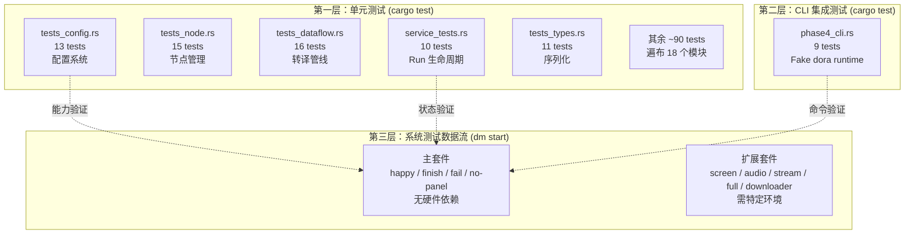
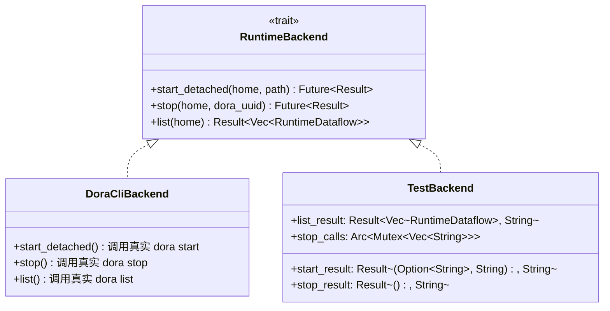
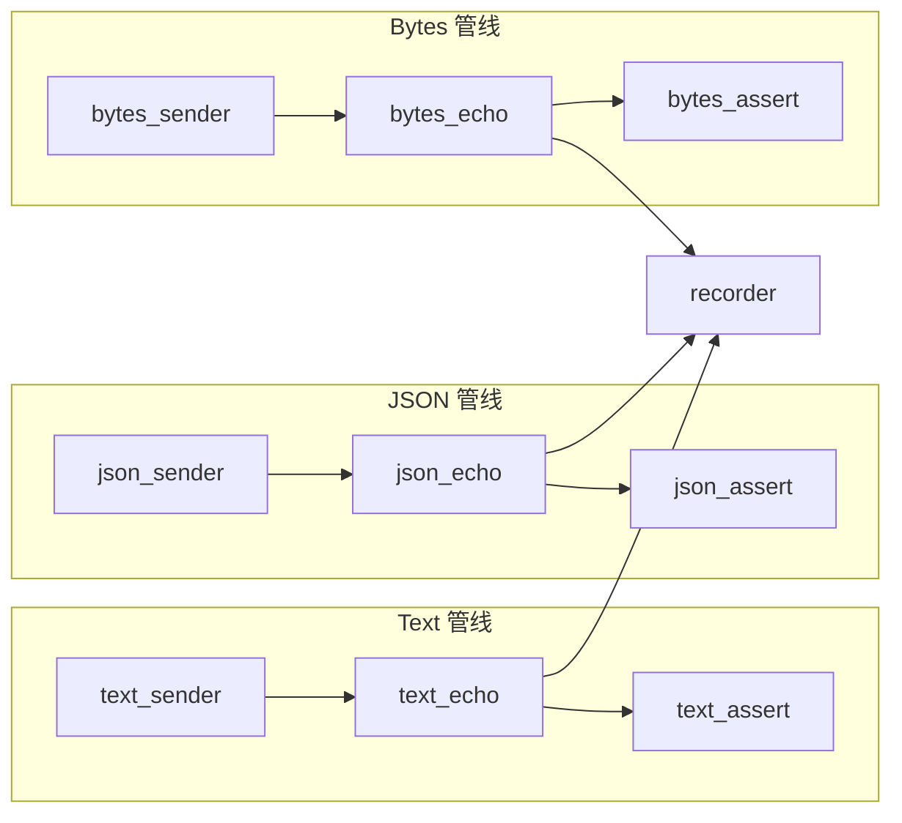
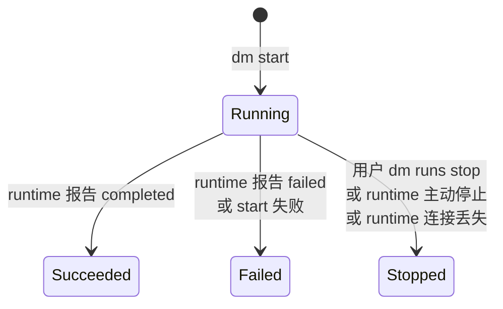

Dora Manager 的测试体系采用**分层隔离**策略，将验证职责精确地分配到三个层次：Rust 单元测试层验证内部逻辑正确性，CLI 集成测试层验证命令行交互的端到端行为，系统测试数据流层验证 Run 生命周期在真实 Dora runtime 下的完整运行轨迹。本文档将详细阐述每层的架构设计、测试覆盖范围，以及系统测试的手动验证 CheckList，帮助开发者理解"测什么、怎么测、为什么这样测"。

Sources: [system-test-dataflows-plan.md](https://github.com/l1veIn/dora-manager/blob/main/docs/system-test-dataflows-plan.md#L1-L19), [ci.yml](https://github.com/l1veIn/dora-manager/blob/main/.github/workflows/ci.yml#L70-L73)

## 三层测试架构总览



**第一层**运行在 `cargo test --workspace` 中，包含约 180 个 `#[test]` 函数，分布在 `dm-core` 的 22 个源文件中，使用 `tempfile` 创建临时目录和 `TestBackend` mock 替代真实 Dora runtime，验证从配置序列化到 Run 状态机的所有内部逻辑。**第二层**同样由 `cargo test` 驱动，但通过 `assert_cmd` 框架构建真实的 `dm` CLI 二进制进程，利用 Shell 脚本模拟 `dora` runtime 的 `start`/`stop`/`list` 命令行为。**第三层**通过 `dm start` 启动真实的 Dora runtime 执行 YAML 数据流，验证端到端的 Run 生命周期。

Sources: [service_tests.rs](https://github.com/l1veIn/dora-manager/blob/main/crates/dm-core/src/runs/service_tests.rs#L21-L54), [phase4_cli.rs](https://github.com/l1veIn/dora-manager/blob/main/crates/dm-cli/tests/phase4_cli.rs#L1-L13), [ci.yml](https://github.com/l1veIn/dora-manager/blob/main/.github/workflows/ci.yml#L70-L73)

## 第一层：Rust 单元测试

### 测试分布与模块覆盖

`dm-core` crate 是测试最密集的模块，其单元测试按功能域分布在以下文件中：

| 模块域 | 文件 | 测试数 | 核心验证内容 |
|--------|------|--------|-------------|
| **配置系统** | `tests/tests_config.rs` | 13 | `resolve_home` 优先级、`save/load` 往返、目录自动创建 |
| **节点管理** | `tests/tests_node.rs` | 15 | 节点 CRUD、脚手架生成、内置节点保护、文件树过滤 |
| **数据流转译** | `tests/tests_dataflow.rs` | 16 | 路径解析、Bridge 注入、config_schema 默认值注入、未知节点保留 |
| **Run 生命周期** | `runs/service_tests.rs` | 10 | 启动失败、状态刷新、停止成功/失败/超时、重启策略 |
| **Schema 校验** | `node/schema/tests.rs` | 29 | dm.json 字段解析、端口声明、capabilities 结构 |
| **类型序列化** | `tests/tests_types.rs` | 11 | `EnvItem`、`DoctorReport`、`InstallProgress` 等类型的 JSON 往返 |
| **环境检测** | `tests/tests_env.rs` | 5 | Python/uv/Rust 检测逻辑 |
| **工具函数** | `tests/tests_util.rs` | 9 | `human_size`、`check_command`、`is_valid_dora_binary` |
| **API 层** | `tests/tests_api.rs` | 14 | `doctor`、`versions`、`install`、`uninstall`、事件记录 |
| **安装系统** | `install/mod.rs` + 子模块 | 11 | GitHub release 解析、源码构建、版本管理 |
| **节点导入** | `node/import.rs` + `hub.rs` | 10 | 节点发现、注册中心交互 |
| **事件系统** | `events/mod.rs` | 6 | 事件存储、过滤、XES 兼容性 |
| **状态推断** | `runs/state.rs` | 3 | `parse_failure_details`、`extract_error_summary` |
| **Runtime 解析** | `runs/runtime.rs` | 4 | `extract_dataflow_id`、`parse_runtime_dataflows` |
| **指标采集** | `runs/service_metrics.rs` | 4 | CPU/内存指标解析 |

总计约 **180 个测试函数**，覆盖了 `dm-core` 的全部核心模块。这些测试遵循一个共同的模式：使用 `tempfile::tempdir()` 创建隔离的临时 `DM_HOME` 目录，构造必要的节点元数据文件（`dm.json`），然后调用被测函数并断言结果。

Sources: [tests_config.rs](https://github.com/l1veIn/dora-manager/blob/main/crates/dm-core/src/tests/tests_config.rs#L1-L148), [tests_node.rs](https://github.com/l1veIn/dora-manager/blob/main/crates/dm-core/src/tests/tests_node.rs#L1-L200), [tests_dataflow.rs](https://github.com/l1veIn/dora-manager/blob/main/crates/dm-core/src/tests/tests_dataflow.rs#L1-L156), [tests_types.rs](https://github.com/l1veIn/dora-manager/blob/main/crates/dm-core/src/tests/tests_types.rs#L1-L183)

### TestBackend 架构：Mock 驱动的 Run 生命周期测试

Run 生命周期测试的核心设施是 `TestBackend`——一个实现了 `RuntimeBackend` trait 的 mock 对象，它替代了真实调用 `dora start/stop/list` 的 `DoraCliBackend`：



`TestBackend` 的三个字段允许精确控制每次运行时操作的行为：`start_result` 模拟 `dora start` 的返回（可以返回缺失 UUID 的响应来测试启动失败），`stop_result` 模拟停止操作的成功或失败，`list_result` 模拟 `dora list` 返回的数据流列表。`stop_calls` 使用 `Arc<Mutex<Vec<String>>>` 记录所有传入的 `dora_uuid` 参数，使测试可以验证停止操作是否被正确调用。

Sources: [runtime.rs](https://github.com/l1veIn/dora-manager/blob/main/crates/dm-core/src/runs/runtime.rs#L24-L34), [service_tests.rs](https://github.com/l1veIn/dora-manager/blob/main/crates/dm-core/src/runs/service_tests.rs#L22-L54)

### 关键测试场景解析

`service_tests.rs` 中的 10 个测试覆盖了 Run 生命周期中最关键的交互场景：

| 测试函数 | 验证场景 | 核心断言 |
|----------|----------|----------|
| `start_run_fails_when_runtime_uuid_is_missing` | dora start 未返回 UUID | Run 记录为 `Failed` + `StartFailed` |
| `refresh_run_statuses_keeps_running_state_when_runtime_list_fails` | `dora list` 瞬时故障 | Running 状态保持不变 |
| `refresh_run_statuses_reconciles_stale_running_state` | runtime 完全不可达 | 标记为 `Stopped` + `RuntimeLost` |
| `stop_run_success_marks_run_stopped_and_syncs_logs` | 正常停止 | 日志同步完成 + `StoppedByUser` |
| `stop_run_failure_tolerates_when_not_in_runtime_list` | dora stop 失败但数据流已消失 | 容错处理，仍标记为 `Stopped` |
| `stop_run_failure_marks_run_failed_when_still_running` | dora stop 失败且数据流仍在 | 标记为 `Failed` + `NodeFailed` |
| `stop_run_timeout_keeps_run_running_when_runtime_still_reports_running` | dora stop 超时 | 保持 `Running`，记录 `stop_request` |
| `refresh_run_statuses_updates_terminal_states` | 批量状态刷新 | 正确识别 succeeded/failed/stopped/lost |
| `refresh_run_statuses_preserves_user_stop_intent` | 用户请求停止后 runtime 报告 succeeded | 优先标记为 `StoppedByUser` |
| `start_run_with_restart_strategy` | 重启策略 | 先停止旧 Run 再启动新 Run |

这些测试展示了一个重要的设计原则：**Run 状态推断不是简单的 runtime 状态映射**，而是结合了 `stop_request` 历史、runtime 返回值和日志内容的多源推断。例如 `refresh_run_statuses_preserves_user_stop_intent` 验证了即使 runtime 最终报告数据流自然完成（`succeeded`），如果用户之前请求了停止，DM 仍会将其标记为 `StoppedByUser`，因为这更准确地反映了因果关系。

Sources: [service_tests.rs](https://github.com/l1veIn/dora-manager/blob/main/crates/dm-core/src/runs/service_tests.rs#L150-L717)

### 状态推断的纯函数测试

`state.rs` 中的辅助函数承担了失败诊断的核心逻辑，它们是**无副作用的纯函数**，测试覆盖了关键的解析路径：

- **`parse_failure_details`**：从 Dora runtime 的错误消息 `"Node <name> failed: <detail>"` 中提取失败节点名称和详情。测试验证了对大小写不敏感的匹配和格式变体的处理。
- **`extract_error_summary`**：从节点日志中提取错误摘要，优先匹配 `AssertionError:`、`thread 'main' panicked at`、`panic:`、`ERROR` 等关键标记，回退到 Python Traceback 的最后一行。
- **`compact_error_text`**：将多行错误文本压缩为单行，截断至 240 字符。

这三个函数是系统测试数据流 `system-test-fail` 中失败诊断链路的底层支撑。当 `pyarrow-assert` 节点因断言不匹配而崩溃时，Dora runtime 报告 `"Node fail_assert failed: ..."`，DM 的状态刷新逻辑调用这些函数提取 `failure_node` 和 `failure_message`，最终写入 `run.json`。

Sources: [state.rs](https://github.com/l1veIn/dora-manager/blob/main/crates/dm-core/src/runs/state.rs#L18-L57), [state.rs tests](https://github.com/l1veIn/dora-manager/blob/main/crates/dm-core/src/runs/state.rs#L154-L185)

## 第二层：CLI 集成测试

### Fake Dora Runtime 架构

CLI 集成测试位于 `crates/dm-cli/tests/phase4_cli.rs`，通过 `assert_cmd` 框架构建真实的 `dm` 二进制进程进行端到端验证。其核心设施是 `setup_fake_runtime` 函数，它在临时目录中创建一个 Shell 脚本模拟 `dora` 命令：

```bash
#!/bin/sh
case "$1" in
  check)   exit 0 ;;
  list)    # 返回预设的数据流列表 ;;
  start)   # 创建日志文件，写入 UUID ;;
  stop)    # 清理状态文件 ;;
esac
```

这个 fake runtime 使得 CLI 测试可以在**不安装真实 Dora runtime** 的条件下验证 `dm start`、`dm runs`、`dm runs logs`、`dm runs stop` 等命令的完整交互流程。

Sources: [phase4_cli.rs](https://github.com/l1veIn/dora-manager/blob/main/crates/dm-cli/tests/phase4_cli.rs#L18-L84)

### 9 个 CLI 测试用例

| 测试函数 | 验证的 CLI 命令 | 核心断言 |
|----------|-----------------|----------|
| `node_install_requires_id` | `dm node install` | 无参数时返回错误 |
| `node_list_includes_builtin_nodes` | `dm node list` | 输出包含 `dm-test-media-capture` 等 |
| `node_uninstall_missing_node_shows_friendly_error` | `dm node uninstall` | 友好错误信息 |
| `start_reports_parse_error_for_invalid_yaml` | `dm start bad.yml` | 报告 "is not executable" |
| `start_fails_gracefully_when_no_dora_installed` | `dm start`（无 runtime） | 报告 "No active dora version" |
| `start_creates_run_and_runs_list_shows_it` | `dm start` + `dm runs` | 创建成功，列表可见 |
| `runs_logs_and_stop_work_for_started_run` | `dm runs logs` + `dm runs stop` | 日志内容可读，停止成功 |
| `start_rejects_conflicting_active_run_without_force` | 连续两次 `dm start` | 第二次被拒绝 |
| `runs_refresh_marks_stale_running_run_as_stopped` | `dm runs`（runtime 消失后） | 标记为 `Stopped` |

Sources: [phase4_cli.rs](https://github.com/l1veIn/dora-manager/blob/main/crates/dm-cli/tests/phase4_cli.rs#L86-L310)

## 第三层：系统测试数据流

### 设计哲学：确定性优先

系统测试数据流遵循一条核心原则：**确定性高于覆盖面**。这意味着测试套件优先使用合成数据（synthetic data）而非真实硬件输入，确保每一次 `dm start` 在几秒内产生可预测的结果。具体设计原则包括：

- **使用确定性节点**：`pyarrow-sender`、`pyarrow-assert`、`dora-echo` 等节点在给定输入下产生完全确定的输出
- **避免硬件依赖**：主测试套件不依赖麦克风、摄像头等本地硬件
- **快速可重复**：happy-path 流程在数秒内完成
- **合成数据优先**：文本用 `'system-test-text'`，JSON 用 `'{"kind":"system-test","value":1}'`，二进制用模拟 PNG 文件头 `[137,80,78,71,13,10,26,10]`
- **分层验证**：每个数据流验证一到两个特定场景

Sources: [system-test-dataflows-plan.md](https://github.com/l1veIn/dora-manager/blob/main/docs/system-test-dataflows-plan.md#L13-L19)

### 测试矩阵：九大数据流一览

当前 `tests/dataflows/` 目录包含 9 个 `system-test-*` 前缀的 YAML 文件，分为**主测试套件**和**扩展测试套件**：

| 数据流 | 核心验证目标 | 节点数 | Panel | 终态 | 硬件依赖 |
|--------|-------------|--------|-------|------|----------|
| `system-test-happy` | 多类型数据管线 + 日志 + Recorder | 10 | ❌ | `stopped`（手动） | 无 |
| `system-test-finish` | 自然完成路径 | 3 | ❌ | `succeeded` | 无 |
| `system-test-fail` | 受控失败 + 诊断元数据 | 3 | ❌ | `failed` | 无 |
| `system-test-no-panel` | 无 Panel 显式路径 | 3 | ❌ | `succeeded` | 无 |
| `system-test-screen` | 截图资产持久化 | 1 | ❌ | `succeeded` | macOS 截图权限 |
| `system-test-audio` | 音频资产持久化 | 1 | ❌ | `succeeded` | 麦克风 |
| `system-test-stream` | 流媒体管线编排 | 7 | ❌ | 长运行 | ffmpeg + mediamtx |
| `system-test-downloader` | 下载节点功能验证 | 1 | ❌ | 长运行 | 网络 |
| `system-test-full` | 多模态联合（VAD + 截图 + 音频） | 4 | ❌ | 长运行 | 麦克风 + 截图 |

前四个（happy / finish / fail / no-panel）构成**主测试套件**，无硬件依赖，可在任何环境运行。后五个为**扩展测试套件**，需要特定硬件或网络条件。

Sources: [system-test-happy.yml](https://github.com/l1veIn/dora-manager/blob/main/tests/dataflows/system-test-happy.yml#L1-L83), [system-test-finish.yml](https://github.com/l1veIn/dora-manager/blob/main/tests/dataflows/system-test-finish.yml#L1-L25), [system-test-fail.yml](https://github.com/l1veIn/dora-manager/blob/main/tests/dataflows/system-test-fail.yml#L1-L25), [system-test-no-panel.yml](https://github.com/l1veIn/dora-manager/blob/main/tests/dataflows/system-test-no-panel.yml#L1-L25)

### 核心场景深度解析

#### system-test-happy：三管线并行验证

最复杂的基础测试，包含 10 个节点，形成三条并行管线（text / json / bytes），每条遵循 **sender → echo → assert** 三段式拓扑，最终汇聚到 recorder 节点：



三条管线的关键设计意图是覆盖 DM 处理不同 Arrow 数据类型的能力：`text_sender` 发送纯文本 `'system-test-text'`，`json_sender` 发送序列化 JSON 字符串 `'{"kind":"system-test","value":1}'`，`bytes_sender` 发送模拟 PNG 文件头的整数数组。所有数据经由 `dora-echo` 原样回传后，由 `pyarrow-assert` 验证数据完整性，最终由 `dora-parquet-recorder` 持久化为 Parquet 文件。

Sources: [system-test-happy.yml](https://github.com/l1veIn/dora-manager/blob/main/tests/dataflows/system-test-happy.yml#L1-L83)

#### system-test-finish：自然完成路径

最简洁的确定性测试，仅 3 个节点：`finish_sender → finish_echo → finish_assert`。`pyarrow-sender` 是一次性的——发送一条数据后退出。当所有节点退出后，Dora runtime 检测到数据流结束，标记为 `succeeded`，核心验证点是 `termination_reason = completed`。

Sources: [system-test-finish.yml](https://github.com/l1veIn/dora-manager/blob/main/tests/dataflows/system-test-finish.yml#L1-L25)

#### system-test-fail：受控失败与诊断

故意制造断言不匹配：`fail_sender` 发送 `'system-test-actual'`，`fail_assert` 期望 `'system-test-expected'`。`pyarrow-assert` 以非零退出码终止后，DM 的 `parse_failure_details` 从 runtime 错误消息中提取 `failure_node = fail_assert`，`infer_failure_details` 从节点日志中提取包含 `AssertionError:` 的 `failure_message`。

Sources: [system-test-fail.yml](https://github.com/l1veIn/dora-manager/blob/main/tests/dataflows/system-test-fail.yml#L1-L25), [state.rs](https://github.com/l1veIn/dora-manager/blob/main/crates/dm-core/src/runs/state.rs#L18-L32)

#### system-test-stream：条件门控管线

验证流媒体架构栈的完整管线编排，采用**条件门控**模式：`dm-check-ffmpeg` 和 `dm-check-media-backend` 循环检查依赖就绪状态，`dm-and` 做与门聚合，`dm-gate` 将就绪信号与定时器结合，按节奏触发 `dm-screen-capture` 截图，最终由 `dm-stream-publish` 发布流。`dm-test-observer` 汇聚全线元数据生成测试摘要。

Sources: [system-test-stream.yml](https://github.com/l1veIn/dora-manager/blob/main/tests/dataflows/system-test-stream.yml#L1-L77)

## Run 生命周期状态机

理解系统测试的验证逻辑需要理解 DM 的 Run 状态机。`RunStatus` 定义四种状态，`TerminationReason` 定义六种终止原因：



| RunStatus | 含义 | 对应 TerminationReason |
|-----------|------|----------------------|
| `Running` | 数据流正在执行 | 无 |
| `Succeeded` | 所有节点正常完成 | `completed` |
| `Failed` | 节点失败或启动失败 | `start_failed` / `node_failed` |
| `Stopped` | 被外部停止 | `stopped_by_user` / `runtime_stopped` / `runtime_lost` |

每个系统测试数据流验证不同的状态转换路径：`system-test-finish` 验证 `Running → Succeeded`，`system-test-fail` 验证 `Running → Failed (node_failed)`，`system-test-happy` 验证 `Running → Stopped (stopped_by_user)`，`system-test-no-panel` 验证无 Panel 条件下的正常完成。

Sources: [model.rs](https://github.com/l1veIn/dora-manager/blob/main/crates/dm-core/src/runs/model.rs#L5-L74), [state.rs](https://github.com/l1veIn/dora-manager/blob/main/crates/dm-core/src/runs/state.rs#L84-L116)

## Run 目录结构与验证点

每次 `dm start` 执行后，DM 在 `~/.dm/runs/<run_id>/` 下创建标准化的目录布局：

```
~/.dm/runs/<run_id>/
├── run.json                    # Run 实例元数据
├── dataflow.yml                # 原始 YAML 快照
├── dataflow.transpiled.yml     # 转译后的可执行 YAML
├── out/                        # Dora runtime 原始输出
│   └── <dora_uuid>/
│       ├── log_worker.txt
│       └── log_<node>.txt
├── logs/                       # DM 同步后的结构化日志
│   └── <node>.log
└── panel/                      # (仅 Panel 数据流)
    └── index.db                # SQLite 资产索引
```

`run.json` 中的关键字段：`nodes_expected` 记录 YAML 声明的所有节点 ID，`nodes_observed` 记录 runtime 实际观察到的节点，`transpile.resolved_node_paths` 记录转译器为每个节点解析到的可执行文件路径。

Sources: [repo.rs](https://github.com/l1veIn/dora-manager/blob/main/crates/dm-core/src/runs/repo.rs#L1-L48)

## 验证 CheckList

以下 CheckList 可直接用于手动验证每个系统测试数据流。所有命令假设已记录 `dm start` 返回的 `run_id`。

### 通用检查（所有数据流）

```bash
# 1. 启动数据流
dm start tests/dataflows/<flow>.yml
# 记录返回的 run_id

# 2. 检查 Run 列表
dm runs

# 3. 检查 run.json 核心字段
cat ~/.dm/runs/<run_id>/run.json | python3 -m json.tool

# 4. 检查目录结构
find ~/.dm/runs/<run_id> -maxdepth 3 -print | sort

# 5. 查看全局日志
dm runs logs <run_id>
```

**验证点**：

| 字段 | 期望 |
|------|------|
| `dataflow_name` | 与 YAML 文件名（不含扩展名）一致 |
| `nodes_expected` | 包含 YAML 中所有声明的 `id` |
| `transpile.resolved_node_paths` | 所有节点路径已填充 |
| `out/` 目录 | 包含原始 Dora runtime 日志 |
| `schema_version` | `1` |

Sources: [system-test-dataflows-checklist.md](https://github.com/l1veIn/dora-manager/blob/main/docs/system-test-dataflows-checklist.md#L6-L30)

### system-test-happy 专用检查

```bash
dm start tests/dataflows/system-test-happy.yml

# 验证各管线日志
dm runs logs <run_id> text_sender
dm runs logs <run_id> json_sender
dm runs logs <run_id> bytes_sender
dm runs logs <run_id> recorder

# 验证 Recorder 输出
find ~/.dm/runs/<run_id> -path '*recorder*' -print | sort

# 手动停止
dm runs stop <run_id>
```

| 检查项 | 期望 |
|--------|------|
| text/json/bytes 管线 | 三条管线均产出日志 |
| recorder Parquet | 运行目录下存在 `.parquet` 文件 |
| 手动停止后 | `status = stopped`，`termination_reason = stopped_by_user` |

Sources: [system-test-dataflows-checklist.md](https://github.com/l1veIn/dora-manager/blob/main/docs/system-test-dataflows-checklist.md#L47-L71)

### system-test-finish 专用检查

```bash
dm start tests/dataflows/system-test-finish.yml
# 等待自然完成
dm runs
cat ~/.dm/runs/<run_id>/run.json
dm runs logs <run_id>
```

| 检查项 | 期望 |
|--------|------|
| 终态 | `status = succeeded`（非 `stopped`） |
| `termination_reason` | `completed`（非 `stopped_by_user`） |
| 日志可读性 | 完成后 `dm runs logs` 仍可查看 |
| 无手动干预 | 数据流图自行退出 |

Sources: [system-test-dataflows-checklist.md](https://github.com/l1veIn/dora-manager/blob/main/docs/system-test-dataflows-checklist.md#L73-L93)

### system-test-fail 专用检查

```bash
dm start tests/dataflows/system-test-fail.yml
# 等待失败完成
dm runs
cat ~/.dm/runs/<run_id>/run.json
dm runs logs <run_id> fail_assert
```

| 检查项 | 期望 |
|--------|------|
| `status` | `failed` |
| `termination_reason` | `node_failed` |
| `failure_node` | `fail_assert` |
| `failure_message` | 包含 `AssertionError: Expected ... got ...` |
| `fail_assert` 日志 | 包含与 `failure_message` 一致的错误详情 |

Sources: [system-test-dataflows-checklist.md](https://github.com/l1veIn/dora-manager/blob/main/docs/system-test-dataflows-checklist.md#L95-L117)

### system-test-no-panel 专用检查

```bash
dm start tests/dataflows/system-test-no-panel.yml
cat ~/.dm/runs/<run_id>/run.json
find ~/.dm/runs/<run_id> -maxdepth 2 -print | sort
```

| 检查项 | 期望 |
|--------|------|
| `has_panel` | `false` |
| `panel/` 目录 | **不存在** |
| `status` | `succeeded` |

Sources: [system-test-dataflows-checklist.md](https://github.com/l1veIn/dora-manager/blob/main/docs/system-test-dataflows-checklist.md#L119-L138)

### system-test-screen 专用检查

```bash
dm node install dm-test-media-capture    # 首次需要安装
dm start tests/dataflows/system-test-screen.yml
dm runs logs <run_id> screen
find ~/.dm/runs/<run_id>/panel -maxdepth 3 -print | sort
sqlite3 ~/.dm/runs/<run_id>/panel/index.db 'select seq,input_id,type,storage,path from assets order by seq;'
```

| 检查项 | 期望 |
|--------|------|
| Panel 资产 | 至少 1 条 PNG image 记录 + 1 条 JSON metadata 记录 |
| 节点日志 | 包含截图命令执行记录 |
| 截图权限 | macOS 可能首次弹出权限请求 |

Sources: [system-test-dataflows-checklist.md](https://github.com/l1veIn/dora-manager/blob/main/docs/system-test-dataflows-checklist.md#L140-L167)

### system-test-audio 专用检查

```bash
dm node install dm-test-audio-capture    # 首次需要安装
dm start tests/dataflows/system-test-audio.yml
dm runs logs <run_id> microphone
find ~/.dm/runs/<run_id>/panel -maxdepth 3 -print | sort
sqlite3 ~/.dm/runs/<run_id>/panel/index.db 'select seq,input_id,type,storage,path from assets order by seq;'
```

| 检查项 | 期望 |
|--------|------|
| Panel 资产 | 至少 1 条 WAV audio 记录 + 1 条 JSON metadata 记录 |
| 终态 | `succeeded`（3 秒录制后自动完成） |
| 音频参数 | 16kHz / 单声道 / 3 秒 |

Sources: [system-test-dataflows-checklist.md](https://github.com/l1veIn/dora-manager/blob/main/docs/system-test-dataflows-checklist.md#L169-L197)

### system-test-downloader 专用检查

```bash
dm node install dm-downloader    # 首次需要安装
dm start tests/dataflows/system-test-downloader.yml
dm runs logs <run_id> dl-test
```

| 检查项 | 期望 |
|--------|------|
| 下载文件 | 运行目录下存在 `test/dora-readme.md` |
| `path` 输出 | 包含下载文件路径 |
| `ui` 输出 | 包含进度 JSON |

Sources: [system-test-downloader.yml](https://github.com/l1veIn/dora-manager/blob/main/tests/dataflows/system-test-downloader.yml#L1-L15)

### system-test-stream 专用检查

此测试需要预先启动 mediamtx 和安装 ffmpeg：

```bash
dm node install dm-check-ffmpeg dm-check-media-backend dm-and dm-gate dm-screen-capture dm-stream-publish dm-test-observer
dm start tests/dataflows/system-test-stream.yml
dm runs logs <run_id> frame-observer
```

| 检查项 | 期望 |
|--------|------|
| ffmpeg 就绪检查 | `ffmpeg-ready` 输出 `ok` 事件 |
| mediamtx 就绪检查 | `media-ready` 输出 `ok` 事件 |
| 条件门控 | `stream-ready` 仅在两者就绪后输出 |
| 流发布 | `screen-live-publish` 输出 `stream_id` |
| 观察者摘要 | `frame-observer` 输出管线状态摘要 |

Sources: [system-test-stream.yml](https://github.com/l1veIn/dora-manager/blob/main/tests/dataflows/system-test-stream.yml#L1-L77)

### system-test-full 专用检查

多模态联合测试，需要麦克风和截图权限：

```bash
dm node install dm-test-audio-capture dm-test-media-capture dm-test-observer
dm start tests/dataflows/system-test-full.yml
dm runs logs <run_id> observer
```

| 检查项 | 期望 |
|--------|------|
| 音频采集 | `microphone` 持续输出 `audio_stream` |
| VAD 检测 | `vad` 输出 `timestamp_start/end` 事件 |
| 截图循环 | `screen` 每 5 秒输出 PNG |
| 聚合摘要 | `observer` 输出 `summary_text` 和 `summary_json` |

Sources: [system-test-full.yml](https://github.com/l1veIn/dora-manager/blob/main/tests/dataflows/system-test-full.yml#L1-L46)

## 自定义测试节点生态

主测试套件使用 Dora 社区通用节点（`pyarrow-sender`、`dora-echo` 等）。为覆盖 DM 专属场景，项目构建了三个专用测试节点：

| 节点 | 输出端口 | 核心能力 |
|------|----------|----------|
| `dm-test-media-capture` | `image` / `video` / `meta` | macOS 截图与录屏，支持触发和定时模式 |
| `dm-test-audio-capture` | `audio` / `audio_stream` / `meta` | 固定时长麦克风录制，WAV + Float32 流式输出 |
| `dm-test-observer` | `summary_text` / `summary_json` | 多模态事件聚合器，生成人类/机器可读的测试摘要 |

Sources: [dm.json](https://github.com/l1veIn/dora-manager/blob/main/nodes/dm-test-media-capture/dm.json#L1-L100), [dm.json](https://github.com/l1veIn/dora-manager/blob/main/nodes/dm-test-audio-capture/dm.json#L1-L142), [dm.json](https://github.com/l1veIn/dora-manager/blob/main/nodes/dm-test-observer/dm.json#L1-L101)

## `dm test`：单节点交互式测试命令

除了数据流级别的系统测试，项目还设计了 `dm test` 命令用于**单节点级别的快速验证**。它将编写 YAML → `dm up` → `dm start` → 检查日志 → `dm down` 的多步流程压缩为一条命令：

```bash
# 交互模式（人类）
dm test dm-downloader --config url=https://example.com/model.bin

# 非交互模式（CI / Agent）
dm test dm-downloader --auto-trigger --timeout 10 --config url=https://...
```

`dm test` 的工作流程是：读取 `dm.json` 提取端口和配置 → 自动生成测试数据流 YAML → 启动 runtime → 注入 `dm-test-harness` 内置节点 → 流式输出 SUT 日志和端口事件。Harness 节点与 `dm-panel` 共享相同的双线程架构：Event reader 线程打印 SUT 输出，Main loop 线程处理 stdin 输入或自动触发。

Sources: [dm-test.md](https://github.com/l1veIn/dora-manager/blob/main/docs/dm-test.md#L1-L52), [dm-test.md](https://github.com/l1veIn/dora-manager/blob/main/docs/dm-test.md#L120-L134)

## CI 集成现状

当前的 CI 管线运行 `cargo test --workspace`，覆盖了第一层 Rust 单元测试和第二层 CLI 集成测试，在 macOS（aarch64）和 Linux（x86_64）两个平台上并行执行。CI 的完整阶段包括：前端 lint + build → Rust format check → clippy → build → test → 打包 artifact → 安全审计（`cargo audit`）。

系统测试数据流（第三层）目前作为**手动验证工具**存在。将其纳入 CI 的主要障碍是 Dora runtime 的安装依赖——CI 环境需要先通过 `dm setup` 安装 runtime，再预装 `pyarrow-sender`、`pyarrow-assert` 等社区节点。

Sources: [ci.yml](https://github.com/l1veIn/dora-manager/blob/main/.github/workflows/ci.yml#L1-L120)

## 环境隔离与测试基础设施

`dm-core` 的测试基础设施提供了两个关键的隔离工具：

- **`env_lock()`**：一个进程级的 `Mutex` 保护，确保涉及环境变量（如 `DM_HOME`、`PATH`）的测试串行执行，避免并发修改导致的 flaky test。所有 `tests_env.rs` 和 `tests_util.rs` 中的测试都使用此锁。
- **`PathGuard`**：一个 RAII 守卫，修改 `PATH` 环境变量后在其 `Drop` 实现中恢复原值，确保即使测试 panic 也不会污染全局状态。

这两个设施共同保证了在 `cargo test` 默认的多线程并行模式下，所有测试仍然安全运行。

Sources: [test_support.rs](https://github.com/l1veIn/dora-manager/blob/main/crates/dm-core/src/test_support.rs#L1-L42)

## 推荐阅读路径

- 理解 Run 生命周期后可深入 [运行时服务：启动编排、状态刷新与 CPU/内存指标采集](13-yun-xing-shi-fu-wu-qi-dong-bian-pai-zhuang-tai-shua-xin-yu-cpu-nei-cun-zhi-biao-cai-ji)，了解状态刷新的生产实现
- 系统测试数据流的转译机制详见 [数据流转译器（Transpiler）：多 Pass 管线与四层配置合并](11-shu-ju-liu-zhuan-yi-qi-transpiler-duo-pass-guan-xian-yu-si-ceng-pei-zhi-he-bing)
- CI/CD 流水线的完整配置参见 [前后端联编与发布：rust-embed 静态嵌入与 CI/CD 流水线](25-qian-hou-duan-lian-bian-yu-fa-bu-rust-embed-jing-tai-qian-ru-yu-ci-cd-liu-shui-xian)