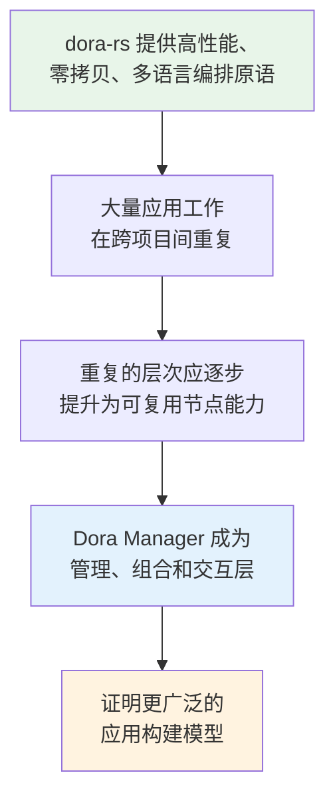
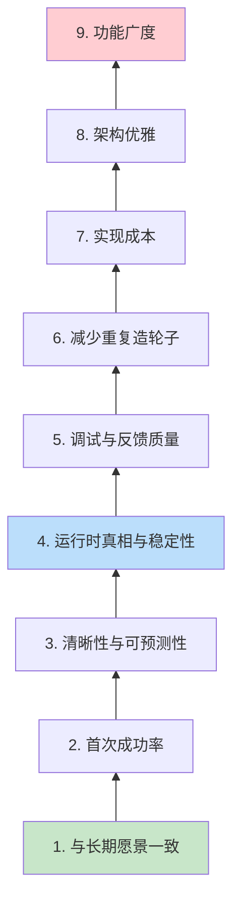
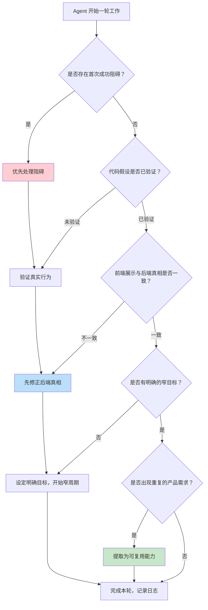

Dora Manager 的宪法文件（`PROJECT_CONSTITUTION.md`）是整个项目的**最高层决策框架**——它不描述代码如何工作，而是定义代码**应该**朝什么方向工作。这份文件在产品快速增长和技术债积累之间起到方向盘的作用：当两条技术路径发生冲突时，宪法给出裁决依据；当 Agent 自主完成一轮开发后，宪法条款用于验收产出是否算作"真正的进展"。本文将系统性地拆解宪法的每一层逻辑，并结合架构原则文档和实际的导向周期（Steering Cycles）记录，展示这些原则如何在真实开发中被反复应用。

Sources: [PROJECT_CONSTITUTION.md](https://github.com/l1veIn/dora-manager/blob/main/PROJECT_CONSTITUTION.md), [architecture-principles.md](https://github.com/l1veIn/dora-manager/blob/main/docs/architecture-principles.md#L1-L132)

---

## 产品愿景：从乐高积木到可复用应用构建模型

宪法开篇就给出了一个极具辨识度的隐喻——Dora Manager 的目标是让应用开发**感觉更像拼乐高积木**，而不是每次都从零开始搭同一个壳。这个愿景不是一个模糊的口号，而是被拆解为五个具体的"可复用层"：

| 可复用层 | 含义 | 现有节点示例 |
|---------|------|-------------|
| **显示层** | 图像渲染、视频播放、日志展示 | `dm-message`、`opencv-plot` |
| **配置层** | 参数表单、环境变量管理 | `dm.json` → `config_schema` |
| **交互层** | 用户输入控件、面板通信 | `dm-button`、`dm-slider`、`dm-text-input` |
| **输出层** | 文件保存、数据录制 | `dm-save`、`dm-recorder` |
| **反馈层** | 状态信号、错误传递、就绪检查 | `dm-check-ffmpeg`、`dm-and`、`dm-gate` |

这个分类不是静止的。随着项目演进，每一层都在持续积累可复用节点。当某个能力**反复出现在不同项目中**时，正确的做法是将其提升为一个可复用节点、共享契约或运行时特性，而不是在每个项目里重新实现一遍。这种"**复用优于重复**"的理念贯穿了从节点设计到转译器架构的每一层技术决策。

Sources: [PROJECT_CONSTITUTION.md](https://github.com/l1veIn/dora-manager/blob/main/PROJECT_CONSTITUTION.md)

---

## 产品使命与当前赌注

Dora Manager 的使命是将 dora-rs 从一个强大的**底层编排引擎**转变为一个**可用的应用构建与管理层**。它要帮助开发者完成五件事：发现和管理节点、自然地定义和运行数据流、清晰地观测运行时状态、直接与运行中的系统交互、复用通用应用能力。

当前阶段的产品赌注（Product Bet）建立在一个清晰的因果链上：

这四个赌注环环相扣：如果 dora-rs 的时机优势不成立，整个上层建筑就缺乏根基；如果跨项目的重复不够多，"可复用节点"的价值就不够大；如果 Dora Manager 不能让这种复用变得实际，愿景就只是一个想法。

Sources: [PROJECT_CONSTITUTION.md](https://github.com/l1veIn/dora-manager/blob/main/PROJECT_CONSTITUTION.md)

---

## 当前阶段与目标用户

宪法明确指出：**当前阶段的目标是证明路径，而非最大化广度**。这一判断直接影响了功能优先级的排序：

| 优先级 | 含义 | 实际体现 |
|-------|------|---------|
| 首次启动可理解 | 用户第一次打开不会迷失 | Dashboard Quick Start + `Hello Timer` 一键体验 |
| 首次成功快速达成 | 几次点击内完成第一次运行 | `dm start demos/demo-hello-timer.yml` 零依赖运行 |
| 编辑-运行-检查循环连贯 | 核心工作流感觉是一个整体 | Workspace 编辑 → Run → 实时日志 → 修改 → 重跑 |
| 运行时状态可信 | 状态、失败、停止、恢复都必须真实 | Steering Cycle 反复修复"前端展示与后端真相不一致" |
| 可复用节点模式开始固化 | 显示/配置/交互/反馈能力成为节点模式 | Widget 系统、dm.json 契约、Port Schema 校验 |

目标用户也经过了明确的排序和排除：

- **当前优先级用户**：独立开发者、dora-rs 早期技术尝鲜者、验证节点/流/交互循环的高级构建者、探索可复用应用构建模型的工程师
- **明确不在当前优先级**：大型团队治理、企业权限系统、分布式集群调度、为抽象而抽象的泛平台化

这种选择并非永久——它只是在"证明路径"阶段做的资源聚焦决策。一旦核心循环站稳，目标用户范围自然会扩展。

Sources: [PROJECT_CONSTITUTION.md](https://github.com/l1veIn/dora-manager/blob/main/PROJECT_CONSTITUTION.md)

---

## 决策优先级：九层裁决链

当技术权衡发生冲突时，宪法提供了一个**九层裁决链**，从高到低依次是：

这个裁决链在项目实际运行中反复被引用。以下是几个典型案例：

**案例 1：前端展示 vs 后端真相（第 4 项 > 第 8 项）**

在 UX Test Round 3 中，运行摘要卡片将后端的 `node_count_observed`（历史观测节点数）展示为 `Active Nodes`（活跃节点数），导致运行停止后仍然显示"活跃"。修复方案不是调整前端措辞掩盖问题，而是将标签改为语义正确的 `Observed Nodes`，确保前端展示与后端真实含义一致。[ux-test-rounds.md](https://github.com/l1veIn/dora-manager/blob/main/docs/records/ux-test-rounds.md#L103-L121)

**案例 2：首次成功率 > 功能广度（第 2 项 > 第 9 项）**

Steering Cycle 1 明确决定：不扩展编辑器或节点能力，而是先加固一条**确定性的首次成功路径**。Dashboard 获得了一个专用的 `Hello Timer` 入口，让首次用户不需要依赖嘈杂的历史记录就能完成第一次运行。[steering-cycles.md](https://github.com/l1veIn/dora-manager/blob/main/docs/records/steering-cycles.md#L1-L43)

**案例 3：架构优雅 < 运行时真相（第 8 项 < 第 4 项）**

即使 dm-panel 最初采用的 SQLite 轮询方案在架构上更简洁，但实时控制场景的延迟不可接受时，项目选择了更复杂的 WebSocket 方案——因为**运行时稳定性**和**调试反馈质量**优先于**架构优雅**。

Sources: [PROJECT_CONSTITUTION.md](https://github.com/l1veIn/dora-manager/blob/main/PROJECT_CONSTITUTION.md)

---

## 七条产品原则

宪法的第 7 节定义了七条产品原则，每一条都有明确的适用边界和判别标准。

### 原则 1：复用优于重复

> 如果一种能力反复出现在不同的产品中，优先将其转变为可复用的节点、契约或运行时特性。

这正是 `dm.json` 契约的诞生逻辑——它不是预先设计的，而是在不断重复写安装脚本、配置表单、类型校验的过程中**自然浮现**的。转译器依赖它做路径解析和配置合并，前端依赖它渲染控件，安装器依赖它创建沙箱环境。

Sources: [PROJECT_CONSTITUTION.md](https://github.com/l1veIn/dora-manager/blob/main/PROJECT_CONSTITUTION.md), [building-dora-manager-with-ai.md](https://github.com/l1veIn/dora-manager/blob/main/docs/blog/building-dora-manager-with-ai.md#L40-L70)

### 原则 2：第一印象至关重要

> 首次启动路径、首次页面、首次点击、首次运行、首次失败——这些都是核心产品界面。

这一原则直接催生了 Dashboard 的 `Quick Start` 区域、`Hello Timer` 内置演示，以及 `dm start demos/demo-hello-timer.yml` 这个零依赖的首次体验路径。Steering Cycle 3 的结论也印证了这一点：**产品已证明两条乐观路径（首次成功 + 首次修改），下一个弱点不再是发现，而是恢复。**

Sources: [PROJECT_CONSTITUTION.md](https://github.com/l1veIn/dora-manager/blob/main/PROJECT_CONSTITUTION.md)

### 原则 3：不要让用户猜

> 在关键时刻，产品应该帮助用户理解：正在发生什么、刚发生了什么、什么失败了、接下来该做什么。

这条原则在恢复路径（Recovery Path）的设计中被反复验证。Steering Cycle 5 决定让损坏的 Workspace **就地自我解释**——当工作区无效或缺少节点时，直接在页面上说清楚哪里有问题、用户应该做什么下一步，而不是强迫用户通过试错或终端日志来诊断。

Sources: [PROJECT_CONSTITUTION.md](https://github.com/l1veIn/dora-manager/blob/main/PROJECT_CONSTITUTION.md), [steering-cycles.md](https://github.com/l1veIn/dora-manager/blob/main/docs/records/steering-cycles.md#L158-L191)

### 原则 4：先修正真相再打磨

> 如果前端消息与后端现实不一致，先修正系统语义。

这是最常被引用的原则之一。Steering Cycle 7-8 用了整整两个周期来处理运行失败消息的质量问题——不是为了"让界面更好看"，而是因为后端的 `outcome_summary` 携带了原始堆栈帧和 trigger ID，直接展示给用户会破坏信任。修复方案保留了根因，去除了噪音，让技术细节按需查看。

Sources: [PROJECT_CONSTITUTION.md](https://github.com/l1veIn/dora-manager/blob/main/PROJECT_CONSTITUTION.md), [steering-cycles.md](https://github.com/l1veIn/dora-manager/blob/main/docs/records/steering-cycles.md#L227-L298)

### 原则 5：Demo 必须建立信心

> 演示流程、入门路径、快捷方式和示例节点必须帮助建立信任，而不是制造噪音、断链或脆弱的假象。

`demos/` 目录下的所有演示都遵循零外部依赖的原则：`demo-hello-timer` 验证引擎 + UI、`demo-interactive-widgets` 展示控件系统、`demo-logic-gate` 演示条件流控制。每一个 Demo 都是一个**可信的首次体验入口**。

Sources: [PROJECT_CONSTITUTION.md](https://github.com/l1veIn/dora-manager/blob/main/PROJECT_CONSTITUTION.md)

### 原则 6：主路径优先于边缘路径

> 在扩展广度之前，持续改进核心循环：`startup → run → understand → modify → rerun`。

这条原则在 Steering Cycles 中形成了清晰的工作节奏：Cycle 1 加固首次运行 → Cycle 2 进入编辑-重跑循环 → Cycle 3 清理首页噪音 → Cycle 4-8 依次覆盖失败恢复路径 → Cycle 9-10 消除跨页面信息不一致。每一步都是沿着主路径再往前走一步，而不是横向扩展功能。

Sources: [PROJECT_CONSTITUTION.md](https://github.com/l1veIn/dora-manager/blob/main/PROJECT_CONSTITUTION.md)

### 原则 7：核心层保持节点无关

> `dm-core` 不应成为个别节点的特例集合。通用行为应归属于共享契约和共享运行时逻辑。

架构原则文档对此做了更具体的约束：`dm-core` 的职责仅限于管理数据流生命周期、转译 YAML、路由数据。它**不得**硬编码任何节点 ID、不得为特定节点设置枚举变体、不得在运行模型中存储节点特定元数据、不得包含节点特定业务逻辑。如果某个节点需要特殊框架支持，这种支持应属于应用层（`dm-server`、`dm-cli`），而非核心层。

Sources: [PROJECT_CONSTITUTION.md](https://github.com/l1veIn/dora-manager/blob/main/PROJECT_CONSTITUTION.md), [architecture-principles.md](https://github.com/l1veIn/dora-manager/blob/main/docs/architecture-principles.md#L48-L65)

---

## 架构原则：节点纯度与分层约束

架构原则文档（`docs/architecture-principles.md`）从 dm-panel 子系统的深度分析中提炼出了七条架构约束，这些约束是宪法原则在代码层面的具体化。

### 节点业务纯度

一个节点应该只做**一件事**。节点要么是计算单元、存储单元，要么是交互单元——绝不应该混合这些关注点。如果一个节点开始做两件事，就应该被拆成两个节点。

这种纯度约束直接反映在节点家族分类中：

| 家族 | 职责 | 约束 | 代表节点 |
|------|------|------|---------|
| **Compute** | 数据变换 | 除 Arrow 输出外无副作用 | `dora-qwen`、`dora-distil-whisper`、`dora-yolo` |
| **Storage** | 数据持久化 | 写文件系统但不渲染 | `dm-save`（未来） |
| **Interaction** | 人机交互界面 | 桥接人类与数据流（显示 + 控制） | `dm-message`、`dm-button`、`dm-slider` |
| **Source** | 数据生成/事件发射 | 产出数据但不消费节点输出 | `dm-timer`、`opencv-video-capture` |

### 显示与持久化的正交性

显示路径应利用已持久化的制品，而不是重新发明它们：

- **持久化路径**：`Compute node → dm-store → filesystem → Interaction node (reads & renders)`
- **实时显示路径**：`Compute node → Interaction node (renders Arrow data)`

交互节点**不存储数据**——存储是存储节点的职责。这种关注点分离确保了每种节点只做一件事。

### 交互节点的平台无关性

交互节点的逻辑（显示什么、接受什么输入）是平台无关的。同一个节点应能跨 Web（SvelteKit）、CLI（stdin/stdout）、Mobile（原生/PWA）、Desktop（Tauri/Electron）工作——渲染由平台适配器处理，数据流 YAML 保持不变。

### 架构决策校验清单

每引入一个新功能或架构提案，都应该通过以下四个问题：

1. **这个功能是否让一个节点做了超过一件事？** → 拆分它
2. **这个变更是否需要 dm-core 知道某个特定节点？** → 推到应用层
3. **这是否给计算节点添加了 UI 逻辑？** → 创建专用交互节点
4. **这是否混合了存储与显示？** → 分离它们

Sources: [architecture-principles.md](https://github.com/l1veIn/dora-manager/blob/main/docs/architecture-principles.md#L1-L132)

---

## 什么不算真正的进展

宪法的第 8 节定义了一个**反向指标列表**——以下行为不算真正的进展，除非它们同时改善了核心产品循环或可复用节点愿景：

| 伪进展类型 | 为什么不算 | 正确的做法 |
|-----------|----------|-----------|
| 添加没有采用信号的功能 | 功能本身不等于价值 | 先验证需求再投入 |
| 让 UI 更漂亮但没有更清晰 | 美观 ≠ 可理解 | 先让用户知道发生了什么 |
| 让代码更干净但没有改变产品能力 | 重构服务于产品而非自身 | 重构应伴随着可感知的改善 |
| 添加没有用户收益的抽象层 | 间接性增加复杂度 | 抽象应减少用户的认知负担 |
| 在主路径工作之前优化低频边缘案例 | 资源错配 | 先让主路径可靠再优化边缘 |

这一清单在实际导向周期中被频繁引用——几乎每个 Cycle 的 "Dissent / warning" 部分都在防止团队滑入这些伪进展陷阱。例如 Cycle 2 的警告："Do not widen into editor feature work or broader UI polish without proving one real edit loop first."

Sources: [PROJECT_CONSTITUTION.md](https://github.com/l1veIn/dora-manager/blob/main/PROJECT_CONSTITUTION.md)

---

## Agent 运作规则

Dora Manager 项目有大量 AI 辅助开发的成分（作者自述"VibeCoding 含量较高"），因此宪法专门为 Agent 设定了七条默认行为准则：

这七条规则可以用一个简洁的决策流来理解：**优先处理阻碍 → 验证真实行为 → 修正后端真相 → 窄周期明确目标 → 记录日志 → 提取可复用能力**。每一条都对应了宪法中更高层原则的具体操作化——例如"优先处理首次成功阻碍"直接对齐了决策优先级第 2 项（首次成功率），"修正后端真相先于前端美化"直接对齐了原则 7.4（先修正真相再打磨）。

Sources: [PROJECT_CONSTITUTION.md](https://github.com/l1veIn/dora-manager/blob/main/PROJECT_CONSTITUTION.md)

---

## 宪法修正与北极星调整规则

宪法是**耐久的但不是冻结的**。修正机制设计了两层保护：

### 宪法修正（第 10 节）

修正需要满足以下触发信号之一：
- 反复的内部使用表明当前优先级是错误的
- 实际目标用户与假定目标用户不同
- 更强的产品方向来自真实使用而非仅理论推导
- 当前措辞导致多个周期的错误导向决策

修正必须遵循四步流程：**识别触发信号 → 声明哪条条款不再适用 → 撰写替代文本 → 解释哪些决策将因此改变**。

### 北极星调整（第 11 节）

北极星（即产品愿景的核心表述）可以精化但**不能随意改写**。调整只允许在以下条件下发生：
- 市场或技术时机发生实质性变化
- 反复的真实用户证据与现有北极星矛盾
- 项目发现了同一底层使命的更真实表达

明确禁止的是：为了局部便利、短期挫败或单一实现偏好而调整北极星。

Sources: [PROJECT_CONSTITUTION.md](https://github.com/l1veIn/dora-manager/blob/main/PROJECT_CONSTITUTION.md)

---

## 最终检验标准

宪法的最后一节给出了一个**简洁的成功判定命题**：

> Dora Manager 正在成功，当且仅当它越来越多地证明：**开发者不应该每次都重建相同的显示、配置、交互、输出和反馈层。更多这类工作应成为可复用的、可组合的、运行时驱动的构建块——建立在 dora-rs 之上。**

这个判定标准是所有决策的最终校验——无论是技术选型、功能优先级还是架构重构，最终都归结为一个问题：**这件事是否让更多重复性工作变成了可复用的构建块？**

Sources: [PROJECT_CONSTITUTION.md](https://github.com/l1veIn/dora-manager/blob/main/PROJECT_CONSTITUTION.md)

---

## 导向周期：宪法在实践中的应用

宪法的价值不在于它写得多么完美，而在于它**是否真正指导了日常决策**。项目的导向周期记录提供了最直接的证据。以下表格展示了前 11 个周期中，每轮如何引用宪法原则来做出决策：

| 周期 | 当前判断 | 决策 | 对应的宪法原则 |
|------|---------|------|---------------|
| **1** | 首次 Web 路径是最高风险区域 | 加固一条确定性的首次成功路径 | 首次成功率（#2）、第一印象（7.2） |
| **2** | 首次成功路径已验证，编辑-重跑是下一步 | 进入 `edit → rerun → confirm change` 循环 | 主路径优先（7.6）、清晰性（#3） |
| **3** | 首页噪音分散了已验证路径的注意力 | 清理 Dashboard 历史噪音 | 不要让用户猜（7.3）、Demo 建立信心（7.5） |
| **4** | 下一个未知是恢复而非发现 | 验证 `failure → diagnose → fix → rerun` 路径 | 运行时真相（#4）、调试反馈（#5） |
| **5** | 损坏工作区需要就地自我解释 | 在工作区页面直接显示诊断信息 | 不要让用户猜（7.3） |
| **6** | 覆盖 `invalid_yaml` 和运行时失败两类 | 扩展恢复覆盖到语法级和运行时级 | 运行时稳定性（#4） |
| **7-8** | 失败消息过于原始 | 精简运行失败消息质量 | 先修正真相再打磨（7.4） |
| **9** | 历史页面与工作区页面消息不一致 | 跨页面统一失败摘要展示 | 清晰性（#3）、真相（#4） |
| **10** | 离开 Demo 后缺乏方向引导 | 重做 Dataflows 页面为"工作区地图" | 首次成功率（#2） |
| **11** | 节点目录页面误导了自身定位 | 修复节点目录的展示和导航 | 不要让用户猜（7.3）、清晰性（#3） |

这个表格揭示了一个核心模式：导向周期不是随机地在不同功能之间跳转，而是沿着**主路径**（`startup → run → understand → modify → rerun → recover → explore`）逐步深入。每一轮都明确拒绝了"横向扩展功能"的诱惑，选择了"沿着主路径再往前走一步"——这正是宪法原则 7.6（主路径优先于边缘路径）的直接体现。

Sources: [steering-cycles.md](https://github.com/l1veIn/dora-manager/blob/main/docs/records/steering-cycles.md#L1-L399)

---

## 延伸阅读

- [整体分层架构：dm-core / dm-cli / dm-server 职责划分](10-zheng-ti-fen-ceng-jia-gou-dm-core-dm-cli-dm-server-zhi-ze-hua-fen) — 理解宪法原则 7.7（核心层节点无关）如何在代码分层中落地
- [交互系统架构：dm-input / dm-message / Bridge 节点注入原理](22-jiao-hu-xi-tong-jia-gou-dm-input-dm-message-bridge-jie-dian-zhu-ru-yuan-li) — 理解架构原则中"交互节点平台无关"的实际实现
- [测试策略：单元测试、数据流集成测试与系统测试 CheckList](26-ce-shi-ce-lue-dan-yuan-ce-shi-shu-ju-liu-ji-cheng-ce-shi-yu-xi-tong-ce-shi-checklist) — 理解如何验证"运行时真相"原则在测试层面的保障
- [前后端联编与发布：rust-embed 静态嵌入与 CI/CD 流水线](25-qian-hou-duan-lian-bian-yu-fa-bu-rust-embed-jing-tai-qian-ru-yu-ci-cd-liu-shui-xian) — 理解 CI 流水线如何强制执行"真相优于打磨"的原则